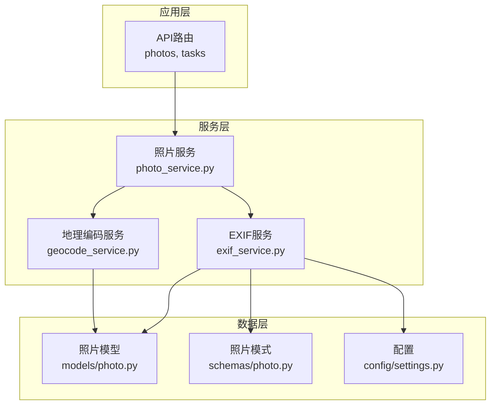
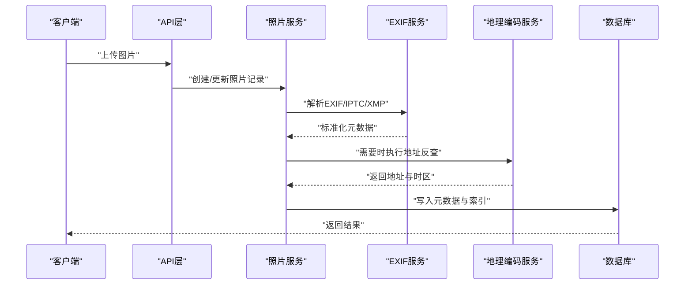
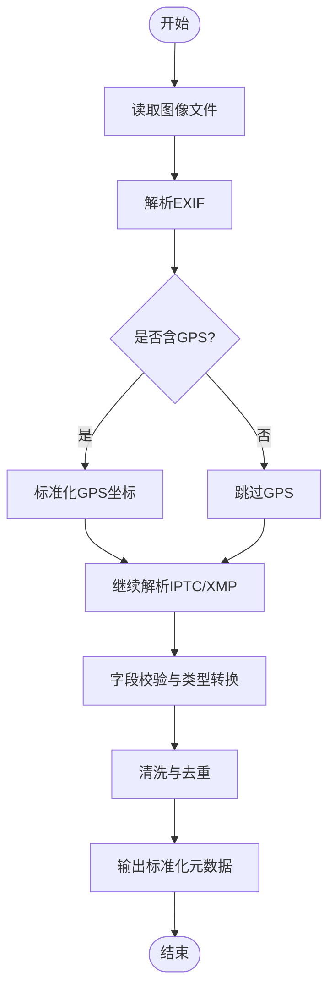
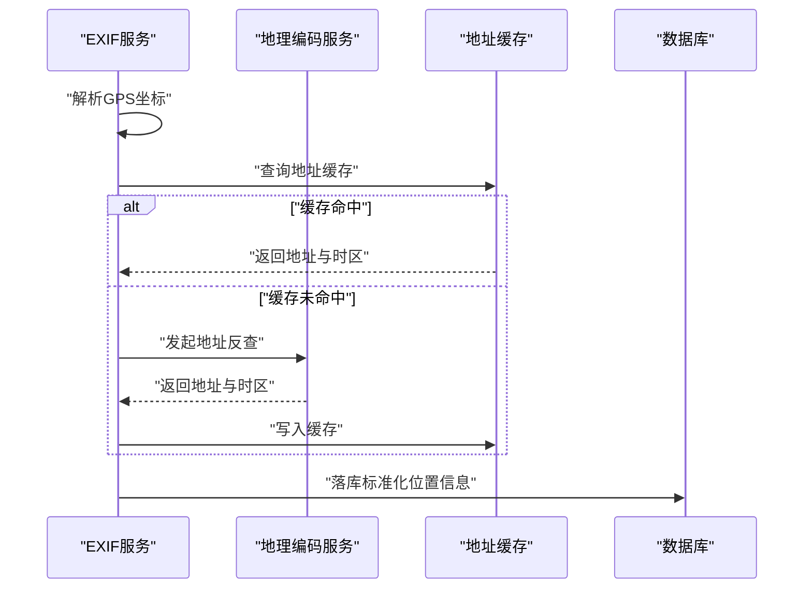
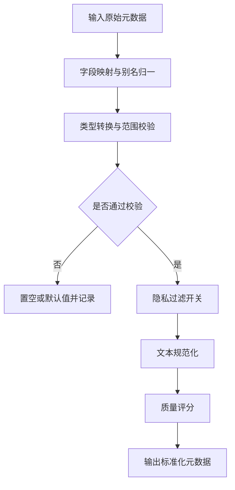
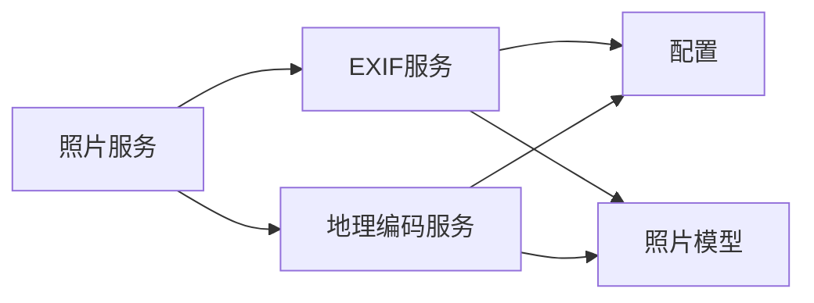

# EXIF元数据提取

<cite>
**本文引用的文件**   
- [exif_service.py](file://backend/app/services/exif_service.py)
- [geocode_service.py](file://backend/app/services/geocode_service.py)
- [photo_service.py](file://backend/app/services/photo_service.py)
- [photo.py](file://backend/app/models/photo.py)
- [photo.py](file://backend/app/schemas/photo.py)
- [test_exif.py](file://backend/app/services/test/test_exif.py)
- [test_geocode.py](file://backend/app/services/test/test_geocode.py)
- [settings.py](file://backend/app/config/settings.py)
</cite>

## 目录
1. [简介](#简介)
2. [项目结构](#项目结构)
3. [核心组件](#核心组件)
4. [架构总览](#架构总览)
5. [详细组件分析](#详细组件分析)
6. [依赖关系分析](#依赖关系分析)
7. [性能考虑](#性能考虑)
8. [故障排查指南](#故障排查指南)
9. [结论](#结论)
10. [附录](#附录)

## 简介
本技术文档围绕EXIF元数据提取系统，系统性阐述图片格式（EXIF、IPTC、XMP）的解析与兼容策略，地理位置信息的提取与标准化（GPS坐标转换、时区处理、地址反查服务集成），相机参数/拍摄时间/设备信息等元数据的提取与验证机制，以及元数据清洗与规范化流程（格式统一、无效数据处理、隐私信息过滤）。同时给出元数据索引优化策略，以提升查询性能与存储空间效率。

## 项目结构
本项目后端采用分层架构：API层调用服务层，服务层负责业务逻辑与外部服务交互，模型与模式定义数据契约，配置集中管理。与EXIF相关的核心代码位于服务层与测试用例中，并通过数据库模型持久化。

图表来源
- [exif_service.py](file://backend/app/services/exif_service.py)
- [geocode_service.py](file://backend/app/services/geocode_service.py)
- [photo_service.py](file://backend/app/services/photo_service.py)
- [photo.py](file://backend/app/models/photo.py)
- [photo.py](file://backend/app/schemas/photo.py)
- [settings.py](file://backend/app/config/settings.py)

章节来源
- [exif_service.py](file://backend/app/services/exif_service.py)
- [geocode_service.py](file://backend/app/services/geocode_service.py)
- [photo_service.py](file://backend/app/services/photo_service.py)
- [photo.py](file://backend/app/models/photo.py)
- [photo.py](file://backend/app/schemas/photo.py)
- [settings.py](file://backend/app/config/settings.py)

## 核心组件
- EXIF服务：负责读取并解析EXIF/IPTC/XMP等元数据，进行字段映射、校验、清洗与标准化，必要时触发地理编码任务。
- 地理编码服务：将GPS坐标转换为结构化地址，支持时区推断与异常回退。
- 照片服务：协调上传、元数据提取、存储与索引更新，串联EXIF与地理编码流程。
- 数据模型与模式：定义元数据在数据库中的结构与约束，确保一致性。
- 配置：提供外部服务密钥、超时、重试、开关等运行期参数。

章节来源
- [exif_service.py](file://backend/app/services/exif_service.py)
- [geocode_service.py](file://backend/app/services/geocode_service.py)
- [photo_service.py](file://backend/app/services/photo_service.py)
- [photo.py](file://backend/app/models/photo.py)
- [photo.py](file://backend/app/schemas/photo.py)
- [settings.py](file://backend/app/config/settings.py)

## 架构总览
下图展示了从图片上传到元数据落地与索引优化的端到端流程，包括EXIF解析、地理编码、清洗与入库。

图表来源
- [photo_service.py](file://backend/app/services/photo_service.py)
- [exif_service.py](file://backend/app/services/exif_service.py)
- [geocode_service.py](file://backend/app/services/geocode_service.py)
- [photo.py](file://backend/app/models/photo.py)

## 详细组件分析

### EXIF服务：多格式解析与兼容性处理
- 支持的元数据格式
  - EXIF：相机参数、拍摄时间、设备信息、缩略图、部分GPS信息。
  - IPTC：版权、作者、描述、关键词等新闻与出版常用字段。
  - XMP：扩展标记平台，包含更丰富的语义与自定义字段。
- 解析策略
  - 优先读取EXIF；若缺失关键信息则回退至IPTC/XMP。
  - 对不存在的标签使用默认值或空值，避免中断主流程。
  - 对数值型字段进行类型转换与范围校验，非法值置空并记录日志。
- 兼容性处理
  - 不同厂商对同一语义的标签命名不一致，建立字段别名映射表。
  - 对非标准或私有标签进行白名单过滤，防止污染数据结构。
  - 对损坏或不完整的图像头进行容错解析，尽可能提取可用片段。
- 输出规范
  - 统一字段名与单位（如角度为十进制度数，时间为UTC或带偏移的ISO字符串）。
  - 生成标准化对象供下游服务消费。

图表来源
- [exif_service.py](file://backend/app/services/exif_service.py)

章节来源
- [exif_service.py](file://backend/app/services/exif_service.py)
- [test_exif.py](file://backend/app/services/test/test_exif.py)

### 地理位置信息：提取、标准化与地址反查
- GPS坐标提取与转换
  - 支持度分秒与十进制度两种表示，统一转换为十进制度。
  - 校验经纬度范围与符号，异常值置空并记录告警。
- 时区处理
  - 基于拍摄时间与GPS位置推断时区，失败时回退到EXIF原始时区或UTC。
- 地址反查服务集成
  - 调用地理编码服务将坐标转为结构化地址（国家、省、市、区县、街道等）。
  - 支持缓存命中与降级策略，网络异常时保留坐标并延迟重试。
- 标准化输出
  - 输出统一的经纬度、地址层级、时区标识符，便于检索与展示。

图表来源
- [exif_service.py](file://backend/app/services/exif_service.py)
- [geocode_service.py](file://backend/app/services/geocode_service.py)

章节来源
- [exif_service.py](file://backend/app/services/exif_service.py)
- [geocode_service.py](file://backend/app/services/geocode_service.py)
- [test_geocode.py](file://backend/app/services/test/test_geocode.py)

### 相机参数、拍摄时间、设备信息：提取与验证
- 相机参数
  - 焦距、光圈、快门速度、ISO、曝光补偿、白平衡、测光模式等。
  - 对分数与科学计数法进行归一化，超出合理范围的字段置空。
- 拍摄时间
  - 优先使用EXIF拍摄时间，结合时区转换为本地时间或UTC。
  - 对缺失时间戳使用文件修改时间作为兜底，并标注来源。
- 设备信息
  - 品牌、型号、固件版本、镜头信息、传感器尺寸等。
  - 对未知厂商或模糊型号进行模糊匹配与别名合并。
- 验证机制
  - 字段存在性检查、类型检查、范围检查、一致性检查（如快门速度与曝光补偿的关系）。
  - 校验失败时保留原始值并记录诊断信息，便于后续人工复核。

章节来源
- [exif_service.py](file://backend/app/services/exif_service.py)
- [test_exif.py](file://backend/app/services/test/test_exif.py)

### 元数据清洗与规范化流程
- 格式统一
  - 日期时间统一为ISO 8601；角度统一为十进制度；长度单位为毫米或米。
  - 文本字段去除首尾空白、全角转半角、重复字符压缩。
- 无效数据处理
  - 空值、NaN、无穷大、越界值统一替换为空或默认值。
  - 冲突字段按优先级规则选择（EXIF > IPTC > XMP）。
- 隐私信息过滤
  - 可选过滤敏感字段（如序列号、内部路径、用户注释等）。
  - 提供开关控制，默认开启以保护隐私。
- 质量评分
  - 根据完整度、一致性、可信度计算元数据质量分，用于排序与推荐。

图表来源
- [exif_service.py](file://backend/app/services/exif_service.py)

章节来源
- [exif_service.py](file://backend/app/services/exif_service.py)

### 元数据索引优化策略
- 存储结构
  - 将常用检索字段（时间、地点、设备、标签）建索引，减少扫描开销。
  - 对长文本与JSON字段使用全文索引或倒排索引。
- 查询优化
  - 组合索引覆盖常见查询条件（如时间+地点、设备+标签）。
  - 分页与游标查询避免深分页性能问题。
- 空间效率
  - 对重复短文本进行字典压缩或外键化。
  - 冷热分离：历史照片归档到低成本存储，热数据保留高性能索引。
- 增量更新
  - 仅对变更字段重建索引，降低写放大。
  - 异步任务队列批量更新索引，削峰填谷。

章节来源
- [photo.py](file://backend/app/models/photo.py)
- [photo.py](file://backend/app/schemas/photo.py)
- [photo_service.py](file://backend/app/services/photo_service.py)

## 依赖关系分析
- 模块耦合
  - 照片服务依赖EXIF服务与地理编码服务，形成松耦合的服务间调用。
  - EXIF服务依赖配置中心获取外部服务密钥与行为开关。
- 外部依赖
  - 地理编码服务可能依赖第三方地图或地理编码API。
  - 数据库驱动与ORM框架用于持久化与查询。
- 潜在循环依赖
  - 当前设计无直接循环依赖，服务间通过接口与消息传递解耦。

图表来源
- [photo_service.py](file://backend/app/services/photo_service.py)
- [exif_service.py](file://backend/app/services/exif_service.py)
- [geocode_service.py](file://backend/app/services/geocode_service.py)
- [photo.py](file://backend/app/models/photo.py)
- [settings.py](file://backend/app/config/settings.py)

章节来源
- [photo_service.py](file://backend/app/services/photo_service.py)
- [exif_service.py](file://backend/app/services/exif_service.py)
- [geocode_service.py](file://backend/app/services/geocode_service.py)
- [photo.py](file://backend/app/models/photo.py)
- [settings.py](file://backend/app/config/settings.py)

## 性能考虑
- 解析并行化
  - 对大批量图片采用并发解析，限制并发度以避免I/O瓶颈。
- 缓存策略
  - 对已解析的元数据与地址结果进行缓存，缩短二次访问延迟。
- 批处理与流式处理
  - 大文件解析采用流式读取，降低内存占用。
  - 批量入库与索引更新，减少事务开销。
- 监控与限流
  - 对第三方地理编码服务设置超时与重试上限，避免雪崩。
  - 指标采集解析耗时、错误率与缓存命中率。

[本节为通用指导，无需特定文件引用]

## 故障排查指南
- 常见问题
  - 解析失败：检查文件格式与完整性，确认是否启用容错解析。
  - GPS缺失：确认图像是否包含GPS段，必要时回退到文件时间。
  - 地址反查失败：检查网络连通性与配额，启用降级策略。
- 定位方法
  - 查看服务日志中的错误码与堆栈信息。
  - 使用测试用例复现问题，对比期望与实际输出。
- 恢复措施
  - 清理缓存并重试。
  - 调整配置参数（超时、重试次数、并发度）。
  - 对脏数据进行离线清洗与回填。

章节来源
- [test_exif.py](file://backend/app/services/test/test_exif.py)
- [test_geocode.py](file://backend/app/services/test/test_geocode.py)

## 结论
本系统通过分层设计与模块化服务，实现了EXIF/IPTC/XMP的统一解析与标准化，结合地理位置信息与隐私过滤，提供了高质量、可检索的元数据能力。配合索引优化与缓存策略，可在大规模图片场景下保持良好性能与稳定性。建议持续完善字段别名库、提升容错与可观测性，并引入更多自动化测试以保障演进质量。

[本节为总结性内容，无需特定文件引用]

## 附录
- 术语
  - EXIF：可交换图像文件格式，常用于相机元数据。
  - IPTC：国际新闻传输标准，常用于媒体元数据。
  - XMP：可扩展标记平台，用于丰富语义与跨工具互操作。
- 参考实现路径
  - EXIF解析与清洗：参见EXIF服务实现与测试用例。
  - 地理编码与地址反查：参见地理编码服务与测试用例。
  - 数据模型与模式：参见照片模型与模式定义。
  - 配置项：参见配置中心文件。

章节来源
- [exif_service.py](file://backend/app/services/exif_service.py)
- [geocode_service.py](file://backend/app/services/geocode_service.py)
- [photo.py](file://backend/app/models/photo.py)
- [photo.py](file://backend/app/schemas/photo.py)
- [settings.py](file://backend/app/config/settings.py)