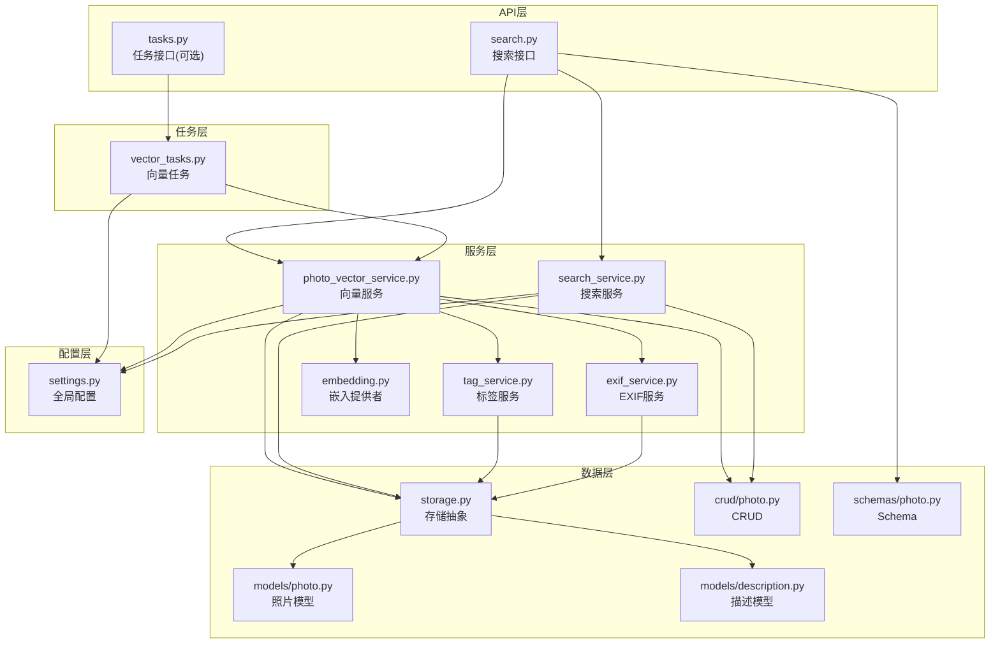
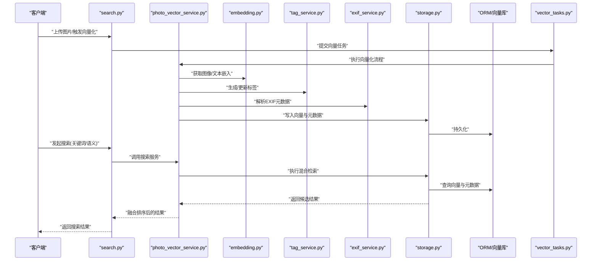
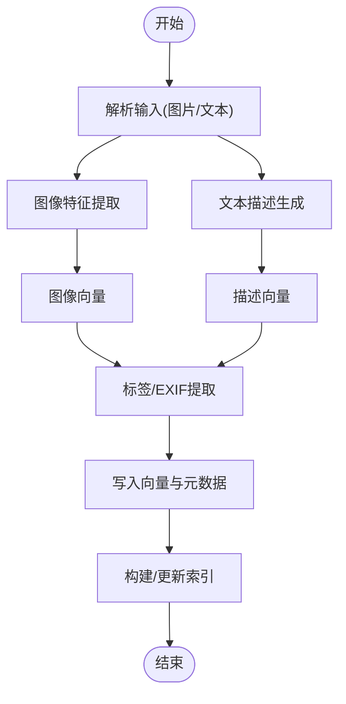
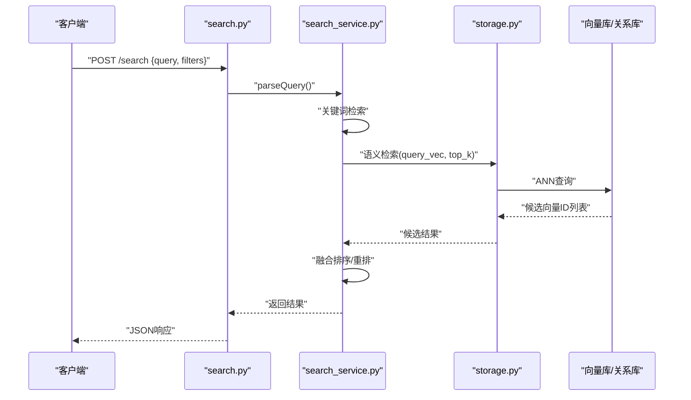
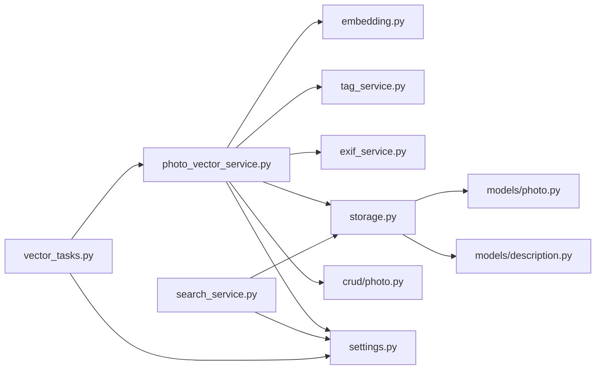

# 向量检索系统

<cite>
**本文引用的文件**   
- [backend/app/services/photo_vector_service.py](file://backend/app/services/photo_vector_service.py)
- [backend/app/services/search_service.py](file://backend/app/services/search_service.py)
- [backend/app/api/search.py](file://backend/app/api/search.py)
- [backend/app/services/tag_service.py](file://backend/app/services/tag_service.py)
- [backend/app/services/exif_service.py](file://backend/app/services/exif_service.py)
- [backend/app/services/ai_providers/embedding.py](file://backend/app/services/ai_providers/embedding.py)
- [backend/app/tasks/vector_tasks.py](file://backend/app/tasks/vector_tasks.py)
- [backend/app/database/storage.py](file://backend/app/database/storage.py)
- [backend/app/config/settings.py](file://backend/app/config/settings.py)
- [backend/app/models/photo.py](file://backend/app/models/photo.py)
- [backend/app/models/description.py](file://backend/app/models/description.py)
- [backend/app/crud/photo.py](file://backend/app/crud/photo.py)
- [backend/app/schemas/photo.py](file://backend/app/schemas/photo.py)
</cite>

## 目录
1. [简介](#简介)
2. [项目结构](#项目结构)
3. [核心组件](#核心组件)
4. [架构总览](#架构总览)
5. [详细组件分析](#详细组件分析)
6. [依赖关系分析](#依赖关系分析)
7. [性能考虑](#性能考虑)
8. [故障排查指南](#故障排查指南)
9. [结论](#结论)
10. [附录](#附录)

## 简介
本技术文档面向“AI相册”中的向量检索子系统，聚焦照片向量化处理的完整流程：图像特征提取、文本描述生成与向量索引构建；标签服务与EXIF信息提取的实现原理；向量数据库选型与配置（相似度算法与索引优化）；混合搜索方案（关键词+语义）；以及向量更新机制、增量索引与性能调优最佳实践。文档以代码级实现为依据，提供可视化架构图与流程图，帮助读者快速理解并落地相关能力。

## 项目结构
后端采用分层架构：API层暴露接口，服务层封装业务逻辑，任务层负责异步处理，数据访问层对接持久化存储与模型定义，配置层集中管理参数。向量检索相关的关键路径如下：
- API层：搜索入口、任务触发
- 服务层：向量服务、搜索服务、标签服务、EXIF服务、嵌入提供者
- 任务层：向量任务调度与执行
- 数据层：存储抽象、ORM模型、CRUD操作、Schema校验
- 配置层：向量库、嵌入模型、相似度策略等

图表来源
- [backend/app/api/search.py](file://backend/app/api/search.py)
- [backend/app/services/photo_vector_service.py](file://backend/app/services/photo_vector_service.py)
- [backend/app/services/search_service.py](file://backend/app/services/search_service.py)
- [backend/app/services/tag_service.py](file://backend/app/services/tag_service.py)
- [backend/app/services/exif_service.py](file://backend/app/services/exif_service.py)
- [backend/app/services/ai_providers/embedding.py](file://backend/app/services/ai_providers/embedding.py)
- [backend/app/tasks/vector_tasks.py](file://backend/app/tasks/vector_tasks.py)
- [backend/app/database/storage.py](file://backend/app/database/storage.py)
- [backend/app/models/photo.py](file://backend/app/models/photo.py)
- [backend/app/models/description.py](file://backend/app/models/description.py)
- [backend/app/crud/photo.py](file://backend/app/crud/photo.py)
- [backend/app/schemas/photo.py](file://backend/app/schemas/photo.py)
- [backend/app/config/settings.py](file://backend/app/config/settings.py)

章节来源
- [backend/app/api/search.py](file://backend/app/api/search.py)
- [backend/app/services/photo_vector_service.py](file://backend/app/services/photo_vector_service.py)
- [backend/app/services/search_service.py](file://backend/app/services/search_service.py)
- [backend/app/services/tag_service.py](file://backend/app/services/tag_service.py)
- [backend/app/services/exif_service.py](file://backend/app/services/exif_service.py)
- [backend/app/services/ai_providers/embedding.py](file://backend/app/services/ai_providers/embedding.py)
- [backend/app/tasks/vector_tasks.py](file://backend/app/tasks/vector_tasks.py)
- [backend/app/database/storage.py](file://backend/app/database/storage.py)
- [backend/app/models/photo.py](file://backend/app/models/photo.py)
- [backend/app/models/description.py](file://backend/app/models/description.py)
- [backend/app/crud/photo.py](file://backend/app/crud/photo.py)
- [backend/app/schemas/photo.py](file://backend/app/schemas/photo.py)
- [backend/app/config/settings.py](file://backend/app/config/settings.py)

## 核心组件
- 向量服务：负责图片特征提取、文本描述生成、向量入库与更新、批量任务编排。
- 搜索服务：实现混合检索（关键词+语义），聚合排序与结果过滤。
- 标签服务：从元数据、识别结果或LLM输出中抽取结构化标签，供检索与展示使用。
- EXIF服务：解析媒体文件的EXIF字段（时间、地点、相机信息等），用于筛选与增强检索体验。
- 嵌入提供者：统一封装不同嵌入模型的调用方式，返回标准化向量。
- 向量任务：异步队列驱动，完成耗时向量化与索引构建，支持重试与幂等。
- 存储抽象：对向量数据库与关系型数据库的统一访问封装，屏蔽底层差异。
- 模型与CRUD：照片、描述等实体的ORM映射与常用数据操作。
- Schema：请求/响应数据结构校验与序列化。
- 配置：向量库连接、相似度度量、索引参数、并发与批大小等。

章节来源
- [backend/app/services/photo_vector_service.py](file://backend/app/services/photo_vector_service.py)
- [backend/app/services/search_service.py](file://backend/app/services/search_service.py)
- [backend/app/services/tag_service.py](file://backend/app/services/tag_service.py)
- [backend/app/services/exif_service.py](file://backend/app/services/exif_service.py)
- [backend/app/services/ai_providers/embedding.py](file://backend/app/services/ai_providers/embedding.py)
- [backend/app/tasks/vector_tasks.py](file://backend/app/tasks/vector_tasks.py)
- [backend/app/database/storage.py](file://backend/app/database/storage.py)
- [backend/app/models/photo.py](file://backend/app/models/photo.py)
- [backend/app/models/description.py](file://backend/app/models/description.py)
- [backend/app/crud/photo.py](file://backend/app/crud/photo.py)
- [backend/app/schemas/photo.py](file://backend/app/schemas/photo.py)
- [backend/app/config/settings.py](file://backend/app/config/settings.py)

## 架构总览
下图展示了从上传到检索的端到端流程：上传后触发任务，任务执行图像特征提取与文本描述生成，写入向量库与关系型数据库；用户发起搜索时，服务层同时执行关键词匹配与语义检索，最终融合排序返回。

图表来源
- [backend/app/api/search.py](file://backend/app/api/search.py)
- [backend/app/services/photo_vector_service.py](file://backend/app/services/photo_vector_service.py)
- [backend/app/services/ai_providers/embedding.py](file://backend/app/services/ai_providers/embedding.py)
- [backend/app/services/tag_service.py](file://backend/app/services/tag_service.py)
- [backend/app/services/exif_service.py](file://backend/app/services/exif_service.py)
- [backend/app/database/storage.py](file://backend/app/database/storage.py)
- [backend/app/tasks/vector_tasks.py](file://backend/app/tasks/vector_tasks.py)

## 详细组件分析

### 照片向量化流程
- 输入：原始图片文件、可选文本提示或上下文。
- 步骤：
  - 图像特征提取：通过嵌入提供者将图片编码为高维向量。
  - 文本描述生成：基于图片内容或外部标注生成自然语言描述，再编码为向量。
  - 标签与EXIF：并行抽取结构化标签与EXIF元数据，作为辅助检索维度。
  - 向量入库：将主向量、描述向量与元数据写入向量库与关系型数据库。
  - 索引构建：根据配置创建或更新近似最近邻索引。
- 关键设计：
  - 幂等性：按唯一ID去重，避免重复入库。
  - 批处理：批量编码与批量写入，提升吞吐。
  - 失败重试：任务失败自动重试，记录日志与状态。

图表来源
- [backend/app/services/photo_vector_service.py](file://backend/app/services/photo_vector_service.py)
- [backend/app/services/ai_providers/embedding.py](file://backend/app/services/ai_providers/embedding.py)
- [backend/app/services/tag_service.py](file://backend/app/services/tag_service.py)
- [backend/app/services/exif_service.py](file://backend/app/services/exif_service.py)
- [backend/app/database/storage.py](file://backend/app/database/storage.py)

章节来源
- [backend/app/services/photo_vector_service.py](file://backend/app/services/photo_vector_service.py)
- [backend/app/services/ai_providers/embedding.py](file://backend/app/services/ai_providers/embedding.py)
- [backend/app/services/tag_service.py](file://backend/app/services/tag_service.py)
- [backend/app/services/exif_service.py](file://backend/app/services/exif_service.py)
- [backend/app/database/storage.py](file://backend/app/database/storage.py)

### 标签服务
- 功能：从多源（识别结果、LLM输出、规则）抽取标签，形成结构化集合。
- 策略：
  - 去重与合并：同义词归一、层级标签折叠。
  - 权重计算：依据置信度或出现频率赋予权重，用于排序与过滤。
  - 缓存：热点标签缓存，降低重复计算。
- 集成点：在向量入库前同步生成标签，供后续关键词检索与过滤使用。

章节来源
- [backend/app/services/tag_service.py](file://backend/app/services/tag_service.py)

### EXIF信息提取
- 功能：读取媒体文件EXIF字段（拍摄时间、GPS、设备型号等）。
- 用途：
  - 时间/地理范围筛选。
  - 辅助排序（如按时间倒序）。
  - 展示增强（显示拍摄信息）。
- 健壮性：缺失或不支持的字段安全降级，不影响主流程。

章节来源
- [backend/app/services/exif_service.py](file://backend/app/services/exif_service.py)

### 嵌入提供者
- 职责：统一封装不同嵌入模型的调用，返回标准化向量。
- 特性：
  - 可插拔：支持多种后端（本地/云端）。
  - 批处理：批量编码减少网络往返。
  - 错误处理：超时、限流、重试与回退策略。

章节来源
- [backend/app/services/ai_providers/embedding.py](file://backend/app/services/ai_providers/embedding.py)

### 搜索服务（混合搜索）
- 目标：结合关键词检索与语义检索优势，提高召回与精度。
- 流程：
  - 解析查询：分词、同义词扩展、停用词过滤。
  - 关键词检索：基于标签/标题/描述的全文匹配。
  - 语义检索：基于查询向量进行近似最近邻搜索。
  - 融合排序：加权融合、重排与去重。
  - 过滤与分页：按时间、地点、标签等条件过滤。
- 配置项：关键词权重、语义权重、TopK、相似度阈值等。

图表来源
- [backend/app/api/search.py](file://backend/app/api/search.py)
- [backend/app/services/search_service.py](file://backend/app/services/search_service.py)
- [backend/app/database/storage.py](file://backend/app/database/storage.py)

章节来源
- [backend/app/api/search.py](file://backend/app/api/search.py)
- [backend/app/services/search_service.py](file://backend/app/services/search_service.py)
- [backend/app/database/storage.py](file://backend/app/database/storage.py)

### 向量任务（异步与增量）
- 触发：上传、批量导入、定时重建。
- 执行：
  - 拉取待处理记录，检查幂等标记。
  - 并行执行嵌入与元数据处理。
  - 批量写入与索引更新。
  - 失败重试与死信队列。
- 增量：仅处理新增/变更条目，支持断点续跑。

章节来源
- [backend/app/tasks/vector_tasks.py](file://backend/app/tasks/vector_tasks.py)
- [backend/app/services/photo_vector_service.py](file://backend/app/services/photo_vector_service.py)

### 存储抽象与模型
- 存储抽象：统一向量库与关系型数据库访问，提供插入、更新、删除、查询接口。
- 模型：
  - 照片实体：包含路径、哈希、时间戳、外键关联等。
  - 描述实体：与照片一对一或多对一关联，保存文本描述与向量。
- CRUD：封装常用操作，保证事务性与一致性。

章节来源
- [backend/app/database/storage.py](file://backend/app/database/storage.py)
- [backend/app/models/photo.py](file://backend/app/models/photo.py)
- [backend/app/models/description.py](file://backend/app/models/description.py)
- [backend/app/crud/photo.py](file://backend/app/crud/photo.py)
- [backend/app/schemas/photo.py](file://backend/app/schemas/photo.py)

## 依赖关系分析
- 组件耦合：
  - 向量服务依赖嵌入提供者、标签服务、EXIF服务与存储抽象。
  - 搜索服务依赖存储抽象与配置。
  - 任务层依赖向量服务与配置。
- 外部依赖：
  - 向量数据库（ANN索引、相似度度量）。
  - 嵌入模型提供方（本地或云端）。
  - ORM与关系型数据库。
- 潜在循环：通过服务层解耦与接口抽象避免循环依赖。

图表来源
- [backend/app/services/photo_vector_service.py](file://backend/app/services/photo_vector_service.py)
- [backend/app/services/ai_providers/embedding.py](file://backend/app/services/ai_providers/embedding.py)
- [backend/app/services/tag_service.py](file://backend/app/services/tag_service.py)
- [backend/app/services/exif_service.py](file://backend/app/services/exif_service.py)
- [backend/app/database/storage.py](file://backend/app/database/storage.py)
- [backend/app/models/photo.py](file://backend/app/models/photo.py)
- [backend/app/models/description.py](file://backend/app/models/description.py)
- [backend/app/crud/photo.py](file://backend/app/crud/photo.py)
- [backend/app/config/settings.py](file://backend/app/config/settings.py)

章节来源
- [backend/app/services/photo_vector_service.py](file://backend/app/services/photo_vector_service.py)
- [backend/app/services/search_service.py](file://backend/app/services/search_service.py)
- [backend/app/tasks/vector_tasks.py](file://backend/app/tasks/vector_tasks.py)
- [backend/app/database/storage.py](file://backend/app/database/storage.py)
- [backend/app/config/settings.py](file://backend/app/config/settings.py)

## 性能考虑
- 向量库选择与配置
  - 相似度算法：余弦相似度适用于归一化向量；内积适合未归一化场景。
  - 索引类型：HNSW/IVF/PQ等，根据数据规模与延迟要求选择。
  - 参数调优：efConstruction、M、efSearch、nlist/nsubquantizer等。
- 批处理与并发
  - 批量编码与写入，减少IO与网络开销。
  - 合理设置并发度，避免资源争用。
- 内存与磁盘
  - 控制批次大小，防止OOM。
  - 定期压缩与清理过期索引。
- 缓存与预热
  - 热点查询缓存。
  - 启动时预加载必要索引。
- 监控与告警
  - 记录P95/P99延迟、吞吐、错误率。
  - 指标看板与自动扩缩容。

[本节为通用指导，不直接分析具体文件]

## 故障排查指南
- 常见问题
  - 向量入库失败：检查幂等键、向量维度、数据类型与权限。
  - 检索超时：调整efSearch、TopK、并发与批大小。
  - 嵌入模型异常：重试、降级、切换备用模型。
  - EXIF缺失：安全降级，不影响主流程。
- 定位方法
  - 查看任务日志与重试次数。
  - 核对配置项与连接参数。
  - 验证Schema校验是否通过。
- 恢复策略
  - 增量重建：仅处理失败或变更条目。
  - 回滚与快照：索引重建前备份。

章节来源
- [backend/app/tasks/vector_tasks.py](file://backend/app/tasks/vector_tasks.py)
- [backend/app/services/photo_vector_service.py](file://backend/app/services/photo_vector_service.py)
- [backend/app/config/settings.py](file://backend/app/config/settings.py)

## 结论
本系统围绕“图像特征提取—文本描述生成—向量索引构建—混合检索”的主线，通过服务层解耦与任务层异步化，实现了可扩展、高性能的照片向量检索能力。配合标签与EXIF增强，兼顾了语义理解与精确过滤。通过合理的向量库配置与索引优化，可在大规模数据下保持低延迟与高吞吐。建议在生产环境完善监控与自动化运维，持续迭代模型与索引策略。

[本节为总结，不直接分析具体文件]

## 附录
- 术语
  - ANN：近似最近邻搜索。
  - HNSW：层次导航小世界图索引。
  - IVF：倒排文件索引。
  - PQ：乘积量化。
- 参考路径
  - 向量服务实现：[backend/app/services/photo_vector_service.py](file://backend/app/services/photo_vector_service.py)
  - 搜索服务实现：[backend/app/services/search_service.py](file://backend/app/services/search_service.py)
  - 嵌入提供者：[backend/app/services/ai_providers/embedding.py](file://backend/app/services/ai_providers/embedding.py)
  - 标签服务：[backend/app/services/tag_service.py](file://backend/app/services/tag_service.py)
  - EXIF服务：[backend/app/services/exif_service.py](file://backend/app/services/exif_service.py)
  - 向量任务：[backend/app/tasks/vector_tasks.py](file://backend/app/tasks/vector_tasks.py)
  - 存储抽象：[backend/app/database/storage.py](file://backend/app/database/storage.py)
  - 模型与CRUD：[backend/app/models/photo.py](file://backend/app/models/photo.py)、[backend/app/models/description.py](file://backend/app/models/description.py)、[backend/app/crud/photo.py](file://backend/app/crud/photo.py)
  - Schema校验：[backend/app/schemas/photo.py](file://backend/app/schemas/photo.py)
  - 配置：[backend/app/config/settings.py](file://backend/app/config/settings.py)