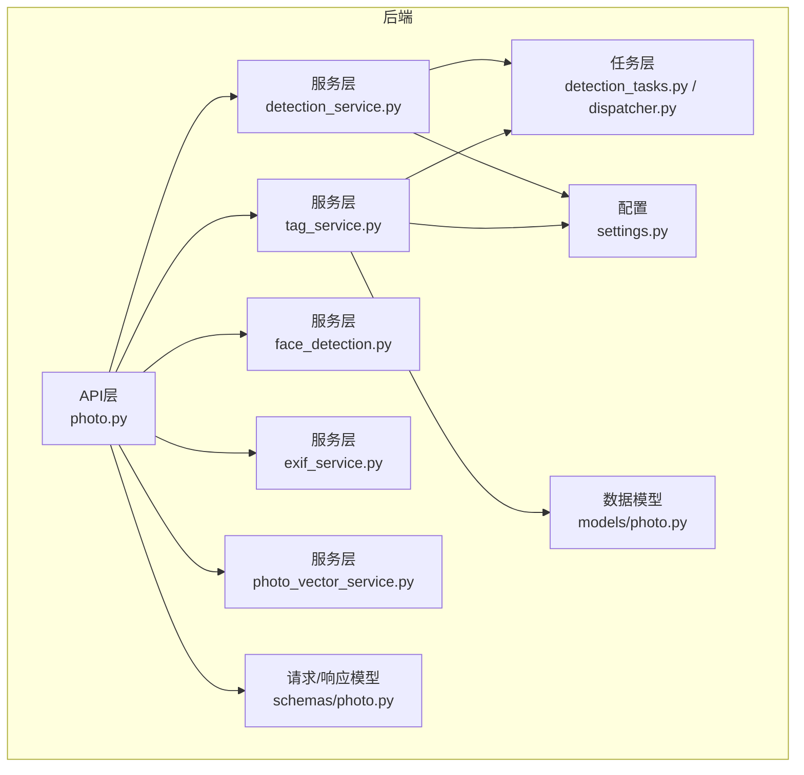
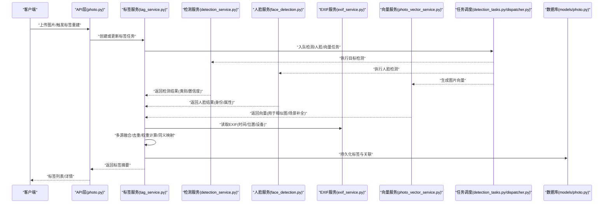
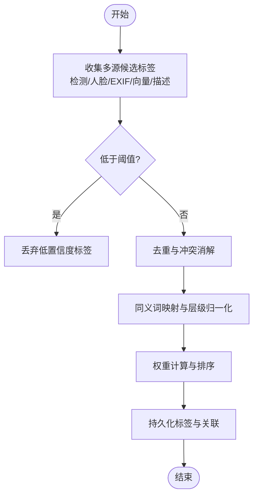
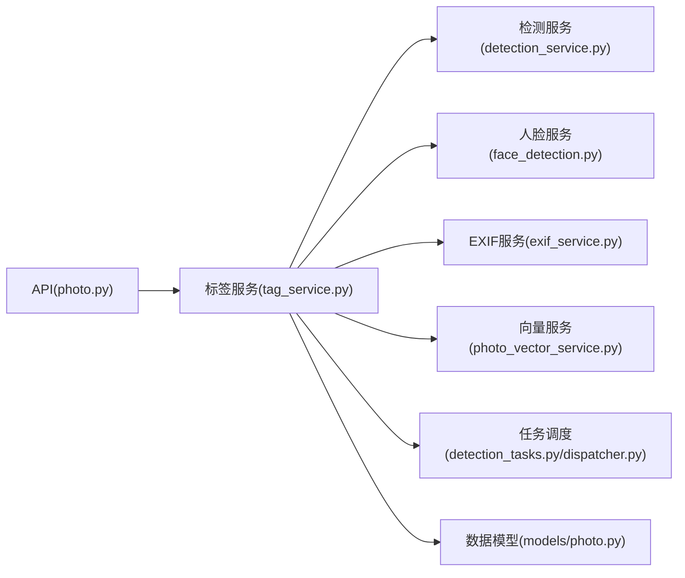

# 智能标签提取

<cite>
**本文引用的文件**   
- [backend/app/services/tag_service.py](file://backend/app/services/tag_service.py)
- [backend/app/services/detection_service.py](file://backend/app/services/detection_service.py)
- [backend/app/services/face_detection.py](file://backend/app/services/face_detection.py)
- [backend/app/services/exif_service.py](file://backend/app/services/exif_service.py)
- [backend/app/services/photo_vector_service.py](file://backend/app/services/photo_vector_service.py)
- [backend/app/services/search_service.py](file://backend/app/services/search_service.py)
- [backend/app/api/photo.py](file://backend/app/api/photo.py)
- [backend/app/models/photo.py](file://backend/app/models/photo.py)
- [backend/app/schemas/photo.py](file://backend/app/schemas/photo.py)
- [backend/app/tasks/detection_tasks.py](file://backend/app/tasks/detection_tasks.py)
- [backend/app/tasks/dispatcher.py](file://backend/app/tasks/dispatcher.py)
- [backend/app/config/settings.py](file://backend/app/config/settings.py)
- [backend/main.py](file://backend/main.py)
</cite>

## 目录
1. [简介](#简介)
2. [项目结构](#项目结构)
3. [核心组件](#核心组件)
4. [架构总览](#架构总览)
5. [详细组件分析](#详细组件分析)
6. [依赖关系分析](#依赖关系分析)
7. [性能考虑](#性能考虑)
8. [故障排查指南](#故障排查指南)
9. [结论](#结论)
10. [附录](#附录)

## 简介
本技术文档围绕“智能标签提取系统”的实现与使用，系统性阐述基于AI的物体检测、场景识别与语义理解在相册系统中的落地方式。文档重点覆盖：
- 标签分类体系设计原则：层次化标签结构、同义词映射与权重计算
- 多模型协作机制：目标检测、场景分类与文本描述模型的融合策略
- 标签质量评估与过滤：置信度阈值、去重与噪声清理
- 标签扩展机制：自定义标签库与领域特定标签集成
- 端到端流程：从图片上传到标签落库与检索的全链路

## 项目结构
后端采用分层架构：API层暴露接口，服务层封装业务逻辑（含标签、检测、向量检索等），任务层负责异步处理，配置与数据模型位于对应模块中。前端通过REST API与后端交互。

图表来源
- [backend/main.py:1-200](file://backend/main.py#L1-L200)
- [backend/app/api/photo.py:1-200](file://backend/app/api/photo.py#L1-L200)
- [backend/app/services/tag_service.py:1-200](file://backend/app/services/tag_service.py#L1-L200)
- [backend/app/services/detection_service.py:1-200](file://backend/app/services/detection_service.py#L1-L200)
- [backend/app/services/face_detection.py:1-200](file://backend/app/services/face_detection.py#L1-L200)
- [backend/app/services/exif_service.py:1-200](file://backend/app/services/exif_service.py#L1-L200)
- [backend/app/services/photo_vector_service.py:1-200](file://backend/app/services/photo_vector_service.py#L1-L200)
- [backend/app/tasks/detection_tasks.py:1-200](file://backend/app/tasks/detection_tasks.py#L1-L200)
- [backend/app/tasks/dispatcher.py:1-200](file://backend/app/tasks/dispatcher.py#L1-L200)
- [backend/app/config/settings.py:1-200](file://backend/app/config/settings.py#L1-L200)
- [backend/app/models/photo.py:1-200](file://backend/app/models/photo.py#L1-L200)
- [backend/app/schemas/photo.py:1-200](file://backend/app/schemas/photo.py#L1-L200)

章节来源
- [backend/main.py:1-200](file://backend/main.py#L1-L200)
- [backend/app/api/photo.py:1-200](file://backend/app/api/photo.py#L1-L200)
- [backend/app/services/tag_service.py:1-200](file://backend/app/services/tag_service.py#L1-L200)
- [backend/app/services/detection_service.py:1-200](file://backend/app/services/detection_service.py#L1-L200)
- [backend/app/services/face_detection.py:1-200](file://backend/app/services/face_detection.py#L1-L200)
- [backend/app/services/exif_service.py:1-200](file://backend/app/services/exif_service.py#L1-L200)
- [backend/app/services/photo_vector_service.py:1-200](file://backend/app/services/photo_vector_service.py#L1-L200)
- [backend/app/tasks/detection_tasks.py:1-200](file://backend/app/tasks/detection_tasks.py#L1-L200)
- [backend/app/tasks/dispatcher.py:1-200](file://backend/app/tasks/dispatcher.py#L1-L200)
- [backend/app/config/settings.py:1-200](file://backend/app/config/settings.py#L1-L200)
- [backend/app/models/photo.py:1-200](file://backend/app/models/photo.py#L1-L200)
- [backend/app/schemas/photo.py:1-200](file://backend/app/schemas/photo.py#L1-L200)

## 核心组件
- 标签服务（Tag Service）
  - 职责：聚合多源信号（检测、人脸、EXIF、向量相似度、LLM描述）生成综合标签；执行去重、合并、权重计算与持久化。
  - 关键能力：层次化标签归一化、同义词映射、置信度阈值控制、重复与噪声清理、扩展标签注入。
- 检测服务（Detection Service）
  - 职责：调用目标检测与人脸检测模型，产出边界框、类别与置信度；为标签提供细粒度实体级证据。
- EXIF服务（Exif Service）
  - 职责：解析拍摄设备、时间、地理位置等元信息，辅助场景与地点类标签推断。
- 向量服务（Vector Service）
  - 职责：将图片编码为向量，用于相似图检索与跨模态对齐，辅助场景与主题标签补充。
- 搜索服务（Search Service）
  - 职责：基于标签与向量进行混合检索，支撑“以图搜图”和“自然语言/关键词搜索”。
- 任务调度（Tasks & Dispatcher）
  - 职责：将耗时推理任务异步化，解耦API与模型推理，提升吞吐与稳定性。

章节来源
- [backend/app/services/tag_service.py:1-200](file://backend/app/services/tag_service.py#L1-L200)
- [backend/app/services/detection_service.py:1-200](file://backend/app/services/detection_service.py#L1-L200)
- [backend/app/services/face_detection.py:1-200](file://backend/app/services/face_detection.py#L1-L200)
- [backend/app/services/exif_service.py:1-200](file://backend/app/services/exif_service.py#L1-L200)
- [backend/app/services/photo_vector_service.py:1-200](file://backend/app/services/photo_vector_service.py#L1-L200)
- [backend/app/services/search_service.py:1-200](file://backend/app/services/search_service.py#L1-L200)
- [backend/app/tasks/detection_tasks.py:1-200](file://backend/app/tasks/detection_tasks.py#L1-L200)
- [backend/app/tasks/dispatcher.py:1-200](file://backend/app/tasks/dispatcher.py#L1-L200)

## 架构总览
整体采用“API -> 服务 -> 任务 -> 存储/外部模型”的分层架构。标签提取作为核心编排点，协调检测、人脸、EXIF、向量与可选LLM描述等多路信号，最终输出结构化标签集合。

图表来源
- [backend/app/api/photo.py:1-200](file://backend/app/api/photo.py#L1-L200)
- [backend/app/services/tag_service.py:1-200](file://backend/app/services/tag_service.py#L1-L200)
- [backend/app/services/detection_service.py:1-200](file://backend/app/services/detection_service.py#L1-L200)
- [backend/app/services/face_detection.py:1-200](file://backend/app/services/face_detection.py#L1-L200)
- [backend/app/services/exif_service.py:1-200](file://backend/app/services/exif_service.py#L1-L200)
- [backend/app/services/photo_vector_service.py:1-200](file://backend/app/services/photo_vector_service.py#L1-L200)
- [backend/app/tasks/detection_tasks.py:1-200](file://backend/app/tasks/detection_tasks.py#L1-L200)
- [backend/app/tasks/dispatcher.py:1-200](file://backend/app/tasks/dispatcher.py#L1-L200)
- [backend/app/models/photo.py:1-200](file://backend/app/models/photo.py#L1-L200)

## 详细组件分析

### 标签服务（Tag Service）
- 功能要点
  - 多源输入：检测实体、人脸、EXIF、向量相似图、可选LLM描述
  - 标签规范化：统一大小写、去除停用词、层级归一化（如“狗/犬科/动物”）
  - 同义词映射：将不同表述映射到标准标签（如“汽车/轿车/机动车”）
  - 权重计算：按来源可信度、出现频次、上下文相关性加权
  - 质量控制：置信度阈值、重复去重、噪声清理（低置信度/冲突标签）
  - 扩展机制：支持自定义标签库与领域标签注入
- 数据结构建议
  - 标签项：包含名称、层级路径、权重、来源、置信度、时间戳
  - 映射表：同义词字典、层级树、领域白名单
- 算法流程（概念性）
  - 收集各源候选标签及置信度
  - 应用阈值过滤与去重
  - 执行同义合并与层级提升
  - 计算最终权重并排序
  - 写入数据库并建立索引

章节来源
- [backend/app/services/tag_service.py:1-200](file://backend/app/services/tag_service.py#L1-L200)

### 检测服务（Detection Service）
- 功能要点
  - 调用目标检测模型，输出类别、置信度、边界框
  - 与人脸检测协同，避免重复标注（如“人”与具体身份）
  - 将检测结果转换为标签候选，附带空间证据（可用于后续定位相关标签）
- 与标签服务的协作
  - 提供高置信度的实体级标签
  - 对稀有类别启用更严格的阈值策略

章节来源
- [backend/app/services/detection_service.py:1-200](file://backend/app/services/detection_service.py#L1-L200)
- [backend/app/services/face_detection.py:1-200](file://backend/app/services/face_detection.py#L1-L200)

### EXIF服务（Exif Service）
- 功能要点
  - 解析拍摄时间、地理位置、设备型号等
  - 将地点与时间信息转化为场景/活动类标签（如“海边日落”、“室内会议”）
- 与标签服务的协作
  - 提供强先验的场景线索，提高场景类标签准确率

章节来源
- [backend/app/services/exif_service.py:1-200](file://backend/app/services/exif_service.py#L1-L200)

### 向量服务（Vector Service）
- 功能要点
  - 将图片编码为向量，用于相似图检索与跨模态对齐
  - 结合历史相似图的标签，进行标签补全与去噪
- 与标签服务的协作
  - 当单图置信度不足时，利用相似图标签进行投票式增强

章节来源
- [backend/app/services/photo_vector_service.py:1-200](file://backend/app/services/photo_vector_service.py#L1-L200)

### 搜索服务（Search Service）
- 功能要点
  - 基于标签与向量的混合检索
  - 支持关键词、自然语言与相似图查询
- 与标签服务的协作
  - 标签质量直接影响检索精度；需保证标签一致性、去重与标准化

章节来源
- [backend/app/services/search_service.py:1-200](file://backend/app/services/search_service.py#L1-L200)

### 任务调度（Tasks & Dispatcher）
- 功能要点
  - 将检测、人脸、向量等耗时操作异步化
  - 提供重试、超时与失败回退机制
- 与标签服务的协作
  - 标签服务仅编排任务，不阻塞API响应

章节来源
- [backend/app/tasks/detection_tasks.py:1-200](file://backend/app/tasks/detection_tasks.py#L1-L200)
- [backend/app/tasks/dispatcher.py:1-200](file://backend/app/tasks/dispatcher.py#L1-L200)

### API层与数据模型
- API层（photo.py）
  - 接收上传与重建请求，校验参数，调用标签服务
  - 返回标签摘要与状态
- 数据模型（models/photo.py, schemas/photo.py）
  - 定义照片、标签及其关系的持久化结构
  - 约束字段类型与必填项，保障数据一致性

章节来源
- [backend/app/api/photo.py:1-200](file://backend/app/api/photo.py#L1-L200)
- [backend/app/models/photo.py:1-200](file://backend/app/models/photo.py#L1-L200)
- [backend/app/schemas/photo.py:1-200](file://backend/app/schemas/photo.py#L1-L200)

## 依赖关系分析
- 组件耦合
  - 标签服务为核心枢纽，依赖检测、人脸、EXIF、向量与任务调度
  - API层仅面向服务层，保持松耦合
- 外部依赖
  - 模型推理（检测/人脸/向量）
  - 数据库与对象存储（照片与标签持久化）
- 潜在循环依赖
  - 服务层之间应避免直接互相调用，统一通过任务或事件总线解耦

图表来源
- [backend/app/api/photo.py:1-200](file://backend/app/api/photo.py#L1-L200)
- [backend/app/services/tag_service.py:1-200](file://backend/app/services/tag_service.py#L1-L200)
- [backend/app/services/detection_service.py:1-200](file://backend/app/services/detection_service.py#L1-L200)
- [backend/app/services/face_detection.py:1-200](file://backend/app/services/face_detection.py#L1-L200)
- [backend/app/services/exif_service.py:1-200](file://backend/app/services/exif_service.py#L1-L200)
- [backend/app/services/photo_vector_service.py:1-200](file://backend/app/services/photo_vector_service.py#L1-L200)
- [backend/app/tasks/detection_tasks.py:1-200](file://backend/app/tasks/detection_tasks.py#L1-L200)
- [backend/app/tasks/dispatcher.py:1-200](file://backend/app/tasks/dispatcher.py#L1-L200)
- [backend/app/models/photo.py:1-200](file://backend/app/models/photo.py#L1-L200)

章节来源
- [backend/app/api/photo.py:1-200](file://backend/app/api/photo.py#L1-L200)
- [backend/app/services/tag_service.py:1-200](file://backend/app/services/tag_service.py#L1-L200)
- [backend/app/services/detection_service.py:1-200](file://backend/app/services/detection_service.py#L1-L200)
- [backend/app/services/face_detection.py:1-200](file://backend/app/services/face_detection.py#L1-L200)
- [backend/app/services/exif_service.py:1-200](file://backend/app/services/exif_service.py#L1-L200)
- [backend/app/services/photo_vector_service.py:1-200](file://backend/app/services/photo_vector_service.py#L1-L200)
- [backend/app/tasks/detection_tasks.py:1-200](file://backend/app/tasks/detection_tasks.py#L1-L200)
- [backend/app/tasks/dispatcher.py:1-200](file://backend/app/tasks/dispatcher.py#L1-L200)
- [backend/app/models/photo.py:1-200](file://backend/app/models/photo.py#L1-L200)

## 性能考虑
- 异步化与批处理
  - 将检测、人脸、向量等耗时任务放入队列，批量处理降低GPU/CPU抖动
- 缓存与增量更新
  - 对稳定标签（如EXIF派生）做缓存；仅对变更部分重新计算
- 阈值与召回权衡
  - 根据业务需求调整置信度阈值，平衡误检与漏检
- 资源隔离
  - 不同模型推理进程隔离，避免相互抢占导致延迟抖动

[本节为通用指导，无需代码引用]

## 故障排查指南
- 常见问题
  - 标签缺失：检查检测/人脸/向量任务是否成功完成；确认阈值设置是否过严
  - 标签噪声：查看低置信度标签是否被正确过滤；核对同义词映射是否完整
  - 重复标签：确认去重逻辑是否生效；检查层级归一化是否正确
  - 性能瓶颈：监控任务队列积压情况；评估模型并发与批大小
- 定位方法
  - 查看任务日志与错误堆栈
  - 对比原始检测结果与最终标签差异
  - 验证配置项（阈值、映射表、扩展库）是否生效

章节来源
- [backend/app/tasks/detection_tasks.py:1-200](file://backend/app/tasks/detection_tasks.py#L1-L200)
- [backend/app/tasks/dispatcher.py:1-200](file://backend/app/tasks/dispatcher.py#L1-L200)
- [backend/app/config/settings.py:1-200](file://backend/app/config/settings.py#L1-L200)

## 结论
智能标签提取系统通过多模型协作与严格的质量控制，实现了高精度、可扩展的标签生成。其核心在于：
- 多源融合：检测、人脸、EXIF、向量与可选LLM描述互补
- 质量控制：阈值、去重、同义映射与噪声清理
- 扩展能力：自定义标签库与领域标签无缝集成
- 工程化：异步任务与分层架构确保可维护性与高性能

[本节为总结性内容，无需代码引用]

## 附录

### 标签分类体系设计原则
- 层次化结构
  - 根节点（如“人物/动物/场景/物品”）
  - 中间节点（如“人物->人像/合影”，“动物->犬科/猫科”）
  - 叶子节点（具体实体，如“金毛犬/布偶猫”）
- 同义词映射
  - 建立同义词词典，将口语化/别名映射到标准标签
  - 支持地区/语言变体
- 权重计算
  - 来源权重：检测>人脸>EXIF>向量相似>LLM描述（可按业务调整）
  - 证据强度：置信度、数量、空间一致性
  - 上下文修正：时间/地点/设备先验

[本节为概念说明，无需代码引用]

### 多模型协作机制
- 目标检测模型：提供细粒度实体与置信度
- 场景分类模型：提供全局场景标签（如“海滩/会议室”）
- 文本描述模型：提供自然语言描述，辅助主题与活动标签
- 融合策略
  - 证据聚合：将多源标签统一到同一命名空间
  - 冲突消解：依据权重与上下文选择最优标签
  - 动态阈值：根据场景复杂度自适应调整

[本节为概念说明，无需代码引用]

### 标签质量评估与过滤策略
- 置信度阈值
  - 全局阈值与类别阈值并存
  - 冷启动阶段放宽阈值，逐步收紧
- 重复标签去重
  - 基于同义词与层级路径去重
  - 保留最高权重实例
- 噪声标签清理
  - 剔除极低置信度与无上下文支持的标签
  - 对异常分布标签进行人工复核

[本节为概念说明，无需代码引用]

### 标签扩展机制
- 自定义标签库
  - 支持导入CSV/JSON标签集，自动构建同义词与层级
- 领域特定标签
  - 针对行业场景（如医疗影像、工业质检）定制标签树
- 版本管理
  - 标签库版本化，支持灰度发布与回滚

[本节为概念说明，无需代码引用]