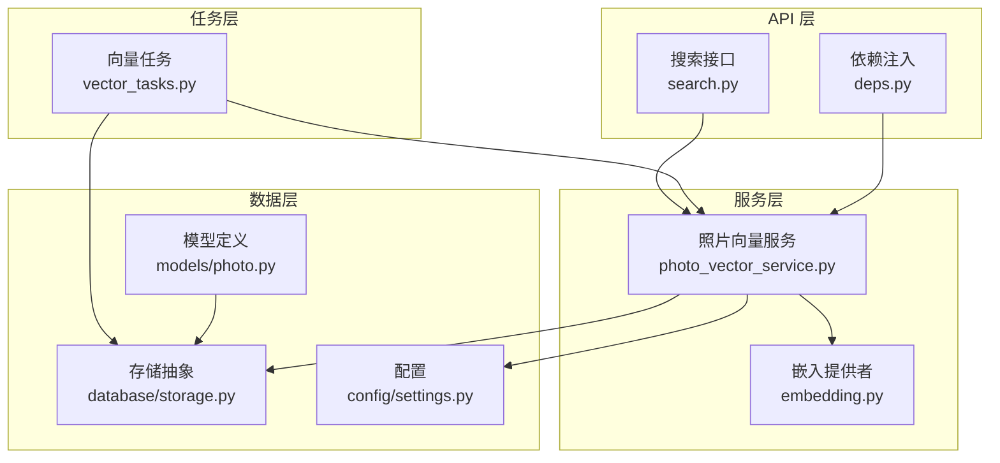
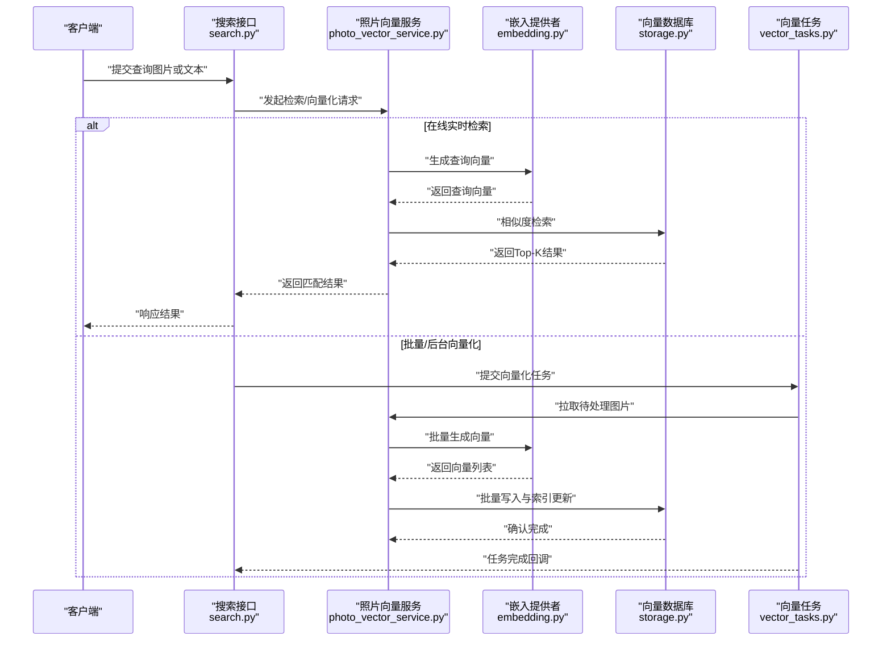
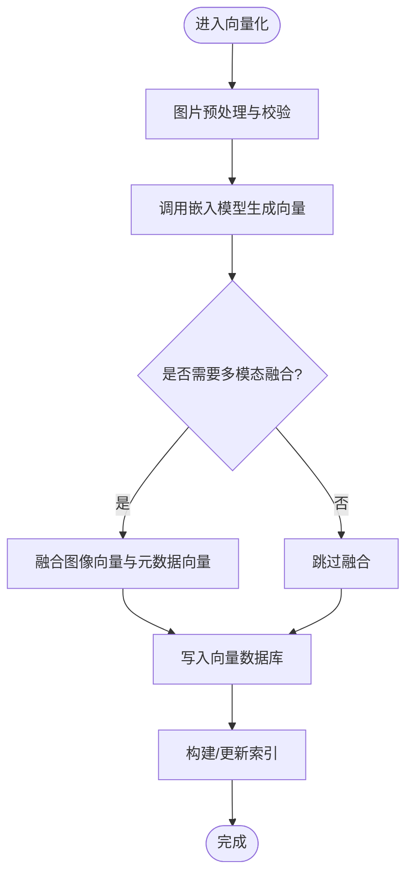
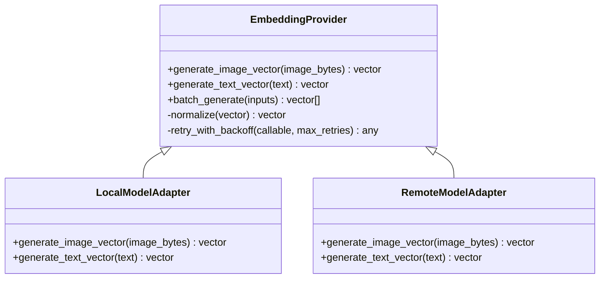
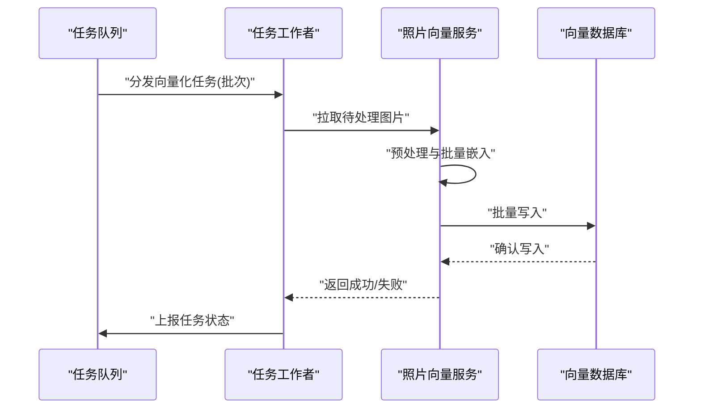
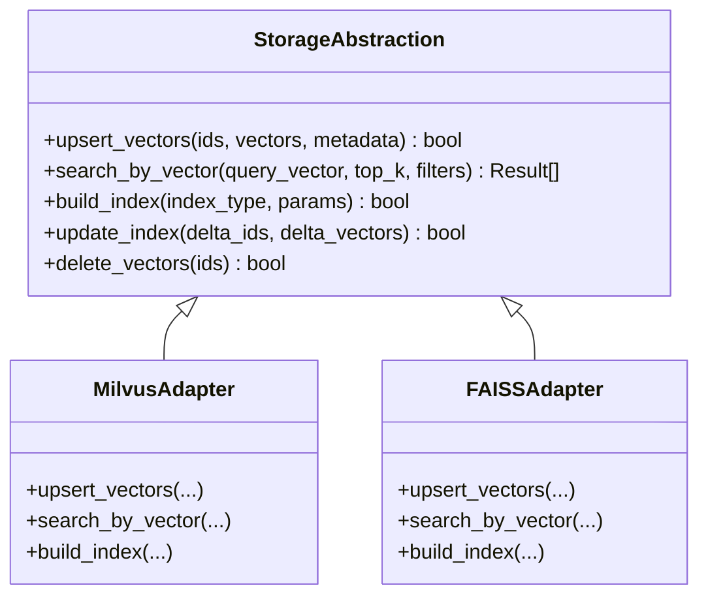
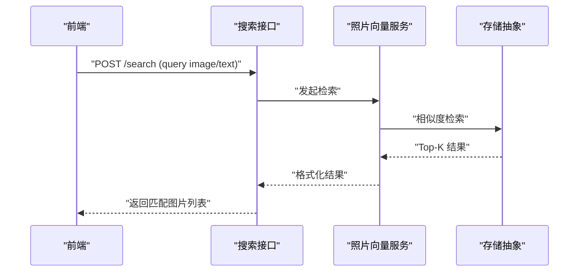
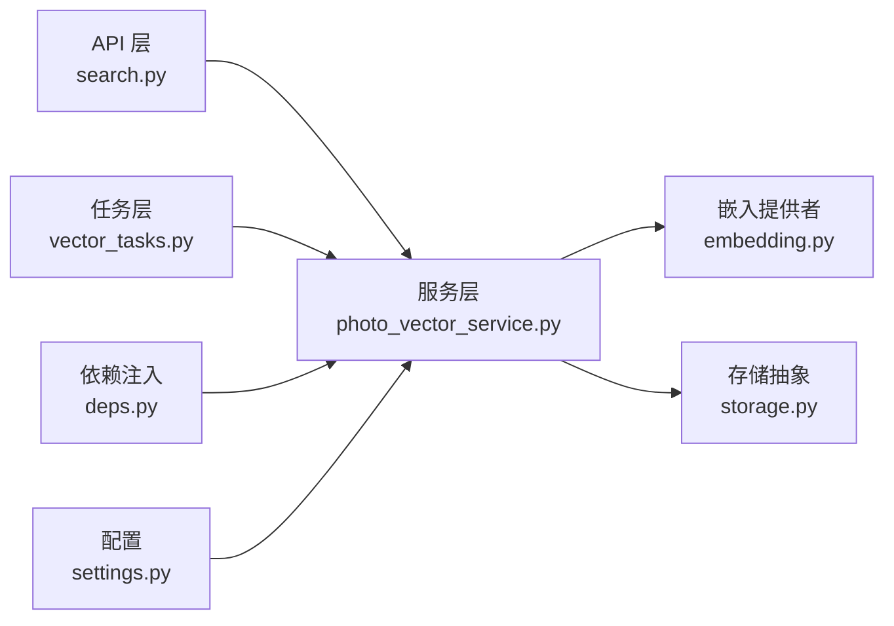

# 照片向量化处理

<cite>
**本文引用的文件**   
- [backend/app/services/photo_vector_service.py](file://backend/app/services/photo_vector_service.py)
- [backend/app/services/ai_providers/embedding.py](file://backend/app/services/ai_providers/embedding.py)
- [backend/app/tasks/vector_tasks.py](file://backend/app/tasks/vector_tasks.py)
- [backend/app/api/search.py](file://backend/app/api/search.py)
- [backend/app/models/photo.py](file://backend/app/models/photo.py)
- [backend/app/database/storage.py](file://backend/app/database/storage.py)
- [backend/app/config/settings.py](file://backend/app/config/settings.py)
- [backend/app/api/deps.py](file://backend/app/api/deps.py)
</cite>

## 目录
1. [简介](#简介)
2. [项目结构](#项目结构)
3. [核心组件](#核心组件)
4. [架构总览](#架构总览)
5. [详细组件分析](#详细组件分析)
6. [依赖关系分析](#依赖关系分析)
7. [性能考虑](#性能考虑)
8. [故障排查指南](#故障排查指南)
9. [结论](#结论)
10. [附录](#附录)

## 简介
本技术文档围绕“照片向量化处理”展开，系统阐述图像特征提取、多模态融合与向量嵌入生成流程；说明向量数据库选型标准、索引策略与存储优化；介绍相似度计算算法及其适用场景；给出向量更新机制（增量索引、批量更新、冲突解决）的实现方案；并提供批处理、内存管理与缓存等性能调优最佳实践。文档面向具备不同技术背景的读者，力求在可操作性和深度之间取得平衡。

## 项目结构
本项目后端采用分层架构：API 层暴露接口，服务层封装业务逻辑，任务层负责异步处理，模型与数据库层提供数据持久化与配置。与照片向量化相关的关键路径包括：
- 图片上传与预处理
- 调用嵌入模型生成向量
- 将向量写入向量数据库并建立索引
- 基于相似度的检索与排序
- 异步任务驱动的大规模向量化与更新

图表来源
- [backend/app/api/search.py](file://backend/app/api/search.py)
- [backend/app/services/photo_vector_service.py](file://backend/app/services/photo_vector_service.py)
- [backend/app/services/ai_providers/embedding.py](file://backend/app/services/ai_providers/embedding.py)
- [backend/app/tasks/vector_tasks.py](file://backend/app/tasks/vector_tasks.py)
- [backend/app/models/photo.py](file://backend/app/models/photo.py)
- [backend/app/database/storage.py](file://backend/app/database/storage.py)
- [backend/app/config/settings.py](file://backend/app/config/settings.py)
- [backend/app/api/deps.py](file://backend/app/api/deps.py)

章节来源
- [backend/app/api/search.py](file://backend/app/api/search.py)
- [backend/app/services/photo_vector_service.py](file://backend/app/services/photo_vector_service.py)
- [backend/app/services/ai_providers/embedding.py](file://backend/app/services/ai_providers/embedding.py)
- [backend/app/tasks/vector_tasks.py](file://backend/app/tasks/vector_tasks.py)
- [backend/app/models/photo.py](file://backend/app/models/photo.py)
- [backend/app/database/storage.py](file://backend/app/database/storage.py)
- [backend/app/config/settings.py](file://backend/app/config/settings.py)
- [backend/app/api/deps.py](file://backend/app/api/deps.py)

## 核心组件
- 照片向量服务：协调图片预处理、特征提取、多模态融合、向量入库与索引构建，对外提供向量化与检索能力。
- 嵌入提供者：封装外部或本地嵌入模型调用，统一返回标准化向量。
- 向量任务：异步执行大规模向量化、增量更新与重建索引。
- 存储抽象：对向量数据库进行抽象，屏蔽底层实现差异，提供统一的增删改查与索引管理接口。
- 配置模块：集中管理模型参数、向量维度、相似度度量、连接参数等。
- API 层：暴露向量化与检索接口，接收请求并调度服务与任务。

章节来源
- [backend/app/services/photo_vector_service.py](file://backend/app/services/photo_vector_service.py)
- [backend/app/services/ai_providers/embedding.py](file://backend/app/services/ai_providers/embedding.py)
- [backend/app/tasks/vector_tasks.py](file://backend/app/tasks/vector_tasks.py)
- [backend/app/database/storage.py](file://backend/app/database/storage.py)
- [backend/app/config/settings.py](file://backend/app/config/settings.py)
- [backend/app/api/search.py](file://backend/app/api/search.py)

## 架构总览
整体流程从用户上传图片开始，经过预处理与特征提取，生成向量后写入向量数据库并建立索引；检索时通过相似度计算快速定位相近图片。

图表来源
- [backend/app/api/search.py](file://backend/app/api/search.py)
- [backend/app/services/photo_vector_service.py](file://backend/app/services/photo_vector_service.py)
- [backend/app/services/ai_providers/embedding.py](file://backend/app/services/ai_providers/embedding.py)
- [backend/app/tasks/vector_tasks.py](file://backend/app/tasks/vector_tasks.py)
- [backend/app/database/storage.py](file://backend/app/database/storage.py)

## 详细组件分析

### 组件一：照片向量服务（Photo Vector Service）
职责
- 图片预处理与质量校验
- 调用嵌入模型生成图像/文本向量
- 多模态特征融合（如图像+元数据）
- 向量入库、索引构建与更新
- 相似度检索与结果排序

关键流程
- 单图向量化：读取图片→预处理→调用嵌入→入库→建索引
- 批量向量化：分批读取→并发调用嵌入→批量写入→索引合并
- 增量更新：按变更时间戳或版本号筛选→增量写入→索引增量更新
- 冲突解决：以主键或唯一标识为准，覆盖旧记录或合并字段

图表来源
- [backend/app/services/photo_vector_service.py](file://backend/app/services/photo_vector_service.py)
- [backend/app/services/ai_providers/embedding.py](file://backend/app/services/ai_providers/embedding.py)
- [backend/app/database/storage.py](file://backend/app/database/storage.py)

章节来源
- [backend/app/services/photo_vector_service.py](file://backend/app/services/photo_vector_service.py)

### 组件二：嵌入提供者（Embedding Provider）
职责
- 统一封装嵌入模型调用（本地或远程）
- 支持图像与文本两种输入
- 输出标准化向量（固定维度、归一化）

设计要点
- 适配器模式：对不同模型提供方提供统一接口
- 错误重试与降级：网络异常、超时、模型不可用时的重试与回退策略
- 批处理：支持批量输入以提升吞吐

图表来源
- [backend/app/services/ai_providers/embedding.py](file://backend/app/services/ai_providers/embedding.py)

章节来源
- [backend/app/services/ai_providers/embedding.py](file://backend/app/services/ai_providers/embedding.py)

### 组件三：向量任务（Vector Tasks）
职责
- 异步调度大规模向量化任务
- 分片与并发控制
- 失败重试与补偿
- 任务状态跟踪与回调

典型工作流
- 触发条件：新图片上传、定时全量重建、手动触发
- 分片策略：按时间范围或ID区间切分
- 并发控制：限制并发数，避免资源耗尽
- 幂等性：同一批次重复执行不产生重复数据

图表来源
- [backend/app/tasks/vector_tasks.py](file://backend/app/tasks/vector_tasks.py)
- [backend/app/services/photo_vector_service.py](file://backend/app/services/photo_vector_service.py)
- [backend/app/database/storage.py](file://backend/app/database/storage.py)

章节来源
- [backend/app/tasks/vector_tasks.py](file://backend/app/tasks/vector_tasks.py)

### 组件四：存储抽象（Storage Abstraction）
职责
- 对向量数据库的增删改查、索引管理进行抽象
- 屏蔽底层实现差异（如Milvus、FAISS、Chroma等）
- 提供事务/批量写入与一致性保障

关键接口建议
- upsert_vectors(ids, vectors, metadata)
- search_by_vector(query_vector, top_k, filters)
- build_index(index_type, params)
- update_index(delta_ids, delta_vectors)
- delete_vectors(ids)

图表来源
- [backend/app/database/storage.py](file://backend/app/database/storage.py)

章节来源
- [backend/app/database/storage.py](file://backend/app/database/storage.py)

### 组件五：API 层（Search API）
职责
- 接收前端查询请求（图片/文本）
- 调用向量服务进行检索
- 返回排序后的结果集

图表来源
- [backend/app/api/search.py](file://backend/app/api/search.py)
- [backend/app/services/photo_vector_service.py](file://backend/app/services/photo_vector_service.py)
- [backend/app/database/storage.py](file://backend/app/database/storage.py)

章节来源
- [backend/app/api/search.py](file://backend/app/api/search.py)

### 组件六：配置与依赖注入
- 配置项：模型类型、向量维度、相似度度量、连接参数、批大小、重试次数等
- 依赖注入：为服务与任务提供统一的配置与存储实例

章节来源
- [backend/app/config/settings.py](file://backend/app/config/settings.py)
- [backend/app/api/deps.py](file://backend/app/api/deps.py)

## 依赖关系分析
- 低耦合高内聚：服务层通过抽象接口与存储交互，便于替换底层向量库
- 明确边界：嵌入提供者仅负责向量生成，不负责索引与检索
- 任务解耦：向量化任务与在线检索分离，提升系统稳定性与可扩展性

图表来源
- [backend/app/api/search.py](file://backend/app/api/search.py)
- [backend/app/services/photo_vector_service.py](file://backend/app/services/photo_vector_service.py)
- [backend/app/services/ai_providers/embedding.py](file://backend/app/services/ai_providers/embedding.py)
- [backend/app/tasks/vector_tasks.py](file://backend/app/tasks/vector_tasks.py)
- [backend/app/database/storage.py](file://backend/app/database/storage.py)
- [backend/app/config/settings.py](file://backend/app/config/settings.py)
- [backend/app/api/deps.py](file://backend/app/api/deps.py)

章节来源
- [backend/app/api/search.py](file://backend/app/api/search.py)
- [backend/app/services/photo_vector_service.py](file://backend/app/services/photo_vector_service.py)
- [backend/app/services/ai_providers/embedding.py](file://backend/app/services/ai_providers/embedding.py)
- [backend/app/tasks/vector_tasks.py](file://backend/app/tasks/vector_tasks.py)
- [backend/app/database/storage.py](file://backend/app/database/storage.py)
- [backend/app/config/settings.py](file://backend/app/config/settings.py)
- [backend/app/api/deps.py](file://backend/app/api/deps.py)

## 性能考虑
- 批处理优化
  - 合理设置批大小，平衡吞吐与延迟
  - 使用零拷贝或内存映射减少序列化开销
- 内存管理
  - 控制并发度，避免OOM
  - 及时释放临时对象与缓冲区
- 缓存策略
  - 热点查询结果短期缓存
  - 模型权重与常用中间结果常驻内存
- 索引策略
  - 根据数据规模选择HNSW、IVF、PQ等索引
  - 定期重建索引以维持检索性能
- 相似度计算
  - 余弦相似度适用于归一化向量，适合语义相似度
  - 欧氏距离对尺度敏感，适合几何距离场景
  - 内积可用于点积型检索引擎优化
- 任务调度
  - 分片并行，避免长尾任务阻塞
  - 失败重试与幂等写入保证一致性

[本节为通用性能指导，无需特定文件引用]

## 故障排查指南
常见问题与定位方法
- 向量维度不一致
  - 检查嵌入模型输出维度与配置是否一致
  - 入库前做维度校验与对齐
- 索引构建失败
  - 查看索引参数是否超出数据规模上限
  - 尝试降维或更换索引类型
- 检索结果不稳定
  - 检查相似度阈值与Top-K设置
  - 验证向量归一化是否正确
- 任务失败与重试风暴
  - 增加退避时间与最大重试次数
  - 引入死信队列与人工干预入口
- 存储连接异常
  - 检查连接参数与网络连通性
  - 启用健康检查与自动重连

章节来源
- [backend/app/services/photo_vector_service.py](file://backend/app/services/photo_vector_service.py)
- [backend/app/database/storage.py](file://backend/app/database/storage.py)
- [backend/app/config/settings.py](file://backend/app/config/settings.py)

## 结论
本方案通过清晰的分层与抽象，实现了照片向量化处理的端到端流程：从图像特征提取、多模态融合到向量入库与检索。借助任务系统与存储抽象，系统在可扩展性与稳定性方面具备良好基础。结合合理的索引策略与性能调优，可在大规模数据下保持高效检索体验。

[本节为总结性内容，无需特定文件引用]

## 附录

### 向量数据库选型标准
- 功能特性
  - 支持的相似度度量（余弦、欧氏、内积）
  - 索引类型（HNSW、IVF、PQ、DiskANN等）
  - 标量过滤与混合检索能力
- 性能指标
  - 吞吐、延迟、召回率、内存占用
- 运维与生态
  - 部署复杂度、监控告警、备份恢复
  - 社区活跃度与商业支持

[本节为概念性内容，无需特定文件引用]

### 相似度计算算法与适用场景
- 余弦相似度：适合语义相似度，要求向量归一化
- 欧氏距离：适合几何距离，对尺度敏感
- 内积：适合点积型检索引擎，常用于归一化向量

[本节为概念性内容，无需特定文件引用]

### 向量更新机制
- 增量索引
  - 按变更时间戳或版本号筛选
  - 增量写入与索引增量更新
- 批量更新
  - 分片并行写入，合并索引
- 冲突解决
  - 以主键或唯一标识为准，覆盖旧记录或合并字段
  - 版本控制确保最终一致性

[本节为概念性内容，无需特定文件引用]

### 代码片段路径参考
- 向量化主流程
  - [backend/app/services/photo_vector_service.py](file://backend/app/services/photo_vector_service.py)
- 嵌入模型调用
  - [backend/app/services/ai_providers/embedding.py](file://backend/app/services/ai_providers/embedding.py)
- 异步任务编排
  - [backend/app/tasks/vector_tasks.py](file://backend/app/tasks/vector_tasks.py)
- 存储抽象接口
  - [backend/app/database/storage.py](file://backend/app/database/storage.py)
- 配置项与依赖注入
  - [backend/app/config/settings.py](file://backend/app/config/settings.py)
  - [backend/app/api/deps.py](file://backend/app/api/deps.py)
- 搜索接口
  - [backend/app/api/search.py](file://backend/app/api/search.py)
- 数据模型
  - [backend/app/models/photo.py](file://backend/app/models/photo.py)