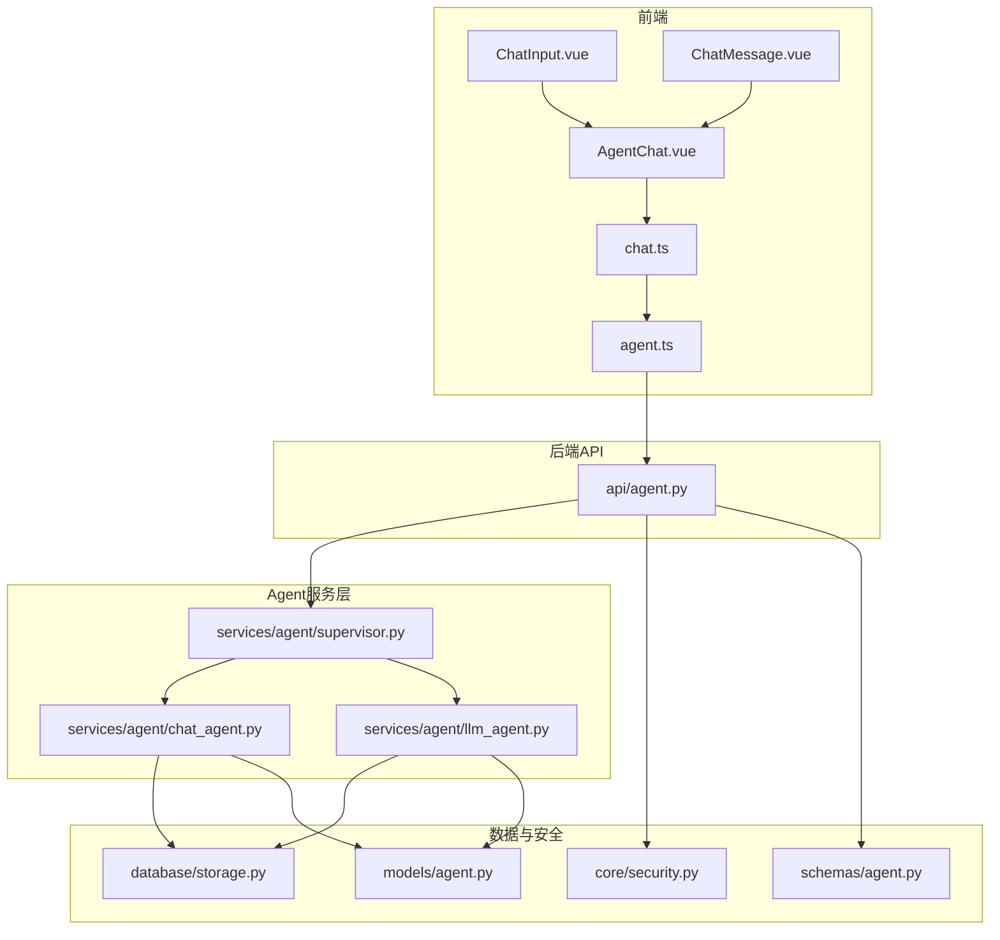
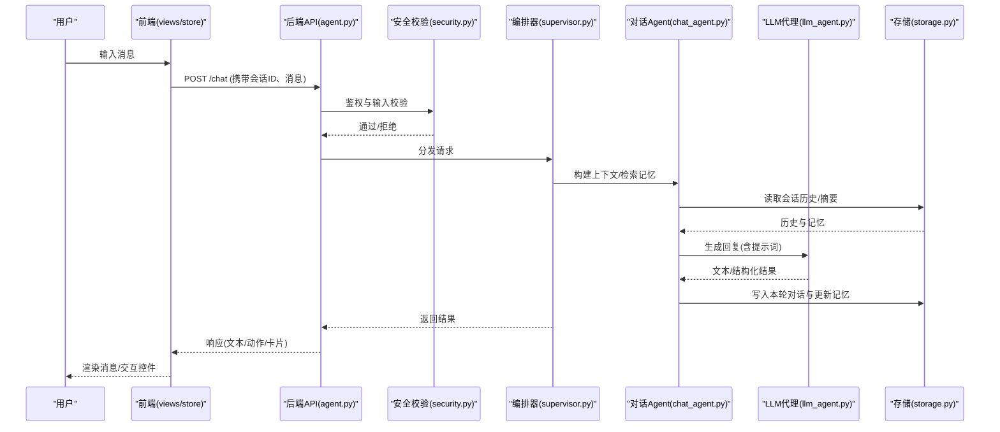
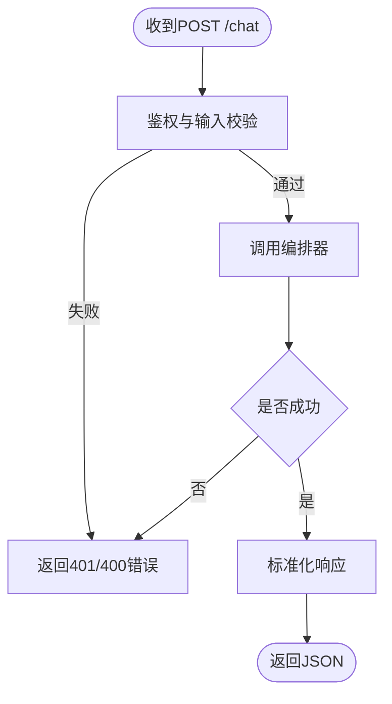
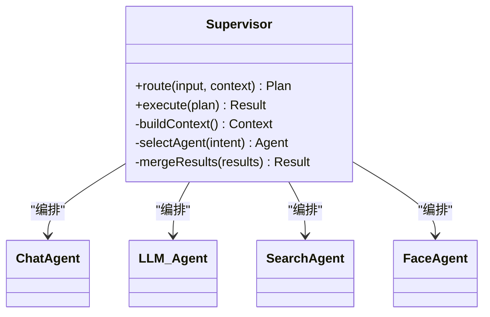
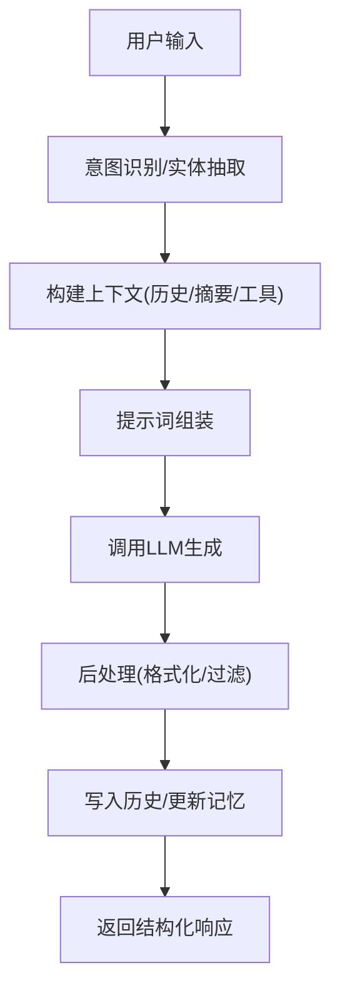
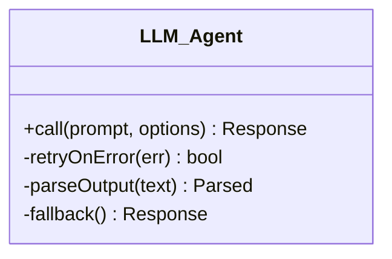
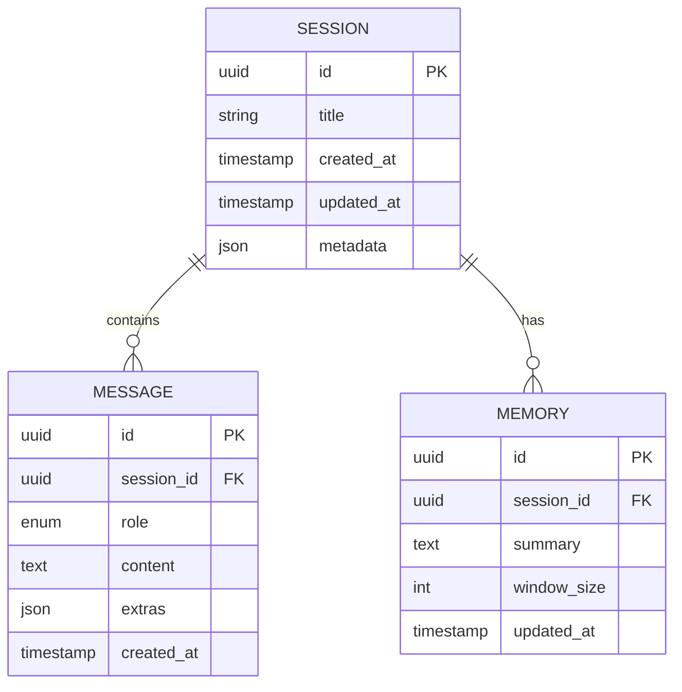
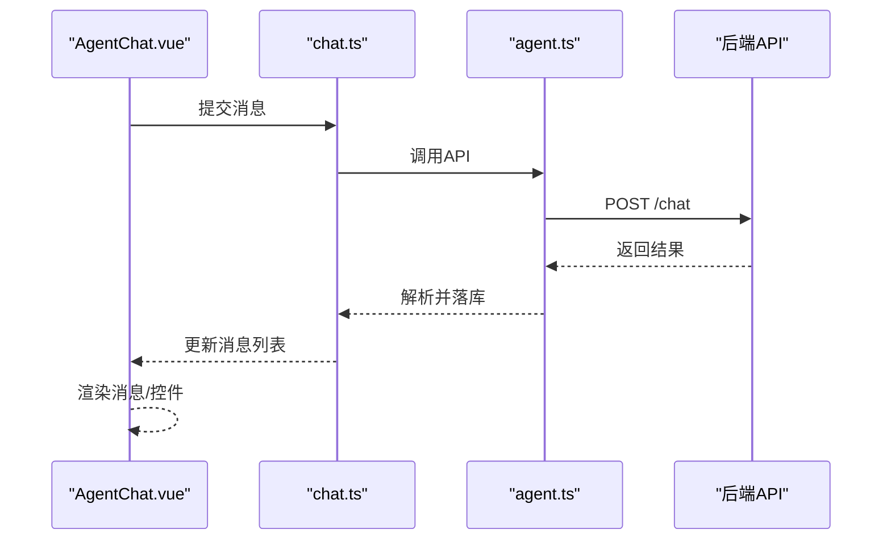
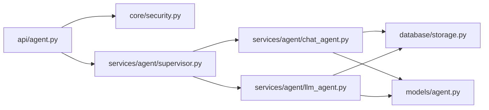

# Chat对话Agent

<cite>
**本文引用的文件**   
- [backend/app/api/agent.py](file://backend/app/api/agent.py)
- [backend/app/services/agent/chat_agent.py](file://backend/app/services/agent/chat_agent.py)
- [backend/app/services/agent/llm_agent.py](file://backend/app/services/agent/llm_agent.py)
- [backend/app/services/agent/supervisor.py](file://backend/app/services/agent/supervisor.py)
- [backend/app/models/agent.py](file://backend/app/models/agent.py)
- [backend/app/schemas/agent.py](file://backend/app/schemas/agent.py)
- [backend/app/database/storage.py](file://backend/app/database/storage.py)
- [backend/app/core/security.py](file://backend/app/core/security.py)
- [frontend/src/api/agent.ts](file://frontend/src/api/agent.ts)
- [frontend/src/stores/chat.ts](file://frontend/src/stores/chat.ts)
- [frontend/src/views/AgentChat.vue](file://frontend/src/views/AgentChat.vue)
- [frontend/src/components/chat/ChatInput.vue](file://frontend/src/components/chat/ChatInput.vue)
- [frontend/src/components/chat/ChatMessage.vue](file://frontend/src/components/chat/ChatMessage.vue)
</cite>

## 目录
1. [简介](#简介)
2. [项目结构](#项目结构)
3. [核心组件](#核心组件)
4. [架构总览](#架构总览)
5. [详细组件分析](#详细组件分析)
6. [依赖关系分析](#依赖关系分析)
7. [性能考虑](#性能考虑)
8. [故障排查指南](#故障排查指南)
9. [结论](#结论)
10. [附录](#附录)

## 简介
本文件面向“AI相册”中的Chat对话Agent，系统性阐述其对话处理核心逻辑与工程实现。内容覆盖自然语言理解、上下文管理、多轮对话状态维护；LLM服务集成方式、提示词工程设计与响应格式化；对话历史存储、会话管理与记忆机制；流程控制、意图识别与实体提取；以及对话质量评估、安全过滤与内容审核的集成方案。文档同时提供前后端交互序列图、数据流图与关键流程图，帮助读者快速定位问题并优化系统。

## 项目结构
围绕Chat对话Agent的关键代码分布在后端API层、Agent服务层、模型与Schema定义、持久化存储与安全模块，以及前端API调用、状态管理与视图组件中。整体采用分层架构：
- API层：暴露REST接口，负责鉴权、参数校验与结果封装
- Agent服务层：编排对话流程、调度子Agent（如LLM、搜索、人脸等）、维护会话与记忆
- 数据层：使用SQLite/对象存储进行对话历史与元数据持久化
- 前端：Vue+TS应用，通过API与后端交互，维护本地聊天状态与UI渲染

图表来源
- [backend/app/api/agent.py](file://backend/app/api/agent.py)
- [backend/app/services/agent/supervisor.py](file://backend/app/services/agent/supervisor.py)
- [backend/app/services/agent/chat_agent.py](file://backend/app/services/agent/chat_agent.py)
- [backend/app/services/agent/llm_agent.py](file://backend/app/services/agent/llm_agent.py)
- [backend/app/models/agent.py](file://backend/app/models/agent.py)
- [backend/app/schemas/agent.py](file://backend/app/schemas/agent.py)
- [backend/app/database/storage.py](file://backend/app/database/storage.py)
- [backend/app/core/security.py](file://backend/app/core/security.py)
- [frontend/src/api/agent.ts](file://frontend/src/api/agent.ts)
- [frontend/src/stores/chat.ts](file://frontend/src/stores/chat.ts)
- [frontend/src/views/AgentChat.vue](file://frontend/src/views/AgentChat.vue)
- [frontend/src/components/chat/ChatInput.vue](file://frontend/src/components/chat/ChatInput.vue)
- [frontend/src/components/chat/ChatMessage.vue](file://frontend/src/components/chat/ChatMessage.vue)

章节来源
- [backend/app/api/agent.py](file://backend/app/api/agent.py)
- [backend/app/services/agent/chat_agent.py](file://backend/app/services/agent/chat_agent.py)
- [backend/app/services/agent/llm_agent.py](file://backend/app/services/agent/llm_agent.py)
- [backend/app/services/agent/supervisor.py](file://backend/app/services/agent/supervisor.py)
- [backend/app/models/agent.py](file://backend/app/models/agent.py)
- [backend/app/schemas/agent.py](file://backend/app/schemas/agent.py)
- [backend/app/database/storage.py](file://backend/app/database/storage.py)
- [backend/app/core/security.py](file://backend/app/core/security.py)
- [frontend/src/api/agent.ts](file://frontend/src/api/agent.ts)
- [frontend/src/stores/chat.ts](file://frontend/src/stores/chat.ts)
- [frontend/src/views/AgentChat.vue](file://frontend/src/views/AgentChat.vue)
- [frontend/src/components/chat/ChatInput.vue](file://frontend/src/components/chat/ChatInput.vue)
- [frontend/src/components/chat/ChatMessage.vue](file://frontend/src/components/chat/ChatMessage.vue)

## 核心组件
- 对话入口API：接收用户消息、鉴权、路由到Supervisor编排器，返回结构化响应
- Supervisor编排器：解析意图、选择子Agent、组合上下文、协调执行与回写
- ChatAgent：负责对话上下文构建、记忆检索、提示词组装与结果后处理
- LLM代理：统一封装外部大模型调用、重试与错误归一化
- 会话与记忆：基于存储层持久化对话历史与摘要记忆，支持按会话ID查询与追加
- 安全与校验：请求鉴权、输入输出过滤、敏感信息检测与拦截
- 前端交互：消息发送、流式或批量接收、本地状态同步与渲染

章节来源
- [backend/app/api/agent.py](file://backend/app/api/agent.py)
- [backend/app/services/agent/supervisor.py](file://backend/app/services/agent/supervisor.py)
- [backend/app/services/agent/chat_agent.py](file://backend/app/services/agent/chat_agent.py)
- [backend/app/services/agent/llm_agent.py](file://backend/app/services/agent/llm_agent.py)
- [backend/app/database/storage.py](file://backend/app/database/storage.py)
- [backend/app/core/security.py](file://backend/app/core/security.py)
- [frontend/src/api/agent.ts](file://frontend/src/api/agent.ts)
- [frontend/src/stores/chat.ts](file://frontend/src/stores/chat.ts)
- [frontend/src/views/AgentChat.vue](file://frontend/src/views/AgentChat.vue)

## 架构总览
下图展示了从前端发起对话到后端编排、调用LLM、读写记忆与返回响应的完整链路。

图表来源
- [backend/app/api/agent.py](file://backend/app/api/agent.py)
- [backend/app/core/security.py](file://backend/app/core/security.py)
- [backend/app/services/agent/supervisor.py](file://backend/app/services/agent/supervisor.py)
- [backend/app/services/agent/chat_agent.py](file://backend/app/services/agent/chat_agent.py)
- [backend/app/services/agent/llm_agent.py](file://backend/app/services/agent/llm_agent.py)
- [backend/app/database/storage.py](file://backend/app/database/storage.py)
- [frontend/src/views/AgentChat.vue](file://frontend/src/views/AgentChat.vue)
- [frontend/src/stores/chat.ts](file://frontend/src/stores/chat.ts)

## 详细组件分析

### 对话入口API（后端）
职责
- 暴露REST接口，接收用户消息与会话标识
- 调用安全模块进行鉴权与输入校验
- 将请求委派给编排器，并将结果标准化返回

关键点
- 请求体包含用户消息、会话ID、可选的系统指令与模式开关
- 响应包含消息文本、结构化动作（如跳转相册、确认人名等）、状态码与错误信息
- 对异常进行捕获并转换为统一错误格式

图表来源
- [backend/app/api/agent.py](file://backend/app/api/agent.py)
- [backend/app/core/security.py](file://backend/app/core/security.py)

章节来源
- [backend/app/api/agent.py](file://backend/app/api/agent.py)
- [backend/app/core/security.py](file://backend/app/core/security.py)

### 编排器（Supervisor）
职责
- 意图识别与路由：根据用户输入决定调用通用对话、相册检索、人脸确认等子能力
- 上下文装配：合并系统提示、当前任务目标、最近对话摘要与必要工具描述
- 流程控制：串行/并行调用子Agent，聚合结果，必要时触发二次确认

关键点
- 可配置的策略：优先级、超时、重试次数
- 可扩展的插件式子Agent注册表，便于新增能力

图表来源
- [backend/app/services/agent/supervisor.py](file://backend/app/services/agent/supervisor.py)
- [backend/app/services/agent/chat_agent.py](file://backend/app/services/agent/chat_agent.py)
- [backend/app/services/agent/llm_agent.py](file://backend/app/services/agent/llm_agent.py)

章节来源
- [backend/app/services/agent/supervisor.py](file://backend/app/services/agent/supervisor.py)

### 对话Agent（ChatAgent）
职责
- 自然语言理解：抽取意图、实体、槽位，结合领域知识进行消歧
- 上下文管理：维护会话窗口、摘要记忆、短期工作记忆
- 提示词工程：动态拼装系统提示、用户消息、工具说明与约束条件
- 响应格式化：将LLM输出规范化为前端可渲染的结构（文本、卡片、操作按钮）

关键点
- 记忆机制：长程摘要+短程窗口，定期压缩历史，避免上下文溢出
- 安全过滤：输入清洗、输出合规检查、敏感词与隐私字段脱敏
- 质量评估：内置规则打分（连贯性、相关性、完整性），必要时触发人工复核标记

图表来源
- [backend/app/services/agent/chat_agent.py](file://backend/app/services/agent/chat_agent.py)
- [backend/app/services/agent/llm_agent.py](file://backend/app/services/agent/llm_agent.py)
- [backend/app/database/storage.py](file://backend/app/database/storage.py)

章节来源
- [backend/app/services/agent/chat_agent.py](file://backend/app/services/agent/chat_agent.py)

### LLM代理（LLM_Agent）
职责
- 统一封装外部大模型调用（HTTP/gRPC），处理鉴权、重试、超时与限流
- 错误归一化：将不同提供商的错误码映射为内部标准错误
- 输出解析：支持纯文本与结构化JSON，提供容错解析策略

关键点
- 可插拔Provider：通过配置切换不同模型与服务端点
- 缓存与降级：热点问答缓存、失败时回退到默认回答或简化模式

图表来源
- [backend/app/services/agent/llm_agent.py](file://backend/app/services/agent/llm_agent.py)

章节来源
- [backend/app/services/agent/llm_agent.py](file://backend/app/services/agent/llm_agent.py)

### 会话与记忆（存储层）
职责
- 会话管理：创建/加载/归档会话，维护会话元数据（名称、标签、最后活跃时间）
- 对话历史：以事件形式记录每轮对话（角色、内容、时间戳、附加信息）
- 记忆机制：滚动窗口+摘要压缩，降低上下文长度，提升稳定性

关键点
- 索引设计：按会话ID、时间范围、关键词检索
- 一致性：写入原子性，避免并发写入导致的历史不一致

图表来源
- [backend/app/models/agent.py](file://backend/app/models/agent.py)
- [backend/app/database/storage.py](file://backend/app/database/storage.py)

章节来源
- [backend/app/models/agent.py](file://backend/app/models/agent.py)
- [backend/app/database/storage.py](file://backend/app/database/storage.py)

### 安全与内容审核
职责
- 鉴权：基于令牌或会话的访问控制
- 输入过滤：去除恶意脚本、限制长度、白名单字符集
- 输出审核：敏感词检测、隐私信息脱敏、合规性校验

关键点
- 可配置策略：严格/宽松模式，黑白名单热更新
- 审计日志：记录高风险请求与处置结果

章节来源
- [backend/app/core/security.py](file://backend/app/core/security.py)

### 前端交互（Vue+TS）
职责
- 消息发送：封装API调用，携带会话ID与消息内容
- 状态管理：本地维护消息列表、加载态、错误态
- UI渲染：消息气泡、卡片、确认对话框等

关键点
- 断线重连与重试：网络异常时的友好提示与自动恢复
- 流式展示：若后端支持SSE/WS，可实现逐字渲染体验

图表来源
- [frontend/src/views/AgentChat.vue](file://frontend/src/views/AgentChat.vue)
- [frontend/src/stores/chat.ts](file://frontend/src/stores/chat.ts)
- [frontend/src/api/agent.ts](file://frontend/src/api/agent.ts)

章节来源
- [frontend/src/views/AgentChat.vue](file://frontend/src/views/AgentChat.vue)
- [frontend/src/stores/chat.ts](file://frontend/src/stores/chat.ts)
- [frontend/src/api/agent.ts](file://frontend/src/api/agent.ts)
- [frontend/src/components/chat/ChatInput.vue](file://frontend/src/components/chat/ChatInput.vue)
- [frontend/src/components/chat/ChatMessage.vue](file://frontend/src/components/chat/ChatMessage.vue)

## 依赖关系分析
- 低耦合高内聚：API仅负责协议与安全，业务编排下沉至Supervisor与Agent
- 可扩展性：子Agent通过注册表接入，新增能力无需改动核心流程
- 外部依赖：LLM Provider、向量检索、人脸服务等通过抽象接口隔离

图表来源
- [backend/app/api/agent.py](file://backend/app/api/agent.py)
- [backend/app/core/security.py](file://backend/app/core/security.py)
- [backend/app/services/agent/supervisor.py](file://backend/app/services/agent/supervisor.py)
- [backend/app/services/agent/chat_agent.py](file://backend/app/services/agent/chat_agent.py)
- [backend/app/services/agent/llm_agent.py](file://backend/app/services/agent/llm_agent.py)
- [backend/app/database/storage.py](file://backend/app/database/storage.py)
- [backend/app/models/agent.py](file://backend/app/models/agent.py)

章节来源
- [backend/app/api/agent.py](file://backend/app/api/agent.py)
- [backend/app/services/agent/supervisor.py](file://backend/app/services/agent/supervisor.py)
- [backend/app/services/agent/chat_agent.py](file://backend/app/services/agent/chat_agent.py)
- [backend/app/services/agent/llm_agent.py](file://backend/app/services/agent/llm_agent.py)
- [backend/app/database/storage.py](file://backend/app/database/storage.py)
- [backend/app/models/agent.py](file://backend/app/models/agent.py)

## 性能考虑
- 上下文长度控制：滑动窗口+摘要压缩，避免超出模型最大上下文
- 并发与异步：I/O密集调用（LLM、检索）采用异步非阻塞，提高吞吐
- 缓存策略：热点问答与检索结果缓存，减少重复计算
- 降级与熔断：LLM不可用时回退到规则引擎或默认答案
- 资源监控：记录延迟、错误率、Token消耗，设置告警阈值

[本节为通用指导，不直接分析具体文件]

## 故障排查指南
常见问题与定位步骤
- 鉴权失败：检查令牌有效性、权限范围、跨域配置
- 意图识别错误：查看NLU日志、实体抽取结果、规则匹配命中情况
- LLM调用失败：核对Provider密钥、网络连通性、重试与熔断策略
- 记忆丢失：检查会话ID传递、存储写入事务、索引重建
- 前端渲染异常：确认响应结构是否符合Schema、空值与边界处理

建议的日志与指标
- 请求链路追踪：从API到各子Agent的耗时与状态码
- 安全事件：输入过滤命中、输出审核拦截详情
- 质量评分：相关性、连贯性、完整性分布与趋势

章节来源
- [backend/app/core/security.py](file://backend/app/core/security.py)
- [backend/app/services/agent/chat_agent.py](file://backend/app/services/agent/chat_agent.py)
- [backend/app/services/agent/llm_agent.py](file://backend/app/services/agent/llm_agent.py)
- [backend/app/database/storage.py](file://backend/app/database/storage.py)

## 结论
该Chat对话Agent采用清晰的层次化架构与可插拔的编排机制，实现了从自然语言理解、上下文管理到LLM集成与记忆存储的完整闭环。通过安全过滤、质量评估与性能优化策略，系统在可用性、安全性与扩展性方面具备良好基础。后续可在意图识别精度、记忆压缩算法与流式交互体验上持续迭代。

[本节为总结性内容，不直接分析具体文件]

## 附录
- 术语
  - 意图识别：从用户输入中提取高层目的与任务类型
  - 实体抽取：识别命名实体与关键槽位
  - 记忆机制：会话级摘要与窗口化历史，用于长期与短期上下文
  - 提示词工程：将系统指令、上下文与约束组织为高质量Prompt
- 最佳实践
  - 明确系统角色与边界，避免越权行为
  - 对敏感信息进行脱敏与最小化收集
  - 保持Prompt稳定与版本化管理，便于回溯与评测
  - 建立A/B测试与离线评测集，持续评估与改进

[本节为概念性内容，不直接分析具体文件]