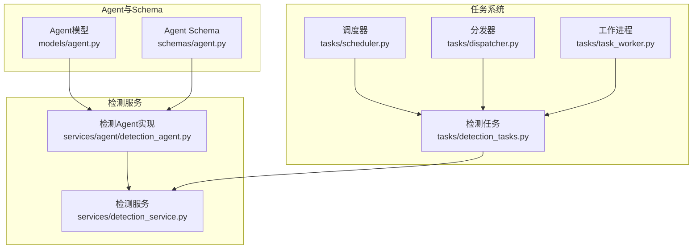
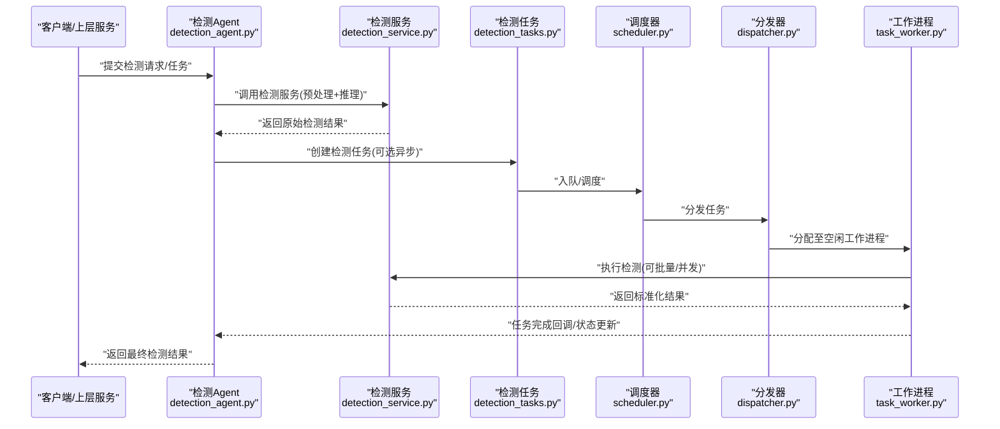
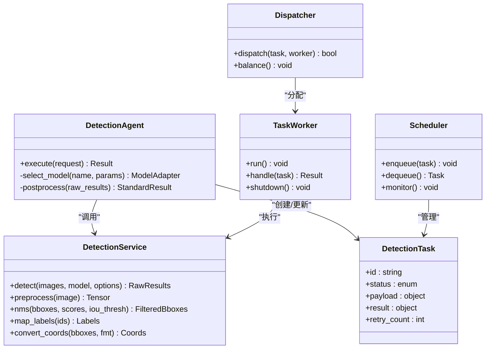
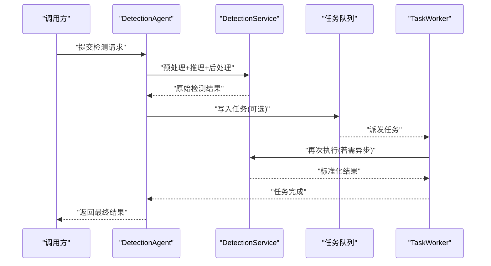
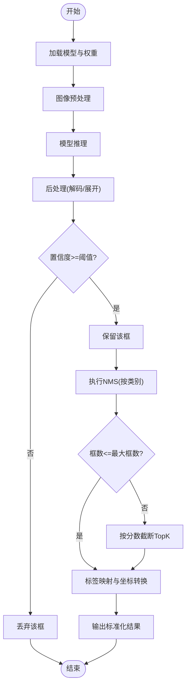
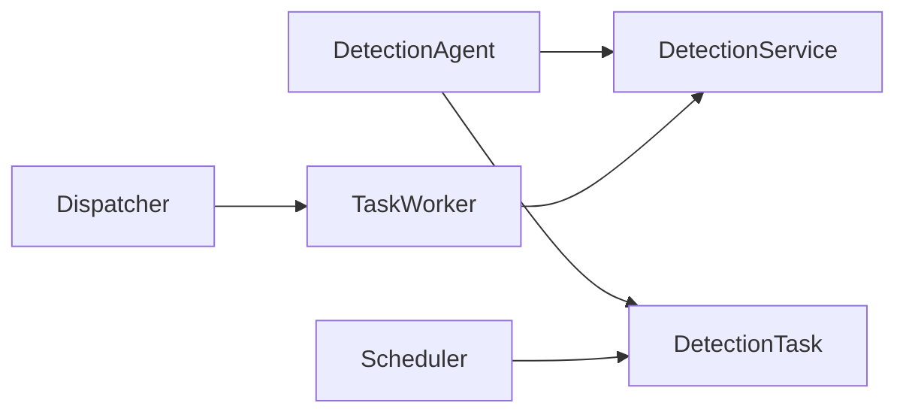

# Detection检测Agent

<cite>
**本文档引用的文件**
- [detection_agent.py](file://backend/app/services/agent/detection_agent.py)
- [detection_service.py](file://backend/app/services/detection_service.py)
- [detection_tasks.py](file://backend/app/tasks/detection_tasks.py)
- [test_detection.py](file://backend/app/services/test/test_detection.py)
- [agent.py](file://backend/app/models/agent.py)
- [agent.py](file://backend/app/schemas/agent.py)
- [scheduler.py](file://backend/app/tasks/scheduler.py)
- [task_worker.py](file://backend/app/tasks/task_worker.py)
- [dispatcher.py](file://backend/app/tasks/dispatcher.py)
</cite>

## 目录
1. [简介](#简介)
2. [项目结构](#项目结构)
3. [核心组件](#核心组件)
4. [架构总览](#架构总览)
5. [详细组件分析](#详细组件分析)
6. [依赖关系分析](#依赖关系分析)
7. [性能考虑](#性能考虑)
8. [故障排查指南](#故障排查指南)
9. [结论](#结论)
10. [附录](#附录)

## 简介
本文件面向Detection检测Agent，系统性阐述图像目标检测任务的端到端执行流程：从任务调度、模型推理、结果解析与置信度过滤，到标准化输出与质量评估。文档同时覆盖支持的检测模型类型、坐标转换与标签映射机制、批量处理优化、并发控制与资源管理策略，以及自定义模型的集成方法与性能调优建议。

## 项目结构
Detection检测Agent位于后端服务中，围绕“任务驱动”的异步流水线组织，关键路径包括：
- Agent定义与Schema：描述检测Agent的能力与输入输出契约
- 检测服务：封装具体检测算法调用、预处理/后处理、结果标准化
- 任务层：将检测任务纳入统一的任务调度与执行框架（调度器、分发器、工作进程）
- 测试用例：验证检测流程、坐标转换、标签映射与过滤逻辑

图表来源
- [agent.py](file://backend/app/models/agent.py)
- [agent.py](file://backend/app/schemas/agent.py)
- [detection_agent.py](file://backend/app/services/agent/detection_agent.py)
- [detection_service.py](file://backend/app/services/detection_service.py)
- [detection_tasks.py](file://backend/app/tasks/detection_tasks.py)
- [scheduler.py](file://backend/app/tasks/scheduler.py)
- [dispatcher.py](file://backend/app/tasks/dispatcher.py)
- [task_worker.py](file://backend/app/tasks/task_worker.py)

章节来源
- [detection_agent.py](file://backend/app/services/agent/detection_agent.py)
- [detection_service.py](file://backend/app/services/detection_service.py)
- [detection_tasks.py](file://backend/app/tasks/detection_tasks.py)
- [scheduler.py](file://backend/app/tasks/scheduler.py)
- [dispatcher.py](file://backend/app/tasks/dispatcher.py)
- [task_worker.py](file://backend/app/tasks/task_worker.py)
- [agent.py](file://backend/app/models/agent.py)
- [agent.py](file://backend/app/schemas/agent.py)

## 核心组件
- 检测Agent（detection_agent.py）
  - 职责：作为Agent体系中的“检测能力”入口，接收上游请求或任务，协调检测服务完成推理与后处理，返回标准化检测结果。
  - 关键点：参数校验、模型选择、批大小与并发控制、错误回退与日志记录。
- 检测服务（detection_service.py）
  - 职责：封装具体检测算法调用、图像预处理、推理、NMS/阈值过滤、坐标归一化、标签映射、结果序列化。
  - 关键点：多模型适配、输入尺寸与通道顺序、边界框格式转换、类别字典对齐、异常隔离。
- 检测任务（detection_tasks.py）
  - 职责：在任务系统中注册检测任务类型，提供任务数据模型、状态机与重试策略。
  - 关键点：任务幂等、失败重试、进度上报、结果持久化。
- 任务调度与执行（scheduler.py, dispatcher.py, task_worker.py）
  - 职责：统一调度检测任务，按队列分发至工作进程，保障并发上限与资源隔离。
  - 关键点：限流、背压、优雅关闭、健康检查。

章节来源
- [detection_agent.py](file://backend/app/services/agent/detection_agent.py)
- [detection_service.py](file://backend/app/services/detection_service.py)
- [detection_tasks.py](file://backend/app/tasks/detection_tasks.py)
- [scheduler.py](file://backend/app/tasks/scheduler.py)
- [dispatcher.py](file://backend/app/tasks/dispatcher.py)
- [task_worker.py](file://backend/app/tasks/task_worker.py)

## 架构总览
下图展示一次检测请求从Agent到服务再到任务系统的完整时序。

图表来源
- [detection_agent.py](file://backend/app/services/agent/detection_agent.py)
- [detection_service.py](file://backend/app/services/detection_service.py)
- [detection_tasks.py](file://backend/app/tasks/detection_tasks.py)
- [scheduler.py](file://backend/app/tasks/scheduler.py)
- [dispatcher.py](file://backend/app/tasks/dispatcher.py)
- [task_worker.py](file://backend/app/tasks/task_worker.py)

## 详细组件分析

### 检测Agent（detection_agent.py）
- 功能要点
  - 接收并校验输入（图像源、模型名、阈值、最大框数等）。
  - 根据配置选择检测模型与参数，必要时走任务队列进行异步处理。
  - 聚合检测结果，进行置信度过滤与去重，生成标准响应。
- 设计模式
  - 适配器：对不同检测后端（如YOLO、Detectron2、ONNXRuntime等）进行统一抽象。
  - 责任链：预处理→推理→后处理→过滤→序列化。
- 并发与资源
  - 通过线程池/进程池限制并发；对GPU/CPU资源做配额管理。
  - 支持批大小动态调整与内存水位监控。
- 错误处理
  - 模型加载失败、推理超时、输入非法等异常分类与重试策略。
  - 降级：当某模型不可用时切换备用模型或返回空结果集。

章节来源
- [detection_agent.py](file://backend/app/services/agent/detection_agent.py)

### 检测服务（detection_service.py）
- 功能要点
  - 预处理：缩放、裁剪、归一化、通道顺序转换、填充策略。
  - 推理：调用具体检测模型，支持单图与多图批量推理。
  - 后处理：非极大值抑制(NMS)、置信度阈值过滤、框数量截断。
  - 坐标转换：将模型输出坐标转换为统一格式（如左上-右下或中心-宽高），并支持相对/绝对坐标。
  - 标签映射：将模型内部类别ID映射为业务语义标签，支持多语言别名。
  - 结果标准化：统一字段命名、数据类型与单位，便于下游消费。
- 数据结构与复杂度
  - 典型输出包含：边界框列表、类别ID、置信度分数、可选属性（如关键点、分割掩码）。
  - NMS时间复杂度近似O(n^2)，可通过IoU阈值与候选框数量控制。
- 扩展点
  - 新增模型：实现统一接口，注册到模型工厂。
  - 新坐标/标签体系：通过映射表与转换器注入。

章节来源
- [detection_service.py](file://backend/app/services/detection_service.py)

### 检测任务（detection_tasks.py）
- 功能要点
  - 定义检测任务的数据模型（输入图像ID/路径、模型参数、期望输出字段）。
  - 任务生命周期：待处理→进行中→成功/失败→重试→完成。
  - 幂等性：基于任务ID去重，避免重复执行。
  - 结果存储：将标准化检测结果持久化，供查询与审计。
- 与调度器的协作
  - 任务入队、优先级、超时与重试次数上限。
  - 失败告警与人工介入标记。

章节来源
- [detection_tasks.py](file://backend/app/tasks/detection_tasks.py)

### 调度器、分发器与工作进程（scheduler.py, dispatcher.py, task_worker.py）
- 调度器
  - 维护任务队列，按策略（FIFO/优先级/权重）出队。
  - 监控队列长度与延迟，触发扩容或限流。
- 分发器
  - 将任务分发给空闲工作进程，支持亲和性绑定（如特定GPU）。
- 工作进程
  - 拉取任务、执行检测服务、写回结果、上报指标。
  - 优雅退出：等待正在执行的任务完成后再释放资源。

章节来源
- [scheduler.py](file://backend/app/tasks/scheduler.py)
- [dispatcher.py](file://backend/app/tasks/dispatcher.py)
- [task_worker.py](file://backend/app/tasks/task_worker.py)

### 类关系图（代码级）

图表来源
- [detection_agent.py](file://backend/app/services/agent/detection_agent.py)
- [detection_service.py](file://backend/app/services/detection_service.py)
- [detection_tasks.py](file://backend/app/tasks/detection_tasks.py)
- [scheduler.py](file://backend/app/tasks/scheduler.py)
- [dispatcher.py](file://backend/app/tasks/dispatcher.py)
- [task_worker.py](file://backend/app/tasks/task_worker.py)

### API/服务调用序列（示例）

图表来源
- [detection_agent.py](file://backend/app/services/agent/detection_agent.py)
- [detection_service.py](file://backend/app/services/detection_service.py)
- [detection_tasks.py](file://backend/app/tasks/detection_tasks.py)
- [task_worker.py](file://backend/app/tasks/task_worker.py)

### 复杂逻辑流程图（置信度过滤与NMS）

图表来源
- [detection_service.py](file://backend/app/services/detection_service.py)

## 依赖关系分析
- 模块耦合
  - Agent与服务松耦合：通过统一接口交互，便于替换不同检测后端。
  - 任务系统与执行解耦：调度器/分发器/工作进程各司其职，提升可扩展性。
- 外部依赖
  - 深度学习框架（如PyTorch/TensorFlow）、推理引擎（如ONNXRuntime/OpenVINO）、图像处理库（如OpenCV/Pillow）。
- 潜在循环依赖
  - 通过分层与接口抽象避免循环引用；确保任务模型不反向依赖具体服务实现。

图表来源
- [detection_agent.py](file://backend/app/services/agent/detection_agent.py)
- [detection_service.py](file://backend/app/services/detection_service.py)
- [detection_tasks.py](file://backend/app/tasks/detection_tasks.py)
- [scheduler.py](file://backend/app/tasks/scheduler.py)
- [dispatcher.py](file://backend/app/tasks/dispatcher.py)
- [task_worker.py](file://backend/app/tasks/task_worker.py)

章节来源
- [detection_agent.py](file://backend/app/services/agent/detection_agent.py)
- [detection_service.py](file://backend/app/services/detection_service.py)
- [detection_tasks.py](file://backend/app/tasks/detection_tasks.py)
- [scheduler.py](file://backend/app/tasks/scheduler.py)
- [dispatcher.py](file://backend/app/tasks/dispatcher.py)
- [task_worker.py](file://backend/app/tasks/task_worker.py)

## 性能考虑
- 批量处理
  - 合并小图为大批次，减少模型启动与I/O开销；注意显存峰值与OOM风险。
  - 动态批大小：根据可用GPU内存与输入分辨率自适应调整。
- 并发控制
  - 限制并发推理线程/进程数，避免CPU/GPU争用。
  - 使用有界队列与背压机制，防止任务堆积导致延迟飙升。
- 资源管理
  - GPU显存预热与复用，避免频繁加载/卸载模型。
  - CPU亲和性与NUMA感知，降低跨节点访问开销。
- I/O优化
  - 预读取与缓存常用图像；使用零拷贝或内存映射减少复制。
- 精度与速度权衡
  - 调整输入分辨率、NMS阈值、TopK数量以平衡召回与延迟。
  - 量化与剪枝：在满足精度要求的前提下部署轻量模型。

[本节为通用指导，无需列出具体文件来源]

## 故障排查指南
- 常见问题
  - 模型加载失败：检查权重路径、依赖版本与设备可用性。
  - 推理超时：增大超时阈值或降低批大小/分辨率。
  - 结果异常：核对坐标格式、标签映射表与置信度阈值设置。
  - 任务堆积：观察队列长度与工作进程健康状态，适当扩容。
- 诊断手段
  - 启用详细日志与指标采集（吞吐、延迟、错误率、显存占用）。
  - 使用最小复现样本定位问题（单图/单模型/低阈值）。
  - 单元测试回归：参考测试用例覆盖坐标转换、标签映射与过滤逻辑。

章节来源
- [test_detection.py](file://backend/app/services/test/test_detection.py)

## 结论
Detection检测Agent通过清晰的层次划分与统一的接口抽象，实现了多模型、多格式的灵活接入与稳定执行。结合任务系统的调度与并发控制，能够在高吞吐场景下保持稳定的延迟与准确率。通过标准化的结果格式与完善的测试覆盖，便于后续扩展与运维治理。

[本节为总结性内容，无需列出具体文件来源]

## 附录

### 支持的检测模型类型
- YOLO系列（v5/v8/v10等）
- Detectron2/Faster R-CNN
- ONNXRuntime/OpenVINO兼容模型
- 其他遵循统一接口的检测后端

[本节为概念性说明，无需列出具体文件来源]

### 检测框坐标与标签映射
- 坐标格式
  - 支持左上-右下与中心-宽高两种格式，并提供相互转换。
  - 支持绝对像素坐标与相对比例坐标（0~1）。
- 标签映射
  - 内置类别字典，支持多语言别名与业务标签映射。
  - 允许运行时注入自定义映射表。

[本节为概念性说明，无需列出具体文件来源]

### 检测结果标准化格式（字段约定）
- 图像标识：image_id
- 检测项列表：detections[]
  - 边界框：bbox（统一格式）
  - 类别：class_id / label
  - 置信度：score
  - 可选属性：keypoints、mask、attributes等
- 元信息：model_name、version、timestamp、processing_time_ms

[本节为概念性说明，无需列出具体文件来源]

### 质量评估标准
- 精度指标：mAP@0.5、mAP@[0.5:0.95]、每类AP
- 效率指标：平均延迟、P95/P99延迟、吞吐(QPS)
- 稳定性指标：错误率、重试成功率、资源利用率
- 一致性指标：坐标误差、标签一致率、重复框率

[本节为概念性说明，无需列出具体文件来源]

### 自定义检测模型集成方法
- 实现统一接口：定义预处理、推理、后处理函数签名
- 注册模型：在模型工厂中注册名称与加载器
- 配置映射：提供类别映射与坐标转换规则
- 测试验证：编写单元测试覆盖典型场景与边界条件

[本节为概念性说明，无需列出具体文件来源]

### 性能调优清单
- 输入侧：合理分辨率、批量大小、预取与缓存
- 模型侧：轻量化、量化、算子融合
- 推理侧：并发度、线程/进程池、设备亲和
- 后处理侧：NMS阈值、TopK、提前截断
- 系统侧：内存/显存监控、自动扩缩容、优雅重启

[本节为概念性说明，无需列出具体文件来源]