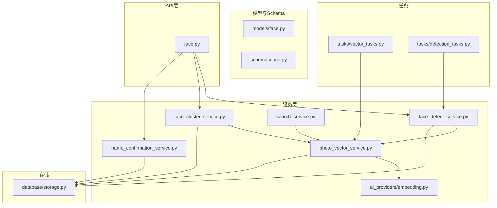
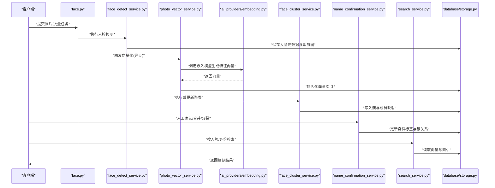
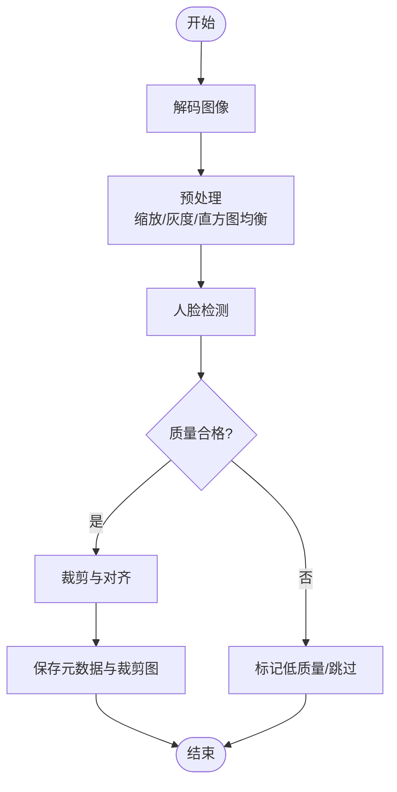
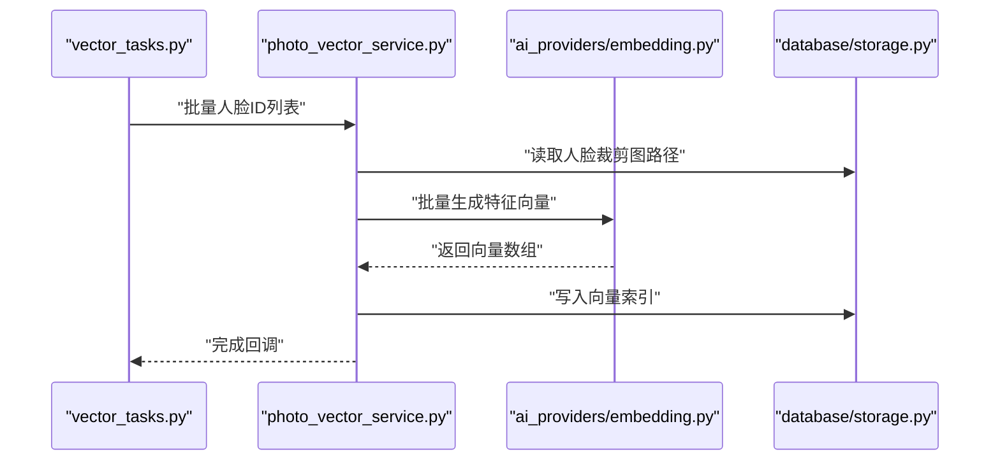
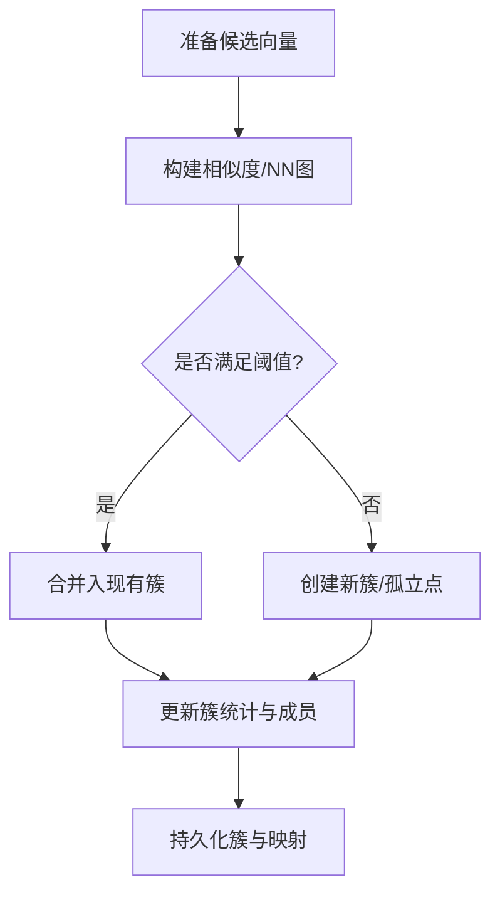
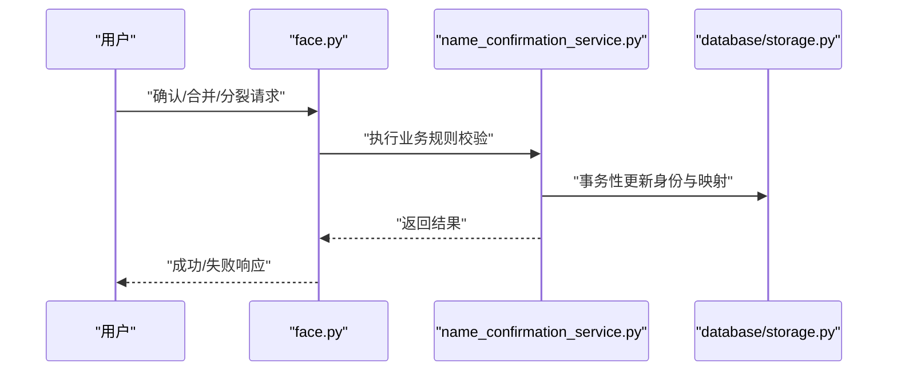
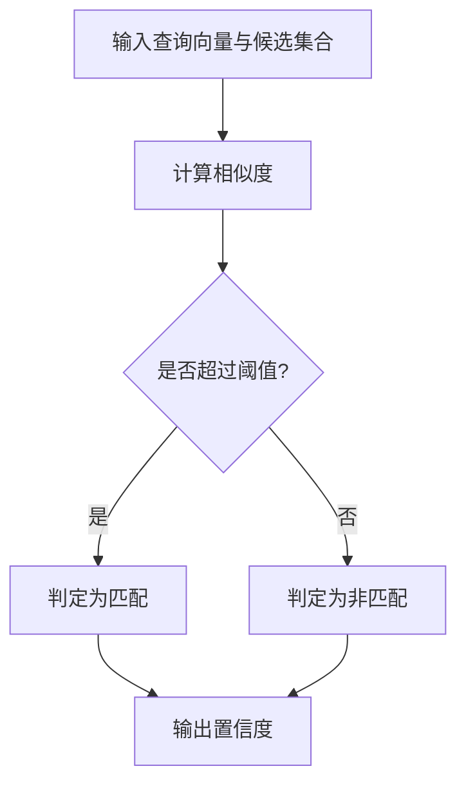
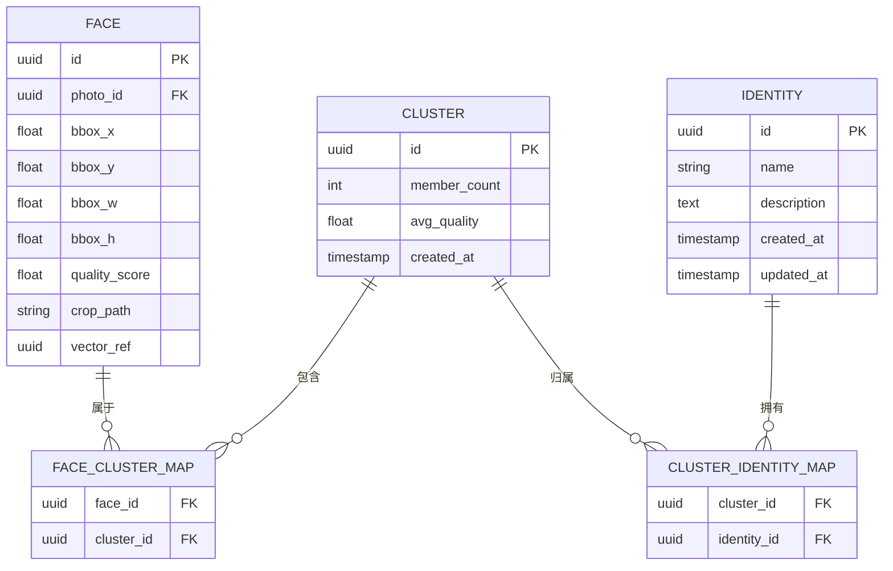
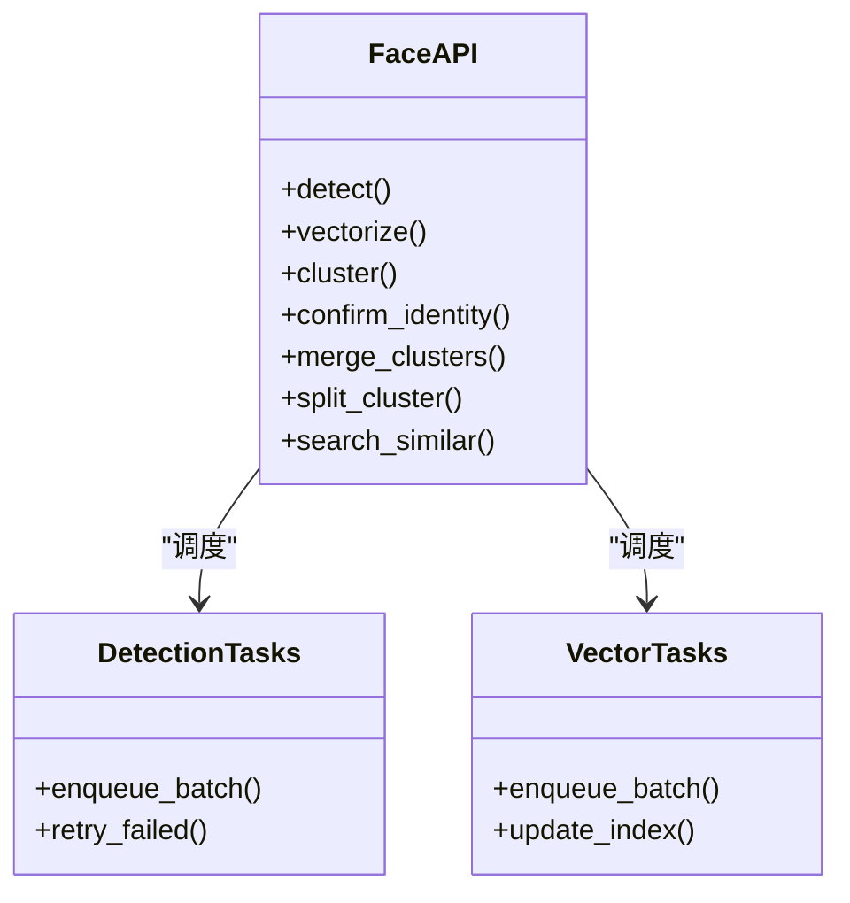
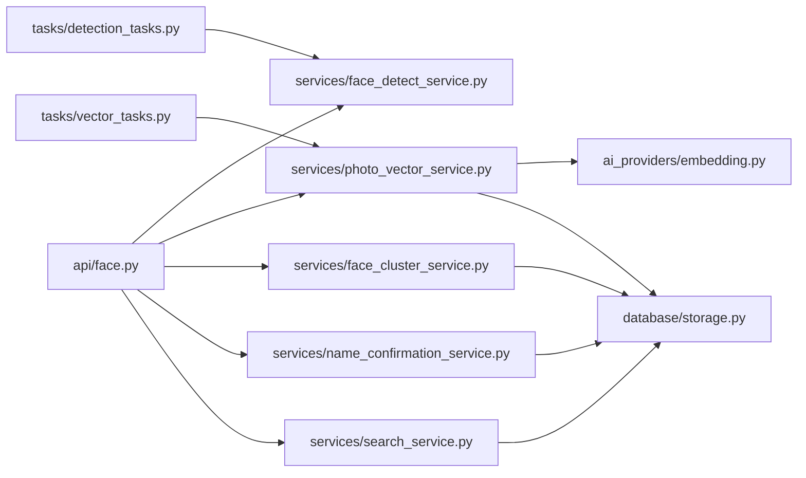

# Face人脸Agent

<cite>
**本文引用的文件**   
- [backend/app/api/face.py](file://backend/app/api/face.py)
- [backend/app/services/face_detect_service.py](file://backend/app/services/face_detect_service.py)
- [backend/app/services/face_cluster_service.py](file://backend/app/services/face_cluster_service.py)
- [backend/app/services/name_confirmation_service.py](file://backend/app/services/name_confirmation_service.py)
- [backend/app/models/face.py](file://backend/app/models/face.py)
- [backend/app/schemas/face.py](file://backend/app/schemas/face.py)
- [backend/app/database/storage.py](file://backend/app/database/storage.py)
- [backend/app/tasks/vector_tasks.py](file://backend/app/tasks/vector_tasks.py)
- [backend/app/tasks/detection_tasks.py](file://backend/app/tasks/detection_tasks.py)
- [backend/app/services/photo_vector_service.py](file://backend/app/services/photo_vector_service.py)
- [backend/app/services/search_service.py](file://backend/app/services/search_service.py)
- [backend/app/services/embedding.py](file://backend/app/services/ai_providers/embedding.py)
</cite>

## 目录
1. [简介](#简介)
2. [项目结构](#项目结构)
3. [核心组件](#核心组件)
4. [架构总览](#架构总览)
5. [详细组件分析](#详细组件分析)
6. [依赖关系分析](#依赖关系分析)
7. [性能考虑](#性能考虑)
8. [故障排查指南](#故障排查指南)
9. [结论](#结论)
10. [附录](#附录)

## 简介
本文件面向Face人脸Agent，系统性阐述人脸识别的完整流程与工程实现：从人脸检测、特征提取、聚类分析到身份确认；覆盖人脸数据库管理、相似度计算与阈值策略；包含去重、合并、分裂等数据治理逻辑；并给出预处理、质量控制与隐私保护机制，以及大规模人脸库的性能优化与分布式处理方案。文档以代码级事实为依据，辅以可视化图示帮助理解。

## 项目结构
围绕人脸能力的相关模块主要分布在API层、服务层、模型与Schema、任务调度与向量检索等位置。整体组织遵循分层与职责分离原则：API负责请求路由与参数校验，服务层封装业务逻辑，模型与Schema定义数据结构，任务层承载异步与批处理，存储层提供持久化与对象存储访问。

图表来源
- [backend/app/api/face.py](file://backend/app/api/face.py)
- [backend/app/services/face_detect_service.py](file://backend/app/services/face_detect_service.py)
- [backend/app/services/face_cluster_service.py](file://backend/app/services/face_cluster_service.py)
- [backend/app/services/name_confirmation_service.py](file://backend/app/services/name_confirmation_service.py)
- [backend/app/services/photo_vector_service.py](file://backend/app/services/photo_vector_service.py)
- [backend/app/services/search_service.py](file://backend/app/services/search_service.py)
- [backend/app/services/ai_providers/embedding.py](file://backend/app/services/ai_providers/embedding.py)
- [backend/app/models/face.py](file://backend/app/models/face.py)
- [backend/app/schemas/face.py](file://backend/app/schemas/face.py)
- [backend/app/database/storage.py](file://backend/app/database/storage.py)
- [backend/app/tasks/vector_tasks.py](file://backend/app/tasks/vector_tasks.py)
- [backend/app/tasks/detection_tasks.py](file://backend/app/tasks/detection_tasks.py)

章节来源
- [backend/app/api/face.py](file://backend/app/api/face.py)
- [backend/app/services/face_detect_service.py](file://backend/app/services/face_detect_service.py)
- [backend/app/services/face_cluster_service.py](file://backend/app/services/face_cluster_service.py)
- [backend/app/services/name_confirmation_service.py](file://backend/app/services/name_confirmation_service.py)
- [backend/app/services/photo_vector_service.py](file://backend/app/services/photo_vector_service.py)
- [backend/app/services/search_service.py](file://backend/app/services/search_service.py)
- [backend/app/services/ai_providers/embedding.py](file://backend/app/services/ai_providers/embedding.py)
- [backend/app/models/face.py](file://backend/app/models/face.py)
- [backend/app/schemas/face.py](file://backend/app/schemas/face.py)
- [backend/app/database/storage.py](file://backend/app/database/storage.py)
- [backend/app/tasks/vector_tasks.py](file://backend/app/tasks/vector_tasks.py)
- [backend/app/tasks/detection_tasks.py](file://backend/app/tasks/detection_tasks.py)

## 核心组件
- 人脸检测服务：负责图像中人脸区域定位、裁剪与基础质量评估，产出人脸记录与候选框信息。
- 向量嵌入服务：将人脸图像转换为高维特征向量，用于后续相似度计算与检索。
- 聚类服务：基于特征向量进行聚类，形成“人脸簇”，代表同一身份的潜在集合。
- 名称确认服务：在用户参与下完成身份标注与确认，支持新增、合并、分裂等操作。
- 向量检索服务：提供相似人脸搜索、按身份召回等功能。
- 任务系统：将耗时的人脸检测与向量化任务异步化，提升吞吐与稳定性。
- 存储层：统一访问数据库与对象存储，保障人脸图片、向量与元数据的持久化。

章节来源
- [backend/app/services/face_detect_service.py](file://backend/app/services/face_detect_service.py)
- [backend/app/services/photo_vector_service.py](file://backend/app/services/photo_vector_service.py)
- [backend/app/services/face_cluster_service.py](file://backend/app/services/face_cluster_service.py)
- [backend/app/services/name_confirmation_service.py](file://backend/app/services/name_confirmation_service.py)
- [backend/app/services/search_service.py](file://backend/app/services/search_service.py)
- [backend/app/tasks/vector_tasks.py](file://backend/app/tasks/vector_tasks.py)
- [backend/app/tasks/detection_tasks.py](file://backend/app/tasks/detection_tasks.py)
- [backend/app/database/storage.py](file://backend/app/database/storage.py)

## 架构总览
下图展示了从上传照片到最终可检索、可确认的人脸数据的全链路流程，包括检测、向量化、聚类、确认与检索的关键交互。

图表来源
- [backend/app/api/face.py](file://backend/app/api/face.py)
- [backend/app/services/face_detect_service.py](file://backend/app/services/face_detect_service.py)
- [backend/app/services/photo_vector_service.py](file://backend/app/services/photo_vector_service.py)
- [backend/app/services/ai_providers/embedding.py](file://backend/app/services/ai_providers/embedding.py)
- [backend/app/services/face_cluster_service.py](file://backend/app/services/face_cluster_service.py)
- [backend/app/services/name_confirmation_service.py](file://backend/app/services/name_confirmation_service.py)
- [backend/app/services/search_service.py](file://backend/app/services/search_service.py)
- [backend/app/database/storage.py](file://backend/app/database/storage.py)

## 详细组件分析

### 人脸检测与预处理
- 功能要点
  - 输入为照片或视频帧，输出为人脸边界框、关键点（如有）与裁剪图。
  - 预处理包含尺寸归一化、亮度/对比度校正、模糊/遮挡检测等质量控制步骤。
  - 对低质量人脸进行标记，便于后续过滤或二次处理。
- 关键流程
  - 接收请求 -> 解码图像 -> 预处理 -> 检测 -> 质量评分 -> 落库与缓存。
- 异常与容错
  - 对无法检测或质量不达标的人脸进行降级处理，避免污染向量空间。
  - 失败重试与任务拆分，保证大批量处理的鲁棒性。

图表来源
- [backend/app/services/face_detect_service.py](file://backend/app/services/face_detect_service.py)
- [backend/app/database/storage.py](file://backend/app/database/storage.py)

章节来源
- [backend/app/services/face_detect_service.py](file://backend/app/services/face_detect_service.py)
- [backend/app/database/storage.py](file://backend/app/database/storage.py)

### 特征提取与向量索引
- 功能要点
  - 使用嵌入模型将人脸图像映射为固定维度的特征向量。
  - 向量持久化并提供近邻检索接口，支撑相似人脸搜索与聚类。
- 关键流程
  - 触发向量化 -> 加载裁剪图 -> 调用嵌入模型 -> 写入向量索引 -> 可选更新聚合统计。
- 性能优化
  - 批处理与并发控制，结合任务队列进行削峰填谷。
  - 向量增量更新与索引重建策略，降低全量开销。

图表来源
- [backend/app/tasks/vector_tasks.py](file://backend/app/tasks/vector_tasks.py)
- [backend/app/services/photo_vector_service.py](file://backend/app/services/photo_vector_service.py)
- [backend/app/services/ai_providers/embedding.py](file://backend/app/services/ai_providers/embedding.py)
- [backend/app/database/storage.py](file://backend/app/database/storage.py)

章节来源
- [backend/app/tasks/vector_tasks.py](file://backend/app/tasks/vector_tasks.py)
- [backend/app/services/photo_vector_service.py](file://backend/app/services/photo_vector_service.py)
- [backend/app/services/ai_providers/embedding.py](file://backend/app/services/ai_providers/embedding.py)
- [backend/app/database/storage.py](file://backend/app/database/storage.py)

### 聚类分析与身份分组
- 功能要点
  - 基于特征向量相似度进行聚类，形成“人脸簇”。
  - 支持增量聚类与局部重聚，减少全量计算成本。
- 关键流程
  - 收集候选向量 -> 相似度矩阵/近似最近邻 -> 聚类算法 -> 生成簇与成员映射 -> 持久化。
- 阈值与策略
  - 通过相似度阈值控制簇粒度；结合质量分与数量先验进行动态调整。
  - 对孤立点与小簇进行特殊处理，避免噪声影响。

图表来源
- [backend/app/services/face_cluster_service.py](file://backend/app/services/face_cluster_service.py)
- [backend/app/database/storage.py](file://backend/app/database/storage.py)

章节来源
- [backend/app/services/face_cluster_service.py](file://backend/app/services/face_cluster_service.py)
- [backend/app/database/storage.py](file://backend/app/database/storage.py)

### 身份确认、去重、合并与分裂
- 功能要点
  - 用户可对簇进行命名与确认，建立“身份”与“簇”的关系。
  - 支持合并两个簇为一个身份，或将一个簇分裂为多个身份。
  - 去重：当检测到重复人脸时，自动或半自动合并至同一身份。
- 关键流程
  - 确认/合并/分裂请求 -> 校验一致性 -> 更新身份标签与映射 -> 触发索引与统计更新。
- 一致性保障
  - 事务性更新，确保身份、簇与成员映射的一致性。
  - 操作审计日志，便于回溯与恢复。

图表来源
- [backend/app/api/face.py](file://backend/app/api/face.py)
- [backend/app/services/name_confirmation_service.py](file://backend/app/services/name_confirmation_service.py)
- [backend/app/database/storage.py](file://backend/app/database/storage.py)

章节来源
- [backend/app/api/face.py](file://backend/app/api/face.py)
- [backend/app/services/name_confirmation_service.py](file://backend/app/services/name_confirmation_service.py)
- [backend/app/database/storage.py](file://backend/app/database/storage.py)

### 相似度计算与阈值策略
- 相似度度量
  - 常用余弦相似度或欧氏距离，取决于嵌入模型输出分布。
- 阈值设置
  - 验证集上绘制ROC/PR曲线，选择FAR/FRR平衡点作为初始阈值。
  - 按场景动态调整：门禁/解锁等高安全场景提高阈值，相册浏览适当放宽。
  - 引入置信区间与质量加权，对低质量样本采用更保守阈值。
- 决策流程
  - 计算候选相似度 -> 比较阈值 -> 判定匹配/非匹配 -> 输出置信度。

图表来源
- [backend/app/services/search_service.py](file://backend/app/services/search_service.py)
- [backend/app/services/photo_vector_service.py](file://backend/app/services/photo_vector_service.py)

章节来源
- [backend/app/services/search_service.py](file://backend/app/services/search_service.py)
- [backend/app/services/photo_vector_service.py](file://backend/app/services/photo_vector_service.py)

### 数据模型与Schema
- 模型与Schema职责
  - 模型定义数据库表结构与关系，如人脸、簇、身份、任务状态等。
  - Schema定义API请求/响应的字段约束与校验规则。
- 关键字段建议
  - 人脸：唯一标识、所属照片、边界框、质量分、裁剪图路径、向量引用。
  - 簇：簇标识、成员集合、统计信息（人数估计、平均质量）。
  - 身份：名称、描述、创建/更新时间、关联簇集合。
  - 任务：类型、状态、进度、错误信息、重试次数。

图表来源
- [backend/app/models/face.py](file://backend/app/models/face.py)
- [backend/app/schemas/face.py](file://backend/app/schemas/face.py)

章节来源
- [backend/app/models/face.py](file://backend/app/models/face.py)
- [backend/app/schemas/face.py](file://backend/app/schemas/face.py)

### API与任务编排
- API设计
  - 提供人脸检测、向量化、聚类、确认、合并/分裂、检索等端点。
  - 统一响应格式与错误码，便于前端集成。
- 任务编排
  - 检测与向量化任务异步化，支持批量与断点续传。
  - 任务状态机：待处理、进行中、已完成、失败、重试中。

图表来源
- [backend/app/api/face.py](file://backend/app/api/face.py)
- [backend/app/tasks/detection_tasks.py](file://backend/app/tasks/detection_tasks.py)
- [backend/app/tasks/vector_tasks.py](file://backend/app/tasks/vector_tasks.py)

章节来源
- [backend/app/api/face.py](file://backend/app/api/face.py)
- [backend/app/tasks/detection_tasks.py](file://backend/app/tasks/detection_tasks.py)
- [backend/app/tasks/vector_tasks.py](file://backend/app/tasks/vector_tasks.py)

## 依赖关系分析
- 组件耦合
  - API层仅依赖服务层接口，保持松耦合。
  - 服务层依赖存储层与嵌入模型，屏蔽底层细节。
  - 任务层与服务层解耦，通过消息队列或内部调度器通信。
- 外部依赖
  - 嵌入模型提供方（本地或远程），需考虑超时与降级策略。
  - 向量索引后端（内存/磁盘/专用引擎），需关注扩展性与一致性。
- 循环依赖检查
  - 当前分层清晰，未发现直接循环导入；若引入跨层调用，应通过事件或接口抽象化解耦。

图表来源
- [backend/app/api/face.py](file://backend/app/api/face.py)
- [backend/app/services/face_detect_service.py](file://backend/app/services/face_detect_service.py)
- [backend/app/services/photo_vector_service.py](file://backend/app/services/photo_vector_service.py)
- [backend/app/services/face_cluster_service.py](file://backend/app/services/face_cluster_service.py)
- [backend/app/services/name_confirmation_service.py](file://backend/app/services/name_confirmation_service.py)
- [backend/app/services/search_service.py](file://backend/app/services/search_service.py)
- [backend/app/services/ai_providers/embedding.py](file://backend/app/services/ai_providers/embedding.py)
- [backend/app/database/storage.py](file://backend/app/database/storage.py)
- [backend/app/tasks/vector_tasks.py](file://backend/app/tasks/vector_tasks.py)
- [backend/app/tasks/detection_tasks.py](file://backend/app/tasks/detection_tasks.py)

章节来源
- [backend/app/api/face.py](file://backend/app/api/face.py)
- [backend/app/services/face_detect_service.py](file://backend/app/services/face_detect_service.py)
- [backend/app/services/photo_vector_service.py](file://backend/app/services/photo_vector_service.py)
- [backend/app/services/face_cluster_service.py](file://backend/app/services/face_cluster_service.py)
- [backend/app/services/name_confirmation_service.py](file://backend/app/services/name_confirmation_service.py)
- [backend/app/services/search_service.py](file://backend/app/services/search_service.py)
- [backend/app/services/ai_providers/embedding.py](file://backend/app/services/ai_providers/embedding.py)
- [backend/app/database/storage.py](file://backend/app/database/storage.py)
- [backend/app/tasks/vector_tasks.py](file://backend/app/tasks/vector_tasks.py)
- [backend/app/tasks/detection_tasks.py](file://backend/app/tasks/detection_tasks.py)

## 性能考虑
- 检测阶段
  - 多尺度检测与自适应分辨率，平衡精度与速度。
  - 预取与并行解码，减少I/O瓶颈。
- 向量化阶段
  - 批处理大小调优，GPU/CPU资源利用率最大化。
  - 向量增量写入与索引分段更新，避免全量重建。
- 聚类阶段
  - 近似最近邻替代全量相似度矩阵，降低O(n^2)复杂度。
  - 增量聚类与局部重聚，仅在新增/变更子图上计算。
- 检索阶段
  - 向量索引采用高效数据结构（如HNSW/IVF），支持KNN快速召回。
  - 多级过滤：先按身份/时间/地点粗筛，再细算相似度。
- 分布式策略
  - 水平扩展：检测与向量化无状态节点横向扩容。
  - 任务分区：按照片ID哈希分片，避免热点。
  - 一致性：向量索引与元数据采用最终一致+补偿任务修复。

[本节为通用性能指导，无需特定文件来源]

## 故障排查指南
- 常见问题
  - 检测失败：检查图像格式、损坏文件、分辨率过低。
  - 向量化超时：检查嵌入模型可用性、网络延迟、批大小。
  - 聚类异常：检查向量维度一致性、缺失值、质量分分布。
  - 检索慢：检查索引健康度、K值设置、过滤条件有效性。
- 诊断手段
  - 查看任务状态与重试计数，定位失败批次。
  - 抽样回放低质量人脸，复核阈值与预处理策略。
  - 监控向量索引大小与命中率，评估是否需要重建。
- 恢复策略
  - 失败任务幂等重试，支持断点续传。
  - 索引版本化与快照回滚，保障数据安全。

章节来源
- [backend/app/tasks/vector_tasks.py](file://backend/app/tasks/vector_tasks.py)
- [backend/app/tasks/detection_tasks.py](file://backend/app/tasks/detection_tasks.py)
- [backend/app/database/storage.py](file://backend/app/database/storage.py)

## 结论
Face人脸Agent以分层架构与任务驱动为核心，实现了从检测到确认的端到端能力。通过合理的阈值策略、增量更新与分布式扩展，可在大规模人脸库上保持稳定与高性能。建议在上线前完成阈值校准与压测，持续监控关键指标并迭代优化。

[本节为总结性内容，无需特定文件来源]

## 附录
- 术语
  - 人脸簇：由相似人脸组成的集合，可能对应同一身份。
  - 身份：经用户确认后的稳定实体，可关联多个簇。
  - 相似度：衡量两个向量接近程度的数值，决定匹配与否。
- 最佳实践
  - 严格的数据质量控制，避免低质量样本污染模型。
  - 定期审计与清理无效/重复数据，保持库整洁。
  - 隐私合规：最小化采集、加密存储、访问控制与审计日志。

[本节为概念性内容，无需特定文件来源]