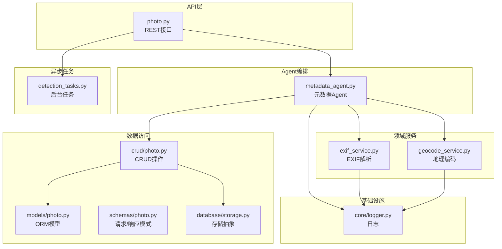
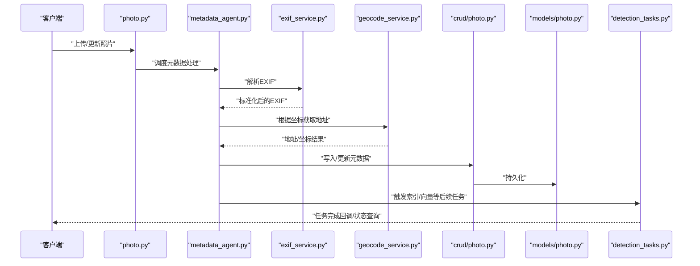
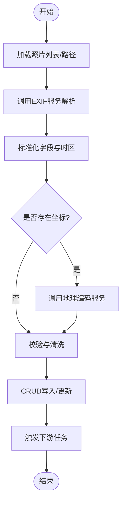
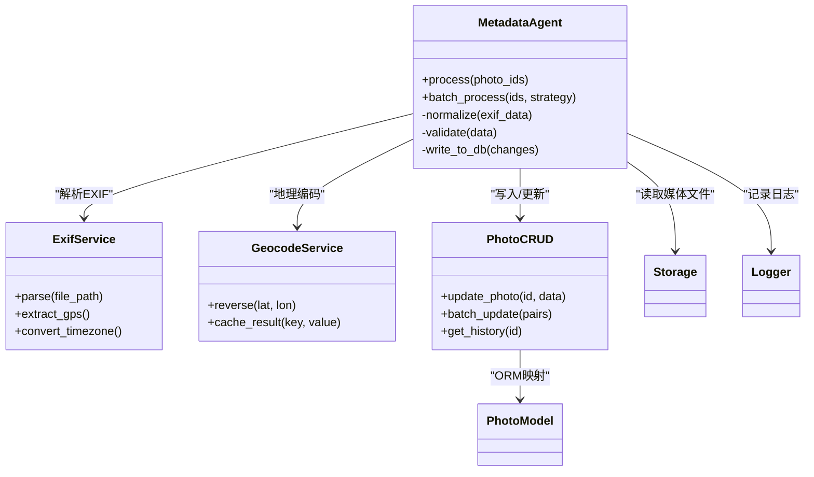

# Metadata元数据Agent

<cite>
**本文引用的文件**   
- [backend/app/services/agent/metadata_agent.py](file://backend/app/services/agent/metadata_agent.py)
- [backend/app/services/exif_service.py](file://backend/app/services/exif_service.py)
- [backend/app/services/geocode_service.py](file://backend/app/services/geocode_service.py)
- [backend/app/models/photo.py](file://backend/app/models/photo.py)
- [backend/app/schemas/photo.py](file://backend/app/schemas/photo.py)
- [backend/app/crud/photo.py](file://backend/app/crud/photo.py)
- [backend/app/api/photo.py](file://backend/app/api/photo.py)
- [backend/app/tasks/detection_tasks.py](file://backend/app/tasks/detection_tasks.py)
- [backend/app/database/storage.py](file://backend/app/database/storage.py)
- [backend/app/core/logger.py](file://backend/app/core/logger.py)
</cite>

## 目录
1. [简介](#简介)
2. [项目结构](#项目结构)
3. [核心组件](#核心组件)
4. [架构总览](#架构总览)
5. [详细组件分析](#详细组件分析)
6. [依赖关系分析](#依赖关系分析)
7. [性能考虑](#性能考虑)
8. [故障排查指南](#故障排查指南)
9. [结论](#结论)
10. [附录](#附录)

## 简介
本文件围绕“Metadata元数据Agent”展开，系统性阐述照片元数据的提取、处理与更新流程，覆盖EXIF信息解析、地理位置获取、时间戳处理、标准化与校验清洗、批量与增量更新、冲突解决策略、查询接口与索引优化、缓存策略，以及备份恢复与版本管理方案。文档以代码级实现为依据，结合架构图与流程图帮助读者快速理解并落地使用。

## 项目结构
与Metadata元数据Agent相关的后端模块主要分布在以下位置：
- Agent编排层：services/agent/metadata_agent.py
- EXIF服务：services/exif_service.py
- 地理编码服务：services/geocode_service.py
- 模型与模式定义：models/photo.py、schemas/photo.py
- 持久化CRUD：crud/photo.py
- API入口：api/photo.py
- 异步任务：tasks/detection_tasks.py（包含元数据处理任务）
- 存储抽象：database/storage.py
- 日志：core/logger.py

图表来源
- [backend/app/api/photo.py](file://backend/app/api/photo.py)
- [backend/app/services/agent/metadata_agent.py](file://backend/app/services/agent/metadata_agent.py)
- [backend/app/services/exif_service.py](file://backend/app/services/exif_service.py)
- [backend/app/services/geocode_service.py](file://backend/app/services/geocode_service.py)
- [backend/app/crud/photo.py](file://backend/app/crud/photo.py)
- [backend/app/models/photo.py](file://backend/app/models/photo.py)
- [backend/app/schemas/photo.py](file://backend/app/schemas/photo.py)
- [backend/app/database/storage.py](file://backend/app/database/storage.py)
- [backend/app/tasks/detection_tasks.py](file://backend/app/tasks/detection_tasks.py)
- [backend/app/core/logger.py](file://backend/app/core/logger.py)

章节来源
- [backend/app/services/agent/metadata_agent.py](file://backend/app/services/agent/metadata_agent.py)
- [backend/app/services/exif_service.py](file://backend/app/services/exif_service.py)
- [backend/app/services/geocode_service.py](file://backend/app/services/geocode_service.py)
- [backend/app/models/photo.py](file://backend/app/models/photo.py)
- [backend/app/schemas/photo.py](file://backend/app/schemas/photo.py)
- [backend/app/crud/photo.py](file://backend/app/crud/photo.py)
- [backend/app/api/photo.py](file://backend/app/api/photo.py)
- [backend/app/tasks/detection_tasks.py](file://backend/app/tasks/detection_tasks.py)
- [backend/app/database/storage.py](file://backend/app/database/storage.py)
- [backend/app/core/logger.py](file://backend/app/core/logger.py)

## 核心组件
- 元数据Agent：负责协调EXIF解析、地理编码、时间戳处理、标准化与校验、写入数据库及触发后续任务。
- EXIF服务：从媒体文件中读取EXIF字段，进行格式转换与时区处理。
- 地理编码服务：将经纬度转换为可读地址或用于地图展示；支持失败回退与重试。
- 模型与模式：Photo ORM模型承载元数据字段；Schemas定义输入输出校验规则。
- CRUD层：提供原子化的元数据读写与批量更新能力。
- 任务系统：通过后台任务执行耗时或批量的元数据处理，避免阻塞主线程。
- 存储抽象：统一文件与对象存储的访问方式，便于扩展。
- 日志：贯穿各层的结构化日志，便于追踪问题。

章节来源
- [backend/app/services/agent/metadata_agent.py](file://backend/app/services/agent/metadata_agent.py)
- [backend/app/services/exif_service.py](file://backend/app/services/exif_service.py)
- [backend/app/services/geocode_service.py](file://backend/app/services/geocode_service.py)
- [backend/app/models/photo.py](file://backend/app/models/photo.py)
- [backend/app/schemas/photo.py](file://backend/app/schemas/photo.py)
- [backend/app/crud/photo.py](file://backend/app/crud/photo.py)
- [backend/app/tasks/detection_tasks.py](file://backend/app/tasks/detection_tasks.py)
- [backend/app/database/storage.py](file://backend/app/database/storage.py)
- [backend/app/core/logger.py](file://backend/app/core/logger.py)

## 架构总览
下图展示了从API到Agent再到服务与数据层的完整调用链，包括异步任务的参与。

图表来源
- [backend/app/api/photo.py](file://backend/app/api/photo.py)
- [backend/app/services/agent/metadata_agent.py](file://backend/app/services/agent/metadata_agent.py)
- [backend/app/services/exif_service.py](file://backend/app/services/exif_service.py)
- [backend/app/services/geocode_service.py](file://backend/app/services/geocode_service.py)
- [backend/app/crud/photo.py](file://backend/app/crud/photo.py)
- [backend/app/models/photo.py](file://backend/app/models/photo.py)
- [backend/app/tasks/detection_tasks.py](file://backend/app/tasks/detection_tasks.py)

## 详细组件分析

### 元数据Agent（metadata_agent.py）
职责与流程
- 接收待处理的照片ID或文件路径集合。
- 调用EXIF服务提取原始元数据并进行标准化。
- 若存在坐标，调用地理编码服务补充地址信息。
- 对时间戳进行时区规范化与一致性校验。
- 执行元数据校验与清洗（去重、空值处理、范围检查）。
- 通过CRUD层写入数据库，记录变更历史。
- 触发下游任务（如索引重建、缩略图生成、向量嵌入等）。

关键设计点
- 幂等性：同一份输入多次执行不会产生重复或错误的数据。
- 可重试：网络型服务（地理编码）具备重试与降级策略。
- 事务性：批量更新采用事务包裹，保证一致性。
- 可观测性：关键步骤打点与日志记录。

图表来源
- [backend/app/services/agent/metadata_agent.py](file://backend/app/services/agent/metadata_agent.py)
- [backend/app/services/exif_service.py](file://backend/app/services/exif_service.py)
- [backend/app/services/geocode_service.py](file://backend/app/services/geocode_service.py)
- [backend/app/crud/photo.py](file://backend/app/crud/photo.py)
- [backend/app/tasks/detection_tasks.py](file://backend/app/tasks/detection_tasks.py)

章节来源
- [backend/app/services/agent/metadata_agent.py](file://backend/app/services/agent/metadata_agent.py)

### EXIF服务（exif_service.py）
功能要点
- 读取常见EXIF标签（拍摄时间、设备型号、相机参数、GPS等）。
- 处理缺失、异常与不一致字段，返回标准化结构。
- 时区识别与UTC归一化，确保时间戳一致可比。
- 对GPS坐标进行有效性校验与单位换算。

复杂度与性能
- 单张照片解析为I/O密集型，建议并发控制与超时保护。
- 大体积RAW/高分辨率图片需限制解析深度，必要时跳过非关键标签。

章节来源
- [backend/app/services/exif_service.py](file://backend/app/services/exif_service.py)

### 地理编码服务（geocode_service.py）
功能要点
- 基于经纬度反查地址，返回结构化地址信息。
- 支持失败回退：当外部服务不可用时，仅保留坐标。
- 可选缓存：按坐标键缓存最近结果，降低重复请求。

容错与重试
- 指数退避重试，最大重试次数与超时阈值可配置。
- 限流与熔断：防止雪崩效应。

章节来源
- [backend/app/services/geocode_service.py](file://backend/app/services/geocode_service.py)

### 模型与模式（models/photo.py, schemas/photo.py）
- Photo模型：定义元数据相关字段（时间戳、坐标、地址、设备信息等），并提供必要的索引与约束。
- Schemas：定义创建/更新请求体与响应体的字段类型、必填项与默认值，保障API契约稳定。

章节来源
- [backend/app/models/photo.py](file://backend/app/models/photo.py)
- [backend/app/schemas/photo.py](file://backend/app/schemas/photo.py)

### CRUD层（crud/photo.py）
能力
- 单条与批量更新元数据，支持部分更新与全量替换两种模式。
- 变更历史：记录每次更新的快照或差异，便于审计与回滚。
- 冲突检测：在并发更新场景下，基于版本号或时间戳判断冲突并给出策略。

事务与一致性
- 批量更新使用事务，失败自动回滚。
- 写前校验：在写入前再次执行一次轻量校验，减少脏数据入库概率。

章节来源
- [backend/app/crud/photo.py](file://backend/app/crud/photo.py)

### API层（api/photo.py）
暴露的接口
- 上传后自动触发元数据处理。
- 手动触发指定照片或批量的元数据更新。
- 查询元数据详情与列表过滤（按时间、地点、设备等）。
- 任务状态查询与取消。

权限与安全
- 鉴权中间件与资源隔离。
- 输入校验与速率限制。

章节来源
- [backend/app/api/photo.py](file://backend/app/api/photo.py)

### 异步任务（detection_tasks.py）
角色
- 解耦耗时操作：如索引重建、向量嵌入、缩略图生成。
- 任务队列：支持优先级、重试与死信队列。
- 进度上报：对外提供任务进度查询接口。

章节来源
- [backend/app/tasks/detection_tasks.py](file://backend/app/tasks/detection_tasks.py)

### 存储抽象（database/storage.py）
职责
- 统一文件与对象存储访问，屏蔽底层差异。
- 提供分片下载、断点续传、并发读取等能力。
- 与元数据Agent协作，按需拉取媒体文件进行解析。

章节来源
- [backend/app/database/storage.py](file://backend/app/database/storage.py)

### 日志（core/logger.py）
作用
- 结构化日志输出，包含请求ID、用户ID、资源ID等上下文。
- 分级日志与采样策略，兼顾可观测性与性能。

章节来源
- [backend/app/core/logger.py](file://backend/app/core/logger.py)

## 依赖关系分析

图表来源
- [backend/app/services/agent/metadata_agent.py](file://backend/app/services/agent/metadata_agent.py)
- [backend/app/services/exif_service.py](file://backend/app/services/exif_service.py)
- [backend/app/services/geocode_service.py](file://backend/app/services/geocode_service.py)
- [backend/app/crud/photo.py](file://backend/app/crud/photo.py)
- [backend/app/models/photo.py](file://backend/app/models/photo.py)
- [backend/app/database/storage.py](file://backend/app/database/storage.py)
- [backend/app/core/logger.py](file://backend/app/core/logger.py)

章节来源
- [backend/app/services/agent/metadata_agent.py](file://backend/app/services/agent/metadata_agent.py)
- [backend/app/services/exif_service.py](file://backend/app/services/exif_service.py)
- [backend/app/services/geocode_service.py](file://backend/app/services/geocode_service.py)
- [backend/app/crud/photo.py](file://backend/app/crud/photo.py)
- [backend/app/models/photo.py](file://backend/app/models/photo.py)
- [backend/app/database/storage.py](file://backend/app/database/storage.py)
- [backend/app/core/logger.py](file://backend/app/core/logger.py)

## 性能考虑
- 并发与限流
  - EXIF解析与地理编码均为外部依赖或I/O密集，应设置合理的并发上限与超时。
  - 地理编码结果可按坐标键做短期缓存，减少重复请求。
- 批量处理
  - 分批提交，每批大小可配置，避免单次事务过大导致锁竞争。
  - 使用幂等键（如文件哈希+更新时间）避免重复写入。
- 索引优化
  - 针对常用查询字段建立复合索引（如时间范围+地点区域）。
  - 对文本类字段（设备型号、描述）使用前缀索引或全文索引。
- 缓存策略
  - 读多写少场景下，对热点元数据结果进行缓存，设置合理TTL。
  - 缓存失效策略：更新成功后主动失效对应缓存。
- 异步化
  - 将耗时操作放入任务队列，提升API响应速度。
  - 任务重试与死信队列保障可靠性。

[本节为通用指导，不直接分析具体文件]

## 故障排查指南
常见问题与定位方法
- EXIF解析失败
  - 现象：无法读取时间或GPS字段。
  - 排查：检查文件格式是否受支持、文件是否损坏、权限是否足够。
  - 参考：[backend/app/services/exif_service.py](file://backend/app/services/exif_service.py)
- 地理编码超时或失败
  - 现象：地址为空或频繁报错。
  - 排查：确认外部服务可用性、网络连通性、配额与限流；查看重试与熔断日志。
  - 参考：[backend/app/services/geocode_service.py](file://backend/app/services/geocode_service.py)
- 时间戳不一致
  - 现象：排序或筛选结果异常。
  - 排查：确认时区转换逻辑与源数据时区标记；核对数据库存储格式。
  - 参考：[backend/app/services/exif_service.py](file://backend/app/services/exif_service.py)、[backend/app/models/photo.py](file://backend/app/models/photo.py)
- 批量更新卡顿
  - 现象：大批量更新时数据库锁等待。
  - 排查：调整批次大小、增加索引、拆分事务。
  - 参考：[backend/app/crud/photo.py](file://backend/app/crud/photo.py)
- 任务堆积
  - 现象：任务队列积压，处理延迟高。
  - 排查：扩容worker、检查任务粒度与重试策略。
  - 参考：[backend/app/tasks/detection_tasks.py](file://backend/app/tasks/detection_tasks.py)

章节来源
- [backend/app/services/exif_service.py](file://backend/app/services/exif_service.py)
- [backend/app/services/geocode_service.py](file://backend/app/services/geocode_service.py)
- [backend/app/models/photo.py](file://backend/app/models/photo.py)
- [backend/app/crud/photo.py](file://backend/app/crud/photo.py)
- [backend/app/tasks/detection_tasks.py](file://backend/app/tasks/detection_tasks.py)

## 结论
Metadata元数据Agent通过清晰的编排与分层设计，实现了从EXIF解析、地理编码、时间戳处理到标准化、校验清洗、持久化与任务触发的完整闭环。借助异步任务、事务与幂等设计，系统在大规模数据场景下具备良好的稳定性与可扩展性。配合索引优化与缓存策略，查询性能与用户体验得到显著提升。

[本节为总结性内容，不直接分析具体文件]

## 附录

### 元数据标准化与清洗规则
- 时间戳
  - 统一为UTC存储，显示时按用户时区转换。
  - 缺失时间戳时回退至文件修改时间或上传时间，并标注来源。
- GPS坐标
  - 校验范围与精度，去除明显异常值。
  - 无坐标时不进行地理编码。
- 设备与相机参数
  - 字段名统一、枚举值规范化，未知值保留原样但标记。
- 地址信息
  - 优先使用结构化地址，失败则仅保留坐标。

章节来源
- [backend/app/services/exif_service.py](file://backend/app/services/exif_service.py)
- [backend/app/services/geocode_service.py](file://backend/app/services/geocode_service.py)
- [backend/app/schemas/photo.py](file://backend/app/schemas/photo.py)

### 批量处理与增量更新
- 批量处理
  - 支持按时间窗口、相册、标签等维度选择子集。
  - 分批提交，失败重试与补偿机制。
- 增量更新
  - 基于文件哈希与更新时间判断是否需要重新解析。
  - 仅更新发生变化的字段，减少写入压力。

章节来源
- [backend/app/crud/photo.py](file://backend/app/crud/photo.py)
- [backend/app/services/agent/metadata_agent.py](file://backend/app/services/agent/metadata_agent.py)

### 冲突解决策略
- 乐观锁
  - 基于版本号或更新时间戳，冲突时提示重试或合并策略。
- 合并策略
  - 按来源可信度排序（如EXIF优先于用户上传修正）。
  - 保留变更历史以便审计与回滚。

章节来源
- [backend/app/crud/photo.py](file://backend/app/crud/photo.py)

### 查询接口与索引优化
- 查询能力
  - 按时间范围、地点半径、设备型号、标签组合过滤。
  - 分页与排序，支持高亮与摘要。
- 索引优化
  - 复合索引：时间+地点、时间+设备。
  - 全文索引：设备型号、描述等文本字段。
  - 空间索引：用于地理范围查询。

章节来源
- [backend/app/models/photo.py](file://backend/app/models/photo.py)
- [backend/app/api/photo.py](file://backend/app/api/photo.py)

### 缓存策略
- 读缓存
  - 按资源ID缓存元数据结果，TTL可配置。
  - 更新成功后主动失效缓存。
- 地理编码缓存
  - 按坐标键缓存地址结果，过期时间较短。

章节来源
- [backend/app/services/geocode_service.py](file://backend/app/services/geocode_service.py)
- [backend/app/crud/photo.py](file://backend/app/crud/photo.py)

### 备份、恢复与版本管理
- 备份
  - 定期导出元数据快照（JSON/CSV），包含变更历史。
  - 与对象存储中的媒体文件快照联动。
- 恢复
  - 支持按时间点恢复，恢复到指定快照版本。
- 版本管理
  - 每条元数据记录维护版本号与更新时间。
  - 支持对比差异与回滚到上一版本。

章节来源
- [backend/app/crud/photo.py](file://backend/app/crud/photo.py)
- [backend/app/database/storage.py](file://backend/app/database/storage.py)