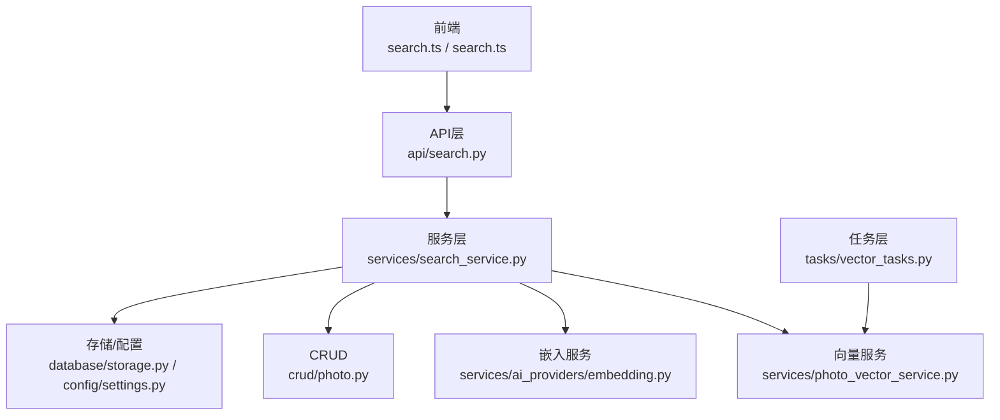
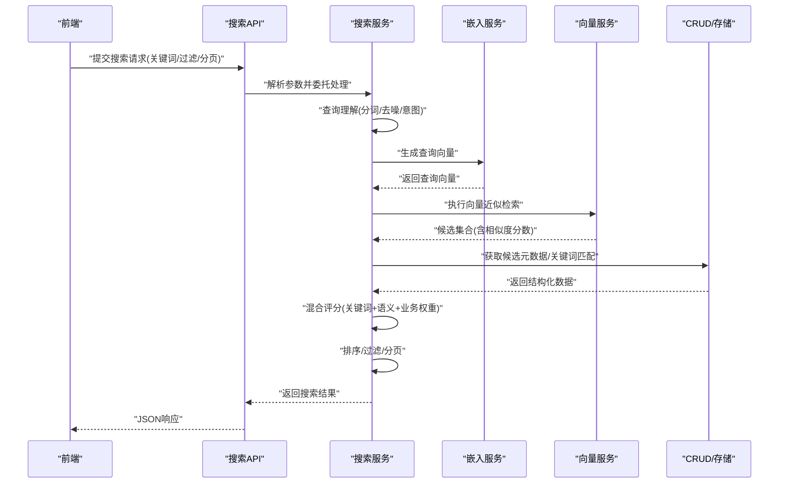
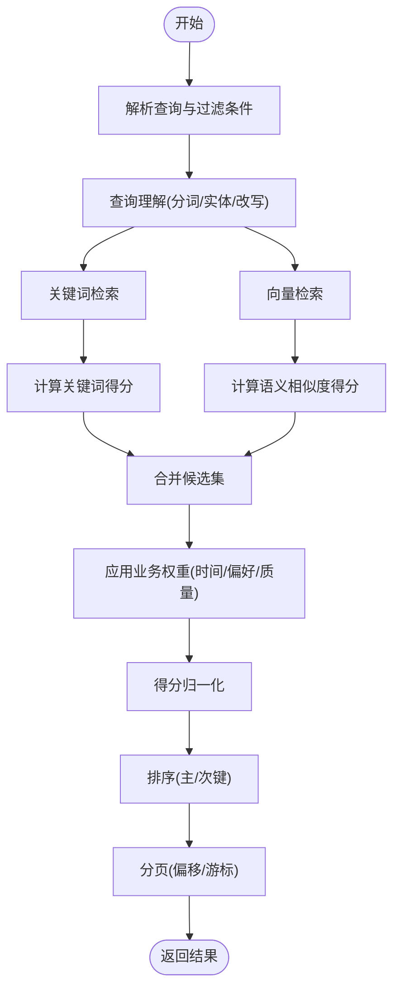
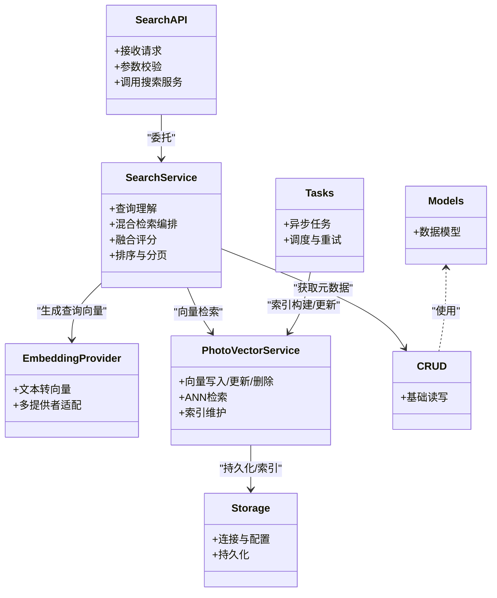

# Search搜索Agent

<cite>
**本文引用的文件**   
- [backend/app/api/search.py](file://backend/app/api/search.py)
- [backend/app/services/search_service.py](file://backend/app/services/search_service.py)
- [backend/app/services/photo_vector_service.py](file://backend/app/services/photo_vector_service.py)
- [backend/app/services/ai_providers/embedding.py](file://backend/app/services/ai_providers/embedding.py)
- [backend/app/models/photo.py](file://backend/app/models/photo.py)
- [backend/app/crud/photo.py](file://backend/app/crud/photo.py)
- [backend/app/database/storage.py](file://backend/app/database/storage.py)
- [backend/app/config/settings.py](file://backend/app/config/settings.py)
- [backend/app/tasks/vector_tasks.py](file://backend/app/tasks/vector_tasks.py)
- [backend/app/schemas/response.py](file://backend/app/schemas/response.py)
- [frontend/src/api/search.ts](file://frontend/src/api/search.ts)
- [frontend/src/types/search.ts](file://frontend/src/types/search.ts)
</cite>

## 目录
1. [简介](#简介)
2. [项目结构](#项目结构)
3. [核心组件](#核心组件)
4. [架构总览](#架构总览)
5. [详细组件分析](#详细组件分析)
6. [依赖关系分析](#依赖关系分析)
7. [性能与优化](#性能与优化)
8. [故障排查指南](#故障排查指南)
9. [结论](#结论)
10. [附录](#附录)

## 简介
本文件面向Search搜索Agent，系统性阐述语义搜索的实现原理与工程落地，包括查询理解、向量检索、混合搜索策略、结果排序算法、向量数据库集成、索引构建与优化、关键词匹配与语义相似度融合、个性化排序、过滤与分页、以及性能监控、缓存策略与查询优化最佳实践。文档以代码级实现为依据，提供可视化架构图与流程图，帮助读者快速掌握从接口到服务、从模型到存储的完整链路。

## 项目结构
搜索功能在后端采用分层设计：API层暴露REST接口，服务层编排查询理解、向量检索与排序逻辑，数据访问层负责持久化与外部向量库交互，任务层异步构建与维护向量索引。前端通过API调用与类型定义完成交互。

图表来源
- [backend/app/api/search.py](file://backend/app/api/search.py)
- [backend/app/services/search_service.py](file://backend/app/services/search_service.py)
- [backend/app/services/photo_vector_service.py](file://backend/app/services/photo_vector_service.py)
- [backend/app/services/ai_providers/embedding.py](file://backend/app/services/ai_providers/embedding.py)
- [backend/app/crud/photo.py](file://backend/app/crud/photo.py)
- [backend/app/database/storage.py](file://backend/app/database/storage.py)
- [backend/app/config/settings.py](file://backend/app/config/settings.py)
- [backend/app/tasks/vector_tasks.py](file://backend/app/tasks/vector_tasks.py)
- [frontend/src/api/search.ts](file://frontend/src/api/search.ts)
- [frontend/src/types/search.ts](file://frontend/src/types/search.ts)

章节来源
- [backend/app/api/search.py](file://backend/app/api/search.py)
- [backend/app/services/search_service.py](file://backend/app/services/search_service.py)
- [backend/app/services/photo_vector_service.py](file://backend/app/services/photo_vector_service.py)
- [backend/app/services/ai_providers/embedding.py](file://backend/app/services/ai_providers/embedding.py)
- [backend/app/crud/photo.py](file://backend/app/crud/photo.py)
- [backend/app/database/storage.py](file://backend/app/database/storage.py)
- [backend/app/config/settings.py](file://backend/app/config/settings.py)
- [backend/app/tasks/vector_tasks.py](file://backend/app/tasks/vector_tasks.py)
- [frontend/src/api/search.ts](file://frontend/src/api/search.ts)
- [frontend/src/types/search.ts](file://frontend/src/types/search.ts)

## 核心组件
- 搜索API控制器：接收请求参数（关键词、过滤条件、分页、排序偏好），委派给搜索服务进行统一处理。
- 搜索服务：负责查询理解（分词、去噪、意图识别）、生成查询向量、执行混合检索（关键词+语义）、融合评分、排序与分页。
- 向量服务：封装向量数据库操作（写入、更新、删除、近似检索），维护索引生命周期。
- 嵌入服务：将文本查询或元数据转换为向量表示，支持多种后端提供者。
- 任务系统：异步构建和维护向量索引，保障入库与检索一致性。
- 存储与配置：管理连接参数、索引路径、阈值与权重等可配置项。

章节来源
- [backend/app/api/search.py](file://backend/app/api/search.py)
- [backend/app/services/search_service.py](file://backend/app/services/search_service.py)
- [backend/app/services/photo_vector_service.py](file://backend/app/services/photo_vector_service.py)
- [backend/app/services/ai_providers/embedding.py](file://backend/app/services/ai_providers/embedding.py)
- [backend/app/tasks/vector_tasks.py](file://backend/app/tasks/vector_tasks.py)
- [backend/app/database/storage.py](file://backend/app/database/storage.py)
- [backend/app/config/settings.py](file://backend/app/config/settings.py)

## 架构总览
下图展示了从前端发起搜索请求到返回结果的端到端流程，涵盖查询理解、向量检索、混合评分与排序、分页输出。

图表来源
- [backend/app/api/search.py](file://backend/app/api/search.py)
- [backend/app/services/search_service.py](file://backend/app/services/search_service.py)
- [backend/app/services/ai_providers/embedding.py](file://backend/app/services/ai_providers/embedding.py)
- [backend/app/services/photo_vector_service.py](file://backend/app/services/photo_vector_service.py)
- [backend/app/crud/photo.py](file://backend/app/crud/photo.py)

## 详细组件分析

### 搜索API控制器
职责
- 校验输入参数（关键词、时间范围、地点、标签、人脸等过滤条件）
- 组装分页与排序参数
- 调用搜索服务并返回标准化响应

关键流程
- 参数解析与默认值填充
- 权限与上下文注入（如用户ID用于个性化）
- 错误码映射与日志记录

章节来源
- [backend/app/api/search.py](file://backend/app/api/search.py)
- [backend/app/schemas/response.py](file://backend/app/schemas/response.py)

### 搜索服务（核心编排）
职责
- 查询理解：分词、停用词去除、同义词扩展、实体识别、意图分类
- 混合检索：并行或串行触发关键词检索与向量检索
- 融合评分：加权组合关键词得分与语义相似度得分，结合业务权重（如时间衰减、用户偏好）
- 排序与分页：按综合得分降序，支持多字段排序与游标/偏移分页

算法要点
- 查询理解
  - 中文分词与短语提取
  - 实体抽取（人名、地名、时间）
  - 查询改写（同义替换、补全）
- 混合检索
  - 关键词：倒排索引或全文检索引擎
  - 语义：向量近似检索（ANN）
- 融合评分
  - 线性加权：Score = α·TF-IDF + β·CosSim + γ·BusinessWeight
  - 归一化与截断，避免极端值影响
- 排序与分页
  - 稳定排序，支持多键排序
  - 分页使用offset/limit或基于最后一条记录的游标

章节来源
- [backend/app/services/search_service.py](file://backend/app/services/search_service.py)

#### 融合评分流程图

图表来源
- [backend/app/services/search_service.py](file://backend/app/services/search_service.py)

### 向量服务（向量数据库集成）
职责
- 向量化数据的写入、更新、删除
- 近似最近邻检索（ANN）
- 索引构建、重建与增量更新
- 批量操作与事务一致性保障

集成方式
- 抽象接口：统一向量库操作（增删改查、检索）
- 具体实现：对接不同向量数据库（本地磁盘或远程服务）
- 配置驱动：维度、距离度量、索引类型、HNSW参数等

索引构建与优化
- 离线批量构建：高吞吐写入，预分配内存，分批提交
- 在线增量更新：幂等写入，冲突解决策略
- 索引调优：根据数据规模选择索引类型与参数，定期重建以提升召回率

章节来源
- [backend/app/services/photo_vector_service.py](file://backend/app/services/photo_vector_service.py)
- [backend/app/database/storage.py](file://backend/app/database/storage.py)
- [backend/app/config/settings.py](file://backend/app/config/settings.py)

### 嵌入服务（文本/元数据向量化）
职责
- 将自然语言查询或结构化元数据转换为固定维度的向量
- 支持多提供者（本地模型或云端API）
- 缓存热点查询向量，降低延迟与成本

实现要点
- 文本预处理：清洗、规范化、长度限制
- 模型选择：根据场景平衡精度与速度
- 失败重试与降级：网络异常时回退到备用提供者或缓存

章节来源
- [backend/app/services/ai_providers/embedding.py](file://backend/app/services/ai_providers/embedding.py)

### 任务系统（异步索引维护）
职责
- 后台任务：批量导入、索引重建、增量同步
- 任务调度：定时或事件触发
- 状态追踪：进度、失败重试、告警

章节来源
- [backend/app/tasks/vector_tasks.py](file://backend/app/tasks/vector_tasks.py)

### 数据模型与CRUD
职责
- 照片与相关实体的ORM模型定义
- 基础CRUD操作，支撑检索所需字段加载

章节来源
- [backend/app/models/photo.py](file://backend/app/models/photo.py)
- [backend/app/crud/photo.py](file://backend/app/crud/photo.py)

### 前端交互
职责
- 调用搜索API，传递查询参数与分页信息
- 展示搜索结果，支持筛选与排序切换

章节来源
- [frontend/src/api/search.ts](file://frontend/src/api/search.ts)
- [frontend/src/types/search.ts](file://frontend/src/types/search.ts)

## 依赖关系分析

图表来源
- [backend/app/api/search.py](file://backend/app/api/search.py)
- [backend/app/services/search_service.py](file://backend/app/services/search_service.py)
- [backend/app/services/ai_providers/embedding.py](file://backend/app/services/ai_providers/embedding.py)
- [backend/app/services/photo_vector_service.py](file://backend/app/services/photo_vector_service.py)
- [backend/app/database/storage.py](file://backend/app/database/storage.py)
- [backend/app/tasks/vector_tasks.py](file://backend/app/tasks/vector_tasks.py)
- [backend/app/models/photo.py](file://backend/app/models/photo.py)
- [backend/app/crud/photo.py](file://backend/app/crud/photo.py)

章节来源
- [backend/app/api/search.py](file://backend/app/api/search.py)
- [backend/app/services/search_service.py](file://backend/app/services/search_service.py)
- [backend/app/services/ai_providers/embedding.py](file://backend/app/services/ai_providers/embedding.py)
- [backend/app/services/photo_vector_service.py](file://backend/app/services/photo_vector_service.py)
- [backend/app/database/storage.py](file://backend/app/database/storage.py)
- [backend/app/tasks/vector_tasks.py](file://backend/app/tasks/vector_tasks.py)
- [backend/app/models/photo.py](file://backend/app/models/photo.py)
- [backend/app/crud/photo.py](file://backend/app/crud/photo.py)

## 性能与优化
- 查询理解优化
  - 轻量分词与规则改写优先，复杂NLP按需启用
  - 查询缓存：对高频查询进行结果缓存（TTL控制）
- 向量检索优化
  - ANN索引参数调优：根据数据规模与延迟目标调整k、ef、M等
  - 批量写入与流式提交，减少锁竞争
  - 冷热分离：热数据常驻内存，冷数据落盘
- 融合评分优化
  - 得分归一化与裁剪，避免数值溢出
  - 业务权重动态可调，支持A/B测试
- 排序与分页
  - 大结果集使用游标分页，避免深度偏移带来的性能问题
  - 多键排序时建立合适索引或物化视图
- 缓存策略
  - 多级缓存：查询向量缓存、中间结果缓存、最终结果缓存
  - 失效策略：基于时间或数据变更事件
- 监控与可观测性
  - 指标采集：QPS、P95/P99延迟、召回率、误杀率
  - 链路追踪：从API到向量库的全链路Trace
  - 告警：超时、错误率、索引健康度

[本节为通用指导，不直接分析具体文件]

## 故障排查指南
常见问题与定位步骤
- 无结果或结果过少
  - 检查查询理解是否过度过滤
  - 验证向量检索召回参数与阈值
  - 确认索引是否最新
- 结果相关性差
  - 调整融合权重α、β、γ
  - 引入更多业务特征（时间衰减、用户偏好）
  - 优化查询改写与同义词表
- 性能抖动
  - 查看向量库CPU/IO/内存占用
  - 评估索引重建频率与批大小
  - 检查缓存命中率与TTL设置
- 任务失败
  - 查看任务日志与重试次数
  - 校验数据一致性与幂等性

章节来源
- [backend/app/services/search_service.py](file://backend/app/services/search_service.py)
- [backend/app/services/photo_vector_service.py](file://backend/app/services/photo_vector_service.py)
- [backend/app/tasks/vector_tasks.py](file://backend/app/tasks/vector_tasks.py)

## 结论
Search搜索Agent通过“查询理解—混合检索—融合评分—排序分页”的流水线，实现了兼顾准确性与性能的语义搜索能力。借助向量数据库与任务系统的协同，系统在大规模数据下仍保持稳定的召回与低延迟。通过合理的缓存、监控与参数调优，可进一步提升用户体验与系统稳定性。

[本节为总结，不直接分析具体文件]

## 附录
- 前端类型定义与API调用示例参考
  - [frontend/src/types/search.ts](file://frontend/src/types/search.ts)
  - [frontend/src/api/search.ts](file://frontend/src/api/search.ts)
- 配置项建议
  - 向量维度、距离度量、索引类型与参数
  - 融合权重与业务规则开关
  - 缓存TTL与最大条目数
  - 任务批大小与并发度

章节来源
- [backend/app/config/settings.py](file://backend/app/config/settings.py)
- [frontend/src/types/search.ts](file://frontend/src/types/search.ts)
- [frontend/src/api/search.ts](file://frontend/src/api/search.ts)