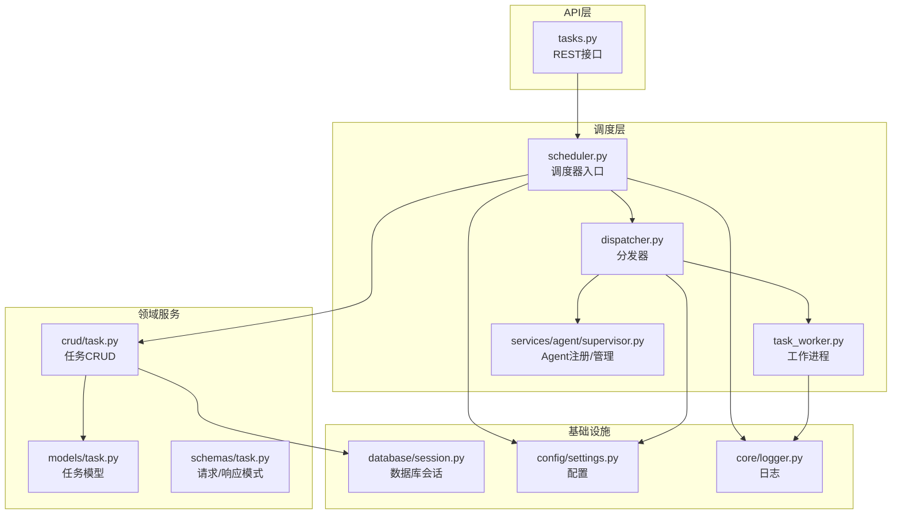
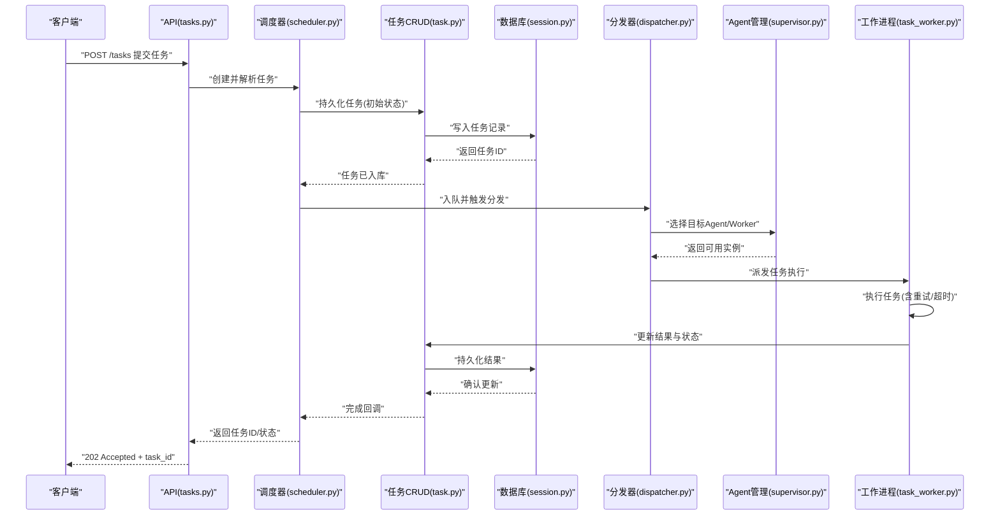
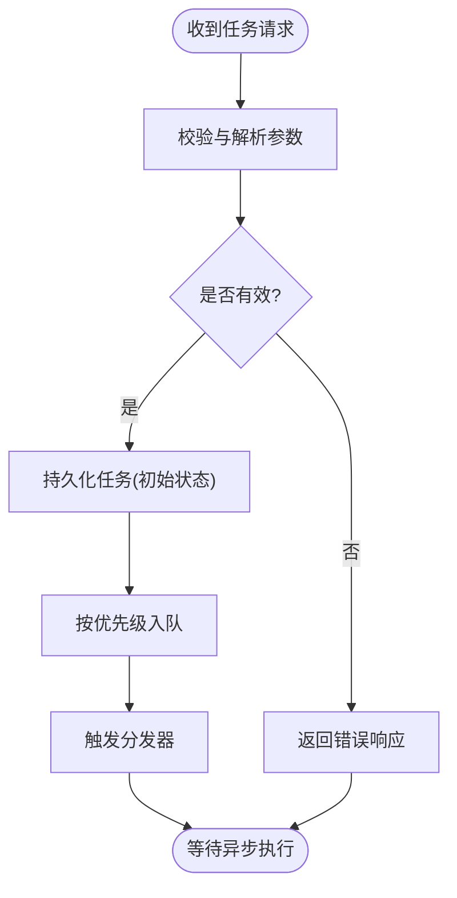
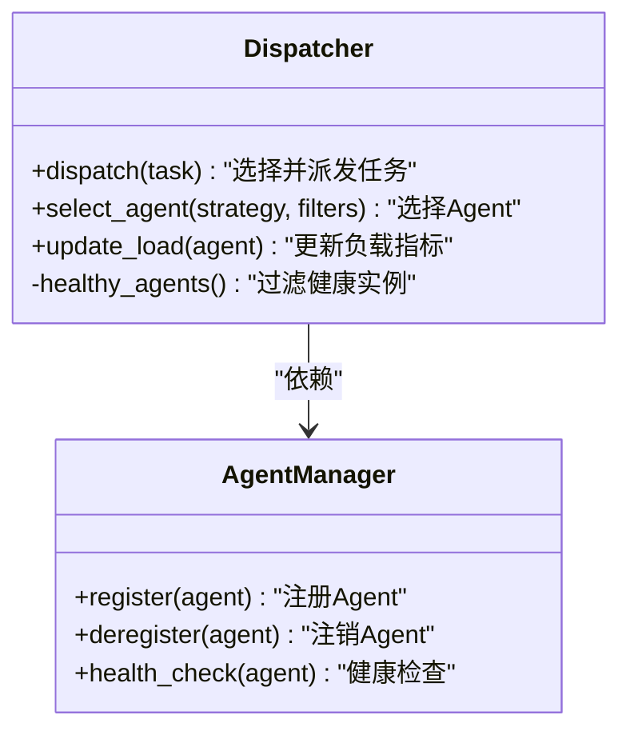
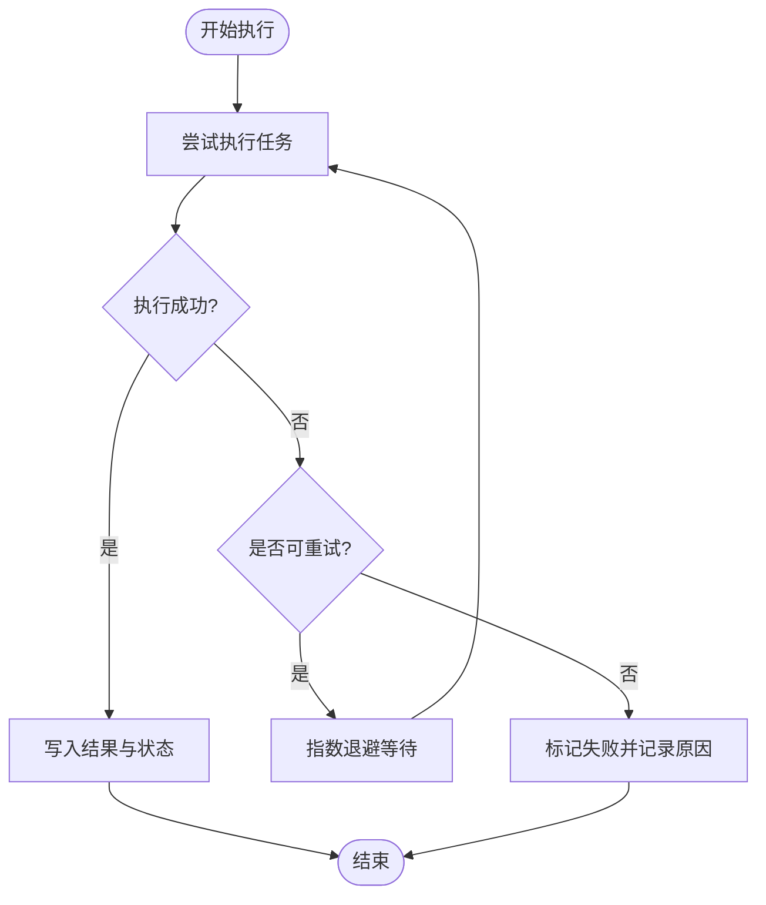
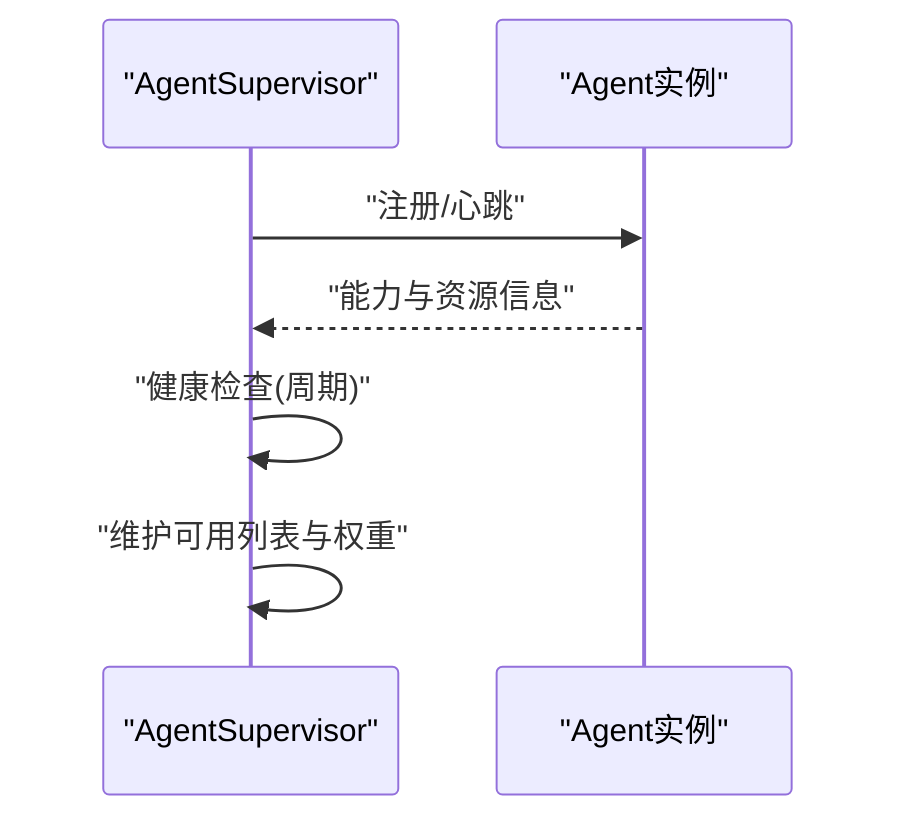
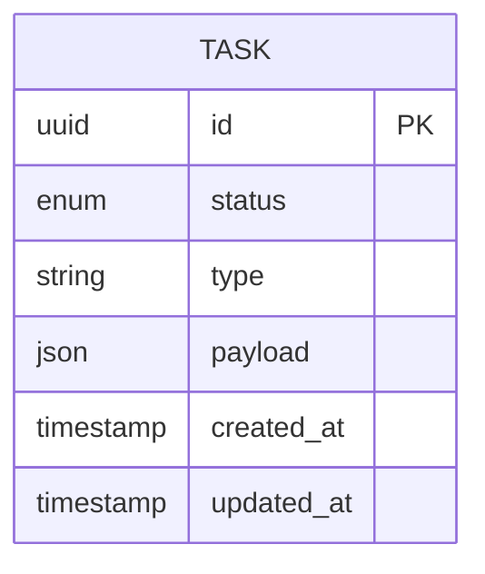
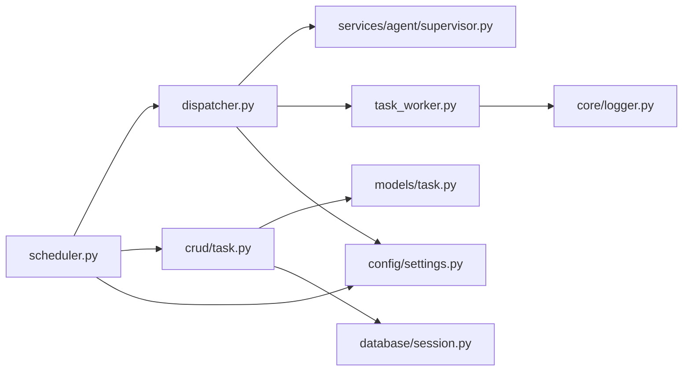

# Supervisor调度器

<cite>
**本文引用的文件**   
- [backend/app/tasks/scheduler.py](file://backend/app/tasks/scheduler.py)
- [backend/app/tasks/dispatcher.py](file://backend/app/tasks/dispatcher.py)
- [backend/app/tasks/task_worker.py](file://backend/app/tasks/task_worker.py)
- [backend/app/services/agent/supervisor.py](file://backend/app/services/agent/supervisor.py)
- [backend/app/api/tasks.py](file://backend/app/api/tasks.py)
- [backend/app/models/task.py](file://backend/app/models/task.py)
- [backend/app/schemas/task.py](file://backend/app/schemas/task.py)
- [backend/app/crud/task.py](file://backend/app/crud/task.py)
- [backend/app/config/settings.py](file://backend/app/config/settings.py)
- [backend/app/core/logger.py](file://backend/app/core/logger.py)
- [backend/app/database/session.py](file://backend/app/database/session.py)
</cite>

## 目录
1. [简介](#简介)
2. [项目结构](#项目结构)
3. [核心组件](#核心组件)
4. [架构总览](#架构总览)
5. [详细组件分析](#详细组件分析)
6. [依赖关系分析](#依赖关系分析)
7. [性能考虑](#性能考虑)
8. [故障排查指南](#故障排查指南)
9. [结论](#结论)
10. [附录](#附录)

## 简介
本文件面向Supervisor调度器的设计与实现，围绕任务接收、解析、分发与结果聚合机制展开，深入说明Agent注册与管理、任务优先级队列、负载均衡策略、配置项、监控指标与性能调优参数。同时提供扩展开发指南（新增任务类型与处理逻辑）、错误处理、重试机制与故障恢复策略的实现细节。文档以代码级事实为依据，并辅以架构图与时序图帮助理解。

## 项目结构
调度相关代码主要位于后端模块的 tasks 与 services/agent 子包中，API层通过路由暴露任务创建与查询接口，数据模型与持久化分别由 models、schemas 与 crud 层负责，配置与日志在 config 与 core 中集中管理。

图表来源
- [backend/app/api/tasks.py](file://backend/app/api/tasks.py)
- [backend/app/tasks/scheduler.py](file://backend/app/tasks/scheduler.py)
- [backend/app/tasks/dispatcher.py](file://backend/app/tasks/dispatcher.py)
- [backend/app/tasks/task_worker.py](file://backend/app/tasks/task_worker.py)
- [backend/app/services/agent/supervisor.py](file://backend/app/services/agent/supervisor.py)
- [backend/app/crud/task.py](file://backend/app/crud/task.py)
- [backend/app/models/task.py](file://backend/app/models/task.py)
- [backend/app/schemas/task.py](file://backend/app/schemas/task.py)
- [backend/app/database/session.py](file://backend/app/database/session.py)
- [backend/app/config/settings.py](file://backend/app/config/settings.py)
- [backend/app/core/logger.py](file://backend/app/core/logger.py)

章节来源
- [backend/app/api/tasks.py](file://backend/app/api/tasks.py)
- [backend/app/tasks/scheduler.py](file://backend/app/tasks/scheduler.py)
- [backend/app/tasks/dispatcher.py](file://backend/app/tasks/dispatcher.py)
- [backend/app/tasks/task_worker.py](file://backend/app/tasks/task_worker.py)
- [backend/app/services/agent/supervisor.py](file://backend/app/services/agent/supervisor.py)
- [backend/app/crud/task.py](file://backend/app/crud/task.py)
- [backend/app/models/task.py](file://backend/app/models/task.py)
- [backend/app/schemas/task.py](file://backend/app/schemas/task.py)
- [backend/app/database/session.py](file://backend/app/database/session.py)
- [backend/app/config/settings.py](file://backend/app/config/settings.py)
- [backend/app/core/logger.py](file://backend/app/core/logger.py)

## 核心组件
- 调度器（Scheduler）：负责从API接收任务、校验与解析、写入持久化、入队与触发分发。
- 分发器（Dispatcher）：根据任务类型与负载情况选择目标Agent或Worker，执行实际处理。
- 工作进程（TaskWorker）：具体任务的执行单元，封装重试、超时与结果回写。
- Agent注册与管理（AgentSupervisor）：维护可用Agent列表、健康检查、动态扩缩容与亲和性路由。
- 任务模型与CRUD：定义任务状态机、字段与生命周期，提供事务化的增删改查。
- 配置与日志：集中管理调度器行为参数、并发度、队列容量、重试策略等；统一记录关键事件。

章节来源
- [backend/app/tasks/scheduler.py](file://backend/app/tasks/scheduler.py)
- [backend/app/tasks/dispatcher.py](file://backend/app/tasks/dispatcher.py)
- [backend/app/tasks/task_worker.py](file://backend/app/tasks/task_worker.py)
- [backend/app/services/agent/supervisor.py](file://backend/app/services/agent/supervisor.py)
- [backend/app/models/task.py](file://backend/app/models/task.py)
- [backend/app/crud/task.py](file://backend/app/crud/task.py)
- [backend/app/config/settings.py](file://backend/app/config/settings.py)
- [backend/app/core/logger.py](file://backend/app/core/logger.py)

## 架构总览
下图展示了从HTTP请求到任务落库、入队、分发、执行与结果聚合的端到端流程。

图表来源
- [backend/app/api/tasks.py](file://backend/app/api/tasks.py)
- [backend/app/tasks/scheduler.py](file://backend/app/tasks/scheduler.py)
- [backend/app/tasks/dispatcher.py](file://backend/app/tasks/dispatcher.py)
- [backend/app/tasks/task_worker.py](file://backend/app/tasks/task_worker.py)
- [backend/app/services/agent/supervisor.py](file://backend/app/services/agent/supervisor.py)
- [backend/app/crud/task.py](file://backend/app/crud/task.py)
- [backend/app/database/session.py](file://backend/app/database/session.py)

## 详细组件分析

### 调度器（Scheduler）
职责
- 接收来自API的任务请求，进行参数校验与标准化。
- 将任务写入数据库并赋予初始状态。
- 根据任务类型与优先级入队，触发分发器。
- 监听任务生命周期事件，协调重试与失败处理。

关键设计点
- 幂等性：对重复提交的相同任务进行去重或合并。
- 可观测性：记录关键阶段的时间戳与上下文信息。
- 可扩展性：基于任务类型的路由表与处理器映射。

图表来源
- [backend/app/tasks/scheduler.py](file://backend/app/tasks/scheduler.py)
- [backend/app/crud/task.py](file://backend/app/crud/task.py)
- [backend/app/config/settings.py](file://backend/app/config/settings.py)

章节来源
- [backend/app/tasks/scheduler.py](file://backend/app/tasks/scheduler.py)
- [backend/app/crud/task.py](file://backend/app/crud/task.py)
- [backend/app/config/settings.py](file://backend/app/config/settings.py)

### 分发器（Dispatcher）
职责
- 根据任务类型、标签与资源需求选择目标Agent或Worker。
- 实现负载均衡策略（如最少连接、轮询、加权）。
- 维护任务与执行实例的绑定关系，支持亲和性路由。

关键设计点
- 策略可插拔：通过配置切换不同负载均衡算法。
- 健康感知：剔除不健康的Agent实例。
- 背压控制：当队列接近上限时拒绝新任务或降级。

图表来源
- [backend/app/tasks/dispatcher.py](file://backend/app/tasks/dispatcher.py)
- [backend/app/services/agent/supervisor.py](file://backend/app/services/agent/supervisor.py)

章节来源
- [backend/app/tasks/dispatcher.py](file://backend/app/tasks/dispatcher.py)
- [backend/app/services/agent/supervisor.py](file://backend/app/services/agent/supervisor.py)

### 工作进程（TaskWorker）
职责
- 执行具体任务逻辑，包含重试、超时与异常捕获。
- 上报进度与中间结果，最终回写任务结果。
- 与日志系统对接，输出结构化运行信息。

关键设计点
- 重试策略：指数退避、最大重试次数、死信队列。
- 超时控制：防止长尾任务阻塞资源。
- 原子更新：使用事务保证状态一致性。

图表来源
- [backend/app/tasks/task_worker.py](file://backend/app/tasks/task_worker.py)
- [backend/app/core/logger.py](file://backend/app/core/logger.py)

章节来源
- [backend/app/tasks/task_worker.py](file://backend/app/tasks/task_worker.py)
- [backend/app/core/logger.py](file://backend/app/core/logger.py)

### Agent注册与管理（AgentSupervisor）
职责
- 维护Agent注册表，支持动态注册与注销。
- 周期性健康检查，自动剔除不可用节点。
- 提供能力描述与资源配额，辅助分发器决策。

关键设计点
- 心跳机制：Agent定期上报存活信号。
- 亲和性标签：按任务标签匹配具备相应能力的Agent。
- 弹性伸缩：根据负载阈值自动扩缩容。

图表来源
- [backend/app/services/agent/supervisor.py](file://backend/app/services/agent/supervisor.py)

章节来源
- [backend/app/services/agent/supervisor.py](file://backend/app/services/agent/supervisor.py)

### 任务模型与CRUD
职责
- 定义任务实体、状态机与字段约束。
- 提供事务化的增删改查，确保数据一致性。
- 为调度器与分发器提供稳定的数据契约。

关键设计点
- 状态枚举：如待处理、进行中、已完成、失败等。
- 审计字段：创建时间、更新时间、操作人等。
- 索引优化：针对常用查询字段建立索引。

图表来源
- [backend/app/models/task.py](file://backend/app/models/task.py)
- [backend/app/schemas/task.py](file://backend/app/schemas/task.py)
- [backend/app/crud/task.py](file://backend/app/crud/task.py)

章节来源
- [backend/app/models/task.py](file://backend/app/models/task.py)
- [backend/app/schemas/task.py](file://backend/app/schemas/task.py)
- [backend/app/crud/task.py](file://backend/app/crud/task.py)

### API层（tasks.py）
职责
- 暴露任务创建、查询、取消等REST接口。
- 将请求体转换为内部任务对象，调用调度器。
- 返回标准响应格式与状态码。

关键设计点
- 输入校验：基于Schemas进行严格校验。
- 幂等键：可选的请求头用于避免重复提交。
- 分页与过滤：支持按状态、类型、时间范围查询。

章节来源
- [backend/app/api/tasks.py](file://backend/app/api/tasks.py)
- [backend/app/schemas/task.py](file://backend/app/schemas/task.py)

## 依赖关系分析
调度器与分发器、工作进程、Agent管理、任务CRUD与数据库会话之间存在清晰的依赖边界。配置与日志作为横切关注点被广泛使用。

图表来源
- [backend/app/tasks/scheduler.py](file://backend/app/tasks/scheduler.py)
- [backend/app/tasks/dispatcher.py](file://backend/app/tasks/dispatcher.py)
- [backend/app/tasks/task_worker.py](file://backend/app/tasks/task_worker.py)
- [backend/app/services/agent/supervisor.py](file://backend/app/services/agent/supervisor.py)
- [backend/app/crud/task.py](file://backend/app/crud/task.py)
- [backend/app/models/task.py](file://backend/app/models/task.py)
- [backend/app/database/session.py](file://backend/app/database/session.py)
- [backend/app/config/settings.py](file://backend/app/config/settings.py)
- [backend/app/core/logger.py](file://backend/app/core/logger.py)

章节来源
- [backend/app/tasks/scheduler.py](file://backend/app/tasks/scheduler.py)
- [backend/app/tasks/dispatcher.py](file://backend/app/tasks/dispatcher.py)
- [backend/app/tasks/task_worker.py](file://backend/app/tasks/task_worker.py)
- [backend/app/services/agent/supervisor.py](file://backend/app/services/agent/supervisor.py)
- [backend/app/crud/task.py](file://backend/app/crud/task.py)
- [backend/app/models/task.py](file://backend/app/models/task.py)
- [backend/app/database/session.py](file://backend/app/database/session.py)
- [backend/app/config/settings.py](file://backend/app/config/settings.py)
- [backend/app/core/logger.py](file://backend/app/core/logger.py)

## 性能考虑
- 并发度与队列容量：通过配置调整工作进程数与队列上限，避免内存溢出与CPU争用。
- 负载均衡策略：在高吞吐场景优先选择最少连接或加权轮询，降低热点节点风险。
- 重试与退避：合理设置最大重试次数与退避间隔，平衡成功率与延迟。
- 数据库索引：为任务类型、状态与时间字段建立合适索引，提升查询与筛选效率。
- 批处理与流水线：对可并行的子任务进行拆分，减少单任务执行时长。
- 监控与告警：采集关键指标（入队速率、执行耗时、失败率、队列长度），设定阈值告警。

[本节为通用指导，无需特定文件引用]

## 故障排查指南
常见问题与定位步骤
- 任务未执行：检查调度器日志与分发器选择策略，确认Agent健康状态与资源配额。
- 执行超时：查看工作进程日志中的超时记录，评估任务复杂度与超时阈值。
- 频繁重试：分析失败原因与重试策略，必要时增加最大重试次数或引入死信队列。
- 数据不一致：核对事务边界与状态更新顺序，确保结果回写的原子性。
- 性能瓶颈：观察队列长度与执行耗时分布，调整并发度与负载均衡策略。

建议的监控指标
- 入队速率与出队速率
- 平均/分位执行耗时
- 失败率与重试次数
- 队列长度与积压时间
- Agent健康比例与负载分布

章节来源
- [backend/app/core/logger.py](file://backend/app/core/logger.py)
- [backend/app/tasks/task_worker.py](file://backend/app/tasks/task_worker.py)
- [backend/app/tasks/dispatcher.py](file://backend/app/tasks/dispatcher.py)
- [backend/app/services/agent/supervisor.py](file://backend/app/services/agent/supervisor.py)

## 结论
Supervisor调度器通过清晰的分层与职责划分，实现了任务从接收到结果聚合的完整闭环。其可扩展的Agent管理与分发策略、稳健的重试与失败处理机制，以及完善的配置与监控能力，使其能够适应多样化的业务场景与规模增长。建议在上线前结合业务特征进行容量规划与压力测试，持续优化关键参数与监控指标。

[本节为总结性内容，无需特定文件引用]

## 附录

### 配置选项（示例）
- 调度器并发度：控制工作进程数量与并行执行能力。
- 队列容量：限制内存占用与背压阈值。
- 重试策略：最大重试次数、退避基数与上限。
- 负载均衡策略：最少连接、轮询、加权等。
- 健康检查间隔：Agent心跳与健康判定周期。
- 日志级别与输出：结构化日志与采样率。

章节来源
- [backend/app/config/settings.py](file://backend/app/config/settings.py)

### 扩展开发指南（新增任务类型与处理逻辑）
- 定义任务类型：在任务模型与模式中声明新的类型与字段。
- 实现处理器：在工作进程中注册新的任务处理器，包含输入校验、执行逻辑与结果回写。
- 更新分发策略：在分发器中为新类型添加路由规则与亲和性标签。
- 配置与监控：在配置中新增相关参数，并在日志与指标中暴露关键路径。
- 测试与回归：编写单元测试与集成测试，覆盖正常与异常路径。

章节来源
- [backend/app/models/task.py](file://backend/app/models/task.py)
- [backend/app/schemas/task.py](file://backend/app/schemas/task.py)
- [backend/app/tasks/task_worker.py](file://backend/app/tasks/task_worker.py)
- [backend/app/tasks/dispatcher.py](file://backend/app/tasks/dispatcher.py)
- [backend/app/config/settings.py](file://backend/app/config/settings.py)