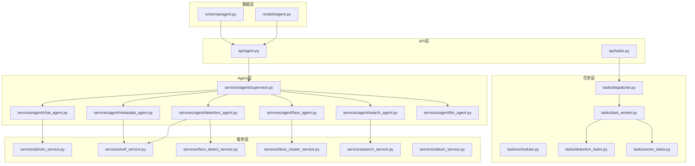
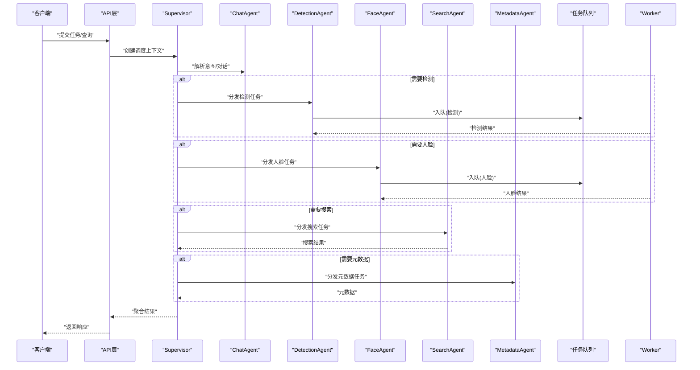
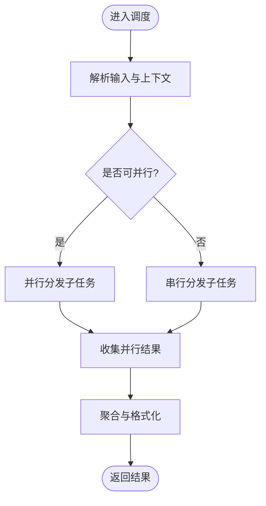
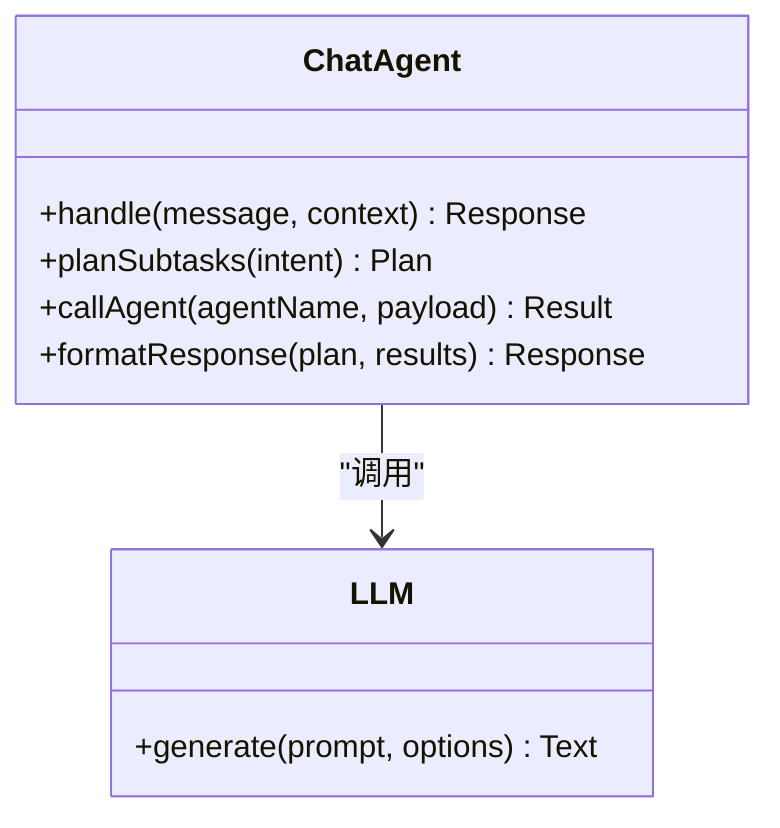
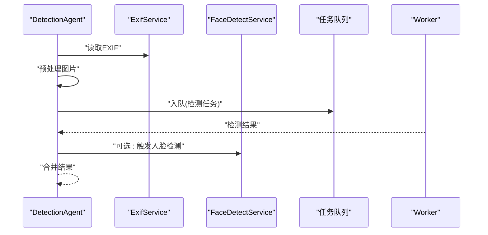
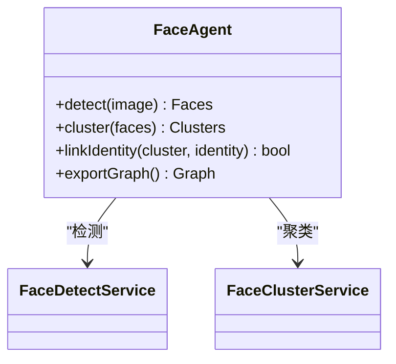
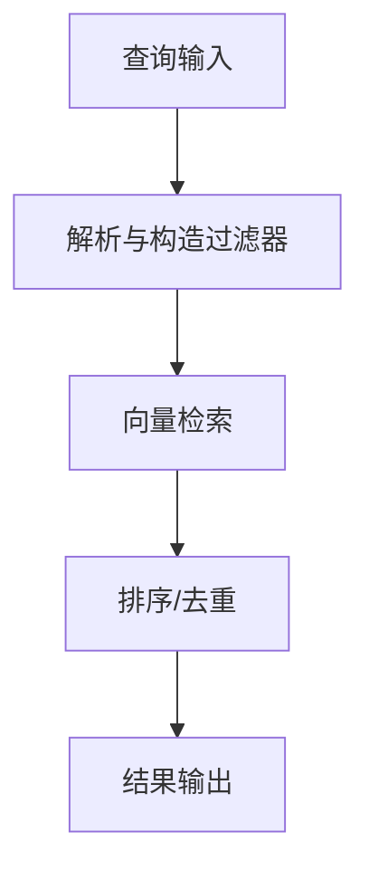
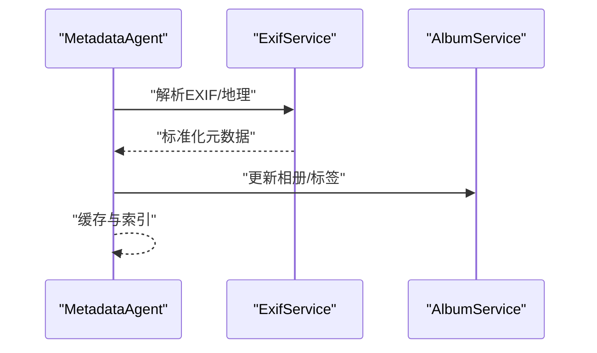
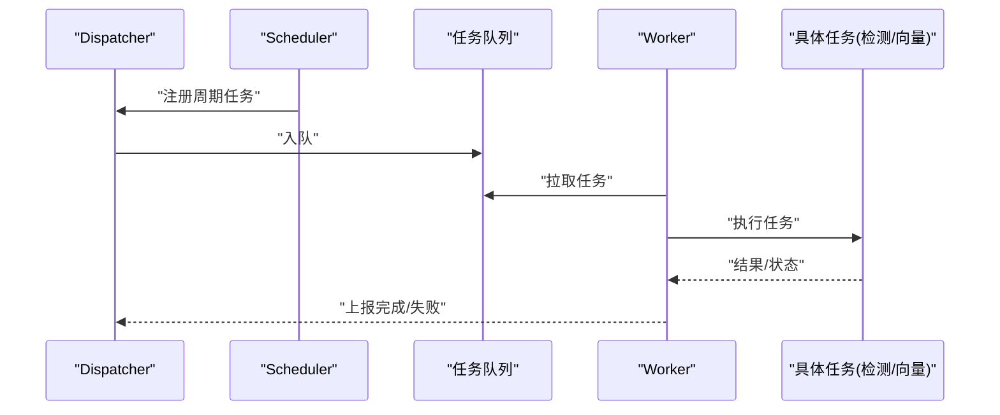
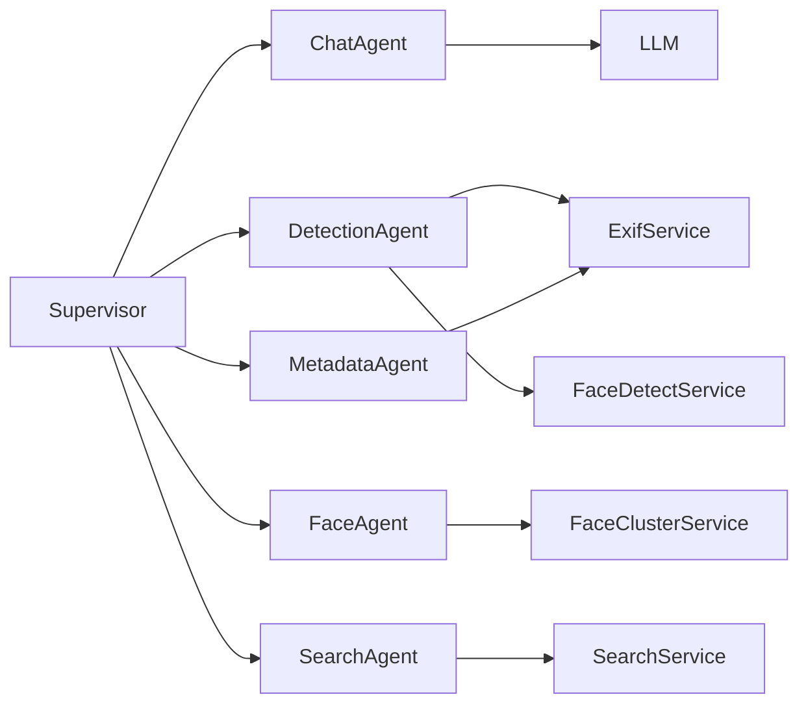

# 多Agent协作架构

<cite>
**本文引用的文件**   
- [supervisor.py](file://backend/app/services/agent/supervisor.py)
- [chat_agent.py](file://backend/app/services/agent/chat_agent.py)
- [detection_agent.py](file://backend/app/services/agent/detection_agent.py)
- [face_agent.py](file://backend/app/services/agent/face_agent.py)
- [search_agent.py](file://backend/app/services/agent/search_agent.py)
- [metadata_agent.py](file://backend/app/services/agent/metadata_agent.py)
- [llm_agent.py](file://backend/app/services/agent/llm_agent.py)
- [dispatcher.py](file://backend/app/tasks/dispatcher.py)
- [scheduler.py](file://backend/app/tasks/scheduler.py)
- [task_worker.py](file://backend/app/tasks/task_worker.py)
- [detection_tasks.py](file://backend/app/tasks/detection_tasks.py)
- [vector_tasks.py](file://backend/app/tasks/vector_tasks.py)
- [agent.py](file://backend/app/models/agent.py)
- [agent.py](file://backend/app/api/agent.py)
- [agent.py](file://backend/app/schemas/agent.py)
- [photo_service.py](file://backend/app/services/photo_service.py)
- [exif_service.py](file://backend/app/services/exif_service.py)
- [face_detect_service.py](file://backend/app/services/face_detect_service.py)
- [face_cluster_service.py](file://backend/app/services/face_cluster_service.py)
- [search_service.py](file://backend/app/services/search_service.py)
- [album_service.py](file://backend/app/services/album_service.py)
- [tasks.py](file://backend/app/api/tasks.py)
</cite>

## 目录
1. [简介](#简介)
2. [项目结构](#项目结构)
3. [核心组件](#核心组件)
4. [架构总览](#架构总览)
5. [详细组件分析](#详细组件分析)
6. [依赖关系分析](#依赖关系分析)
7. [性能与资源管理](#性能与资源管理)
8. [故障排查指南](#故障排查指南)
9. [结论](#结论)
10. [附录：扩展新Agent开发指南](#附录扩展新agent开发指南)

## 简介
本仓库实现了一个面向相册与多媒体内容的多Agent协作系统。Supervisor调度器负责接收任务、解析意图、编排专用Agent执行，并通过异步任务队列进行负载均衡与重试。各专用Agent职责清晰：ChatAgent处理对话与指令解析；DetectionAgent负责图像检测；FaceAgent执行人脸识别与聚类；SearchAgent提供语义搜索；MetadataAgent管理元数据（如EXIF、地理信息等）。本文档从架构、通信协议、错误处理、重试机制、扩展指南与性能监控等方面进行全面说明。

## 项目结构
后端采用分层组织：API层暴露接口，服务层封装业务逻辑，Agent层实现具体能力，任务层提供异步调度与执行。模型与Schema定义数据契约，数据库与存储抽象持久化细节。

图表来源
- [supervisor.py](file://backend/app/services/agent/supervisor.py)
- [chat_agent.py](file://backend/app/services/agent/chat_agent.py)
- [detection_agent.py](file://backend/app/services/agent/detection_agent.py)
- [face_agent.py](file://backend/app/services/agent/face_agent.py)
- [search_agent.py](file://backend/app/services/agent/search_agent.py)
- [metadata_agent.py](file://backend/app/services/agent/metadata_agent.py)
- [llm_agent.py](file://backend/app/services/agent/llm_agent.py)
- [dispatcher.py](file://backend/app/tasks/dispatcher.py)
- [scheduler.py](file://backend/app/tasks/scheduler.py)
- [task_worker.py](file://backend/app/tasks/task_worker.py)
- [detection_tasks.py](file://backend/app/tasks/detection_tasks.py)
- [vector_tasks.py](file://backend/app/tasks/vector_tasks.py)
- [agent.py](file://backend/app/models/agent.py)
- [agent.py](file://backend/app/schemas/agent.py)
- [photo_service.py](file://backend/app/services/photo_service.py)
- [exif_service.py](file://backend/app/services/exif_service.py)
- [face_detect_service.py](file://backend/app/services/face_detect_service.py)
- [face_cluster_service.py](file://backend/app/services/face_cluster_service.py)
- [search_service.py](file://backend/app/services/search_service.py)
- [album_service.py](file://backend/app/services/album_service.py)
- [tasks.py](file://backend/app/api/tasks.py)

章节来源
- [supervisor.py](file://backend/app/services/agent/supervisor.py)
- [dispatcher.py](file://backend/app/tasks/dispatcher.py)
- [scheduler.py](file://backend/app/tasks/scheduler.py)
- [task_worker.py](file://backend/app/tasks/task_worker.py)
- [detection_tasks.py](file://backend/app/tasks/detection_tasks.py)
- [vector_tasks.py](file://backend/app/tasks/vector_tasks.py)
- [agent.py](file://backend/app/models/agent.py)
- [agent.py](file://backend/app/schemas/agent.py)
- [agent.py](file://backend/app/api/agent.py)
- [tasks.py](file://backend/app/api/tasks.py)

## 核心组件
- Supervisor调度器：统一入口，解析用户请求或系统事件，生成任务计划并分发给相应Agent；维护上下文、路由表与结果聚合。
- ChatAgent：对话式交互，理解自然语言指令，调用其他Agent完成复合任务，返回结构化答案。
- DetectionAgent：对图片进行通用目标检测与属性提取，必要时联动EXIF与人脸检测服务。
- FaceAgent：人脸识别、人脸聚类与身份关联，输出人脸实体与关系图。
- SearchAgent：基于向量与文本的语义检索，支持跨模态查询。
- MetadataAgent：抽取与管理媒体元数据（时间、地点、设备、标签等），为其他Agent提供上下文。
- LLM代理：作为ChatAgent的后端大模型调用封装，提供统一的提示词管理与响应解析。

章节来源
- [supervisor.py](file://backend/app/services/agent/supervisor.py)
- [chat_agent.py](file://backend/app/services/agent/chat_agent.py)
- [detection_agent.py](file://backend/app/services/agent/detection_agent.py)
- [face_agent.py](file://backend/app/services/agent/face_agent.py)
- [search_agent.py](file://backend/app/services/agent/search_agent.py)
- [metadata_agent.py](file://backend/app/services/agent/metadata_agent.py)
- [llm_agent.py](file://backend/app/services/agent/llm_agent.py)

## 架构总览
整体采用“API -> Supervisor -> Agent -> Service/Task”的分层协作模式。API层将外部请求转换为内部任务消息；Supervisor根据意图选择Agent；Agent通过服务层访问领域能力；复杂或耗时操作由任务层异步执行，Worker消费任务并回写结果。

图表来源
- [supervisor.py](file://backend/app/services/agent/supervisor.py)
- [chat_agent.py](file://backend/app/services/agent/chat_agent.py)
- [detection_agent.py](file://backend/app/services/agent/detection_agent.py)
- [face_agent.py](file://backend/app/services/agent/face_agent.py)
- [search_agent.py](file://backend/app/services/agent/search_agent.py)
- [metadata_agent.py](file://backend/app/services/agent/metadata_agent.py)
- [dispatcher.py](file://backend/app/tasks/dispatcher.py)
- [task_worker.py](file://backend/app/tasks/task_worker.py)

## 详细组件分析

### Supervisor调度器
- 设计要点
  - 意图识别与路由：根据输入类型（文本、图片、混合）与关键词映射到对应Agent。
  - 任务编排：支持串行与并行组合，构建有向无环的执行图。
  - 上下文传递：携带会话ID、用户权限、资源引用（如照片ID列表）等。
  - 结果聚合：按阶段合并各Agent输出，形成最终响应。
- 关键流程
  - 接收请求 -> 校验与解析 -> 生成计划 -> 分发执行 -> 收集结果 -> 返回。

图表来源
- [supervisor.py](file://backend/app/services/agent/supervisor.py)

章节来源
- [supervisor.py](file://backend/app/services/agent/supervisor.py)

### ChatAgent（对话处理）
- 职责
  - 理解自然语言指令，维护对话状态。
  - 协调其他Agent完成复合任务（例如“找出某人的照片并描述场景”）。
  - 调用LLM代理生成回答与追问。
- 交互协议
  - 输入：包含用户消息、历史摘要、可选资源ID。
  - 输出：结构化回复（文本、卡片、操作建议）。

图表来源
- [chat_agent.py](file://backend/app/services/agent/chat_agent.py)
- [llm_agent.py](file://backend/app/services/agent/llm_agent.py)

章节来源
- [chat_agent.py](file://backend/app/services/agent/chat_agent.py)
- [llm_agent.py](file://backend/app/services/agent/llm_agent.py)

### DetectionAgent（图像检测）
- 职责
  - 对图片进行通用目标检测与属性提取。
  - 联动EXIF服务获取拍摄信息，辅助后续分类与检索。
- 典型流程
  - 读取图片 -> 预处理 -> 推理 -> 后处理 -> 入库/缓存。

图表来源
- [detection_agent.py](file://backend/app/services/agent/detection_agent.py)
- [exif_service.py](file://backend/app/services/exif_service.py)
- [face_detect_service.py](file://backend/app/services/face_detect_service.py)
- [detection_tasks.py](file://backend/app/tasks/detection_tasks.py)
- [task_worker.py](file://backend/app/tasks/task_worker.py)

章节来源
- [detection_agent.py](file://backend/app/services/agent/detection_agent.py)
- [exif_service.py](file://backend/app/services/exif_service.py)
- [face_detect_service.py](file://backend/app/services/face_detect_service.py)
- [detection_tasks.py](file://backend/app/tasks/detection_tasks.py)
- [task_worker.py](file://backend/app/tasks/task_worker.py)

### FaceAgent（人脸识别）
- 职责
  - 人脸检测、特征提取、聚类与身份关联。
  - 输出人脸实体、关系图谱与统计信息。
- 与服务的集成
  - 使用人脸检测服务与聚类服务，结合任务队列处理大规模数据。

图表来源
- [face_agent.py](file://backend/app/services/agent/face_agent.py)
- [face_detect_service.py](file://backend/app/services/face_detect_service.py)
- [face_cluster_service.py](file://backend/app/services/face_cluster_service.py)

章节来源
- [face_agent.py](file://backend/app/services/agent/face_agent.py)
- [face_detect_service.py](file://backend/app/services/face_detect_service.py)
- [face_cluster_service.py](file://backend/app/services/face_cluster_service.py)

### SearchAgent（语义搜索）
- 职责
  - 基于向量与文本的跨模态检索。
  - 支持多条件过滤（时间、地点、人物、标签）。
- 数据流
  - 查询解析 -> 向量检索 -> 排序与去重 -> 结果组装。

图表来源
- [search_agent.py](file://backend/app/services/agent/search_agent.py)
- [search_service.py](file://backend/app/services/search_service.py)

章节来源
- [search_agent.py](file://backend/app/services/agent/search_agent.py)
- [search_service.py](file://backend/app/services/search_service.py)

### MetadataAgent（元数据管理）
- 职责
  - 抽取与更新媒体元数据（EXIF、地理位置、标签等）。
  - 为其他Agent提供上下文增强。
- 典型操作
  - 读取媒体 -> 解析元数据 -> 标准化 -> 写入索引/数据库。

图表来源
- [metadata_agent.py](file://backend/app/services/agent/metadata_agent.py)
- [exif_service.py](file://backend/app/services/exif_service.py)
- [album_service.py](file://backend/app/services/album_service.py)

章节来源
- [metadata_agent.py](file://backend/app/services/agent/metadata_agent.py)
- [exif_service.py](file://backend/app/services/exif_service.py)
- [album_service.py](file://backend/app/services/album_service.py)

### 任务分发与执行（Dispatcher/Scheduler/Worker）
- Dispatcher：负责任务路由、优先级与重试策略。
- Scheduler：定时与周期性任务编排。
- Worker：消费任务、执行具体逻辑、回写结果与状态。

图表来源
- [dispatcher.py](file://backend/app/tasks/dispatcher.py)
- [scheduler.py](file://backend/app/tasks/scheduler.py)
- [task_worker.py](file://backend/app/tasks/task_worker.py)
- [detection_tasks.py](file://backend/app/tasks/detection_tasks.py)
- [vector_tasks.py](file://backend/app/tasks/vector_tasks.py)

章节来源
- [dispatcher.py](file://backend/app/tasks/dispatcher.py)
- [scheduler.py](file://backend/app/tasks/scheduler.py)
- [task_worker.py](file://backend/app/tasks/task_worker.py)
- [detection_tasks.py](file://backend/app/tasks/detection_tasks.py)
- [vector_tasks.py](file://backend/app/tasks/vector_tasks.py)

## 依赖关系分析
- 组件耦合
  - Supervisor与各Agent松耦合，通过统一的消息协议与接口约定交互。
  - Agent与服务层解耦，服务层再与底层基础设施（数据库、向量库、对象存储）分离。
- 外部依赖
  - 任务队列用于削峰填谷与重试。
  - 向量检索与人脸检测服务为外部AI能力。
- 潜在循环依赖
  - 通过明确边界与接口避免循环；若出现，应引入事件总线或中间层。

图表来源
- [supervisor.py](file://backend/app/services/agent/supervisor.py)
- [chat_agent.py](file://backend/app/services/agent/chat_agent.py)
- [detection_agent.py](file://backend/app/services/agent/detection_agent.py)
- [face_agent.py](file://backend/app/services/agent/face_agent.py)
- [search_agent.py](file://backend/app/services/agent/search_agent.py)
- [metadata_agent.py](file://backend/app/services/agent/metadata_agent.py)
- [llm_agent.py](file://backend/app/services/agent/llm_agent.py)
- [exif_service.py](file://backend/app/services/exif_service.py)
- [face_detect_service.py](file://backend/app/services/face_detect_service.py)
- [face_cluster_service.py](file://backend/app/services/face_cluster_service.py)
- [search_service.py](file://backend/app/services/search_service.py)

章节来源
- [supervisor.py](file://backend/app/services/agent/supervisor.py)
- [chat_agent.py](file://backend/app/services/agent/chat_agent.py)
- [detection_agent.py](file://backend/app/services/agent/detection_agent.py)
- [face_agent.py](file://backend/app/services/agent/face_agent.py)
- [search_agent.py](file://backend/app/services/agent/search_agent.py)
- [metadata_agent.py](file://backend/app/services/agent/metadata_agent.py)
- [llm_agent.py](file://backend/app/services/agent/llm_agent.py)
- [exif_service.py](file://backend/app/services/exif_service.py)
- [face_detect_service.py](file://backend/app/services/face_detect_service.py)
- [face_cluster_service.py](file://backend/app/services/face_cluster_service.py)
- [search_service.py](file://backend/app/services/search_service.py)

## 性能与资源管理
- 并发与并行
  - 在Supervisor中尽量并行分发独立子任务，减少端到端延迟。
  - 使用任务队列对CPU/GPU密集型任务进行削峰。
- 负载均衡
  - 基于Worker数量与队列长度动态调整并发度。
  - 对热点Agent（如检测、人脸）设置独立队列与限流。
- 资源管理
  - 为不同Agent配置独立的线程池/进程池与GPU显存配额。
  - 对大模型调用实施令牌速率限制与批量请求合并。
- 缓存与索引
  - 对频繁查询结果与中间向量进行缓存。
  - 增量更新索引，避免全量重建。
- 监控指标
  - 任务吞吐、平均延迟、失败率、队列积压、Worker利用率、GPU占用。

[本节为通用指导，不直接分析具体文件]

## 故障排查指南
- 常见问题
  - 任务堆积：检查Worker数量与任务大小，适当扩容或拆分任务。
  - 超时失败：增加重试次数与退避策略，优化上游服务响应。
  - 内存溢出：降低批大小，启用分页与流式处理。
- 定位方法
  - 查看任务日志与错误堆栈，确认失败节点。
  - 检查队列健康与消费者状态。
  - 核对Agent间消息格式与字段完整性。
- 恢复策略
  - 自动重试与死信队列归档。
  - 幂等性保证，避免重复执行造成副作用。

章节来源
- [dispatcher.py](file://backend/app/tasks/dispatcher.py)
- [task_worker.py](file://backend/app/tasks/task_worker.py)
- [detection_tasks.py](file://backend/app/tasks/detection_tasks.py)
- [vector_tasks.py](file://backend/app/tasks/vector_tasks.py)

## 结论
该多Agent协作架构通过清晰的职责划分与松耦合设计，实现了可扩展、高可用的多媒体处理能力。Supervisor作为中枢调度器，配合任务队列与Worker，有效提升了吞吐与稳定性。遵循本文的扩展指南与最佳实践，可快速新增专用Agent并融入现有体系。

[本节为总结，不直接分析具体文件]

## 附录：扩展新Agent开发指南
- 步骤概览
  - 新建Agent类：实现标准接口（初始化、处理、清理）。
  - 注册路由：在Supervisor的路由表中添加新Agent名称与匹配规则。
  - 定义消息协议：明确输入/输出Schema，确保与其他Agent一致。
  - 接入服务层：如需访问领域能力，封装为服务函数供Agent调用。
  - 任务化：对耗时操作入队，Worker执行并回写结果。
  - 测试与监控：编写单元测试与集成测试，补充指标埋点。
- 示例路径参考
  - Agent实现位置：services/agent/*
  - 路由与调度：services/agent/supervisor.py
  - 任务定义与执行：tasks/*
  - 数据契约：schemas/agent.py、models/agent.py
  - API入口：api/agent.py、api/tasks.py

章节来源
- [supervisor.py](file://backend/app/services/agent/supervisor.py)
- [agent.py](file://backend/app/schemas/agent.py)
- [agent.py](file://backend/app/models/agent.py)
- [agent.py](file://backend/app/api/agent.py)
- [tasks.py](file://backend/app/api/tasks.py)
- [dispatcher.py](file://backend/app/tasks/dispatcher.py)
- [task_worker.py](file://backend/app/tasks/task_worker.py)