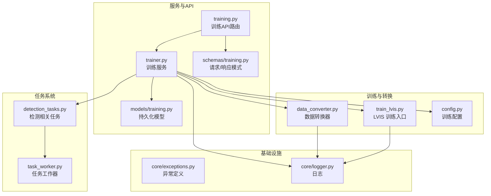
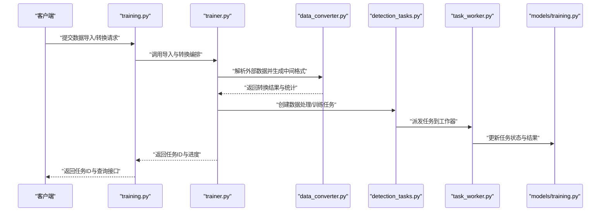
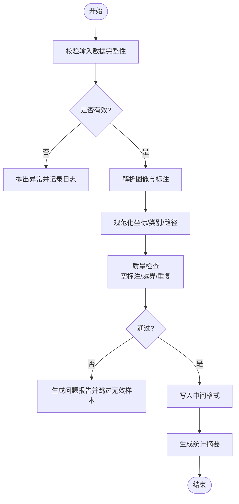
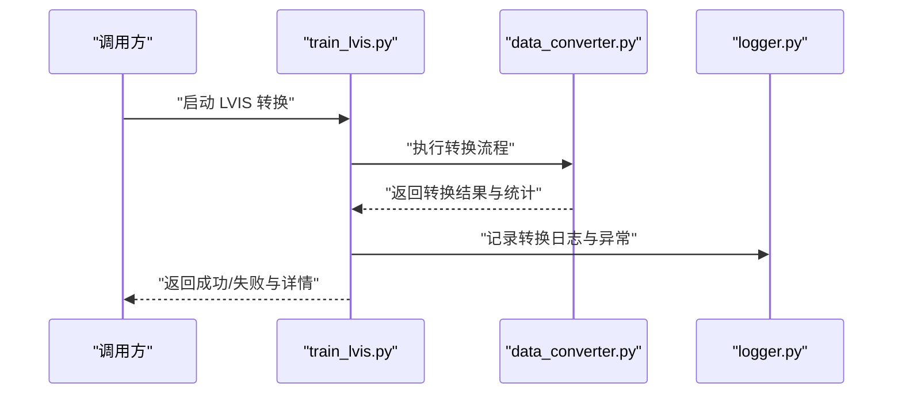
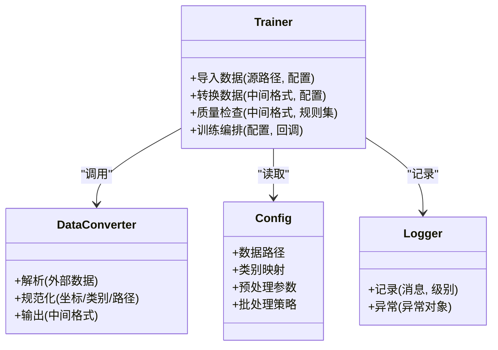
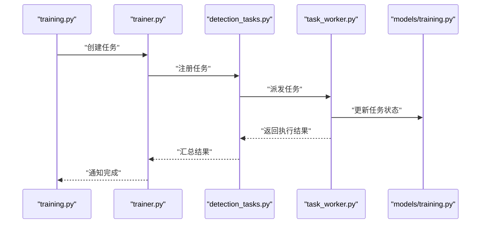
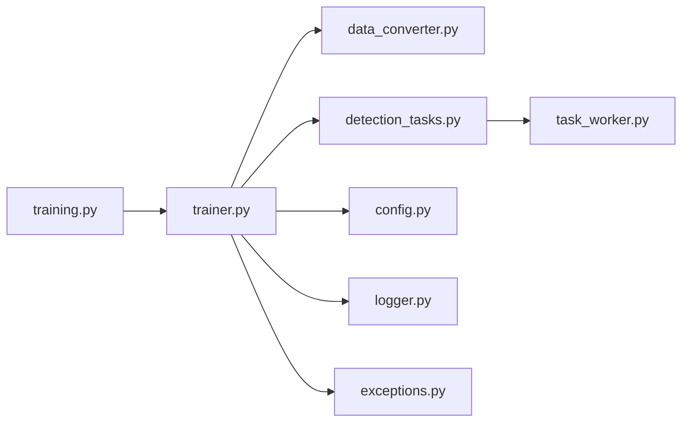

# 数据准备与处理

<cite>
**本文引用的文件**   
- [backend/app/services/train/data_converter.py](file://backend/app/services/train/data_converter.py)
- [backend/app/services/train/train_lvis.py](file://backend/app/services/train/train_lvis.py)
- [backend/app/services/train/config.py](file://backend/app/services/train/config.py)
- [backend/app/services/trainer.py](file://backend/app/services/trainer.py)
- [backend/app/api/training.py](file://backend/app/api/training.py)
- [backend/app/schemas/training.py](file://backend/app/schemas/training.py)
- [backend/app/models/training.py](file://backend/app/models/training.py)
- [backend/app/tasks/detection_tasks.py](file://backend/app/tasks/detection_tasks.py)
- [backend/app/tasks/task_worker.py](file://backend/app/tasks/task_worker.py)
- [backend/app/core/exceptions.py](file://backend/app/core/exceptions.py)
- [backend/app/core/logger.py](file://backend/app/core/logger.py)
</cite>

## 目录
1. [简介](#简介)
2. [项目结构](#项目结构)
3. [核心组件](#核心组件)
4. [架构总览](#架构总览)
5. [详细组件分析](#详细组件分析)
6. [依赖关系分析](#依赖关系分析)
7. [性能考虑](#性能考虑)
8. [故障排查指南](#故障排查指南)
9. [结论](#结论)
10. [附录](#附录)

## 简介
本章节面向“数据准备与处理”模块，聚焦于自定义数据集的格式要求、组织规范，以及 LVIS 数据集转换工具的使用流程。文档涵盖：
- 图像文件命名规则与标注文件格式
- 目录结构与导入路径约定
- 数据导入、格式转换与质量检查流程
- 预处理管道配置（缩放、增强、批处理）
- 数据验证规则、异常处理与性能优化建议

该模块通过后端训练服务与任务调度系统协同工作，提供从原始数据到模型可消费格式的端到端流水线。

## 项目结构
与数据准备与处理相关的代码主要位于后端训练与服务层：
- 训练脚本与转换器：用于将外部数据集（如 LVIS）转换为内部格式
- 训练服务与 API：对外暴露数据导入、转换、训练等能力
- 任务调度与工作器：异步执行耗时数据处理与训练任务
- 配置与异常日志：统一配置项、错误类型与日志记录

图表来源
- [backend/app/services/train/data_converter.py](file://backend/app/services/train/data_converter.py)
- [backend/app/services/train/train_lvis.py](file://backend/app/services/train/train_lvis.py)
- [backend/app/services/train/config.py](file://backend/app/services/train/config.py)
- [backend/app/services/trainer.py](file://backend/app/services/trainer.py)
- [backend/app/api/training.py](file://backend/app/api/training.py)
- [backend/app/schemas/training.py](file://backend/app/schemas/training.py)
- [backend/app/models/training.py](file://backend/app/models/training.py)
- [backend/app/tasks/detection_tasks.py](file://backend/app/tasks/detection_tasks.py)
- [backend/app/tasks/task_worker.py](file://backend/app/tasks/task_worker.py)
- [backend/app/core/exceptions.py](file://backend/app/core/exceptions.py)
- [backend/app/core/logger.py](file://backend/app/core/logger.py)

章节来源
- [backend/app/services/train/data_converter.py](file://backend/app/services/train/data_converter.py)
- [backend/app/services/train/train_lvis.py](file://backend/app/services/train/train_lvis.py)
- [backend/app/services/train/config.py](file://backend/app/services/train/config.py)
- [backend/app/services/trainer.py](file://backend/app/services/trainer.py)
- [backend/app/api/training.py](file://backend/app/api/training.py)
- [backend/app/schemas/training.py](file://backend/app/schemas/training.py)
- [backend/app/models/training.py](file://backend/app/models/training.py)
- [backend/app/tasks/detection_tasks.py](file://backend/app/tasks/detection_tasks.py)
- [backend/app/tasks/task_worker.py](file://backend/app/tasks/task_worker.py)
- [backend/app/core/exceptions.py](file://backend/app/core/exceptions.py)
- [backend/app/core/logger.py](file://backend/app/core/logger.py)

## 核心组件
- 数据转换器（data_converter.py）
  - 负责将外部数据集（例如 LVIS）解析并转换为内部训练所需的中间格式
  - 输出通常包含图像索引、边界框、类别映射与元信息
- LVIS 训练入口（train_lvis.py）
  - 提供从 LVIS 原始数据到内部格式的完整转换流程
  - 集成质量检查、统计信息与失败重试策略
- 训练配置（config.py）
  - 集中管理数据路径、类别表、预处理参数、批量大小、I/O 并发等
- 训练服务（trainer.py）
  - 封装数据导入、转换、校验与训练的编排逻辑
  - 与任务系统协作，支持异步执行与状态回写
- 训练 API（training.py）
  - 暴露数据导入、转换、训练等接口，接收前端或外部调用
- 任务系统（detection_tasks.py, task_worker.py）
  - 将耗时数据处理与训练拆分为任务，由工作器执行，提升吞吐与稳定性

章节来源
- [backend/app/services/train/data_converter.py](file://backend/app/services/train/data_converter.py)
- [backend/app/services/train/train_lvis.py](file://backend/app/services/train/train_lvis.py)
- [backend/app/services/train/config.py](file://backend/app/services/train/config.py)
- [backend/app/services/trainer.py](file://backend/app/services/trainer.py)
- [backend/app/api/training.py](file://backend/app/api/training.py)
- [backend/app/tasks/detection_tasks.py](file://backend/app/tasks/detection_tasks.py)
- [backend/app/tasks/task_worker.py](file://backend/app/tasks/task_worker.py)

## 架构总览
下图展示了从用户发起数据导入到完成转换与训练的整体流程，包括 API 层、服务层、转换器、任务系统与持久化。

图表来源
- [backend/app/api/training.py](file://backend/app/api/training.py)
- [backend/app/services/trainer.py](file://backend/app/services/trainer.py)
- [backend/app/services/train/data_converter.py](file://backend/app/services/train/data_converter.py)
- [backend/app/tasks/detection_tasks.py](file://backend/app/tasks/detection_tasks.py)
- [backend/app/tasks/task_worker.py](file://backend/app/tasks/task_worker.py)
- [backend/app/models/training.py](file://backend/app/models/training.py)

## 详细组件分析

### 数据转换器（data_converter.py）
职责与行为
- 读取外部数据集（如 LVIS），解析图像与标注
- 构建内部数据结构（图像索引、边界框、类别映射、元信息）
- 输出标准化中间格式，供后续训练使用
- 进行基础质量检查（缺失字段、越界坐标、空标注等）

关键流程
- 输入校验：检查必要字段与数据类型
- 数据解析：遍历图像与标注，建立映射关系
- 规范化：统一坐标体系、类别 ID 映射、路径归一化
- 输出：写入中间格式文件/目录，并生成统计摘要

图表来源
- [backend/app/services/train/data_converter.py](file://backend/app/services/train/data_converter.py)

章节来源
- [backend/app/services/train/data_converter.py](file://backend/app/services/train/data_converter.py)

### LVIS 训练入口（train_lvis.py）
职责与行为
- 提供 LVIS 数据集的端到端转换流程
- 集成数据导入、格式转换、质量检查与统计
- 支持失败重试与断点续转（基于任务状态）

典型步骤
- 加载 LVIS 原始数据与类别表
- 调用数据转换器进行格式转换
- 执行质量检查与过滤
- 输出转换结果与指标

图表来源
- [backend/app/services/train/train_lvis.py](file://backend/app/services/train/train_lvis.py)
- [backend/app/services/train/data_converter.py](file://backend/app/services/train/data_converter.py)
- [backend/app/core/logger.py](file://backend/app/core/logger.py)

章节来源
- [backend/app/services/train/train_lvis.py](file://backend/app/services/train/train_lvis.py)
- [backend/app/services/train/data_converter.py](file://backend/app/services/train/data_converter.py)
- [backend/app/core/logger.py](file://backend/app/core/logger.py)

### 训练配置（config.py）
职责与行为
- 集中管理数据路径、类别映射、预处理参数、批量大小、I/O 并发等
- 为转换器与训练服务提供统一配置访问

常用配置项（示例说明）
- 数据路径：原始数据根目录、中间格式输出目录
- 类别表：类别 ID 到名称的映射文件路径
- 预处理：目标尺寸、裁剪策略、归一化参数
- 批处理：批次大小、并行度、缓存策略
- I/O：最大并发读/写、超时时间、重试次数

章节来源
- [backend/app/services/train/config.py](file://backend/app/services/train/config.py)

### 训练服务（trainer.py）
职责与行为
- 编排数据导入、转换、校验与训练
- 与任务系统协作，支持异步执行与状态回写
- 提供统一的训练生命周期管理

关键方法
- 导入数据：接收外部数据源，执行基本校验
- 转换数据：调用转换器生成中间格式
- 质量检查：执行更严格的规则与统计
- 训练编排：根据配置启动训练流程

图表来源
- [backend/app/services/trainer.py](file://backend/app/services/trainer.py)
- [backend/app/services/train/data_converter.py](file://backend/app/services/train/data_converter.py)
- [backend/app/services/train/config.py](file://backend/app/services/train/config.py)
- [backend/app/core/logger.py](file://backend/app/core/logger.py)

章节来源
- [backend/app/services/trainer.py](file://backend/app/services/trainer.py)
- [backend/app/services/train/data_converter.py](file://backend/app/services/train/data_converter.py)
- [backend/app/services/train/config.py](file://backend/app/services/train/config.py)
- [backend/app/core/logger.py](file://backend/app/core/logger.py)

### 训练 API（training.py）
职责与行为
- 暴露数据导入、转换、训练等接口
- 接收前端或外部调用，返回任务 ID 与进度查询接口
- 与训练服务交互，协调任务状态

典型接口
- 数据导入：提交原始数据路径与配置
- 数据转换：触发格式转换流程
- 训练启动：根据中间格式启动训练
- 任务查询：获取任务状态与结果

章节来源
- [backend/app/api/training.py](file://backend/app/api/training.py)
- [backend/app/schemas/training.py](file://backend/app/schemas/training.py)
- [backend/app/models/training.py](file://backend/app/models/training.py)

### 任务系统（detection_tasks.py, task_worker.py）
职责与行为
- 将耗时数据处理与训练拆分为任务
- 工作器执行任务，更新状态与结果
- 支持失败重试、超时控制与资源隔离

图表来源
- [backend/app/tasks/detection_tasks.py](file://backend/app/tasks/detection_tasks.py)
- [backend/app/tasks/task_worker.py](file://backend/app/tasks/task_worker.py)
- [backend/app/models/training.py](file://backend/app/models/training.py)

章节来源
- [backend/app/tasks/detection_tasks.py](file://backend/app/tasks/detection_tasks.py)
- [backend/app/tasks/task_worker.py](file://backend/app/tasks/task_worker.py)
- [backend/app/models/training.py](file://backend/app/models/training.py)

## 依赖关系分析
- 低耦合高内聚
  - 转换器专注于数据格式转换，不直接依赖训练逻辑
  - 训练服务编排各组件，保持清晰职责边界
- 外部依赖
  - 日志与异常模块被广泛引用，确保一致的错误处理与可观测性
- 潜在循环依赖
  - 当前设计避免循环依赖，API 与服务、服务与任务之间单向调用

图表来源
- [backend/app/api/training.py](file://backend/app/api/training.py)
- [backend/app/services/trainer.py](file://backend/app/services/trainer.py)
- [backend/app/services/train/data_converter.py](file://backend/app/services/train/data_converter.py)
- [backend/app/tasks/detection_tasks.py](file://backend/app/tasks/detection_tasks.py)
- [backend/app/tasks/task_worker.py](file://backend/app/tasks/task_worker.py)
- [backend/app/services/train/config.py](file://backend/app/services/train/config.py)
- [backend/app/core/logger.py](file://backend/app/core/logger.py)
- [backend/app/core/exceptions.py](file://backend/app/core/exceptions.py)

章节来源
- [backend/app/api/training.py](file://backend/app/api/training.py)
- [backend/app/services/trainer.py](file://backend/app/services/trainer.py)
- [backend/app/services/train/data_converter.py](file://backend/app/services/train/data_converter.py)
- [backend/app/tasks/detection_tasks.py](file://backend/app/tasks/detection_tasks.py)
- [backend/app/tasks/task_worker.py](file://backend/app/tasks/task_worker.py)
- [backend/app/services/train/config.py](file://backend/app/services/train/config.py)
- [backend/app/core/logger.py](file://backend/app/core/logger.py)
- [backend/app/core/exceptions.py](file://backend/app/core/exceptions.py)

## 性能考虑
- I/O 并发与缓存
  - 合理设置最大并发读/写，避免磁盘瓶颈
  - 对频繁访问的类别映射与元数据进行内存缓存
- 批处理策略
  - 根据 GPU/CPU 资源调整批次大小，平衡吞吐与内存占用
  - 采用流式处理减少峰值内存
- 预处理优化
  - 图像缩放与裁剪尽量在内存中完成，避免频繁磁盘读写
  - 使用向量化操作加速标注规范化
- 任务调度
  - 按优先级与资源可用性分配任务，避免热点节点过载
  - 实现失败重试与退避策略，提高鲁棒性

[本节为通用指导，无需特定文件来源]

## 故障排查指南
- 常见异常类型
  - 数据缺失：缺少必要字段或文件不存在
  - 格式错误：标注 JSON 结构不符合预期
  - 越界坐标：边界框超出图像范围
  - 类别未定义：类别 ID 不在映射表中
- 定位与诊断
  - 查看日志记录，关注异常堆栈与上下文信息
  - 使用质量检查报告定位问题样本
  - 通过任务状态与进度追踪定位卡点
- 恢复与重试
  - 修复数据后重新运行转换流程
  - 利用任务系统的失败重试机制自动恢复

章节来源
- [backend/app/core/exceptions.py](file://backend/app/core/exceptions.py)
- [backend/app/core/logger.py](file://backend/app/core/logger.py)
- [backend/app/services/train/data_converter.py](file://backend/app/services/train/data_converter.py)
- [backend/app/services/train/train_lvis.py](file://backend/app/services/train/train_lvis.py)

## 结论
数据准备与处理模块通过清晰的组件划分与任务调度，实现了从外部数据集到内部训练格式的可靠转换。结合严格的数据验证与异常处理，以及合理的性能优化策略，能够支撑大规模数据的稳定处理与高效训练。

[本节为总结，无需特定文件来源]

## 附录
- 自定义数据集格式要求与组织规范
  - 图像文件命名规则：建议使用唯一标识符作为文件名，避免特殊字符与过长路径
  - 标注文件格式：JSON 或 CSV，包含图像路径、边界框坐标、类别 ID 等必要字段
  - 目录结构：图像与标注分离存放，提供统一的根目录与配置文件路径
- 数据导入与转换流程
  - 导入：校验数据完整性与路径有效性
  - 转换：调用转换器生成中间格式，并进行质量检查
  - 质量检查：统计缺失、越界、重复等问题，生成报告
- 预处理管道配置选项
  - 图像缩放：目标尺寸、插值方法、保持纵横比
  - 增强技术：随机裁剪、翻转、色彩抖动（按需启用）
  - 批量处理：批次大小、并行度、缓存策略
- 数据验证规则
  - 必填字段校验、类型检查、范围约束
  - 类别映射一致性检查
- 异常处理与性能优化建议
  - 统一异常类型与日志记录
  - 并发 I/O、内存缓存、流式处理与任务重试

[本节为概念性内容，无需特定文件来源]