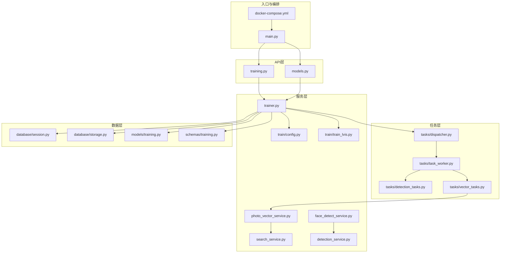
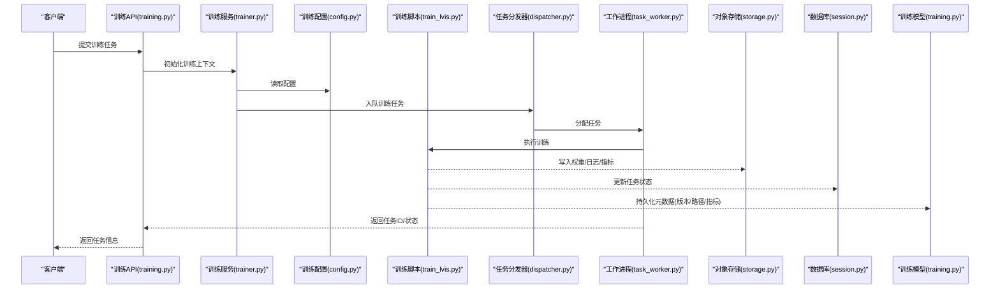
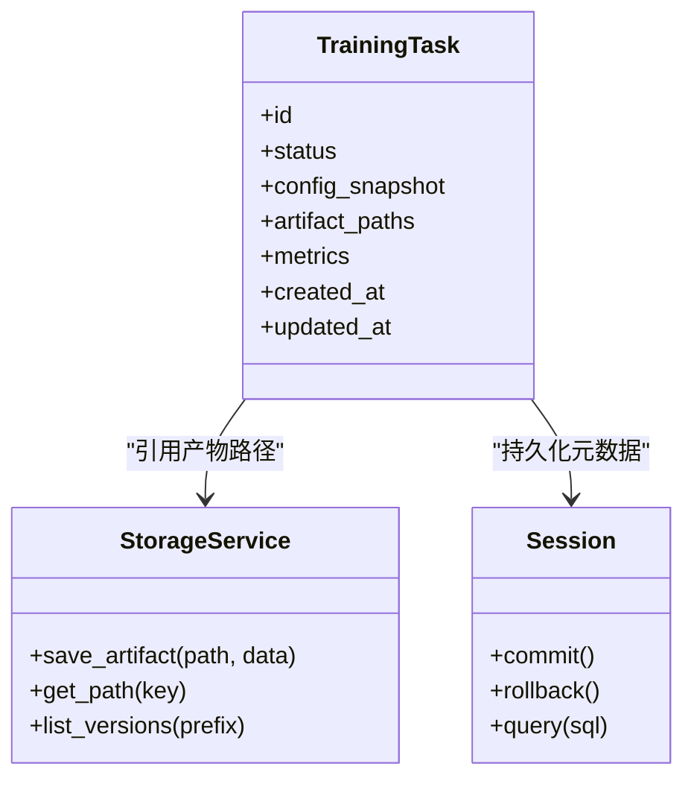
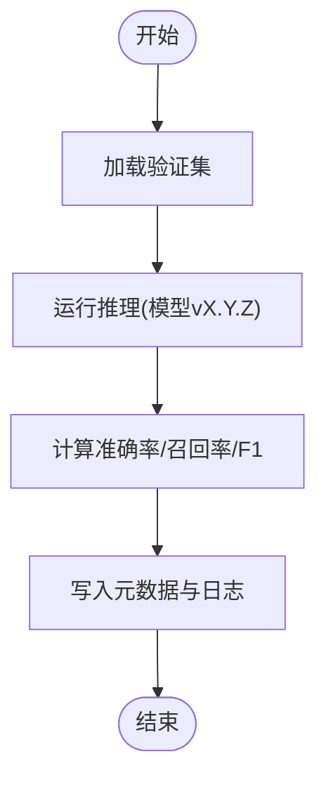
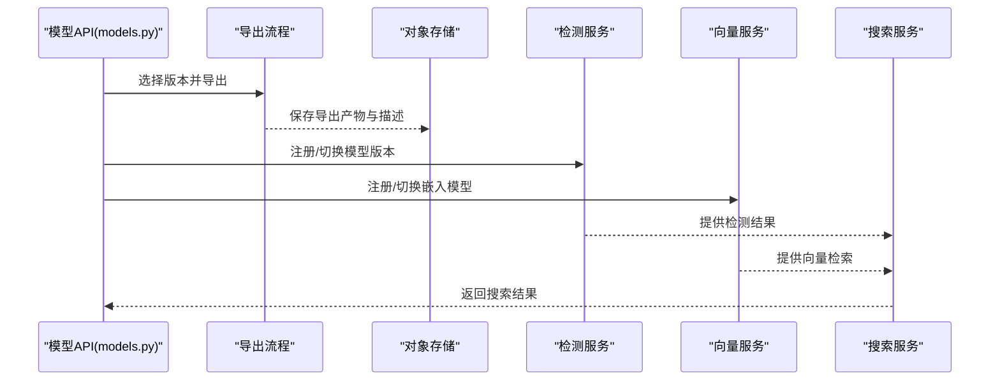
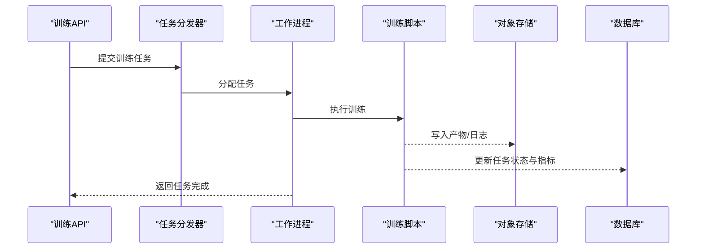
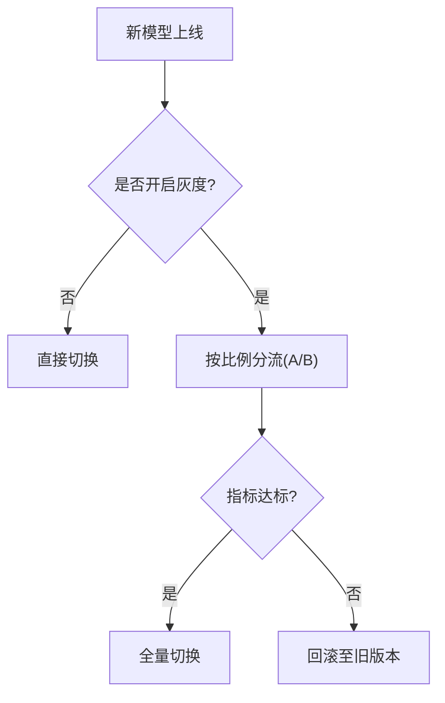
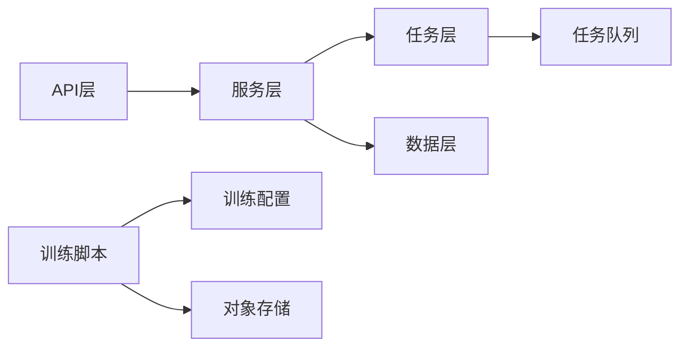

# 模型管理与部署

<cite>
**本文引用的文件**   
- [backend/app/api/models.py](file://backend/app/api/models.py)
- [backend/app/api/training.py](file://backend/app/api/training.py)
- [backend/app/services/trainer.py](file://backend/app/services/trainer.py)
- [backend/app/services/train/config.py](file://backend/app/services/train/config.py)
- [backend/app/services/train/train_lvis.py](file://backend/app/services/train/train_lvis.py)
- [backend/app/services/train/README.md](file://backend/app/services/train/README.md)
- [backend/app/services/train/TRAINING_GUIDE.md](file://backend/app/services/train/TRAINING_GUIDE.md)
- [backend/app/database/storage.py](file://backend/app/database/storage.py)
- [backend/app/database/session.py](file://backend/app/database/session.py)
- [backend/app/models/training.py](file://backend/app/models/training.py)
- [backend/app/schemas/training.py](file://backend/app/schemas/training.py)
- [backend/app/tasks/dispatcher.py](file://backend/app/tasks/dispatcher.py)
- [backend/app/tasks/task_worker.py](file://backend/app/tasks/task_worker.py)
- [backend/app/tasks/detection_tasks.py](file://backend/app/tasks/detection_tasks.py)
- [backend/app/tasks/vector_tasks.py](file://backend/app/tasks/vector_tasks.py)
- [backend/app/services/photo_vector_service.py](file://backend/app/services/photo_vector_service.py)
- [backend/app/services/search_service.py](file://backend/app/services/search_service.py)
- [backend/app/services/face_detect_service.py](file://backend/app/services/face_detect_service.py)
- [backend/app/services/detection_service.py](file://backend/app/services/detection_service.py)
- [backend/app/core/logger.py](file://backend/app/core/logger.py)
- [backend/app/core/exceptions.py](file://backend/app/core/exceptions.py)
- [backend/main.py](file://backend/main.py)
- [docker-compose.yml](file://docker-compose.yml)
</cite>

## 目录
1. [简介](#简介)
2. [项目结构](#项目结构)
3. [核心组件](#核心组件)
4. [架构总览](#架构总览)
5. [详细组件分析](#详细组件分析)
6. [依赖关系分析](#依赖关系分析)
7. [性能与扩展性](#性能与扩展性)
8. [故障排查指南](#故障排查指南)
9. [结论](#结论)
10. [附录](#附录)

## 简介
本文件面向“模型管理与部署”的完整生命周期，覆盖训练完成后模型的存储结构与元数据管理、版本控制机制；模型评估流程（准确率、召回率、F1）；模型导出格式支持与推理服务集成；A/B测试框架、灰度发布与回滚策略；以及模型性能监控、热更新与负载均衡配置。文档基于仓库现有实现进行梳理，并在必要处给出可落地的工程化建议。

## 项目结构
后端采用分层架构：API层暴露接口，服务层封装业务逻辑，任务调度负责异步执行，数据库层提供持久化与对象存储能力，模型与Schema定义数据结构。训练相关代码集中在 services/train 目录，推理服务通过检测与向量检索等模块对外提供服务。

图表来源
- [backend/main.py](file://backend/main.py)
- [backend/app/api/models.py](file://backend/app/api/models.py)
- [backend/app/api/training.py](file://backend/app/api/training.py)
- [backend/app/services/trainer.py](file://backend/app/services/trainer.py)
- [backend/app/services/train/config.py](file://backend/app/services/train/config.py)
- [backend/app/services/train/train_lvis.py](file://backend/app/services/train/train_lvis.py)
- [backend/app/tasks/dispatcher.py](file://backend/app/tasks/dispatcher.py)
- [backend/app/tasks/task_worker.py](file://backend/app/tasks/task_worker.py)
- [backend/app/tasks/detection_tasks.py](file://backend/app/tasks/detection_tasks.py)
- [backend/app/tasks/vector_tasks.py](file://backend/app/tasks/vector_tasks.py)
- [backend/app/services/photo_vector_service.py](file://backend/app/services/photo_vector_service.py)
- [backend/app/services/search_service.py](file://backend/app/services/search_service.py)
- [backend/app/services/face_detect_service.py](file://backend/app/services/face_detect_service.py)
- [backend/app/services/detection_service.py](file://backend/app/services/detection_service.py)
- [backend/app/database/session.py](file://backend/app/database/session.py)
- [backend/app/database/storage.py](file://backend/app/database/storage.py)
- [backend/app/models/training.py](file://backend/app/models/training.py)
- [backend/app/schemas/training.py](file://backend/app/schemas/training.py)
- [docker-compose.yml](file://docker-compose.yml)

章节来源
- [backend/main.py](file://backend/main.py)
- [docker-compose.yml](file://docker-compose.yml)

## 核心组件
- 训练与任务编排
  - 训练服务：封装训练参数、启动训练、记录进度与结果。
  - 训练配置：集中管理数据集路径、超参、设备与输出目录。
  - 训练脚本：具体训练流程实现（如 LVIS 目标检测）。
  - 任务分发器与工作进程：将训练与向量化等耗时任务异步化。
- 模型与元数据
  - 训练任务模型：持久化训练任务状态、指标、产物位置。
  - 训练Schema：校验请求与响应结构。
  - 对象存储：保存模型权重、日志、中间产物。
- 推理与服务
  - 人脸检测服务：加载检测模型并执行推理。
  - 向量检索服务：构建与查询图像特征向量。
  - 搜索服务：组合多路信号完成检索。
- 可观测性与异常
  - 日志：统一结构化日志。
  - 异常：统一错误类型与处理。

章节来源
- [backend/app/services/trainer.py](file://backend/app/services/trainer.py)
- [backend/app/services/train/config.py](file://backend/app/services/train/config.py)
- [backend/app/services/train/train_lvis.py](file://backend/app/services/train/train_lvis.py)
- [backend/app/tasks/dispatcher.py](file://backend/app/tasks/dispatcher.py)
- [backend/app/tasks/task_worker.py](file://backend/app/tasks/task_worker.py)
- [backend/app/models/training.py](file://backend/app/models/training.py)
- [backend/app/schemas/training.py](file://backend/app/schemas/training.py)
- [backend/app/database/storage.py](file://backend/app/database/storage.py)
- [backend/app/services/face_detect_service.py](file://backend/app/services/face_detect_service.py)
- [backend/app/services/photo_vector_service.py](file://backend/app/services/photo_vector_service.py)
- [backend/app/services/search_service.py](file://backend/app/services/search_service.py)
- [backend/app/core/logger.py](file://backend/app/core/logger.py)
- [backend/app/core/exceptions.py](file://backend/app/core/exceptions.py)

## 架构总览
系统以“训练-评估-导出-部署-推理”为主线，结合任务队列实现异步训练与向量化，使用对象存储统一管理模型产物与日志，并通过API对外暴露训练与模型管理能力。

图表来源
- [backend/app/api/training.py](file://backend/app/api/training.py)
- [backend/app/services/trainer.py](file://backend/app/services/trainer.py)
- [backend/app/services/train/config.py](file://backend/app/services/train/config.py)
- [backend/app/services/train/train_lvis.py](file://backend/app/services/train/train_lvis.py)
- [backend/app/tasks/dispatcher.py](file://backend/app/tasks/dispatcher.py)
- [backend/app/tasks/task_worker.py](file://backend/app/tasks/task_worker.py)
- [backend/app/database/storage.py](file://backend/app/database/storage.py)
- [backend/app/database/session.py](file://backend/app/database/session.py)
- [backend/app/models/training.py](file://backend/app/models/training.py)

## 详细组件分析

### 模型存储结构与元数据管理
- 存储位置
  - 模型权重与中间产物：由对象存储服务管理，按任务或版本组织目录，便于回溯与清理。
  - 日志与指标：与模型产物同域存放，便于关联分析。
- 元数据模型
  - 训练任务记录：包含任务标识、状态、输入配置摘要、产出路径、关键指标、创建/更新时间等。
  - 版本标识：通过任务ID或显式版本号区分不同训练产物。
- 一致性保障
  - 在训练完成后原子性地更新元数据与索引，避免读到半写状态。
  - 对失败任务保留断点信息与错误堆栈，支持重试。

图表来源
- [backend/app/models/training.py](file://backend/app/models/training.py)
- [backend/app/database/storage.py](file://backend/app/database/storage.py)
- [backend/app/database/session.py](file://backend/app/database/session.py)

章节来源
- [backend/app/models/training.py](file://backend/app/models/training.py)
- [backend/app/database/storage.py](file://backend/app/database/storage.py)
- [backend/app/database/session.py](file://backend/app/database/session.py)

### 版本控制机制
- 版本命名
  - 推荐采用“语义化版本+时间戳”或“任务ID哈希”，确保唯一且可追溯。
- 变更追踪
  - 每次训练生成不可变产物目录，并将版本映射到元数据表。
- 切换策略
  - 通过“活跃版本”字段指向当前线上版本，切换时仅更新指针，不移动文件。

章节来源
- [backend/app/models/training.py](file://backend/app/models/training.py)
- [backend/app/schemas/training.py](file://backend/app/schemas/training.py)

### 模型评估流程（准确率、召回率、F1）
- 评估触发
  - 训练完成后自动触发评估任务，或手动调用评估接口。
- 指标计算
  - 准确率：正确预测样本数 / 总样本数。
  - 召回率：真正例 / (真正例 + 假负例)。
  - F1分数：2 × (准确率 × 召回率) / (准确率 + 召回率)。
- 结果持久化
  - 将指标写入训练任务元数据，并与对应版本绑定。

章节来源
- [backend/app/services/trainer.py](file://backend/app/services/trainer.py)
- [backend/app/models/training.py](file://backend/app/models/training.py)

### 模型导出格式支持与推理服务集成
- 导出格式
  - 根据训练框架选择合适格式（如 ONNX/TensorRT/自定义二进制），并记录导出路径与依赖信息于元数据。
- 推理集成
  - 检测服务：加载最新或指定版本的检测模型，提供人脸/目标检测接口。
  - 向量服务：加载嵌入模型，为图片生成向量并入库。
  - 搜索服务：组合检测结果与向量相似度进行检索。

图表来源
- [backend/app/api/models.py](file://backend/app/api/models.py)
- [backend/app/services/detection_service.py](file://backend/app/services/detection_service.py)
- [backend/app/services/face_detect_service.py](file://backend/app/services/face_detect_service.py)
- [backend/app/services/photo_vector_service.py](file://backend/app/services/photo_vector_service.py)
- [backend/app/services/search_service.py](file://backend/app/services/search_service.py)
- [backend/app/database/storage.py](file://backend/app/database/storage.py)

章节来源
- [backend/app/api/models.py](file://backend/app/api/models.py)
- [backend/app/services/detection_service.py](file://backend/app/services/detection_service.py)
- [backend/app/services/face_detect_service.py](file://backend/app/services/face_detect_service.py)
- [backend/app/services/photo_vector_service.py](file://backend/app/services/photo_vector_service.py)
- [backend/app/services/search_service.py](file://backend/app/services/search_service.py)

### 训练任务与异步执行
- 任务入队
  - API接收训练请求后，构造任务上下文并投递至任务队列。
- 任务执行
  - 工作进程拉取任务，加载配置，执行训练脚本，持续上报进度。
- 结果落盘
  - 训练结束后，将权重、日志、指标写入对象存储，并更新数据库中的任务状态与元数据。

图表来源
- [backend/app/api/training.py](file://backend/app/api/training.py)
- [backend/app/tasks/dispatcher.py](file://backend/app/tasks/dispatcher.py)
- [backend/app/tasks/task_worker.py](file://backend/app/tasks/task_worker.py)
- [backend/app/services/train/train_lvis.py](file://backend/app/services/train/train_lvis.py)
- [backend/app/database/storage.py](file://backend/app/database/storage.py)
- [backend/app/database/session.py](file://backend/app/database/session.py)

章节来源
- [backend/app/api/training.py](file://backend/app/api/training.py)
- [backend/app/tasks/dispatcher.py](file://backend/app/tasks/dispatcher.py)
- [backend/app/tasks/task_worker.py](file://backend/app/tasks/task_worker.py)
- [backend/app/services/train/train_lvis.py](file://backend/app/services/train/train_lvis.py)

### A/B测试框架、灰度发布与回滚策略
- A/B测试
  - 通过路由层按流量比例将请求分发到不同模型版本，收集指标对比。
- 灰度发布
  - 逐步放量新版本，观察错误率与延迟，达标后全量切换。
- 回滚策略
  - 若新版本出现异常或指标劣化，快速切回上一稳定版本，保持零停机。

[此图为概念流程，无需源码映射]

### 模型性能监控、热更新与负载均衡
- 性能监控
  - 采集推理QPS、P95/P99延迟、错误率、GPU/CPU利用率，并告警。
- 热更新
  - 在不重启服务的情况下动态加载新模型权重，需保证线程安全与内存释放。
- 负载均衡
  - 在多实例部署下，通过反向代理或服务发现均衡负载，结合健康检查剔除异常节点。

章节来源
- [backend/app/core/logger.py](file://backend/app/core/logger.py)
- [docker-compose.yml](file://docker-compose.yml)

## 依赖关系分析
- 组件耦合
  - API层依赖服务层；服务层依赖任务层与数据层；训练脚本依赖配置与存储。
- 外部依赖
  - 对象存储用于非结构化数据；数据库用于结构化元数据；任务队列用于异步执行。
- 潜在环依赖
  - 服务层不应反向依赖API层；任务层只依赖服务层提供的工具函数。

图表来源
- [backend/app/api/models.py](file://backend/app/api/models.py)
- [backend/app/api/training.py](file://backend/app/api/training.py)
- [backend/app/services/trainer.py](file://backend/app/services/trainer.py)
- [backend/app/services/train/config.py](file://backend/app/services/train/config.py)
- [backend/app/services/train/train_lvis.py](file://backend/app/services/train/train_lvis.py)
- [backend/app/tasks/dispatcher.py](file://backend/app/tasks/dispatcher.py)
- [backend/app/database/storage.py](file://backend/app/database/storage.py)

章节来源
- [backend/app/api/models.py](file://backend/app/api/models.py)
- [backend/app/api/training.py](file://backend/app/api/training.py)
- [backend/app/services/trainer.py](file://backend/app/services/trainer.py)
- [backend/app/services/train/config.py](file://backend/app/services/train/config.py)
- [backend/app/services/train/train_lvis.py](file://backend/app/services/train/train_lvis.py)
- [backend/app/tasks/dispatcher.py](file://backend/app/tasks/dispatcher.py)
- [backend/app/database/storage.py](file://backend/app/database/storage.py)

## 性能与扩展性
- 训练并行
  - 多任务并发训练，结合资源隔离与配额限制，避免争抢GPU。
- 推理优化
  - 模型量化、图优化、批处理与缓存策略降低延迟。
- 水平扩展
  - 无状态服务实例配合负载均衡与任务队列横向扩展。

[本节为通用指导，无需源码映射]

## 故障排查指南
- 常见问题
  - 训练中断：检查任务状态与日志，确认资源不足或数据损坏。
  - 推理失败：核对模型版本与依赖，查看错误码与堆栈。
  - 指标异常：复核评估集与阈值设置，确认数据一致性。
- 定位手段
  - 统一日志与异常类型，结合任务ID追踪端到端链路。
  - 对象存储中按版本归档产物，便于复现问题。

章节来源
- [backend/app/core/logger.py](file://backend/app/core/logger.py)
- [backend/app/core/exceptions.py](file://backend/app/core/exceptions.py)
- [backend/app/database/storage.py](file://backend/app/database/storage.py)

## 结论
本项目围绕“训练-评估-导出-部署-推理”构建了完整的模型管理与部署闭环。通过对象存储与元数据模型实现版本化与可追溯，借助任务队列提升训练效率，并以服务化方式提供稳定的推理能力。建议在后续迭代中完善A/B测试与灰度发布的具体实现，强化监控告警与自动化回滚，进一步提升系统的可靠性与可运维性。

## 附录
- 训练说明与指南
  - 训练README与指南文档提供了训练流程、数据准备与注意事项。

章节来源
- [backend/app/services/train/README.md](file://backend/app/services/train/README.md)
- [backend/app/services/train/TRAINING_GUIDE.md](file://backend/app/services/train/TRAINING_GUIDE.md)