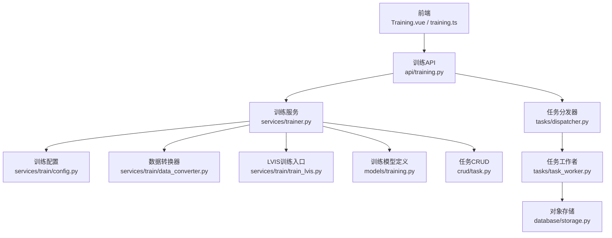
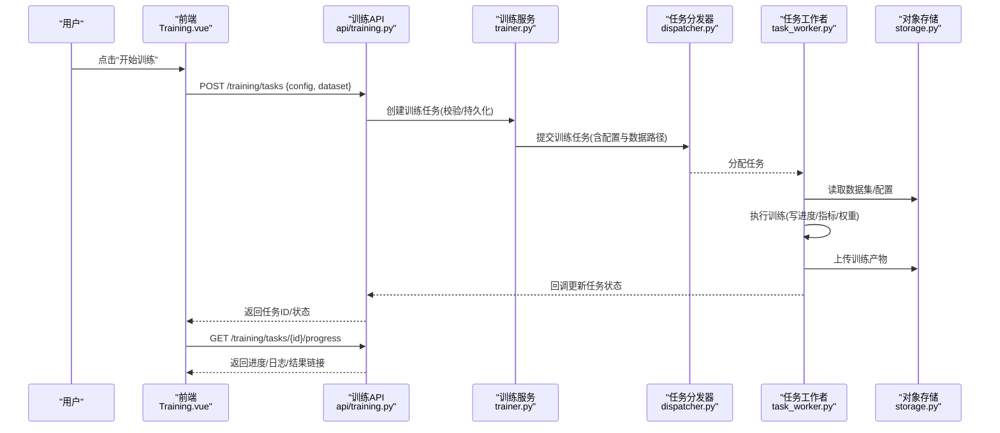
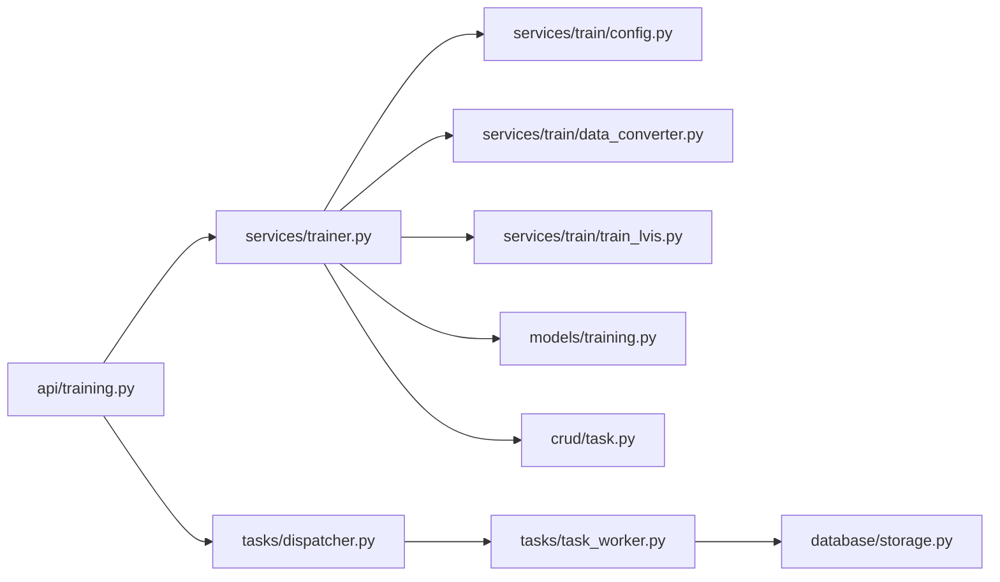

# 模型训练系统

<cite>
**本文引用的文件**   
- [backend/app/api/training.py](file://backend/app/api/training.py)
- [backend/app/services/trainer.py](file://backend/app/services/trainer.py)
- [backend/app/services/train/config.py](file://backend/app/services/train/config.py)
- [backend/app/services/train/data_converter.py](file://backend/app/services/train/data_converter.py)
- [backend/app/services/train/train_lvis.py](file://backend/app/services/train/train_lvis.py)
- [backend/app/services/train/README.md](file://backend/app/services/train/README.md)
- [backend/app/services/train/TRAINING_GUIDE.md](file://backend/app/services/train/TRAINING_GUIDE.md)
- [backend/app/schemas/training.py](file://backend/app/schemas/training.py)
- [backend/app/models/training.py](file://backend/app/models/training.py)
- [backend/app/crud/task.py](file://backend/app/crud/task.py)
- [backend/app/tasks/dispatcher.py](file://backend/app/tasks/dispatcher.py)
- [backend/app/tasks/task_worker.py](file://backend/app/tasks/task_worker.py)
- [backend/app/tasks/detection_tasks.py](file://backend/app/tasks/detection_tasks.py)
- [backend/app/database/storage.py](file://backend/app/database/storage.py)
- [backend/main.py](file://backend/main.py)
- [frontend/src/api/training.ts](file://frontend/src/api/training.ts)
- [frontend/src/views/Training.vue](file://frontend/src/views/Training.vue)
</cite>

## 目录
1. [简介](#简介)
2. [项目结构](#项目结构)
3. [核心组件](#核心组件)
4. [架构总览](#架构总览)
5. [详细组件分析](#详细组件分析)
6. [依赖关系分析](#依赖关系分析)
7. [性能与资源管理](#性能与资源管理)
8. [故障排查指南](#故障排查指南)
9. [结论](#结论)
10. [附录](#附录)

## 简介
本文件面向“AI相册”项目的模型训练子系统，提供从数据准备、预处理、模型配置、训练参数调优到任务调度、进度跟踪、结果管理与评估的完整说明。文档覆盖以下主题：
- 自定义模型的训练流程（数据集准备、数据预处理、模型配置与超参调优）
- LVIS数据集转换工具的使用方法与自定义数据集格式要求
- 训练任务的异步处理机制、进度跟踪与结果管理
- 模型版本控制、评估指标与A/B测试框架
- 训练环境搭建、GPU资源管理与分布式训练配置

## 项目结构
训练相关代码主要位于后端服务的 services/train 与 services/trainer.py，API 层在 api/training.py，前端通过 training.ts 与 Training.vue 进行交互；任务调度与执行由 tasks 模块负责；持久化与存储由 database/storage.py 提供。

图表来源
- [backend/main.py:1-200](file://backend/main.py#L1-L200)
- [backend/app/api/training.py:1-200](file://backend/app/api/training.py#L1-L200)
- [backend/app/services/trainer.py:1-200](file://backend/app/services/trainer.py#L1-L200)
- [backend/app/services/train/config.py:1-200](file://backend/app/services/train/config.py#L1-L200)
- [backend/app/services/train/data_converter.py:1-200](file://backend/app/services/train/data_converter.py#L1-L200)
- [backend/app/services/train/train_lvis.py:1-200](file://backend/app/services/train/train_lvis.py#L1-L200)
- [backend/app/tasks/dispatcher.py:1-200](file://backend/app/tasks/dispatcher.py#L1-L200)
- [backend/app/tasks/task_worker.py:1-200](file://backend/app/tasks/task_worker.py#L1-L200)
- [backend/app/database/storage.py:1-200](file://backend/app/database/storage.py#L1-L200)
- [backend/app/models/training.py:1-200](file://backend/app/models/training.py#L1-L200)
- [backend/app/crud/task.py:1-200](file://backend/app/crud/task.py#L1-L200)

章节来源
- [backend/main.py:1-200](file://backend/main.py#L1-L200)
- [backend/app/api/training.py:1-200](file://backend/app/api/training.py#L1-L200)
- [backend/app/services/trainer.py:1-200](file://backend/app/services/trainer.py#L1-L200)

## 核心组件
- 训练API接口：提供创建训练任务、查询任务状态、获取训练日志与结果等能力。
- 训练服务：封装训练流程编排，协调配置加载、数据转换、训练执行、结果落盘与元数据记录。
- 训练配置：集中管理模型类型、数据集路径、超参数、设备与分布式设置。
- 数据转换器：将外部数据集（如LVIS）转换为训练所需格式，支持校验与统计信息输出。
- 训练入口（LVIS示例）：基于配置驱动的训练脚本，完成数据加载、模型初始化、训练循环与保存。
- 任务调度与执行：异步队列分发训练任务，工作者进程执行具体训练逻辑并上报进度。
- 存储与模型版本：统一对象存储管理训练产物（权重、日志、指标），以版本号组织便于回滚与对比。
- 前端界面：可视化创建任务、查看进度、下载模型与评估报告。

章节来源
- [backend/app/api/training.py:1-200](file://backend/app/api/training.py#L1-L200)
- [backend/app/services/trainer.py:1-200](file://backend/app/services/trainer.py#L1-L200)
- [backend/app/services/train/config.py:1-200](file://backend/app/services/train/config.py#L1-L200)
- [backend/app/services/train/data_converter.py:1-200](file://backend/app/services/train/data_converter.py#L1-L200)
- [backend/app/services/train/train_lvis.py:1-200](file://backend/app/services/train/train_lvis.py#L1-L200)
- [backend/app/tasks/dispatcher.py:1-200](file://backend/app/tasks/dispatcher.py#L1-L200)
- [backend/app/tasks/task_worker.py:1-200](file://backend/app/tasks/task_worker.py#L1-L200)
- [backend/app/database/storage.py:1-200](file://backend/app/database/storage.py#L1-L200)
- [backend/app/models/training.py:1-200](file://backend/app/models/training.py#L1-L200)
- [backend/app/crud/task.py:1-200](file://backend/app/crud/task.py#L1-L200)
- [frontend/src/api/training.ts:1-200](file://frontend/src/api/training.ts#L1-L200)
- [frontend/src/views/Training.vue:1-200](file://frontend/src/views/Training.vue#L1-L200)

## 架构总览
训练系统采用“API + 服务 + 任务队列 + 存储”的分层架构。前端通过REST调用创建训练任务，API层将请求转为内部服务调用，服务根据配置与数据准备情况提交异步任务；工作者进程执行训练，实时写入进度与结果至对象存储，并通过数据库更新任务状态。

图表来源
- [backend/app/api/training.py:1-200](file://backend/app/api/training.py#L1-L200)
- [backend/app/services/trainer.py:1-200](file://backend/app/services/trainer.py#L1-L200)
- [backend/app/tasks/dispatcher.py:1-200](file://backend/app/tasks/dispatcher.py#L1-L200)
- [backend/app/tasks/task_worker.py:1-200](file://backend/app/tasks/task_worker.py#L1-L200)
- [backend/app/database/storage.py:1-200](file://backend/app/database/storage.py#L1-L200)

## 详细组件分析

### 训练API与前端集成
- 职责
  - 接收前端训练请求，校验输入参数，创建训练任务并返回任务ID。
  - 提供任务状态、进度、日志与结果的查询接口。
- 关键流程
  - 创建任务：解析前端提交的训练配置与数据集信息，持久化任务记录，触发异步执行。
  - 进度查询：聚合任务状态、最近一次进度事件与存储中的产物索引。
  - 结果访问：返回模型权重、评估报告与训练日志的下载链接。
- 错误处理
  - 参数校验失败返回明确错误码与消息。
  - 任务不存在或权限不足时返回相应状态。
- 前端对接
  - 使用 training.ts 封装API调用，Training.vue 展示任务列表、进度条与结果下载。

章节来源
- [backend/app/api/training.py:1-200](file://backend/app/api/training.py#L1-L200)
- [frontend/src/api/training.ts:1-200](file://frontend/src/api/training.ts#L1-L200)
- [frontend/src/views/Training.vue:1-200](file://frontend/src/views/Training.vue#L1-L200)

### 训练服务与任务编排
- 职责
  - 编排训练全流程：配置加载、数据转换、训练执行、结果归档与元数据更新。
  - 与任务分发器协作，确保训练任务可被多工作者并行执行。
- 关键流程
  - 初始化：根据任务配置选择模型类型与训练入口。
  - 数据准备：调用数据转换器生成训练所需的数据集格式。
  - 训练执行：启动训练脚本，监控进程状态，捕获异常并更新任务状态。
  - 结果管理：将权重、日志、指标写入对象存储，按版本命名。
- 并发与隔离
  - 每个任务拥有独立工作目录与临时空间，避免冲突。
  - 支持限制并发度与资源配额。

章节来源
- [backend/app/services/trainer.py:1-200](file://backend/app/services/trainer.py#L1-L200)
- [backend/app/tasks/dispatcher.py:1-200](file://backend/app/tasks/dispatcher.py#L1-L200)
- [backend/app/tasks/task_worker.py:1-200](file://backend/app/tasks/task_worker.py#L1-L200)

### 训练配置与超参管理
- 职责
  - 统一管理模型类型、数据集路径、优化器、学习率、批次大小、轮次、早停策略、设备与分布式设置。
  - 提供默认值与校验规则，支持按任务覆盖。
- 关键项
  - 模型配置：骨干网络、检测头、预训练权重路径。
  - 数据配置：类别映射、标注格式、增强策略。
  - 训练策略：学习率调度、梯度裁剪、混合精度、检查点频率。
  - 资源与分布式：GPU数量、节点数、通信后端、端口范围。
- 扩展性
  - 新增模型类型只需注册新配置模板与训练入口。

章节来源
- [backend/app/services/train/config.py:1-200](file://backend/app/services/train/config.py#L1-L200)

### 数据转换器与LVIS适配
- 职责
  - 将外部数据集（如LVIS）转换为训练所需的内部格式，包括图像、标注、类别字典与统计信息。
  - 提供数据完整性校验与可视化预览辅助。
- LVIS转换要点
  - 读取LVIS JSON标注，映射类别ID到内部类别名。
  - 生成统一的标注文件与索引，支持增量更新。
  - 输出数据清单与统计摘要，便于后续验证。
- 自定义数据集格式要求
  - 图像目录结构清晰，标注文件遵循约定键名与字段类型。
  - 类别表需包含唯一ID与名称，支持层级关系（可选）。
  - 建议提供校验脚本与样例数据。

章节来源
- [backend/app/services/train/data_converter.py:1-200](file://backend/app/services/train/data_converter.py#L1-L200)
- [backend/app/services/train/train_lvis.py:1-200](file://backend/app/services/train/train_lvis.py#L1-L200)
- [backend/app/services/train/README.md:1-200](file://backend/app/services/train/README.md#L1-L200)
- [backend/app/services/train/TRAINING_GUIDE.md:1-200](file://backend/app/services/train/TRAINING_GUIDE.md#L1-L200)

### 训练入口（LVIS示例）
- 职责
  - 基于配置加载数据、构建模型、执行训练循环、保存检查点与评估结果。
- 关键流程
  - 解析配置与命令行参数。
  - 初始化数据管道与模型。
  - 训练循环中定期记录损失、指标与检查点。
  - 训练结束输出最终模型与评估报告。
- 可扩展点
  - 替换模型类与损失函数即可适配新任务。
  - 支持断点续训与自动恢复。

章节来源
- [backend/app/services/train/train_lvis.py:1-200](file://backend/app/services/train/train_lvis.py#L1-L200)

### 任务调度与工作者
- 职责
  - 分发训练任务到可用工作者，维护任务生命周期与重试策略。
  - 工作者执行训练脚本，上报进度与结果。
- 关键流程
  - 分发器接收任务，选择空闲工作者。
  - 工作者拉取任务，加载配置与数据，执行训练。
  - 周期性上报进度事件（如当前轮次、损失、剩余时间估算）。
  - 完成后更新任务状态为成功或失败，并归档产物。
- 可靠性
  - 任务幂等设计，支持失败重试与超时保护。
  - 工作者健康检查与自动回收。

章节来源
- [backend/app/tasks/dispatcher.py:1-200](file://backend/app/tasks/dispatcher.py#L1-L200)
- [backend/app/tasks/task_worker.py:1-200](file://backend/app/tasks/task_worker.py#L1-L200)
- [backend/app/tasks/detection_tasks.py:1-200](file://backend/app/tasks/detection_tasks.py#L1-L200)

### 存储与模型版本控制
- 职责
  - 统一对象存储管理训练产物（权重、日志、指标、报告）。
  - 以版本号为维度组织目录，支持回滚与对比。
- 版本策略
  - 每次训练产出带唯一版本标识（如时间戳+哈希）。
  - 元数据记录版本与任务关联，便于检索与审计。
- 访问控制
  - 提供只读下载链接与权限校验。

章节来源
- [backend/app/database/storage.py:1-200](file://backend/app/database/storage.py#L1-L200)
- [backend/app/models/training.py:1-200](file://backend/app/models/training.py#L1-L200)
- [backend/app/crud/task.py:1-200](file://backend/app/crud/task.py#L1-L200)

### A/B测试与评估指标
- 评估指标
  - 常用指标包括mAP、Precision、Recall、F1、混淆矩阵等。
  - 指标随训练过程记录，并在结束时生成汇总报告。
- A/B测试框架
  - 同一数据集下并行训练不同配置，比较指标差异。
  - 提供一键对比视图与显著性检验（可选）。
- 最佳实践
  - 固定随机种子以保证可复现性。
  - 保留基线模型作为对照。

章节来源
- [backend/app/services/train/train_lvis.py:1-200](file://backend/app/services/train/train_lvis.py#L1-L200)
- [backend/app/services/train/TRAINING_GUIDE.md:1-200](file://backend/app/services/train/TRAINING_GUIDE.md#L1-L200)

## 依赖关系分析
训练系统的依赖关系如下：
- API层依赖训练服务与任务分发器。
- 训练服务依赖配置、数据转换器与训练入口。
- 任务分发器与工作者依赖对象存储与数据库。
- 前端依赖API与对象存储直链。

图表来源
- [backend/app/api/training.py:1-200](file://backend/app/api/training.py#L1-L200)
- [backend/app/services/trainer.py:1-200](file://backend/app/services/trainer.py#L1-L200)
- [backend/app/services/train/config.py:1-200](file://backend/app/services/train/config.py#L1-L200)
- [backend/app/services/train/data_converter.py:1-200](file://backend/app/services/train/data_converter.py#L1-L200)
- [backend/app/services/train/train_lvis.py:1-200](file://backend/app/services/train/train_lvis.py#L1-L200)
- [backend/app/tasks/dispatcher.py:1-200](file://backend/app/tasks/dispatcher.py#L1-L200)
- [backend/app/tasks/task_worker.py:1-200](file://backend/app/tasks/task_worker.py#L1-L200)
- [backend/app/database/storage.py:1-200](file://backend/app/database/storage.py#L1-L200)
- [backend/app/models/training.py:1-200](file://backend/app/models/training.py#L1-L200)
- [backend/app/crud/task.py:1-200](file://backend/app/crud/task.py#L1-L200)

章节来源
- [backend/app/api/training.py:1-200](file://backend/app/api/training.py#L1-L200)
- [backend/app/services/trainer.py:1-200](file://backend/app/services/trainer.py#L1-L200)

## 性能与资源管理
- GPU资源管理
  - 支持指定GPU编号与显存上限，避免OOM。
  - 启用混合精度与梯度累积提升吞吐。
- 分布式训练
  - 支持多卡与多节点，配置通信后端与端口范围。
  - 数据并行与模型并行策略可按任务选择。
- 并发与限流
  - 限制同时运行的训练任务数量，防止资源争用。
  - 按任务优先级调度，保障重要任务优先执行。
- I/O优化
  - 数据预取与缓存，减少磁盘I/O瓶颈。
  - 大文件分块上传与断点续传。

章节来源
- [backend/app/services/train/config.py:1-200](file://backend/app/services/train/config.py#L1-L200)
- [backend/app/tasks/dispatcher.py:1-200](file://backend/app/tasks/dispatcher.py#L1-L200)
- [backend/app/tasks/task_worker.py:1-200](file://backend/app/tasks/task_worker.py#L1-L200)

## 故障排查指南
- 常见问题
  - 任务创建失败：检查输入参数与权限，确认数据集路径有效。
  - 训练中断：查看工作者日志与对象存储产物，定位异常阶段。
  - 指标不达标：核对数据质量与类别映射，调整学习率与批次大小。
- 诊断步骤
  - 通过任务ID查询状态与最近日志。
  - 下载训练产物与评估报告进行离线分析。
  - 使用最小数据集复现问题，逐步扩大规模。
- 恢复策略
  - 启用断点续训，从最近检查点恢复。
  - 对失败任务进行自动重试与降级策略。

章节来源
- [backend/app/api/training.py:1-200](file://backend/app/api/training.py#L1-L200)
- [backend/app/tasks/task_worker.py:1-200](file://backend/app/tasks/task_worker.py#L1-L200)
- [backend/app/database/storage.py:1-200](file://backend/app/database/storage.py#L1-L200)

## 结论
本训练系统提供了端到端的自定义模型训练能力，涵盖数据准备、配置管理、异步任务调度、进度跟踪、结果管理与评估对比。通过模块化设计与清晰的依赖关系，系统具备良好的可扩展性与可维护性，适合在生产环境中稳定运行。

## 附录
- 快速上手
  - 准备数据集并按要求组织目录与标注文件。
  - 使用数据转换器生成训练格式。
  - 通过前端或API创建训练任务，观察进度与结果。
- 参考文档
  - 训练指南与LVIS转换说明详见对应Markdown文件。

章节来源
- [backend/app/services/train/README.md:1-200](file://backend/app/services/train/README.md#L1-L200)
- [backend/app/services/train/TRAINING_GUIDE.md:1-200](file://backend/app/services/train/TRAINING_GUIDE.md#L1-L200)