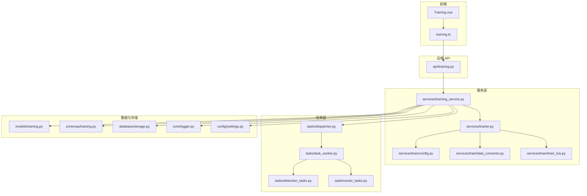
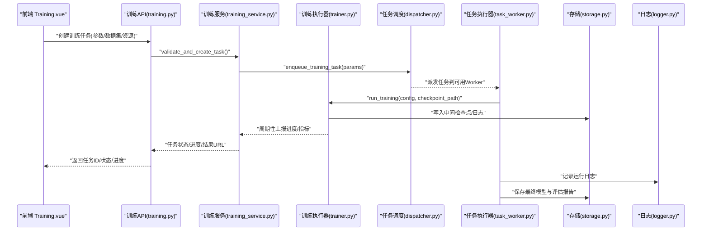
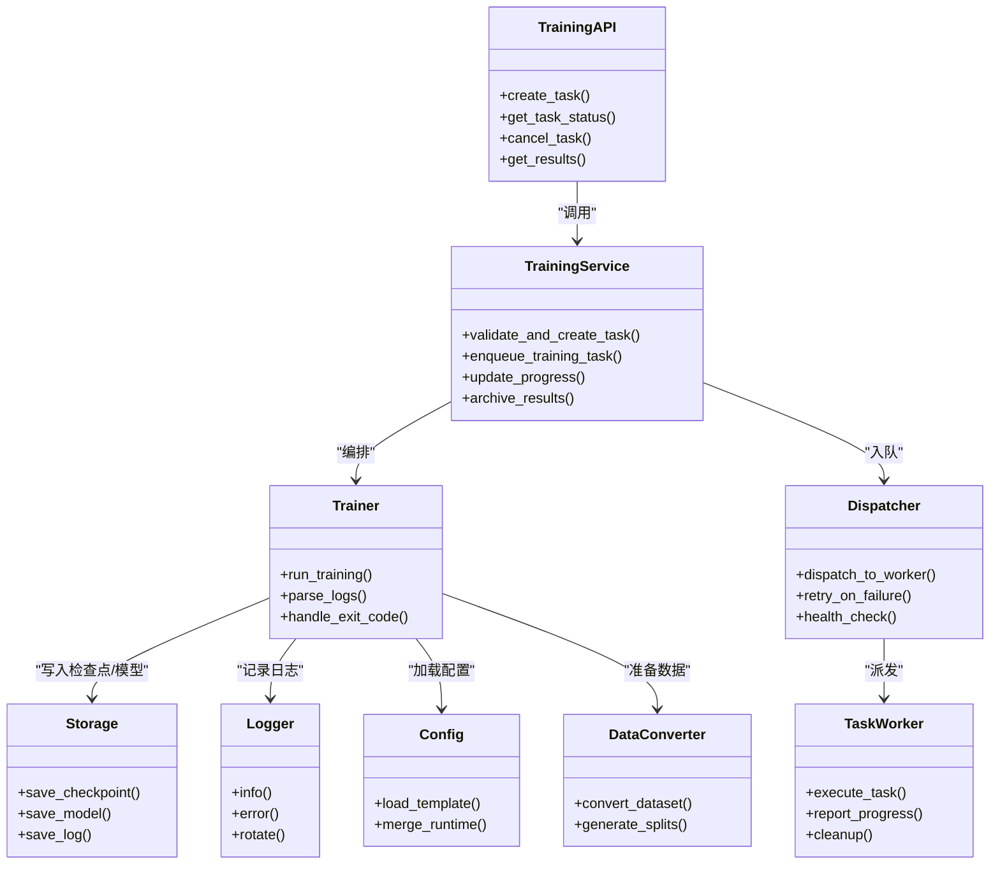

# 训练工作流

<cite>
**本文引用的文件**   
- [backend/app/api/training.py](file://backend/app/api/training.py)
- [backend/app/services/trainer.py](file://backend/app/services/trainer.py)
- [backend/app/services/training_service.py](file://backend/app/services/training_service.py)
- [backend/app/models/training.py](file://backend/app/models/training.py)
- [backend/app/schemas/training.py](file://backend/app/schemas/training.py)
- [backend/app/tasks/dispatcher.py](file://backend/app/tasks/dispatcher.py)
- [backend/app/tasks/task_worker.py](file://backend/app/tasks/task_worker.py)
- [backend/app/tasks/detection_tasks.py](file://backend/app/tasks/detection_tasks.py)
- [backend/app/tasks/vector_tasks.py](file://backend/app/tasks/vector_tasks.py)
- [backend/app/core/logger.py](file://backend/app/core/logger.py)
- [backend/app/database/storage.py](file://backend/app/database/storage.py)
- [backend/app/config/settings.py](file://backend/app/config/settings.py)
- [backend/app/services/train/README.md](file://backend/app/services/train/README.md)
- [backend/app/services/train/TRAINING_GUIDE.md](file://backend/app/services/train/TRAINING_GUIDE.md)
- [backend/app/services/train/config.py](file://backend/app/services/train/config.py)
- [backend/app/services/train/data_converter.py](file://backend/app/services/train/data_converter.py)
- [backend/app/services/train/train_lvis.py](file://backend/app/services/train/train_lvis.py)
- [frontend/src/views/Training.vue](file://frontend/src/views/Training.vue)
- [frontend/src/api/training.ts](file://frontend/src/api/training.ts)
</cite>

## 目录
1. [简介](#简介)
2. [项目结构](#项目结构)
3. [核心组件](#核心组件)
4. [架构总览](#架构总览)
5. [详细组件分析](#详细组件分析)
6. [依赖关系分析](#依赖关系分析)
7. [性能与资源管理](#性能与资源管理)
8. [故障排查指南](#故障排查指南)
9. [结论](#结论)
10. [附录](#附录)

## 简介
本文件面向“训练工作流”的端到端说明，覆盖从任务提交到模型部署的全链路：任务队列管理、GPU 资源分配、分布式训练支持、进度跟踪、日志记录、中间结果保存、监控面板使用与关键指标解读、错误处理与重试机制、断点续训、以及训练结果的评估验证与模型版本管理。文档同时提供架构图、时序图与流程图，帮助读者快速理解系统设计与实现要点。

## 项目结构
训练相关代码主要分布在后端 API、服务层、任务调度与执行器、数据与存储、前端视图与接口等模块中。整体采用分层设计：API 层负责请求解析与响应封装；服务层编排训练流程与状态；任务层负责异步执行与重试；存储层持久化配置、日志与产物；前端提供可视化操作与监控。

图表来源
- [backend/app/api/training.py](file://backend/app/api/training.py)
- [backend/app/services/training_service.py](file://backend/app/services/training_service.py)
- [backend/app/services/trainer.py](file://backend/app/services/trainer.py)
- [backend/app/services/train/config.py](file://backend/app/services/train/config.py)
- [backend/app/services/train/data_converter.py](file://backend/app/services/train/data_converter.py)
- [backend/app/services/train/train_lvis.py](file://backend/app/services/train/train_lvis.py)
- [backend/app/tasks/dispatcher.py](file://backend/app/tasks/dispatcher.py)
- [backend/app/tasks/task_worker.py](file://backend/app/tasks/task_worker.py)
- [backend/app/tasks/detection_tasks.py](file://backend/app/tasks/detection_tasks.py)
- [backend/app/tasks/vector_tasks.py](file://backend/app/tasks/vector_tasks.py)
- [backend/app/models/training.py](file://backend/app/models/training.py)
- [backend/app/schemas/training.py](file://backend/app/schemas/training.py)
- [backend/app/database/storage.py](file://backend/app/database/storage.py)
- [backend/app/core/logger.py](file://backend/app/core/logger.py)
- [backend/app/config/settings.py](file://backend/app/config/settings.py)
- [frontend/src/views/Training.vue](file://frontend/src/views/Training.vue)
- [frontend/src/api/training.ts](file://frontend/src/api/training.ts)

章节来源
- [backend/app/api/training.py](file://backend/app/api/training.py)
- [backend/app/services/training_service.py](file://backend/app/services/training_service.py)
- [backend/app/services/trainer.py](file://backend/app/services/trainer.py)
- [backend/app/tasks/dispatcher.py](file://backend/app/tasks/dispatcher.py)
- [backend/app/tasks/task_worker.py](file://backend/app/tasks/task_worker.py)
- [backend/app/models/training.py](file://backend/app/models/training.py)
- [backend/app/schemas/training.py](file://backend/app/schemas/training.py)
- [backend/app/database/storage.py](file://backend/app/database/storage.py)
- [backend/app/core/logger.py](file://backend/app/core/logger.py)
- [backend/app/config/settings.py](file://backend/app/config/settings.py)
- [frontend/src/views/Training.vue](file://frontend/src/views/Training.vue)
- [frontend/src/api/training.ts](file://frontend/src/api/training.ts)

## 核心组件
- 训练 API 控制器：接收前端训练任务创建、查询、取消与结果获取请求，调用服务层进行编排。
- 训练服务：维护训练任务生命周期、参数校验、资源申请、任务入队、进度更新与结果落盘。
- 训练执行器：封装具体训练脚本（如 LVIS 目标检测）启动、参数注入、进程管理与异常捕获。
- 任务调度与执行器：统一的任务分发与 Worker 执行，支持重试、超时与失败回滚。
- 数据转换与配置：将数据集转换为训练所需格式，加载并合并配置项。
- 存储与日志：持久化训练元数据、中间检查点、最终模型与日志文件。
- 前端训练页面与接口：提供任务创建表单、进度轮询、日志查看与模型下载入口。

章节来源
- [backend/app/api/training.py](file://backend/app/api/training.py)
- [backend/app/services/training_service.py](file://backend/app/services/training_service.py)
- [backend/app/services/trainer.py](file://backend/app/services/trainer.py)
- [backend/app/services/train/config.py](file://backend/app/services/train/config.py)
- [backend/app/services/train/data_converter.py](file://backend/app/services/train/data_converter.py)
- [backend/app/services/train/train_lvis.py](file://backend/app/services/train/train_lvis.py)
- [backend/app/tasks/dispatcher.py](file://backend/app/tasks/dispatcher.py)
- [backend/app/tasks/task_worker.py](file://backend/app/tasks/task_worker.py)
- [backend/app/database/storage.py](file://backend/app/database/storage.py)
- [backend/app/core/logger.py](file://backend/app/core/logger.py)
- [frontend/src/views/Training.vue](file://frontend/src/views/Training.vue)
- [frontend/src/api/training.ts](file://frontend/src/api/training.ts)

## 架构总览
下图展示从前端发起训练到后端执行、落盘与返回结果的完整交互路径，包括任务入队、Worker 执行、进度上报与结果归档。

图表来源
- [backend/app/api/training.py](file://backend/app/api/training.py)
- [backend/app/services/training_service.py](file://backend/app/services/training_service.py)
- [backend/app/services/trainer.py](file://backend/app/services/trainer.py)
- [backend/app/tasks/dispatcher.py](file://backend/app/tasks/dispatcher.py)
- [backend/app/tasks/task_worker.py](file://backend/app/tasks/task_worker.py)
- [backend/app/database/storage.py](file://backend/app/database/storage.py)
- [backend/app/core/logger.py](file://backend/app/core/logger.py)

## 详细组件分析

### 训练 API 控制器
- 职责：定义训练相关的 REST 接口，包括创建任务、查询任务、取消任务、获取进度与结果。
- 关键点：
  - 参数校验与权限控制。
  - 调用训练服务创建任务并返回任务 ID。
  - 提供进度与结果查询接口，支持分页与过滤。
  - 对长时间运行的任务采用异步模式，避免阻塞请求。

章节来源
- [backend/app/api/training.py](file://backend/app/api/training.py)

### 训练服务
- 职责：训练任务的编排中心，负责生命周期管理、资源协调、状态同步与结果归档。
- 关键点：
  - 任务创建：生成唯一任务标识、持久化任务元数据、初始化默认配置。
  - 资源申请：根据 GPU/CPU 需求选择合适节点或容器环境。
  - 任务入队：通过调度器将任务投递至 Worker 池。
  - 进度跟踪：订阅执行器上报的进度事件，更新数据库与缓存。
  - 结果管理：完成时打包模型、评估报告与日志，生成可下载链接。
  - 错误处理：捕获异常并标记任务失败，触发重试或告警。

章节来源
- [backend/app/services/training_service.py](file://backend/app/services/training_service.py)
- [backend/app/models/training.py](file://backend/app/models/training.py)
- [backend/app/schemas/training.py](file://backend/app/schemas/training.py)

### 训练执行器
- 职责：封装具体训练脚本的启动与参数注入，管理子进程生命周期。
- 关键点：
  - 动态构建训练配置（学习率、批次大小、优化器、数据路径等）。
  - 启动训练脚本（例如 LVIS 目标检测），传递检查点路径以支持断点续训。
  - 实时读取标准输出/错误流，解析进度与指标，回调服务层更新状态。
  - 异常捕获与退出码处理，确保资源释放与清理。

章节来源
- [backend/app/services/trainer.py](file://backend/app/services/trainer.py)
- [backend/app/services/train/train_lvis.py](file://backend/app/services/train/train_lvis.py)

### 任务调度与执行器
- 职责：统一的任务分发与执行，保证高可用与可扩展性。
- 关键点：
  - 调度策略：按资源需求与负载情况选择 Worker。
  - 重试机制：对瞬时失败进行指数退避重试，超过阈值标记失败。
  - 超时保护：为长耗时任务设置最大运行时间，防止僵尸进程。
  - 健康检查：定期探测 Worker 存活状态，剔除不可用节点。

章节来源
- [backend/app/tasks/dispatcher.py](file://backend/app/tasks/dispatcher.py)
- [backend/app/tasks/task_worker.py](file://backend/app/tasks/task_worker.py)
- [backend/app/tasks/detection_tasks.py](file://backend/app/tasks/detection_tasks.py)
- [backend/app/tasks/vector_tasks.py](file://backend/app/tasks/vector_tasks.py)

### 数据转换与配置
- 职责：将原始数据集转换为训练框架所需的格式，并提供统一的配置加载与合并逻辑。
- 关键点：
  - 数据清洗与标注格式对齐。
  - 生成训练/验证集划分与索引文件。
  - 配置文件模板与运行时参数覆盖。

章节来源
- [backend/app/services/train/data_converter.py](file://backend/app/services/train/data_converter.py)
- [backend/app/services/train/config.py](file://backend/app/services/train/config.py)

### 存储与日志
- 职责：持久化训练元数据、中间检查点、最终模型与日志文件。
- 关键点：
  - 结构化目录组织，便于版本管理与回溯。
  - 分片与压缩策略，降低存储空间占用。
  - 日志分级与滚动策略，保障可读性与性能。

章节来源
- [backend/app/database/storage.py](file://backend/app/database/storage.py)
- [backend/app/core/logger.py](file://backend/app/core/logger.py)

### 前端训练页面与接口
- 职责：提供训练任务创建、进度监控、日志查看与模型下载界面。
- 关键点：
  - 表单校验与提示，引导用户正确填写参数。
  - 定时轮询任务状态，渲染进度条与关键指标。
  - 一键下载模型与评估报告，支持批量导出。

章节来源
- [frontend/src/views/Training.vue](file://frontend/src/views/Training.vue)
- [frontend/src/api/training.ts](file://frontend/src/api/training.ts)

## 依赖关系分析
训练工作流的关键依赖如下：
- API 层依赖服务层与模型/Schema 定义。
- 服务层依赖执行器、调度器、存储与日志。
- 执行器依赖训练脚本与配置模块。
- 任务层依赖调度器与 Worker 实现。
- 前端依赖 API 接口与类型定义。

图表来源
- [backend/app/api/training.py](file://backend/app/api/training.py)
- [backend/app/services/training_service.py](file://backend/app/services/training_service.py)
- [backend/app/services/trainer.py](file://backend/app/services/trainer.py)
- [backend/app/tasks/dispatcher.py](file://backend/app/tasks/dispatcher.py)
- [backend/app/tasks/task_worker.py](file://backend/app/tasks/task_worker.py)
- [backend/app/database/storage.py](file://backend/app/database/storage.py)
- [backend/app/core/logger.py](file://backend/app/core/logger.py)
- [backend/app/services/train/config.py](file://backend/app/services/train/config.py)
- [backend/app/services/train/data_converter.py](file://backend/app/services/train/data_converter.py)

章节来源
- [backend/app/api/training.py](file://backend/app/api/training.py)
- [backend/app/services/training_service.py](file://backend/app/services/training_service.py)
- [backend/app/services/trainer.py](file://backend/app/services/trainer.py)
- [backend/app/tasks/dispatcher.py](file://backend/app/tasks/dispatcher.py)
- [backend/app/tasks/task_worker.py](file://backend/app/tasks/task_worker.py)
- [backend/app/database/storage.py](file://backend/app/database/storage.py)
- [backend/app/core/logger.py](file://backend/app/core/logger.py)
- [backend/app/services/train/config.py](file://backend/app/services/train/config.py)
- [backend/app/services/train/data_converter.py](file://backend/app/services/train/data_converter.py)

## 性能与资源管理
- GPU 资源分配
  - 基于任务声明的资源需求（显存、GPU 数量）进行调度。
  - 支持多卡并行与跨节点分布式训练，依据集群拓扑选择最优节点组合。
  - 资源隔离：每个训练任务在独立容器或沙箱中运行，避免相互干扰。
- 分布式训练支持
  - 通过环境变量与配置文件注入分布式参数（如进程数、通信后端）。
  - 自动广播检查点与权重同步，确保一致性。
- 进度跟踪与指标上报
  - 训练执行器周期性上报损失、准确率、吞吐等指标。
  - 服务层聚合指标并持久化，供前端渲染与告警。
- 中间结果保存
  - 按 epoch 或步数保存检查点，支持断点续训。
  - 保留最佳模型快照与评估报告，便于后续对比与回滚。
- 日志记录
  - 分级日志（INFO/WARN/ERROR），滚动策略限制单文件大小。
  - 结构化日志字段包含任务 ID、步骤、指标值，便于检索与分析。

章节来源
- [backend/app/services/trainer.py](file://backend/app/services/trainer.py)
- [backend/app/services/training_service.py](file://backend/app/services/training_service.py)
- [backend/app/tasks/dispatcher.py](file://backend/app/tasks/dispatcher.py)
- [backend/app/tasks/task_worker.py](file://backend/app/tasks/task_worker.py)
- [backend/app/database/storage.py](file://backend/app/database/storage.py)
- [backend/app/core/logger.py](file://backend/app/core/logger.py)
- [backend/app/config/settings.py](file://backend/app/config/settings.py)

## 故障排查指南
- 常见问题定位
  - 任务无法入队：检查调度器健康状态与 Worker 可用性。
  - 训练启动失败：核对数据路径、配置项与依赖库版本。
  - 显存不足：调整批次大小或启用梯度累积。
  - 分布式通信异常：确认网络连通性与端口开放。
- 重试与回滚
  - 瞬时错误自动重试，超过阈值后标记失败并通知用户。
  - 失败任务保留现场日志与检查点，便于复现与诊断。
- 断点续训
  - 指定上次检查点路径，训练从断点恢复，避免从头开始。
  - 检查点完整性校验，损坏则回退到上一有效版本。
- 日志与指标分析
  - 通过任务 ID 检索对应日志与指标曲线。
  - 关注关键指标拐点与异常波动，辅助定位问题。

章节来源
- [backend/app/tasks/dispatcher.py](file://backend/app/tasks/dispatcher.py)
- [backend/app/tasks/task_worker.py](file://backend/app/tasks/task_worker.py)
- [backend/app/services/trainer.py](file://backend/app/services/trainer.py)
- [backend/app/core/logger.py](file://backend/app/core/logger.py)
- [backend/app/database/storage.py](file://backend/app/database/storage.py)

## 结论
本训练工作流以“服务编排 + 任务调度 + 执行器”为核心，结合完善的存储与日志体系，实现了从任务提交到模型部署的闭环。通过 GPU 资源管理、分布式训练支持与断点续训能力，系统在可靠性与扩展性方面具备良好表现。前端监控面板提供了直观的进度与指标展示，有助于快速定位问题与优化训练策略。

## 附录

### 训练进度跟踪机制
- 执行器周期性上报进度与指标。
- 服务层聚合并持久化，前端轮询渲染。
- 支持按任务维度筛选与历史对比。

章节来源
- [backend/app/services/trainer.py](file://backend/app/services/trainer.py)
- [backend/app/services/training_service.py](file://backend/app/services/training_service.py)
- [frontend/src/views/Training.vue](file://frontend/src/views/Training.vue)

### 日志记录与中间结果保存
- 日志分级与滚动策略，确保可读性与性能。
- 检查点与模型按版本目录组织，便于回溯与管理。
- 评估报告与可视化图表一并归档。

章节来源
- [backend/app/core/logger.py](file://backend/app/core/logger.py)
- [backend/app/database/storage.py](file://backend/app/database/storage.py)

### 训练监控面板使用方法与关键指标解读
- 使用方法
  - 进入“训练”页面，选择数据集与参数，提交任务。
  - 在任务列表中查看状态、进度与关键指标。
  - 点击任务详情查看日志与评估报告。
- 关键指标
  - 损失函数下降趋势、验证集准确率、训练吞吐（样本/秒）、GPU 利用率。
  - 异常指标（如损失发散）需及时干预。

章节来源
- [frontend/src/views/Training.vue](file://frontend/src/views/Training.vue)
- [frontend/src/api/training.ts](file://frontend/src/api/training.ts)

### 错误处理、重试机制与断点续训
- 错误分类：参数错误、资源不足、运行时异常、外部依赖失败。
- 重试策略：指数退避与最大重试次数限制。
- 断点续训：指定检查点路径，自动恢复训练上下文。

章节来源
- [backend/app/tasks/dispatcher.py](file://backend/app/tasks/dispatcher.py)
- [backend/app/tasks/task_worker.py](file://backend/app/tasks/task_worker.py)
- [backend/app/services/trainer.py](file://backend/app/services/trainer.py)

### 训练结果评估、验证与模型版本管理
- 评估流程：在验证集上计算指标，生成报告与可视化图表。
- 模型版本：每次成功训练生成唯一版本标识，保留历史版本以便回滚。
- 发布流程：通过 API 将模型注册到模型仓库，供推理服务调用。

章节来源
- [backend/app/services/training_service.py](file://backend/app/services/training_service.py)
- [backend/app/database/storage.py](file://backend/app/database/storage.py)

### 分布式训练支持
- 配置注入：通过配置模块合并模板与运行时参数。
- 进程管理：启动多进程/多节点训练，同步权重与检查点。
- 容错处理：节点失败自动迁移任务，保障训练连续性。

章节来源
- [backend/app/services/train/config.py](file://backend/app/services/train/config.py)
- [backend/app/services/train/train_lvis.py](file://backend/app/services/train/train_lvis.py)
- [backend/app/tasks/dispatcher.py](file://backend/app/tasks/dispatcher.py)

### 数据准备与转换
- 数据清洗：去重、格式标准化、标注对齐。
- 数据集划分：按比例生成训练/验证集索引。
- 格式转换：适配训练框架输入要求。

章节来源
- [backend/app/services/train/data_converter.py](file://backend/app/services/train/data_converter.py)

### 参考文档
- 训练指南与说明文档，涵盖最佳实践与常见问题解答。

章节来源
- [backend/app/services/train/README.md](file://backend/app/services/train/README.md)
- [backend/app/services/train/TRAINING_GUIDE.md](file://backend/app/services/train/TRAINING_GUIDE.md)