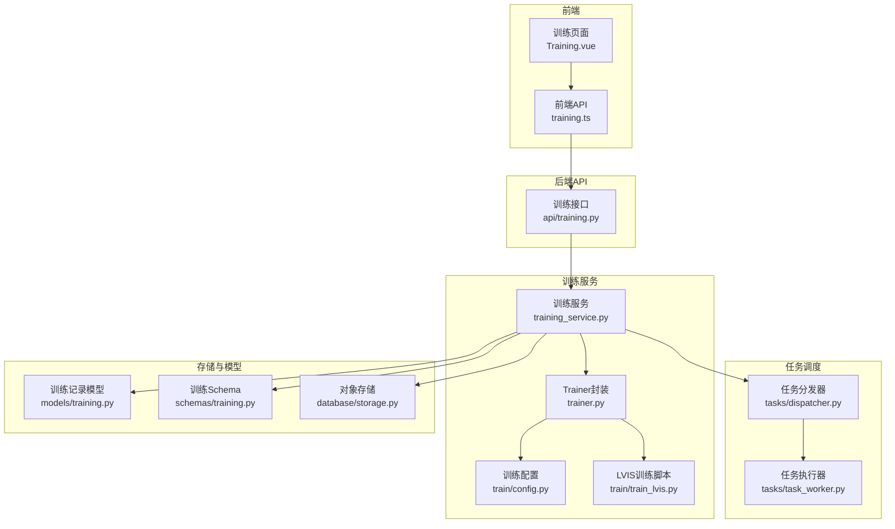
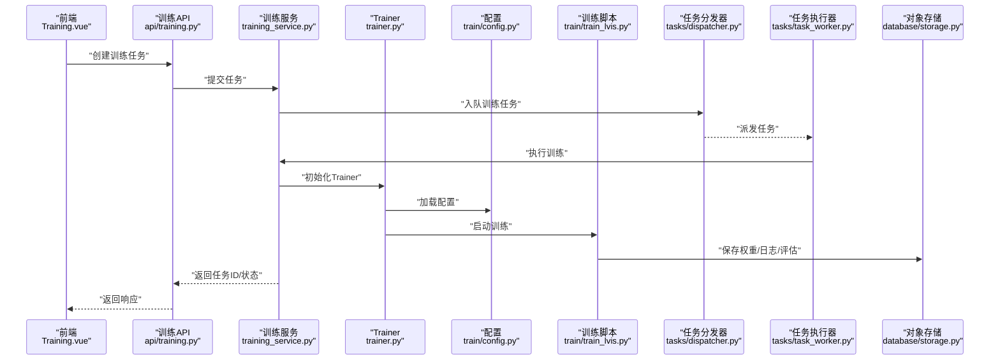
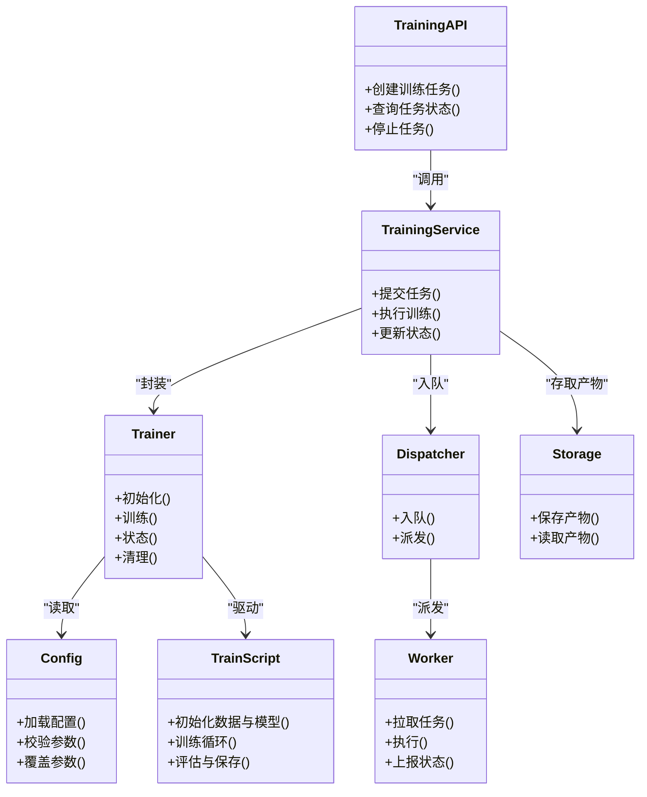

# 训练配置管理

<cite>
**本文引用的文件**   
- [backend/app/services/train/config.py](file://backend/app/services/train/config.py)
- [backend/app/services/train/train_lvis.py](file://backend/app/services/train/train_lvis.py)
- [backend/app/services/trainer.py](file://backend/app/services/trainer.py)
- [backend/app/services/training_service.py](file://backend/app/services/training_service.py)
- [backend/app/api/training.py](file://backend/app/api/training.py)
- [backend/app/models/training.py](file://backend/app/models/training.py)
- [backend/app/schemas/training.py](file://backend/app/schemas/training.py)
- [backend/app/tasks/dispatcher.py](file://backend/app/tasks/dispatcher.py)
- [backend/app/tasks/task_worker.py](file://backend/app/tasks/task_worker.py)
- [backend/app/database/storage.py](file://backend/app/database/storage.py)
- [frontend/src/api/training.ts](file://frontend/src/api/training.ts)
- [frontend/src/views/Training.vue](file://frontend/src/views/Training.vue)
</cite>

## 目录
1. [简介](#简介)
2. [项目结构](#项目结构)
3. [核心组件](#核心组件)
4. [架构总览](#架构总览)
5. [详细组件分析](#详细组件分析)
6. [依赖关系分析](#依赖关系分析)
7. [性能考虑](#性能考虑)
8. [故障排查指南](#故障排查指南)
9. [结论](#结论)
10. [附录](#附录)

## 简介
本文件面向“训练配置管理”，围绕训练参数、模型架构、损失函数与评估指标的配置，提供从后端服务到前端界面的端到端说明。文档涵盖：
- 学习率、批次大小、迭代次数、优化器等训练参数的配置项与默认值来源
- 模型架构配置、损失函数选择与评估指标定义
- 不同训练场景（微调、从头训练、迁移学习）的配置模板与使用建议
- 超参数调优策略（网格搜索、贝叶斯优化）的集成方式
- 配置文件版本管理与环境隔离机制

## 项目结构
训练相关代码主要分布在以下模块：
- 训练配置与脚本：services/train/*
- 训练任务编排：services/training_service.py、services/trainer.py
- API 层：api/training.py
- 数据持久化：models/training.py、schemas/training.py、database/storage.py
- 异步任务调度：tasks/dispatcher.py、tasks/task_worker.py
- 前端交互：frontend/src/api/training.ts、frontend/src/views/Training.vue

图表来源
- [backend/app/api/training.py](file://backend/app/api/training.py)
- [backend/app/services/training_service.py](file://backend/app/services/training_service.py)
- [backend/app/services/trainer.py](file://backend/app/services/trainer.py)
- [backend/app/services/train/config.py](file://backend/app/services/train/config.py)
- [backend/app/services/train/train_lvis.py](file://backend/app/services/train/train_lvis.py)
- [backend/app/models/training.py](file://backend/app/models/training.py)
- [backend/app/schemas/training.py](file://backend/app/schemas/training.py)
- [backend/app/database/storage.py](file://backend/app/database/storage.py)
- [backend/app/tasks/dispatcher.py](file://backend/app/tasks/dispatcher.py)
- [backend/app/tasks/task_worker.py](file://backend/app/tasks/task_worker.py)
- [frontend/src/api/training.ts](file://frontend/src/api/training.ts)
- [frontend/src/views/Training.vue](file://frontend/src/views/Training.vue)

章节来源
- [backend/app/services/train/config.py](file://backend/app/services/train/config.py)
- [backend/app/services/train/train_lvis.py](file://backend/app/services/train/train_lvis.py)
- [backend/app/services/trainer.py](file://backend/app/services/trainer.py)
- [backend/app/services/training_service.py](file://backend/app/services/training_service.py)
- [backend/app/api/training.py](file://backend/app/api/training.py)
- [backend/app/models/training.py](file://backend/app/models/training.py)
- [backend/app/schemas/training.py](file://backend/app/schemas/training.py)
- [backend/app/tasks/dispatcher.py](file://backend/app/tasks/dispatcher.py)
- [backend/app/tasks/task_worker.py](file://backend/app/tasks/task_worker.py)
- [backend/app/database/storage.py](file://backend/app/database/storage.py)
- [frontend/src/api/training.ts](file://frontend/src/api/training.ts)
- [frontend/src/views/Training.vue](file://frontend/src/views/Training.vue)

## 核心组件
- 训练配置（config.py）
  - 负责加载与合并训练参数，包括学习率、批次大小、迭代次数、优化器、模型路径等
  - 支持多来源配置（默认值、环境变量、配置文件），并提供校验与回退逻辑
- 训练入口（train_lvis.py）
  - 基于配置初始化数据集、模型、优化器与训练循环
  - 输出日志、检查点与评估结果
- Trainer封装（trainer.py）
  - 将训练流程封装为可复用的类，暴露统一的启动、暂停、恢复接口
  - 内部调用配置与训练脚本，并处理异常与状态上报
- 训练服务（training_service.py）
  - 对外提供创建、查询、停止训练任务的API适配
  - 与任务调度器协作，实现异步执行与进度跟踪
- API层（api/training.py）
  - 暴露REST接口，接收前端请求，调用训练服务
- 任务调度（dispatcher.py、task_worker.py）
  - 将训练任务放入队列，由工作进程执行，避免阻塞主服务
- 存储与模型（models/training.py、schemas/training.py、storage.py）
  - 持久化训练任务元数据、运行状态与产物位置
  - 通过对象存储保存模型权重、日志与评估报告

章节来源
- [backend/app/services/train/config.py](file://backend/app/services/train/config.py)
- [backend/app/services/train/train_lvis.py](file://backend/app/services/train/train_lvis.py)
- [backend/app/services/trainer.py](file://backend/app/services/trainer.py)
- [backend/app/services/training_service.py](file://backend/app/services/training_service.py)
- [backend/app/api/training.py](file://backend/app/api/training.py)
- [backend/app/tasks/dispatcher.py](file://backend/app/tasks/dispatcher.py)
- [backend/app/tasks/task_worker.py](file://backend/app/tasks/task_worker.py)
- [backend/app/models/training.py](file://backend/app/models/training.py)
- [backend/app/schemas/training.py](file://backend/app/schemas/training.py)
- [backend/app/database/storage.py](file://backend/app/database/storage.py)

## 架构总览
下图展示了从前端发起训练到后端执行、落盘产物的完整链路。

图表来源
- [backend/app/api/training.py](file://backend/app/api/training.py)
- [backend/app/services/training_service.py](file://backend/app/services/training_service.py)
- [backend/app/services/trainer.py](file://backend/app/services/trainer.py)
- [backend/app/services/train/config.py](file://backend/app/services/train/config.py)
- [backend/app/services/train/train_lvis.py](file://backend/app/services/train/train_lvis.py)
- [backend/app/tasks/dispatcher.py](file://backend/app/tasks/dispatcher.py)
- [backend/app/tasks/task_worker.py](file://backend/app/tasks/task_worker.py)
- [backend/app/database/storage.py](file://backend/app/database/storage.py)
- [frontend/src/views/Training.vue](file://frontend/src/views/Training.vue)

## 详细组件分析

### 训练配置（config.py）
- 功能要点
  - 提供统一配置入口，聚合默认值、环境变量与外部配置文件
  - 对关键训练参数进行类型校验与范围约束
  - 支持按场景切换（如微调、从头训练、迁移学习）的参数覆盖
- 关键参数类别
  - 学习率：基础学习率、衰减策略、预热步数
  - 批次大小：训练批次、验证批次
  - 迭代次数：最大迭代步数、早停条件
  - 优化器：优化器类型、权重衰减、动量等
  - 模型与数据：预训练权重路径、数据根目录、增强策略
  - 输出与日志：检查点目录、日志级别、评估频率
- 配置优先级
  - 外部配置文件 > 环境变量 > 默认值
- 扩展建议
  - 新增参数时同步更新校验逻辑与文档
  - 为不同场景提供独立配置片段，便于组合与复用

章节来源
- [backend/app/services/train/config.py](file://backend/app/services/train/config.py)

### 训练脚本（train_lvis.py）
- 功能要点
  - 读取配置，构建数据集与模型实例
  - 初始化优化器与学习率调度器
  - 执行训练循环，定期评估并保存检查点
  - 输出结构化日志与评估指标
- 关键流程
  - 初始化阶段：解析配置、准备数据、加载权重
  - 训练阶段：前向传播、计算损失、反向传播、更新参数
  - 评估阶段：在验证集上计算指标，写入日志与存储
  - 收尾阶段：保存最终权重、生成摘要报告
- 错误处理
  - 捕获常见异常（如OOM、IO错误），记录上下文并安全退出
  - 支持断点续训：从最近检查点恢复

章节来源
- [backend/app/services/train/train_lvis.py](file://backend/app/services/train/train_lvis.py)

### Trainer封装（trainer.py）
- 设计目标
  - 将训练流程抽象为可复用的类，屏蔽底层细节
  - 提供一致的启动、暂停、恢复、状态查询接口
- 核心方法
  - 初始化：加载配置、准备资源
  - 训练：驱动训练脚本或内部循环
  - 状态：获取当前进度、指标、错误信息
  - 清理：释放资源、归档产物
- 与配置的关系
  - 通过配置对象注入所有可调参数
  - 根据场景模式动态调整行为（如是否冻结部分层）

章节来源
- [backend/app/services/trainer.py](file://backend/app/services/trainer.py)

### 训练服务（training_service.py）
- 职责
  - 协调API与Trainer之间的交互
  - 管理训练任务生命周期（创建、运行、停止、删除）
  - 与任务调度器协作，实现异步执行
- 关键能力
  - 任务创建：校验输入、生成任务ID、持久化元数据
  - 任务执行：入队、监听执行状态、更新数据库
  - 产物管理：记录权重、日志、评估结果的位置
- 与存储的集成
  - 通过对象存储服务保存与检索训练产物

章节来源
- [backend/app/services/training_service.py](file://backend/app/services/training_service.py)
- [backend/app/database/storage.py](file://backend/app/database/storage.py)

### API层（api/training.py）
- 暴露接口
  - 创建训练任务、查询任务状态、停止任务、列出历史任务
- 输入校验
  - 使用Schema对请求体进行严格校验
- 响应格式
  - 统一返回结构与错误码，便于前端处理

章节来源
- [backend/app/api/training.py](file://backend/app/api/training.py)
- [backend/app/schemas/training.py](file://backend/app/schemas/training.py)

### 任务调度（dispatcher.py、task_worker.py）
- 分发器
  - 维护任务队列，按策略分配给可用工作进程
- 执行器
  - 拉取任务、调用训练服务、上报状态与结果
- 可靠性
  - 失败重试、超时控制、健康检查

章节来源
- [backend/app/tasks/dispatcher.py](file://backend/app/tasks/dispatcher.py)
- [backend/app/tasks/task_worker.py](file://backend/app/tasks/task_worker.py)

### 前端交互（training.ts、Training.vue）
- API封装
  - 提供创建、查询、停止训练的便捷方法
- 界面展示
  - 显示任务列表、实时进度、指标曲线与下载链接
- 错误提示
  - 友好地展示后端返回的错误信息与重试建议

章节来源
- [frontend/src/api/training.ts](file://frontend/src/api/training.ts)
- [frontend/src/views/Training.vue](file://frontend/src/views/Training.vue)

## 依赖关系分析
- 组件耦合
  - API层依赖训练服务；训练服务依赖Trainer与任务调度器；Trainer依赖配置与训练脚本
- 外部依赖
  - 对象存储用于持久化训练产物
  - 任务队列用于异步执行
- 潜在风险
  - 配置变更需同步更新校验与文档
  - 任务调度器与工作进程需保持版本一致

图表来源
- [backend/app/api/training.py](file://backend/app/api/training.py)
- [backend/app/services/training_service.py](file://backend/app/services/training_service.py)
- [backend/app/services/trainer.py](file://backend/app/services/trainer.py)
- [backend/app/services/train/config.py](file://backend/app/services/train/config.py)
- [backend/app/services/train/train_lvis.py](file://backend/app/services/train/train_lvis.py)
- [backend/app/tasks/dispatcher.py](file://backend/app/tasks/dispatcher.py)
- [backend/app/tasks/task_worker.py](file://backend/app/tasks/task_worker.py)
- [backend/app/database/storage.py](file://backend/app/database/storage.py)

## 性能考虑
- 批大小与显存
  - 增大批次可提高吞吐，但需关注显存占用；建议使用梯度累积模拟大批次
- 学习率与收敛
  - 合理设置预热与衰减策略，避免初期震荡与后期停滞
- I/O瓶颈
  - 数据预处理与增强应并行化；使用缓存减少重复计算
- 检查点与恢复
  - 频繁保存小检查点有助于快速恢复，但会增加I/O开销
- 监控与告警
  - 记录GPU利用率、内存峰值、训练耗时，设置阈值告警

[本节为通用指导，不直接分析具体文件]

## 故障排查指南
- 常见问题
  - 配置错误：参数缺失或类型不符，导致初始化失败
  - 数据路径错误：找不到数据集或权重文件
  - 显存不足：批次过大或模型过深
  - 任务卡住：队列堆积或工作进程崩溃
- 定位步骤
  - 查看训练日志与错误堆栈
  - 检查对象存储中是否存在检查点与评估结果
  - 确认任务调度器与工作进程状态
- 恢复策略
  - 从最近检查点恢复训练
  - 降低批次大小或启用混合精度
  - 重启工作进程并重新入队任务

章节来源
- [backend/app/services/train/train_lvis.py](file://backend/app/services/train/train_lvis.py)
- [backend/app/services/trainer.py](file://backend/app/services/trainer.py)
- [backend/app/tasks/dispatcher.py](file://backend/app/tasks/dispatcher.py)
- [backend/app/tasks/task_worker.py](file://backend/app/tasks/task_worker.py)
- [backend/app/database/storage.py](file://backend/app/database/storage.py)

## 结论
本训练配置管理体系以配置为中心，结合Trainer封装与任务调度，实现了灵活、可扩展的训练流程。通过分层设计与清晰的职责划分，系统能够支撑多种训练场景与超参数调优需求。建议在后续迭代中完善配置版本管理与自动化调优集成，进一步提升工程化水平。

[本节为总结性内容，不直接分析具体文件]

## 附录

### 训练场景配置模板
- 微调
  - 重点：加载预训练权重、较小学习率、较短迭代次数
  - 适用：已有较强基座模型，仅需适配新领域
- 从头训练
  - 重点：较大学习率、较长迭代次数、强数据增强
  - 适用：无合适预训练模型或需要完全自定义
- 迁移学习
  - 重点：冻结部分层、逐步解冻、中等学习率
  - 适用：利用源域知识加速目标域收敛

[本节为概念性模板说明，不直接分析具体文件]

### 超参数调优策略
- 网格搜索
  - 遍历预设参数组合，适合小规模空间
  - 优点：简单直观；缺点：组合爆炸
- 贝叶斯优化
  - 基于概率模型高效探索参数空间
  - 优点：样本效率高；缺点：实现复杂
- 集成方式
  - 在训练服务中增加“调优任务”类型
  - 调度器批量派发子任务，收集结果并更新搜索策略
  - 将最佳配置自动落库并生成推荐报告

[本节为概念性策略说明，不直接分析具体文件]

### 配置文件版本管理与环境隔离
- 版本管理
  - 为每个训练任务绑定配置快照（含哈希），确保可重现
  - 支持配置差异对比与回滚
- 环境隔离
  - 使用容器或虚拟环境隔离依赖
  - 通过环境变量区分开发、测试、生产配置
  - 对象存储按任务ID组织产物，避免污染

[本节为概念性机制说明，不直接分析具体文件]