# AI代理接口

<cite>
**本文引用的文件**   
- [backend/app/api/agent.py](file://backend/app/api/agent.py)
- [backend/app/services/agent/supervisor.py](file://backend/app/services/agent/supervisor.py)
- [backend/app/services/agent/chat_agent.py](file://backend/app/services/agent/chat_agent.py)
- [backend/app/services/agent/detection_agent.py](file://backend/app/services/agent/detection_agent.py)
- [backend/app/services/agent/face_agent.py](file://backend/app/services/agent/face_agent.py)
- [backend/app/services/agent/llm_agent.py](file://backend/app/services/agent/llm_agent.py)
- [backend/app/services/agent/metadata_agent.py](file://backend/app/services/agent/metadata_agent.py)
- [backend/app/services/agent/search_agent.py](file://backend/app/services/agent/search_agent.py)
- [backend/app/models/agent.py](file://backend/app/models/agent.py)
- [backend/app/schemas/agent.py](file://backend/app/schemas/agent.py)
- [backend/app/tasks/dispatcher.py](file://backend/app/tasks/dispatcher.py)
- [backend/app/tasks/task_worker.py](file://backend/app/tasks/task_worker.py)
- [backend/app/tasks/scheduler.py](file://backend/app/tasks/scheduler.py)
- [backend/app/database/storage.py](file://backend/app/database/storage.py)
- [backend/app/core/logger.py](file://backend/app/core/logger.py)
- [backend/app/core/exceptions.py](file://backend/app/core/exceptions.py)
- [backend/main.py](file://backend/main.py)
</cite>

## 目录
1. [简介](#简介)
2. [项目结构](#项目结构)
3. [核心组件](#核心组件)
4. [架构总览](#架构总览)
5. [详细组件分析](#详细组件分析)
6. [依赖关系分析](#依赖关系分析)
7. [性能考量](#性能考量)
8. [故障排查指南](#故障排查指南)
9. [结论](#结论)
10. [附录](#附录)

## 简介
本文件面向开发者，提供基于FastAPI的AI代理接口开发指南。内容覆盖多Agent协作、自然语言对话、智能决策、消息路由与上下文管理、多模态输入处理、对话状态维护与记忆机制、Agent通信协议、任务分发策略、结果聚合机制、生命周期管理、负载均衡与容错处理等关键主题。文档以仓库现有实现为依据，结合可视化图表帮助理解系统结构与数据流。

## 项目结构
后端采用分层架构：API层暴露REST接口；服务层封装业务逻辑与Agent编排；模型与Schema定义数据契约；任务层负责异步调度与执行；数据库与存储提供持久化能力；核心模块提供日志、异常与安全等横切关注点。

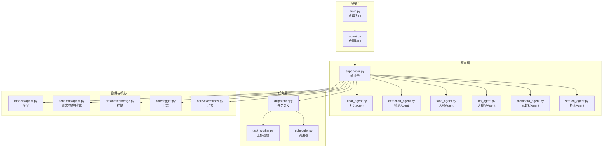

图示来源
- [backend/main.py](file://backend/main.py)
- [backend/app/api/agent.py](file://backend/app/api/agent.py)
- [backend/app/services/agent/supervisor.py](file://backend/app/services/agent/supervisor.py)
- [backend/app/tasks/dispatcher.py](file://backend/app/tasks/dispatcher.py)
- [backend/app/tasks/task_worker.py](file://backend/app/tasks/task_worker.py)
- [backend/app/tasks/scheduler.py](file://backend/app/tasks/scheduler.py)
- [backend/app/models/agent.py](file://backend/app/models/agent.py)
- [backend/app/schemas/agent.py](file://backend/app/schemas/agent.py)
- [backend/app/database/storage.py](file://backend/app/database/storage.py)
- [backend/app/core/logger.py](file://backend/app/core/logger.py)
- [backend/app/core/exceptions.py](file://backend/app/core/exceptions.py)

章节来源
- [backend/main.py](file://backend/main.py)
- [backend/app/api/agent.py](file://backend/app/api/agent.py)
- [backend/app/services/agent/supervisor.py](file://backend/app/services/agent/supervisor.py)
- [backend/app/tasks/dispatcher.py](file://backend/app/tasks/dispatcher.py)
- [backend/app/tasks/task_worker.py](file://backend/app/tasks/task_worker.py)
- [backend/app/tasks/scheduler.py](file://backend/app/tasks/scheduler.py)
- [backend/app/models/agent.py](file://backend/app/models/agent.py)
- [backend/app/schemas/agent.py](file://backend/app/schemas/agent.py)
- [backend/app/database/storage.py](file://backend/app/database/storage.py)
- [backend/app/core/logger.py](file://backend/app/core/logger.py)
- [backend/app/core/exceptions.py](file://backend/app/core/exceptions.py)

## 核心组件
- API接口层：提供REST端点，接收用户请求并委托给编排器进行任务规划与执行。
- 编排器（Supervisor）：解析意图、选择子Agent、组织上下文、协调任务分发与结果聚合。
- 子Agent族：对话Agent、检测Agent、人脸Agent、大模型Agent、元数据Agent、检索Agent，各自专注特定领域能力。
- 任务层：统一的任务分发器与工作进程，支持异步执行与调度。
- 数据与核心：模型与Schema定义数据契约；存储提供持久化；日志与异常提供可观测性与健壮性。

章节来源
- [backend/app/api/agent.py](file://backend/app/api/agent.py)
- [backend/app/services/agent/supervisor.py](file://backend/app/services/agent/supervisor.py)
- [backend/app/services/agent/chat_agent.py](file://backend/app/services/agent/chat_agent.py)
- [backend/app/services/agent/detection_agent.py](file://backend/app/services/agent/detection_agent.py)
- [backend/app/services/agent/face_agent.py](file://backend/app/services/agent/face_agent.py)
- [backend/app/services/agent/llm_agent.py](file://backend/app/services/agent/llm_agent.py)
- [backend/app/services/agent/metadata_agent.py](file://backend/app/services/agent/metadata_agent.py)
- [backend/app/services/agent/search_agent.py](file://backend/app/services/agent/search_agent.py)
- [backend/app/tasks/dispatcher.py](file://backend/app/tasks/dispatcher.py)
- [backend/app/tasks/task_worker.py](file://backend/app/tasks/task_worker.py)
- [backend/app/tasks/scheduler.py](file://backend/app/tasks/scheduler.py)
- [backend/app/models/agent.py](file://backend/app/models/agent.py)
- [backend/app/schemas/agent.py](file://backend/app/schemas/agent.py)
- [backend/app/database/storage.py](file://backend/app/database/storage.py)
- [backend/app/core/logger.py](file://backend/app/core/logger.py)
- [backend/app/core/exceptions.py](file://backend/app/core/exceptions.py)

## 架构总览
整体流程：客户端通过API提交包含文本、图片等多模态输入的对话或任务请求；API层校验并转发至编排器；编排器根据意图选择并调用相应Agent；必要时将子任务投递到任务层异步执行；最终聚合各Agent输出，返回结构化结果。

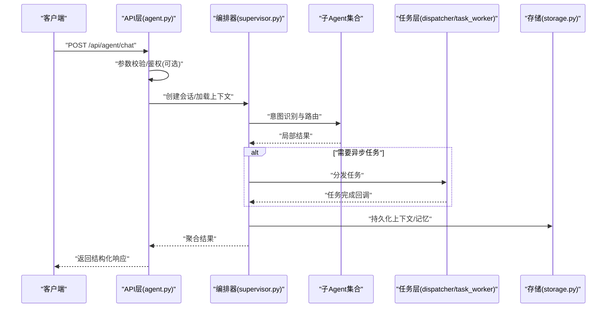

图示来源
- [backend/app/api/agent.py](file://backend/app/api/agent.py)
- [backend/app/services/agent/supervisor.py](file://backend/app/services/agent/supervisor.py)
- [backend/app/tasks/dispatcher.py](file://backend/app/tasks/dispatcher.py)
- [backend/app/tasks/task_worker.py](file://backend/app/tasks/task_worker.py)
- [backend/app/database/storage.py](file://backend/app/database/storage.py)

## 详细组件分析

### 编排器（Supervisor）
职责：
- 意图识别与路由：根据输入内容与历史上下文，决定调用哪些子Agent。
- 上下文管理：维护会话ID、消息历史、记忆摘要与中间状态。
- 任务编排：串行/并行调用子Agent，必要时通过任务层异步执行耗时操作。
- 结果聚合：合并多Agent输出，生成统一的结构化响应。

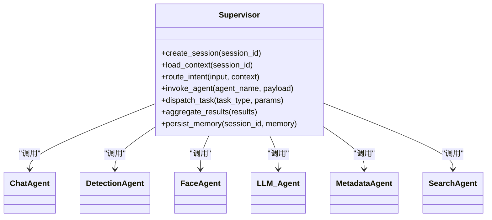

图示来源
- [backend/app/services/agent/supervisor.py](file://backend/app/services/agent/supervisor.py)
- [backend/app/services/agent/chat_agent.py](file://backend/app/services/agent/chat_agent.py)
- [backend/app/services/agent/detection_agent.py](file://backend/app/services/agent/detection_agent.py)
- [backend/app/services/agent/face_agent.py](file://backend/app/services/agent/face_agent.py)
- [backend/app/services/agent/llm_agent.py](file://backend/app/services/agent/llm_agent.py)
- [backend/app/services/agent/metadata_agent.py](file://backend/app/services/agent/metadata_agent.py)
- [backend/app/services/agent/search_agent.py](file://backend/app/services/agent/search_agent.py)

章节来源
- [backend/app/services/agent/supervisor.py](file://backend/app/services/agent/supervisor.py)

### 对话Agent（Chat Agent）
职责：
- 自然语言对话：维护对话轮次、意图分类、槽位填充。
- 多模态输入：支持文本与图片联合输入，提取视觉特征或描述。
- 记忆机制：短期记忆（最近N条消息）、长期记忆（摘要/向量）。

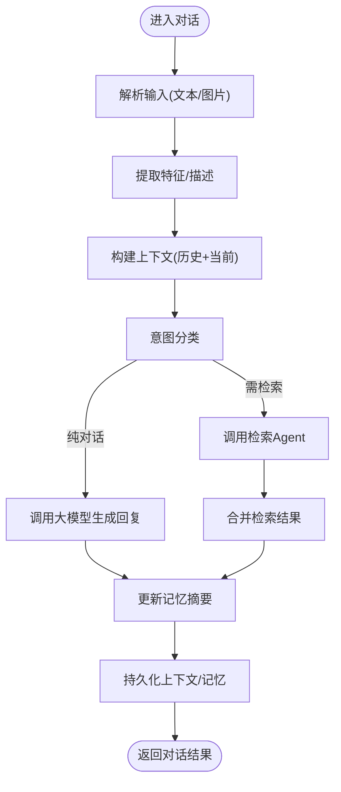

图示来源
- [backend/app/services/agent/chat_agent.py](file://backend/app/services/agent/chat_agent.py)
- [backend/app/services/agent/llm_agent.py](file://backend/app/services/agent/llm_agent.py)
- [backend/app/services/agent/search_agent.py](file://backend/app/services/agent/search_agent.py)
- [backend/app/database/storage.py](file://backend/app/database/storage.py)

章节来源
- [backend/app/services/agent/chat_agent.py](file://backend/app/services/agent/chat_agent.py)
- [backend/app/services/agent/llm_agent.py](file://backend/app/services/agent/llm_agent.py)
- [backend/app/services/agent/search_agent.py](file://backend/app/services/agent/search_agent.py)
- [backend/app/database/storage.py](file://backend/app/database/storage.py)

### 检测Agent（Detection Agent）
职责：
- 图像目标检测：对上传的图片执行检测任务，返回边界框与类别。
- 与编排器协作：在复杂任务中作为子步骤被调用。

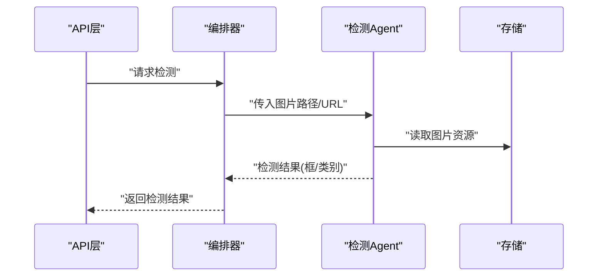

图示来源
- [backend/app/services/agent/detection_agent.py](file://backend/app/services/agent/detection_agent.py)
- [backend/app/database/storage.py](file://backend/app/database/storage.py)

章节来源
- [backend/app/services/agent/detection_agent.py](file://backend/app/services/agent/detection_agent.py)
- [backend/app/database/storage.py](file://backend/app/database/storage.py)

### 人脸Agent（Face Agent）
职责：
- 人脸检测与聚类：识别人脸、生成嵌入、进行相似度匹配与聚类。
- 与编排器协作：在相册整理、人物识别场景中参与决策。

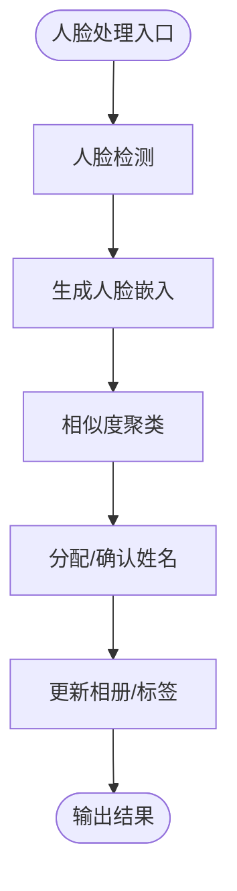

图示来源
- [backend/app/services/agent/face_agent.py](file://backend/app/services/agent/face_agent.py)

章节来源
- [backend/app/services/agent/face_agent.py](file://backend/app/services/agent/face_agent.py)

### 大模型Agent（LLM Agent）
职责：
- 通用推理与生成：为对话、总结、改写等任务提供生成能力。
- 工具调用：与其他Agent协同，形成“思考-行动”闭环。

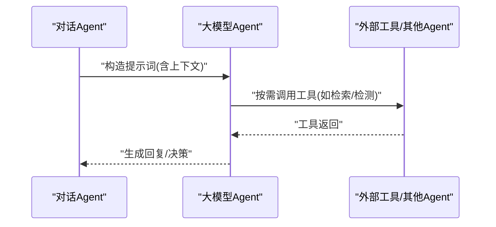

图示来源
- [backend/app/services/agent/llm_agent.py](file://backend/app/services/agent/llm_agent.py)
- [backend/app/services/agent/chat_agent.py](file://backend/app/services/agent/chat_agent.py)

章节来源
- [backend/app/services/agent/llm_agent.py](file://backend/app/services/agent/llm_agent.py)
- [backend/app/services/agent/chat_agent.py](file://backend/app/services/agent/chat_agent.py)

### 元数据Agent（Metadata Agent）
职责：
- 读取与标准化媒体元数据（EXIF、拍摄时间地点等）。
- 为检索与展示提供结构化字段。

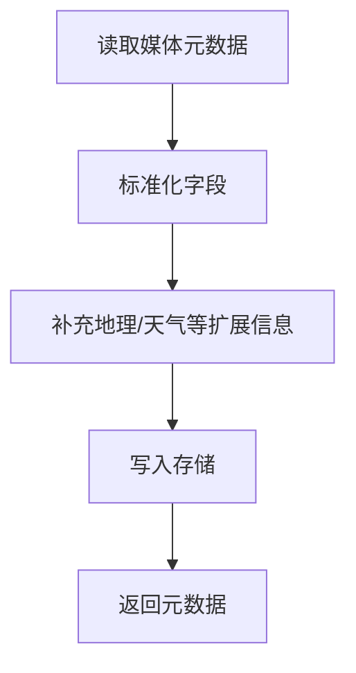

图示来源
- [backend/app/services/agent/metadata_agent.py](file://backend/app/services/agent/metadata_agent.py)
- [backend/app/database/storage.py](file://backend/app/database/storage.py)

章节来源
- [backend/app/services/agent/metadata_agent.py](file://backend/app/services/agent/metadata_agent.py)
- [backend/app/database/storage.py](file://backend/app/database/storage.py)

### 检索Agent（Search Agent）
职责：
- 文本/向量检索：结合关键词与语义向量进行混合检索。
- 与对话Agent协作：为问答与推荐提供证据与素材。

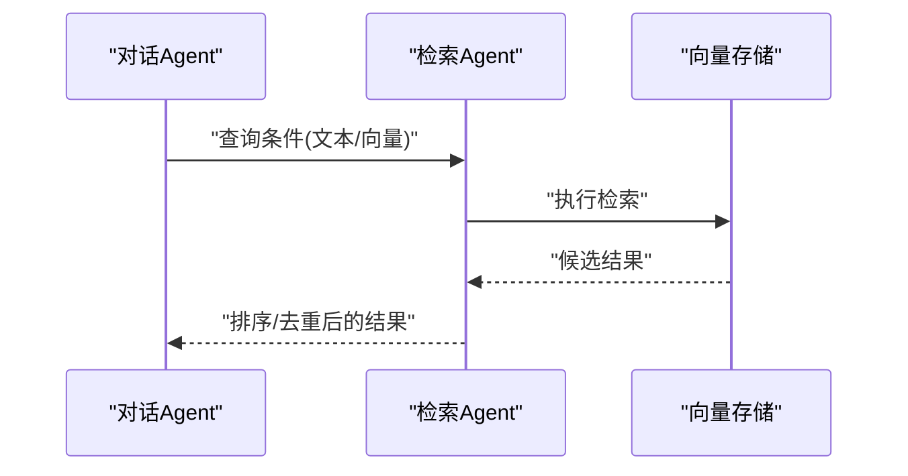

图示来源
- [backend/app/services/agent/search_agent.py](file://backend/app/services/agent/search_agent.py)

章节来源
- [backend/app/services/agent/search_agent.py](file://backend/app/services/agent/search_agent.py)

### 任务分发与执行（Dispatcher & Worker）
职责：
- 任务分发：将耗时任务（如批量检测、聚类）投递到工作进程。
- 工作进程：执行具体任务并回写结果。
- 调度器：定时或事件驱动触发任务。

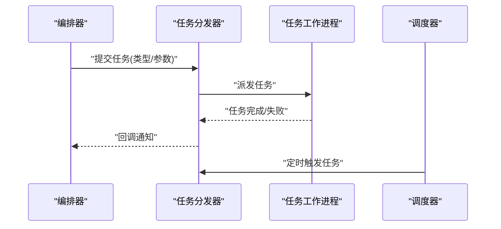

图示来源
- [backend/app/tasks/dispatcher.py](file://backend/app/tasks/dispatcher.py)
- [backend/app/tasks/task_worker.py](file://backend/app/tasks/task_worker.py)
- [backend/app/tasks/scheduler.py](file://backend/app/tasks/scheduler.py)

章节来源
- [backend/app/tasks/dispatcher.py](file://backend/app/tasks/dispatcher.py)
- [backend/app/tasks/task_worker.py](file://backend/app/tasks/task_worker.py)
- [backend/app/tasks/scheduler.py](file://backend/app/tasks/scheduler.py)

### 数据模型与Schema
- 模型：定义Agent相关实体（如会话、任务、记忆条目等）。
- Schema：定义API请求与响应的数据结构，确保前后端契约一致。

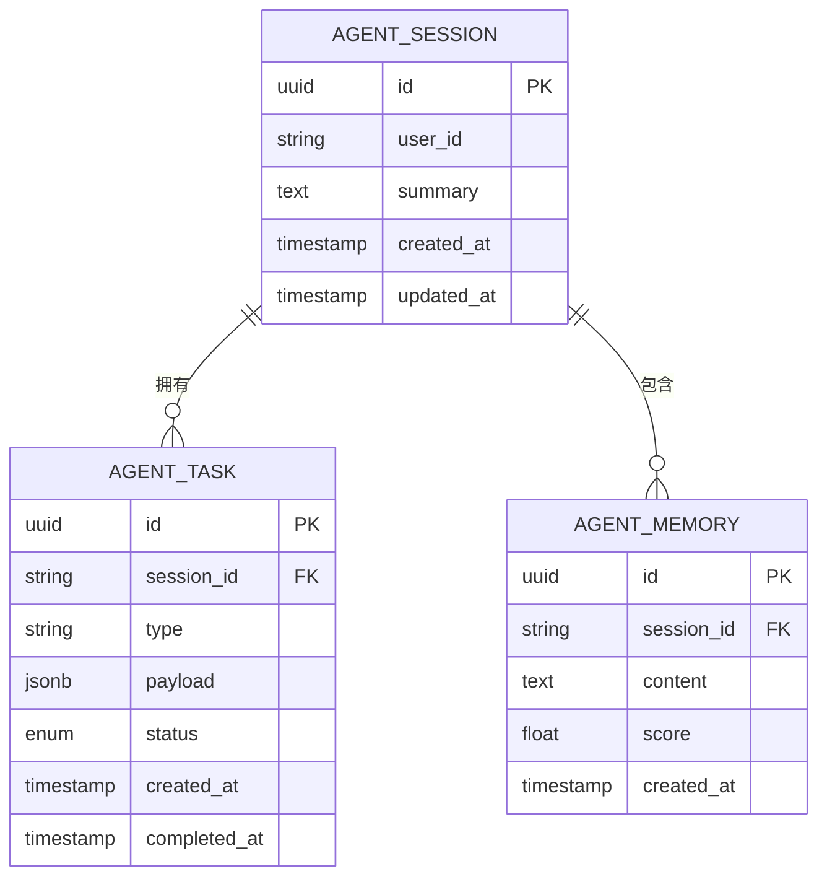

图示来源
- [backend/app/models/agent.py](file://backend/app/models/agent.py)
- [backend/app/schemas/agent.py](file://backend/app/schemas/agent.py)

章节来源
- [backend/app/models/agent.py](file://backend/app/models/agent.py)
- [backend/app/schemas/agent.py](file://backend/app/schemas/agent.py)

## 依赖关系分析
- 耦合度：编排器与各子Agent松耦合，通过统一接口调用；任务层与编排器解耦，通过消息传递。
- 内聚性：每个Agent聚焦单一职责，便于测试与替换。
- 外部依赖：存储、日志、异常处理为核心支撑。

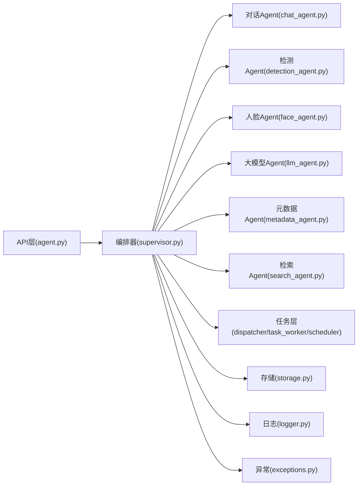

图示来源
- [backend/app/api/agent.py](file://backend/app/api/agent.py)
- [backend/app/services/agent/supervisor.py](file://backend/app/services/agent/supervisor.py)
- [backend/app/services/agent/chat_agent.py](file://backend/app/services/agent/chat_agent.py)
- [backend/app/services/agent/detection_agent.py](file://backend/app/services/agent/detection_agent.py)
- [backend/app/services/agent/face_agent.py](file://backend/app/services/agent/face_agent.py)
- [backend/app/services/agent/llm_agent.py](file://backend/app/services/agent/llm_agent.py)
- [backend/app/services/agent/metadata_agent.py](file://backend/app/services/agent/metadata_agent.py)
- [backend/app/services/agent/search_agent.py](file://backend/app/services/agent/search_agent.py)
- [backend/app/tasks/dispatcher.py](file://backend/app/tasks/dispatcher.py)
- [backend/app/tasks/task_worker.py](file://backend/app/tasks/task_worker.py)
- [backend/app/tasks/scheduler.py](file://backend/app/tasks/scheduler.py)
- [backend/app/database/storage.py](file://backend/app/database/storage.py)
- [backend/app/core/logger.py](file://backend/app/core/logger.py)
- [backend/app/core/exceptions.py](file://backend/app/core/exceptions.py)

章节来源
- [backend/app/api/agent.py](file://backend/app/api/agent.py)
- [backend/app/services/agent/supervisor.py](file://backend/app/services/agent/supervisor.py)
- [backend/app/tasks/dispatcher.py](file://backend/app/tasks/dispatcher.py)
- [backend/app/tasks/task_worker.py](file://backend/app/tasks/task_worker.py)
- [backend/app/tasks/scheduler.py](file://backend/app/tasks/scheduler.py)
- [backend/app/database/storage.py](file://backend/app/database/storage.py)
- [backend/app/core/logger.py](file://backend/app/core/logger.py)
- [backend/app/core/exceptions.py](file://backend/app/core/exceptions.py)

## 性能考量
- 并发与异步：使用异步I/O与任务队列提升吞吐；对CPU密集型任务（检测、聚类）放入独立工作进程。
- 缓存与索引：对热点上下文与检索结果进行缓存；为向量检索建立合适索引。
- 批处理与分页：批量处理图片与长列表，避免单次请求过大。
- 资源限制：设置超时、重试与熔断，防止级联故障。
- 水平扩展：无状态编排器与服务实例横向扩展，配合负载均衡。

[本节为通用指导，不直接分析具体文件]

## 故障排查指南
- 日志定位：查看关键节点日志（API、编排器、Agent、任务层），结合会话ID追踪请求链路。
- 异常处理：捕获并记录异常类型、堆栈与上下文，便于快速复现与修复。
- 任务失败：检查任务队列积压、工作进程健康状态与错误回调。
- 存储问题：验证连接、权限与容量，关注慢查询与锁竞争。

章节来源
- [backend/app/core/logger.py](file://backend/app/core/logger.py)
- [backend/app/core/exceptions.py](file://backend/app/core/exceptions.py)
- [backend/app/tasks/dispatcher.py](file://backend/app/tasks/dispatcher.py)
- [backend/app/tasks/task_worker.py](file://backend/app/tasks/task_worker.py)
- [backend/app/database/storage.py](file://backend/app/database/storage.py)

## 结论
本指南围绕AI代理接口的架构设计与实现细节展开，从API到编排器、从子Agent到任务层，提供了完整的开发与排障参考。建议在实际工程中结合业务需求细化意图识别规则、优化记忆与检索策略，并通过监控与压测持续改进性能与稳定性。

[本节为总结性内容，不直接分析具体文件]

## 附录

### API示例（路径引用）
- 对话接口：参见 [backend/app/api/agent.py](file://backend/app/api/agent.py)
- 任务提交与查询：参见 [backend/app/tasks/dispatcher.py](file://backend/app/tasks/dispatcher.py)
- 会话与记忆持久化：参见 [backend/app/database/storage.py](file://backend/app/database/storage.py)

### 最佳实践清单
- 明确Agent职责边界，保持低耦合高内聚。
- 使用统一的Schema定义接口契约，减少前后端不一致。
- 对耗时操作采用异步任务与重试机制。
- 完善日志与异常上报，建立可观测性体系。
- 定期评估与优化检索与记忆策略，平衡准确性与性能。

[本节为通用指导，不直接分析具体文件]