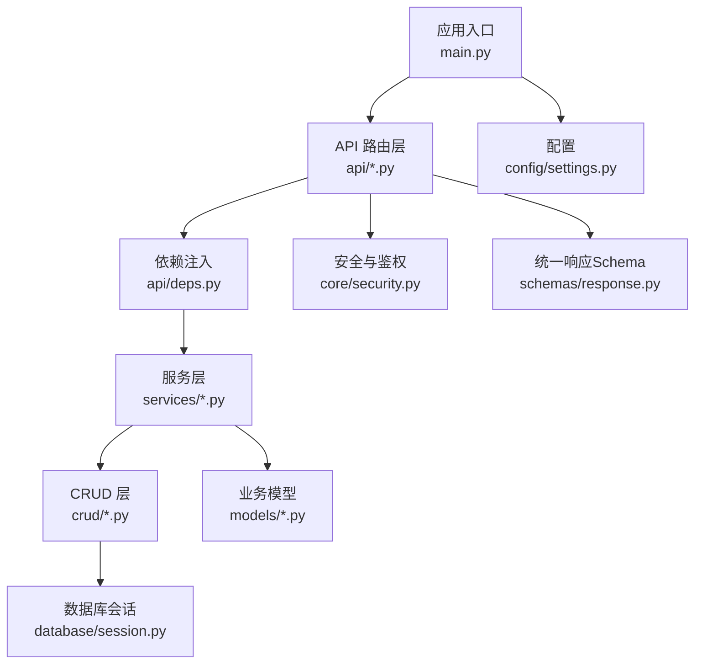
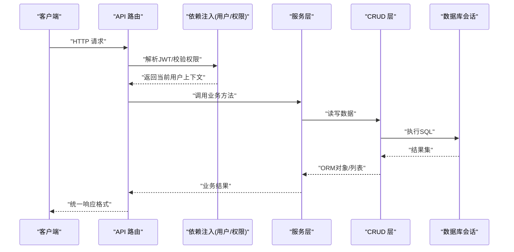
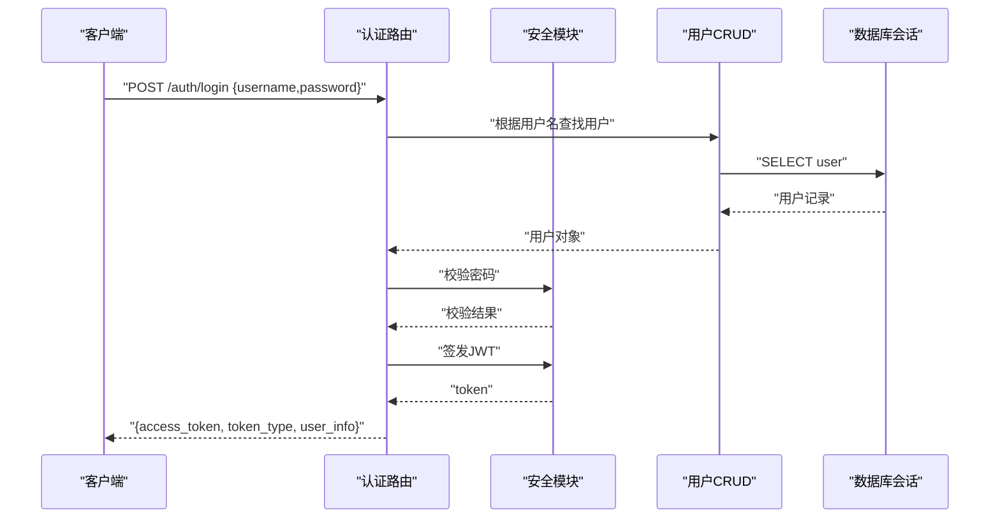
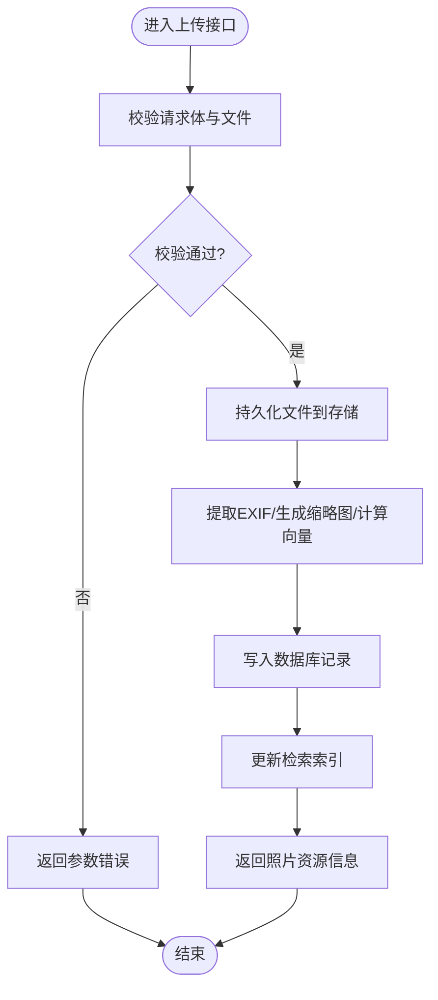
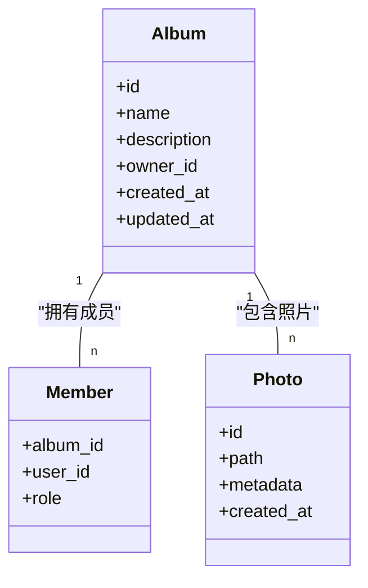
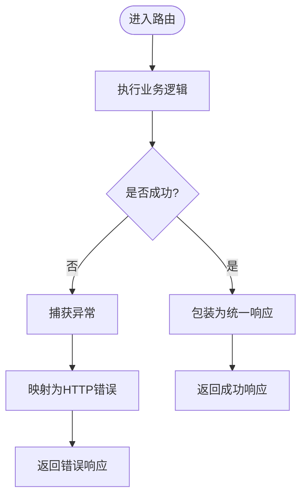
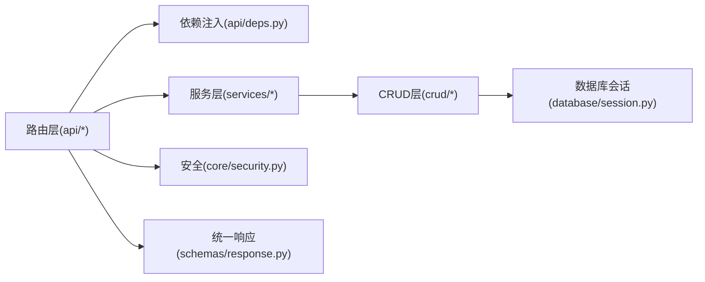

# API接口开发

<cite>
**本文引用的文件**   
- [backend/main.py](file://backend/main.py)
- [backend/app/api/auth.py](file://backend/app/api/auth.py)
- [backend/app/api/album.py](file://backend/app/api/album.py)
- [backend/app/api/photo.py](file://backend/app/api/photo.py)
- [backend/app/api/deps.py](file://backend/app/api/deps.py)
- [backend/app/core/security.py](file://backend/app/core/security.py)
- [backend/app/schemas/response.py](file://backend/app/schemas/response.py)
- [backend/app/models/user.py](file://backend/app/models/user.py)
- [backend/app/models/album.py](file://backend/app/models/album.py)
- [backend/app/models/photo.py](file://backend/app/models/photo.py)
- [backend/app/crud/user.py](file://backend/app/crud/user.py)
- [backend/app/crud/album.py](file://backend/app/crud/album.py)
- [backend/app/crud/photo.py](file://backend/app/crud/photo.py)
- [backend/app/database/session.py](file://backend/app/database/session.py)
- [backend/app/services/photo_service.py](file://backend/app/services/photo_service.py)
- [backend/app/services/album_service.py](file://backend/app/services/album_service.py)
- [backend/app/config/settings.py](file://backend/app/config/settings.py)
</cite>

## 目录
1. [简介](#简介)
2. [项目结构](#项目结构)
3. [核心组件](#核心组件)
4. [架构总览](#架构总览)
5. [详细组件分析](#详细组件分析)
6. [依赖关系分析](#依赖关系分析)
7. [性能考虑](#性能考虑)
8. [故障排查指南](#故障排查指南)
9. [结论](#结论)
10. [附录](#附录)

## 简介
本指南面向使用 FastAPI 构建 RESTful API 的开发者，结合 AI 相册后端代码库，系统阐述路由定义、请求参数验证、响应格式化与错误处理机制；并给出 JWT 认证集成、权限控制实现、中间件开发的实践方法。文档围绕用户认证、照片管理、相册操作等核心接口，提供标准化开发模式与最佳实践，同时覆盖 API 版本管理策略、文档自动生成与测试方法，帮助团队快速落地高质量 API。

## 项目结构
后端采用分层架构：入口应用 -> API 路由层 -> 依赖注入 -> 服务层 -> CRUD 层 -> 数据库会话与存储。模型与 Schema 分离，统一响应格式封装，安全与配置独立模块。

图示来源
- [backend/main.py](file://backend/main.py)
- [backend/app/api/auth.py](file://backend/app/api/auth.py)
- [backend/app/api/deps.py](file://backend/app/api/deps.py)
- [backend/app/core/security.py](file://backend/app/core/security.py)
- [backend/app/schemas/response.py](file://backend/app/schemas/response.py)
- [backend/app/database/session.py](file://backend/app/database/session.py)
- [backend/app/config/settings.py](file://backend/app/config/settings.py)

章节来源
- [backend/main.py](file://backend/main.py)
- [backend/app/api/auth.py](file://backend/app/api/auth.py)
- [backend/app/api/album.py](file://backend/app/api/album.py)
- [backend/app/api/photo.py](file://backend/app/api/photo.py)
- [backend/app/api/deps.py](file://backend/app/api/deps.py)
- [backend/app/core/security.py](file://backend/app/core/security.py)
- [backend/app/schemas/response.py](file://backend/app/schemas/response.py)
- [backend/app/models/user.py](file://backend/app/models/user.py)
- [backend/app/models/album.py](file://backend/app/models/album.py)
- [backend/app/models/photo.py](file://backend/app/models/photo.py)
- [backend/app/crud/user.py](file://backend/app/crud/user.py)
- [backend/app/crud/album.py](file://backend/app/crud/album.py)
- [backend/app/crud/photo.py](file://backend/app/crud/photo.py)
- [backend/app/database/session.py](file://backend/app/database/session.py)
- [backend/app/services/photo_service.py](file://backend/app/services/photo_service.py)
- [backend/app/services/album_service.py](file://backend/app/services/album_service.py)
- [backend/app/config/settings.py](file://backend/app/config/settings.py)

## 核心组件
- 应用入口与全局配置
  - 应用初始化、中间件注册、CORS、静态资源挂载、文档开关与路径前缀（用于版本化）在入口文件中集中配置。
  - 参考：[backend/main.py](file://backend/main.py)
- 安全与认证
  - JWT 令牌签发与校验、密码哈希、依赖注入获取当前用户与角色。
  - 参考：[backend/app/core/security.py](file://backend/app/core/security.py)、[backend/app/api/deps.py](file://backend/app/api/deps.py)
- 路由与控制器
  - 按领域划分路由模块：认证、相册、照片、任务、搜索等。
  - 参考：[backend/app/api/auth.py](file://backend/app/api/auth.py)、[backend/app/api/album.py](file://backend/app/api/album.py)、[backend/app/api/photo.py](file://backend/app/api/photo.py)
- 服务层
  - 聚合业务逻辑，协调多个 CRUD 与外部服务（如向量检索、缩略图生成）。
  - 参考：[backend/app/services/photo_service.py](file://backend/app/services/photo_service.py)、[backend/app/services/album_service.py](file://backend/app/services/album_service.py)
- CRUD 层
  - 数据访问抽象，基于 SQLAlchemy 会话执行增删改查。
  - 参考：[backend/app/crud/user.py](file://backend/app/crud/user.py)、[backend/app/crud/album.py](file://backend/app/crud/album.py)、[backend/app/crud/photo.py](file://backend/app/crud/photo.py)
- 数据模型与 Schema
  - ORM 模型定义表结构与关系；Pydantic Schema 负责请求/响应校验与序列化。
  - 参考：[backend/app/models/user.py](file://backend/app/models/user.py)、[backend/app/models/album.py](file://backend/app/models/album.py)、[backend/app/models/photo.py](file://backend/app/models/photo.py)、[backend/app/schemas/response.py](file://backend/app/schemas/response.py)
- 数据库与会话
  - 连接池、会话生命周期管理。
  - 参考：[backend/app/database/session.py](file://backend/app/database/session.py)
- 配置
  - 环境变量加载、JWT 密钥、存储路径等。
  - 参考：[backend/app/config/settings.py](file://backend/app/config/settings.py)

章节来源
- [backend/main.py](file://backend/main.py)
- [backend/app/core/security.py](file://backend/app/core/security.py)
- [backend/app/api/deps.py](file://backend/app/api/deps.py)
- [backend/app/api/auth.py](file://backend/app/api/auth.py)
- [backend/app/api/album.py](file://backend/app/api/album.py)
- [backend/app/api/photo.py](file://backend/app/api/photo.py)
- [backend/app/services/photo_service.py](file://backend/app/services/photo_service.py)
- [backend/app/services/album_service.py](file://backend/app/services/album_service.py)
- [backend/app/crud/user.py](file://backend/app/crud/user.py)
- [backend/app/crud/album.py](file://backend/app/crud/album.py)
- [backend/app/crud/photo.py](file://backend/app/crud/photo.py)
- [backend/app/models/user.py](file://backend/app/models/user.py)
- [backend/app/models/album.py](file://backend/app/models/album.py)
- [backend/app/models/photo.py](file://backend/app/models/photo.py)
- [backend/app/schemas/response.py](file://backend/app/schemas/response.py)
- [backend/app/database/session.py](file://backend/app/database/session.py)
- [backend/app/config/settings.py](file://backend/app/config/settings.py)

## 架构总览
整体遵循“路由 -> 依赖注入 -> 服务 -> CRUD -> 数据库”的分层调用链，配合统一响应包装与安全中间件，形成高内聚、低耦合的可扩展体系。

图示来源
- [backend/app/api/auth.py](file://backend/app/api/auth.py)
- [backend/app/api/deps.py](file://backend/app/api/deps.py)
- [backend/app/services/photo_service.py](file://backend/app/services/photo_service.py)
- [backend/app/crud/photo.py](file://backend/app/crud/photo.py)
- [backend/app/database/session.py](file://backend/app/database/session.py)

## 详细组件分析

### 认证与授权（JWT + 依赖注入）
- 设计要点
  - 登录接口校验用户名/密码，签发 JWT；登出接口销毁或黑名单化（可选）。
  - 通过依赖注入函数从请求头提取并校验 Token，返回当前用户对象。
  - 权限控制可通过依赖注入装饰器或守卫函数实现，例如检查用户角色或资源归属。
- 关键流程
  - 登录：接收凭据 -> 查询用户 -> 校验密码 -> 签发令牌 -> 返回令牌与用户信息。
  - 鉴权：拦截受保护路由 -> 解析 Token -> 校验签名与过期 -> 注入用户上下文。
- 参考实现位置
  - 认证路由：[backend/app/api/auth.py](file://backend/app/api/auth.py)
  - 依赖注入与权限：[backend/app/api/deps.py](file://backend/app/api/deps.py)
  - 安全工具（JWT/密码哈希）：[backend/app/core/security.py](file://backend/app/core/security.py)
  - 用户模型：[backend/app/models/user.py](file://backend/app/models/user.py)

图示来源
- [backend/app/api/auth.py](file://backend/app/api/auth.py)
- [backend/app/core/security.py](file://backend/app/core/security.py)
- [backend/app/crud/user.py](file://backend/app/crud/user.py)
- [backend/app/database/session.py](file://backend/app/database/session.py)

章节来源
- [backend/app/api/auth.py](file://backend/app/api/auth.py)
- [backend/app/api/deps.py](file://backend/app/api/deps.py)
- [backend/app/core/security.py](file://backend/app/core/security.py)
- [backend/app/models/user.py](file://backend/app/models/user.py)
- [backend/app/crud/user.py](file://backend/app/crud/user.py)
- [backend/app/database/session.py](file://backend/app/database/session.py)

### 照片管理接口（上传、元数据、缩略图、删除）
- 设计要点
  - 上传：支持 multipart/form-data，限制文件大小与类型，落盘后写入元数据与索引。
  - 查询：分页、过滤（时间、标签、地点）、排序。
  - 缩略图：按需生成或预生成，缓存命中优先。
  - 删除：软删除至回收站或物理删除（可配置）。
- 关键流程
  - 上传：接收文件 -> 校验 -> 持久化 -> 生成缩略图/向量 -> 更新索引 -> 返回资源信息。
  - 查询：解析查询参数 -> 构建条件 -> 分页 -> 组装响应。
- 参考实现位置
  - 照片路由：[backend/app/api/photo.py](file://backend/app/api/photo.py)
  - 照片服务：[backend/app/services/photo_service.py](file://backend/app/services/photo_service.py)
  - 照片CRUD：[backend/app/crud/photo.py](file://backend/app/crud/photo.py)
  - 照片模型：[backend/app/models/photo.py](file://backend/app/models/photo.py)

图示来源
- [backend/app/api/photo.py](file://backend/app/api/photo.py)
- [backend/app/services/photo_service.py](file://backend/app/services/photo_service.py)
- [backend/app/crud/photo.py](file://backend/app/crud/photo.py)
- [backend/app/models/photo.py](file://backend/app/models/photo.py)

章节来源
- [backend/app/api/photo.py](file://backend/app/api/photo.py)
- [backend/app/services/photo_service.py](file://backend/app/services/photo_service.py)
- [backend/app/crud/photo.py](file://backend/app/crud/photo.py)
- [backend/app/models/photo.py](file://backend/app/models/photo.py)

### 相册操作接口（创建、成员、批量关联照片）
- 设计要点
  - 创建相册：名称、描述、可见性、封面图。
  - 成员管理：添加/移除成员、设置角色（所有者、编辑者、查看者）。
  - 批量关联：将多张照片加入相册，去重与幂等处理。
- 关键流程
  - 创建：校验输入 -> 创建相册 -> 设置所有者 -> 返回详情。
  - 成员：校验权限 -> 更新成员表 -> 返回成员列表。
  - 批量关联：事务包裹 -> 插入关联记录 -> 失败回滚。
- 参考实现位置
  - 相册路由：[backend/app/api/album.py](file://backend/app/api/album.py)
  - 相册服务：[backend/app/services/album_service.py](file://backend/app/services/album_service.py)
  - 相册CRUD：[backend/app/crud/album.py](file://backend/app/crud/album.py)
  - 相册模型：[backend/app/models/album.py](file://backend/app/models/album.py)

图示来源
- [backend/app/models/album.py](file://backend/app/models/album.py)
- [backend/app/models/photo.py](file://backend/app/models/photo.py)

章节来源
- [backend/app/api/album.py](file://backend/app/api/album.py)
- [backend/app/services/album_service.py](file://backend/app/services/album_service.py)
- [backend/app/crud/album.py](file://backend/app/crud/album.py)
- [backend/app/models/album.py](file://backend/app/models/album.py)
- [backend/app/models/photo.py](file://backend/app/models/photo.py)

### 统一响应格式与错误处理
- 统一响应
  - 使用 Pydantic Schema 对成功响应进行结构化封装，包含状态码、消息、数据体。
  - 参考：[backend/app/schemas/response.py](file://backend/app/schemas/response.py)
- 错误处理
  - 自定义异常类与全局异常处理器，将业务异常映射为 HTTP 错误码与友好消息。
  - 建议在入口中注册全局异常处理器，确保一致的错误输出。
- 参考实现位置
  - 统一响应 Schema：[backend/app/schemas/response.py](file://backend/app/schemas/response.py)
  - 全局异常处理（建议）：在入口文件中注册异常处理器。

图示来源
- [backend/app/schemas/response.py](file://backend/app/schemas/response.py)

章节来源
- [backend/app/schemas/response.py](file://backend/app/schemas/response.py)

### 中间件开发（日志、跨域、限流）
- 常用中间件
  - CORS：允许前端跨域访问。
  - 日志：记录请求/响应、耗时、异常堆栈。
  - 限流：防止滥用与DDoS。
- 实现方式
  - 使用 Starlette/FastAPI 提供的 Middleware 机制，在入口中注册。
- 参考实现位置
  - 应用入口（注册中间件）：[backend/main.py](file://backend/main.py)

章节来源
- [backend/main.py](file://backend/main.py)

### API 版本管理策略
- 推荐策略
  - URL 前缀版本化：/api/v1/...，便于向后兼容与灰度发布。
  - 在入口中为不同版本挂载不同的路由器实例。
- 参考实现位置
  - 应用入口（挂载版本前缀）：[backend/main.py](file://backend/main.py)

章节来源
- [backend/main.py](file://backend/main.py)

### 文档自动生成（OpenAPI/Swagger/ReDoc）
- 启用与定制
  - 在入口中开启 docs_url、redoc_url、openapi_url，并可设置标题、描述、版本信息。
  - 结合路由的 tags、summary、description 完善文档可读性。
- 参考实现位置
  - 应用入口（文档开关与元信息）：[backend/main.py](file://backend/main.py)

章节来源
- [backend/main.py](file://backend/main.py)

### 测试方法与最佳实践
- 单元测试
  - 针对服务层与CRUD层编写用例，模拟数据库会话与外部依赖。
- 集成测试
  - 使用 TestClient 发起真实 HTTP 请求，覆盖认证、权限、业务流程。
- 参考实现位置
  - 测试配置与示例（位于 services/test 目录）：[backend/app/services/test/conftest.py](file://backend/app/services/test/conftest.py)

章节来源
- [backend/app/services/test/conftest.py](file://backend/app/services/test/conftest.py)

## 依赖关系分析
- 组件耦合
  - 路由层仅依赖依赖注入与服务层，避免直接访问数据库。
  - 服务层聚合业务逻辑，协调多个CRUD与外部服务。
  - CRUD 层专注数据访问，保持单一职责。
- 外部依赖
  - JWT 库、加密库、文件存储、向量检索（可选）。
- 潜在循环依赖
  - 避免服务层反向导入路由层；通过依赖注入解耦。

图示来源
- [backend/app/api/auth.py](file://backend/app/api/auth.py)
- [backend/app/api/deps.py](file://backend/app/api/deps.py)
- [backend/app/services/photo_service.py](file://backend/app/services/photo_service.py)
- [backend/app/crud/photo.py](file://backend/app/crud/photo.py)
- [backend/app/database/session.py](file://backend/app/database/session.py)
- [backend/app/core/security.py](file://backend/app/core/security.py)
- [backend/app/schemas/response.py](file://backend/app/schemas/response.py)

章节来源
- [backend/app/api/auth.py](file://backend/app/api/auth.py)
- [backend/app/api/deps.py](file://backend/app/api/deps.py)
- [backend/app/services/photo_service.py](file://backend/app/services/photo_service.py)
- [backend/app/crud/photo.py](file://backend/app/crud/photo.py)
- [backend/app/database/session.py](file://backend/app/database/session.py)
- [backend/app/core/security.py](file://backend/app/core/security.py)
- [backend/app/schemas/response.py](file://backend/app/schemas/response.py)

## 性能考虑
- 数据库
  - 合理使用索引（时间戳、外键、常用过滤字段），分页查询避免全表扫描。
  - 连接池大小与超时配置需匹配负载。
- 文件与IO
  - 大文件上传分块、异步处理；缩略图与向量计算放入后台任务队列。
- 缓存
  - 热点数据（相册元数据、用户信息）引入内存缓存或分布式缓存。
- 并发
  - 合理设置工作进程数与线程池，避免阻塞I/O。

## 故障排查指南
- 常见问题
  - JWT 无效或过期：检查密钥配置与过期时间；确认请求头携带 Authorization。
  - 权限不足：确认依赖注入中的权限校验逻辑与资源归属。
  - 上传失败：检查文件大小限制、MIME 类型、存储路径权限。
  - 数据库连接异常：检查连接字符串、网络连通性与连接池配置。
- 定位手段
  - 开启详细日志，记录请求ID、耗时与异常堆栈。
  - 使用 OpenAPI 文档复现问题，核对入参与响应结构。
  - 在依赖注入与服务层增加断点与日志输出。

章节来源
- [backend/app/core/security.py](file://backend/app/core/security.py)
- [backend/app/api/deps.py](file://backend/app/api/deps.py)
- [backend/app/api/auth.py](file://backend/app/api/auth.py)
- [backend/app/api/photo.py](file://backend/app/api/photo.py)
- [backend/app/database/session.py](file://backend/app/database/session.py)

## 结论
本指南以分层架构为基础，结合 FastAPI 的最佳实践，给出了认证授权、参数校验、统一响应、错误处理、中间件、版本管理与文档自动生成的完整方案。通过依赖注入与服务层解耦，提升了可测试性与可维护性。建议团队在新增接口时遵循本规范，逐步完善监控、限流与缓存策略，保障系统稳定与高性能。

## 附录
- 配置项清单（示例）
  - JWT_SECRET_KEY：JWT 签名密钥
  - ACCESS_TOKEN_EXPIRE_MINUTES：访问令牌有效期
  - DATABASE_URL：数据库连接串
  - STORAGE_PATH：文件存储根路径
  - ENABLE_DOCS：是否启用文档
- 参考实现位置
  - 配置加载与默认值：[backend/app/config/settings.py](file://backend/app/config/settings.py)

章节来源
- [backend/app/config/settings.py](file://backend/app/config/settings.py)