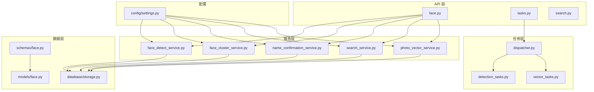
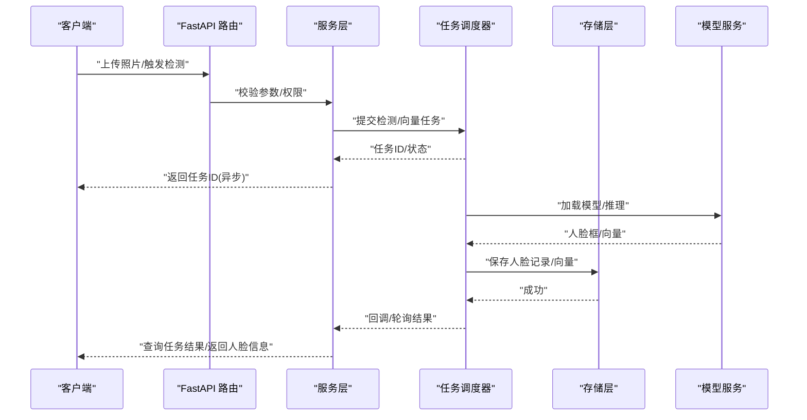
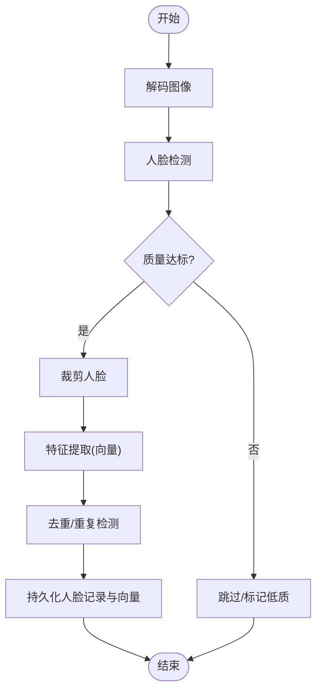
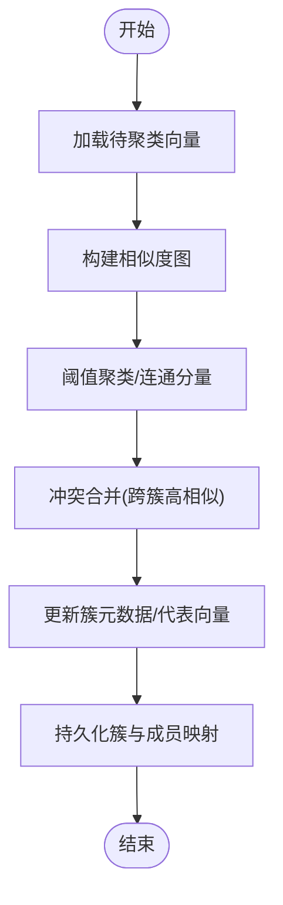
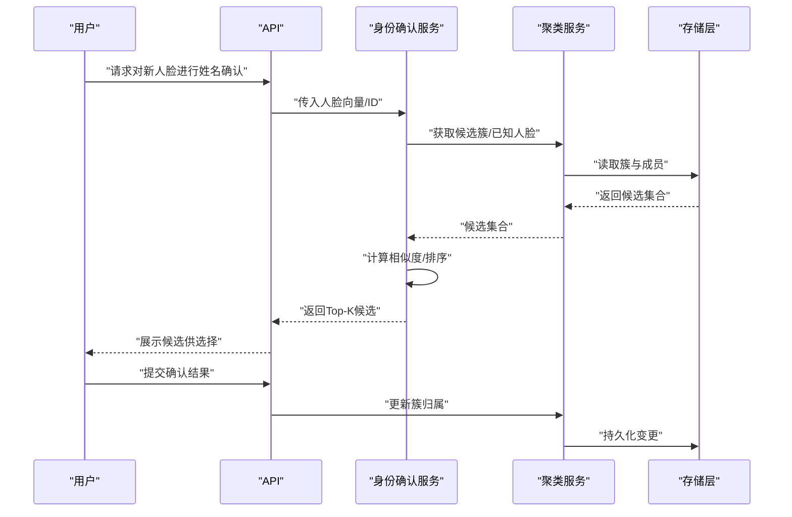
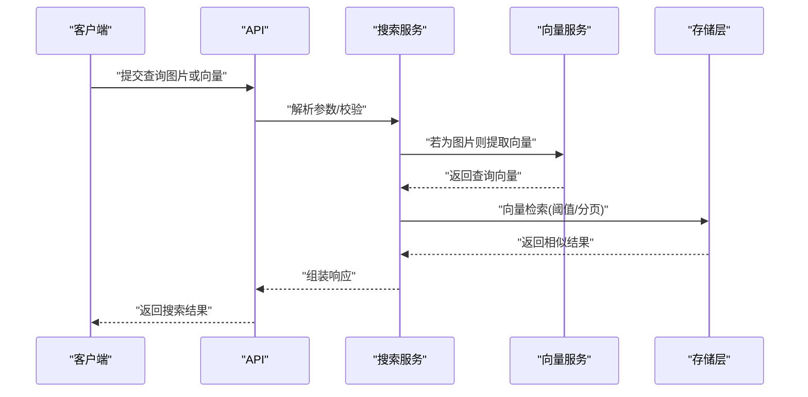
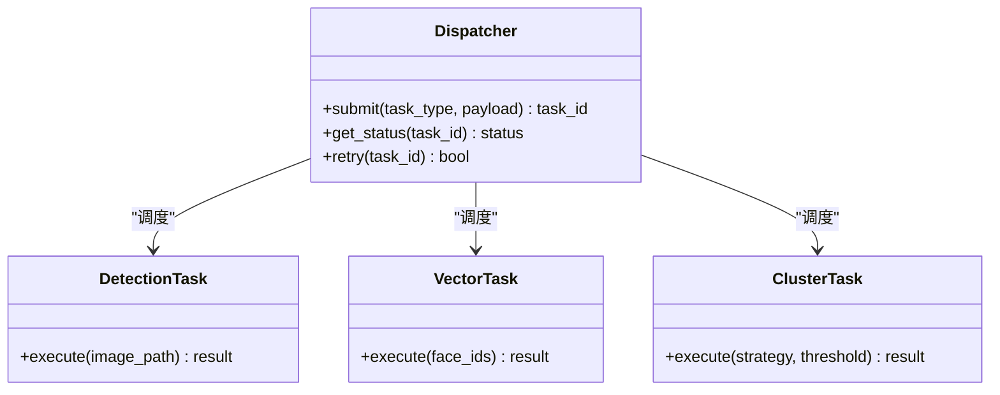
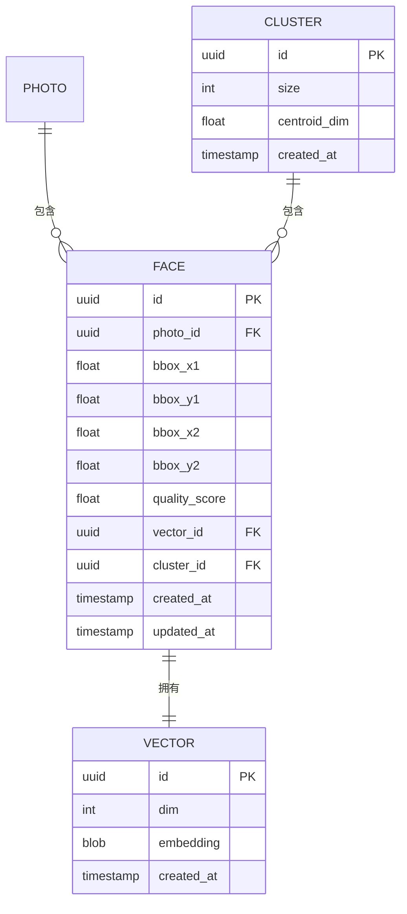
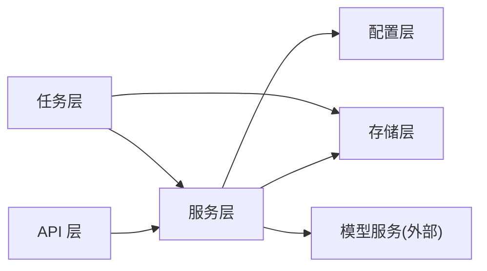

# 人脸识别接口

<cite>
**本文引用的文件**   
- [backend/app/api/face.py](file://backend/app/api/face.py)
- [backend/app/services/face_detect_service.py](file://backend/app/services/face_detect_service.py)
- [backend/app/services/face_cluster_service.py](file://backend/app/services/face_cluster_service.py)
- [backend/app/services/name_confirmation_service.py](file://backend/app/services/name_confirmation_service.py)
- [backend/app/services/search_service.py](file://backend/app/services/search_service.py)
- [backend/app/services/photo_vector_service.py](file://backend/app/services/photo_vector_service.py)
- [backend/app/models/face.py](file://backend/app/models/face.py)
- [backend/app/schemas/face.py](file://backend/app/schemas/face.py)
- [backend/app/tasks/detection_tasks.py](file://backend/app/tasks/detection_tasks.py)
- [backend/app/tasks/vector_tasks.py](file://backend/app/tasks/vector_tasks.py)
- [backend/app/tasks/dispatcher.py](file://backend/app/tasks/dispatcher.py)
- [backend/app/database/storage.py](file://backend/app/database/storage.py)
- [backend/app/config/settings.py](file://backend/app/config/settings.py)
- [backend/main.py](file://backend/main.py)
</cite>

## 目录
1. [简介](#简介)
2. [项目结构](#项目结构)
3. [核心组件](#核心组件)
4. [架构总览](#架构总览)
5. [详细组件分析](#详细组件分析)
6. [依赖关系分析](#依赖关系分析)
7. [性能与并发](#性能与并发)
8. [故障排查指南](#故障排查指南)
9. [结论](#结论)
10. [附录：API 参考](#附录api-参考)

## 简介
本文件面向开发者，提供基于 FastAPI 的人脸识别接口开发指南。内容覆盖人脸检测、特征提取、聚类、身份确认（姓名确认）、人脸搜索等能力；说明异步任务处理、大规模数据处理与模型服务集成方式；给出关键流程的时序图与流程图，并总结性能优化策略与内存管理建议。

## 项目结构
本项目采用分层架构：API 层暴露 REST 接口，服务层封装业务逻辑，任务层负责异步处理，数据层提供持久化与存储，配置层集中管理参数。

图表来源
- [backend/main.py](file://backend/main.py)
- [backend/app/api/face.py](file://backend/app/api/face.py)
- [backend/app/services/face_detect_service.py](file://backend/app/services/face_detect_service.py)
- [backend/app/services/face_cluster_service.py](file://backend/app/services/face_cluster_service.py)
- [backend/app/services/name_confirmation_service.py](file://backend/app/services/name_confirmation_service.py)
- [backend/app/services/search_service.py](file://backend/app/services/search_service.py)
- [backend/app/services/photo_vector_service.py](file://backend/app/services/photo_vector_service.py)
- [backend/app/tasks/detection_tasks.py](file://backend/app/tasks/detection_tasks.py)
- [backend/app/tasks/vector_tasks.py](file://backend/app/tasks/vector_tasks.py)
- [backend/app/tasks/dispatcher.py](file://backend/app/tasks/dispatcher.py)
- [backend/app/database/storage.py](file://backend/app/database/storage.py)
- [backend/app/config/settings.py](file://backend/app/config/settings.py)

章节来源
- [backend/main.py](file://backend/main.py)
- [backend/app/api/face.py](file://backend/app/api/face.py)
- [backend/app/config/settings.py](file://backend/app/config/settings.py)

## 核心组件
- 人脸检测服务：负责从图片中定位人脸、裁剪人脸区域、生成人脸向量（嵌入），并持久化检测结果与向量。
- 人脸聚类服务：对已存在的人脸向量进行聚类，输出人脸簇及簇内成员映射，支持增量更新。
- 身份确认服务：在检测到新人脸时，结合候选簇或用户库进行相似度匹配，辅助完成“姓名确认”工作流。
- 人脸搜索服务：基于向量检索返回相似人脸结果，支持阈值过滤与分页。
- 向量服务：封装向量的创建、更新、批量写入与索引维护。
- 任务调度器：将耗时任务（检测、向量计算、聚类）放入异步队列，避免阻塞 API。

章节来源
- [backend/app/services/face_detect_service.py](file://backend/app/services/face_detect_service.py)
- [backend/app/services/face_cluster_service.py](file://backend/app/services/face_cluster_service.py)
- [backend/app/services/name_confirmation_service.py](file://backend/app/services/name_confirmation_service.py)
- [backend/app/services/search_service.py](file://backend/app/services/search_service.py)
- [backend/app/services/photo_vector_service.py](file://backend/app/services/photo_vector_service.py)
- [backend/app/tasks/dispatcher.py](file://backend/app/tasks/dispatcher.py)

## 架构总览
系统以 FastAPI 为入口，API 路由接收请求后调用服务层；服务层通过数据库存储读写人脸元数据与向量；任务层异步执行 CPU/GPU 密集任务；配置中心统一注入阈值、模型路径、存储路径等参数。

图表来源
- [backend/app/api/face.py](file://backend/app/api/face.py)
- [backend/app/tasks/dispatcher.py](file://backend/app/tasks/dispatcher.py)
- [backend/app/services/face_detect_service.py](file://backend/app/services/face_detect_service.py)
- [backend/app/database/storage.py](file://backend/app/database/storage.py)
- [backend/app/config/settings.py](file://backend/app/config/settings.py)

## 详细组件分析

### 人脸检测与特征提取
- 输入：图片二进制或 URL、可选预处理参数。
- 处理：
  - 解码图像、尺寸归一化、去噪增强。
  - 人脸检测模型输出人脸框与关键点。
  - 裁剪人脸区域，送入特征提取模型得到向量。
  - 去重与质量评估（角度、遮挡、清晰度）。
- 输出：人脸记录（含位置、质量分、向量 ID）、任务状态。

图表来源
- [backend/app/services/face_detect_service.py](file://backend/app/services/face_detect_service.py)
- [backend/app/database/storage.py](file://backend/app/database/storage.py)
- [backend/app/config/settings.py](file://backend/app/config/settings.py)

章节来源
- [backend/app/services/face_detect_service.py](file://backend/app/services/face_detect_service.py)
- [backend/app/database/storage.py](file://backend/app/database/storage.py)
- [backend/app/config/settings.py](file://backend/app/config/settings.py)

### 人脸聚类
- 目标：将相似人脸聚合为同一人，形成“人脸簇”。
- 策略：
  - 基于向量距离（如余弦相似度）设定阈值进行层次/密度聚类。
  - 支持增量更新：新增人脸加入已有簇或新建簇。
  - 冲突合并：当两个簇间出现高相似度样本时进行合并。
- 输出：簇列表、成员映射、簇代表向量。

图表来源
- [backend/app/services/face_cluster_service.py](file://backend/app/services/face_cluster_service.py)
- [backend/app/database/storage.py](file://backend/app/database/storage.py)
- [backend/app/config/settings.py](file://backend/app/config/settings.py)

章节来源
- [backend/app/services/face_cluster_service.py](file://backend/app/services/face_cluster_service.py)
- [backend/app/database/storage.py](file://backend/app/database/storage.py)
- [backend/app/config/settings.py](file://backend/app/config/settings.py)

### 身份确认（姓名确认）
- 场景：为新检测到的未知人脸推荐可能的姓名。
- 流程：
  - 计算候选簇/已知人脸集合的相似度。
  - 按相似度排序，返回 Top-K 候选与置信度。
  - 人工确认后更新人脸到指定簇或建立新簇。
- 输出：候选名单（姓名/簇ID/相似度）、确认操作接口。

图表来源
- [backend/app/services/name_confirmation_service.py](file://backend/app/services/name_confirmation_service.py)
- [backend/app/services/face_cluster_service.py](file://backend/app/services/face_cluster_service.py)
- [backend/app/database/storage.py](file://backend/app/database/storage.py)

章节来源
- [backend/app/services/name_confirmation_service.py](file://backend/app/services/name_confirmation_service.py)
- [backend/app/services/face_cluster_service.py](file://backend/app/services/face_cluster_service.py)
- [backend/app/database/storage.py](file://backend/app/database/storage.py)

### 人脸搜索
- 输入：查询人脸向量或图片、相似度阈值、分页参数。
- 处理：
  - 若输入为图片，先进行人脸检测与特征提取。
  - 使用向量检索返回相似人脸，按相似度降序排列。
  - 支持按时间、相册、标签等维度过滤。
- 输出：相似人脸列表（含图片缩略图、相似度、所属簇/姓名）。

图表来源
- [backend/app/services/search_service.py](file://backend/app/services/search_service.py)
- [backend/app/services/photo_vector_service.py](file://backend/app/services/photo_vector_service.py)
- [backend/app/database/storage.py](file://backend/app/database/storage.py)

章节来源
- [backend/app/services/search_service.py](file://backend/app/services/search_service.py)
- [backend/app/services/photo_vector_service.py](file://backend/app/services/photo_vector_service.py)
- [backend/app/database/storage.py](file://backend/app/database/storage.py)

### 异步任务与调度
- 任务类型：
  - 检测任务：图片解码、人脸检测、特征提取、持久化。
  - 向量任务：批量向量计算、索引重建。
  - 聚类任务：全量/增量聚类。
- 调度机制：
  - 任务分发器根据负载与优先级分配 Worker。
  - 任务状态可查询，支持重试与失败告警。
- 与 API 解耦：API 立即返回任务 ID，前端轮询或通过事件通知获取结果。

图表来源
- [backend/app/tasks/dispatcher.py](file://backend/app/tasks/dispatcher.py)
- [backend/app/tasks/detection_tasks.py](file://backend/app/tasks/detection_tasks.py)
- [backend/app/tasks/vector_tasks.py](file://backend/app/tasks/vector_tasks.py)

章节来源
- [backend/app/tasks/dispatcher.py](file://backend/app/tasks/dispatcher.py)
- [backend/app/tasks/detection_tasks.py](file://backend/app/tasks/detection_tasks.py)
- [backend/app/tasks/vector_tasks.py](file://backend/app/tasks/vector_tasks.py)

### 数据模型与 Schema
- 人脸模型：包含人脸唯一标识、所属照片、人脸框坐标、质量评分、向量引用、簇关联、时间戳等。
- 人脸 Schema：用于 API 入参与出参的结构定义，确保字段校验与版本兼容。

图表来源
- [backend/app/models/face.py](file://backend/app/models/face.py)
- [backend/app/schemas/face.py](file://backend/app/schemas/face.py)

章节来源
- [backend/app/models/face.py](file://backend/app/models/face.py)
- [backend/app/schemas/face.py](file://backend/app/schemas/face.py)

## 依赖关系分析
- API 层依赖服务层，服务层依赖存储层与配置层。
- 任务层独立于 API，通过任务 ID 与状态查询耦合。
- 模型服务作为外部依赖，由服务层或任务层调用。

图表来源
- [backend/app/api/face.py](file://backend/app/api/face.py)
- [backend/app/services/face_detect_service.py](file://backend/app/services/face_detect_service.py)
- [backend/app/tasks/dispatcher.py](file://backend/app/tasks/dispatcher.py)
- [backend/app/database/storage.py](file://backend/app/database/storage.py)
- [backend/app/config/settings.py](file://backend/app/config/settings.py)

章节来源
- [backend/app/api/face.py](file://backend/app/api/face.py)
- [backend/app/tasks/dispatcher.py](file://backend/app/tasks/dispatcher.py)
- [backend/app/database/storage.py](file://backend/app/database/storage.py)
- [backend/app/config/settings.py](file://backend/app/config/settings.py)

## 性能与并发
- 异步优先：所有耗时操作（检测、向量计算、聚类）均通过任务层异步执行，避免阻塞主线程。
- 批处理：向量计算与聚类支持批量处理，减少 I/O 与模型加载开销。
- 内存管理：
  - 大图像分块解码与流式处理，及时释放中间对象。
  - 向量与图片缓存设置上限，LRU 淘汰策略。
- 并发控制：
  - 任务队列限流，按资源占用动态调整并发度。
  - GPU/CPU 资源隔离，避免争用导致抖动。
- 相似度计算：
  - 使用高效向量检索（近似最近邻）加速大规模搜索。
  - 阈值可调，平衡召回率与延迟。
- 索引维护：
  - 增量更新索引，定期全量重建保证一致性。
- 监控与回滚：
  - 记录任务耗时、错误率、内存峰值，异常自动重试与降级。

[本节为通用性能指导，不直接分析具体文件]

## 故障排查指南
- 常见问题
  - 模型加载失败：检查模型路径与权限，确认环境依赖。
  - 向量维度不一致：核对训练与推理模型版本，确保维度一致。
  - 任务超时：提高超时阈值或拆分批次，检查 Worker 资源。
  - 聚类效果差：调整相似度阈值与聚类策略，增加样本多样性。
- 日志与追踪
  - 关键步骤打点：检测、向量、聚类、持久化。
  - 任务状态机：Pending、Running、Success、Failed、Retry。
- 恢复策略
  - 失败任务自动重试，指数退避。
  - 索引损坏时触发重建流程。

章节来源
- [backend/app/tasks/dispatcher.py](file://backend/app/tasks/dispatcher.py)
- [backend/app/database/storage.py](file://backend/app/database/storage.py)
- [backend/app/config/settings.py](file://backend/app/config/settings.py)

## 结论
本方案以 FastAPI 为核心，结合异步任务与分层服务，实现了可扩展的人脸识别能力。通过合理的相似度阈值、聚类策略与向量检索，可在大规模数据下保持良好性能与准确性。建议在生产环境中完善监控、灰度发布与回滚机制，持续优化模型与服务。

[本节为总结性内容，不直接分析具体文件]

## 附录：API 参考
- 人脸检测
  - 方法：POST /api/face/detect
  - 功能：上传图片，返回任务 ID；支持轮询任务结果。
  - 入参：图片二进制或 URL、预处理选项。
  - 出参：任务 ID、预计耗时、状态查询接口。
- 任务状态
  - 方法：GET /api/tasks/{task_id}
  - 功能：查询任务状态与结果摘要。
- 人脸聚类
  - 方法：POST /api/face/cluster
  - 功能：触发全量或增量聚类，返回任务 ID。
  - 参数：策略、相似度阈值、是否增量。
- 身份确认
  - 方法：POST /api/face/confirm
  - 功能：为新人脸推荐候选姓名，提交确认后更新簇归属。
- 人脸搜索
  - 方法：POST /api/face/search
  - 功能：基于图片或向量检索相似人脸，支持阈值与分页。

章节来源
- [backend/app/api/face.py](file://backend/app/api/face.py)
- [backend/app/api/tasks.py](file://backend/app/api/tasks.py)
- [backend/app/services/face_detect_service.py](file://backend/app/services/face_detect_service.py)
- [backend/app/services/face_cluster_service.py](file://backend/app/services/face_cluster_service.py)
- [backend/app/services/name_confirmation_service.py](file://backend/app/services/name_confirmation_service.py)
- [backend/app/services/search_service.py](file://backend/app/services/search_service.py)