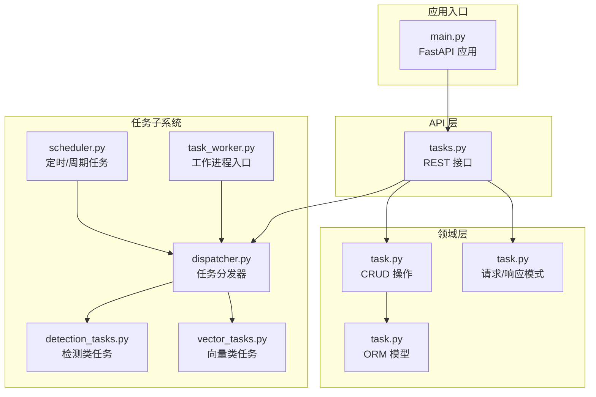
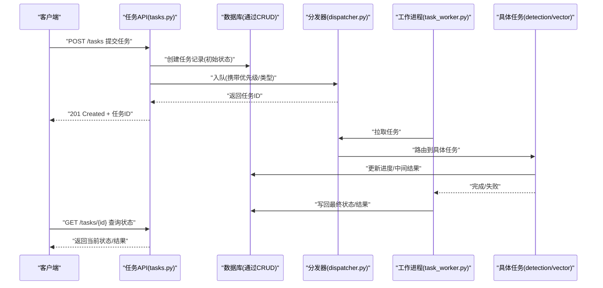
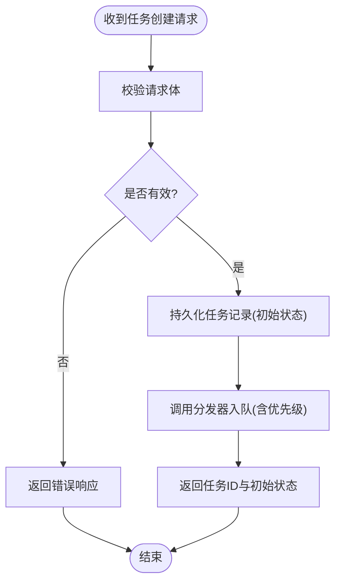
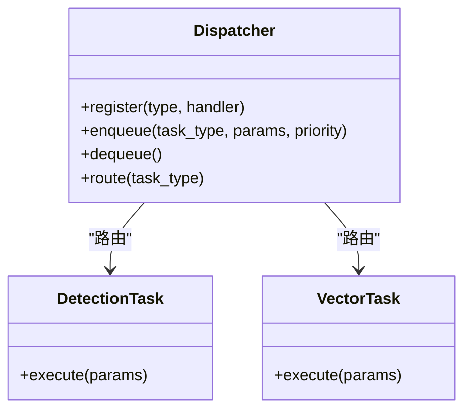
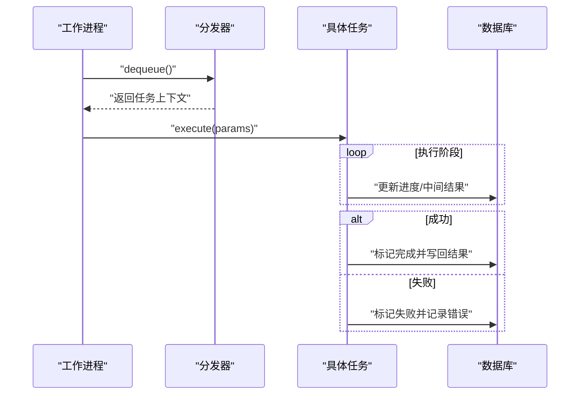
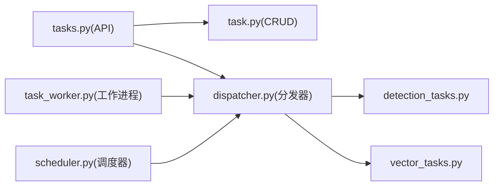

# 任务管理接口

<cite>
**本文引用的文件**   
- [backend/app/api/tasks.py](file://backend/app/api/tasks.py)
- [backend/app/crud/task.py](file://backend/app/crud/task.py)
- [backend/app/models/task.py](file://backend/app/models/task.py)
- [backend/app/schemas/task.py](file://backend/app/schemas/task.py)
- [backend/app/tasks/dispatcher.py](file://backend/app/tasks/dispatcher.py)
- [backend/app/tasks/detection_tasks.py](file://backend/app/tasks/detection_tasks.py)
- [backend/app/tasks/vector_tasks.py](file://backend/app/tasks/vector_tasks.py)
- [backend/app/tasks/task_worker.py](file://backend/app/tasks/task_worker.py)
- [backend/app/tasks/scheduler.py](file://backend/app/tasks/scheduler.py)
- [backend/app/services/README.md](file://backend/app/services/README.md)
- [backend/main.py](file://backend/main.py)
</cite>

## 目录
1. [简介](#简介)
2. [项目结构](#项目结构)
3. [核心组件](#核心组件)
4. [架构总览](#架构总览)
5. [详细组件分析](#详细组件分析)
6. [依赖关系分析](#依赖关系分析)
7. [性能与扩展性](#性能与扩展性)
8. [故障排查指南](#故障排查指南)
9. [结论](#结论)
10. [附录：API 参考](#附录api-参考)

## 简介
本文件面向开发者，提供基于 FastAPI 的任务管理接口开发指南。内容覆盖异步任务提交、进度跟踪、结果获取、任务状态管理、错误重试机制、优先级调度、资源监控、失败告警、持久化与分布式协调等主题，并结合仓库中现有实现进行说明与图示。

## 项目结构
后端采用分层架构：API 层暴露 REST 接口；CRUD 层负责数据访问；模型与 Schema 定义数据结构；任务子系统包含任务分发器、具体任务实现、工作进程与调度器；服务层封装业务逻辑。

图表来源
- [backend/app/api/tasks.py](file://backend/app/api/tasks.py)
- [backend/app/crud/task.py](file://backend/app/crud/task.py)
- [backend/app/models/task.py](file://backend/app/models/task.py)
- [backend/app/schemas/task.py](file://backend/app/schemas/task.py)
- [backend/app/tasks/dispatcher.py](file://backend/app/tasks/dispatcher.py)
- [backend/app/tasks/task_worker.py](file://backend/app/tasks/task_worker.py)
- [backend/app/tasks/scheduler.py](file://backend/app/tasks/scheduler.py)
- [backend/app/tasks/detection_tasks.py](file://backend/app/tasks/detection_tasks.py)
- [backend/app/tasks/vector_tasks.py](file://backend/app/tasks/vector_tasks.py)
- [backend/main.py](file://backend/main.py)

章节来源
- [backend/app/api/tasks.py](file://backend/app/api/tasks.py)
- [backend/app/crud/task.py](file://backend/app/crud/task.py)
- [backend/app/models/task.py](file://backend/app/models/task.py)
- [backend/app/schemas/task.py](file://backend/app/schemas/task.py)
- [backend/app/tasks/dispatcher.py](file://backend/app/tasks/dispatcher.py)
- [backend/app/tasks/task_worker.py](file://backend/app/tasks/task_worker.py)
- [backend/app/tasks/scheduler.py](file://backend/app/tasks/scheduler.py)
- [backend/app/tasks/detection_tasks.py](file://backend/app/tasks/detection_tasks.py)
- [backend/app/tasks/vector_tasks.py](file://backend/app/tasks/vector_tasks.py)
- [backend/main.py](file://backend/main.py)

## 核心组件
- 任务 API（提交、查询、批量）：对外暴露任务生命周期相关接口，负责参数校验、持久化与返回统一响应。
- 任务模型与模式：定义任务实体字段、状态枚举、请求/响应结构。
- 任务分发器：将任务类型映射到具体执行函数，支持优先级与路由策略。
- 任务工作进程：独立进程运行任务执行器，消费队列并更新状态。
- 调度器：周期性或延迟触发任务（如扫描、清理、统计）。
- 具体任务实现：按业务域拆分（如检测、向量化），便于扩展与维护。

章节来源
- [backend/app/api/tasks.py](file://backend/app/api/tasks.py)
- [backend/app/models/task.py](file://backend/app/models/task.py)
- [backend/app/schemas/task.py](file://backend/app/schemas/task.py)
- [backend/app/tasks/dispatcher.py](file://backend/app/tasks/dispatcher.py)
- [backend/app/tasks/task_worker.py](file://backend/app/tasks/task_worker.py)
- [backend/app/tasks/scheduler.py](file://backend/app/tasks/scheduler.py)
- [backend/app/tasks/detection_tasks.py](file://backend/app/tasks/detection_tasks.py)
- [backend/app/tasks/vector_tasks.py](file://backend/app/tasks/vector_tasks.py)

## 架构总览
整体流程：客户端调用任务 API → API 写入任务记录并投递到队列 → 工作进程拉取任务执行 → 执行过程中更新进度与结果 → 客户端轮询或通过事件通道获取最新状态。

图表来源
- [backend/app/api/tasks.py](file://backend/app/api/tasks.py)
- [backend/app/crud/task.py](file://backend/app/crud/task.py)
- [backend/app/tasks/dispatcher.py](file://backend/app/tasks/dispatcher.py)
- [backend/app/tasks/task_worker.py](file://backend/app/tasks/task_worker.py)
- [backend/app/tasks/detection_tasks.py](file://backend/app/tasks/detection_tasks.py)
- [backend/app/tasks/vector_tasks.py](file://backend/app/tasks/vector_tasks.py)

## 详细组件分析

### 任务 API（提交、查询、批量）
职责
- 接收任务创建请求，校验输入，持久化任务记录，并将任务投递至分发器。
- 提供任务状态查询接口，支持分页与过滤。
- 提供批量任务提交能力，内部循环创建并批量入队。

关键交互
- 与 CRUD 层交互读写任务表。
- 与分发器协作，传入任务类型、参数与优先级。
- 返回统一响应结构，包含任务 ID、状态与时间戳。

图表来源
- [backend/app/api/tasks.py](file://backend/app/api/tasks.py)
- [backend/app/crud/task.py](file://backend/app/crud/task.py)
- [backend/app/schemas/task.py](file://backend/app/schemas/task.py)

章节来源
- [backend/app/api/tasks.py](file://backend/app/api/tasks.py)
- [backend/app/schemas/task.py](file://backend/app/schemas/task.py)

### 任务模型与模式
- 模型定义任务实体的字段与关系，包括任务标识、类型、状态、优先级、参数、结果、错误信息、时间戳等。
- 模式定义请求与响应的 JSON 结构，用于 Pydantic 校验与文档生成。

建议
- 使用枚举表示任务状态，确保一致性。
- 为常用查询字段建立索引以提升查询性能。

章节来源
- [backend/app/models/task.py](file://backend/app/models/task.py)
- [backend/app/schemas/task.py](file://backend/app/schemas/task.py)

### 任务分发器（Dispatcher）
职责
- 维护任务类型到处理函数的映射。
- 根据任务优先级选择队列或路由策略。
- 提供统一的入队与出队接口，供 API 与工作进程使用。

设计要点
- 可扩展的注册机制，新增任务类型无需修改核心路由。
- 支持优先级队列或分片队列，避免热点任务阻塞。

图表来源
- [backend/app/tasks/dispatcher.py](file://backend/app/tasks/dispatcher.py)
- [backend/app/tasks/detection_tasks.py](file://backend/app/tasks/detection_tasks.py)
- [backend/app/tasks/vector_tasks.py](file://backend/app/tasks/vector_tasks.py)

章节来源
- [backend/app/tasks/dispatcher.py](file://backend/app/tasks/dispatcher.py)

### 任务工作进程（Worker）
职责
- 从队列拉取任务，调用分发器执行对应处理器。
- 在任务执行期间持续更新进度与中间结果。
- 捕获异常并记录错误信息，必要时触发重试。

关键点
- 心跳与超时控制，防止僵尸任务。
- 幂等执行与去重，避免重复处理。

图表来源
- [backend/app/tasks/task_worker.py](file://backend/app/tasks/task_worker.py)
- [backend/app/tasks/dispatcher.py](file://backend/app/tasks/dispatcher.py)

章节来源
- [backend/app/tasks/task_worker.py](file://backend/app/tasks/task_worker.py)

### 调度器（Scheduler）
职责
- 定时或周期性地触发系统级任务（如扫描、统计、清理）。
- 与分发器集成，以相同方式入队任务。

注意
- 避免与业务高峰冲突，合理设置调度间隔。
- 支持一次性延迟任务与周期性任务两种模式。

章节来源
- [backend/app/tasks/scheduler.py](file://backend/app/tasks/scheduler.py)

### 具体任务实现（检测与向量）
- 检测类任务：对媒体数据进行人脸/物体检测，输出检测结果与元数据。
- 向量类任务：计算特征向量并写入向量存储，支持检索。

扩展建议
- 每个任务模块保持单一职责，便于测试与替换。
- 通过配置开关控制任务启用与参数。

章节来源
- [backend/app/tasks/detection_tasks.py](file://backend/app/tasks/detection_tasks.py)
- [backend/app/tasks/vector_tasks.py](file://backend/app/tasks/vector_tasks.py)

### 应用入口（FastAPI 启动）
- 初始化数据库连接、加载配置、挂载路由。
- 可选：启动后台调度器与工作进程管理器。

章节来源
- [backend/main.py](file://backend/main.py)

## 依赖关系分析
- API 层依赖 CRUD 与分发器。
- 分发器依赖具体任务实现。
- 工作进程依赖分发器与数据库。
- 调度器依赖分发器。

图表来源
- [backend/app/api/tasks.py](file://backend/app/api/tasks.py)
- [backend/app/crud/task.py](file://backend/app/crud/task.py)
- [backend/app/tasks/dispatcher.py](file://backend/app/tasks/dispatcher.py)
- [backend/app/tasks/detection_tasks.py](file://backend/app/tasks/detection_tasks.py)
- [backend/app/tasks/vector_tasks.py](file://backend/app/tasks/vector_tasks.py)
- [backend/app/tasks/task_worker.py](file://backend/app/tasks/task_worker.py)
- [backend/app/tasks/scheduler.py](file://backend/app/tasks/scheduler.py)

章节来源
- [backend/app/api/tasks.py](file://backend/app/api/tasks.py)
- [backend/app/tasks/dispatcher.py](file://backend/app/tasks/dispatcher.py)
- [backend/app/tasks/task_worker.py](file://backend/app/tasks/task_worker.py)
- [backend/app/tasks/scheduler.py](file://backend/app/tasks/scheduler.py)

## 性能与扩展性
- 并发与并行
  - 多工作进程并行执行任务，提升吞吐。
  - 针对 CPU 密集型任务（如检测）与 I/O 密集型任务（如网络请求）分别优化。
- 队列与优先级
  - 高优先级任务优先出队，避免长尾阻塞。
  - 可引入多队列或分片策略隔离热点任务。
- 进度与结果
  - 增量更新进度，减少数据库压力。
  - 大结果采用对象存储或流式返回。
- 重试与容错
  - 指数退避重试，区分可恢复与不可恢复错误。
  - 死信队列收集失败任务，便于人工干预。
- 资源监控
  - 采集任务耗时、成功率、队列长度、CPU/内存占用。
  - 设置阈值告警，自动扩缩容工作进程。
- 分布式协调
  - 使用外部消息代理与结果后端（例如 Redis/RabbitMQ/Celery）实现跨节点协调。
  - 保证任务幂等与去重，避免重复执行。

[本节为通用指导，不直接分析具体文件]

## 故障排查指南
常见问题与定位步骤
- 任务未执行
  - 检查工作进程是否运行且能连接到队列。
  - 查看分发器日志与队列积压情况。
- 进度不更新
  - 确认任务在执行路径中正确写入进度。
  - 检查数据库连接与权限。
- 频繁失败
  - 查看错误信息与堆栈，判断是否为可重试错误。
  - 调整重试策略与超时参数。
- 性能瓶颈
  - 分析任务耗时分布与资源占用。
  - 增加工作进程或优化任务粒度。

章节来源
- [backend/app/tasks/task_worker.py](file://backend/app/tasks/task_worker.py)
- [backend/app/tasks/dispatcher.py](file://backend/app/tasks/dispatcher.py)

## 结论
本指南基于仓库现有实现，梳理了任务管理的端到端流程与关键组件，提供了架构图与流程图帮助理解。建议在后续迭代中引入成熟的队列与结果后端（如 Celery），完善监控告警与弹性伸缩，进一步提升系统的稳定性与可观测性。

[本节为总结，不直接分析具体文件]

## 附录：API 参考
- 任务创建
  - 方法：POST
  - 路径：/tasks
  - 请求体：任务类型、参数、优先级
  - 响应：任务 ID、初始状态、时间戳
- 任务查询
  - 方法：GET
  - 路径：/tasks/{task_id}
  - 响应：任务状态、进度、结果/错误信息
- 批量任务
  - 方法：POST
  - 路径：/tasks/batch
  - 请求体：任务列表
  - 响应：各任务的 ID 与初始状态

章节来源
- [backend/app/api/tasks.py](file://backend/app/api/tasks.py)
- [backend/app/schemas/task.py](file://backend/app/schemas/task.py)