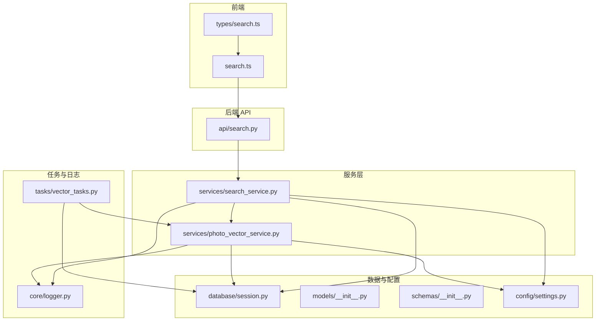
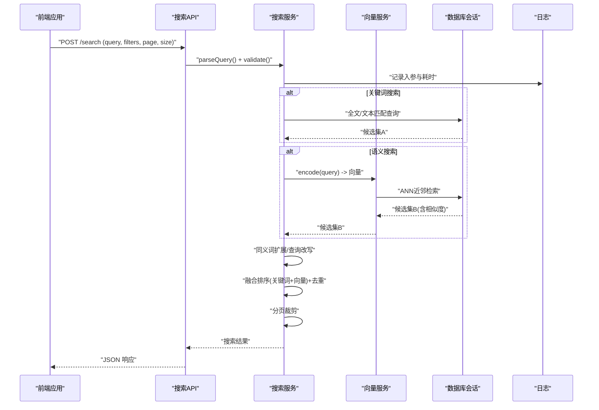
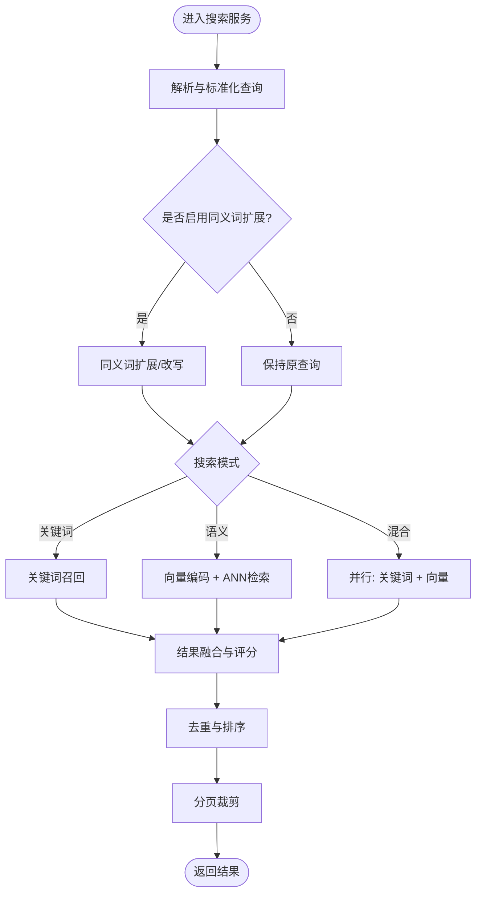
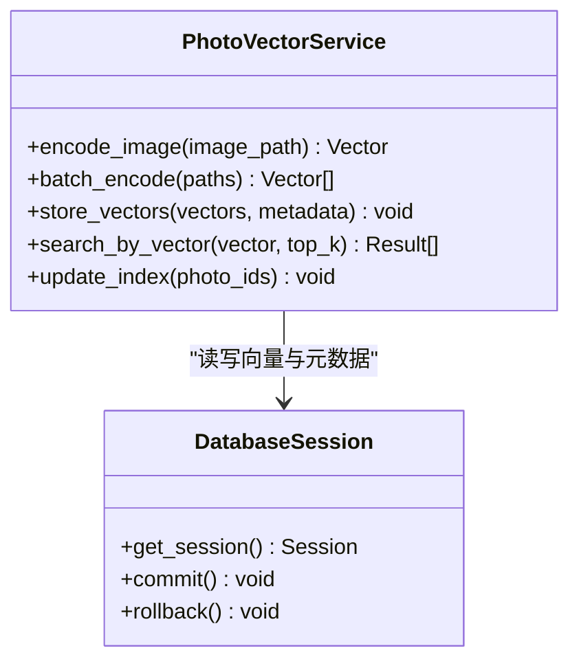
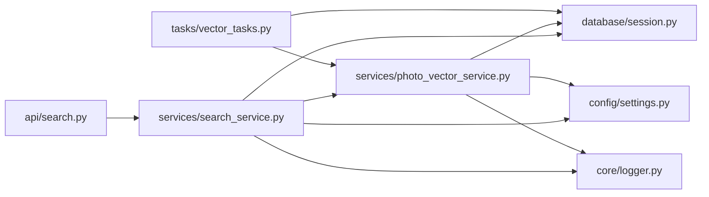

# 搜索接口开发

<cite>
**本文引用的文件**   
- [backend/app/api/search.py](file://backend/app/api/search.py)
- [backend/app/services/search_service.py](file://backend/app/services/search_service.py)
- [backend/app/services/photo_vector_service.py](file://backend/app/services/photo_vector_service.py)
- [backend/app/schemas/__init__.py](file://backend/app/schemas/__init__.py)
- [backend/app/models/__init__.py](file://backend/app/models/__init__.py)
- [backend/app/database/session.py](file://backend/app/database/session.py)
- [backend/app/config/settings.py](file://backend/app/config/settings.py)
- [backend/app/tasks/vector_tasks.py](file://backend/app/tasks/vector_tasks.py)
- [backend/app/core/logger.py](file://backend/app/core/logger.py)
- [frontend/src/api/search.ts](file://frontend/src/api/search.ts)
- [frontend/src/types/search.ts](file://frontend/src/types/search.ts)
</cite>

## 目录
1. [简介](#简介)
2. [项目结构](#项目结构)
3. [核心组件](#核心组件)
4. [架构总览](#架构总览)
5. [详细组件分析](#详细组件分析)
6. [依赖关系分析](#依赖关系分析)
7. [性能考虑](#性能考虑)
8. [故障排查指南](#故障排查指南)
9. [结论](#结论)
10. [附录](#附录)

## 简介
本文件面向开发者，提供基于 FastAPI 的搜索接口开发指南。内容覆盖关键词搜索、语义搜索与混合搜索的实现思路与工程化落地，包括向量检索原理、搜索引擎集成、结果排序算法、全文索引构建、同义词扩展、相关性评分、查询解析、多条件筛选与分页处理机制，并给出性能优化、缓存策略与分布式搜索架构建议。文档以仓库中现有搜索相关代码为依据，结合通用工程实践进行系统化说明。

## 项目结构
后端采用分层架构：API 层暴露 REST 接口，服务层封装业务逻辑（搜索、向量检索等），数据访问层通过数据库会话与存储抽象，任务层负责异步向量计算与索引更新。前端通过 TypeScript API 客户端调用搜索接口，类型定义统一在 types 模块中。

图表来源
- [backend/app/api/search.py](file://backend/app/api/search.py)
- [backend/app/services/search_service.py](file://backend/app/services/search_service.py)
- [backend/app/services/photo_vector_service.py](file://backend/app/services/photo_vector_service.py)
- [backend/app/database/session.py](file://backend/app/database/session.py)
- [backend/app/models/__init__.py](file://backend/app/models/__init__.py)
- [backend/app/schemas/__init__.py](file://backend/app/schemas/__init__.py)
- [backend/app/config/settings.py](file://backend/app/config/settings.py)
- [backend/app/tasks/vector_tasks.py](file://backend/app/tasks/vector_tasks.py)
- [backend/app/core/logger.py](file://backend/app/core/logger.py)
- [frontend/src/api/search.ts](file://frontend/src/api/search.ts)
- [frontend/src/types/search.ts](file://frontend/src/types/search.ts)

章节来源
- [backend/app/api/search.py](file://backend/app/api/search.py)
- [backend/app/services/search_service.py](file://backend/app/services/search_service.py)
- [backend/app/services/photo_vector_service.py](file://backend/app/services/photo_vector_service.py)
- [backend/app/database/session.py](file://backend/app/database/session.py)
- [backend/app/models/__init__.py](file://backend/app/models/__init__.py)
- [backend/app/schemas/__init__.py](file://backend/app/schemas/__init__.py)
- [backend/app/config/settings.py](file://backend/app/config/settings.py)
- [backend/app/tasks/vector_tasks.py](file://backend/app/tasks/vector_tasks.py)
- [backend/app/core/logger.py](file://backend/app/core/logger.py)
- [frontend/src/api/search.ts](file://frontend/src/api/search.ts)
- [frontend/src/types/search.ts](file://frontend/src/types/search.ts)

## 核心组件
- 搜索 API 路由：对外暴露关键词、语义、混合搜索端点，负责参数校验、分页与响应组装。
- 搜索服务：编排查询解析、同义词扩展、多路召回（关键词/向量）、排序与重排、结果聚合与分页。
- 向量服务：管理图片向量生成、入库、近邻检索与相似度计算，支撑语义搜索与混合搜索。
- 数据模型与模式：定义 Photo、描述、标签等实体及请求/响应 Schema，确保前后端契约一致。
- 数据库会话：提供 ORM 会话与事务能力，用于持久化元数据与索引状态。
- 任务系统：异步执行向量嵌入与索引更新，避免阻塞主线程。
- 配置与日志：集中管理搜索开关、阈值、分片大小等；记录关键路径耗时与错误。

章节来源
- [backend/app/api/search.py](file://backend/app/api/search.py)
- [backend/app/services/search_service.py](file://backend/app/services/search_service.py)
- [backend/app/services/photo_vector_service.py](file://backend/app/services/photo_vector_service.py)
- [backend/app/models/__init__.py](file://backend/app/models/__init__.py)
- [backend/app/schemas/__init__.py](file://backend/app/schemas/__init__.py)
- [backend/app/database/session.py](file://backend/app/database/session.py)
- [backend/app/tasks/vector_tasks.py](file://backend/app/tasks/vector_tasks.py)
- [backend/app/config/settings.py](file://backend/app/config/settings.py)
- [backend/app/core/logger.py](file://backend/app/core/logger.py)

## 架构总览
搜索系统由“查询入口—服务编排—召回—排序—分页—响应”构成，支持关键词、语义与混合三种模式。向量检索通过向量服务完成，关键词检索可对接全文索引或数据库文本匹配。混合搜索将两类结果按权重融合，并进行相关性评分与去重。

图表来源
- [backend/app/api/search.py](file://backend/app/api/search.py)
- [backend/app/services/search_service.py](file://backend/app/services/search_service.py)
- [backend/app/services/photo_vector_service.py](file://backend/app/services/photo_vector_service.py)
- [backend/app/database/session.py](file://backend/app/database/session.py)
- [backend/app/core/logger.py](file://backend/app/core/logger.py)

## 详细组件分析

### 搜索 API 路由
- 职责
  - 接收前端请求，校验 query、filters、page、size 等参数。
  - 调用搜索服务执行关键词/语义/混合搜索。
  - 返回统一响应格式，包含分页信息与命中详情。
- 关键点
  - 使用 Pydantic Schema 做输入校验与默认值。
  - 对异常进行捕获并转换为标准错误响应。
  - 支持可选字段如时间范围、地点、人脸、标签等过滤。

章节来源
- [backend/app/api/search.py](file://backend/app/api/search.py)
- [backend/app/schemas/__init__.py](file://backend/app/schemas/__init__.py)

### 搜索服务
- 职责
  - 查询解析与标准化（分词、停用词、同义词扩展）。
  - 多路召回：关键词召回与向量召回。
  - 融合排序：加权打分、去重、截断。
  - 分页：基于游标或偏移的分页实现。
- 流程要点
  - 若启用同义词扩展，先对 query 进行改写，再并行发起多路召回。
  - 向量召回需先编码为向量，再进行 ANN 检索。
  - 融合阶段根据业务需求调整关键词与向量的权重，并对结果进行相关性评分。
  - 最终按 score 降序输出，并应用分页。

图表来源
- [backend/app/services/search_service.py](file://backend/app/services/search_service.py)
- [backend/app/services/photo_vector_service.py](file://backend/app/services/photo_vector_service.py)

章节来源
- [backend/app/services/search_service.py](file://backend/app/services/search_service.py)

### 向量服务
- 职责
  - 图片向量嵌入：从图片提取特征向量。
  - 向量入库：将向量与元数据关联存储。
  - 近邻检索：基于向量相似度快速召回候选。
- 技术要点
  - 嵌入模型选择与维度对齐。
  - 向量索引结构与检索参数（top_k、距离度量）。
  - 批量写入与增量更新，避免锁竞争。
  - 失败重试与幂等写入。

图表来源
- [backend/app/services/photo_vector_service.py](file://backend/app/services/photo_vector_service.py)
- [backend/app/database/session.py](file://backend/app/database/session.py)

章节来源
- [backend/app/services/photo_vector_service.py](file://backend/app/services/photo_vector_service.py)
- [backend/app/database/session.py](file://backend/app/database/session.py)

### 数据模型与模式
- 模型
  - Photo：照片主键、路径、创建时间、更新时间等。
  - Description：照片描述文本，用于关键词检索。
  - Face：人脸信息，可用于人像过滤。
- 模式
  - 请求 Schema：query、filters、page、size、mode 等。
  - 响应 Schema：分页信息、命中列表、评分、元数据。

章节来源
- [backend/app/models/__init__.py](file://backend/app/models/__init__.py)
- [backend/app/schemas/__init__.py](file://backend/app/schemas/__init__.py)

### 任务系统与索引更新
- 职责
  - 异步执行向量嵌入与索引更新，避免阻塞请求链路。
  - 监控任务状态，失败重试与告警。
- 关键点
  - 任务队列与 Worker 分离。
  - 幂等写入与去重。
  - 进度回调与可观测性。

章节来源
- [backend/app/tasks/vector_tasks.py](file://backend/app/tasks/vector_tasks.py)

### 配置与日志
- 配置
  - 搜索开关、同义词词典路径、向量维度、ANN 参数、分页上限等。
- 日志
  - 记录查询耗时、召回数量、融合耗时、错误堆栈。
  - 结构化日志便于追踪与审计。

章节来源
- [backend/app/config/settings.py](file://backend/app/config/settings.py)
- [backend/app/core/logger.py](file://backend/app/core/logger.py)

### 前端集成
- API 客户端
  - 封装搜索请求，统一错误处理与重试。
  - 支持分页加载与滚动加载。
- 类型定义
  - 严格定义请求与响应类型，提升开发体验与稳定性。

章节来源
- [frontend/src/api/search.ts](file://frontend/src/api/search.ts)
- [frontend/src/types/search.ts](file://frontend/src/types/search.ts)

## 依赖关系分析
- 耦合与内聚
  - API 层仅负责协议转换与校验，业务逻辑集中在服务层，内聚度高。
  - 向量服务与数据库会话解耦，可通过替换底层存储实现不同向量库。
- 外部依赖
  - 向量嵌入模型、ANN 检索引擎、全文索引（可选）。
- 循环依赖
  - 当前未发现循环导入；服务层不直接依赖 API 层。

图表来源
- [backend/app/api/search.py](file://backend/app/api/search.py)
- [backend/app/services/search_service.py](file://backend/app/services/search_service.py)
- [backend/app/services/photo_vector_service.py](file://backend/app/services/photo_vector_service.py)
- [backend/app/database/session.py](file://backend/app/database/session.py)
- [backend/app/config/settings.py](file://backend/app/config/settings.py)
- [backend/app/core/logger.py](file://backend/app/core/logger.py)
- [backend/app/tasks/vector_tasks.py](file://backend/app/tasks/vector_tasks.py)

章节来源
- [backend/app/api/search.py](file://backend/app/api/search.py)
- [backend/app/services/search_service.py](file://backend/app/services/search_service.py)
- [backend/app/services/photo_vector_service.py](file://backend/app/services/photo_vector_service.py)
- [backend/app/database/session.py](file://backend/app/database/session.py)
- [backend/app/config/settings.py](file://backend/app/config/settings.py)
- [backend/app/core/logger.py](file://backend/app/core/logger.py)
- [backend/app/tasks/vector_tasks.py](file://backend/app/tasks/vector_tasks.py)

## 性能考虑
- 查询优化
  - 关键词检索：优先使用全文索引，减少 LIKE 扫描；合理设置分词与停用词。
  - 向量检索：调优 top_k、距离度量与索引参数；必要时引入预取与批处理。
- 缓存策略
  - 查询级缓存：对高频 query 与过滤组合进行短期缓存。
  - 结果级缓存：对热门结果集进行缓存，注意失效策略（索引更新后失效）。
  - 向量缓存：对重复图片的向量进行本地缓存，避免重复计算。
- 并发与异步
  - 多路召回并行执行，降低端到端延迟。
  - 向量计算与索引更新走任务队列，避免阻塞主线程。
- 分页与流式
  - 大结果集使用游标分页，避免深度偏移带来的性能问题。
  - 前端按需加载，减少首屏压力。
- 资源控制
  - 限制最大 page_size、top_k 与融合候选数，防止内存溢出。
  - 对长耗时操作增加超时与熔断保护。

[本节为通用指导，无需具体文件引用]

## 故障排查指南
- 常见问题
  - 向量缺失：检查向量任务是否成功执行，确认入库记录是否存在。
  - 检索为空：核对 query 是否被过度过滤，检查同义词词典与分词器配置。
  - 性能退化：查看日志中的耗时分布，定位瓶颈在召回、融合还是 IO。
- 诊断步骤
  - 开启调试日志，记录入参与中间结果统计。
  - 单独测试关键词与向量召回，逐步缩小问题范围。
  - 验证索引一致性，必要时重建索引。
- 恢复措施
  - 清理无效任务与脏数据，重新触发增量更新。
  - 回滚到稳定版本配置，逐步放开变更。

章节来源
- [backend/app/core/logger.py](file://backend/app/core/logger.py)
- [backend/app/tasks/vector_tasks.py](file://backend/app/tasks/vector_tasks.py)

## 结论
本指南围绕关键词、语义与混合搜索三大能力，给出了从 API 设计、服务编排、向量检索到排序融合与分页的完整实现路径。通过合理的索引与缓存策略、异步任务与并发优化，可在保证准确性的同时获得良好的性能表现。建议在上线前进行压测与回归，持续监控关键指标并迭代优化。

[本节为总结性内容，无需具体文件引用]

## 附录

### 搜索 API 参考
- 端点
  - POST /search
- 请求体
  - query: 字符串，搜索关键词或自然语言描述
  - mode: 枚举，keyword | semantic | hybrid
  - filters: 对象，支持时间范围、地点、人脸、标签等
  - page: 整数，页码
  - size: 整数，每页条数
- 响应体
  - total: 总数
  - page: 当前页
  - size: 每页条数
  - results: 数组，包含 id、score、元数据等

章节来源
- [backend/app/api/search.py](file://backend/app/api/search.py)
- [backend/app/schemas/__init__.py](file://backend/app/schemas/__init__.py)

### 向量检索原理简述
- 嵌入模型将图片映射为高维向量，相似图片在向量空间中距离更近。
- 近邻检索通过 ANN 算法快速找到与查询向量最接近的候选集合。
- 相似度度量常用余弦相似度或欧氏距离，依据业务选择。

[本节为概念性说明，无需具体文件引用]

### 同义词扩展与查询改写
- 同义词词典维护常见等价词组，提升召回覆盖率。
- 查询改写可加入上下文增强，如将“海边日落”扩展为“海滩 黄昏 晚霞”。
- 注意控制改写后的查询复杂度，避免噪声过多影响排序。

[本节为概念性说明，无需具体文件引用]

### 相关性评分与融合排序
- 关键词评分：基于 TF-IDF 或 BM25 等文本相关性模型。
- 向量评分：基于相似度分数归一化。
- 融合策略：线性加权或学习排序，兼顾准确率与多样性。
- 去重与多样性：按 ID 去重，必要时引入打散策略提升用户体验。

[本节为概念性说明，无需具体文件引用]

### 分页处理机制
- 偏移分页：简单直观，但深度偏移性能较差。
- 游标分页：基于上次最后一条记录的标识，适合大数据量场景。
- 前端配合：滚动加载与无限滚动，提升交互体验。

[本节为概念性说明，无需具体文件引用]

### 分布式搜索架构建议
- 水平扩展：将向量索引与全文索引分片部署，按 ID 哈希路由。
- 读写分离：索引更新走独立节点，查询走只读副本。
- 容错与一致性：采用最终一致性模型，定期校验与修复。
- 可观测性：统一采集 QPS、P99 延迟、错误率与资源利用率。

[本节为概念性说明，无需具体文件引用]