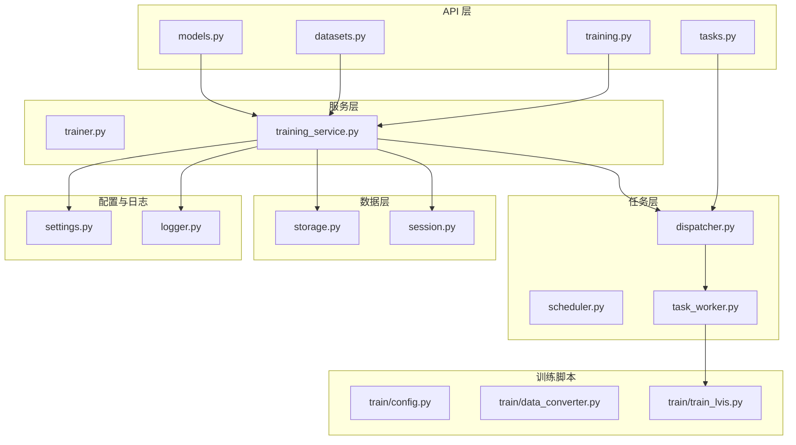
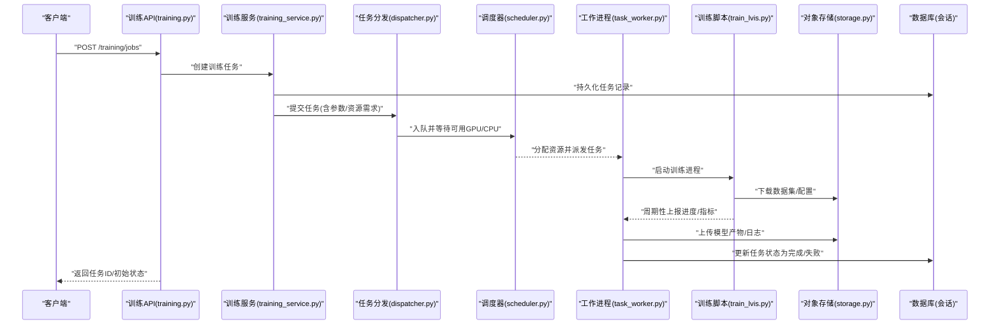
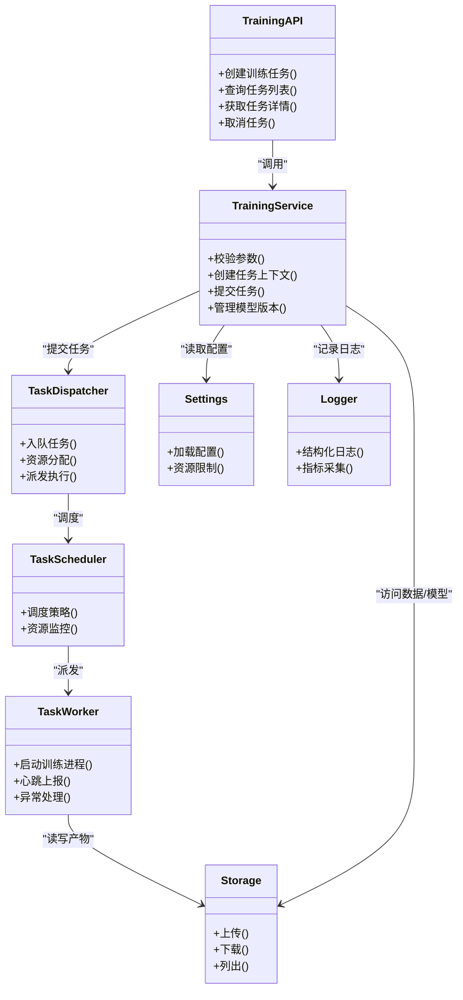

# 模型训练接口

<cite>
**本文引用的文件**   
- [backend/app/api/training.py](file://backend/app/api/training.py)
- [backend/app/schemas/training.py](file://backend/app/schemas/training.py)
- [backend/app/models/training.py](file://backend/app/models/training.py)
- [backend/app/services/trainer.py](file://backend/app/services/trainer.py)
- [backend/app/services/training_service.py](file://backend/app/services/training_service.py)
- [backend/app/tasks/dispatcher.py](file://backend/app/tasks/dispatcher.py)
- [backend/app/tasks/scheduler.py](file://backend/app/tasks/scheduler.py)
- [backend/app/tasks/task_worker.py](file://backend/app/tasks/task_worker.py)
- [backend/app/config/settings.py](file://backend/app/config/settings.py)
- [backend/app/core/logger.py](file://backend/app/core/logger.py)
- [backend/app/database/storage.py](file://backend/app/database/storage.py)
- [backend/app/api/datasets.py](file://backend/app/api/datasets.py)
- [backend/app/api/models.py](file://backend/app/api/models.py)
- [backend/app/api/tasks.py](file://backend/app/api/tasks.py)
- [backend/app/crud/task.py](file://backend/app/crud/task.py)
- [backend/app/services/train/README.md](file://backend/app/services/train/README.md)
- [backend/app/services/train/TRAINING_GUIDE.md](file://backend/app/services/train/TRAINING_GUIDE.md)
- [backend/app/services/train/config.py](file://backend/app/services/train/config.py)
- [backend/app/services/train/data_converter.py](file://backend/app/services/train/data_converter.py)
- [backend/app/services/train/train_lvis.py](file://backend/app/services/train/train_lvis.py)
</cite>

## 目录
1. [简介](#简介)
2. [项目结构](#项目结构)
3. [核心组件](#核心组件)
4. [架构总览](#架构总览)
5. [详细组件分析](#详细组件分析)
6. [依赖关系分析](#依赖关系分析)
7. [性能与资源管理](#性能与资源管理)
8. [故障恢复与可观测性](#故障恢复与可观测性)
9. [API 参考](#api-参考)
10. [排错指南](#排错指南)
11. [结论](#结论)
12. [附录：示例流程](#附录示例流程)

## 简介
本文件面向开发者，提供基于 FastAPI 的“模型训练接口”完整开发指南。内容覆盖训练任务调度、GPU 资源管理、模型版本控制、训练参数配置、日志收集与性能监控、训练环境隔离与资源限制、以及故障恢复机制。文档同时给出端到端的使用示例路径（通过源码引用），帮助快速实现训练任务提交、进度跟踪与评估指标上报。

## 项目结构
围绕模型训练能力，后端采用分层与职责分离设计：
- API 层：暴露 REST 接口，负责请求校验、权限与鉴权、响应封装
- 服务层：编排训练流程、数据集与模型生命周期管理、与任务调度器交互
- 任务层：异步任务分发、执行器工作进程、定时调度
- 数据层：数据库会话与对象存储（模型权重、日志、产物）
- 配置与日志：全局设置、结构化日志
- 训练脚本：具体训练实现（如 LVIS 目标检测训练）

图表来源
- [backend/app/api/training.py](file://backend/app/api/training.py)
- [backend/app/api/datasets.py](file://backend/app/api/datasets.py)
- [backend/app/api/models.py](file://backend/app/api/models.py)
- [backend/app/api/tasks.py](file://backend/app/api/tasks.py)
- [backend/app/services/training_service.py](file://backend/app/services/training_service.py)
- [backend/app/services/trainer.py](file://backend/app/services/trainer.py)
- [backend/app/tasks/dispatcher.py](file://backend/app/tasks/dispatcher.py)
- [backend/app/tasks/scheduler.py](file://backend/app/tasks/scheduler.py)
- [backend/app/tasks/task_worker.py](file://backend/app/tasks/task_worker.py)
- [backend/app/database/storage.py](file://backend/app/database/storage.py)
- [backend/app/config/settings.py](file://backend/app/config/settings.py)
- [backend/app/core/logger.py](file://backend/app/core/logger.py)
- [backend/app/services/train/config.py](file://backend/app/services/train/config.py)
- [backend/app/services/train/data_converter.py](file://backend/app/services/train/data_converter.py)
- [backend/app/services/train/train_lvis.py](file://backend/app/services/train/train_lvis.py)

章节来源
- [backend/app/api/training.py](file://backend/app/api/training.py)
- [backend/app/services/training_service.py](file://backend/app/services/training_service.py)
- [backend/app/tasks/dispatcher.py](file://backend/app/tasks/dispatcher.py)
- [backend/app/tasks/scheduler.py](file://backend/app/tasks/scheduler.py)
- [backend/app/tasks/task_worker.py](file://backend/app/tasks/task_worker.py)
- [backend/app/database/storage.py](file://backend/app/database/storage.py)
- [backend/app/config/settings.py](file://backend/app/config/settings.py)
- [backend/app/core/logger.py](file://backend/app/core/logger.py)
- [backend/app/services/train/README.md](file://backend/app/services/train/README.md)
- [backend/app/services/train/TRAINING_GUIDE.md](file://backend/app/services/train/TRAINING_GUIDE.md)

## 核心组件
- 训练 API 控制器：定义训练任务创建、查询、取消、进度与结果获取等接口
- 训练服务：编排训练流程、参数校验、资源分配、状态持久化、产物落盘
- 任务调度器与工作进程：将训练任务入队、按 GPU/CPU 资源约束调度、在独立进程中执行
- 数据集与模型管理：数据集注册、版本化；模型权重与元数据管理、版本发布
- 配置与日志：集中式配置加载、结构化日志输出、训练指标采集
- 训练脚本：具体算法实现入口（例如 LVIS 训练），读取配置、加载数据、执行训练并产出模型与指标

章节来源
- [backend/app/api/training.py](file://backend/app/api/training.py)
- [backend/app/services/training_service.py](file://backend/app/services/training_service.py)
- [backend/app/services/trainer.py](file://backend/app/services/trainer.py)
- [backend/app/api/datasets.py](file://backend/app/api/datasets.py)
- [backend/app/api/models.py](file://backend/app/api/models.py)
- [backend/app/tasks/dispatcher.py](file://backend/app/tasks/dispatcher.py)
- [backend/app/tasks/scheduler.py](file://backend/app/tasks/scheduler.py)
- [backend/app/tasks/task_worker.py](file://backend/app/tasks/task_worker.py)
- [backend/app/config/settings.py](file://backend/app/config/settings.py)
- [backend/app/core/logger.py](file://backend/app/core/logger.py)
- [backend/app/services/train/train_lvis.py](file://backend/app/services/train/train_lvis.py)

## 架构总览
训练请求从 API 进入，经服务层校验与编排后，由任务调度器根据资源策略分派到工作进程。工作进程拉取数据集与配置，执行训练脚本，期间持续写入日志与指标，完成后上传模型产物与元数据，更新任务状态。

图表来源
- [backend/app/api/training.py](file://backend/app/api/training.py)
- [backend/app/services/training_service.py](file://backend/app/services/training_service.py)
- [backend/app/tasks/dispatcher.py](file://backend/app/tasks/dispatcher.py)
- [backend/app/tasks/scheduler.py](file://backend/app/tasks/scheduler.py)
- [backend/app/tasks/task_worker.py](file://backend/app/tasks/task_worker.py)
- [backend/app/database/storage.py](file://backend/app/database/storage.py)
- [backend/app/services/train/train_lvis.py](file://backend/app/services/train/train_lvis.py)

## 详细组件分析

### 训练 API 控制器
- 职责
  - 接收训练任务创建请求，校验输入参数，调用训练服务创建任务
  - 提供任务列表、详情、取消、进度与结果查询接口
  - 与任务 API 协作，统一任务生命周期视图
- 关键要点
  - 使用 Pydantic Schema 进行请求体校验与响应序列化
  - 支持分页、过滤、排序（如按状态、时间范围）
  - 对长耗时操作采用异步任务模式，避免阻塞 HTTP 线程

章节来源
- [backend/app/api/training.py](file://backend/app/api/training.py)
- [backend/app/schemas/training.py](file://backend/app/schemas/training.py)
- [backend/app/api/tasks.py](file://backend/app/api/tasks.py)

### 训练服务
- 职责
  - 训练参数校验与默认值填充
  - 生成唯一任务 ID、构建任务上下文（数据集、模型、超参、资源需求）
  - 与对象存储交互，准备输入数据与输出目录
  - 与任务调度器对接，提交任务并监听状态变更
  - 维护模型版本元数据（名称、哈希、标签、关联任务）
- 关键要点
  - 幂等创建：重复提交同一任务时返回已有任务
  - 资源配额：依据配置限制并发与单任务资源上限
  - 产物管理：模型权重、配置文件、日志、指标统一落盘并索引

章节来源
- [backend/app/services/training_service.py](file://backend/app/services/training_service.py)
- [backend/app/services/trainer.py](file://backend/app/services/trainer.py)
- [backend/app/database/storage.py](file://backend/app/database/storage.py)
- [backend/app/config/settings.py](file://backend/app/config/settings.py)

### 任务调度与工作进程
- 职责
  - 任务队列管理与优先级调度
  - GPU/CPU 资源发现与分配，确保不超配
  - 工作进程拉起训练脚本，注入环境变量与资源限制
  - 心跳与超时处理，异常捕获与重试策略
- 关键要点
  - 资源感知：根据节点可用 GPU 数量与显存阈值选择执行节点
  - 隔离执行：每个任务在独立进程/容器内运行，防止相互干扰
  - 健康检查：定期心跳，长时间无心跳视为失败

章节来源
- [backend/app/tasks/dispatcher.py](file://backend/app/tasks/dispatcher.py)
- [backend/app/tasks/scheduler.py](file://backend/app/tasks/scheduler.py)
- [backend/app/tasks/task_worker.py](file://backend/app/tasks/task_worker.py)

### 数据集与模型管理
- 数据集
  - 注册数据集版本、校验格式、生成索引
  - 提供数据预览与统计信息
- 模型
  - 模型版本登记、元数据与权重文件绑定
  - 模型标签与发布流程，回滚与对比

章节来源
- [backend/app/api/datasets.py](file://backend/app/api/datasets.py)
- [backend/app/api/models.py](file://backend/app/api/models.py)

### 训练脚本（以 LVIS 为例）
- 职责
  - 解析训练配置、加载数据集、初始化模型与优化器
  - 执行训练循环，周期性保存检查点与指标
  - 训练结束后导出最终模型与评估报告
- 关键要点
  - 配置驱动：所有超参与路径来自配置对象
  - 指标上报：将损失、mAP 等指标写入对象存储或数据库
  - 断点续训：支持从最近检查点恢复

章节来源
- [backend/app/services/train/train_lvis.py](file://backend/app/services/train/train_lvis.py)
- [backend/app/services/train/config.py](file://backend/app/services/train/config.py)
- [backend/app/services/train/data_converter.py](file://backend/app/services/train/data_converter.py)
- [backend/app/services/train/README.md](file://backend/app/services/train/README.md)
- [backend/app/services/train/TRAINING_GUIDE.md](file://backend/app/services/train/TRAINING_GUIDE.md)

### 数据模型与 Schema
- 数据模型
  - 训练任务实体：包含任务 ID、状态、参数、资源需求、产物路径、时间戳等
- Schema
  - 请求/响应结构：用于 API 校验与文档生成

章节来源
- [backend/app/models/training.py](file://backend/app/models/training.py)
- [backend/app/schemas/training.py](file://backend/app/schemas/training.py)

## 依赖关系分析
- 模块耦合
  - API 层仅依赖服务层与 Schema，保持薄控制器
  - 服务层依赖任务层、存储与配置，承担业务编排
  - 任务层与外部训练脚本解耦，通过进程/容器边界隔离
- 外部依赖
  - 对象存储：存放数据集、模型权重、日志与指标
  - 数据库：持久化任务、模型与数据集元数据
  - 系统资源：GPU/CPU 探测与限制（cgroups/容器）

图表来源
- [backend/app/api/training.py](file://backend/app/api/training.py)
- [backend/app/services/training_service.py](file://backend/app/services/training_service.py)
- [backend/app/tasks/dispatcher.py](file://backend/app/tasks/dispatcher.py)
- [backend/app/tasks/scheduler.py](file://backend/app/tasks/scheduler.py)
- [backend/app/tasks/task_worker.py](file://backend/app/tasks/task_worker.py)
- [backend/app/database/storage.py](file://backend/app/database/storage.py)
- [backend/app/config/settings.py](file://backend/app/config/settings.py)
- [backend/app/core/logger.py](file://backend/app/core/logger.py)

章节来源
- [backend/app/api/training.py](file://backend/app/api/training.py)
- [backend/app/services/training_service.py](file://backend/app/services/training_service.py)
- [backend/app/tasks/dispatcher.py](file://backend/app/tasks/dispatcher.py)
- [backend/app/tasks/scheduler.py](file://backend/app/tasks/scheduler.py)
- [backend/app/tasks/task_worker.py](file://backend/app/tasks/task_worker.py)
- [backend/app/database/storage.py](file://backend/app/database/storage.py)
- [backend/app/config/settings.py](file://backend/app/config/settings.py)
- [backend/app/core/logger.py](file://backend/app/core/logger.py)

## 性能与资源管理
- GPU 资源管理
  - 节点级 GPU 探测与显存阈值判断，避免 OOM
  - 多卡并行与分布式训练的资源申请与拓扑选择
  - 任务级别资源配额与抢占策略
- CPU/内存限制
  - 通过 cgroups/容器限制 CPU 核数与内存上限
  - 动态扩缩容：根据队列长度与资源利用率调整工作进程数
- 训练性能优化
  - 数据预取与缓存、混合精度训练、梯度累积
  - 检查点增量保存与断点续训
- 监控与告警
  - 指标采集：GPU 利用率、显存占用、I/O 吞吐、训练速度
  - 告警规则：长时间低利用率、频繁失败、磁盘空间不足

章节来源
- [backend/app/config/settings.py](file://backend/app/config/settings.py)
- [backend/app/tasks/scheduler.py](file://backend/app/tasks/scheduler.py)
- [backend/app/tasks/task_worker.py](file://backend/app/tasks/task_worker.py)
- [backend/app/core/logger.py](file://backend/app/core/logger.py)

## 故障恢复与可观测性
- 故障恢复
  - 任务失败自动重试（指数退避）、最大重试次数限制
  - 检查点恢复：从最近成功检查点继续训练
  - 资源异常：节点失联、GPU 不可用时的任务迁移
- 可观测性
  - 结构化日志：任务 ID、阶段、指标、错误堆栈
  - 指标上报：训练损失、验证集 mAP、收敛曲线
  - 审计追踪：谁在何时提交了什么任务、修改了哪些模型版本

章节来源
- [backend/app/tasks/dispatcher.py](file://backend/app/tasks/dispatcher.py)
- [backend/app/tasks/task_worker.py](file://backend/app/tasks/task_worker.py)
- [backend/app/core/logger.py](file://backend/app/core/logger.py)
- [backend/app/database/storage.py](file://backend/app/database/storage.py)

## API 参考
以下为训练相关接口的概览说明（字段与行为以实际 Schema 为准）：
- 训练任务
  - 创建训练任务：POST /training/jobs
    - 请求体：训练参数、数据集版本、模型基线、资源需求、标签
    - 响应：任务 ID、初始状态、预计开始时间
  - 查询任务列表：GET /training/jobs
    - 查询参数：状态、时间范围、分页、排序
    - 响应：任务列表、总数、页码
  - 获取任务详情：GET /training/jobs/{job_id}
    - 响应：任务状态、进度、资源使用、产物链接、错误信息
  - 取消任务：POST /training/jobs/{job_id}/cancel
    - 响应：确认消息、当前状态
  - 获取进度与指标：GET /training/jobs/{job_id}/progress
    - 响应：轮次、损失、mAP、GPU 利用率、剩余时间估算
- 数据集管理
  - 注册数据集：POST /datasets
  - 查看数据集版本：GET /datasets/{dataset_id}/versions
  - 删除数据集：DELETE /datasets/{dataset_id}
- 模型管理
  - 登记模型版本：POST /models
  - 查看模型列表：GET /models
  - 发布/回滚模型：POST /models/{model_id}/publish, POST /models/{model_id}/rollback
- 通用任务
  - 任务状态查询：GET /tasks/{task_id}
  - 任务取消：POST /tasks/{task_id}/cancel

章节来源
- [backend/app/api/training.py](file://backend/app/api/training.py)
- [backend/app/api/datasets.py](file://backend/app/api/datasets.py)
- [backend/app/api/models.py](file://backend/app/api/models.py)
- [backend/app/api/tasks.py](file://backend/app/api/tasks.py)
- [backend/app/schemas/training.py](file://backend/app/schemas/training.py)

## 排错指南
- 常见问题
  - 任务排队过久：检查 GPU 资源是否耗尽、调度策略是否合理
  - 训练 OOM：降低批次大小、启用梯度累积、减少模型规模
  - 数据加载慢：开启数据缓存、增加 I/O 带宽、检查网络存储延迟
  - 指标缺失：确认训练脚本是否正确上报指标、对象存储权限
- 定位方法
  - 查看任务日志：通过任务 ID 检索结构化日志
  - 检查资源使用：GPU/CPU/内存/磁盘 I/O 监控面板
  - 核对配置：学习率、优化器、数据路径、设备映射
- 恢复步骤
  - 从检查点恢复：指定最近检查点路径重新提交任务
  - 清理残留：删除失败任务的临时文件与锁
  - 重试策略：调整最大重试次数与退避间隔

章节来源
- [backend/app/core/logger.py](file://backend/app/core/logger.py)
- [backend/app/tasks/task_worker.py](file://backend/app/tasks/task_worker.py)
- [backend/app/database/storage.py](file://backend/app/database/storage.py)

## 结论
本方案通过 API 层、服务层、任务层与数据层的清晰分层，结合资源感知的调度与隔离执行，实现了可扩展、可观测、可恢复的模型训练平台。配合数据集与模型版本化管理，形成完整的训练闭环，满足生产环境的稳定性与效率要求。

## 附录：示例流程
以下示例展示典型训练流程的关键步骤与对应源码位置，便于快速上手：
- 提交训练任务
  - 构造训练参数与资源需求，调用训练 API 创建任务
  - 参考路径：[创建训练任务接口](file://backend/app/api/training.py)
- 进度跟踪
  - 轮询任务进度与指标，展示训练曲线
  - 参考路径：[任务进度查询](file://backend/app/api/training.py)
- 模型评估指标
  - 从对象存储或数据库获取 mAP、损失等指标
  - 参考路径：[训练脚本指标上报](file://backend/app/services/train/train_lvis.py)
- 模型部署
  - 将最新模型版本标记为发布，供推理服务使用
  - 参考路径：[模型发布接口](file://backend/app/api/models.py)

章节来源
- [backend/app/api/training.py](file://backend/app/api/training.py)
- [backend/app/api/models.py](file://backend/app/api/models.py)
- [backend/app/services/train/train_lvis.py](file://backend/app/services/train/train_lvis.py)