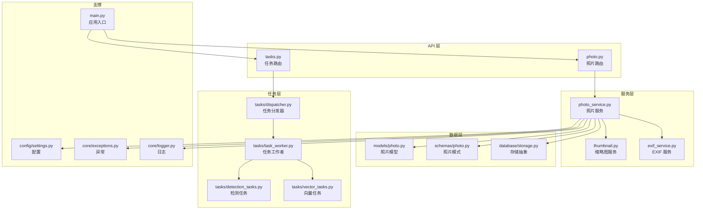
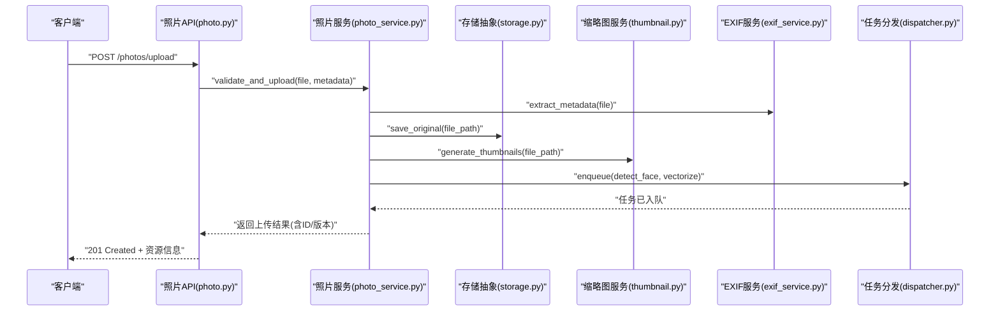
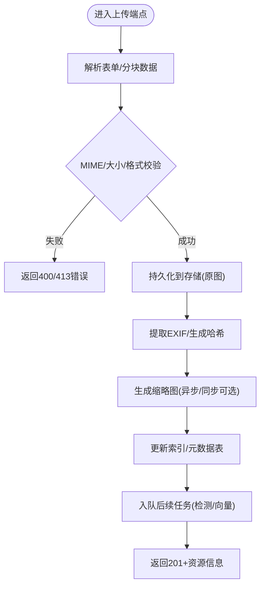
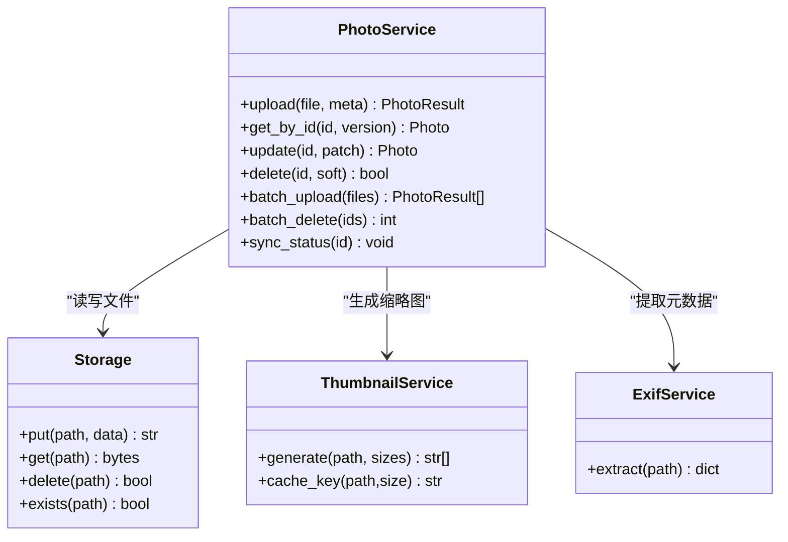
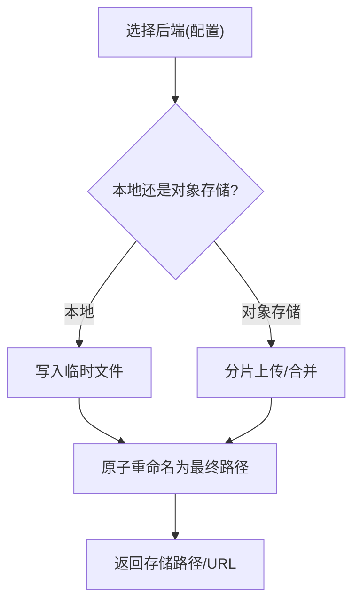
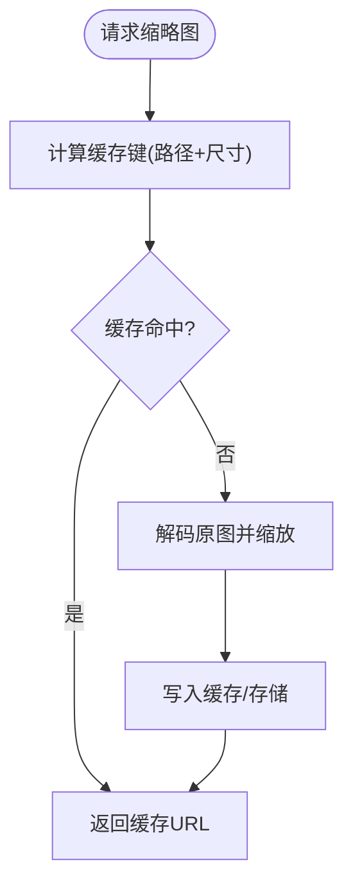
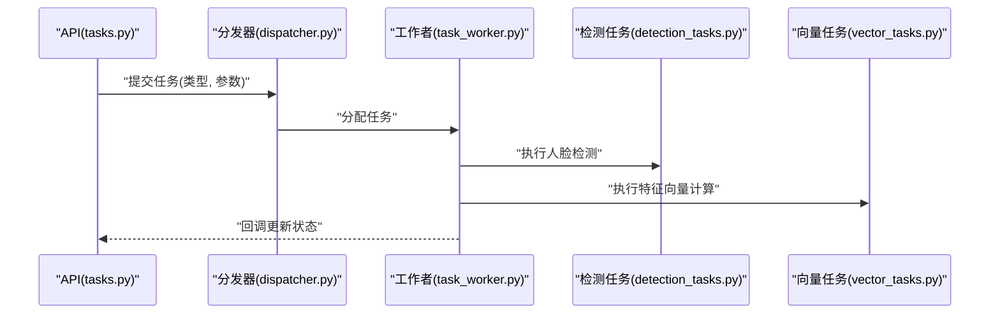
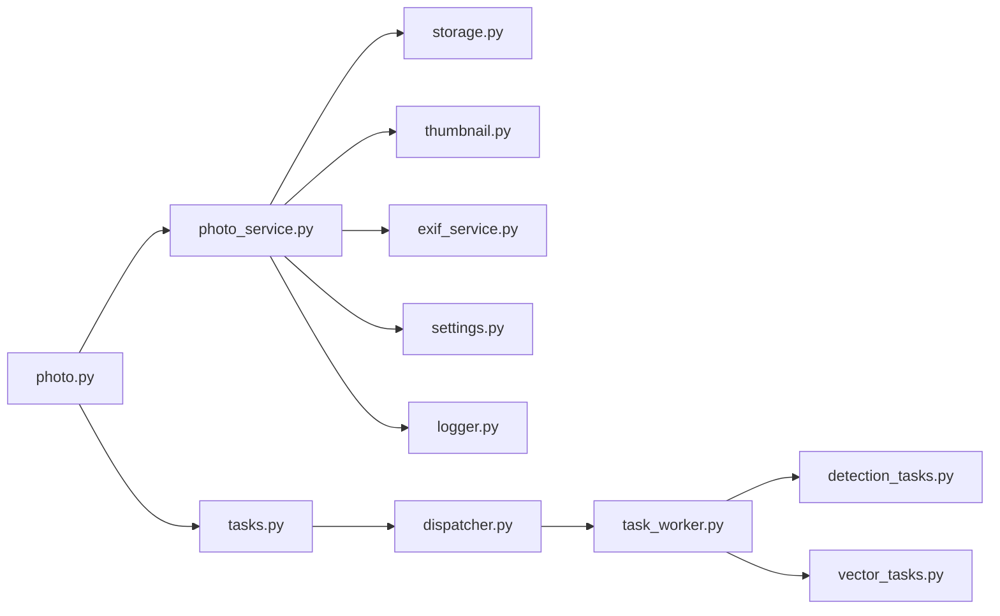

# 照片管理接口

<cite>
**本文引用的文件**   
- [main.py](file://backend/main.py)
- [photo.py](file://backend/app/api/photo.py)
- [photo_service.py](file://backend/app/services/photo_service.py)
- [thumbnail.py](file://backend/app/services/thumbnail.py)
- [exif_service.py](file://backend/app/services/exif_service.py)
- [storage.py](file://backend/app/database/storage.py)
- [photo_model.py](file://backend/app/models/photo.py)
- [photo_schema.py](file://backend/app/schemas/photo.py)
- [tasks.py](file://backend/app/api/tasks.py)
- [dispatcher.py](file://backend/app/tasks/dispatcher.py)
- [task_worker.py](file://backend/app/tasks/task_worker.py)
- [detection_tasks.py](file://backend/app/tasks/detection_tasks.py)
- [vector_tasks.py](file://backend/app/tasks/vector_tasks.py)
- [settings.py](file://backend/app/config/settings.py)
- [exceptions.py](file://backend/app/core/exceptions.py)
- [logger.py](file://backend/app/core/logger.py)
</cite>

## 目录
1. [简介](#简介)
2. [项目结构](#项目结构)
3. [核心组件](#核心组件)
4. [架构总览](#架构总览)
5. [详细组件分析](#详细组件分析)
6. [依赖关系分析](#依赖关系分析)
7. [性能考虑](#性能考虑)
8. [故障排查指南](#故障排查指南)
9. [结论](#结论)
10. [附录](#附录)

## 简介
本文件面向开发者，提供基于 FastAPI 的照片管理接口开发指南。内容覆盖上传、下载、删除、批量操作、元数据提取、缩略图生成、版本管理、异步任务集成、大文件处理、存储后端抽象层设计、状态同步机制、性能优化策略、缓存机制、错误恢复与重试逻辑等。文档以代码级分析与可视化为主，帮助快速理解并扩展系统能力。

## 项目结构
后端采用分层架构：API 层负责路由与参数校验；服务层封装业务逻辑；模型与模式定义数据契约；数据库与存储层提供持久化与对象存储抽象；任务层负责异步处理（如检测、向量化、缩略图）。配置与日志贯穿各层。

图表来源
- [main.py:1-200](file://backend/main.py#L1-L200)
- [photo.py:1-200](file://backend/app/api/photo.py#L1-L200)
- [photo_service.py:1-200](file://backend/app/services/photo_service.py#L1-L200)
- [thumbnail.py:1-200](file://backend/app/services/thumbnail.py#L1-L200)
- [exif_service.py:1-200](file://backend/app/services/exif_service.py#L1-L200)
- [storage.py:1-200](file://backend/app/database/storage.py#L1-L200)
- [photo_model.py:1-200](file://backend/app/models/photo.py#L1-L200)
- [photo_schema.py:1-200](file://backend/app/schemas/photo.py#L1-L200)
- [tasks.py:1-200](file://backend/app/api/tasks.py#L1-L200)
- [dispatcher.py:1-200](file://backend/app/tasks/dispatcher.py#L1-L200)
- [task_worker.py:1-200](file://backend/app/tasks/task_worker.py#L1-L200)
- [detection_tasks.py:1-200](file://backend/app/tasks/detection_tasks.py#L1-L200)
- [vector_tasks.py:1-200](file://backend/app/tasks/vector_tasks.py#L1-L200)
- [settings.py:1-200](file://backend/app/config/settings.py#L1-L200)
- [exceptions.py:1-200](file://backend/app/core/exceptions.py#L1-L200)
- [logger.py:1-200](file://backend/app/core/logger.py#L1-L200)

章节来源
- [main.py:1-200](file://backend/main.py#L1-L200)
- [photo.py:1-200](file://backend/app/api/photo.py#L1-L200)
- [photo_service.py:1-200](file://backend/app/services/photo_service.py#L1-L200)
- [thumbnail.py:1-200](file://backend/app/services/thumbnail.py#L1-L200)
- [exif_service.py:1-200](file://backend/app/services/exif_service.py#L1-L200)
- [storage.py:1-200](file://backend/app/database/storage.py#L1-L200)
- [photo_model.py:1-200](file://backend/app/models/photo.py#L1-L200)
- [photo_schema.py:1-200](file://backend/app/schemas/photo.py#L1-L200)
- [tasks.py:1-200](file://backend/app/api/tasks.py#L1-L200)
- [dispatcher.py:1-200](file://backend/app/tasks/dispatcher.py#L1-L200)
- [task_worker.py:1-200](file://backend/app/tasks/task_worker.py#L1-L200)
- [detection_tasks.py:1-200](file://backend/app/tasks/detection_tasks.py#L1-L200)
- [vector_tasks.py:1-200](file://backend/app/tasks/vector_tasks.py#L1-L200)
- [settings.py:1-200](file://backend/app/config/settings.py#L1-L200)
- [exceptions.py:1-200](file://backend/app/core/exceptions.py#L1-L200)
- [logger.py:1-200](file://backend/app/core/logger.py#L1-L200)

## 核心组件
- 照片 API 路由：提供上传、下载、删除、列表、搜索、批量操作等端点，负责请求解析、权限校验、响应格式化。
- 照片服务：封装上传流程、元数据提取、缩略图生成、版本管理、索引更新、事务控制。
- 存储抽象层：统一本地磁盘与对象存储（如 S3）的读写接口，支持分片上传、断点续传、路径命名策略。
- 缩略图服务：根据原图尺寸与配置生成多规格缩略图，支持缓存命中与回退策略。
- EXIF 服务：读取图片元数据（时间、位置、设备信息），用于检索与展示。
- 任务分发与工作者：将耗时任务（人脸检测、特征向量计算、缩略图生成）异步化，保障主线程吞吐。
- 配置与日志：集中式配置项（存储路径、并发度、超时、重试次数）与结构化日志输出。

章节来源
- [photo.py:1-200](file://backend/app/api/photo.py#L1-L200)
- [photo_service.py:1-200](file://backend/app/services/photo_service.py#L1-L200)
- [storage.py:1-200](file://backend/app/database/storage.py#L1-L200)
- [thumbnail.py:1-200](file://backend/app/services/thumbnail.py#L1-L200)
- [exif_service.py:1-200](file://backend/app/services/exif_service.py#L1-L200)
- [dispatcher.py:1-200](file://backend/app/tasks/dispatcher.py#L1-L200)
- [task_worker.py:1-200](file://backend/app/tasks/task_worker.py#L1-L200)
- [settings.py:1-200](file://backend/app/config/settings.py#L1-L200)
- [logger.py:1-200](file://backend/app/core/logger.py#L1-L200)

## 架构总览
整体采用“API -> Service -> Storage/Task”的分层调用链。上传时，API 接收文件流，服务层进行校验与元数据处理，写入存储后触发异步任务（缩略图、检测、向量）。下载与删除直接通过存储抽象层完成。

图表来源
- [photo.py:1-200](file://backend/app/api/photo.py#L1-L200)
- [photo_service.py:1-200](file://backend/app/services/photo_service.py#L1-L200)
- [storage.py:1-200](file://backend/app/database/storage.py#L1-L200)
- [thumbnail.py:1-200](file://backend/app/services/thumbnail.py#L1-L200)
- [exif_service.py:1-200](file://backend/app/services/exif_service.py#L1-L200)
- [dispatcher.py:1-200](file://backend/app/tasks/dispatcher.py#L1-L200)

## 详细组件分析

### 照片 API 路由（上传/下载/删除/批量）
- 上传：支持单文件与多文件上传，校验 MIME 类型与大小，记录原始文件名与哈希，返回唯一 ID 与初始版本。
- 下载：按 ID 与版本获取原图或缩略图，支持范围请求与条件请求（ETag）。
- 删除：软删除标记与物理删除两种模式，支持回收站恢复。
- 批量：批量上传、批量删除、批量打标签、批量移动相册。
- 分页与筛选：按时间、相册、标签、拍摄地点、人脸聚类结果过滤。

图表来源
- [photo.py:1-200](file://backend/app/api/photo.py#L1-L200)
- [photo_service.py:1-200](file://backend/app/services/photo_service.py#L1-L200)
- [storage.py:1-200](file://backend/app/database/storage.py#L1-L200)
- [thumbnail.py:1-200](file://backend/app/services/thumbnail.py#L1-L200)
- [exif_service.py:1-200](file://backend/app/services/exif_service.py#L1-L200)

章节来源
- [photo.py:1-200](file://backend/app/api/photo.py#L1-L200)

### 照片服务（CRUD/版本管理/状态同步）
- 创建：生成唯一 ID、版本号、路径策略（按日期/哈希分桶），写入元数据与索引。
- 读取：按 ID/版本查询，支持缩略图优先与缓存命中。
- 更新：修改标签、描述、相册归属；支持增量更新与幂等性。
- 删除：软删除标记、清理缩略图、更新索引、回收站保留期。
- 版本管理：每次覆盖保存递增版本，保留历史快照，支持回滚。
- 状态同步：上传完成后触发缩略图/检测/向量任务，任务完成回调更新状态字段。

图表来源
- [photo_service.py:1-200](file://backend/app/services/photo_service.py#L1-L200)
- [storage.py:1-200](file://backend/app/database/storage.py#L1-L200)
- [thumbnail.py:1-200](file://backend/app/services/thumbnail.py#L1-L200)
- [exif_service.py:1-200](file://backend/app/services/exif_service.py#L1-L200)

章节来源
- [photo_service.py:1-200](file://backend/app/services/photo_service.py#L1-L200)

### 存储抽象层（本地/对象存储）
- 接口统一：put/get/delete/exists/list，屏蔽底层差异。
- 路径策略：按租户/用户/日期/哈希多级目录，避免单目录过大。
- 分片与断点续传：大文件分片上传，合并校验，失败重试。
- 一致性：原子写入（临时文件+重命名），保证读一致。
- 可插拔：通过配置切换后端（本地磁盘、S3、MinIO）。

图表来源
- [storage.py:1-200](file://backend/app/database/storage.py#L1-L200)
- [settings.py:1-200](file://backend/app/config/settings.py#L1-L200)

章节来源
- [storage.py:1-200](file://backend/app/database/storage.py#L1-L200)
- [settings.py:1-200](file://backend/app/config/settings.py#L1-L200)

### 缩略图服务（生成/缓存/回退）
- 多规格：根据配置生成多种尺寸（小/中/大），兼顾清晰度与体积。
- 缓存键：基于原图路径与尺寸生成稳定键，命中则直接返回。
- 回退：若生成失败，返回原图或占位图，确保可用性。
- 异步：默认异步生成，避免阻塞上传链路。

图表来源
- [thumbnail.py:1-200](file://backend/app/services/thumbnail.py#L1-L200)

章节来源
- [thumbnail.py:1-200](file://backend/app/services/thumbnail.py#L1-L200)

### EXIF 服务（元数据提取）
- 字段：拍摄时间、GPS、相机型号、分辨率、方向等。
- 容错：缺失或损坏 EXIF 时返回空字典，不中断主流程。
- 用途：用于检索、地图展示、智能排序。

章节来源
- [exif_service.py:1-200](file://backend/app/services/exif_service.py#L1-L200)

### 任务分发与工作者（异步/重试/状态同步）
- 分发器：维护任务队列，按优先级与资源池调度。
- 工作者：执行具体任务（检测、向量、缩略图），支持重试与失败告警。
- 状态同步：任务完成回调更新照片状态字段，前端轮询或事件推送。

图表来源
- [tasks.py:1-200](file://backend/app/api/tasks.py#L1-L200)
- [dispatcher.py:1-200](file://backend/app/tasks/dispatcher.py#L1-L200)
- [task_worker.py:1-200](file://backend/app/tasks/task_worker.py#L1-L200)
- [detection_tasks.py:1-200](file://backend/app/tasks/detection_tasks.py#L1-L200)
- [vector_tasks.py:1-200](file://backend/app/tasks/vector_tasks.py#L1-L200)

章节来源
- [tasks.py:1-200](file://backend/app/api/tasks.py#L1-L200)
- [dispatcher.py:1-200](file://backend/app/tasks/dispatcher.py#L1-L200)
- [task_worker.py:1-200](file://backend/app/tasks/task_worker.py#L1-L200)
- [detection_tasks.py:1-200](file://backend/app/tasks/detection_tasks.py#L1-L200)
- [vector_tasks.py:1-200](file://backend/app/tasks/vector_tasks.py#L1-L200)

### 数据模型与模式（模型/模式）
- 模型：定义照片实体字段（ID、版本、路径、状态、标签、相册、时间戳等）。
- 模式：定义请求/响应结构，约束必填字段与类型，便于自动校验与文档生成。

章节来源
- [photo_model.py:1-200](file://backend/app/models/photo.py#L1-L200)
- [photo_schema.py:1-200](file://backend/app/schemas/photo.py#L1-L200)

## 依赖关系分析
- API 层依赖服务层，服务层依赖存储抽象、缩略图与 EXIF 服务。
- 任务层独立于 API 主流程，通过分发器解耦。
- 配置与日志为横切关注点，被多处引用。

图表来源
- [photo.py:1-200](file://backend/app/api/photo.py#L1-L200)
- [photo_service.py:1-200](file://backend/app/services/photo_service.py#L1-L200)
- [storage.py:1-200](file://backend/app/database/storage.py#L1-L200)
- [thumbnail.py:1-200](file://backend/app/services/thumbnail.py#L1-L200)
- [exif_service.py:1-200](file://backend/app/services/exif_service.py#L1-L200)
- [tasks.py:1-200](file://backend/app/api/tasks.py#L1-L200)
- [dispatcher.py:1-200](file://backend/app/tasks/dispatcher.py#L1-L200)
- [task_worker.py:1-200](file://backend/app/tasks/task_worker.py#L1-L200)
- [detection_tasks.py:1-200](file://backend/app/tasks/detection_tasks.py#L1-L200)
- [vector_tasks.py:1-200](file://backend/app/tasks/vector_tasks.py#L1-L200)
- [settings.py:1-200](file://backend/app/config/settings.py#L1-L200)
- [logger.py:1-200](file://backend/app/core/logger.py#L1-L200)

章节来源
- [photo.py:1-200](file://backend/app/api/photo.py#L1-L200)
- [photo_service.py:1-200](file://backend/app/services/photo_service.py#L1-L200)
- [storage.py:1-200](file://backend/app/database/storage.py#L1-L200)
- [thumbnail.py:1-200](file://backend/app/services/thumbnail.py#L1-L200)
- [exif_service.py:1-200](file://backend/app/services/exif_service.py#L1-L200)
- [tasks.py:1-200](file://backend/app/api/tasks.py#L1-L200)
- [dispatcher.py:1-200](file://backend/app/tasks/dispatcher.py#L1-L200)
- [task_worker.py:1-200](file://backend/app/tasks/task_worker.py#L1-L200)
- [detection_tasks.py:1-200](file://backend/app/tasks/detection_tasks.py#L1-L200)
- [vector_tasks.py:1-200](file://backend/app/tasks/vector_tasks.py#L1-L200)
- [settings.py:1-200](file://backend/app/config/settings.py#L1-L200)
- [logger.py:1-200](file://backend/app/core/logger.py#L1-L200)

## 性能考虑
- 大文件上传：启用分片与断点续传，服务端合并时做完整性校验；限制最大文件大小与并发数。
- 缩略图生成：使用内存映射与多线程/进程池并行处理；对热点缩略图加缓存（本地/Redis）。
- 元数据提取：EXIF 读取失败时降级为空，避免阻塞；必要时异步批处理。
- 存储 I/O：原子写入减少竞争；对象存储使用预签名 URL 直传，降低网关压力。
- 任务队列：按优先级与资源池调度，避免长尾任务拖垮系统；设置超时与重试上限。
- 缓存策略：缩略图与热门原图缓存；ETag 与条件请求减少带宽消耗。

[本节为通用指导，无需特定文件来源]

## 故障排查指南
- 常见错误：
  - 400/413：文件格式不支持或超过大小限制，检查 API 校验与配置阈值。
  - 500：存储不可用或权限不足，检查后端配置与网络连通性。
  - 任务失败：查看工作者日志与重试计数，确认外部依赖（检测模型、向量库）可用。
- 定位方法：
  - 开启结构化日志，记录关键步骤（上传开始、存储写入、缩略图生成、任务入队/完成）。
  - 使用异常类型区分业务错误与系统错误，便于前端提示与监控告警。
- 恢复策略：
  - 任务失败指数退避重试，超过上限转入死信队列人工干预。
  - 缩略图生成失败回退至原图或占位图，保证可用性。

章节来源
- [exceptions.py:1-200](file://backend/app/core/exceptions.py#L1-L200)
- [logger.py:1-200](file://backend/app/core/logger.py#L1-L200)

## 结论
本指南围绕照片管理的核心能力，从 API 到服务、存储、任务与配置，提供了端到端的实现思路与最佳实践。通过分层与抽象，系统具备良好的可扩展性与稳定性。建议在生产环境结合监控与告警，持续优化性能与可靠性。

[本节为总结，无需特定文件来源]

## 附录
- 示例用法（以路径代替代码片段）：
  - 上传单张照片：参考 [photo.py:1-200](file://backend/app/api/photo.py#L1-L200) 中的上传端点与 [photo_service.py:1-200](file://backend/app/services/photo_service.py#L1-L200) 的上传流程。
  - 下载原图/缩略图：参考 [photo.py:1-200](file://backend/app/api/photo.py#L1-L200) 与 [thumbnail.py:1-200](file://backend/app/services/thumbnail.py#L1-L200)。
  - 删除照片（软删/硬删）：参考 [photo_service.py:1-200](file://backend/app/services/photo_service.py#L1-L200)。
  - 批量上传/删除：参考 [photo.py:1-200](file://backend/app/api/photo.py#L1-L200) 与 [photo_service.py:1-200](file://backend/app/services/photo_service.py#L1-L200)。
  - 任务提交与状态同步：参考 [tasks.py:1-200](file://backend/app/api/tasks.py#L1-L200)、[dispatcher.py:1-200](file://backend/app/tasks/dispatcher.py#L1-L200)、[task_worker.py:1-200](file://backend/app/tasks/task_worker.py#L1-L200)。
  - 存储后端切换：参考 [storage.py:1-200](file://backend/app/database/storage.py#L1-L200) 与 [settings.py:1-200](file://backend/app/config/settings.py#L1-L200)。

章节来源
- [photo.py:1-200](file://backend/app/api/photo.py#L1-L200)
- [photo_service.py:1-200](file://backend/app/services/photo_service.py#L1-L200)
- [thumbnail.py:1-200](file://backend/app/services/thumbnail.py#L1-L200)
- [tasks.py:1-200](file://backend/app/api/tasks.py#L1-L200)
- [dispatcher.py:1-200](file://backend/app/tasks/dispatcher.py#L1-L200)
- [task_worker.py:1-200](file://backend/app/tasks/task_worker.py#L1-L200)
- [storage.py:1-200](file://backend/app/database/storage.py#L1-L200)
- [settings.py:1-200](file://backend/app/config/settings.py#L1-L200)