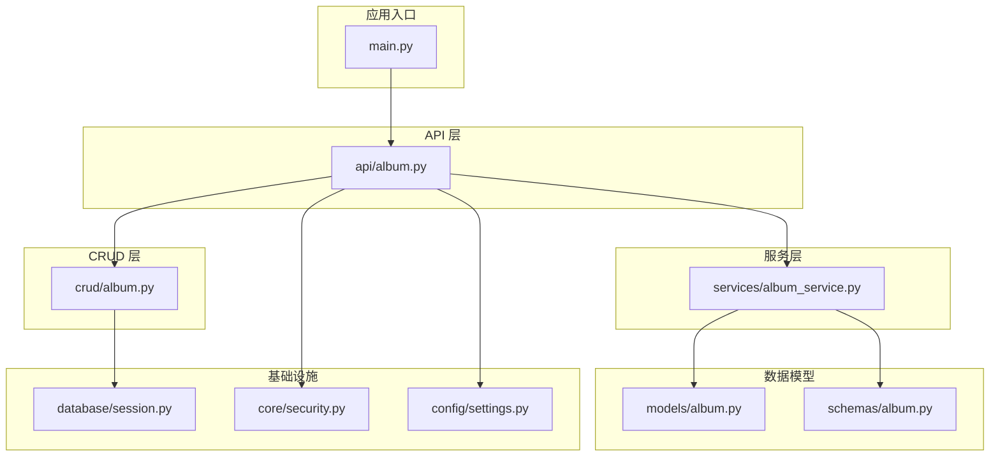
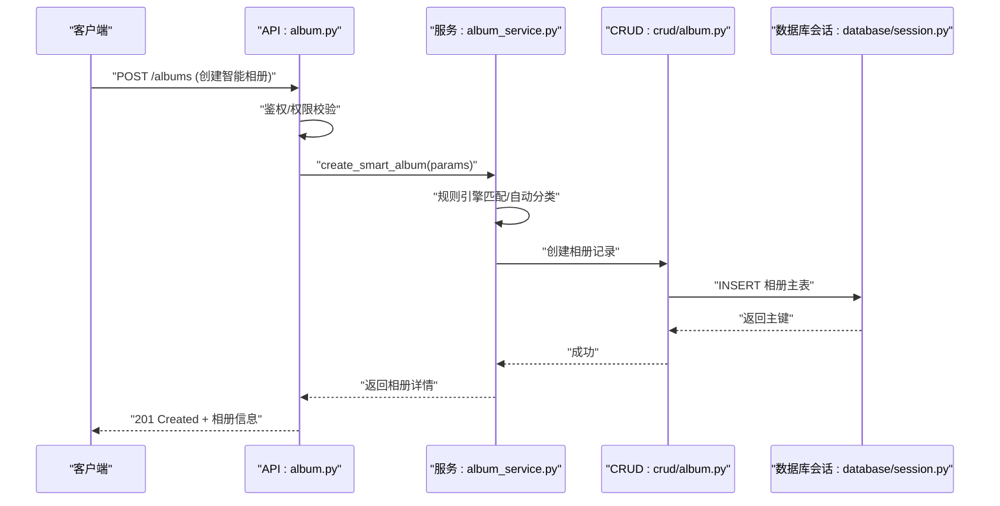
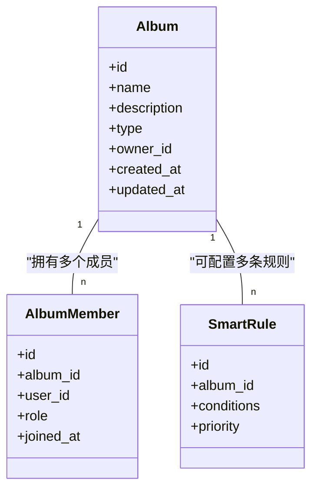
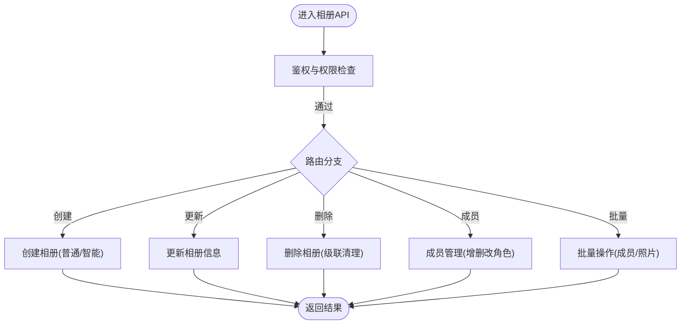
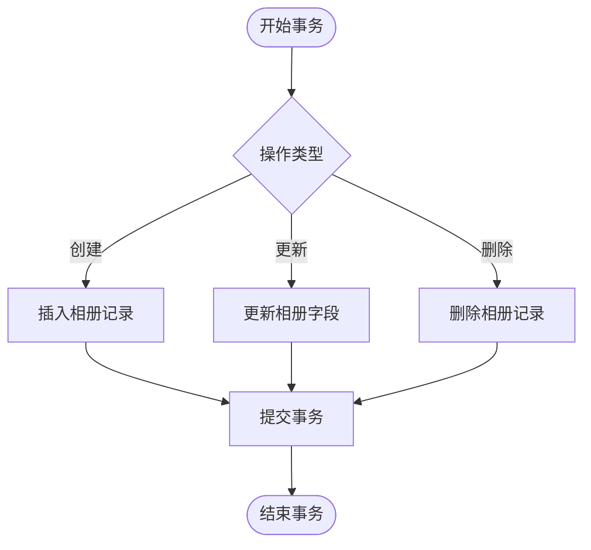
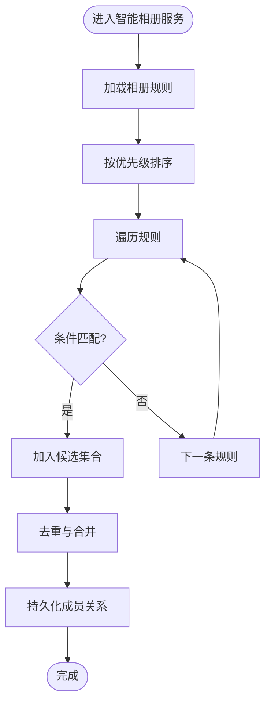
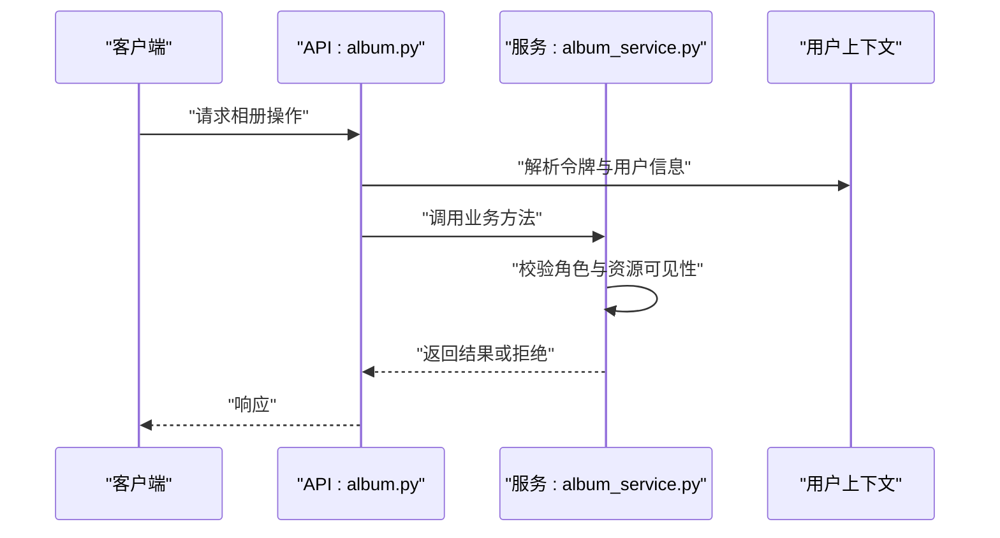
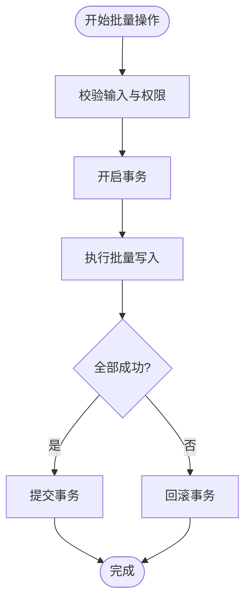
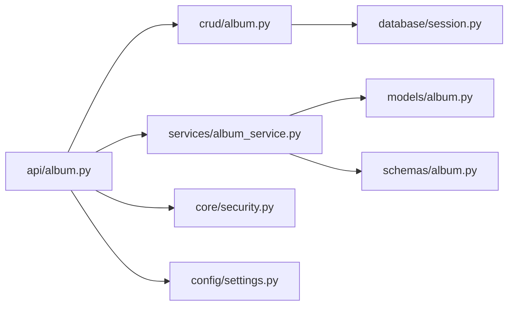

# 相册管理接口

<cite>
**本文引用的文件**   
- [backend/app/api/album.py](file://backend/app/api/album.py)
- [backend/app/crud/album.py](file://backend/app/crud/album.py)
- [backend/app/models/album.py](file://backend/app/models/album.py)
- [backend/app/schemas/album.py](file://backend/app/schemas/album.py)
- [backend/app/services/album_service.py](file://backend/app/services/album_service.py)
- [backend/app/database/session.py](file://backend/app/database/session.py)
- [backend/app/core/security.py](file://backend/app/core/security.py)
- [backend/app/config/settings.py](file://backend/app/config/settings.py)
- [backend/main.py](file://backend/main.py)
</cite>

## 目录
1. [简介](#简介)
2. [项目结构](#项目结构)
3. [核心组件](#核心组件)
4. [架构总览](#架构总览)
5. [详细组件分析](#详细组件分析)
6. [依赖关系分析](#依赖关系分析)
7. [性能考虑](#性能考虑)
8. [故障排查指南](#故障排查指南)
9. [结论](#结论)
10. [附录](#附录)

## 简介
本文件面向开发者，提供基于 FastAPI 的“相册管理接口”完整开发指南。内容覆盖：
- 相册创建、编辑、删除、成员管理等基础 CRUD 与协作能力
- 智能相册规则引擎与自动分类算法的技术实现思路
- 相册共享机制与权限控制模型
- 批量操作与数据一致性保证策略
- 搜索优化、索引策略与查询性能调优建议
- 结合代码路径的示例说明（以源码位置引用代替具体代码片段）

## 项目结构
后端采用分层架构：API 层负责路由与参数校验；CRUD 层封装数据库操作；服务层承载业务逻辑（含智能相册、标签、向量检索等）；模型与模式定义数据契约；配置与安全模块提供鉴权与系统设置。

图表来源
- [backend/main.py](file://backend/main.py)
- [backend/app/api/album.py](file://backend/app/api/album.py)
- [backend/app/crud/album.py](file://backend/app/crud/album.py)
- [backend/app/services/album_service.py](file://backend/app/services/album_service.py)
- [backend/app/models/album.py](file://backend/app/models/album.py)
- [backend/app/schemas/album.py](file://backend/app/schemas/album.py)
- [backend/app/database/session.py](file://backend/app/database/session.py)
- [backend/app/core/security.py](file://backend/app/core/security.py)
- [backend/app/config/settings.py](file://backend/app/config/settings.py)

章节来源
- [backend/main.py](file://backend/main.py)
- [backend/app/api/album.py](file://backend/app/api/album.py)
- [backend/app/crud/album.py](file://backend/app/crud/album.py)
- [backend/app/services/album_service.py](file://backend/app/services/album_service.py)
- [backend/app/models/album.py](file://backend/app/models/album.py)
- [backend/app/schemas/album.py](file://backend/app/schemas/album.py)
- [backend/app/database/session.py](file://backend/app/database/session.py)
- [backend/app/core/security.py](file://backend/app/core/security.py)
- [backend/app/config/settings.py](file://backend/app/config/settings.py)

## 核心组件
- API 路由层：暴露相册相关 REST 端点，处理请求解析、鉴权、响应格式化。
- CRUD 层：对相册实体进行增删改查，维护相册与成员关系表。
- 服务层：编排复杂业务，如智能相册规则匹配、自动分类、批量任务调度、事务边界控制。
- 数据模型与模式：定义相册、成员、规则、标签等数据结构及输入输出校验。
- 安全与配置：统一鉴权中间件、权限判定、系统配置项加载。

章节来源
- [backend/app/api/album.py](file://backend/app/api/album.py)
- [backend/app/crud/album.py](file://backend/app/crud/album.py)
- [backend/app/services/album_service.py](file://backend/app/services/album_service.py)
- [backend/app/models/album.py](file://backend/app/models/album.py)
- [backend/app/schemas/album.py](file://backend/app/schemas/album.py)
- [backend/app/core/security.py](file://backend/app/core/security.py)
- [backend/app/config/settings.py](file://backend/app/config/settings.py)

## 架构总览
下图展示一次“创建智能相册”的典型调用链：API 接收请求并校验，服务层执行规则匹配与自动分类，CRUD 持久化数据，数据库会话负责连接与事务。

图表来源
- [backend/app/api/album.py](file://backend/app/api/album.py)
- [backend/app/services/album_service.py](file://backend/app/services/album_service.py)
- [backend/app/crud/album.py](file://backend/app/crud/album.py)
- [backend/app/database/session.py](file://backend/app/database/session.py)

## 详细组件分析

### 相册数据模型与模式
- 数据模型：包含相册基本信息（名称、描述、类型、可见性）、所有者、时间戳等字段；支持普通相册与智能相册两种类型。
- 输入模式：用于创建/更新时的参数校验，包括必填字段、长度限制、枚举值约束等。
- 输出模式：对外返回的相册对象结构，包含成员列表、统计信息等扩展字段。

图表来源
- [backend/app/models/album.py](file://backend/app/models/album.py)
- [backend/app/schemas/album.py](file://backend/app/schemas/album.py)

章节来源
- [backend/app/models/album.py](file://backend/app/models/album.py)
- [backend/app/schemas/album.py](file://backend/app/schemas/album.py)

### API 路由层（相册 CRUD 与成员管理）
- 创建相册：支持普通相册与智能相册，传入名称、描述、类型、规则条件等。
- 更新相册：修改基本信息、切换可见性、调整规则优先级。
- 删除相册：软删除或硬删除，级联清理成员与关联数据。
- 成员管理：添加/移除成员、变更角色（管理员/编辑者/查看者）。
- 批量操作：批量添加成员、批量移动照片到相册。
- 鉴权与权限：基于当前用户上下文与相册角色进行访问控制。

图表来源
- [backend/app/api/album.py](file://backend/app/api/album.py)
- [backend/app/core/security.py](file://backend/app/core/security.py)

章节来源
- [backend/app/api/album.py](file://backend/app/api/album.py)
- [backend/app/core/security.py](file://backend/app/core/security.py)

### CRUD 层（数据持久化与事务）
- 创建/更新/删除：封装 SQL 或 ORM 操作，确保外键约束与唯一性。
- 成员关系：维护相册-用户多对多关系，支持角色字段与加入时间。
- 事务控制：在批量操作中开启事务，失败时回滚以保证一致性。
- 并发控制：使用乐观锁或行级锁避免竞态条件。

图表来源
- [backend/app/crud/album.py](file://backend/app/crud/album.py)
- [backend/app/database/session.py](file://backend/app/database/session.py)

章节来源
- [backend/app/crud/album.py](file://backend/app/crud/album.py)
- [backend/app/database/session.py](file://backend/app/database/session.py)

### 服务层（智能相册规则引擎与自动分类）
- 规则引擎：将用户定义的规则转换为可执行的条件表达式，按优先级顺序匹配。
- 自动分类：基于标签、时间、地点、人脸等特征进行分组，生成候选集合。
- 增量更新：当新照片入库时触发规则重算，仅更新受影响相册。
- 幂等性：同一规则多次执行不会产生重复成员。

图表来源
- [backend/app/services/album_service.py](file://backend/app/services/album_service.py)
- [backend/app/models/album.py](file://backend/app/models/album.py)

章节来源
- [backend/app/services/album_service.py](file://backend/app/services/album_service.py)
- [backend/app/models/album.py](file://backend/app/models/album.py)

### 权限控制与共享机制
- 角色模型：管理员、编辑者、查看者，不同角色具备不同操作权限。
- 资源隔离：每个相册有明确的所有者与可见范围（私有/组织/公开）。
- 鉴权流程：API 层根据令牌解析用户身份，服务层校验角色与资源归属。
- 审计日志：关键操作记录操作人、时间与变更摘要。

图表来源
- [backend/app/api/album.py](file://backend/app/api/album.py)
- [backend/app/services/album_service.py](file://backend/app/services/album_service.py)
- [backend/app/core/security.py](file://backend/app/core/security.py)

章节来源
- [backend/app/api/album.py](file://backend/app/api/album.py)
- [backend/app/services/album_service.py](file://backend/app/services/album_service.py)
- [backend/app/core/security.py](file://backend/app/core/security.py)

### 批量操作与数据一致性
- 批量成员管理：一次性为相册添加/移除多名成员，失败时整体回滚。
- 批量照片迁移：将一批照片移动到目标相册，保持源相册计数一致。
- 事务边界：所有写操作包裹在事务中，异常时恢复状态。
- 重试与补偿：对网络或外部依赖失败进行重试，必要时执行补偿逻辑。

图表来源
- [backend/app/crud/album.py](file://backend/app/crud/album.py)
- [backend/app/database/session.py](file://backend/app/database/session.py)

章节来源
- [backend/app/crud/album.py](file://backend/app/crud/album.py)
- [backend/app/database/session.py](file://backend/app/database/session.py)

### 搜索优化、索引策略与查询性能
- 索引设计：为相册名、所有者、创建时间、类型、可见性等高频查询字段建立索引。
- 复合索引：针对“按所有者+类型+时间范围”的组合查询构建复合索引。
- 分页与游标：大列表使用分页与游标避免深分页性能问题。
- 缓存策略：热点相册元数据与成员列表短期缓存，降低数据库压力。
- 异步计算：智能相册规则匹配与自动分类走异步任务队列，避免阻塞请求。

章节来源
- [backend/app/config/settings.py](file://backend/app/config/settings.py)
- [backend/app/database/session.py](file://backend/app/database/session.py)

## 依赖关系分析
- API 层依赖：CRUD 层、服务层、安全模块、配置模块。
- 服务层依赖：数据模型、CRUD 层、任务调度（可选）。
- CRUD 层依赖：数据库会话、ORM/SQL 驱动。
- 配置与安全：全局配置项、JWT/Session 鉴权、权限判定函数。

图表来源
- [backend/app/api/album.py](file://backend/app/api/album.py)
- [backend/app/crud/album.py](file://backend/app/crud/album.py)
- [backend/app/services/album_service.py](file://backend/app/services/album_service.py)
- [backend/app/models/album.py](file://backend/app/models/album.py)
- [backend/app/schemas/album.py](file://backend/app/schemas/album.py)
- [backend/app/core/security.py](file://backend/app/core/security.py)
- [backend/app/config/settings.py](file://backend/app/config/settings.py)
- [backend/app/database/session.py](file://backend/app/database/session.py)

章节来源
- [backend/app/api/album.py](file://backend/app/api/album.py)
- [backend/app/crud/album.py](file://backend/app/crud/album.py)
- [backend/app/services/album_service.py](file://backend/app/services/album_service.py)
- [backend/app/models/album.py](file://backend/app/models/album.py)
- [backend/app/schemas/album.py](file://backend/app/schemas/album.py)
- [backend/app/core/security.py](file://backend/app/core/security.py)
- [backend/app/config/settings.py](file://backend/app/config/settings.py)
- [backend/app/database/session.py](file://backend/app/database/session.py)

## 性能考虑
- 减少 N+1 查询：在服务层聚合数据，避免逐条拉取成员与统计。
- 合理分页：默认页大小限制，支持游标分页。
- 异步任务：智能相册规则匹配与自动分类放入后台任务，前端轮询或事件通知。
- 缓存热点：相册元数据、成员列表、规则命中结果短期缓存。
- 数据库优化：为常用过滤字段加索引，避免全表扫描。

[本节为通用性能指导，不直接分析具体文件]

## 故障排查指南
- 鉴权失败：检查令牌是否有效、用户是否存在、角色是否满足资源可见性。
- 权限不足：确认当前用户对目标相册的角色是否为管理员或编辑者。
- 事务回滚：批量操作失败时检查错误日志，定位具体失败的子操作。
- 规则未生效：核对规则条件语法、优先级顺序、增量更新是否触发。
- 性能退化：观察慢查询日志，评估索引命中率与分页深度。

章节来源
- [backend/app/core/security.py](file://backend/app/core/security.py)
- [backend/app/crud/album.py](file://backend/app/crud/album.py)
- [backend/app/services/album_service.py](file://backend/app/services/album_service.py)

## 结论
本指南围绕相册管理的核心能力，从架构、组件、流程到性能与排障提供了系统化说明。开发者可依据各层的职责划分与接口契约快速实现与扩展相册功能，并通过规则引擎与自动分类提升相册智能化水平。

[本节为总结性内容，不直接分析具体文件]

## 附录

### API 参考（路径与行为）
- 创建相册：POST /albums，支持普通与智能类型，返回相册详情。
- 更新相册：PUT /albums/{id}，支持基本信息与规则调整。
- 删除相册：DELETE /albums/{id}，级联清理成员与关联。
- 成员管理：
  - 添加成员：POST /albums/{id}/members
  - 移除成员：DELETE /albums/{id}/members/{userId}
  - 变更角色：PATCH /albums/{id}/members/{userId}
- 批量操作：
  - 批量添加成员：POST /albums/{id}/members/batch
  - 批量移动照片：POST /albums/{id}/photos/batch-move

章节来源
- [backend/app/api/album.py](file://backend/app/api/album.py)

### 数据模型参考（字段与关系）
- 相册主表：id、name、description、type、owner_id、visibility、created_at、updated_at。
- 成员关系表：id、album_id、user_id、role、joined_at。
- 智能规则表：id、album_id、conditions、priority、enabled。

章节来源
- [backend/app/models/album.py](file://backend/app/models/album.py)

### 输入输出模式参考（校验与结构）
- 创建/更新请求体：包含名称、描述、类型、可见性、规则条件等字段，带必填与格式校验。
- 响应体：包含相册详情、成员列表、统计信息、规则命中摘要等。

章节来源
- [backend/app/schemas/album.py](file://backend/app/schemas/album.py)