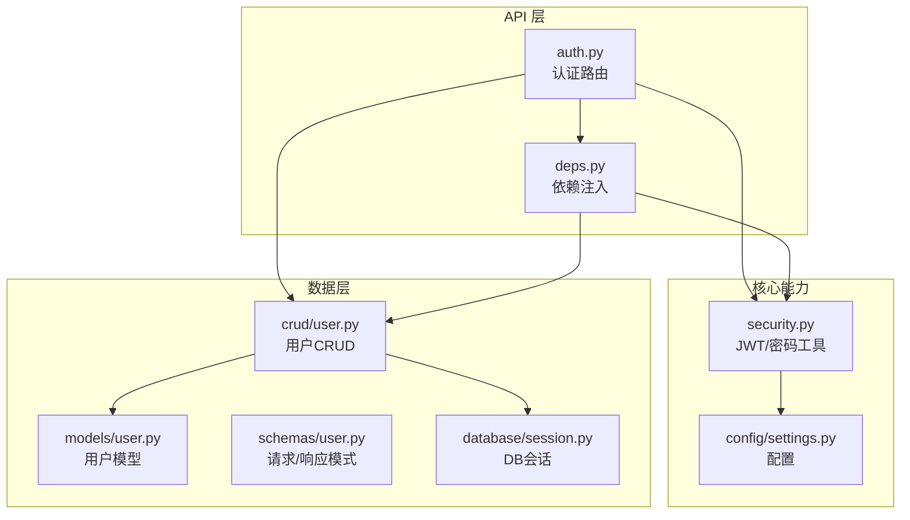
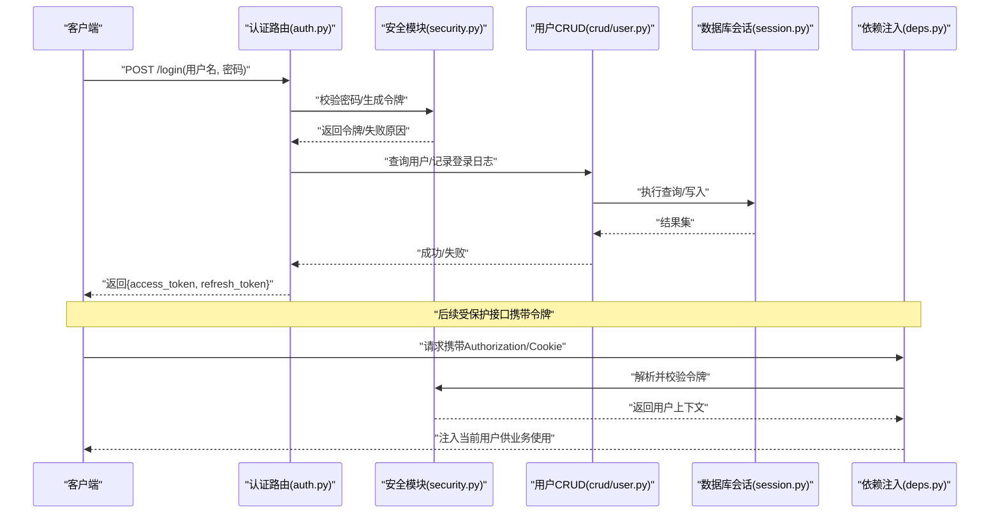
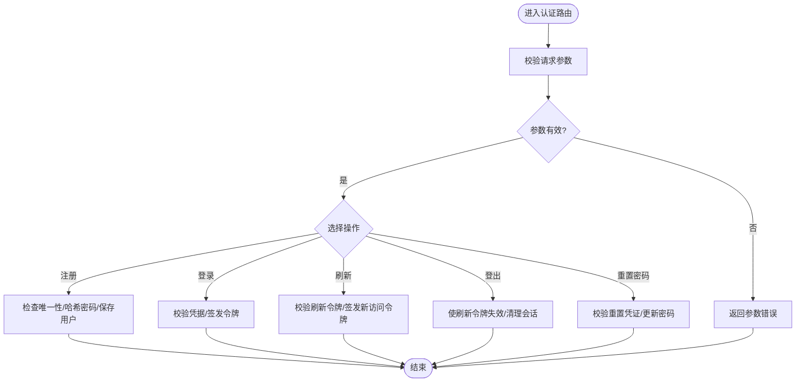
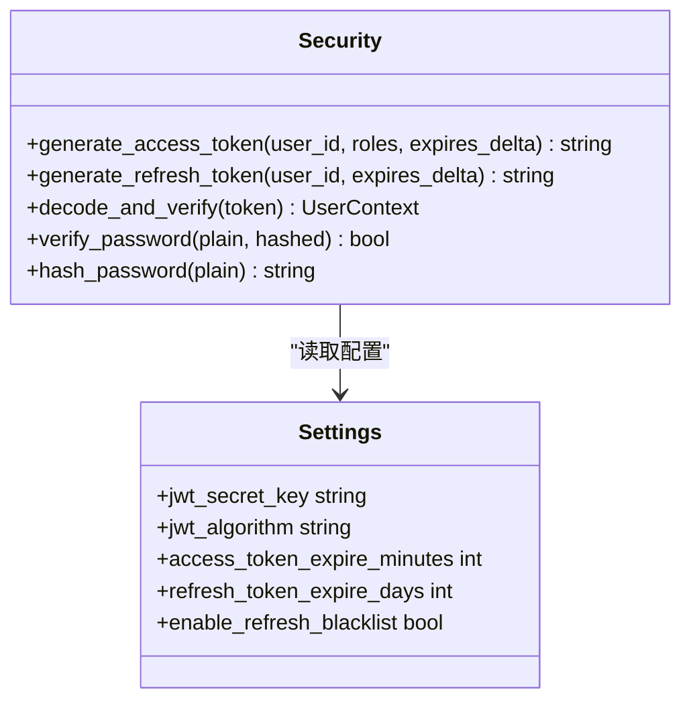
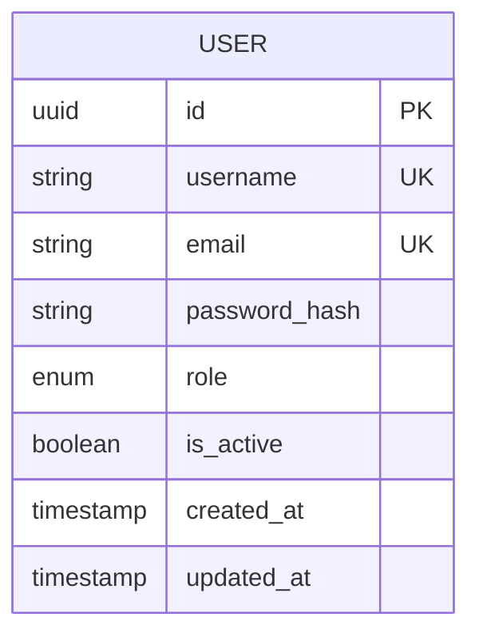
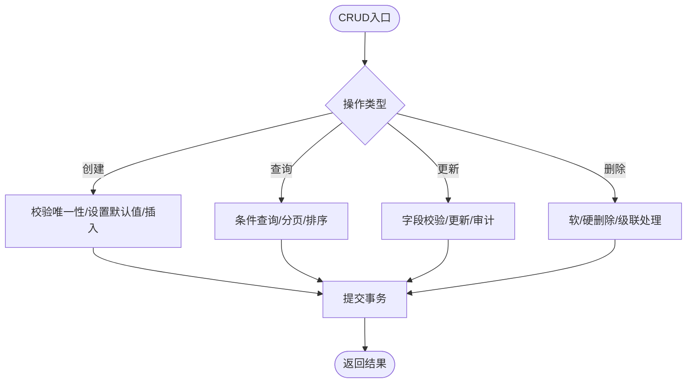
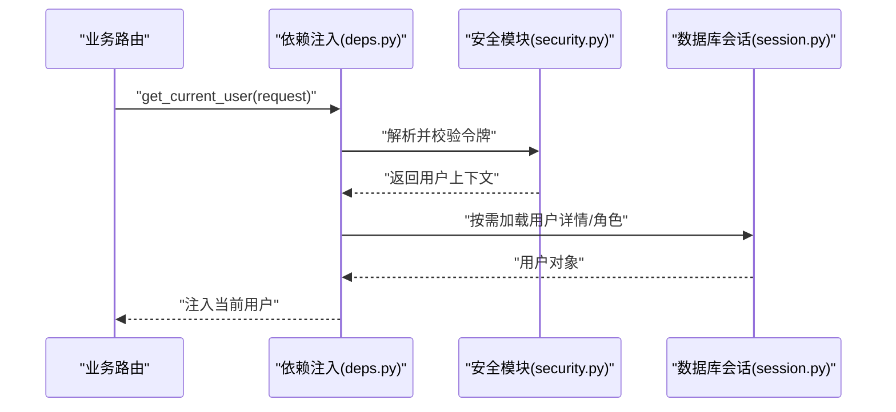
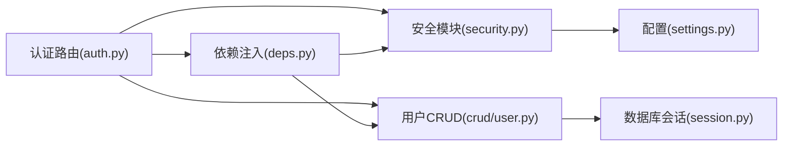

# 认证接口开发

<cite>
**本文引用的文件**   
- [backend/app/api/auth.py](file://backend/app/api/auth.py)
- [backend/app/core/security.py](file://backend/app/core/security.py)
- [backend/app/models/user.py](file://backend/app/models/user.py)
- [backend/app/schemas/user.py](file://backend/app/schemas/user.py)
- [backend/app/crud/user.py](file://backend/app/crud/user.py)
- [backend/app/config/settings.py](file://backend/app/config/settings.py)
- [backend/app/database/session.py](file://backend/app/database/session.py)
- [backend/app/api/deps.py](file://backend/app/api/deps.py)
- [backend/main.py](file://backend/main.py)
</cite>

## 目录
1. [简介](#简介)
2. [项目结构](#项目结构)
3. [核心组件](#核心组件)
4. [架构总览](#架构总览)
5. [详细组件分析](#详细组件分析)
6. [依赖关系分析](#依赖关系分析)
7. [性能考虑](#性能考虑)
8. [故障排查指南](#故障排查指南)
9. [结论](#结论)
10. [附录](#附录)

## 简介
本文件面向开发者，提供基于 FastAPI 与 JWT 的用户认证系统实现指南。内容覆盖用户注册、登录、令牌刷新、密码重置等接口的实现要点；阐述 JWT 生成与验证机制、密码加密存储、会话管理策略；给出认证中间件、权限装饰器、错误处理的最佳实践；并说明角色权限控制与安全加固建议，帮助快速集成到现有项目中。

## 项目结构
本项目采用分层架构：API 层暴露 REST 接口，服务层封装业务逻辑，数据访问层（CRUD）操作数据库模型，安全模块负责密码与令牌处理，配置与数据库会话由独立模块管理。认证相关代码主要分布在以下位置：
- API 路由：后端认证接口定义
- 安全模块：JWT 与密码哈希工具
- 数据模型与模式：用户实体与请求/响应结构
- CRUD 层：用户数据的增删改查
- 配置与数据库：密钥、算法、连接与会话
- 依赖注入：从请求中解析当前用户与权限

图表来源
- [backend/app/api/auth.py](file://backend/app/api/auth.py)
- [backend/app/core/security.py](file://backend/app/core/security.py)
- [backend/app/models/user.py](file://backend/app/models/user.py)
- [backend/app/schemas/user.py](file://backend/app/schemas/user.py)
- [backend/app/crud/user.py](file://backend/app/crud/user.py)
- [backend/app/config/settings.py](file://backend/app/config/settings.py)
- [backend/app/database/session.py](file://backend/app/database/session.py)
- [backend/app/api/deps.py](file://backend/app/api/deps.py)

章节来源
- [backend/main.py](file://backend/main.py)
- [backend/app/api/auth.py](file://backend/app/api/auth.py)
- [backend/app/core/security.py](file://backend/app/core/security.py)
- [backend/app/models/user.py](file://backend/app/models/user.py)
- [backend/app/schemas/user.py](file://backend/app/schemas/user.py)
- [backend/app/crud/user.py](file://backend/app/crud/user.py)
- [backend/app/config/settings.py](file://backend/app/config/settings.py)
- [backend/app/database/session.py](file://backend/app/database/session.py)
- [backend/app/api/deps.py](file://backend/app/api/deps.py)

## 核心组件
- 认证路由：提供注册、登录、刷新、登出、密码重置等端点，统一返回格式与错误码。
- 安全模块：封装 JWT 签发、校验、过期处理；封装密码哈希与校验。
- 用户模型与模式：定义用户字段、角色、状态及请求/响应数据结构。
- 用户CRUD：封装用户创建、查询、更新等操作，保证事务与一致性。
- 配置与数据库：集中管理 JWT 密钥、算法、过期时间、数据库连接与会话。
- 依赖注入：从请求头或 Cookie 中提取并验证令牌，注入当前用户上下文。

章节来源
- [backend/app/api/auth.py](file://backend/app/api/auth.py)
- [backend/app/core/security.py](file://backend/app/core/security.py)
- [backend/app/models/user.py](file://backend/app/models/user.py)
- [backend/app/schemas/user.py](file://backend/app/schemas/user.py)
- [backend/app/crud/user.py](file://backend/app/crud/user.py)
- [backend/app/config/settings.py](file://backend/app/config/settings.py)
- [backend/app/database/session.py](file://backend/app/database/session.py)
- [backend/app/api/deps.py](file://backend/app/api/deps.py)

## 架构总览
下图展示一次“登录”请求的端到端流程：客户端提交凭据，认证路由调用安全模块生成令牌，持久化用户信息，最终返回令牌给客户端。后续受保护接口通过依赖注入解析并校验令牌，完成鉴权。

图表来源
- [backend/app/api/auth.py](file://backend/app/api/auth.py)
- [backend/app/core/security.py](file://backend/app/core/security.py)
- [backend/app/crud/user.py](file://backend/app/crud/user.py)
- [backend/app/database/session.py](file://backend/app/database/session.py)
- [backend/app/api/deps.py](file://backend/app/api/deps.py)

## 详细组件分析

### 认证路由（注册、登录、刷新、登出、密码重置）
- 注册：校验输入模式，检查用户名唯一性，调用安全模块对密码进行哈希后落库，返回用户基本信息。
- 登录：校验凭据，生成短期访问令牌与长期刷新令牌，返回令牌集合。
- 刷新：校验刷新令牌有效性，签发新的访问令牌。
- 登出：可选将刷新令牌加入黑名单或标记失效，清理本地会话。
- 密码重置：支持发送重置链接或一次性验证码，校验后更新密码。

图表来源
- [backend/app/api/auth.py](file://backend/app/api/auth.py)
- [backend/app/core/security.py](file://backend/app/core/security.py)
- [backend/app/crud/user.py](file://backend/app/crud/user.py)
- [backend/app/schemas/user.py](file://backend/app/schemas/user.py)

章节来源
- [backend/app/api/auth.py](file://backend/app/api/auth.py)
- [backend/app/schemas/user.py](file://backend/app/schemas/user.py)

### 安全模块（JWT 与密码）
- JWT 签发：包含用户标识、角色、过期时间等载荷，使用配置的密钥与算法签名。
- JWT 校验：验签、检查过期、提取用户上下文。
- 刷新令牌：可结合黑名单或数据库记录实现撤销能力。
- 密码哈希：使用强哈希算法（如 bcrypt/argon2），固定盐值与成本因子。
- 配置项：密钥、算法、访问令牌有效期、刷新令牌有效期、是否启用刷新令牌黑名单等。

图表来源
- [backend/app/core/security.py](file://backend/app/core/security.py)
- [backend/app/config/settings.py](file://backend/app/config/settings.py)

章节来源
- [backend/app/core/security.py](file://backend/app/core/security.py)
- [backend/app/config/settings.py](file://backend/app/config/settings.py)

### 用户模型与模式（用户实体与请求/响应）
- 用户模型：包含用户名、邮箱、密码哈希、角色、状态、创建/更新时间等字段。
- 请求模式：注册、登录、刷新、重置密码的请求体校验规则。
- 响应模式：统一的返回结构与错误码约定。

图表来源
- [backend/app/models/user.py](file://backend/app/models/user.py)
- [backend/app/schemas/user.py](file://backend/app/schemas/user.py)

章节来源
- [backend/app/models/user.py](file://backend/app/models/user.py)
- [backend/app/schemas/user.py](file://backend/app/schemas/user.py)

### 用户CRUD（数据访问）
- 创建用户：插入新用户，确保唯一约束与默认值正确。
- 查询用户：按用户名或邮箱查找，支持状态过滤。
- 更新用户：修改密码、角色、状态等。
- 删除用户：软删除或硬删除策略。
- 事务与异常：保证数据一致性，捕获并转换数据库异常为应用级错误。

图表来源
- [backend/app/crud/user.py](file://backend/app/crud/user.py)
- [backend/app/database/session.py](file://backend/app/database/session.py)

章节来源
- [backend/app/crud/user.py](file://backend/app/crud/user.py)
- [backend/app/database/session.py](file://backend/app/database/session.py)

### 依赖注入（当前用户与权限）
- 从请求头或 Cookie 解析令牌，调用安全模块校验并返回用户上下文。
- 提供依赖函数供路由使用，自动注入当前用户对象。
- 可扩展为带角色的权限校验装饰器，用于细粒度授权。

图表来源
- [backend/app/api/deps.py](file://backend/app/api/deps.py)
- [backend/app/core/security.py](file://backend/app/core/security.py)
- [backend/app/database/session.py](file://backend/app/database/session.py)

章节来源
- [backend/app/api/deps.py](file://backend/app/api/deps.py)
- [backend/app/core/security.py](file://backend/app/core/security.py)
- [backend/app/database/session.py](file://backend/app/database/session.py)

## 依赖关系分析
- 低耦合高内聚：安全模块仅关注令牌与密码，CRUD 专注数据访问，路由只编排流程。
- 外部依赖：数据库会话、配置中心、第三方加密库。
- 潜在循环依赖：避免在安全模块中直接导入路由或业务服务，保持单向依赖。

图表来源
- [backend/app/api/auth.py](file://backend/app/api/auth.py)
- [backend/app/core/security.py](file://backend/app/core/security.py)
- [backend/app/crud/user.py](file://backend/app/crud/user.py)
- [backend/app/database/session.py](file://backend/app/database/session.py)
- [backend/app/config/settings.py](file://backend/app/config/settings.py)
- [backend/app/api/deps.py](file://backend/app/api/deps.py)

章节来源
- [backend/app/api/auth.py](file://backend/app/api/auth.py)
- [backend/app/core/security.py](file://backend/app/core/security.py)
- [backend/app/crud/user.py](file://backend/app/crud/user.py)
- [backend/app/database/session.py](file://backend/app/database/session.py)
- [backend/app/config/settings.py](file://backend/app/config/settings.py)
- [backend/app/api/deps.py](file://backend/app/api/deps.py)

## 性能考虑
- 令牌体积与传输：尽量精简 JWT 载荷，敏感信息不放入令牌。
- 哈希成本：根据服务器性能调整密码哈希成本因子，平衡安全与延迟。
- 刷新令牌黑名单：若启用，需配合缓存或数据库索引优化查询性能。
- 并发与锁：注册时用户名唯一性检查与插入应使用数据库约束与事务，避免竞态。
- 缓存策略：用户角色与权限可缓存，减少频繁查询。

[本节为通用指导，无需源码引用]

## 故障排查指南
- 令牌无效或过期：检查密钥与算法配置一致性、时钟同步、过期时间设置。
- 密码校验失败：确认哈希算法与成本因子一致，避免明文比较。
- 数据库连接异常：检查连接字符串、会话生命周期、事务回滚。
- 重复注册：查看唯一约束与错误码映射，定位冲突字段。
- 刷新令牌被拒：检查黑名单策略、令牌来源与存储位置（Cookie/Header）。

章节来源
- [backend/app/core/security.py](file://backend/app/core/security.py)
- [backend/app/config/settings.py](file://backend/app/config/settings.py)
- [backend/app/crud/user.py](file://backend/app/crud/user.py)
- [backend/app/database/session.py](file://backend/app/database/session.py)

## 结论
通过分层设计与模块化实现，认证系统具备清晰的职责边界与良好的扩展性。JWT 与密码哈希的安全实践、依赖注入的无侵入鉴权、以及完善的错误处理与配置管理，共同构成稳定可靠的认证基础设施。建议在上线前完成安全审计与压力测试，并根据业务需求细化角色权限与审计日志。

[本节为总结性内容，无需源码引用]

## 附录

### 接口清单与行为说明
- 注册：校验输入、检查唯一性、哈希密码、返回用户基本信息。
- 登录：校验凭据、签发访问与刷新令牌、返回令牌集合。
- 刷新：校验刷新令牌、签发新访问令牌。
- 登出：使刷新令牌失效或清理会话。
- 密码重置：校验重置凭证、更新密码。

章节来源
- [backend/app/api/auth.py](file://backend/app/api/auth.py)
- [backend/app/schemas/user.py](file://backend/app/schemas/user.py)

### 安全最佳实践
- 使用 HTTPS 传输所有认证相关数据。
- 将 JWT 密钥与算法配置于环境变量，禁止硬编码。
- 合理设置令牌过期时间，短访问令牌+长刷新令牌组合。
- 刷新令牌支持撤销（黑名单或数据库记录）。
- 密码使用强哈希算法，固定成本因子。
- 最小化 JWT 载荷，避免存放敏感信息。
- 对关键操作添加审计日志与速率限制。

章节来源
- [backend/app/core/security.py](file://backend/app/core/security.py)
- [backend/app/config/settings.py](file://backend/app/config/settings.py)

### 常见安全问题防护
- 防止暴力破解：登录与重置接口增加速率限制与验证码。
- 防重放攻击：刷新令牌绑定设备指纹或IP白名单（可选）。
- 防越权访问：基于角色的访问控制（RBAC）与资源级权限校验。
- 防信息泄露：统一错误响应格式，避免返回堆栈与内部细节。

章节来源
- [backend/app/api/auth.py](file://backend/app/api/auth.py)
- [backend/app/api/deps.py](file://backend/app/api/deps.py)