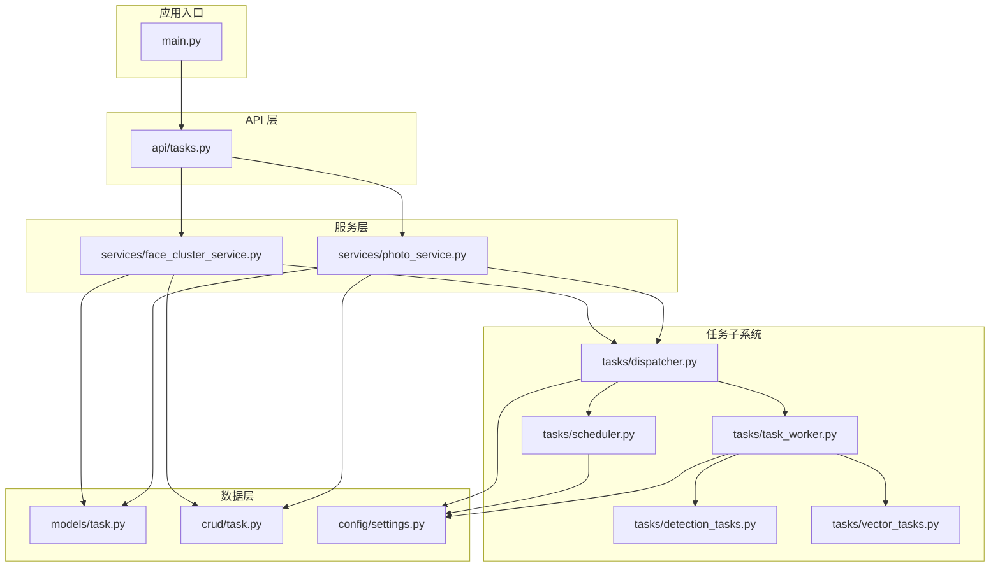
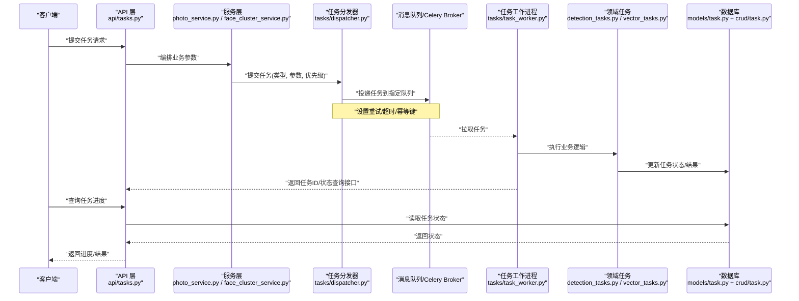
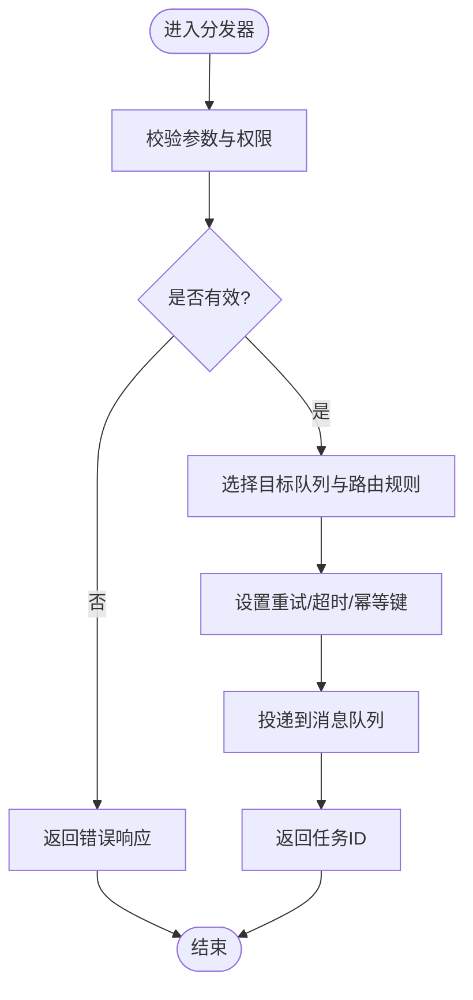
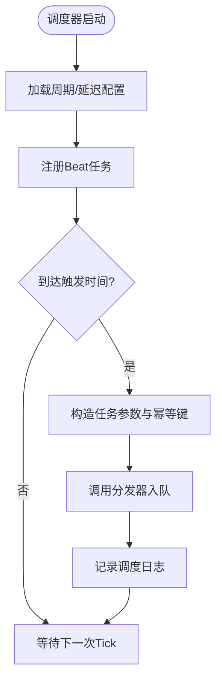
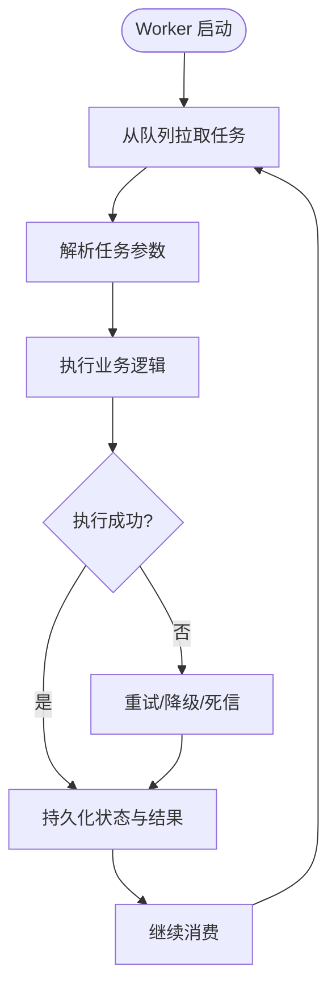
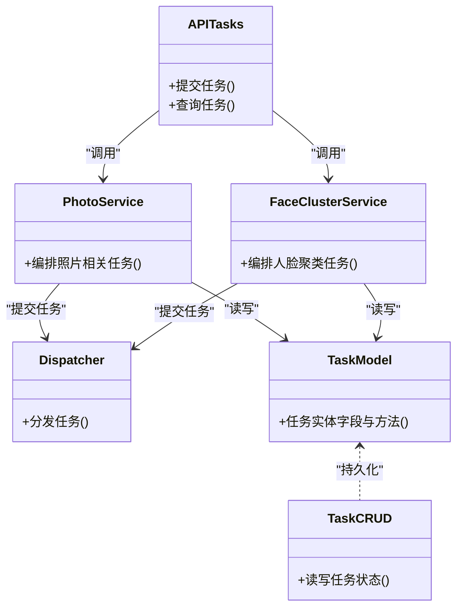
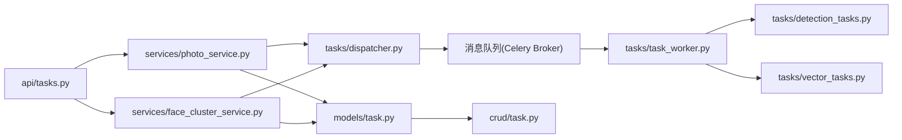

# 任务架构设计

<cite>
**本文引用的文件**   
- [backend/app/tasks/dispatcher.py](file://backend/app/tasks/dispatcher.py)
- [backend/app/tasks/scheduler.py](file://backend/app/tasks/scheduler.py)
- [backend/app/tasks/task_worker.py](file://backend/app/tasks/task_worker.py)
- [backend/app/tasks/detection_tasks.py](file://backend/app/tasks/detection_tasks.py)
- [backend/app/tasks/vector_tasks.py](file://backend/app/tasks/vector_tasks.py)
- [backend/app/api/tasks.py](file://backend/app/api/tasks.py)
- [backend/app/services/face_cluster_service.py](file://backend/app/services/face_cluster_service.py)
- [backend/app/services/photo_service.py](file://backend/app/services/photo_service.py)
- [backend/app/models/task.py](file://backend/app/models/task.py)
- [backend/app/crud/task.py](file://backend/app/crud/task.py)
- [backend/app/config/settings.py](file://backend/app/config/settings.py)
- [backend/main.py](file://backend/main.py)
</cite>

## 目录
1. [简介](#简介)
2. [项目结构](#项目结构)
3. [核心组件](#核心组件)
4. [架构总览](#架构总览)
5. [详细组件分析](#详细组件分析)
6. [依赖关系分析](#依赖关系分析)
7. [性能考虑](#性能考虑)
8. [故障排查指南](#故障排查指南)
9. [结论](#结论)
10. [附录](#附录)

## 简介
本设计文档面向基于 Celery 的异步任务调度系统，围绕任务分发器、调度器与任务工作进程三大角色展开，阐述任务生命周期管理、消息队列机制与进程间通信方式。文档同时覆盖优先级队列、负载均衡策略与故障转移机制，并提供架构图与数据流图以说明组件交互关系。最后给出扩展性设计与性能优化建议，帮助读者在现有代码基础上进行二次开发与运维调优。

## 项目结构
后端采用分层组织：API 层负责请求接入与编排；服务层封装业务逻辑；模型与数据库访问层提供持久化能力；tasks 子包实现 Celery 任务定义、分发与调度；配置模块集中管理运行参数。

图表来源
- [backend/main.py](file://backend/main.py)
- [backend/app/api/tasks.py](file://backend/app/api/tasks.py)
- [backend/app/services/face_cluster_service.py](file://backend/app/services/face_cluster_service.py)
- [backend/app/services/photo_service.py](file://backend/app/services/photo_service.py)
- [backend/app/tasks/dispatcher.py](file://backend/app/tasks/dispatcher.py)
- [backend/app/tasks/scheduler.py](file://backend/app/tasks/scheduler.py)
- [backend/app/tasks/task_worker.py](file://backend/app/tasks/task_worker.py)
- [backend/app/tasks/detection_tasks.py](file://backend/app/tasks/detection_tasks.py)
- [backend/app/tasks/vector_tasks.py](file://backend/app/tasks/vector_tasks.py)
- [backend/app/models/task.py](file://backend/app/models/task.py)
- [backend/app/crud/task.py](file://backend/app/crud/task.py)
- [backend/app/config/settings.py](file://backend/app/config/settings.py)

章节来源
- [backend/main.py](file://backend/main.py)
- [backend/app/config/settings.py](file://backend/app/config/settings.py)

## 核心组件
- 任务分发器（Dispatcher）
  - 职责：接收来自服务层的任务提交请求，完成参数校验、路由选择、优先级与队列绑定、重试策略设置，并将任务投递到消息队列。
  - 关键行为：根据任务类型选择目标队列；为长耗时任务设置超时与重试；记录任务元信息以便追踪。
- 调度器（Scheduler）
  - 职责：维护周期性或延迟任务的计划表，按时间触发将任务投递至队列；支持动态增删改查定时任务。
  - 关键行为：读取配置中的周期策略；生成 Celery Beat 任务；处理时区与幂等键。
- 任务工作进程（Worker）
  - 职责：从队列拉取任务并执行具体业务逻辑；更新任务状态与结果；处理异常与补偿。
  - 关键行为：多队列监听；并发控制；失败重试与死信处理；结果回写。
- 领域任务集
  - 检测类任务（detection_tasks）：人脸检测、属性识别等。
  - 向量类任务（vector_tasks）：特征提取、索引构建、相似度检索准备等。
- API 与编排
  - API 层暴露任务提交接口，调用服务层进行编排，再由分发器投递任务。
- 数据与配置
  - 模型与 CRUD 用于持久化任务状态与上下文；配置中心统一注入队列名、并发度、重试次数等。

章节来源
- [backend/app/tasks/dispatcher.py](file://backend/app/tasks/dispatcher.py)
- [backend/app/tasks/scheduler.py](file://backend/app/tasks/scheduler.py)
- [backend/app/tasks/task_worker.py](file://backend/app/tasks/task_worker.py)
- [backend/app/tasks/detection_tasks.py](file://backend/app/tasks/detection_tasks.py)
- [backend/app/tasks/vector_tasks.py](file://backend/app/tasks/vector_tasks.py)
- [backend/app/api/tasks.py](file://backend/app/api/tasks.py)
- [backend/app/models/task.py](file://backend/app/models/task.py)
- [backend/app/crud/task.py](file://backend/app/crud/task.py)
- [backend/app/config/settings.py](file://backend/app/config/settings.py)

## 架构总览
下图展示了从 HTTP 请求到任务执行的端到端流程，包括任务创建、入队、调度、执行与结果落库的关键路径。

图表来源
- [backend/app/api/tasks.py](file://backend/app/api/tasks.py)
- [backend/app/services/photo_service.py](file://backend/app/services/photo_service.py)
- [backend/app/services/face_cluster_service.py](file://backend/app/services/face_cluster_service.py)
- [backend/app/tasks/dispatcher.py](file://backend/app/tasks/dispatcher.py)
- [backend/app/tasks/task_worker.py](file://backend/app/tasks/task_worker.py)
- [backend/app/tasks/detection_tasks.py](file://backend/app/tasks/detection_tasks.py)
- [backend/app/tasks/vector_tasks.py](file://backend/app/tasks/vector_tasks.py)
- [backend/app/models/task.py](file://backend/app/models/task.py)
- [backend/app/crud/task.py](file://backend/app/crud/task.py)

## 详细组件分析

### 任务分发器（Dispatcher）
- 设计要点
  - 输入：任务类型、业务参数、优先级、可选重试策略与超时。
  - 输出：任务 ID 与入队确认。
  - 行为：参数校验、队列路由、Celery 任务包装、幂等键生成、错误上报。
- 关键流程
  - 校验参数与权限
  - 选择目标队列（高/中/低优先级）
  - 设置重试与超时
  - 投递到 Broker
  - 返回任务标识供后续查询

图表来源
- [backend/app/tasks/dispatcher.py](file://backend/app/tasks/dispatcher.py)
- [backend/app/config/settings.py](file://backend/app/config/settings.py)

章节来源
- [backend/app/tasks/dispatcher.py](file://backend/app/tasks/dispatcher.py)
- [backend/app/config/settings.py](file://backend/app/config/settings.py)

### 调度器（Scheduler）
- 设计要点
  - 支持周期性任务与延迟任务。
  - 通过配置驱动任务计划，避免硬编码。
  - 保证幂等与去重，防止重复触发。
- 关键流程
  - 加载计划配置
  - 注册 Celery Beat 任务
  - 按时触发并投递到队列
  - 记录调度日志与指标

图表来源
- [backend/app/tasks/scheduler.py](file://backend/app/tasks/scheduler.py)
- [backend/app/config/settings.py](file://backend/app/config/settings.py)

章节来源
- [backend/app/tasks/scheduler.py](file://backend/app/tasks/scheduler.py)
- [backend/app/config/settings.py](file://backend/app/config/settings.py)

### 任务工作进程（Worker）
- 设计要点
  - 多队列监听，按优先级消费。
  - 并发控制与资源隔离（CPU/内存密集型任务）。
  - 异常捕获、重试与死信处理。
  - 结果与状态持久化。
- 关键流程
  - 拉取任务
  - 解析参数与上下文
  - 调用领域任务函数
  - 更新状态与结果
  - 失败重试或告警

图表来源
- [backend/app/tasks/task_worker.py](file://backend/app/tasks/task_worker.py)
- [backend/app/tasks/detection_tasks.py](file://backend/app/tasks/detection_tasks.py)
- [backend/app/tasks/vector_tasks.py](file://backend/app/tasks/vector_tasks.py)
- [backend/app/models/task.py](file://backend/app/models/task.py)
- [backend/app/crud/task.py](file://backend/app/crud/task.py)

章节来源
- [backend/app/tasks/task_worker.py](file://backend/app/tasks/task_worker.py)
- [backend/app/tasks/detection_tasks.py](file://backend/app/tasks/detection_tasks.py)
- [backend/app/tasks/vector_tasks.py](file://backend/app/tasks/vector_tasks.py)
- [backend/app/models/task.py](file://backend/app/models/task.py)
- [backend/app/crud/task.py](file://backend/app/crud/task.py)

### 领域任务：检测与向量
- 检测任务（detection_tasks）
  - 典型场景：人脸检测、属性识别、图像预处理。
  - 关注点：I/O 密集、GPU/CPU 资源分配、批处理与分片。
- 向量任务（vector_tasks）
  - 典型场景：特征提取、向量化入库、索引重建。
  - 关注点：大对象序列化、内存峰值控制、批量写入。

章节来源
- [backend/app/tasks/detection_tasks.py](file://backend/app/tasks/detection_tasks.py)
- [backend/app/tasks/vector_tasks.py](file://backend/app/tasks/vector_tasks.py)

### API 与服务编排
- API 层
  - 暴露任务提交与查询接口，统一鉴权与限流。
- 服务层
  - 组装业务参数，调用分发器提交任务，必要时协调多个任务。
- 数据层
  - 使用模型与 CRUD 读写任务状态与上下文。

图表来源
- [backend/app/api/tasks.py](file://backend/app/api/tasks.py)
- [backend/app/services/photo_service.py](file://backend/app/services/photo_service.py)
- [backend/app/services/face_cluster_service.py](file://backend/app/services/face_cluster_service.py)
- [backend/app/tasks/dispatcher.py](file://backend/app/tasks/dispatcher.py)
- [backend/app/models/task.py](file://backend/app/models/task.py)
- [backend/app/crud/task.py](file://backend/app/crud/task.py)

章节来源
- [backend/app/api/tasks.py](file://backend/app/api/tasks.py)
- [backend/app/services/photo_service.py](file://backend/app/services/photo_service.py)
- [backend/app/services/face_cluster_service.py](file://backend/app/services/face_cluster_service.py)
- [backend/app/models/task.py](file://backend/app/models/task.py)
- [backend/app/crud/task.py](file://backend/app/crud/task.py)

## 依赖关系分析
- 组件耦合
  - API 层仅依赖服务层与任务查询接口，不直接操作队列。
  - 服务层通过分发器解耦任务投递细节。
  - 工作进程仅依赖领域任务与数据层，保持无状态与可水平扩展。
- 外部依赖
  - Celery Broker（如 Redis/RabbitMQ）作为消息中间件。
  - 数据库用于任务状态与结果持久化。
- 潜在循环依赖
  - 确保任务函数不反向调用 API 或服务层，避免循环。

图表来源
- [backend/app/api/tasks.py](file://backend/app/api/tasks.py)
- [backend/app/services/photo_service.py](file://backend/app/services/photo_service.py)
- [backend/app/services/face_cluster_service.py](file://backend/app/services/face_cluster_service.py)
- [backend/app/tasks/dispatcher.py](file://backend/app/tasks/dispatcher.py)
- [backend/app/tasks/task_worker.py](file://backend/app/tasks/task_worker.py)
- [backend/app/tasks/detection_tasks.py](file://backend/app/tasks/detection_tasks.py)
- [backend/app/tasks/vector_tasks.py](file://backend/app/tasks/vector_tasks.py)
- [backend/app/models/task.py](file://backend/app/models/task.py)
- [backend/app/crud/task.py](file://backend/app/crud/task.py)

章节来源
- [backend/app/api/tasks.py](file://backend/app/api/tasks.py)
- [backend/app/tasks/dispatcher.py](file://backend/app/tasks/dispatcher.py)
- [backend/app/tasks/task_worker.py](file://backend/app/tasks/task_worker.py)
- [backend/app/models/task.py](file://backend/app/models/task.py)
- [backend/app/crud/task.py](file://backend/app/crud/task.py)

## 性能考虑
- 队列与优先级
  - 使用多队列区分优先级（高/中/低），结合权重与消费者数量控制吞吐。
  - 对热点任务启用独立队列，避免阻塞。
- 并发与资源隔离
  - CPU/GPU 密集型任务单独池化，限制并发以避免资源争用。
  - I/O 密集型任务提高并发度，配合连接池与缓存。
- 批处理与分片
  - 对大批量图片/向量任务进行分片与批处理，降低单次负载。
- 幂等与去重
  - 为任务生成幂等键，避免重复入队与重复执行。
- 监控与可观测性
  - 采集任务时长、失败率、队列长度与消费者健康状态。
  - 关键路径打点与结构化日志。

[本节为通用指导，无需列出具体文件来源]

## 故障排查指南
- 常见问题定位
  - 任务未入队：检查分发器参数校验、队列路由与 Broker 连通性。
  - 任务未执行：核对 Worker 是否监听对应队列、并发配置与资源配额。
  - 任务失败重试：查看重试策略、超时设置与死信队列。
  - 状态不一致：确认结果回写与幂等键是否正确。
- 诊断步骤
  - 查看任务日志与堆栈，定位异常来源。
  - 检查 Broker 与数据库连接池状态。
  - 验证配置项（队列名、并发度、重试次数、超时）。
  - 复现最小用例，逐步缩小范围。

章节来源
- [backend/app/tasks/dispatcher.py](file://backend/app/tasks/dispatcher.py)
- [backend/app/tasks/task_worker.py](file://backend/app/tasks/task_worker.py)
- [backend/app/config/settings.py](file://backend/app/config/settings.py)

## 结论
本设计通过“分发器-调度器-工作进程”的清晰分层，实现了可扩展、可观测、可运维的异步任务体系。借助多队列与优先级、幂等与重试、批处理与资源隔离等手段，系统在稳定性与性能之间取得平衡。建议在后续迭代中持续完善监控告警、弹性扩缩容与灰度发布策略，进一步提升整体可靠性与吞吐能力。

[本节为总结性内容，无需列出具体文件来源]

## 附录
- 术语
  - 任务：一次异步执行的单元，包含参数、上下文与状态。
  - 队列：消息通道，用于解耦生产者与消费者。
  - 幂等键：确保同一任务多次入队只执行一次的标识。
  - 死信队列：存放不可恢复任务的特殊队列。
- 最佳实践
  - 任务函数保持无状态，所有副作用通过数据层持久化。
  - 合理拆分任务粒度，避免单任务过大导致超时与内存溢出。
  - 为关键任务设置超时与重试上限，防止雪崩。
  - 使用统一的错误码与日志规范，便于排障与审计。

[本节为概念性内容，无需列出具体文件来源]