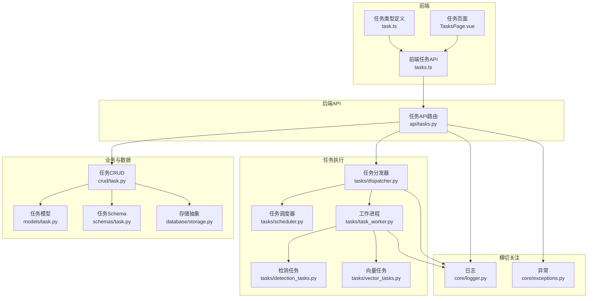
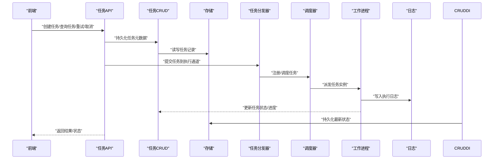
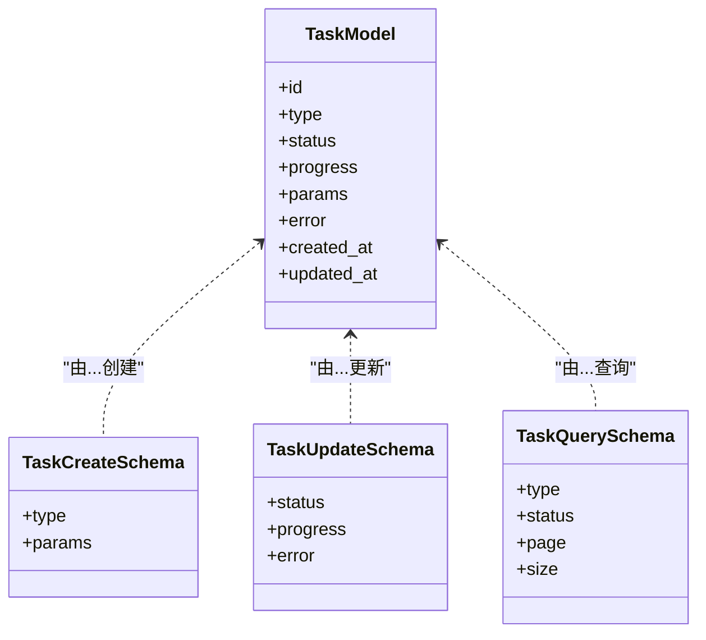
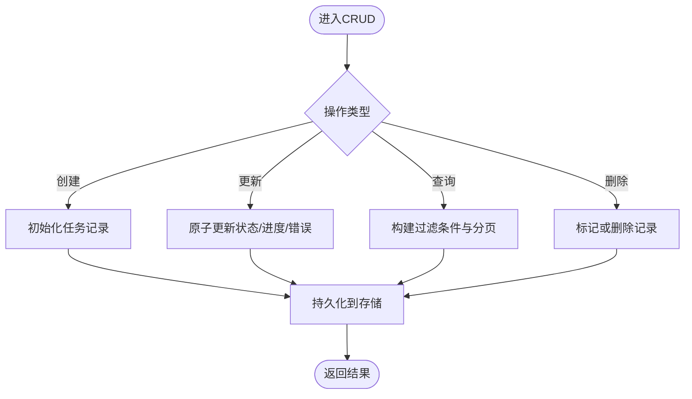
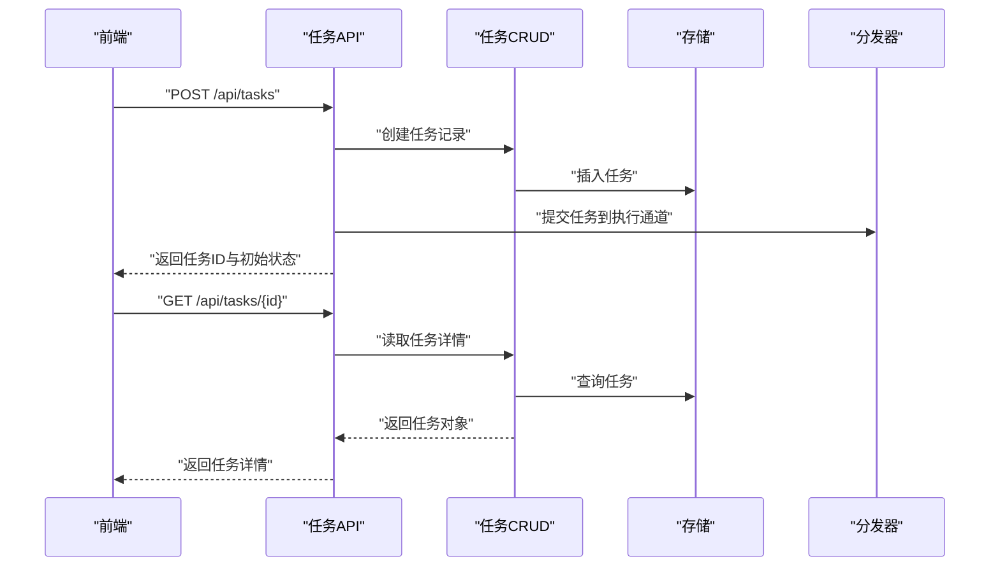
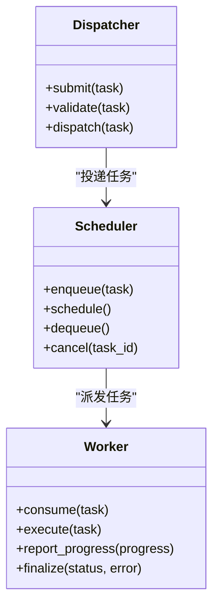
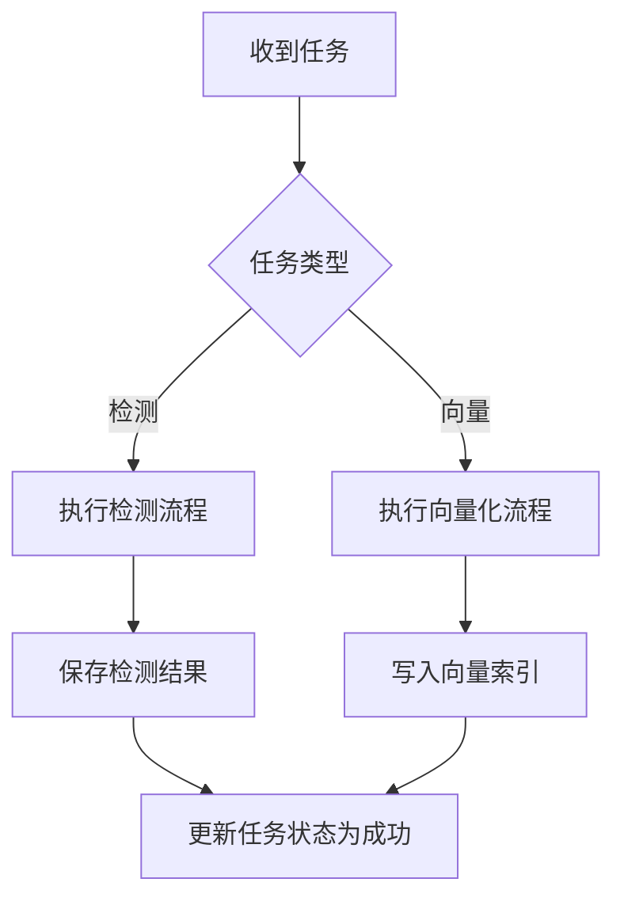
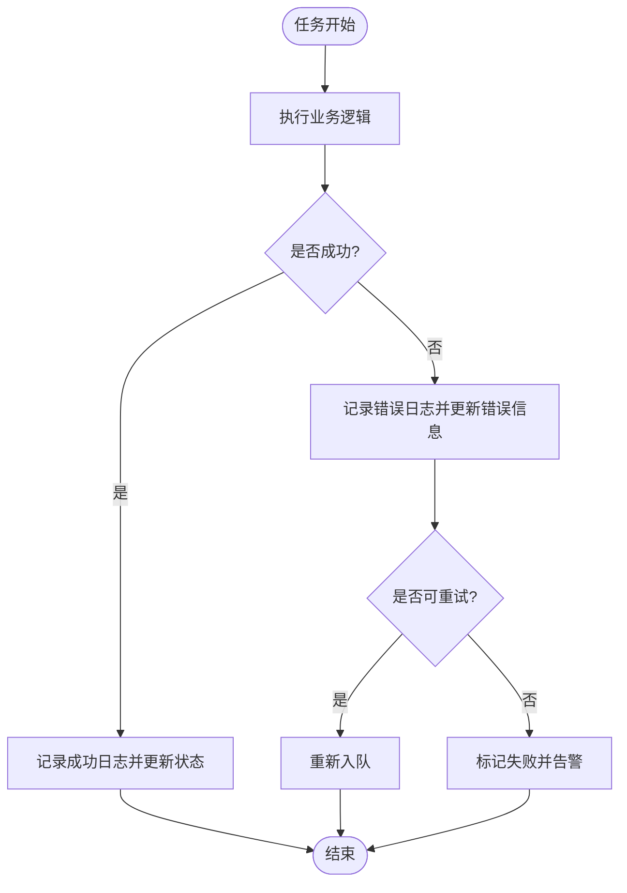
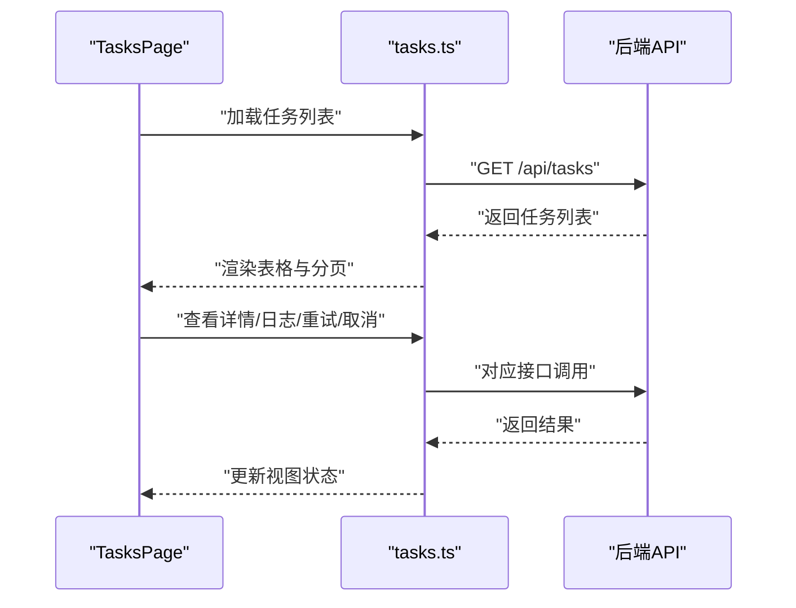
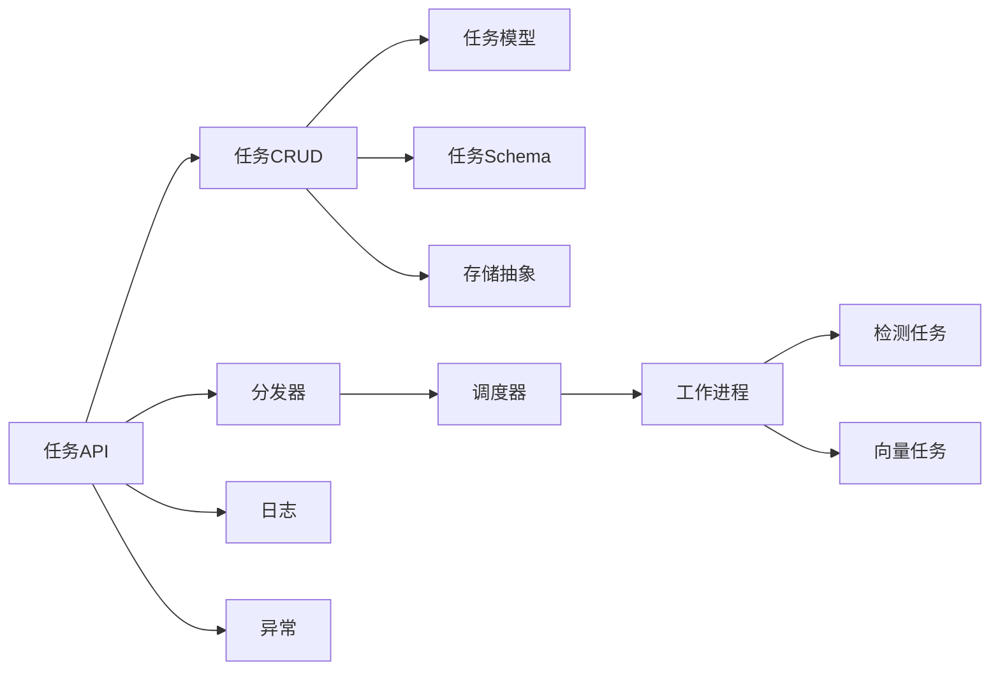

# 任务监控与管理

<cite>
**本文引用的文件**   
- [backend/app/api/tasks.py](file://backend/app/api/tasks.py)
- [backend/app/crud/task.py](file://backend/app/crud/task.py)
- [backend/app/models/task.py](file://backend/app/models/task.py)
- [backend/app/schemas/task.py](file://backend/app/schemas/task.py)
- [backend/app/tasks/dispatcher.py](file://backend/app/tasks/dispatcher.py)
- [backend/app/tasks/scheduler.py](file://backend/app/tasks/scheduler.py)
- [backend/app/tasks/task_worker.py](file://backend/app/tasks/task_worker.py)
- [backend/app/tasks/detection_tasks.py](file://backend/app/tasks/detection_tasks.py)
- [backend/app/tasks/vector_tasks.py](file://backend/app/tasks/vector_tasks.py)
- [backend/app/core/logger.py](file://backend/app/core/logger.py)
- [backend/app/core/exceptions.py](file://backend/app/core/exceptions.py)
- [backend/app/database/storage.py](file://backend/app/database/storage.py)
- [frontend/src/api/tasks.ts](file://frontend/src/api/tasks.ts)
- [frontend/src/types/task.ts](file://frontend/src/types/task.ts)
- [frontend/src/views/TasksPage.vue](file://frontend/src/views/TasksPage.vue)
</cite>

## 目录
1. [简介](#简介)
2. [项目结构](#项目结构)
3. [核心组件](#核心组件)
4. [架构总览](#架构总览)
5. [详细组件分析](#详细组件分析)
6. [依赖关系分析](#依赖关系分析)
7. [性能考量](#性能考量)
8. [故障排查指南](#故障排查指南)
9. [结论](#结论)
10. [附录](#附录)

## 简介
本文件面向“任务监控与管理”能力，覆盖以下方面：
- 任务状态跟踪、进度监控与日志记录机制
- 任务执行历史查询、性能指标收集与告警通知
- 任务重试机制、超时控制与资源清理策略
- 任务管理API接口使用方法与前端监控界面集成方案
- 分布式环境下的任务追踪与调试工具使用建议

## 项目结构
后端围绕“任务”的领域模型、持久化、调度与执行展开；前端提供任务列表、详情与操作入口。关键路径如下：
- API层：任务相关HTTP接口定义
- 数据层：任务CRUD与数据库存储
- 领域层：任务模型与请求/响应模式
- 执行层：任务分发器、调度器与工作进程
- 日志与异常：统一日志与异常类型
- 前端：任务API调用、类型定义与页面展示

图表来源
- [backend/app/api/tasks.py](file://backend/app/api/tasks.py)
- [backend/app/crud/task.py](file://backend/app/crud/task.py)
- [backend/app/models/task.py](file://backend/app/models/task.py)
- [backend/app/schemas/task.py](file://backend/app/schemas/task.py)
- [backend/app/tasks/dispatcher.py](file://backend/app/tasks/dispatcher.py)
- [backend/app/tasks/scheduler.py](file://backend/app/tasks/scheduler.py)
- [backend/app/tasks/task_worker.py](file://backend/app/tasks/task_worker.py)
- [backend/app/tasks/detection_tasks.py](file://backend/app/tasks/detection_tasks.py)
- [backend/app/tasks/vector_tasks.py](file://backend/app/tasks/vector_tasks.py)
- [backend/app/core/logger.py](file://backend/app/core/logger.py)
- [backend/app/core/exceptions.py](file://backend/app/core/exceptions.py)
- [backend/app/database/storage.py](file://backend/app/database/storage.py)
- [frontend/src/api/tasks.ts](file://frontend/src/api/tasks.ts)
- [frontend/src/types/task.ts](file://frontend/src/types/task.ts)
- [frontend/src/views/TasksPage.vue](file://frontend/src/views/TasksPage.vue)

章节来源
- [backend/app/api/tasks.py](file://backend/app/api/tasks.py)
- [backend/app/crud/task.py](file://backend/app/crud/task.py)
- [backend/app/models/task.py](file://backend/app/models/task.py)
- [backend/app/schemas/task.py](file://backend/app/schemas/task.py)
- [backend/app/tasks/dispatcher.py](file://backend/app/tasks/dispatcher.py)
- [backend/app/tasks/scheduler.py](file://backend/app/tasks/scheduler.py)
- [backend/app/tasks/task_worker.py](file://backend/app/tasks/task_worker.py)
- [backend/app/tasks/detection_tasks.py](file://backend/app/tasks/detection_tasks.py)
- [backend/app/tasks/vector_tasks.py](file://backend/app/tasks/vector_tasks.py)
- [backend/app/core/logger.py](file://backend/app/core/logger.py)
- [backend/app/core/exceptions.py](file://backend/app/core/exceptions.py)
- [backend/app/database/storage.py](file://backend/app/database/storage.py)
- [frontend/src/api/tasks.ts](file://frontend/src/api/tasks.ts)
- [frontend/src/types/task.ts](file://frontend/src/types/task.ts)
- [frontend/src/views/TasksPage.vue](file://frontend/src/views/TasksPage.vue)

## 核心组件
- 任务模型与模式
  - 任务实体字段、枚举状态、时间戳等由模型定义
  - 请求/响应体结构与校验规则由Schema定义
- 任务CRUD
  - 提供任务的创建、更新（含状态与进度）、分页查询、按条件筛选与删除
- 任务API
  - 暴露REST接口用于创建任务、查询任务列表/详情、触发重试、取消任务、获取日志摘要等
- 任务执行
  - 分发器负责将任务投递到调度器或工作队列
  - 调度器负责任务生命周期管理与定时触发
  - 工作进程消费任务并执行业务逻辑（如检测、向量化）
- 日志与异常
  - 统一日志输出，便于集中采集与检索
  - 标准化异常类型，便于错误分类与告警

章节来源
- [backend/app/models/task.py](file://backend/app/models/task.py)
- [backend/app/schemas/task.py](file://backend/app/schemas/task.py)
- [backend/app/crud/task.py](file://backend/app/crud/task.py)
- [backend/app/api/tasks.py](file://backend/app/api/tasks.py)
- [backend/app/tasks/dispatcher.py](file://backend/app/tasks/dispatcher.py)
- [backend/app/tasks/scheduler.py](file://backend/app/tasks/scheduler.py)
- [backend/app/tasks/task_worker.py](file://backend/app/tasks/task_worker.py)
- [backend/app/core/logger.py](file://backend/app/core/logger.py)
- [backend/app/core/exceptions.py](file://backend/app/core/exceptions.py)

## 架构总览
下图展示了从前端发起任务管理请求到后端处理、持久化与任务执行的端到端流程。

图表来源
- [backend/app/api/tasks.py](file://backend/app/api/tasks.py)
- [backend/app/crud/task.py](file://backend/app/crud/task.py)
- [backend/app/database/storage.py](file://backend/app/database/storage.py)
- [backend/app/tasks/dispatcher.py](file://backend/app/tasks/dispatcher.py)
- [backend/app/tasks/scheduler.py](file://backend/app/tasks/scheduler.py)
- [backend/app/tasks/task_worker.py](file://backend/app/tasks/task_worker.py)
- [backend/app/core/logger.py](file://backend/app/core/logger.py)

## 详细组件分析

### 任务模型与模式
- 任务模型
  - 包含任务标识、类型、状态、进度、参数、错误信息、时间戳等字段
  - 状态机通常包括：待处理、进行中、成功、失败、已取消等
- Schema
  - 定义创建任务、更新任务、查询过滤条件的输入输出结构
  - 对必填字段、取值范围进行校验

图表来源
- [backend/app/models/task.py](file://backend/app/models/task.py)
- [backend/app/schemas/task.py](file://backend/app/schemas/task.py)

章节来源
- [backend/app/models/task.py](file://backend/app/models/task.py)
- [backend/app/schemas/task.py](file://backend/app/schemas/task.py)

### 任务CRUD与持久化
- 功能要点
  - 创建任务：生成唯一ID、设置初始状态与进度
  - 更新任务：原子性更新状态、进度与错误信息
  - 查询任务：支持按类型、状态、时间范围、分页排序
  - 删除任务：软删除或硬删除策略
- 存储抽象
  - 通过存储抽象层对接具体数据库实现，屏蔽底层差异

图表来源
- [backend/app/crud/task.py](file://backend/app/crud/task.py)
- [backend/app/database/storage.py](file://backend/app/database/storage.py)

章节来源
- [backend/app/crud/task.py](file://backend/app/crud/task.py)
- [backend/app/database/storage.py](file://backend/app/database/storage.py)

### 任务API接口
- 典型接口
  - 创建任务：POST /api/tasks
  - 查询任务列表：GET /api/tasks?status=&type=&page=&size=
  - 获取任务详情：GET /api/tasks/{id}
  - 重试任务：POST /api/tasks/{id}/retry
  - 取消任务：POST /api/tasks/{id}/cancel
  - 获取任务日志：GET /api/tasks/{id}/logs
- 鉴权与限流
  - 建议在API层接入鉴权中间件与速率限制
- 响应规范
  - 统一响应包装，包含状态码、消息与数据体

图表来源
- [backend/app/api/tasks.py](file://backend/app/api/tasks.py)
- [backend/app/crud/task.py](file://backend/app/crud/task.py)
- [backend/app/database/storage.py](file://backend/app/database/storage.py)
- [backend/app/tasks/dispatcher.py](file://backend/app/tasks/dispatcher.py)

章节来源
- [backend/app/api/tasks.py](file://backend/app/api/tasks.py)

### 任务执行：分发器、调度器与工作进程
- 分发器
  - 接收来自API的任务提交，进行参数校验与幂等检查
  - 将任务投递至调度器或消息通道
- 调度器
  - 维护任务队列、优先级与延迟执行
  - 负责任务的生命周期事件（开始、完成、失败、取消）
- 工作进程
  - 消费任务并执行业务逻辑（检测、向量化等）
  - 上报进度与最终状态，记录执行日志

图表来源
- [backend/app/tasks/dispatcher.py](file://backend/app/tasks/dispatcher.py)
- [backend/app/tasks/scheduler.py](file://backend/app/tasks/scheduler.py)
- [backend/app/tasks/task_worker.py](file://backend/app/tasks/task_worker.py)

章节来源
- [backend/app/tasks/dispatcher.py](file://backend/app/tasks/dispatcher.py)
- [backend/app/tasks/scheduler.py](file://backend/app/tasks/scheduler.py)
- [backend/app/tasks/task_worker.py](file://backend/app/tasks/task_worker.py)

### 具体任务类型：检测与向量
- 检测任务
  - 负责图像/视频的检测逻辑，产出检测结果与中间产物
- 向量任务
  - 负责特征提取与索引入库，支撑检索与相似匹配

图表来源
- [backend/app/tasks/detection_tasks.py](file://backend/app/tasks/detection_tasks.py)
- [backend/app/tasks/vector_tasks.py](file://backend/app/tasks/vector_tasks.py)

章节来源
- [backend/app/tasks/detection_tasks.py](file://backend/app/tasks/detection_tasks.py)
- [backend/app/tasks/vector_tasks.py](file://backend/app/tasks/vector_tasks.py)

### 日志记录与异常处理
- 日志
  - 在任务关键节点输出结构化日志，包含任务ID、阶段、耗时与上下文
- 异常
  - 统一异常类型，便于错误分类、重试与告警
  - 捕获未预期异常并回写任务错误信息

图表来源
- [backend/app/core/logger.py](file://backend/app/core/logger.py)
- [backend/app/core/exceptions.py](file://backend/app/core/exceptions.py)
- [backend/app/tasks/task_worker.py](file://backend/app/tasks/task_worker.py)

章节来源
- [backend/app/core/logger.py](file://backend/app/core/logger.py)
- [backend/app/core/exceptions.py](file://backend/app/core/exceptions.py)
- [backend/app/tasks/task_worker.py](file://backend/app/tasks/task_worker.py)

### 前端监控界面集成
- API调用
  - 封装任务相关的请求方法，统一错误处理与重试
- 类型定义
  - 明确任务对象、查询参数与响应结构的类型约束
- 页面展示
  - 任务列表、详情抽屉、进度条、日志查看、重试/取消按钮

图表来源
- [frontend/src/views/TasksPage.vue](file://frontend/src/views/TasksPage.vue)
- [frontend/src/api/tasks.ts](file://frontend/src/api/tasks.ts)
- [frontend/src/types/task.ts](file://frontend/src/types/task.ts)

章节来源
- [frontend/src/api/tasks.ts](file://frontend/src/api/tasks.ts)
- [frontend/src/types/task.ts](file://frontend/src/types/task.ts)
- [frontend/src/views/TasksPage.vue](file://frontend/src/views/TasksPage.vue)

## 依赖关系分析
- 模块耦合
  - API层依赖CRUD与分发器；CRUD依赖模型、Schema与存储；执行层依赖调度器与工作进程
- 外部依赖
  - 存储抽象层对接数据库；日志与异常作为横切关注点被广泛引用
- 潜在循环依赖
  - 避免API直接依赖工作进程，应通过分发器/调度器解耦

图表来源
- [backend/app/api/tasks.py](file://backend/app/api/tasks.py)
- [backend/app/crud/task.py](file://backend/app/crud/task.py)
- [backend/app/models/task.py](file://backend/app/models/task.py)
- [backend/app/schemas/task.py](file://backend/app/schemas/task.py)
- [backend/app/database/storage.py](file://backend/app/database/storage.py)
- [backend/app/tasks/dispatcher.py](file://backend/app/tasks/dispatcher.py)
- [backend/app/tasks/scheduler.py](file://backend/app/tasks/scheduler.py)
- [backend/app/tasks/task_worker.py](file://backend/app/tasks/task_worker.py)
- [backend/app/tasks/detection_tasks.py](file://backend/app/tasks/detection_tasks.py)
- [backend/app/tasks/vector_tasks.py](file://backend/app/tasks/vector_tasks.py)
- [backend/app/core/logger.py](file://backend/app/core/logger.py)
- [backend/app/core/exceptions.py](file://backend/app/core/exceptions.py)

章节来源
- [backend/app/api/tasks.py](file://backend/app/api/tasks.py)
- [backend/app/crud/task.py](file://backend/app/crud/task.py)
- [backend/app/models/task.py](file://backend/app/models/task.py)
- [backend/app/schemas/task.py](file://backend/app/schemas/task.py)
- [backend/app/database/storage.py](file://backend/app/database/storage.py)
- [backend/app/tasks/dispatcher.py](file://backend/app/tasks/dispatcher.py)
- [backend/app/tasks/scheduler.py](file://backend/app/tasks/scheduler.py)
- [backend/app/tasks/task_worker.py](file://backend/app/tasks/task_worker.py)
- [backend/app/tasks/detection_tasks.py](file://backend/app/tasks/detection_tasks.py)
- [backend/app/tasks/vector_tasks.py](file://backend/app/tasks/vector_tasks.py)
- [backend/app/core/logger.py](file://backend/app/core/logger.py)
- [backend/app/core/exceptions.py](file://backend/app/core/exceptions.py)

## 性能考量
- 并发与吞吐
  - 合理配置工作进程数量与队列容量，避免阻塞与内存溢出
- 批处理与分片
  - 对大批量任务采用分片与批量提交，降低单次负载
- 缓存与索引
  - 对高频查询（如任务列表）增加缓存层与数据库索引优化
- 资源清理
  - 任务完成后及时释放临时文件、连接与句柄，防止资源泄漏
- 背压与降级
  - 当队列积压时启用限流与降级策略，保障系统稳定性

[本节为通用指导，不直接分析具体文件]

## 故障排查指南
- 常见问题定位
  - 任务长时间处于“进行中”：检查工作进程是否存活、队列是否堆积、是否存在死锁
  - 任务频繁失败：查看错误信息与堆栈，确认输入参数与依赖服务可用性
  - 进度不更新：确认工作进程是否正确上报进度与状态
- 日志与指标
  - 集中采集任务日志，结合任务ID进行链路追踪
  - 收集关键指标：任务成功率、平均耗时、P95/P99耗时、队列长度、重试次数
- 告警策略
  - 基于失败率、超时率、队列积压阈值触发告警
  - 针对关键任务类型设置独立告警通道

章节来源
- [backend/app/core/logger.py](file://backend/app/core/logger.py)
- [backend/app/core/exceptions.py](file://backend/app/core/exceptions.py)
- [backend/app/tasks/task_worker.py](file://backend/app/tasks/task_worker.py)

## 结论
本方案以清晰的层次划分与职责边界，实现了任务的全生命周期管理：从创建、调度、执行到状态更新与日志记录。通过统一的CRUD与Schema、可插拔的执行层以及完善的前端监控界面，既满足了单机场景的快速落地，也为分布式扩展提供了良好基础。建议在生产环境中引入分布式队列与集中式日志平台，进一步完善可观测性与可靠性。

[本节为总结性内容，不直接分析具体文件]

## 附录

### 任务状态与进度说明
- 状态枚举
  - 待处理、进行中、成功、失败、已取消
- 进度字段
  - 百分比或阶段性描述，供前端进度条展示

章节来源
- [backend/app/models/task.py](file://backend/app/models/task.py)
- [backend/app/schemas/task.py](file://backend/app/schemas/task.py)

### 任务重试机制与超时控制
- 重试策略
  - 指数退避、最大重试次数、幂等键保证
- 超时控制
  - 任务级超时与步骤级超时，超时后自动取消并记录原因

章节来源
- [backend/app/tasks/dispatcher.py](file://backend/app/tasks/dispatcher.py)
- [backend/app/tasks/scheduler.py](file://backend/app/tasks/scheduler.py)
- [backend/app/tasks/task_worker.py](file://backend/app/tasks/task_worker.py)

### 资源清理策略
- 临时文件与中间产物清理
- 数据库连接与外部服务连接释放
- 内存与句柄回收

章节来源
- [backend/app/tasks/task_worker.py](file://backend/app/tasks/task_worker.py)

### 分布式任务追踪与调试
- 分布式队列
  - 使用可靠消息队列承载任务，确保至少一次交付
- 链路追踪
  - 为每个任务分配全局追踪ID，贯穿API、调度、执行与日志
- 调试工具
  - 提供任务重放、单步调试与快照导出能力

[本节为概念性说明，不直接分析具体文件]