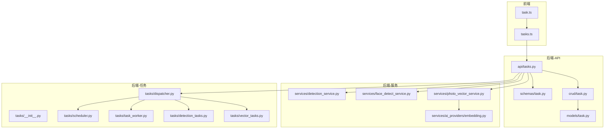
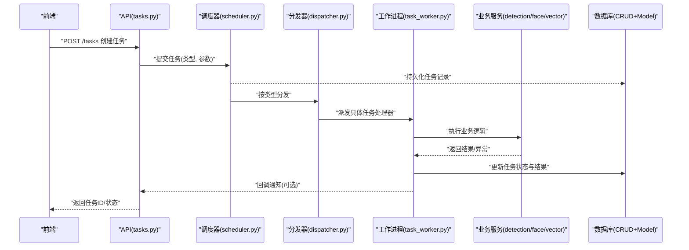
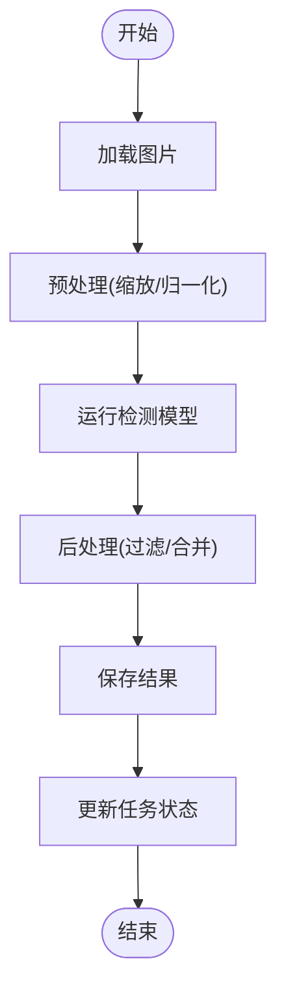
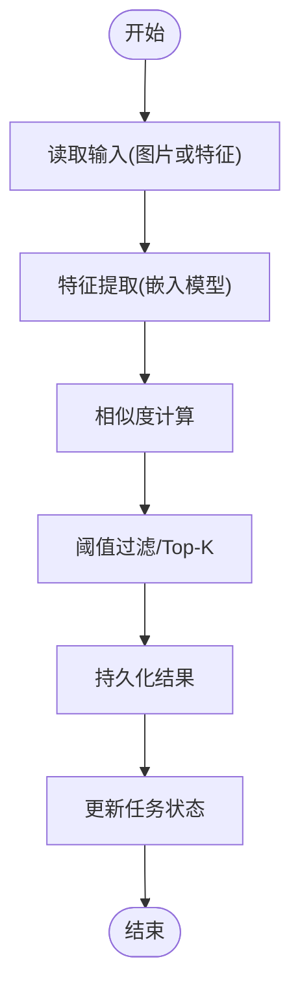
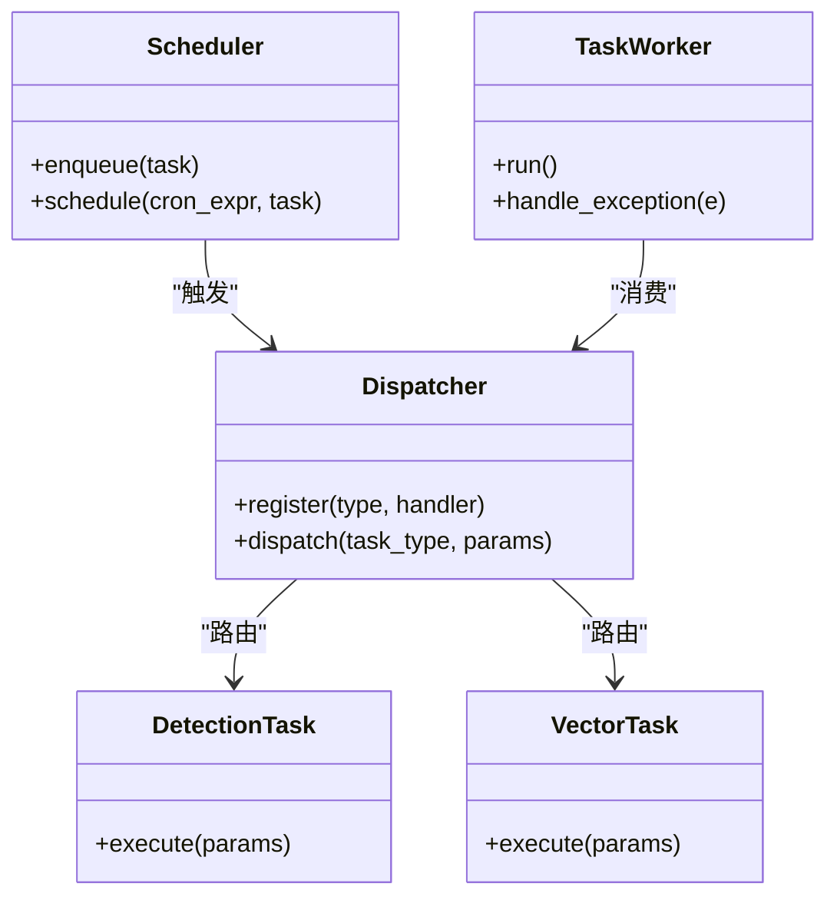
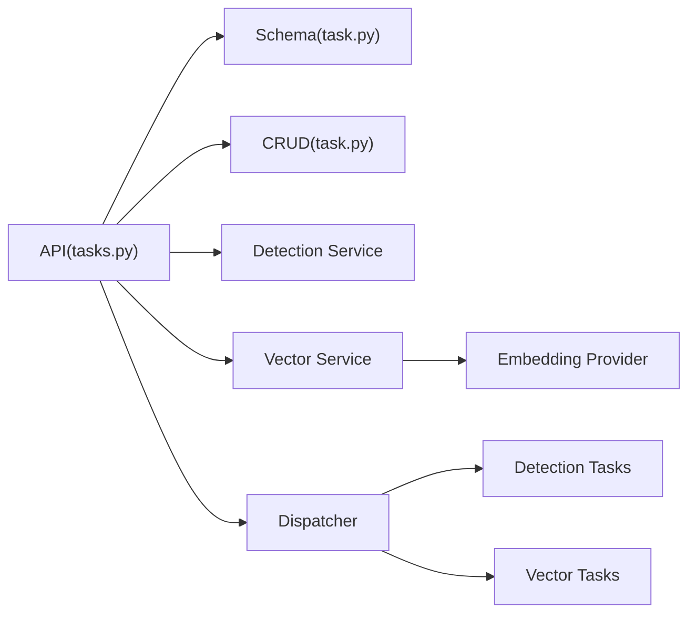

# 任务类型定义

<cite>
**本文引用的文件**   
- [backend/app/api/tasks.py](file://backend/app/api/tasks.py)
- [backend/app/schemas/task.py](file://backend/app/schemas/task.py)
- [backend/app/models/task.py](file://backend/app/models/task.py)
- [backend/app/crud/task.py](file://backend/app/crud/task.py)
- [backend/app/services/detection_service.py](file://backend/app/services/detection_service.py)
- [backend/app/services/face_detect_service.py](file://backend/app/services/face_detect_service.py)
- [backend/app/services/photo_vector_service.py](file://backend/app/services/photo_vector_service.py)
- [backend/app/services/ai_providers/embedding.py](file://backend/app/services/ai_providers/embedding.py)
- [backend/app/tasks/__init__.py](file://backend/app/tasks/__init__.py)
- [backend/app/tasks/dispatcher.py](file://backend/app/tasks/dispatcher.py)
- [backend/app/tasks/scheduler.py](file://backend/app/tasks/scheduler.py)
- [backend/app/tasks/task_worker.py](file://backend/app/tasks/task_worker.py)
- [backend/app/tasks/detection_tasks.py](file://backend/app/tasks/detection_tasks.py)
- [backend/app/tasks/vector_tasks.py](file://backend/app/tasks/vector_tasks.py)
- [frontend/src/api/tasks.ts](file://frontend/src/api/tasks.ts)
- [frontend/src/types/task.ts](file://frontend/src/types/task.ts)
</cite>

## 目录
1. [简介](#简介)
2. [项目结构](#项目结构)
3. [核心组件](#核心组件)
4. [架构总览](#架构总览)
5. [详细组件分析](#详细组件分析)
6. [依赖关系分析](#依赖关系分析)
7. [性能考虑](#性能考虑)
8. [故障排查指南](#故障排查指南)
9. [结论](#结论)
10. [附录](#附录)

## 简介
本文件聚焦于“任务类型定义”，围绕图片检测任务（人脸检测、物体识别）与向量计算任务（特征提取、相似度计算）进行系统化说明。文档从系统架构、数据流、处理逻辑、错误处理、参数配置、执行流程、结果处理、注册调用与监控、依赖管理与版本兼容等维度展开，并提供前后端示例路径，帮助读者快速理解并落地使用。

## 项目结构
后端采用分层设计：API 层暴露接口，Schema 定义请求/响应结构，CRUD 负责持久化，Services 封装业务逻辑，Tasks 提供异步任务调度与执行，AI Providers 对接外部或本地模型能力。前端通过 API 模块与类型定义与后端交互。

图表来源
- [backend/app/api/tasks.py](file://backend/app/api/tasks.py)
- [backend/app/schemas/task.py](file://backend/app/schemas/task.py)
- [backend/app/crud/task.py](file://backend/app/crud/task.py)
- [backend/app/models/task.py](file://backend/app/models/task.py)
- [backend/app/services/detection_service.py](file://backend/app/services/detection_service.py)
- [backend/app/services/face_detect_service.py](file://backend/app/services/face_detect_service.py)
- [backend/app/services/photo_vector_service.py](file://backend/app/services/photo_vector_service.py)
- [backend/app/services/ai_providers/embedding.py](file://backend/app/services/ai_providers/embedding.py)
- [backend/app/tasks/dispatcher.py](file://backend/app/tasks/dispatcher.py)
- [backend/app/tasks/scheduler.py](file://backend/app/tasks/scheduler.py)
- [backend/app/tasks/task_worker.py](file://backend/app/tasks/task_worker.py)
- [backend/app/tasks/detection_tasks.py](file://backend/app/tasks/detection_tasks.py)
- [backend/app/tasks/vector_tasks.py](file://backend/app/tasks/vector_tasks.py)
- [frontend/src/api/tasks.ts](file://frontend/src/api/tasks.ts)
- [frontend/src/types/task.ts](file://frontend/src/types/task.ts)

章节来源
- [backend/app/api/tasks.py](file://backend/app/api/tasks.py)
- [backend/app/schemas/task.py](file://backend/app/schemas/task.py)
- [backend/app/crud/task.py](file://backend/app/crud/task.py)
- [backend/app/models/task.py](file://backend/app/models/task.py)
- [backend/app/tasks/dispatcher.py](file://backend/app/tasks/dispatcher.py)
- [backend/app/tasks/scheduler.py](file://backend/app/tasks/scheduler.py)
- [backend/app/tasks/task_worker.py](file://backend/app/tasks/task_worker.py)
- [backend/app/tasks/detection_tasks.py](file://backend/app/tasks/detection_tasks.py)
- [backend/app/tasks/vector_tasks.py](file://backend/app/tasks/vector_tasks.py)
- [frontend/src/api/tasks.ts](file://frontend/src/api/tasks.ts)
- [frontend/src/types/task.ts](file://frontend/src/types/task.ts)

## 核心组件
- 任务模型与模式
  - 任务模型用于持久化任务元数据与状态；任务模式用于校验请求与响应结构。
- 任务调度与分发
  - 调度器负责定时/延迟任务；分发器根据任务类型路由到具体处理器；工作进程负责实际执行。
- 业务服务
  - 检测服务封装通用检测流程；人脸检测服务专注人脸相关逻辑；向量服务负责特征提取与相似度计算。
- AI 提供者
  - 嵌入提供者统一对外部或本地嵌入模型的调用，屏蔽差异。
- 前端接口与类型
  - 前端通过 tasks.ts 调用后端接口，使用 task.ts 的类型定义保证前后端一致性。

章节来源
- [backend/app/models/task.py](file://backend/app/models/task.py)
- [backend/app/schemas/task.py](file://backend/app/schemas/task.py)
- [backend/app/tasks/dispatcher.py](file://backend/app/tasks/dispatcher.py)
- [backend/app/tasks/scheduler.py](file://backend/app/tasks/scheduler.py)
- [backend/app/tasks/task_worker.py](file://backend/app/tasks/task_worker.py)
- [backend/app/services/detection_service.py](file://backend/app/services/detection_service.py)
- [backend/app/services/face_detect_service.py](file://backend/app/services/face_detect_service.py)
- [backend/app/services/photo_vector_service.py](file://backend/app/services/photo_vector_service.py)
- [backend/app/services/ai_providers/embedding.py](file://backend/app/services/ai_providers/embedding.py)
- [frontend/src/api/tasks.ts](file://frontend/src/api/tasks.ts)
- [frontend/src/types/task.ts](file://frontend/src/types/task.ts)

## 架构总览
下图展示一次“创建任务”的端到端流程：前端发起请求，后端校验并落库，随后将任务投递至调度/分发器，由工作进程执行具体任务，最终更新任务状态与结果。

图表来源
- [backend/app/api/tasks.py](file://backend/app/api/tasks.py)
- [backend/app/tasks/scheduler.py](file://backend/app/tasks/scheduler.py)
- [backend/app/tasks/dispatcher.py](file://backend/app/tasks/dispatcher.py)
- [backend/app/tasks/task_worker.py](file://backend/app/tasks/task_worker.py)
- [backend/app/crud/task.py](file://backend/app/crud/task.py)
- [backend/app/models/task.py](file://backend/app/models/task.py)

## 详细组件分析

### 任务类型与参数定义
- 任务类型
  - 图片检测类：人脸检测、物体识别
  - 向量计算类：特征提取、相似度计算
- 参数配置要点
  - 输入源：图片标识或存储路径
  - 算法选择：模型名称/版本、阈值、Top-K 等
  - 输出格式：结构化检测结果、向量维度、相似度阈值
  - 资源限制：并发度、超时时间、重试策略
- 校验与默认值
  - 通过 Schema 对必填字段、取值范围、枚举值进行校验
  - 未提供的可选参数使用默认值，确保向后兼容

章节来源
- [backend/app/schemas/task.py](file://backend/app/schemas/task.py)
- [backend/app/models/task.py](file://backend/app/models/task.py)

### 图片检测任务（人脸检测、物体识别）
- 实现要点
  - 统一入口：检测服务封装通用预处理、推理、后处理流程
  - 人脸检测：人脸检测服务在检测服务基础上增加人脸专属逻辑（如对齐、去重、聚类联动）
  - 物体识别：基于检测服务扩展类别映射与置信度过滤
- 执行流程
  - 接收任务 -> 加载图片 -> 模型推理 -> 结果清洗 -> 持久化 -> 状态更新
- 结果处理
  - 标准化边界框、标签、置信度；支持分页与聚合查询
- 错误处理
  - 模型加载失败、图片解码异常、IO 错误、超时等均有明确分支与日志

图表来源
- [backend/app/services/detection_service.py](file://backend/app/services/detection_service.py)
- [backend/app/services/face_detect_service.py](file://backend/app/services/face_detect_service.py)
- [backend/app/tasks/detection_tasks.py](file://backend/app/tasks/detection_tasks.py)

章节来源
- [backend/app/services/detection_service.py](file://backend/app/services/detection_service.py)
- [backend/app/services/face_detect_service.py](file://backend/app/services/face_detect_service.py)
- [backend/app/tasks/detection_tasks.py](file://backend/app/tasks/detection_tasks.py)

### 向量计算任务（特征提取、相似度计算）
- 实现要点
  - 特征提取：通过向量服务调用嵌入提供者，生成固定维度的特征向量
  - 相似度计算：基于已提取的特征进行距离度量（如余弦相似度），并按阈值筛选
- 执行流程
  - 接收任务 -> 读取图片/特征 -> 计算向量 -> 相似度排序 -> 结果持久化 -> 状态更新
- 结果处理
  - 返回 Top-K 相似项、相似度分数、匹配对象标识
- 错误处理
  - 嵌入模型不可用、维度不匹配、空输入、内存不足等异常分支

图表来源
- [backend/app/services/photo_vector_service.py](file://backend/app/services/photo_vector_service.py)
- [backend/app/services/ai_providers/embedding.py](file://backend/app/services/ai_providers/embedding.py)
- [backend/app/tasks/vector_tasks.py](file://backend/app/tasks/vector_tasks.py)

章节来源
- [backend/app/services/photo_vector_service.py](file://backend/app/services/photo_vector_service.py)
- [backend/app/services/ai_providers/embedding.py](file://backend/app/services/ai_providers/embedding.py)
- [backend/app/tasks/vector_tasks.py](file://backend/app/tasks/vector_tasks.py)

### 任务注册、分发与工作进程
- 任务注册
  - 在任务初始化文件中集中声明任务类型与处理器映射
- 分发器
  - 根据任务类型查找对应处理器，若不存在则返回错误
- 工作进程
  - 负责拉取任务、执行、捕获异常、更新状态与结果
- 调度器
  - 支持定时/延迟任务，保障高可用与可观测性

图表来源
- [backend/app/tasks/__init__.py](file://backend/app/tasks/__init__.py)
- [backend/app/tasks/dispatcher.py](file://backend/app/tasks/dispatcher.py)
- [backend/app/tasks/scheduler.py](file://backend/app/tasks/scheduler.py)
- [backend/app/tasks/task_worker.py](file://backend/app/tasks/task_worker.py)
- [backend/app/tasks/detection_tasks.py](file://backend/app/tasks/detection_tasks.py)
- [backend/app/tasks/vector_tasks.py](file://backend/app/tasks/vector_tasks.py)

章节来源
- [backend/app/tasks/__init__.py](file://backend/app/tasks/__init__.py)
- [backend/app/tasks/dispatcher.py](file://backend/app/tasks/dispatcher.py)
- [backend/app/tasks/scheduler.py](file://backend/app/tasks/scheduler.py)
- [backend/app/tasks/task_worker.py](file://backend/app/tasks/task_worker.py)
- [backend/app/tasks/detection_tasks.py](file://backend/app/tasks/detection_tasks.py)
- [backend/app/tasks/vector_tasks.py](file://backend/app/tasks/vector_tasks.py)

### 前端调用与类型定义
- 前端 API
  - 通过 tasks.ts 封装创建任务、查询状态、获取结果等方法
- 类型定义
  - 使用 task.ts 定义任务类型、参数、结果结构，确保前后端一致
- 典型用法
  - 创建任务：传入任务类型与参数，返回任务 ID
  - 轮询状态：根据任务 ID 查询任务进度
  - 获取结果：任务完成后拉取结果数据

章节来源
- [frontend/src/api/tasks.ts](file://frontend/src/api/tasks.ts)
- [frontend/src/types/task.ts](file://frontend/src/types/task.ts)

## 依赖关系分析
- 组件耦合
  - API 层依赖 Schema 与 CRUD；业务服务依赖 AI 提供者；任务层依赖调度器与分发器
- 外部依赖
  - 嵌入提供者可能依赖外部模型服务或本地推理引擎
- 潜在循环依赖
  - 建议保持单向依赖：API -> Services/Tasks -> Providers/DB
- 接口契约
  - 通过 Schema 与类型定义约束输入输出，降低耦合

图表来源
- [backend/app/api/tasks.py](file://backend/app/api/tasks.py)
- [backend/app/schemas/task.py](file://backend/app/schemas/task.py)
- [backend/app/crud/task.py](file://backend/app/crud/task.py)
- [backend/app/services/detection_service.py](file://backend/app/services/detection_service.py)
- [backend/app/services/photo_vector_service.py](file://backend/app/services/photo_vector_service.py)
- [backend/app/services/ai_providers/embedding.py](file://backend/app/services/ai_providers/embedding.py)
- [backend/app/tasks/dispatcher.py](file://backend/app/tasks/dispatcher.py)
- [backend/app/tasks/detection_tasks.py](file://backend/app/tasks/detection_tasks.py)
- [backend/app/tasks/vector_tasks.py](file://backend/app/tasks/vector_tasks.py)

章节来源
- [backend/app/api/tasks.py](file://backend/app/api/tasks.py)
- [backend/app/schemas/task.py](file://backend/app/schemas/task.py)
- [backend/app/crud/task.py](file://backend/app/crud/task.py)
- [backend/app/services/detection_service.py](file://backend/app/services/detection_service.py)
- [backend/app/services/photo_vector_service.py](file://backend/app/services/photo_vector_service.py)
- [backend/app/services/ai_providers/embedding.py](file://backend/app/services/ai_providers/embedding.py)
- [backend/app/tasks/dispatcher.py](file://backend/app/tasks/dispatcher.py)
- [backend/app/tasks/detection_tasks.py](file://backend/app/tasks/detection_tasks.py)
- [backend/app/tasks/vector_tasks.py](file://backend/app/tasks/vector_tasks.py)

## 性能考虑
- 批处理与缓存
  - 批量图片检测与特征提取可降低模型加载与 IO 开销
  - 对热点特征向量建立缓存，减少重复计算
- 并发与限流
  - 合理设置工作进程数与队列长度，避免资源争用
- 模型优化
  - 使用量化/剪枝模型，缩短推理时延
- 结果分页与增量更新
  - 大结果集采用分页与增量同步，降低传输压力

[本节为通用指导，无需特定文件引用]

## 故障排查指南
- 常见问题定位
  - 任务无法创建：检查 Schema 校验与必填字段
  - 任务卡住：查看调度器与分发器日志，确认工作进程是否存活
  - 检测结果为空：核对图片路径、模型权重、阈值配置
  - 相似度无结果：检查特征维度、相似度阈值、索引是否存在
- 日志与监控
  - 关键节点打点：任务入队、开始执行、完成、失败
  - 指标上报：耗时、成功率、错误码分布
- 恢复策略
  - 失败重试与退避；死信队列兜底；人工介入复核

章节来源
- [backend/app/tasks/task_worker.py](file://backend/app/tasks/task_worker.py)
- [backend/app/tasks/dispatcher.py](file://backend/app/tasks/dispatcher.py)
- [backend/app/tasks/scheduler.py](file://backend/app/tasks/scheduler.py)

## 结论
本任务体系以清晰的类型定义与分层架构为基础，将图片检测与向量计算两类核心能力解耦为独立任务，并通过调度与分发机制实现可扩展的执行框架。配合完善的参数校验、错误处理与监控手段，可在生产环境中稳定运行并持续演进。

[本节为总结性内容，无需特定文件引用]

## 附录

### 任务参数配置清单（示例）
- 通用参数
  - 任务类型、输入源、超时时间、重试次数
- 检测任务
  - 模型名称/版本、置信度阈值、NMS 参数、类别白名单
- 向量任务
  - 嵌入模型版本、向量维度、相似度度量方式、Top-K、相似度阈值

章节来源
- [backend/app/schemas/task.py](file://backend/app/schemas/task.py)

### 任务注册与调用示例（路径指引）
- 后端注册
  - 在任务初始化文件中注册任务类型与处理器映射
- 后端调用
  - 通过 API 创建任务，调度器入队，分发器路由，工作进程执行
- 前端调用
  - 使用 tasks.ts 封装方法创建任务与查询状态
- 参考路径
  - 注册：[backend/app/tasks/__init__.py](file://backend/app/tasks/__init__.py)
  - 分发：[backend/app/tasks/dispatcher.py](file://backend/app/tasks/dispatcher.py)
  - 工作进程：[backend/app/tasks/task_worker.py](file://backend/app/tasks/task_worker.py)
  - 检测任务：[backend/app/tasks/detection_tasks.py](file://backend/app/tasks/detection_tasks.py)
  - 向量任务：[backend/app/tasks/vector_tasks.py](file://backend/app/tasks/vector_tasks.py)
  - 前端 API：[frontend/src/api/tasks.ts](file://frontend/src/api/tasks.ts)

### 版本兼容性处理
- 向后兼容
  - 新增可选参数时保留默认值，旧客户端仍可正常调用
- 模型版本
  - 通过模型名称/版本号区分不同实现，避免破坏既有行为
- 迁移策略
  - 渐进式升级：先兼容旧参数，再废弃旧字段，最后清理历史数据

章节来源
- [backend/app/schemas/task.py](file://backend/app/schemas/task.py)
- [backend/app/models/task.py](file://backend/app/models/task.py)