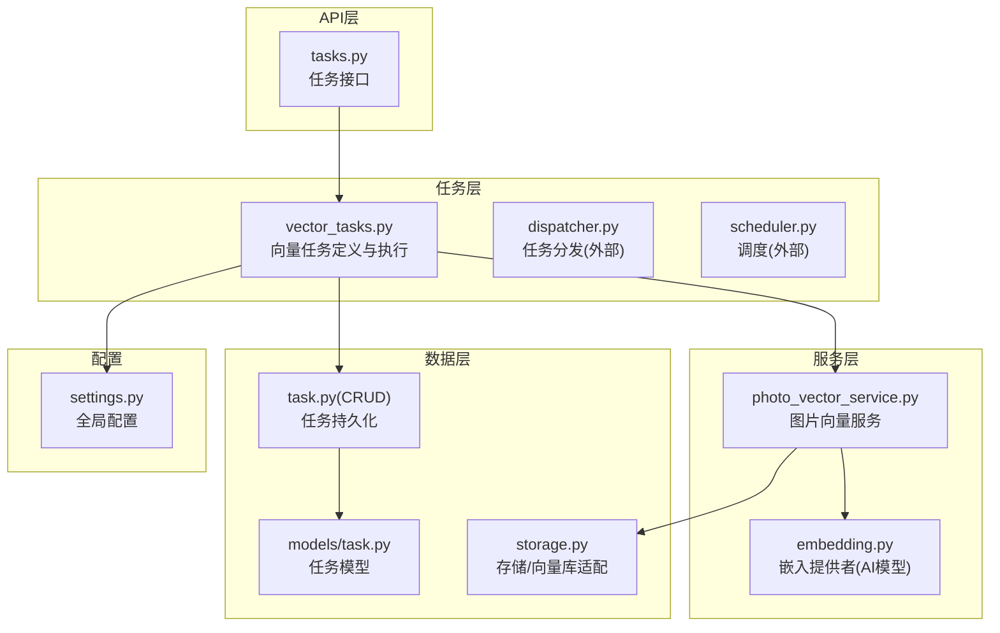
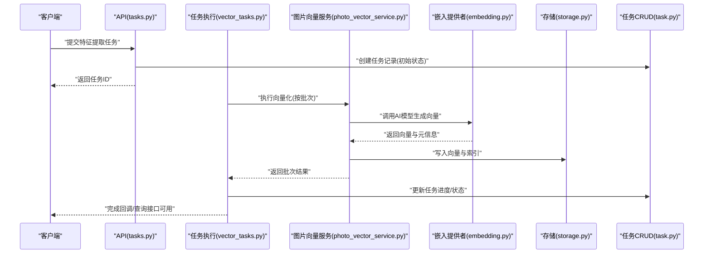
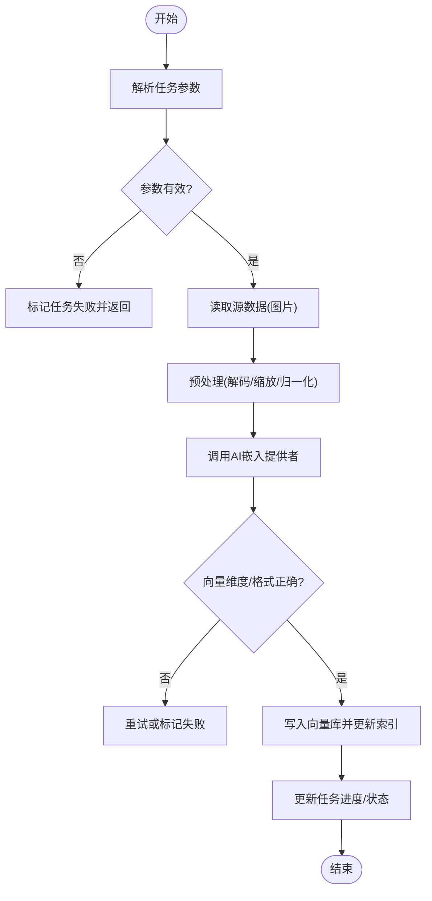
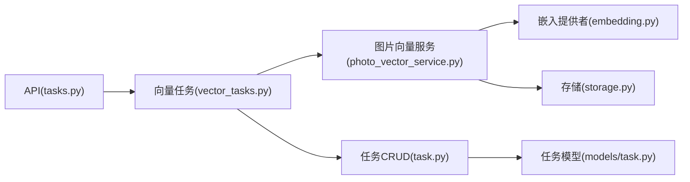

# 向量计算任务

<cite>
**本文引用的文件**   
- [backend/app/tasks/vector_tasks.py](file://backend/app/tasks/vector_tasks.py)
- [backend/app/services/photo_vector_service.py](file://backend/app/services/photo_vector_service.py)
- [backend/app/services/ai_providers/embedding.py](file://backend/app/services/ai_providers/embedding.py)
- [backend/app/api/tasks.py](file://backend/app/api/tasks.py)
- [backend/app/crud/task.py](file://backend/app/crud/task.py)
- [backend/app/models/task.py](file://backend/app/models/task.py)
- [backend/app/schemas/task.py](file://backend/app/schemas/task.py)
- [backend/app/database/storage.py](file://backend/app/database/storage.py)
- [backend/app/config/settings.py](file://backend/app/config/settings.py)
</cite>

## 目录
1. [简介](#简介)
2. [项目结构](#项目结构)
3. [核心组件](#核心组件)
4. [架构总览](#架构总览)
5. [详细组件分析](#详细组件分析)
6. [依赖关系分析](#依赖关系分析)
7. [性能考虑](#性能考虑)
8. [故障排查指南](#故障排查指南)
9. [结论](#结论)
10. [附录](#附录)

## 简介
本文件围绕“向量计算任务”展开，聚焦于特征提取与相似度计算两大任务类型。文档基于实际代码实现，说明任务的定义、执行流程、参数配置、批量处理与增量更新策略，并给出向量数据库集成、缓存与索引优化建议，以及维度管理、版本兼容性与数据迁移方案。读者无需深入底层细节即可理解整体设计与使用方式。

## 项目结构
后端采用分层架构：API层暴露任务接口；任务调度与Worker负责异步执行；服务层封装AI模型调用与业务逻辑；数据访问层负责持久化与存储；配置中心提供运行时参数。

图表来源
- [backend/app/api/tasks.py](file://backend/app/api/tasks.py)
- [backend/app/tasks/vector_tasks.py](file://backend/app/tasks/vector_tasks.py)
- [backend/app/services/photo_vector_service.py](file://backend/app/services/photo_vector_service.py)
- [backend/app/services/ai_providers/embedding.py](file://backend/app/services/ai_providers/embedding.py)
- [backend/app/crud/task.py](file://backend/app/crud/task.py)
- [backend/app/models/task.py](file://backend/app/models/task.py)
- [backend/app/database/storage.py](file://backend/app/database/storage.py)
- [backend/app/config/settings.py](file://backend/app/config/settings.py)

章节来源
- [backend/app/api/tasks.py](file://backend/app/api/tasks.py)
- [backend/app/tasks/vector_tasks.py](file://backend/app/tasks/vector_tasks.py)
- [backend/app/services/photo_vector_service.py](file://backend/app/services/photo_vector_service.py)
- [backend/app/services/ai_providers/embedding.py](file://backend/app/services/ai_providers/embedding.py)
- [backend/app/crud/task.py](file://backend/app/crud/task.py)
- [backend/app/models/task.py](file://backend/app/models/task.py)
- [backend/app/database/storage.py](file://backend/app/database/storage.py)
- [backend/app/config/settings.py](file://backend/app/config/settings.py)

## 核心组件
- 向量任务定义与执行器：负责解析任务参数、编排执行步骤（读取媒体、调用AI生成向量、落库、更新任务状态）。
- 图片向量服务：封装图片向量化流程，包括预处理、模型调用、结果校验与写入。
- AI嵌入提供者：统一对外部AI模型的调用接口，支持多提供商与可插拔扩展。
- 任务CRUD与模型：维护任务生命周期、状态机与元数据。
- 存储抽象：对接向量数据库或本地存储，提供统一的增删改查与索引能力。
- 配置中心：集中管理模型路径、并发度、超时、重试等运行参数。

章节来源
- [backend/app/tasks/vector_tasks.py](file://backend/app/tasks/vector_tasks.py)
- [backend/app/services/photo_vector_service.py](file://backend/app/services/photo_vector_service.py)
- [backend/app/services/ai_providers/embedding.py](file://backend/app/services/ai_providers/embedding.py)
- [backend/app/crud/task.py](file://backend/app/crud/task.py)
- [backend/app/models/task.py](file://backend/app/models/task.py)
- [backend/app/database/storage.py](file://backend/app/database/storage.py)
- [backend/app/config/settings.py](file://backend/app/config/settings.py)

## 架构总览
下图展示一次“特征提取任务”的端到端流程：API接收请求→创建任务记录→调度至Worker→执行向量生成→写入向量库→更新任务状态。

图表来源
- [backend/app/api/tasks.py](file://backend/app/api/tasks.py)
- [backend/app/tasks/vector_tasks.py](file://backend/app/tasks/vector_tasks.py)
- [backend/app/services/photo_vector_service.py](file://backend/app/services/photo_vector_service.py)
- [backend/app/services/ai_providers/embedding.py](file://backend/app/services/ai_providers/embedding.py)
- [backend/app/crud/task.py](file://backend/app/crud/task.py)
- [backend/app/database/storage.py](file://backend/app/database/storage.py)

## 详细组件分析

### 任务定义与执行流程
- 任务类型
  - 特征提取：对图片进行AI推理，生成固定维度的特征向量，并持久化到向量库。
  - 相似度计算：以查询向量或图片为输入，在向量库中检索Top-K相似结果。
- 执行步骤
  - 参数校验与资源准备（并发、批大小、超时、重试）。
  - 读取源数据（图片路径/URL），必要时做解码与缩放。
  - 调用AI嵌入提供者生成向量，并进行维度与范围校验。
  - 写入向量库，建立或更新索引。
  - 更新任务状态与进度，记录错误与日志。
- 失败与重试
  - 网络异常、模型不可用、向量维度不匹配等情况需触发重试或降级策略。
  - 支持幂等写入，避免重复生成导致的数据不一致。

图表来源
- [backend/app/tasks/vector_tasks.py](file://backend/app/tasks/vector_tasks.py)
- [backend/app/services/photo_vector_service.py](file://backend/app/services/photo_vector_service.py)
- [backend/app/services/ai_providers/embedding.py](file://backend/app/services/ai_providers/embedding.py)
- [backend/app/database/storage.py](file://backend/app/database/storage.py)
- [backend/app/crud/task.py](file://backend/app/crud/task.py)

章节来源
- [backend/app/tasks/vector_tasks.py](file://backend/app/tasks/vector_tasks.py)
- [backend/app/services/photo_vector_service.py](file://backend/app/services/photo_vector_service.py)
- [backend/app/services/ai_providers/embedding.py](file://backend/app/services/ai_providers/embedding.py)
- [backend/app/database/storage.py](file://backend/app/database/storage.py)
- [backend/app/crud/task.py](file://backend/app/crud/task.py)

### 特征提取任务（Feature Extraction）
- 输入
  - 图片集合（路径/URL列表）、目标维度、模型标识、是否覆盖已有向量。
- 处理
  - 分批读取图片，逐批调用AI模型生成向量。
  - 将向量与图片标识关联写入向量库，同时更新任务进度。
- 输出
  - 成功：向量入库，任务状态完成。
  - 失败：记录错误原因，支持断点续跑。

章节来源
- [backend/app/tasks/vector_tasks.py](file://backend/app/tasks/vector_tasks.py)
- [backend/app/services/photo_vector_service.py](file://backend/app/services/photo_vector_service.py)
- [backend/app/services/ai_providers/embedding.py](file://backend/app/services/ai_providers/embedding.py)
- [backend/app/database/storage.py](file://backend/app/database/storage.py)
- [backend/app/crud/task.py](file://backend/app/crud/task.py)

### 相似度计算任务（Similarity Search）
- 输入
  - 查询向量或图片、Top-K、相似度阈值、过滤条件（如时间范围、标签）。
- 处理
  - 若输入为图片，先转换为查询向量。
  - 调用向量库检索接口，应用过滤与排序。
- 输出
  - Top-K相似结果（含距离/分数、元数据）。

章节来源
- [backend/app/tasks/vector_tasks.py](file://backend/app/tasks/vector_tasks.py)
- [backend/app/services/photo_vector_service.py](file://backend/app/services/photo_vector_service.py)
- [backend/app/database/storage.py](file://backend/app/database/storage.py)

### AI模型调用与向量生成
- 嵌入提供者
  - 统一接口封装不同AI提供商的调用细节（鉴权、超时、重试、限流）。
  - 支持模型版本选择与回退策略。
- 向量生成
  - 输入预处理后送入模型，得到固定维度向量。
  - 对向量进行标准化与有效性检查。

章节来源
- [backend/app/services/ai_providers/embedding.py](file://backend/app/services/ai_providers/embedding.py)
- [backend/app/services/photo_vector_service.py](file://backend/app/services/photo_vector_service.py)

### 存储管理与查询优化
- 存储抽象
  - 统一向量库接口：插入、批量写入、删除、更新、检索、建索引。
  - 支持本地磁盘与分布式向量库两种模式。
- 查询优化
  - 预构建HNSW/IVF等索引；按需重建索引。
  - 分页与游标式遍历，避免全表扫描。
  - 热点数据缓存（最近查询结果、热门向量）。

章节来源
- [backend/app/database/storage.py](file://backend/app/database/storage.py)
- [backend/app/services/photo_vector_service.py](file://backend/app/services/photo_vector_service.py)

### 任务参数配置
- 通用参数
  - 并发度、批大小、超时、重试次数、幂等键策略。
- 模型相关
  - 模型名称/版本、设备（CPU/GPU）、精度（FP32/FP16）。
- 存储相关
  - 向量库连接、索引类型、分区策略。
- 监控与日志
  - 指标上报、采样率、告警阈值。

章节来源
- [backend/app/config/settings.py](file://backend/app/config/settings.py)
- [backend/app/schemas/task.py](file://backend/app/schemas/task.py)

### 批量处理与增量更新
- 批量处理
  - 按批大小切分任务，控制内存占用与吞吐。
  - 失败批次隔离与重试，不影响其他批次。
- 增量更新
  - 基于时间戳或版本号判断新增/变更数据。
  - 支持幂等写入，避免重复向量。

章节来源
- [backend/app/tasks/vector_tasks.py](file://backend/app/tasks/vector_tasks.py)
- [backend/app/services/photo_vector_service.py](file://backend/app/services/photo_vector_service.py)
- [backend/app/crud/task.py](file://backend/app/crud/task.py)

### 任务API与状态管理
- 任务接口
  - 创建任务、查询进度、取消任务、获取结果。
- 状态机
  - 待处理、进行中、已完成、失败、已取消。
- 幂等与去重
  - 通过任务ID与幂等键保证多次提交的稳定性。

章节来源
- [backend/app/api/tasks.py](file://backend/app/api/tasks.py)
- [backend/app/crud/task.py](file://backend/app/crud/task.py)
- [backend/app/models/task.py](file://backend/app/models/task.py)
- [backend/app/schemas/task.py](file://backend/app/schemas/task.py)

## 依赖关系分析
- 组件耦合
  - API层仅依赖任务执行器与任务CRUD，保持低耦合。
  - 任务执行器依赖图片向量服务与存储抽象，屏蔽具体实现。
  - 图片向量服务依赖AI嵌入提供者与存储抽象，便于替换模型与向量库。
- 外部依赖
  - AI模型服务（HTTP/gRPC）、向量数据库、对象存储（可选）。
- 潜在循环依赖
  - 当前设计无直接循环依赖；如需扩展，应通过接口解耦。

图表来源
- [backend/app/api/tasks.py](file://backend/app/api/tasks.py)
- [backend/app/tasks/vector_tasks.py](file://backend/app/tasks/vector_tasks.py)
- [backend/app/services/photo_vector_service.py](file://backend/app/services/photo_vector_service.py)
- [backend/app/services/ai_providers/embedding.py](file://backend/app/services/ai_providers/embedding.py)
- [backend/app/crud/task.py](file://backend/app/crud/task.py)
- [backend/app/models/task.py](file://backend/app/models/task.py)
- [backend/app/database/storage.py](file://backend/app/database/storage.py)

章节来源
- [backend/app/api/tasks.py](file://backend/app/api/tasks.py)
- [backend/app/tasks/vector_tasks.py](file://backend/app/tasks/vector_tasks.py)
- [backend/app/services/photo_vector_service.py](file://backend/app/services/photo_vector_service.py)
- [backend/app/services/ai_providers/embedding.py](file://backend/app/services/ai_providers/embedding.py)
- [backend/app/crud/task.py](file://backend/app/crud/task.py)
- [backend/app/models/task.py](file://backend/app/models/task.py)
- [backend/app/database/storage.py](file://backend/app/database/storage.py)

## 性能考虑
- 并发与批处理
  - 合理设置并发度与批大小，平衡吞吐与内存占用。
  - 对AI模型调用启用连接池与超时控制。
- 索引与检索
  - 根据数据规模选择合适索引（HNSW/IVF/PQ），定期评估召回率与延迟。
  - 对高频查询引入缓存层，减少向量库压力。
- 存储与IO
  - 图片读取采用流式与缓存，避免重复解码。
  - 向量写入采用批量事务，降低写放大。
- 资源隔离
  - 将AI推理与向量检索分离部署，避免相互影响。

[本节为通用指导，不涉及具体文件]

## 故障排查指南
- 常见问题
  - AI模型不可用：检查鉴权、网络连通性、模型版本兼容性。
  - 向量维度不匹配：确认模型输出维度与存储配置一致。
  - 写入失败：检查向量库连接、权限与索引状态。
  - 任务卡住：查看任务状态机与日志，确认是否存在死锁或资源耗尽。
- 定位方法
  - 通过任务ID查询进度与错误堆栈。
  - 开启调试日志，关注关键节点耗时与重试次数。
  - 对比历史成功任务参数，快速定位差异。

章节来源
- [backend/app/tasks/vector_tasks.py](file://backend/app/tasks/vector_tasks.py)
- [backend/app/crud/task.py](file://backend/app/crud/task.py)
- [backend/app/models/task.py](file://backend/app/models/task.py)

## 结论
本项目将向量计算任务拆分为清晰的任务定义、服务编排与存储抽象，具备良好的可扩展性与可维护性。通过合理的批处理、重试与索引策略，可在大规模图片场景下稳定运行。后续可进一步引入更细粒度的监控与自动化运维能力。

[本节为总结，不涉及具体文件]

## 附录

### 任务参数配置示例（说明性）
- 特征提取
  - 并发度：根据GPU/CPU资源调整
  - 批大小：根据内存上限设定
  - 模型版本：指定模型标识
  - 覆盖策略：是否覆盖已有向量
- 相似度计算
  - Top-K：检索数量
  - 相似度阈值：过滤低置信结果
  - 过滤条件：时间、标签、相册等

章节来源
- [backend/app/config/settings.py](file://backend/app/config/settings.py)
- [backend/app/schemas/task.py](file://backend/app/schemas/task.py)

### 批量处理与增量更新示例（说明性）
- 批量处理
  - 将任务按批大小切分，逐批执行与落库
  - 失败批次单独重试，不影响整体进度
- 增量更新
  - 基于更新时间戳或版本号识别新增/变更
  - 幂等写入避免重复向量

章节来源
- [backend/app/tasks/vector_tasks.py](file://backend/app/tasks/vector_tasks.py)
- [backend/app/services/photo_vector_service.py](file://backend/app/services/photo_vector_service.py)
- [backend/app/crud/task.py](file://backend/app/crud/task.py)

### 向量数据库集成、缓存与索引优化（说明性）
- 集成要点
  - 统一存储接口，屏蔽底层差异
  - 连接池、重试与熔断
- 缓存策略
  - 最近查询结果缓存
  - 热门向量缓存
- 索引优化
  - 选择合适的索引类型与参数
  - 定期重建与评估

章节来源
- [backend/app/database/storage.py](file://backend/app/database/storage.py)
- [backend/app/services/photo_vector_service.py](file://backend/app/services/photo_vector_service.py)

### 向量维度管理、版本兼容性与数据迁移（说明性）
- 维度管理
  - 模型输出维度与存储配置强一致
  - 启动时校验维度一致性
- 版本兼容
  - 模型版本与向量库版本声明
  - 灰度发布与回滚策略
- 数据迁移
  - 离线脚本批量重算向量
  - 双写过渡期保障一致性

章节来源
- [backend/app/services/ai_providers/embedding.py](file://backend/app/services/ai_providers/embedding.py)
- [backend/app/database/storage.py](file://backend/app/database/storage.py)
- [backend/app/config/settings.py](file://backend/app/config/settings.py)