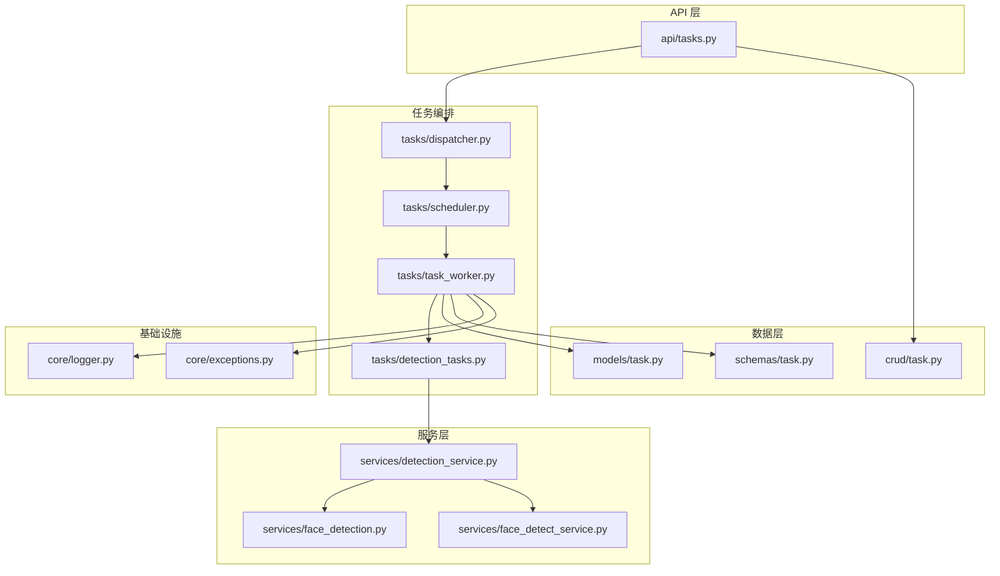
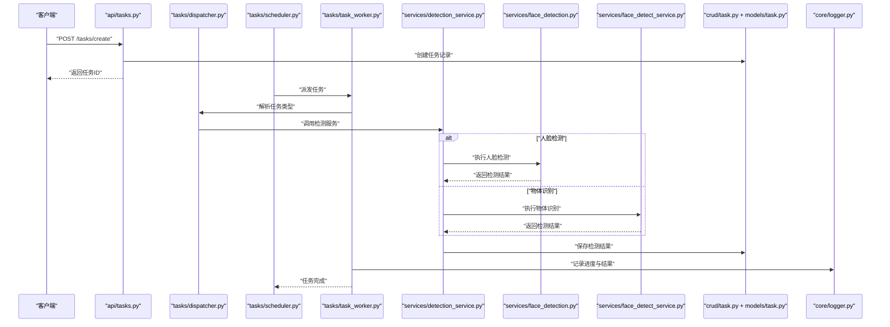
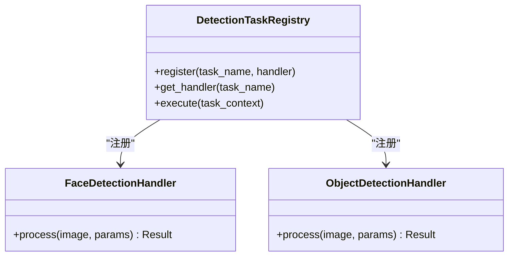
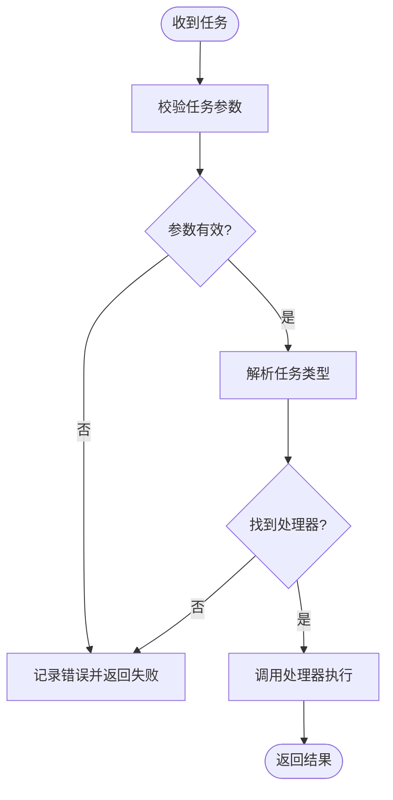
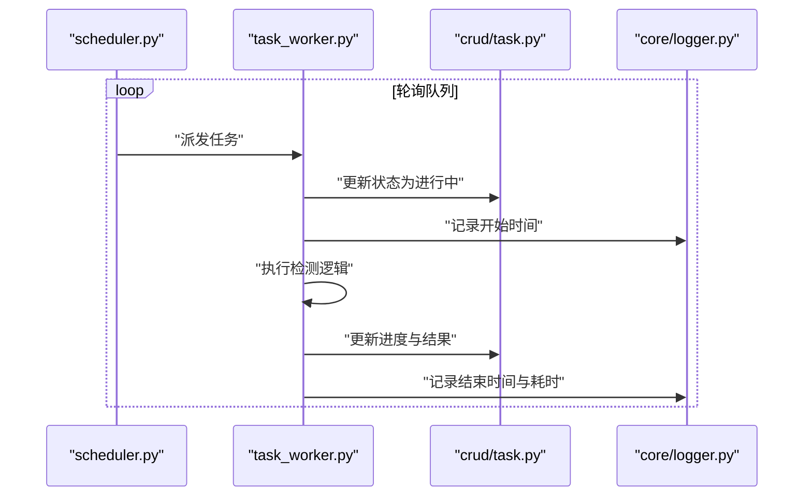
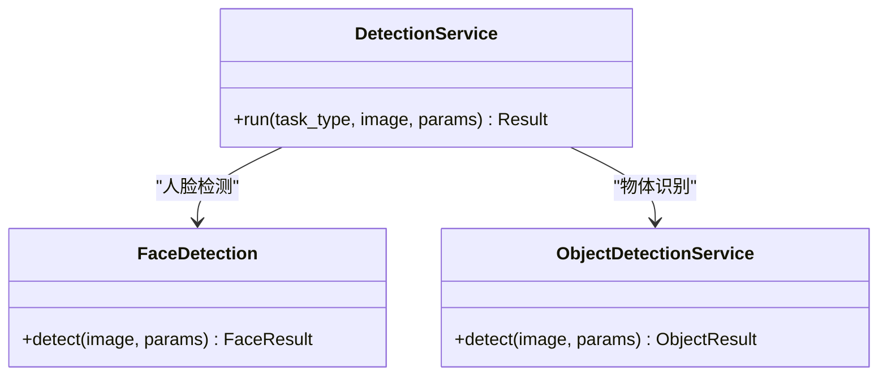
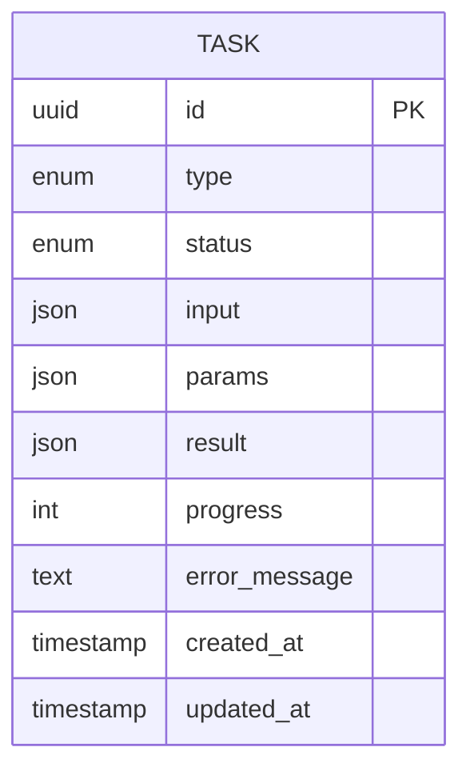
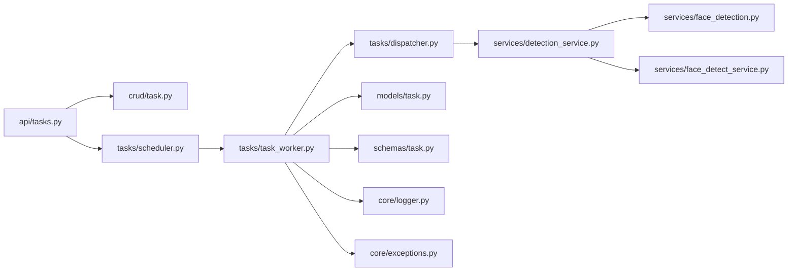

# 检测任务

<cite>
**本文引用的文件**   
- [backend/app/tasks/detection_tasks.py](file://backend/app/tasks/detection_tasks.py)
- [backend/app/tasks/dispatcher.py](file://backend/app/tasks/dispatcher.py)
- [backend/app/tasks/scheduler.py](file://backend/app/tasks/scheduler.py)
- [backend/app/tasks/task_worker.py](file://backend/app/tasks/task_worker.py)
- [backend/app/services/detection_service.py](file://backend/app/services/detection_service.py)
- [backend/app/services/face_detection.py](file://backend/app/services/face_detection.py)
- [backend/app/services/face_detect_service.py](file://backend/app/services/face_detect_service.py)
- [backend/app/api/tasks.py](file://backend/app/api/tasks.py)
- [backend/app/crud/task.py](file://backend/app/crud/task.py)
- [backend/app/models/task.py](file://backend/app/models/task.py)
- [backend/app/schemas/task.py](file://backend/app/schemas/task.py)
- [backend/app/core/logger.py](file://backend/app/core/logger.py)
- [backend/app/core/exceptions.py](file://backend/app/core/exceptions.py)
</cite>

## 目录
1. [简介](#简介)
2. [项目结构](#项目结构)
3. [核心组件](#核心组件)
4. [架构总览](#架构总览)
5. [详细组件分析](#详细组件分析)
6. [依赖关系分析](#依赖关系分析)
7. [性能考虑](#性能考虑)
8. [故障排查指南](#故障排查指南)
9. [结论](#结论)
10. [附录](#附录)

## 简介
本文件围绕“图片检测任务”的完整实现进行系统化说明，涵盖任务定义、注册与调度、异步执行、进度跟踪、失败重试、结果格式化与错误处理。重点覆盖两类检测任务：
- 人脸检测任务：对照片进行人脸定位与特征抽取，用于后续聚类与检索。
- 物体识别任务：基于通用目标检测模型对图像中的物体进行检测与标注。

文档同时提供任务注册、调用与监控的示例路径，并给出性能优化建议与常见问题排查方法。

## 项目结构
检测任务相关代码主要分布在以下模块：
- 任务定义与编排：tasks 包（detection_tasks、dispatcher、scheduler、task_worker）
- 服务层：services 包（detection_service、face_detection、face_detect_service）
- API 层：api/tasks.py（对外接口）
- 数据层：models/task.py、schemas/task.py、crud/task.py
- 基础设施：core/logger.py、core/exceptions.py

图表来源
- [backend/app/api/tasks.py](file://backend/app/api/tasks.py)
- [backend/app/tasks/dispatcher.py](file://backend/app/tasks/dispatcher.py)
- [backend/app/tasks/scheduler.py](file://backend/app/tasks/scheduler.py)
- [backend/app/tasks/task_worker.py](file://backend/app/tasks/task_worker.py)
- [backend/app/tasks/detection_tasks.py](file://backend/app/tasks/detection_tasks.py)
- [backend/app/services/detection_service.py](file://backend/app/services/detection_service.py)
- [backend/app/services/face_detection.py](file://backend/app/services/face_detection.py)
- [backend/app/services/face_detect_service.py](file://backend/app/services/face_detect_service.py)
- [backend/app/models/task.py](file://backend/app/models/task.py)
- [backend/app/schemas/task.py](file://backend/app/schemas/task.py)
- [backend/app/crud/task.py](file://backend/app/crud/task.py)
- [backend/app/core/logger.py](file://backend/app/core/logger.py)
- [backend/app/core/exceptions.py](file://backend/app/core/exceptions.py)

章节来源
- [backend/app/tasks/detection_tasks.py](file://backend/app/tasks/detection_tasks.py)
- [backend/app/tasks/dispatcher.py](file://backend/app/tasks/dispatcher.py)
- [backend/app/tasks/scheduler.py](file://backend/app/tasks/scheduler.py)
- [backend/app/tasks/task_worker.py](file://backend/app/tasks/task_worker.py)
- [backend/app/services/detection_service.py](file://backend/app/services/detection_service.py)
- [backend/app/services/face_detection.py](file://backend/app/services/face_detection.py)
- [backend/app/services/face_detect_service.py](file://backend/app/services/face_detect_service.py)
- [backend/app/api/tasks.py](file://backend/app/api/tasks.py)
- [backend/app/crud/task.py](file://backend/app/crud/task.py)
- [backend/app/models/task.py](file://backend/app/models/task.py)
- [backend/app/schemas/task.py](file://backend/app/schemas/task.py)
- [backend/app/core/logger.py](file://backend/app/core/logger.py)
- [backend/app/core/exceptions.py](file://backend/app/core/exceptions.py)

## 核心组件
- 任务定义与注册
  - detection_tasks.py：定义检测任务的类型、参数结构与执行入口；包含人脸检测与物体识别的任务处理器。
  - dispatcher.py：负责任务分发与路由，将请求映射到具体任务处理器。
- 调度与执行
  - scheduler.py：定时或事件驱动的调度器，按策略触发任务。
  - task_worker.py：工作进程，负责拉取任务、执行、更新状态与持久化结果。
- 服务层
  - detection_service.py：统一的检测服务门面，协调不同检测算法。
  - face_detection.py / face_detect_service.py：人脸检测的具体实现与服务封装。
- API 与数据
  - api/tasks.py：暴露创建、查询、批量提交等任务接口。
  - models/task.py、schemas/task.py、crud/task.py：任务实体、序列化与数据库操作。
- 基础设施
  - core/logger.py：结构化日志记录。
  - core/exceptions.py：统一异常定义与错误码。

章节来源
- [backend/app/tasks/detection_tasks.py](file://backend/app/tasks/detection_tasks.py)
- [backend/app/tasks/dispatcher.py](file://backend/app/tasks/dispatcher.py)
- [backend/app/tasks/scheduler.py](file://backend/app/tasks/scheduler.py)
- [backend/app/tasks/task_worker.py](file://backend/app/tasks/task_worker.py)
- [backend/app/services/detection_service.py](file://backend/app/services/detection_service.py)
- [backend/app/services/face_detection.py](file://backend/app/services/face_detection.py)
- [backend/app/services/face_detect_service.py](file://backend/app/services/face_detect_service.py)
- [backend/app/api/tasks.py](file://backend/app/api/tasks.py)
- [backend/app/models/task.py](file://backend/app/models/task.py)
- [backend/app/schemas/task.py](file://backend/app/schemas/task.py)
- [backend/app/crud/task.py](file://backend/app/crud/task.py)
- [backend/app/core/logger.py](file://backend/app/core/logger.py)
- [backend/app/core/exceptions.py](file://backend/app/core/exceptions.py)

## 架构总览
检测任务的整体流程如下：
- 客户端通过 API 提交检测任务（支持单张或多张图片）。
- 任务被持久化并进入队列，由调度器分配给工作进程。
- 工作进程根据任务类型选择对应服务（人脸检测或物体识别），执行检测并写入结果。
- 进度与结果通过数据库与日志系统对外可观测。

图表来源
- [backend/app/api/tasks.py](file://backend/app/api/tasks.py)
- [backend/app/tasks/dispatcher.py](file://backend/app/tasks/dispatcher.py)
- [backend/app/tasks/scheduler.py](file://backend/app/tasks/scheduler.py)
- [backend/app/tasks/task_worker.py](file://backend/app/tasks/task_worker.py)
- [backend/app/services/detection_service.py](file://backend/app/services/detection_service.py)
- [backend/app/services/face_detection.py](file://backend/app/services/face_detection.py)
- [backend/app/services/face_detect_service.py](file://backend/app/services/face_detect_service.py)
- [backend/app/crud/task.py](file://backend/app/crud/task.py)
- [backend/app/models/task.py](file://backend/app/models/task.py)
- [backend/app/core/logger.py](file://backend/app/core/logger.py)

## 详细组件分析

### 任务定义与注册（detection_tasks.py）
- 任务类型
  - 人脸检测：针对人脸定位与特征提取，输出人脸框、关键点、嵌入向量等。
  - 物体识别：针对通用类别的目标检测，输出边界框、类别置信度等。
- 参数配置
  - 输入源：图片路径或二进制流。
  - 模型参数：阈值、NMS、缩放比例、设备（CPU/GPU）。
  - 输出格式：标准化 JSON 结构，包含坐标归一化、类别映射、置信度过滤。
- 注册机制
  - 通过注册表将任务名映射到处理器函数或类实例，便于扩展新任务。
- 执行入口
  - 统一入口接收任务上下文（任务ID、输入、参数），分派至具体处理器。

图表来源
- [backend/app/tasks/detection_tasks.py](file://backend/app/tasks/detection_tasks.py)

章节来源
- [backend/app/tasks/detection_tasks.py](file://backend/app/tasks/detection_tasks.py)

### 任务分发（dispatcher.py）
- 职责
  - 解析任务消息，校验必要字段。
  - 根据任务类型选择处理器。
  - 包装执行上下文（任务ID、超时、重试次数）。
- 错误处理
  - 捕获未知任务类型、参数缺失等错误，记录日志并返回失败状态。

图表来源
- [backend/app/tasks/dispatcher.py](file://backend/app/tasks/dispatcher.py)

章节来源
- [backend/app/tasks/dispatcher.py](file://backend/app/tasks/dispatcher.py)

### 调度与执行（scheduler.py、task_worker.py）
- 调度器（scheduler.py）
  - 从任务队列拉取任务，按并发策略分配到工作进程。
  - 支持优先级与批处理策略。
- 工作进程（task_worker.py）
  - 循环拉取任务，执行后更新状态（进行中、成功、失败）。
  - 进度上报：每处理一张图片更新进度百分比。
  - 失败重试：根据最大重试次数与退避策略自动重试。

图表来源
- [backend/app/tasks/scheduler.py](file://backend/app/tasks/scheduler.py)
- [backend/app/tasks/task_worker.py](file://backend/app/tasks/task_worker.py)
- [backend/app/crud/task.py](file://backend/app/crud/task.py)
- [backend/app/core/logger.py](file://backend/app/core/logger.py)

章节来源
- [backend/app/tasks/scheduler.py](file://backend/app/tasks/scheduler.py)
- [backend/app/tasks/task_worker.py](file://backend/app/tasks/task_worker.py)
- [backend/app/crud/task.py](file://backend/app/crud/task.py)
- [backend/app/core/logger.py](file://backend/app/core/logger.py)

### 检测服务（detection_service.py、face_detection.py、face_detect_service.py）
- detection_service.py
  - 统一门面：根据任务类型选择人脸或物体识别服务。
  - 参数校验与结果标准化。
- face_detection.py
  - 人脸检测实现：加载模型、预处理图像、推理、后处理（NMS、关键点）。
- face_detect_service.py
  - 服务封装：提供批量处理、缓存、错误恢复与指标统计。

图表来源
- [backend/app/services/detection_service.py](file://backend/app/services/detection_service.py)
- [backend/app/services/face_detection.py](file://backend/app/services/face_detection.py)
- [backend/app/services/face_detect_service.py](file://backend/app/services/face_detect_service.py)

章节来源
- [backend/app/services/detection_service.py](file://backend/app/services/detection_service.py)
- [backend/app/services/face_detection.py](file://backend/app/services/face_detection.py)
- [backend/app/services/face_detect_service.py](file://backend/app/services/face_detect_service.py)

### API 与数据层（api/tasks.py、models/task.py、schemas/task.py、crud/task.py）
- api/tasks.py
  - 提供创建任务、查询任务、批量提交、获取结果的接口。
  - 返回统一响应格式，包含任务ID、状态、进度与结果摘要。
- models/task.py
  - 定义任务实体字段：类型、状态、输入、参数、结果、进度、错误信息等。
- schemas/task.py
  - 定义请求与响应的数据结构，确保前后端契约一致。
- crud/task.py
  - 提供任务的增删改查与批量更新方法。

图表来源
- [backend/app/models/task.py](file://backend/app/models/task.py)
- [backend/app/schemas/task.py](file://backend/app/schemas/task.py)
- [backend/app/crud/task.py](file://backend/app/crud/task.py)
- [backend/app/api/tasks.py](file://backend/app/api/tasks.py)

章节来源
- [backend/app/api/tasks.py](file://backend/app/api/tasks.py)
- [backend/app/models/task.py](file://backend/app/models/task.py)
- [backend/app/schemas/task.py](file://backend/app/schemas/task.py)
- [backend/app/crud/task.py](file://backend/app/crud/task.py)

### 错误处理与日志（core/exceptions.py、core/logger.py）
- exceptions.py
  - 定义业务异常与错误码，便于上层统一捕获与返回。
- logger.py
  - 提供结构化日志记录，包括任务ID、阶段、耗时、关键指标。

章节来源
- [backend/app/core/exceptions.py](file://backend/app/core/exceptions.py)
- [backend/app/core/logger.py](file://backend/app/core/logger.py)

## 依赖关系分析
- 组件耦合
  - API 层仅依赖 CRUD 与调度器，保持薄接口。
  - 任务编排与执行解耦，通过注册表与消息传递降低耦合。
  - 服务层对模型与外部库的依赖集中在具体实现中。
- 外部依赖
  - 图像处理库、深度学习推理框架、数据库驱动、消息队列（如使用）。
- 潜在循环依赖
  - 通过分层与接口隔离避免循环引用。

图表来源
- [backend/app/api/tasks.py](file://backend/app/api/tasks.py)
- [backend/app/crud/task.py](file://backend/app/crud/task.py)
- [backend/app/tasks/scheduler.py](file://backend/app/tasks/scheduler.py)
- [backend/app/tasks/task_worker.py](file://backend/app/tasks/task_worker.py)
- [backend/app/tasks/dispatcher.py](file://backend/app/tasks/dispatcher.py)
- [backend/app/services/detection_service.py](file://backend/app/services/detection_service.py)
- [backend/app/services/face_detection.py](file://backend/app/services/face_detection.py)
- [backend/app/services/face_detect_service.py](file://backend/app/services/face_detect_service.py)
- [backend/app/models/task.py](file://backend/app/models/task.py)
- [backend/app/schemas/task.py](file://backend/app/schemas/task.py)
- [backend/app/core/logger.py](file://backend/app/core/logger.py)
- [backend/app/core/exceptions.py](file://backend/app/core/exceptions.py)

章节来源
- [backend/app/api/tasks.py](file://backend/app/api/tasks.py)
- [backend/app/tasks/dispatcher.py](file://backend/app/tasks/dispatcher.py)
- [backend/app/tasks/scheduler.py](file://backend/app/tasks/scheduler.py)
- [backend/app/tasks/task_worker.py](file://backend/app/tasks/task_worker.py)
- [backend/app/services/detection_service.py](file://backend/app/services/detection_service.py)
- [backend/app/services/face_detection.py](file://backend/app/services/face_detection.py)
- [backend/app/services/face_detect_service.py](file://backend/app/services/face_detect_service.py)
- [backend/app/models/task.py](file://backend/app/models/task.py)
- [backend/app/schemas/task.py](file://backend/app/schemas/task.py)
- [backend/app/crud/task.py](file://backend/app/crud/task.py)
- [backend/app/core/logger.py](file://backend/app/core/logger.py)
- [backend/app/core/exceptions.py](file://backend/app/core/exceptions.py)

## 性能考虑
- 并行与批处理
  - 合理设置工作进程数与并发度，避免资源争用。
  - 对大批量图片采用分批处理，减少单次内存峰值。
- 模型与计算
  - 优先使用 GPU 加速；在 CPU 环境下启用量化或剪枝。
  - 预加载模型与共享权重，减少重复初始化开销。
- I/O 与存储
  - 使用对象存储直读，避免中间拷贝。
  - 结果增量写入，减少大事务锁竞争。
- 监控与调优
  - 采集关键指标（吞吐、延迟、错误率、GPU 利用率）。
  - 基于指标动态调整并发与批大小。

[本节为通用指导，不直接分析具体文件]

## 故障排查指南
- 常见错误
  - 任务参数缺失或类型错误：检查 schemas 与 API 校验逻辑。
  - 模型加载失败：确认模型路径、权限与依赖版本。
  - 内存溢出：降低批大小或增加 worker 数量，启用分页读取。
  - 网络或存储不可用：检查连接配置与重试策略。
- 日志与追踪
  - 使用结构化日志关联任务ID，快速定位问题。
  - 记录关键阶段耗时，识别瓶颈。
- 重试与回滚
  - 对幂等操作启用指数退避重试。
  - 失败时保留中间结果，支持断点续跑。

章节来源
- [backend/app/core/logger.py](file://backend/app/core/logger.py)
- [backend/app/core/exceptions.py](file://backend/app/core/exceptions.py)
- [backend/app/tasks/task_worker.py](file://backend/app/tasks/task_worker.py)
- [backend/app/tasks/dispatcher.py](file://backend/app/tasks/dispatcher.py)

## 结论
本项目通过清晰的分层与模块化设计，实现了可扩展的图片检测任务体系。任务注册、调度与执行解耦，服务层聚焦算法实现，API 层提供稳定接口。配合完善的日志与异常处理，能够支撑高并发与大规模图片检测场景。建议在部署时结合监控与容量规划，持续优化性能与稳定性。

[本节为总结性内容，不直接分析具体文件]

## 附录
- 任务注册与调用示例路径
  - 注册任务处理器：参考 [backend/app/tasks/detection_tasks.py](file://backend/app/tasks/detection_tasks.py)
  - 调用检测服务：参考 [backend/app/services/detection_service.py](file://backend/app/services/detection_service.py)
  - 创建任务接口：参考 [backend/app/api/tasks.py](file://backend/app/api/tasks.py)
- 监控与进度
  - 进度更新与状态持久化：参考 [backend/app/tasks/task_worker.py](file://backend/app/tasks/task_worker.py)、[backend/app/crud/task.py](file://backend/app/crud/task.py)
- 错误处理与重试
  - 异常定义与日志记录：参考 [backend/app/core/exceptions.py](file://backend/app/core/exceptions.py)、[backend/app/core/logger.py](file://backend/app/core/logger.py)

[本节为指引性内容，不直接分析具体文件]