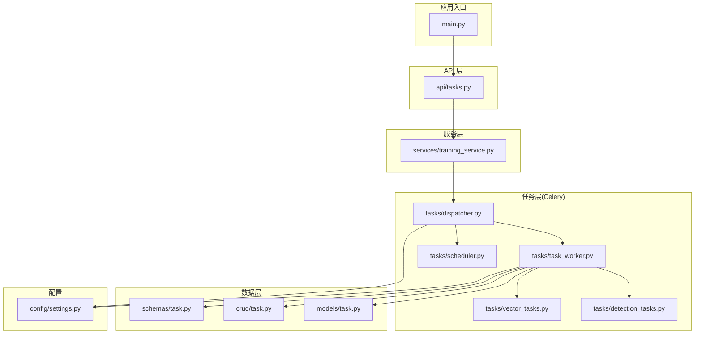
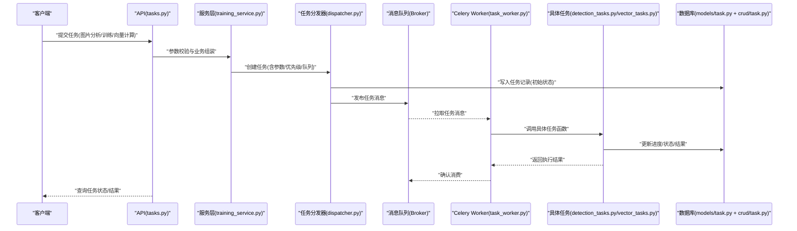
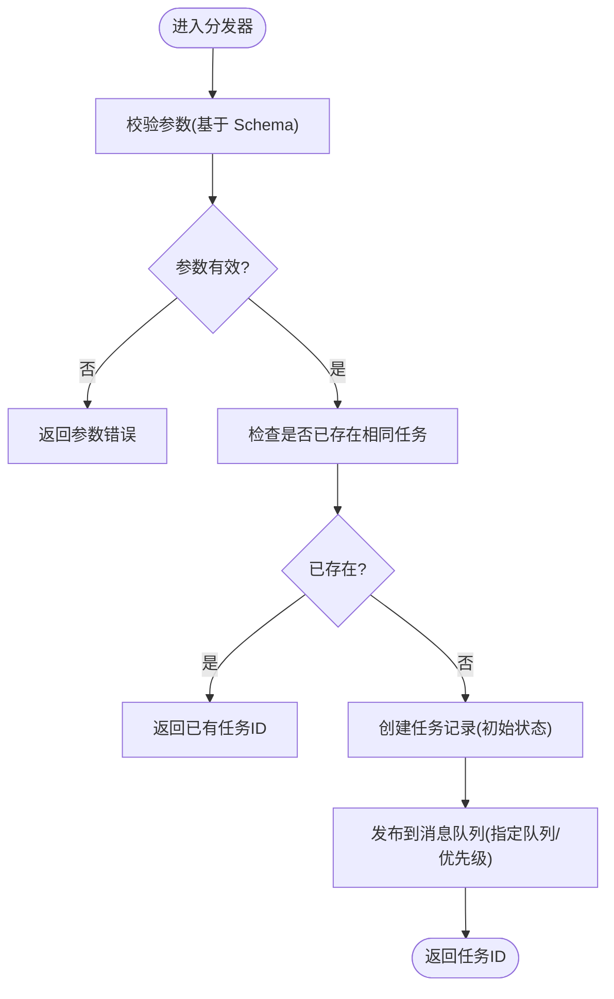
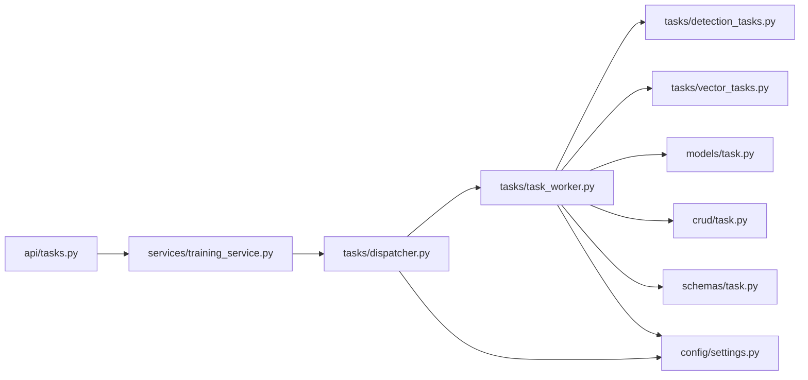

# 任务调度系统

<cite>
**本文引用的文件**   
- [backend/app/tasks/dispatcher.py](file://backend/app/tasks/dispatcher.py)
- [backend/app/tasks/task_worker.py](file://backend/app/tasks/task_worker.py)
- [backend/app/tasks/scheduler.py](file://backend/app/tasks/scheduler.py)
- [backend/app/tasks/detection_tasks.py](file://backend/app/tasks/detection_tasks.py)
- [backend/app/tasks/vector_tasks.py](file://backend/app/tasks/vector_tasks.py)
- [backend/app/api/tasks.py](file://backend/app/api/tasks.py)
- [backend/app/services/training_service.py](file://backend/app/services/training_service.py)
- [backend/app/models/task.py](file://backend/app/models/task.py)
- [backend/app/crud/task.py](file://backend/app/crud/task.py)
- [backend/app/schemas/task.py](file://backend/app/schemas/task.py)
- [backend/app/config/settings.py](file://backend/app/config/settings.py)
- [backend/main.py](file://backend/main.py)
</cite>

## 目录
1. [简介](#简介)
2. [项目结构](#项目结构)
3. [核心组件](#核心组件)
4. [架构总览](#架构总览)
5. [详细组件分析](#详细组件分析)
6. [依赖关系分析](#依赖关系分析)
7. [性能考虑](#性能考虑)
8. [故障排查指南](#故障排查指南)
9. [结论](#结论)
10. [附录](#附录)

## 简介
本指南面向开发者，基于 Celery 框架为 AI 相册后端构建异步任务调度系统。内容涵盖：
- 任务类型定义与注册
- 任务分发机制与路由策略
- 执行状态跟踪与结果持久化
- 错误重试与幂等性设计
- 典型任务实现模式（图片分析、模型训练、向量计算）
- 监控、性能调优与故障恢复
- 分布式处理、负载均衡与资源管理

目标是为团队提供一套可落地的异步任务处理完整方案与最佳实践。

## 项目结构
后端采用分层组织：API 层负责请求接入与参数校验；服务层封装业务逻辑；任务层通过 Celery 进行异步编排；数据层使用 ORM 模型与 CRUD 操作；配置中心统一环境变量与运行时参数。

图表来源
- [backend/main.py](file://backend/main.py)
- [backend/app/api/tasks.py](file://backend/app/api/tasks.py)
- [backend/app/services/training_service.py](file://backend/app/services/training_service.py)
- [backend/app/tasks/dispatcher.py](file://backend/app/tasks/dispatcher.py)
- [backend/app/tasks/task_worker.py](file://backend/app/tasks/task_worker.py)
- [backend/app/tasks/scheduler.py](file://backend/app/tasks/scheduler.py)
- [backend/app/tasks/detection_tasks.py](file://backend/app/tasks/detection_tasks.py)
- [backend/app/tasks/vector_tasks.py](file://backend/app/tasks/vector_tasks.py)
- [backend/app/models/task.py](file://backend/app/models/task.py)
- [backend/app/crud/task.py](file://backend/app/crud/task.py)
- [backend/app/schemas/task.py](file://backend/app/schemas/task.py)
- [backend/app/config/settings.py](file://backend/app/config/settings.py)

章节来源
- [backend/main.py](file://backend/main.py)
- [backend/app/api/tasks.py](file://backend/app/api/tasks.py)
- [backend/app/services/training_service.py](file://backend/app/services/training_service.py)
- [backend/app/tasks/dispatcher.py](file://backend/app/tasks/dispatcher.py)
- [backend/app/tasks/task_worker.py](file://backend/app/tasks/task_worker.py)
- [backend/app/tasks/scheduler.py](file://backend/app/tasks/scheduler.py)
- [backend/app/tasks/detection_tasks.py](file://backend/app/tasks/detection_tasks.py)
- [backend/app/tasks/vector_tasks.py](file://backend/app/tasks/vector_tasks.py)
- [backend/app/models/task.py](file://backend/app/models/task.py)
- [backend/app/crud/task.py](file://backend/app/crud/task.py)
- [backend/app/schemas/task.py](file://backend/app/schemas/task.py)
- [backend/app/config/settings.py](file://backend/app/config/settings.py)

## 核心组件
- 任务分发器：统一接收来自 API/服务的任务创建请求，完成参数校验、去重、优先级与队列路由，并写入任务记录。
- 任务工作者：Celery Worker 启动入口，加载任务模块、初始化连接池、设置并发与资源限制。
- 定时调度器：周期性扫描待处理任务或触发批处理流程（如批量向量化、过期清理）。
- 任务实现：
  - 图片分析任务：人脸检测、属性识别、描述生成等。
  - 模型训练任务：数据集准备、训练循环、指标与权重保存。
  - 向量计算任务：特征提取、索引更新、相似度检索预处理。
- 状态与结果：通过数据库持久化任务状态、进度与结果，供前端轮询或 WebSocket 推送。
- 配置与运行：集中管理 Broker、Backend、Worker 并发、限流、日志级别等。

章节来源
- [backend/app/tasks/dispatcher.py](file://backend/app/tasks/dispatcher.py)
- [backend/app/tasks/task_worker.py](file://backend/app/tasks/task_worker.py)
- [backend/app/tasks/scheduler.py](file://backend/app/tasks/scheduler.py)
- [backend/app/tasks/detection_tasks.py](file://backend/app/tasks/detection_tasks.py)
- [backend/app/tasks/vector_tasks.py](file://backend/app/tasks/vector_tasks.py)
- [backend/app/models/task.py](file://backend/app/models/task.py)
- [backend/app/crud/task.py](file://backend/app/crud/task.py)
- [backend/app/schemas/task.py](file://backend/app/schemas/task.py)
- [backend/app/config/settings.py](file://backend/app/config/settings.py)

## 架构总览
下图展示从 HTTP 请求到 Celery Worker 执行的端到端流程，包括任务创建、入队、执行、状态更新与结果回写。

图表来源
- [backend/app/api/tasks.py](file://backend/app/api/tasks.py)
- [backend/app/services/training_service.py](file://backend/app/services/training_service.py)
- [backend/app/tasks/dispatcher.py](file://backend/app/tasks/dispatcher.py)
- [backend/app/tasks/task_worker.py](file://backend/app/tasks/task_worker.py)
- [backend/app/tasks/detection_tasks.py](file://backend/app/tasks/detection_tasks.py)
- [backend/app/tasks/vector_tasks.py](file://backend/app/tasks/vector_tasks.py)
- [backend/app/models/task.py](file://backend/app/models/task.py)
- [backend/app/crud/task.py](file://backend/app/crud/task.py)

## 详细组件分析

### 任务分发器（dispatcher.py）
职责
- 统一入口：对外暴露“创建任务”接口，屏蔽底层队列细节。
- 参数校验：基于 Pydantic Schema 校验输入，确保任务参数安全与一致。
- 去重与幂等：根据业务键（如图片 ID+任务类型）避免重复入队。
- 路由与优先级：按任务类型选择队列与优先级，支持热点任务优先。
- 状态同步：在入队前写入任务记录，保证“有任务必有记录”。

关键流程

图表来源
- [backend/app/tasks/dispatcher.py](file://backend/app/tasks/dispatcher.py)
- [backend/app/schemas/task.py](file://backend/app/schemas/task.py)
- [backend/app/models/task.py](file://backend/app/models/task.py)
- [backend/app/crud/task.py](file://backend/app/crud/task.py)

章节来源
- [backend/app/tasks/dispatcher.py](file://backend/app/tasks/dispatcher.py)
- [backend/app/schemas/task.py](file://backend/app/schemas/task.py)
- [backend/app/models/task.py](file://backend/app/models/task.py)
- [backend/app/crud/task.py](file://backend/app/crud/task.py)

### 任务工作者（task_worker.py）
职责
- Worker 启动：加载 Celery 实例、读取配置、注册任务模块。
- 资源控制：设置并发数、预取数量、内存/CPU 软限制，防止 OOM。
- 健康检查：心跳上报、优雅关闭、信号处理。
- 日志与追踪：结构化日志、任务上下文注入、耗时统计。

建议配置项
- broker_url、result_backend
- worker_concurrency、worker_prefetch_multiplier
- task_acks_late、task_reject_on_worker_lost
- task_time_limit、task_soft_time_limit

章节来源
- [backend/app/tasks/task_worker.py](file://backend/app/tasks/task_worker.py)
- [backend/app/config/settings.py](file://backend/app/config/settings.py)

### 定时调度器（scheduler.py）
职责
- 周期任务：例如每日重建向量索引、清理失败任务、汇总统计。
- 批处理：将大量小任务合并为批次，降低队列压力。
- 补偿机制：对长时间未完成的任务进行告警与重试。

章节来源
- [backend/app/tasks/scheduler.py](file://backend/app/tasks/scheduler.py)

### 图片分析任务（detection_tasks.py）
常见任务
- 人脸检测与对齐
- 属性识别（年龄、性别、表情等）
- 图像描述生成（结合 LLM）

处理要点
- 分阶段推进：下载/解码 -> 预处理 -> 推理 -> 后处理 -> 存储结果
- 中间状态：每阶段更新进度百分比
- 失败重试：网络/IO 错误指数退避，模型推理错误直接标记失败

章节来源
- [backend/app/tasks/detection_tasks.py](file://backend/app/tasks/detection_tasks.py)

### 模型训练任务（training_service.py 集成）
职责
- 数据准备：清洗、划分、格式转换
- 训练循环：分批迭代、指标采集、断点续训
- 产物管理：权重、日志、评估报告归档

与任务系统的集成
- 训练任务由分发器创建，Worker 执行训练脚本或服务
- 定期上报进度与指标，异常时持久化 checkpoint
- 完成后触发下游任务（如向量入库）

章节来源
- [backend/app/services/training_service.py](file://backend/app/services/training_service.py)
- [backend/app/tasks/dispatcher.py](file://backend/app/tasks/dispatcher.py)

### 向量计算任务（vector_tasks.py）
职责
- 特征提取：调用嵌入模型生成向量
- 索引维护：增量/全量更新向量库
- 质量校验：维度一致性、归一化、去重

注意事项
- 大批量任务拆分并行，控制并发度与内存占用
- 失败任务具备幂等性，支持断点续算

章节来源
- [backend/app/tasks/vector_tasks.py](file://backend/app/tasks/vector_tasks.py)

### 任务状态与结果（models/task.py + crud/task.py + schemas/task.py）
- 模型字段：任务 ID、类型、状态、进度、结果摘要、错误信息、创建/更新时间等
- CRUD 操作：创建、更新、查询、分页、过滤
- Schema 校验：统一输入输出结构，便于 API 与服务层复用

章节来源
- [backend/app/models/task.py](file://backend/app/models/task.py)
- [backend/app/crud/task.py](file://backend/app/crud/task.py)
- [backend/app/schemas/task.py](file://backend/app/schemas/task.py)

## 依赖关系分析

图表来源
- [backend/app/api/tasks.py](file://backend/app/api/tasks.py)
- [backend/app/services/training_service.py](file://backend/app/services/training_service.py)
- [backend/app/tasks/dispatcher.py](file://backend/app/tasks/dispatcher.py)
- [backend/app/tasks/task_worker.py](file://backend/app/tasks/task_worker.py)
- [backend/app/tasks/detection_tasks.py](file://backend/app/tasks/detection_tasks.py)
- [backend/app/tasks/vector_tasks.py](file://backend/app/tasks/vector_tasks.py)
- [backend/app/models/task.py](file://backend/app/models/task.py)
- [backend/app/crud/task.py](file://backend/app/crud/task.py)
- [backend/app/schemas/task.py](file://backend/app/schemas/task.py)
- [backend/app/config/settings.py](file://backend/app/config/settings.py)

章节来源
- [backend/app/api/tasks.py](file://backend/app/api/tasks.py)
- [backend/app/services/training_service.py](file://backend/app/services/training_service.py)
- [backend/app/tasks/dispatcher.py](file://backend/app/tasks/dispatcher.py)
- [backend/app/tasks/task_worker.py](file://backend/app/tasks/task_worker.py)
- [backend/app/tasks/detection_tasks.py](file://backend/app/tasks/detection_tasks.py)
- [backend/app/tasks/vector_tasks.py](file://backend/app/tasks/vector_tasks.py)
- [backend/app/models/task.py](file://backend/app/models/task.py)
- [backend/app/crud/task.py](file://backend/app/crud/task.py)
- [backend/app/schemas/task.py](file://backend/app/schemas/task.py)
- [backend/app/config/settings.py](file://backend/app/config/settings.py)

## 性能考虑
- 队列与路由
  - 按任务类型分流到不同队列，避免长尾任务阻塞短任务
  - 高优先级队列用于实时性要求高的任务
- Worker 并发与资源
  - 合理设置并发数与预取倍数，避免过多上下文切换
  - 针对 CPU/GPU 密集型任务隔离 Worker 进程，限制内存上限
- 任务粒度与批处理
  - 将大任务拆分为子任务，提升并行度与容错能力
  - 对 I/O 密集任务采用批处理聚合，减少往返次数
- 幂等与去重
  - 基于业务键去重，避免重复计算
  - 任务内部实现幂等，支持中断续跑
- 结果与状态
  - 仅持久化必要字段，避免大对象写入数据库
  - 使用对象存储保存大结果，数据库仅存引用

[本节为通用指导，不直接分析具体文件]

## 故障排查指南
常见问题与定位步骤
- 任务未执行
  - 检查 Broker 连通性与权限
  - 确认 Worker 已启动且订阅了对应队列
  - 查看任务记录是否存在与状态
- 任务频繁失败
  - 检查重试策略与退避间隔
  - 查看错误堆栈与日志上下文
  - 验证外部依赖（模型、存储、第三方 API）可用性
- 任务堆积
  - 扩容 Worker 或增加队列
  - 调整预取与并发，避免饥饿
  - 优化任务粒度与批大小
- 状态不一致
  - 核对任务生命周期回调是否正确更新状态
  - 检查幂等键与去重逻辑
  - 确认 Worker 崩溃后的任务重新投递策略

章节来源
- [backend/app/tasks/dispatcher.py](file://backend/app/tasks/dispatcher.py)
- [backend/app/tasks/task_worker.py](file://backend/app/tasks/task_worker.py)
- [backend/app/tasks/scheduler.py](file://backend/app/tasks/scheduler.py)
- [backend/app/models/task.py](file://backend/app/models/task.py)
- [backend/app/crud/task.py](file://backend/app/crud/task.py)

## 结论
本指南围绕 Celery 构建了可扩展、可观测、可运维的异步任务调度体系。通过统一的分发器、清晰的 Worker 边界、完善的任务状态与结果管理，以及针对图片分析、模型训练、向量计算的实现模式，团队可以快速落地复杂 AI 工作流。配合合理的性能调优与故障恢复策略，可在生产环境稳定支撑大规模异步任务处理。

[本节为总结性内容，不直接分析具体文件]

## 附录
- 最佳实践清单
  - 所有任务必须幂等，并提供业务键去重
  - 任务参数严格校验，拒绝非法输入
  - 长任务分阶段上报进度，便于前端反馈
  - 失败任务自动重试，超过阈值转人工介入
  - 关键路径添加结构化日志与指标埋点
  - 使用独立队列隔离不同类型任务
  - 定期巡检与告警，覆盖队列积压、Worker 离线、任务超时
- 监控与可观测性
  - 任务成功率、平均耗时、P95/P99 延迟
  - 队列长度、消费者数量、重试次数
  - 资源使用率（CPU/内存/GPU）与瓶颈定位
- 分布式与负载均衡
  - 多节点 Worker 水平扩展
  - 按队列与标签路由，实现资源隔离
  - 动态扩缩容与弹性伸缩

[本节为补充说明，不直接分析具体文件]