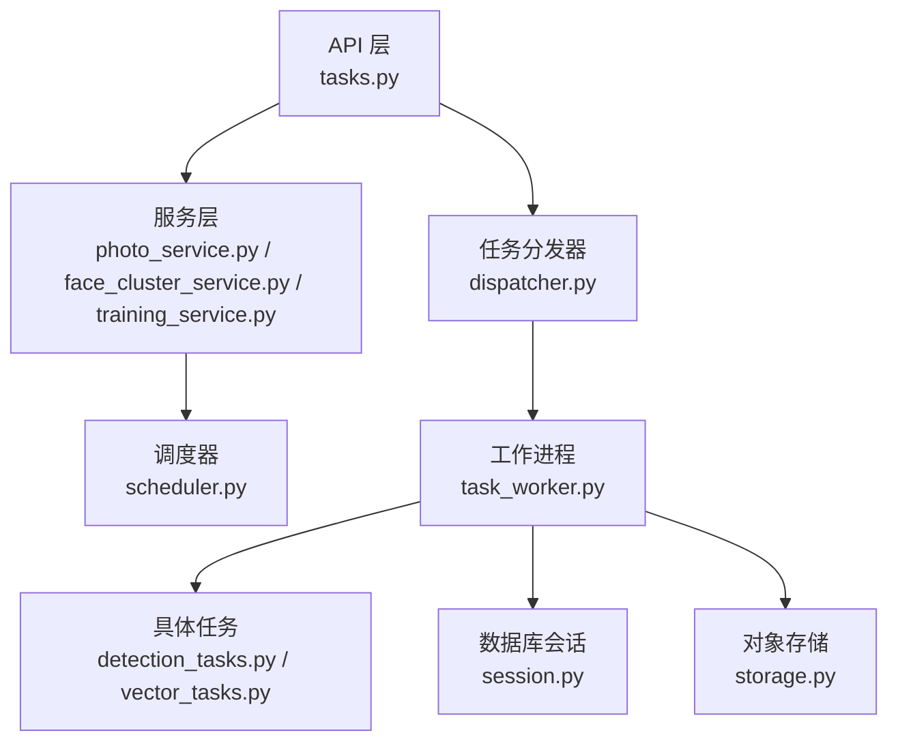
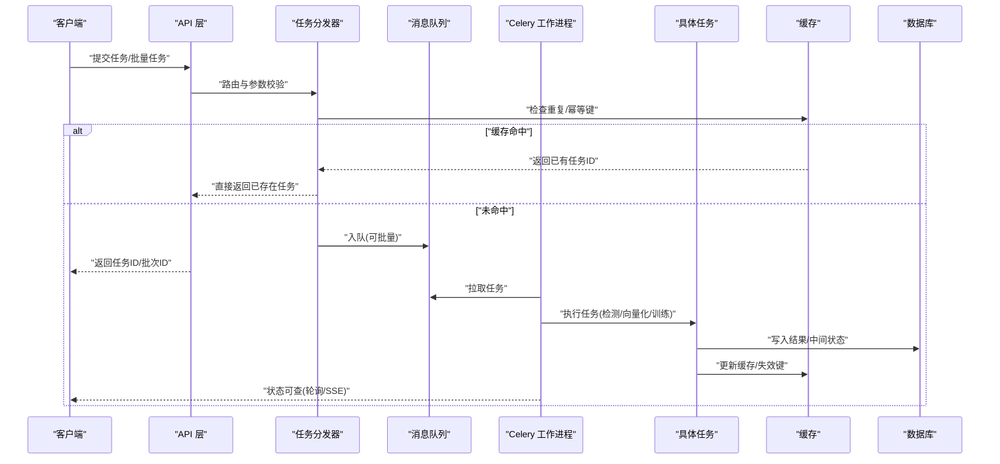
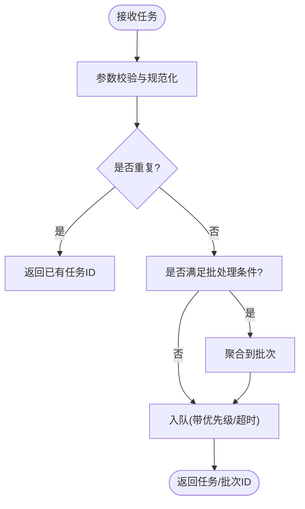
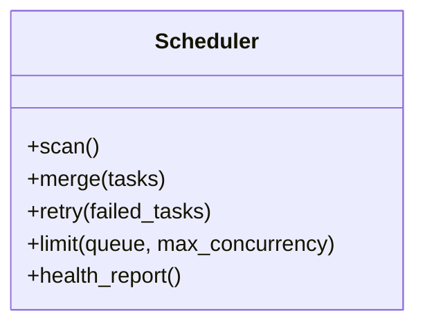
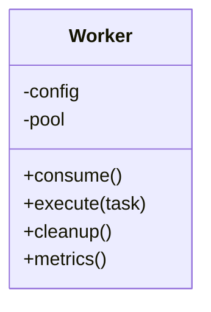
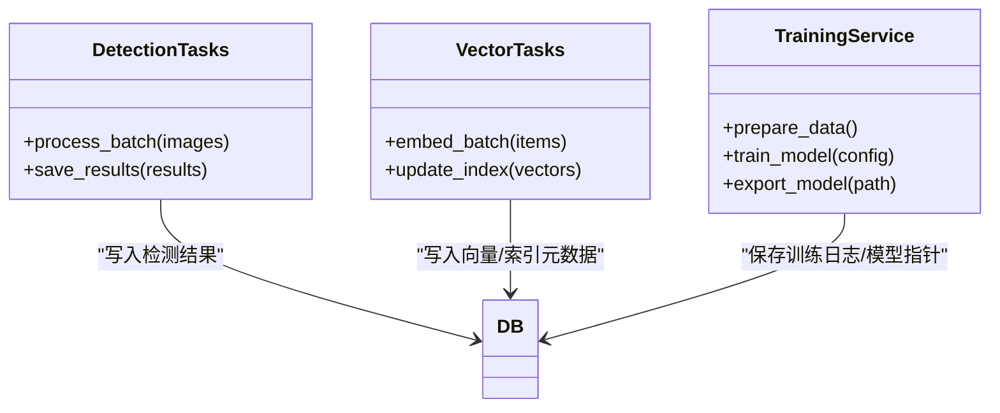
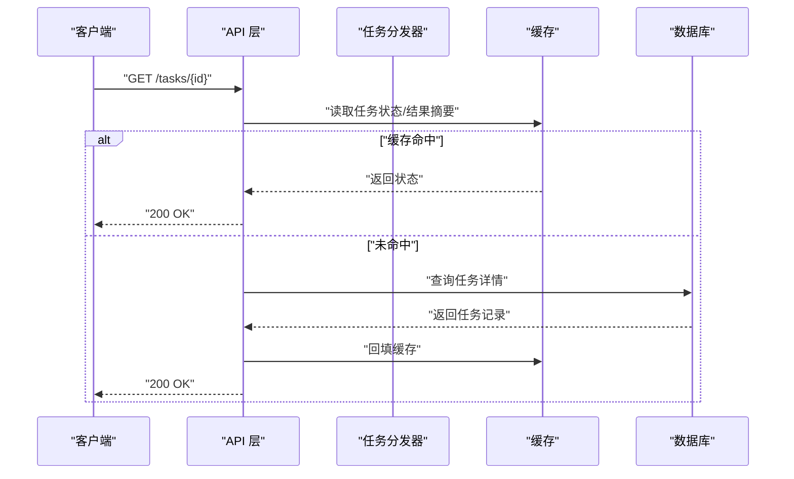
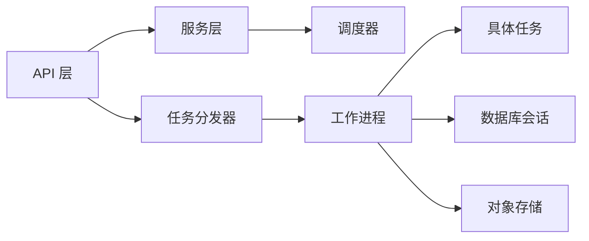
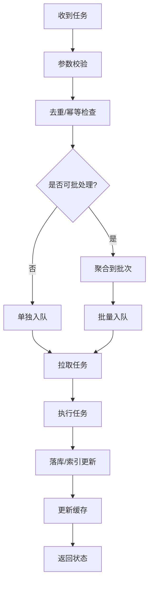

# 性能优化与调优

<cite>
**本文引用的文件**   
- [backend/app/tasks/dispatcher.py](file://backend/app/tasks/dispatcher.py)
- [backend/app/tasks/scheduler.py](file://backend/app/tasks/scheduler.py)
- [backend/app/tasks/task_worker.py](file://backend/app/tasks/task_worker.py)
- [backend/app/tasks/detection_tasks.py](file://backend/app/tasks/detection_tasks.py)
- [backend/app/tasks/vector_tasks.py](file://backend/app/tasks/vector_tasks.py)
- [backend/app/api/tasks.py](file://backend/app/api/tasks.py)
- [backend/app/config/settings.py](file://backend/app/config/settings.py)
- [backend/app/database/session.py](file://backend/app/database/session.py)
- [backend/app/services/photo_service.py](file://backend/app/services/photo_service.py)
- [backend/app/services/face_cluster_service.py](file://backend/app/services/face_cluster_service.py)
- [backend/app/services/training_service.py](file://backend/app/services/training_service.py)
- [backend/main.py](file://backend/main.py)
- [docker-compose.yml](file://docker-compose.yml)
</cite>

## 目录
1. [简介](#简介)
2. [项目结构](#项目结构)
3. [核心组件](#核心组件)
4. [架构总览](#架构总览)
5. [详细组件分析](#详细组件分析)
6. [依赖关系分析](#依赖关系分析)
7. [性能考量](#性能考量)
8. [故障排查指南](#故障排查指南)
9. [结论](#结论)
10. [附录](#附录)

## 简介
本指南面向任务调度系统的性能优化，聚焦于Celery配置、并发控制与工作进程调优策略；涵盖内存管理、CPU使用优化、数据库连接池配置；介绍任务批处理、缓存策略与异步I/O优化技术；提供性能监控指标、瓶颈分析与调优建议；并说明高负载场景下的水平扩展与负载均衡配置，以及常见性能问题的诊断与解决方案。

## 项目结构
后端采用分层架构：API层暴露接口，服务层封装业务逻辑，任务层负责异步执行（检测、向量化、训练等），数据访问层通过会话与存储抽象操作数据库与对象存储。任务调度由调度器与分发器协同完成，工作进程消费队列中的任务。

图表来源
- [backend/app/api/tasks.py](file://backend/app/api/tasks.py)
- [backend/app/tasks/dispatcher.py](file://backend/app/tasks/dispatcher.py)
- [backend/app/tasks/scheduler.py](file://backend/app/tasks/scheduler.py)
- [backend/app/tasks/task_worker.py](file://backend/app/tasks/task_worker.py)
- [backend/app/tasks/detection_tasks.py](file://backend/app/tasks/detection_tasks.py)
- [backend/app/tasks/vector_tasks.py](file://backend/app/tasks/vector_tasks.py)
- [backend/app/database/session.py](file://backend/app/database/session.py)
- [backend/app/database/storage.py](file://backend/app/database/storage.py)

章节来源
- [backend/main.py](file://backend/main.py)
- [backend/app/api/tasks.py](file://backend/app/api/tasks.py)
- [backend/app/tasks/dispatcher.py](file://backend/app/tasks/dispatcher.py)
- [backend/app/tasks/scheduler.py](file://backend/app/tasks/scheduler.py)
- [backend/app/tasks/task_worker.py](file://backend/app/tasks/task_worker.py)
- [backend/app/tasks/detection_tasks.py](file://backend/app/tasks/detection_tasks.py)
- [backend/app/tasks/vector_tasks.py](file://backend/app/tasks/vector_tasks.py)
- [backend/app/database/session.py](file://backend/app/database/session.py)
- [backend/app/database/storage.py](file://backend/app/database/storage.py)

## 核心组件
- 任务分发器：负责将服务层产生的任务按类型路由到对应队列或处理器，支持批量提交与优先级控制。
- 调度器：周期性扫描待执行任务，进行去重、合并、限流与重试编排。
- 工作进程：基于Celery的工作者，负责拉取任务、加载资源、执行计算、持久化结果与清理上下文。
- 具体任务：图像检测、人脸聚类、向量检索、模型训练等耗时任务的具体实现。
- API接口：对外暴露任务创建、查询、取消与状态同步的REST接口。
- 数据库与会话：提供连接池、事务边界与资源释放策略。

章节来源
- [backend/app/tasks/dispatcher.py](file://backend/app/tasks/dispatcher.py)
- [backend/app/tasks/scheduler.py](file://backend/app/tasks/scheduler.py)
- [backend/app/tasks/task_worker.py](file://backend/app/tasks/task_worker.py)
- [backend/app/tasks/detection_tasks.py](file://backend/app/tasks/detection_tasks.py)
- [backend/app/tasks/vector_tasks.py](file://backend/app/tasks/vector_tasks.py)
- [backend/app/api/tasks.py](file://backend/app/api/tasks.py)
- [backend/app/database/session.py](file://backend/app/database/session.py)

## 架构总览
下图展示了从HTTP请求到任务执行与落库的整体流程，包括批处理、缓存命中与失败重试路径。

图表来源
- [backend/app/api/tasks.py](file://backend/app/api/tasks.py)
- [backend/app/tasks/dispatcher.py](file://backend/app/tasks/dispatcher.py)
- [backend/app/tasks/task_worker.py](file://backend/app/tasks/task_worker.py)
- [backend/app/tasks/detection_tasks.py](file://backend/app/tasks/detection_tasks.py)
- [backend/app/tasks/vector_tasks.py](file://backend/app/tasks/vector_tasks.py)
- [backend/app/database/session.py](file://backend/app/database/session.py)

## 详细组件分析

### 任务分发器（Dispatcher）
职责与优化点
- 任务路由：根据任务类型选择目标队列，避免热点队列拥塞。
- 幂等与去重：基于业务键在缓存中记录任务指纹，防止重复入队。
- 批处理聚合：对短时间内的同类任务进行合并，降低队列压力与数据库写放大。
- 优先级与限流：为关键任务设置更高优先级，并对慢任务实施速率限制。

图表来源
- [backend/app/tasks/dispatcher.py](file://backend/app/tasks/dispatcher.py)

章节来源
- [backend/app/tasks/dispatcher.py](file://backend/app/tasks/dispatcher.py)

### 调度器（Scheduler）
职责与优化点
- 周期扫描：定时检查待执行任务，触发延迟任务与重试。
- 任务合并：对相同输入的任务进行合并，减少重复计算。
- 资源配额：按队列或任务类型分配最大并发数，防止资源争用。
- 健康检查：监控任务执行时长分布与失败率，动态调整策略。

图表来源
- [backend/app/tasks/scheduler.py](file://backend/app/tasks/scheduler.py)

章节来源
- [backend/app/tasks/scheduler.py](file://backend/app/tasks/scheduler.py)

### 工作进程（Worker）
职责与优化点
- 进程/线程模型：结合CPU密集型与I/O密集型任务，合理设置worker数量与线程数。
- 资源初始化：按需加载模型与连接，避免冷启动抖动。
- 优雅退出：确保长任务可中断、资源可回收，避免僵尸进程。
- 监控上报：采集任务耗时、内存峰值、GC次数等指标。

图表来源
- [backend/app/tasks/task_worker.py](file://backend/app/tasks/task_worker.py)

章节来源
- [backend/app/tasks/task_worker.py](file://backend/app/tasks/task_worker.py)

### 具体任务（检测/向量化/训练）
职责与优化点
- 检测任务：图像预处理、批量推理、结果压缩与分片落库。
- 向量化任务：嵌入生成、索引构建、增量更新与缓存失效。
- 训练任务：数据准备、分布式训练、断点续训与模型归档。

图表来源
- [backend/app/tasks/detection_tasks.py](file://backend/app/tasks/detection_tasks.py)
- [backend/app/tasks/vector_tasks.py](file://backend/app/tasks/vector_tasks.py)
- [backend/app/services/training_service.py](file://backend/app/services/training_service.py)
- [backend/app/database/session.py](file://backend/app/database/session.py)

章节来源
- [backend/app/tasks/detection_tasks.py](file://backend/app/tasks/detection_tasks.py)
- [backend/app/tasks/vector_tasks.py](file://backend/app/tasks/vector_tasks.py)
- [backend/app/services/training_service.py](file://backend/app/services/training_service.py)
- [backend/app/database/session.py](file://backend/app/database/session.py)

### API接口（任务管理）
职责与优化点
- 任务创建：支持单条与批量提交，返回任务/批次ID。
- 状态查询：提供任务进度、结果摘要与错误信息。
- 取消与重试：允许取消可中断任务，并提供手动重试入口。

图表来源
- [backend/app/api/tasks.py](file://backend/app/api/tasks.py)
- [backend/app/tasks/dispatcher.py](file://backend/app/tasks/dispatcher.py)
- [backend/app/database/session.py](file://backend/app/database/session.py)

章节来源
- [backend/app/api/tasks.py](file://backend/app/api/tasks.py)

## 依赖关系分析
- API层依赖任务分发器与服务层；服务层可能调用调度器与工作进程。
- 工作进程依赖具体任务实现与数据库会话；必要时访问对象存储。
- 调度器依赖缓存与数据库以维护任务状态与去重键。

图表来源
- [backend/app/api/tasks.py](file://backend/app/api/tasks.py)
- [backend/app/tasks/dispatcher.py](file://backend/app/tasks/dispatcher.py)
- [backend/app/tasks/scheduler.py](file://backend/app/tasks/scheduler.py)
- [backend/app/tasks/task_worker.py](file://backend/app/tasks/task_worker.py)
- [backend/app/tasks/detection_tasks.py](file://backend/app/tasks/detection_tasks.py)
- [backend/app/tasks/vector_tasks.py](file://backend/app/tasks/vector_tasks.py)
- [backend/app/database/session.py](file://backend/app/database/session.py)
- [backend/app/database/storage.py](file://backend/app/database/storage.py)

章节来源
- [backend/app/api/tasks.py](file://backend/app/api/tasks.py)
- [backend/app/tasks/dispatcher.py](file://backend/app/tasks/dispatcher.py)
- [backend/app/tasks/scheduler.py](file://backend/app/tasks/scheduler.py)
- [backend/app/tasks/task_worker.py](file://backend/app/tasks/task_worker.py)
- [backend/app/tasks/detection_tasks.py](file://backend/app/tasks/detection_tasks.py)
- [backend/app/tasks/vector_tasks.py](file://backend/app/tasks/vector_tasks.py)
- [backend/app/database/session.py](file://backend/app/database/session.py)
- [backend/app/database/storage.py](file://backend/app/database/storage.py)

## 性能考量

### Celery配置优化
- 并发模型
  - CPU密集型任务：优先多进程，每个进程绑定固定CPU核，避免GIL竞争。
  - I/O密集型任务：可使用多线程或事件驱动工作者，提高吞吐。
- 预取与批拉取
  - 适度增大预取数量以提升吞吐，但需结合内存上限与任务粒度控制。
  - 对短任务启用批量拉取，减少网络往返。
- 重试与退避
  - 指数退避+抖动，避免雪崩；设置最大重试次数与死信队列。
- 序列化与压缩
  - 选择高效序列化格式；对大消息启用压缩以降低带宽占用。
- 队列隔离
  - 将不同优先级与类型的任务拆分到独立队列，避免相互影响。

章节来源
- [backend/app/tasks/dispatcher.py](file://backend/app/tasks/dispatcher.py)
- [backend/app/tasks/task_worker.py](file://backend/app/tasks/task_worker.py)
- [backend/app/config/settings.py](file://backend/app/config/settings.py)

### 并发控制与工作进程调优
- 进程/线程配比
  - 经验公式：CPU密集型=CPU核数×1~2；I/O密集型=CPU核数×(1+等待/计算)。
- 软/硬时间限制
  - 为长任务设置软限制用于优雅中断，硬限制作为兜底保护。
- 内存上限与自动重启
  - 设置每进程最大内存阈值，超限自动重启，避免OOM。
- 预热与懒加载
  - 启动时预热常用模型与连接，任务内按需加载大对象。

章节来源
- [backend/app/tasks/task_worker.py](file://backend/app/tasks/task_worker.py)
- [backend/app/config/settings.py](file://backend/app/config/settings.py)

### 内存管理与CPU使用优化
- 内存管理
  - 及时释放临时对象与大数组引用；使用生成器与流式处理。
  - 对图片/视频帧进行分块处理，避免一次性载入全量数据。
- CPU优化
  - 使用向量化计算与并行库；避免Python循环热点路径。
  - 合理设置线程池大小，避免上下文切换开销过大。
- GC调优
  - 观察GC频率与停顿时间，必要时调整阈值或改用更合适的容器。

章节来源
- [backend/app/tasks/detection_tasks.py](file://backend/app/tasks/detection_tasks.py)
- [backend/app/tasks/vector_tasks.py](file://backend/app/tasks/vector_tasks.py)

### 数据库连接池配置
- 连接池大小
  - 根据并发度与数据库容量设定最小/最大连接数，避免连接耗尽。
- 事务边界
  - 缩短事务范围，批量写入时使用分批提交。
- 读写分离与只读副本
  - 将查询路由至只读副本，减轻主库压力。
- 慢查询治理
  - 定期分析慢查询，补充索引与改写SQL。

章节来源
- [backend/app/database/session.py](file://backend/app/database/session.py)

### 任务批处理
- 聚合窗口
  - 基于时间窗口或数量阈值聚合任务，降低入库与索引更新频率。
- 幂等键
  - 为批次生成稳定标识，保证重试与重复提交的幂等性。
- 顺序与一致性
  - 对需要顺序处理的子任务使用串行化队列或分段锁。

章节来源
- [backend/app/tasks/dispatcher.py](file://backend/app/tasks/dispatcher.py)
- [backend/app/tasks/scheduler.py](file://backend/app/tasks/scheduler.py)

### 缓存策略
- 多级缓存
  - 本地缓存用于热键，分布式缓存用于跨进程共享。
- 失效策略
  - 基于TTL与事件驱动的失效，避免脏读。
- 缓存穿透防护
  - 布隆过滤器或空值缓存，防止恶意查询击穿。

章节来源
- [backend/app/tasks/dispatcher.py](file://backend/app/tasks/dispatcher.py)
- [backend/app/api/tasks.py](file://backend/app/api/tasks.py)

### 异步I/O优化
- 非阻塞IO
  - 使用异步客户端访问外部服务（如对象存储、向量库）。
- 连接复用
  - HTTP/TCP连接池复用，减少握手开销。
- 背压与限速
  - 对上游生产者限速，避免下游过载。

章节来源
- [backend/app/tasks/task_worker.py](file://backend/app/tasks/task_worker.py)
- [backend/app/database/storage.py](file://backend/app/database/storage.py)

### 性能监控指标
- 系统级
  - CPU使用率、内存占用、磁盘I/O、网络带宽。
- 应用级
  - 任务吞吐、平均/分位耗时、失败率、重试次数、队列长度。
- 资源级
  - 数据库连接数、慢查询数、缓存命中率、对象存储请求延迟。

章节来源
- [backend/app/tasks/task_worker.py](file://backend/app/tasks/task_worker.py)
- [backend/app/database/session.py](file://backend/app/database/session.py)

### 瓶颈分析与调优建议
- 识别热点
  - 通过APM与火焰图定位CPU热点；通过慢查询日志定位DB瓶颈。
- 横向扩展
  - 增加工作进程与只读副本；拆分热点队列。
- 局部优化
  - 调整批大小、预取数、连接池大小与缓存TTL。

章节来源
- [backend/app/tasks/scheduler.py](file://backend/app/tasks/scheduler.py)
- [backend/app/database/session.py](file://backend/app/database/session.py)

### 高负载场景的水平扩展与负载均衡
- 多实例部署
  - 使用容器编排部署多个工作节点，按队列或标签路由。
- 弹性伸缩
  - 基于队列长度与CPU利用率自动扩缩容。
- 负载均衡
  - 在API前放置反向代理，按权重与地域分发请求。

章节来源
- [docker-compose.yml](file://docker-compose.yml)
- [backend/main.py](file://backend/main.py)

### 常见性能问题诊断与解决方案
- 任务堆积
  - 现象：队列长度持续增长，P99延迟升高。
  - 排查：检查消费者数量、任务耗时与失败重试风暴。
  - 解决：扩容消费者、拆分队列、优化任务粒度与重试策略。
- 内存泄漏
  - 现象：进程内存缓慢增长直至OOM。
  - 排查：定位大对象引用与未关闭的资源句柄。
  - 解决：显式释放、使用上下文管理器、设置内存上限自动重启。
- 数据库连接耗尽
  - 现象：连接池打满，出现连接超时。
  - 排查：查看活跃连接与长事务。
  - 解决：缩小事务范围、增加连接池上限、引入只读副本。
- 缓存穿透/雪崩
  - 现象：大量请求直达数据库，导致抖动。
  - 排查：分析热点键与TTL集中过期。
  - 解决：布隆过滤器、随机化TTL、加互斥锁重建缓存。

章节来源
- [backend/app/tasks/dispatcher.py](file://backend/app/tasks/dispatcher.py)
- [backend/app/tasks/task_worker.py](file://backend/app/tasks/task_worker.py)
- [backend/app/database/session.py](file://backend/app/database/session.py)

## 结论
通过对Celery配置、并发模型、批处理与缓存策略的系统性优化，并结合完善的监控与弹性扩缩容能力，可在高负载下显著提升任务调度系统的吞吐与稳定性。建议在生产环境持续观测关键指标，结合瓶颈分析进行渐进式调优。

## 附录

### 关键配置文件与环境变量
- 工作进程与队列
  - worker并发、预取数、时间限制、内存上限、队列名称与优先级。
- 数据库与会话
  - 连接池最小/最大连接数、超时、只读副本地址。
- 缓存与对象存储
  - 缓存TTL、集群地址、对象存储端点与密钥。

章节来源
- [backend/app/config/settings.py](file://backend/app/config/settings.py)
- [backend/app/database/session.py](file://backend/app/database/session.py)
- [backend/app/database/storage.py](file://backend/app/database/storage.py)

### 典型任务流程图（概念）

[本图为概念流程示意，不直接映射具体源码文件]