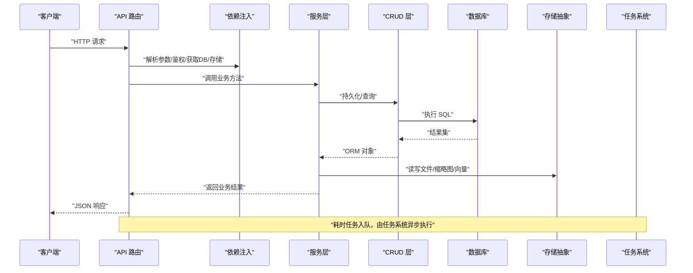
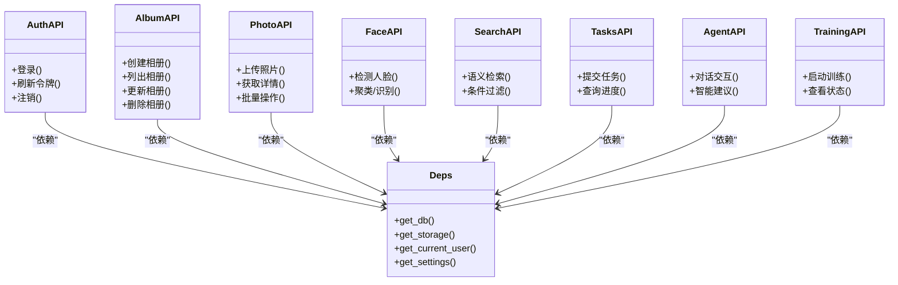
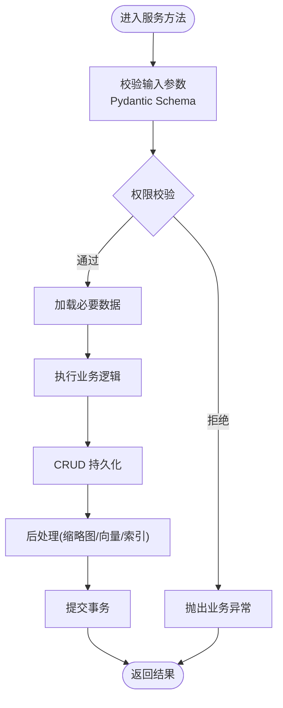
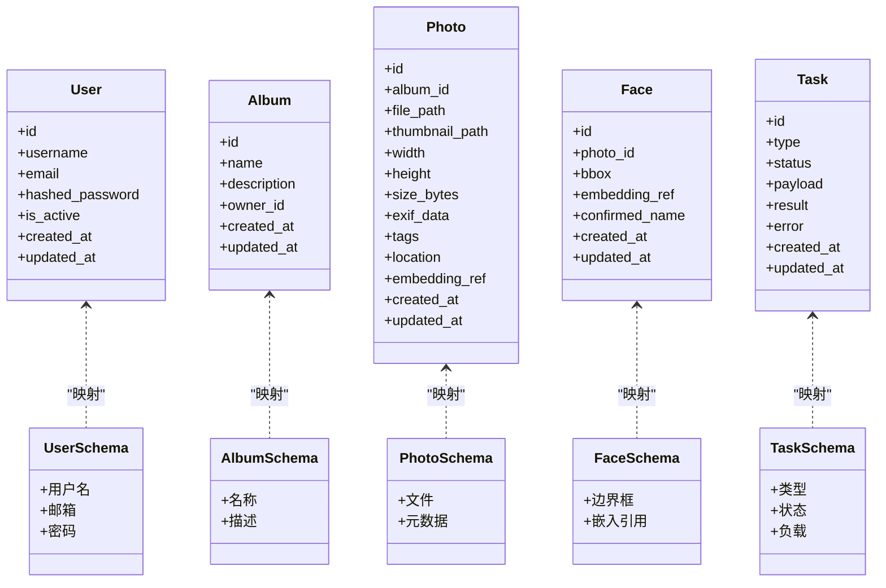
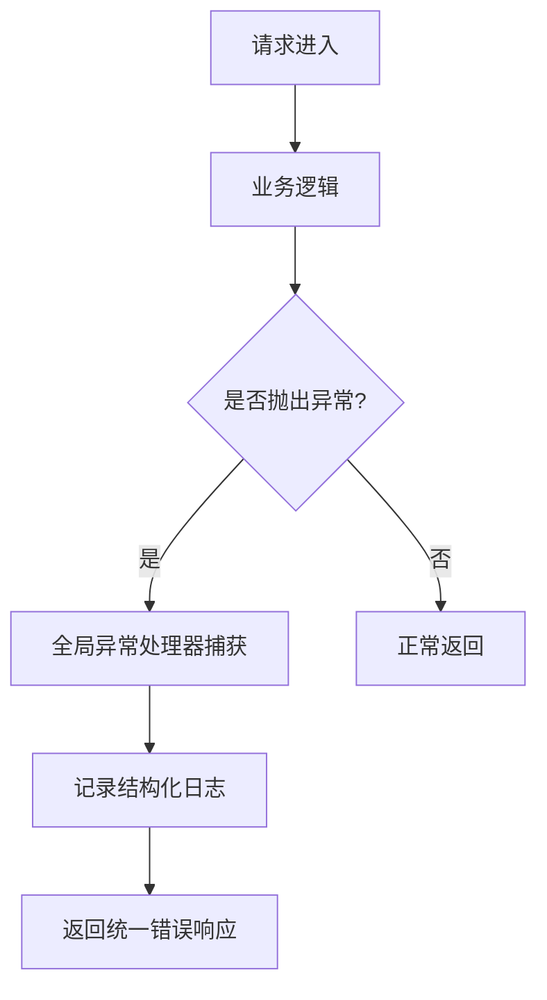
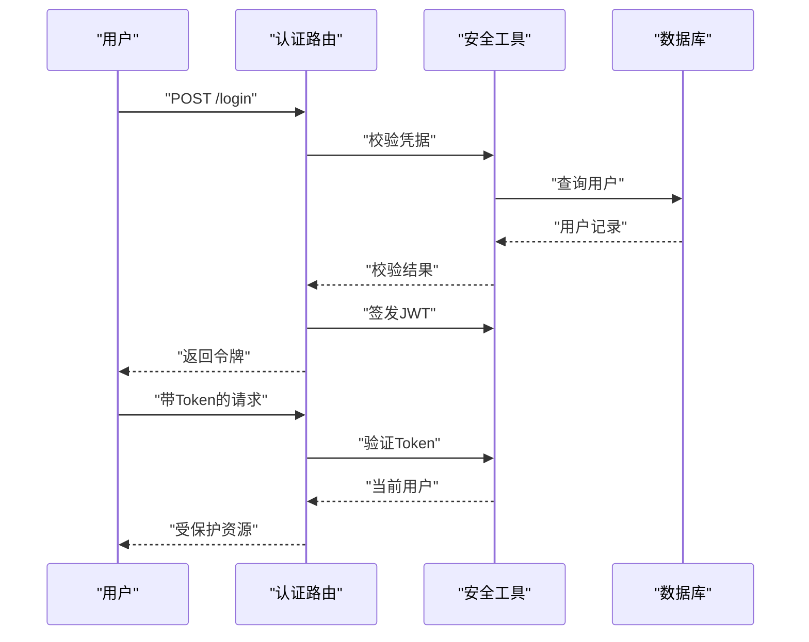
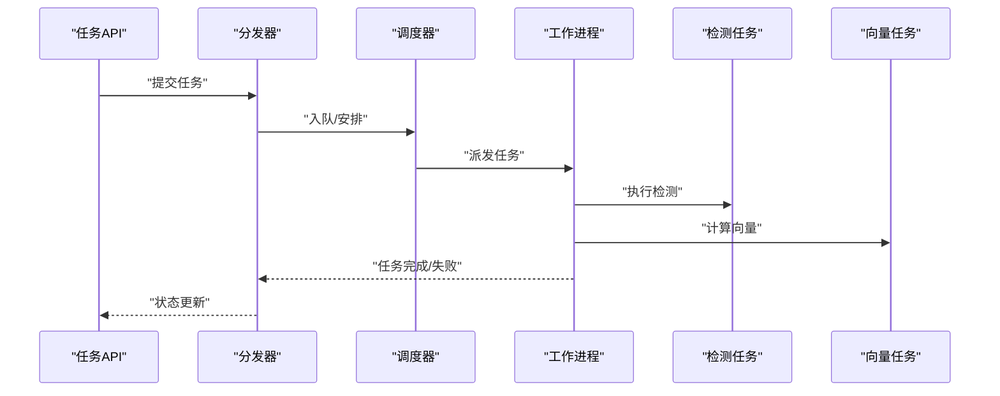
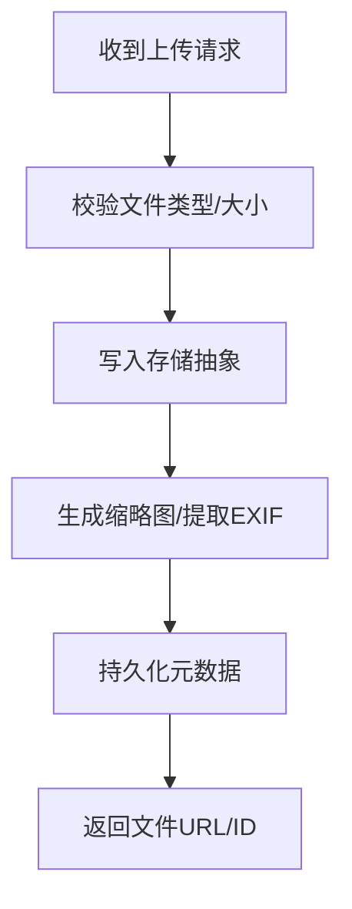
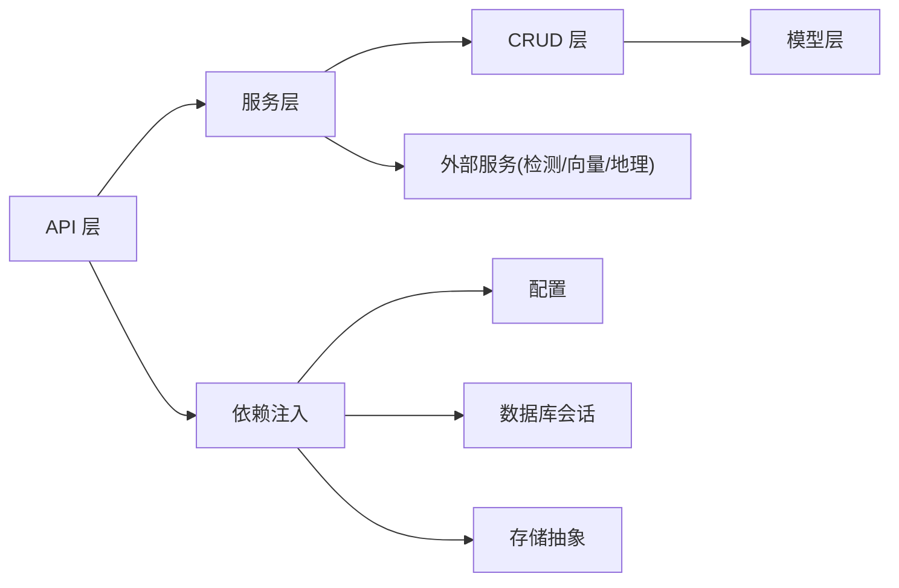

# 后端开发指南

<cite>
**本文引用的文件**   
- [main.py](file://backend/main.py)
- [settings.py](file://backend/app/config/settings.py)
- [session.py](file://backend/app/database/session.py)
- [storage.py](file://backend/app/database/storage.py)
- [exceptions.py](file://backend/app/core/exceptions.py)
- [logger.py](file://backend/app/core/logger.py)
- [security.py](file://backend/app/core/security.py)
- [deps.py](file://backend/app/api/deps.py)
- [auth.py](file://backend/app/api/auth.py)
- [album.py](file://backend/app/api/album.py)
- [photo.py](file://backend/app/api/photo.py)
- [face.py](file://backend/app/api/face.py)
- [search.py](file://backend/app/api/search.py)
- [tasks.py](file://backend/app/api/tasks.py)
- [agent.py](file://backend/app/api/agent.py)
- [training.py](file://backend/app/api/training.py)
- [user.py](file://backend/app/crud/user.py)
- [album.py](file://backend/app/crud/album.py)
- [photo.py](file://backend/app/crud/photo.py)
- [task.py](file://backend/app/crud/task.py)
- [user.py](file://backend/app/models/user.py)
- [album.py](file://backend/app/models/album.py)
- [photo.py](file://backend/app/models/photo.py)
- [face.py](file://backend/app/models/face.py)
- [task.py](file://backend/app/models/task.py)
- [response.py](file://backend/app/schemas/response.py)
- [user.py](file://backend/app/schemas/user.py)
- [album.py](file://backend/app/schemas/album.py)
- [photo.py](file://backend/app/schemas/photo.py)
- [face.py](file://backend/app/schemas/face.py)
- [task.py](file://backend/app/schemas/task.py)
- [album_service.py](file://backend/app/services/album_service.py)
- [photo_service.py](file://backend/app/services/photo_service.py)
- [face_detect_service.py](file://backend/app/services/face_detect_service.py)
- [detection_service.py](file://backend/app/services/detection_service.py)
- [exif_service.py](file://backend/app/services/exif_service.py)
- [thumbnail.py](file://backend/app/services/thumbnail.py)
- [geocode_service.py](file://backend/app/services/geocode_service.py)
- [tag_service.py](file://backend/app/services/tag_service.py)
- [name_confirmation_service.py](file://backend/app/services/name_confirmation_service.py)
- [search_service.py](file://backend/app/services/search_service.py)
- [photo_vector_service.py](file://backend/app/services/photo_vector_service.py)
- [trainer.py](file://backend/app/services/trainer.py)
- [training_service.py](file://backend/app/services/training_service.py)
- [dispatcher.py](file://backend/app/tasks/dispatcher.py)
- [scheduler.py](file://backend/app/tasks/scheduler.py)
- [task_worker.py](file://backend/app/tasks/task_worker.py)
- [detection_tasks.py](file://backend/app/tasks/detection_tasks.py)
- [vector_tasks.py](file://backend/app/tasks/vector_tasks.py)
</cite>

## 目录
1. [简介](#简介)
2. [项目结构](#项目结构)
3. [核心组件](#核心组件)
4. [架构总览](#架构总览)
5. [详细组件分析](#详细组件分析)
6. [依赖关系分析](#依赖关系分析)
7. [性能考虑](#性能考虑)
8. [故障排查指南](#故障排查指南)
9. [结论](#结论)
10. [附录](#附录)

## 简介
本指南面向新加入的后端开发者，系统介绍基于 FastAPI 的后端架构与开发规范。内容涵盖：
- 项目结构与模块划分
- API 接口设计原则与服务层业务逻辑实现
- 数据模型设计与 Pydantic 数据验证
- 错误处理策略、日志记录规范与性能优化技巧
- 常见开发模式示例（RESTful API、异步任务、文件上传下载）

目标是帮助读者快速上手并遵循统一的最佳实践进行高效开发。

## 项目结构
后端采用分层架构，按职责清晰划分模块：
- API 层：路由定义、请求参数校验、响应封装、权限控制
- 服务层：业务编排与领域逻辑
- CRUD 层：数据库操作封装
- 模型层：SQLAlchemy ORM 模型
- Schema 层：Pydantic 请求/响应模型
- 配置与基础设施：应用配置、数据库会话、存储抽象、安全工具、异常与日志
- 任务系统：调度器、分发器、工作进程与具体任务

```mermaid
graph TB
subgraph "入口"
main["main.py"]
end
subgraph "API 层"
api_auth["api/auth.py"]
api_album["api/album.py"]
api_photo["api/photo.py"]
api_face["api/face.py"]
api_search["api/search.py"]
api_tasks["api/tasks.py"]
api_agent["api/agent.py"]
api_training["api/training.py"]
api_deps["api/deps.py"]
end
subgraph "服务层"
svc_album["services/album_service.py"]
svc_photo["services/photo_service.py"]
svc_face["services/face_detect_service.py"]
svc_detect["services/detection_service.py"]
svc_exif["services/exif_service.py"]
svc_thumb["services/thumbnail.py"]
svc_geo["services/geocode_service.py"]
svc_tag["services/tag_service.py"]
svc_name["services/name_confirmation_service.py"]
svc_search["services/search_service.py"]
svc_vec["services/photo_vector_service.py"]
svc_trainer["services/trainer.py"]
svc_training["services/training_service.py"]
end
subgraph "CRUD 层"
crud_user["crud/user.py"]
crud_album["crud/album.py"]
crud_photo["crud/photo.py"]
crud_task["crud/task.py"]
end
subgraph "模型层"
mod_user["models/user.py"]
mod_album["models/album.py"]
mod_photo["models/photo.py"]
mod_face["models/face.py"]
mod_task["models/task.py"]
end
subgraph "Schema 层"
sch_response["schemas/response.py"]
sch_user["schemas/user.py"]
sch_album["schemas/album.py"]
sch_photo["schemas/photo.py"]
sch_face["schemas/face.py"]
sch_task["schemas/task.py"]
end
subgraph "基础设施"
cfg["config/settings.py"]
db_sess["database/session.py"]
db_store["database/storage.py"]
core_exc["core/exceptions.py"]
core_log["core/logger.py"]
core_sec["core/security.py"]
end
subgraph "任务系统"
task_disp["tasks/dispatcher.py"]
task_sched["tasks/scheduler.py"]
task_worker["tasks/task_worker.py"]
task_det["tasks/detection_tasks.py"]
task_vec["tasks/vector_tasks.py"]
end
main --> api_auth
main --> api_album
main --> api_photo
main --> api_face
main --> api_search
main --> api_tasks
main --> api_agent
main --> api_training
main --> api_deps
api_album --> svc_album
api_photo --> svc_photo
api_face --> svc_face
api_search --> svc_search
api_tasks --> task_disp
svc_album --> crud_album
svc_photo --> crud_photo
svc_face --> svc_detect
svc_detect --> svc_exif
svc_detect --> svc_thumb
svc_detect --> svc_geo
svc_detect --> svc_tag
svc_detect --> svc_name
svc_search --> svc_vec
crud_user --> mod_user
crud_album --> mod_album
crud_photo --> mod_photo
crud_task --> mod_task
svc_album --> mod_album
svc_photo --> mod_photo
svc_face --> mod_face
svc_detect --> mod_photo
svc_search --> mod_photo
svc_vec --> mod_photo
api_deps --> core_sec
api_deps --> db_sess
api_deps --> db_store
api_deps --> cfg
api_deps --> core_log
api_deps --> core_exc
task_disp --> task_worker
task_disp --> task_det
task_disp --> task_vec
task_sched --> task_disp
```

图表来源
- [main.py](file://backend/main.py)
- [settings.py](file://backend/app/config/settings.py)
- [session.py](file://backend/app/database/session.py)
- [storage.py](file://backend/app/database/storage.py)
- [exceptions.py](file://backend/app/core/exceptions.py)
- [logger.py](file://backend/app/core/logger.py)
- [security.py](file://backend/app/core/security.py)
- [deps.py](file://backend/app/api/deps.py)
- [auth.py](file://backend/app/api/auth.py)
- [album.py](file://backend/app/api/album.py)
- [photo.py](file://backend/app/api/photo.py)
- [face.py](file://backend/app/api/face.py)
- [search.py](file://backend/app/api/search.py)
- [tasks.py](file://backend/app/api/tasks.py)
- [agent.py](file://backend/app/api/agent.py)
- [training.py](file://backend/app/api/training.py)
- [user.py](file://backend/app/crud/user.py)
- [album.py](file://backend/app/crud/album.py)
- [photo.py](file://backend/app/crud/photo.py)
- [task.py](file://backend/app/crud/task.py)
- [user.py](file://backend/app/models/user.py)
- [album.py](file://backend/app/models/album.py)
- [photo.py](file://backend/app/models/photo.py)
- [face.py](file://backend/app/models/face.py)
- [task.py](file://backend/app/models/task.py)
- [response.py](file://backend/app/schemas/response.py)
- [user.py](file://backend/app/schemas/user.py)
- [album.py](file://backend/app/schemas/album.py)
- [photo.py](file://backend/app/schemas/photo.py)
- [face.py](file://backend/app/schemas/face.py)
- [task.py](file://backend/app/schemas/task.py)
- [album_service.py](file://backend/app/services/album_service.py)
- [photo_service.py](file://backend/app/services/photo_service.py)
- [face_detect_service.py](file://backend/app/services/face_detect_service.py)
- [detection_service.py](file://backend/app/services/detection_service.py)
- [exif_service.py](file://backend/app/services/exif_service.py)
- [thumbnail.py](file://backend/app/services/thumbnail.py)
- [geocode_service.py](file://backend/app/services/geocode_service.py)
- [tag_service.py](file://backend/app/services/tag_service.py)
- [name_confirmation_service.py](file://backend/app/services/name_confirmation_service.py)
- [search_service.py](file://backend/app/services/search_service.py)
- [photo_vector_service.py](file://backend/app/services/photo_vector_service.py)
- [trainer.py](file://backend/app/services/trainer.py)
- [training_service.py](file://backend/app/services/training_service.py)
- [dispatcher.py](file://backend/app/tasks/dispatcher.py)
- [scheduler.py](file://backend/app/tasks/scheduler.py)
- [task_worker.py](file://backend/app/tasks/task_worker.py)
- [detection_tasks.py](file://backend/app/tasks/detection_tasks.py)
- [vector_tasks.py](file://backend/app/tasks/vector_tasks.py)

章节来源
- [main.py](file://backend/main.py)
- [settings.py](file://backend/app/config/settings.py)
- [session.py](file://backend/app/database/session.py)
- [storage.py](file://backend/app/database/storage.py)
- [exceptions.py](file://backend/app/core/exceptions.py)
- [logger.py](file://backend/app/core/logger.py)
- [security.py](file://backend/app/core/security.py)
- [deps.py](file://backend/app/api/deps.py)
- [auth.py](file://backend/app/api/auth.py)
- [album.py](file://backend/app/api/album.py)
- [photo.py](file://backend/app/api/photo.py)
- [face.py](file://backend/app/api/face.py)
- [search.py](file://backend/app/api/search.py)
- [tasks.py](file://backend/app/api/tasks.py)
- [agent.py](file://backend/app/api/agent.py)
- [training.py](file://backend/app/api/training.py)
- [user.py](file://backend/app/crud/user.py)
- [album.py](file://backend/app/crud/album.py)
- [photo.py](file://backend/app/crud/photo.py)
- [task.py](file://backend/app/crud/task.py)
- [user.py](file://backend/app/models/user.py)
- [album.py](file://backend/app/models/album.py)
- [photo.py](file://backend/app/models/photo.py)
- [face.py](file://backend/app/models/face.py)
- [task.py](file://backend/app/models/task.py)
- [response.py](file://backend/app/schemas/response.py)
- [user.py](file://backend/app/schemas/user.py)
- [album.py](file://backend/app/schemas/album.py)
- [photo.py](file://backend/app/schemas/photo.py)
- [face.py](file://backend/app/schemas/face.py)
- [task.py](file://backend/app/schemas/task.py)
- [album_service.py](file://backend/app/services/album_service.py)
- [photo_service.py](file://backend/app/services/photo_service.py)
- [face_detect_service.py](file://backend/app/services/face_detect_service.py)
- [detection_service.py](file://backend/app/services/detection_service.py)
- [exif_service.py](file://backend/app/services/exif_service.py)
- [thumbnail.py](file://backend/app/services/thumbnail.py)
- [geocode_service.py](file://backend/app/services/geocode_service.py)
- [tag_service.py](file://backend/app/services/tag_service.py)
- [name_confirmation_service.py](file://backend/app/services/name_confirmation_service.py)
- [search_service.py](file://backend/app/services/search_service.py)
- [photo_vector_service.py](file://backend/app/services/photo_vector_service.py)
- [trainer.py](file://backend/app/services/trainer.py)
- [training_service.py](file://backend/app/services/training_service.py)
- [dispatcher.py](file://backend/app/tasks/dispatcher.py)
- [scheduler.py](file://backend/app/tasks/scheduler.py)
- [task_worker.py](file://backend/app/tasks/task_worker.py)
- [detection_tasks.py](file://backend/app/tasks/detection_tasks.py)
- [vector_tasks.py](file://backend/app/tasks/vector_tasks.py)

## 核心组件
- 应用入口与中间件注册：在入口文件中创建 FastAPI 应用实例，挂载全局异常处理器、CORS、静态资源等中间件，并注册各功能路由。
- 配置管理：集中读取环境变量与配置文件，提供类型安全的配置对象供全栈使用。
- 数据库与会话：维护 SQLAlchemy 引擎与会话生命周期，确保请求级事务隔离与连接池复用。
- 存储抽象：对本地磁盘或云存储进行抽象，统一上传、下载、删除等操作。
- 安全与鉴权：JWT 签发与校验、密码哈希、权限校验依赖注入。
- 异常与日志：统一异常类型与 HTTP 状态码映射；结构化日志输出，便于追踪与排障。
- 依赖注入：通过 FastAPI Depends 提供 DB 会话、存储客户端、当前用户等共享上下文。

章节来源
- [main.py](file://backend/main.py)
- [settings.py](file://backend/app/config/settings.py)
- [session.py](file://backend/app/database/session.py)
- [storage.py](file://backend/app/database/storage.py)
- [security.py](file://backend/app/core/security.py)
- [exceptions.py](file://backend/app/core/exceptions.py)
- [logger.py](file://backend/app/core/logger.py)
- [deps.py](file://backend/app/api/deps.py)

## 架构总览
后端采用“API -> Service -> CRUD -> Model”的分层模式，配合统一的 Schema 校验与异常/日志体系，并通过任务系统进行异步处理。

图表来源
- [auth.py](file://backend/app/api/auth.py)
- [album.py](file://backend/app/api/album.py)
- [photo.py](file://backend/app/api/photo.py)
- [face.py](file://backend/app/api/face.py)
- [search.py](file://backend/app/api/search.py)
- [tasks.py](file://backend/app/api/tasks.py)
- [deps.py](file://backend/app/api/deps.py)
- [album_service.py](file://backend/app/services/album_service.py)
- [photo_service.py](file://backend/app/services/photo_service.py)
- [face_detect_service.py](file://backend/app/services/face_detect_service.py)
- [detection_service.py](file://backend/app/services/detection_service.py)
- [search_service.py](file://backend/app/services/search_service.py)
- [dispatcher.py](file://backend/app/tasks/dispatcher.py)
- [scheduler.py](file://backend/app/tasks/scheduler.py)
- [task_worker.py](file://backend/app/tasks/task_worker.py)

## 详细组件分析

### API 层与依赖注入
- 路由组织：按领域拆分路由文件（认证、相册、照片、人脸、搜索、任务、训练、Agent）。
- 依赖注入：通过 deps 提供数据库会话、存储客户端、当前用户、配置项等。
- 参数校验：使用 Pydantic Schema 对请求体与路径/查询参数进行强类型校验。
- 响应封装：统一响应格式，包含成功/失败状态、消息与数据载荷。

图表来源
- [auth.py](file://backend/app/api/auth.py)
- [album.py](file://backend/app/api/album.py)
- [photo.py](file://backend/app/api/photo.py)
- [face.py](file://backend/app/api/face.py)
- [search.py](file://backend/app/api/search.py)
- [tasks.py](file://backend/app/api/tasks.py)
- [agent.py](file://backend/app/api/agent.py)
- [training.py](file://backend/app/api/training.py)
- [deps.py](file://backend/app/api/deps.py)

章节来源
- [auth.py](file://backend/app/api/auth.py)
- [album.py](file://backend/app/api/album.py)
- [photo.py](file://backend/app/api/photo.py)
- [face.py](file://backend/app/api/face.py)
- [search.py](file://backend/app/api/search.py)
- [tasks.py](file://backend/app/api/tasks.py)
- [agent.py](file://backend/app/api/agent.py)
- [training.py](file://backend/app/api/training.py)
- [deps.py](file://backend/app/api/deps.py)

### 服务层与业务编排
- 相册服务：负责相册的增删改查、成员管理与元数据同步。
- 照片服务：负责照片的上传、元数据提取、缩略图生成、标签与地理信息处理。
- 人脸检测服务：协调检测、聚类、名称确认等子服务，形成完整的人脸处理流水线。
- 搜索服务：整合向量检索与条件过滤，提供语义与结构化混合检索能力。
- 训练服务：封装训练流程的启动、监控与结果回写。

图表来源
- [album_service.py](file://backend/app/services/album_service.py)
- [photo_service.py](file://backend/app/services/photo_service.py)
- [face_detect_service.py](file://backend/app/services/face_detect_service.py)
- [detection_service.py](file://backend/app/services/detection_service.py)
- [search_service.py](file://backend/app/services/search_service.py)
- [training_service.py](file://backend/app/services/training_service.py)

章节来源
- [album_service.py](file://backend/app/services/album_service.py)
- [photo_service.py](file://backend/app/services/photo_service.py)
- [face_detect_service.py](file://backend/app/services/face_detect_service.py)
- [detection_service.py](file://backend/app/services/detection_service.py)
- [search_service.py](file://backend/app/services/search_service.py)
- [training_service.py](file://backend/app/services/training_service.py)

### 数据模型与 Pydantic 校验
- ORM 模型：定义表结构、字段约束、关联关系，位于 models 目录。
- Pydantic Schema：定义请求/响应数据结构，提供自动校验与序列化。
- 响应封装：统一响应结构，便于前端一致处理。

图表来源
- [user.py](file://backend/app/models/user.py)
- [album.py](file://backend/app/models/album.py)
- [photo.py](file://backend/app/models/photo.py)
- [face.py](file://backend/app/models/face.py)
- [task.py](file://backend/app/models/task.py)
- [user.py](file://backend/app/schemas/user.py)
- [album.py](file://backend/app/schemas/album.py)
- [photo.py](file://backend/app/schemas/photo.py)
- [face.py](file://backend/app/schemas/face.py)
- [task.py](file://backend/app/schemas/task.py)
- [response.py](file://backend/app/schemas/response.py)

章节来源
- [user.py](file://backend/app/models/user.py)
- [album.py](file://backend/app/models/album.py)
- [photo.py](file://backend/app/models/photo.py)
- [face.py](file://backend/app/models/face.py)
- [task.py](file://backend/app/models/task.py)
- [user.py](file://backend/app/schemas/user.py)
- [album.py](file://backend/app/schemas/album.py)
- [photo.py](file://backend/app/schemas/photo.py)
- [face.py](file://backend/app/schemas/face.py)
- [task.py](file://backend/app/schemas/task.py)
- [response.py](file://backend/app/schemas/response.py)

### 错误处理与日志规范
- 统一异常：自定义业务异常类型，映射到标准 HTTP 状态码与错误消息。
- 全局异常处理器：捕获未处理异常，返回一致的 JSON 错误结构。
- 结构化日志：为关键路径添加请求 ID、用户标识、耗时等上下文，便于追踪。

图表来源
- [exceptions.py](file://backend/app/core/exceptions.py)
- [logger.py](file://backend/app/core/logger.py)

章节来源
- [exceptions.py](file://backend/app/core/exceptions.py)
- [logger.py](file://backend/app/core/logger.py)

### 安全与鉴权
- JWT 签发与校验：登录成功后签发令牌，后续请求携带令牌进行身份校验。
- 密码安全：使用强哈希算法存储密码。
- 权限控制：基于角色或资源的访问控制，结合依赖注入在路由中声明式启用。

图表来源
- [auth.py](file://backend/app/api/auth.py)
- [security.py](file://backend/app/core/security.py)
- [deps.py](file://backend/app/api/deps.py)

章节来源
- [auth.py](file://backend/app/api/auth.py)
- [security.py](file://backend/app/core/security.py)
- [deps.py](file://backend/app/api/deps.py)

### 任务系统与异步处理
- 调度器：定时触发或事件驱动的任务调度。
- 分发器：根据任务类型将任务分发给对应工作进程。
- 工作进程：执行具体任务（如人脸检测、向量计算），并持久化结果。
- 任务 API：提供任务提交、状态查询与结果获取。

图表来源
- [tasks.py](file://backend/app/api/tasks.py)
- [dispatcher.py](file://backend/app/tasks/dispatcher.py)
- [scheduler.py](file://backend/app/tasks/scheduler.py)
- [task_worker.py](file://backend/app/tasks/task_worker.py)
- [detection_tasks.py](file://backend/app/tasks/detection_tasks.py)
- [vector_tasks.py](file://backend/app/tasks/vector_tasks.py)

章节来源
- [tasks.py](file://backend/app/api/tasks.py)
- [dispatcher.py](file://backend/app/tasks/dispatcher.py)
- [scheduler.py](file://backend/app/tasks/scheduler.py)
- [task_worker.py](file://backend/app/tasks/task_worker.py)
- [detection_tasks.py](file://backend/app/tasks/detection_tasks.py)
- [vector_tasks.py](file://backend/app/tasks/vector_tasks.py)

### 文件上传与下载
- 上传：接收 multipart/form-data，写入存储抽象，生成缩略图与元数据。
- 下载：根据文件路径从存储抽象读取并流式返回。
- 安全：限制文件大小、类型白名单、路径校验防止越权访问。

图表来源
- [photo.py](file://backend/app/api/photo.py)
- [storage.py](file://backend/app/database/storage.py)
- [thumbnail.py](file://backend/app/services/thumbnail.py)
- [exif_service.py](file://backend/app/services/exif_service.py)
- [photo_service.py](file://backend/app/services/photo_service.py)

章节来源
- [photo.py](file://backend/app/api/photo.py)
- [storage.py](file://backend/app/database/storage.py)
- [thumbnail.py](file://backend/app/services/thumbnail.py)
- [exif_service.py](file://backend/app/services/exif_service.py)
- [photo_service.py](file://backend/app/services/photo_service.py)

### RESTful API 设计原则
- 资源命名：使用名词复数表示集合，层级体现从属关系。
- 动词语义：GET/POST/PUT/PATCH/DELETE 表达幂等性与副作用。
- 状态码：正确使用 2xx/4xx/5xx，避免滥用 200 承载错误。
- 分页与过滤：列表接口支持分页、排序与条件过滤。
- 版本化：通过 URL 前缀或请求头进行 API 版本管理。

章节来源
- [album.py](file://backend/app/api/album.py)
- [photo.py](file://backend/app/api/photo.py)
- [face.py](file://backend/app/api/face.py)
- [search.py](file://backend/app/api/search.py)
- [tasks.py](file://backend/app/api/tasks.py)
- [agent.py](file://backend/app/api/agent.py)
- [training.py](file://backend/app/api/training.py)

### 常见开发模式示例
- 创建资源：定义 POST 路由，使用 Pydantic 校验请求体，调用服务层创建并返回 201。
- 更新资源：定义 PUT/PATCH 路由，部分更新时合并字段，返回最新状态。
- 删除资源：软删除标记或物理删除，返回确认信息。
- 异步任务：长耗时操作入队，返回任务 ID，前端轮询或通过 WebSocket 推送进度。
- 文件处理：上传后触发缩略图与向量计算，通过任务系统解耦。

章节来源
- [album.py](file://backend/app/api/album.py)
- [photo.py](file://backend/app/api/photo.py)
- [tasks.py](file://backend/app/api/tasks.py)
- [face_detect_service.py](file://backend/app/services/face_detect_service.py)
- [photo_vector_service.py](file://backend/app/services/photo_vector_service.py)

## 依赖关系分析
- 低耦合高内聚：API 仅负责协议适配与参数校验，业务逻辑下沉至服务层，数据访问封装于 CRUD 层。
- 外部依赖：数据库、存储抽象、第三方 AI 服务（人脸检测、向量嵌入、地理编码等）。
- 潜在循环依赖：服务层不应直接导入 API 层；若存在，应通过接口或回调解耦。

图表来源
- [deps.py](file://backend/app/api/deps.py)
- [settings.py](file://backend/app/config/settings.py)
- [session.py](file://backend/app/database/session.py)
- [storage.py](file://backend/app/database/storage.py)
- [detection_service.py](file://backend/app/services/detection_service.py)
- [photo_vector_service.py](file://backend/app/services/photo_vector_service.py)
- [geocode_service.py](file://backend/app/services/geocode_service.py)

章节来源
- [deps.py](file://backend/app/api/deps.py)
- [settings.py](file://backend/app/config/settings.py)
- [session.py](file://backend/app/database/session.py)
- [storage.py](file://backend/app/database/storage.py)
- [detection_service.py](file://backend/app/services/detection_service.py)
- [photo_vector_service.py](file://backend/app/services/photo_vector_service.py)
- [geocode_service.py](file://backend/app/services/geocode_service.py)

## 性能考虑
- 数据库
  - 合理使用索引，避免 N+1 查询，必要时使用预加载或 JOIN。
  - 大对象与二进制数据分离存储，减少主表体积。
- 存储
  - 缩略图与原始文件分离，按需生成与缓存。
  - 使用 CDN 加速静态资源与图片下载。
- 任务系统
  - 将 CPU/IO 密集型任务异步化，避免阻塞请求线程。
  - 合理设置并发度与重试策略，保障稳定性。
- 缓存
  - 热点数据（如相册列表、热门照片）引入内存缓存或分布式缓存。
- 序列化
  - 仅返回必要字段，避免过度序列化导致带宽浪费。

[本节为通用指导，不直接分析具体文件]

## 故障排查指南
- 统一异常
  - 检查业务异常是否正确抛出与捕获，确认状态码与错误消息是否符合约定。
- 结构化日志
  - 定位关键路径日志，关注请求 ID、用户标识、耗时与堆栈信息。
- 数据库问题
  - 检查连接池配置、慢查询与锁等待，必要时开启 SQL 日志。
- 存储问题
  - 校验路径权限、空间配额与网络连通性，确认上传/下载链路。
- 任务失败
  - 查看任务队列与 worker 日志，确认任务入队与执行状态。

章节来源
- [exceptions.py](file://backend/app/core/exceptions.py)
- [logger.py](file://backend/app/core/logger.py)
- [session.py](file://backend/app/database/session.py)
- [storage.py](file://backend/app/database/storage.py)
- [dispatcher.py](file://backend/app/tasks/dispatcher.py)
- [task_worker.py](file://backend/app/tasks/task_worker.py)

## 结论
本项目以 FastAPI 为核心，采用清晰的分层架构与统一的依赖注入、异常与日志体系，结合任务系统实现异步处理，具备良好的可扩展性与可维护性。遵循本指南中的设计规范与最佳实践，可显著提升开发效率与系统质量。

[本节为总结性内容，不直接分析具体文件]

## 附录
- 开发环境搭建
  - 安装依赖、配置环境变量、初始化数据库与存储路径。
- 代码风格与规范
  - 命名约定、注释规范、单元测试与集成测试要求。
- 部署与运维
  - Docker 构建、容器编排、健康检查与指标采集。

[本节为补充说明，不直接分析具体文件]