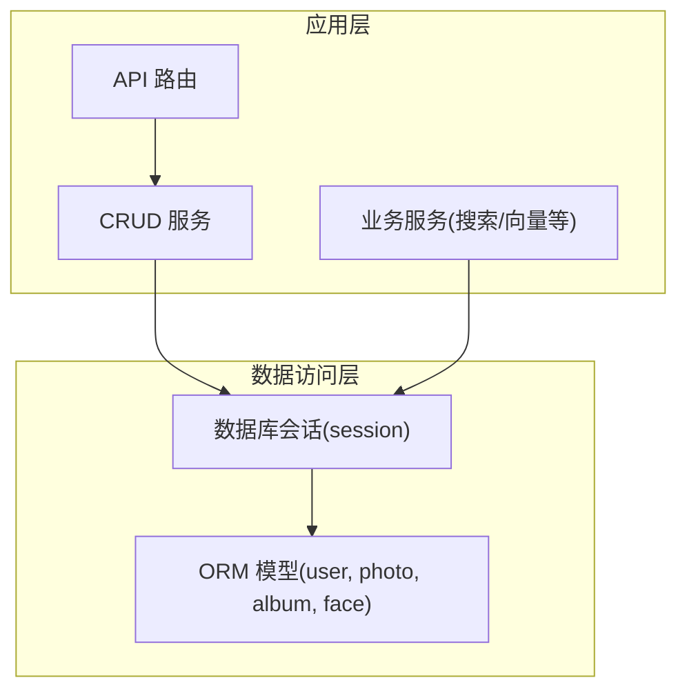
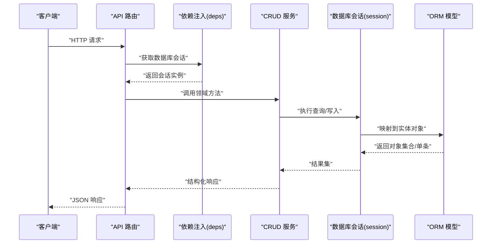
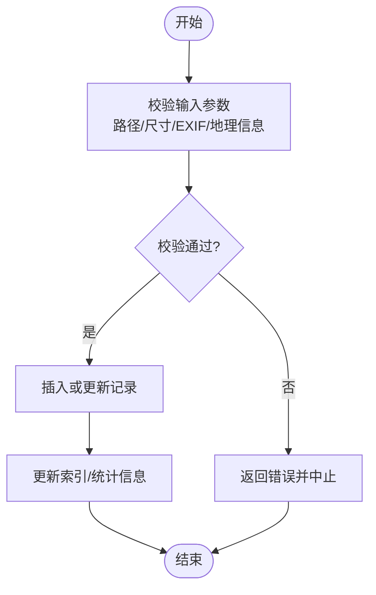
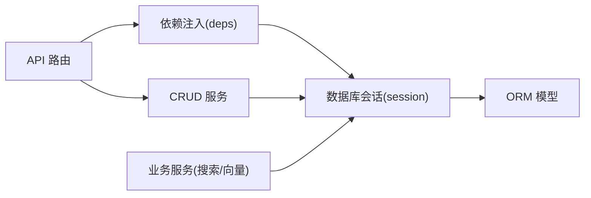

# 数据模型设计

<cite>
**本文引用的文件**   
- [backend/app/models/user.py](file://backend/app/models/user.py)
- [backend/app/models/photo.py](file://backend/app/models/photo.py)
- [backend/app/models/album.py](file://backend/app/models/album.py)
- [backend/app/models/face.py](file://backend/app/models/face.py)
- [backend/app/database/session.py](file://backend/app/database/session.py)
- [backend/app/config/settings.py](file://backend/app/config/settings.py)
- [backend/app/crud/user.py](file://backend/app/crud/user.py)
- [backend/app/crud/photo.py](file://backend/app/crud/photo.py)
- [backend/app/crud/album.py](file://backend/app/crud/album.py)
- [backend/app/api/deps.py](file://backend/app/api/deps.py)
- [backend/app/services/search_service.py](file://backend/app/services/search_service.py)
</cite>

## 目录
1. [简介](#简介)
2. [项目结构](#项目结构)
3. [核心组件](#核心组件)
4. [架构总览](#架构总览)
5. [详细组件分析](#详细组件分析)
6. [依赖关系分析](#依赖关系分析)
7. [性能考虑](#性能考虑)
8. [故障排查指南](#故障排查指南)
9. [结论](#结论)
10. [附录](#附录)

## 简介
本指南面向后端开发者，围绕 SQLAlchemy ORM 的数据建模实践，系统阐述用户、照片、相册、人脸等核心实体的表结构设计、关系映射与约束策略。文档同时覆盖数据库迁移管理、索引优化、查询性能调优、数据验证与业务约束、完整性检查、多租户隔离、软删除与审计日志记录，并提供可操作的最佳实践建议，帮助团队在 AI 相册场景中构建稳定、可扩展且高性能的数据层。

## 项目结构
本项目采用分层组织：models 定义 ORM 实体与关系；database 提供会话与存储配置；crud 封装领域操作；api 暴露接口；services 承载复杂业务逻辑（如搜索、向量检索）。数据模型位于 models 目录，并通过 CRUD 与 API 层消费。



图表来源
- [backend/app/api/deps.py](file://backend/app/api/deps.py)
- [backend/app/crud/user.py](file://backend/app/crud/user.py)
- [backend/app/crud/photo.py](file://backend/app/crud/photo.py)
- [backend/app/crud/album.py](file://backend/app/crud/album.py)
- [backend/app/database/session.py](file://backend/app/database/session.py)
- [backend/app/models/user.py](file://backend/app/models/user.py)
- [backend/app/models/photo.py](file://backend/app/models/photo.py)
- [backend/app/models/album.py](file://backend/app/models/album.py)
- [backend/app/models/face.py](file://backend/app/models/face.py)

章节来源
- [backend/app/models/user.py](file://backend/app/models/user.py)
- [backend/app/models/photo.py](file://backend/app/models/photo.py)
- [backend/app/models/album.py](file://backend/app/models/album.py)
- [backend/app/models/face.py](file://backend/app/models/face.py)
- [backend/app/database/session.py](file://backend/app/database/session.py)
- [backend/app/config/settings.py](file://backend/app/config/settings.py)
- [backend/app/crud/user.py](file://backend/app/crud/user.py)
- [backend/app/crud/photo.py](file://backend/app/crud/photo.py)
- [backend/app/crud/album.py](file://backend/app/crud/album.py)
- [backend/app/api/deps.py](file://backend/app/api/deps.py)
- [backend/app/services/search_service.py](file://backend/app/services/search_service.py)

## 核心组件
本节聚焦用户、照片、相册、人脸四个核心实体，说明其职责、关键字段、关系与约束要点。为避免泄露实现细节，本节以概念性描述为主，具体字段与关系请参考“详细组件分析”中的源码路径。

- 用户（User）
  - 职责：身份认证、权限边界、资源归属（多租户隔离的关键维度）。
  - 关键属性：唯一标识、用户名/邮箱、密码哈希、状态标记、时间戳等。
  - 关系：一对多关联到相册、照片、人脸等。
  - 约束：用户名/邮箱唯一；密码不可明文存储；启用软删除时保留已删除记录。

- 照片（Photo）
  - 职责：媒体元数据与存储路径、EXIF/地理信息、缩略图、向量嵌入引用等。
  - 关键属性：所属用户、所属相册、原始路径、缩略图路径、尺寸、拍摄时间、地理位置、标签等。
  - 关系：属于一个用户和一个相册；与人脸多对多或一对多（取决于是否允许同一张图中多人脸）。
  - 约束：路径唯一性、非空校验、时间范围合理。

- 相册（Album）
  - 职责：照片分组、共享与权限控制、智能分类等。
  - 关键属性：名称、描述、所有者、可见性、创建/更新时间。
  - 关系：属于一个用户；包含多张照片。
  - 约束：名称在用户维度唯一（可选），避免重复。

- 人脸（Face）
  - 职责：人脸检测框、特征向量、识别结果、聚类标识等。
  - 关键属性：所属照片、人脸框坐标、特征向量、姓名确认、置信度、聚类ID等。
  - 关系：属于一张照片；可与用户存在多对多（经确认后的对应关系）。
  - 约束：坐标合法、向量维度固定、唯一性由业务保证。

章节来源
- [backend/app/models/user.py](file://backend/app/models/user.py)
- [backend/app/models/photo.py](file://backend/app/models/photo.py)
- [backend/app/models/album.py](file://backend/app/models/album.py)
- [backend/app/models/face.py](file://backend/app/models/face.py)

## 架构总览
下图展示从 API 到数据库的调用链路与数据流向，体现会话注入、CRUD 操作与模型交互。



图表来源
- [backend/app/api/deps.py](file://backend/app/api/deps.py)
- [backend/app/crud/user.py](file://backend/app/crud/user.py)
- [backend/app/crud/photo.py](file://backend/app/crud/photo.py)
- [backend/app/crud/album.py](file://backend/app/crud/album.py)
- [backend/app/database/session.py](file://backend/app/database/session.py)
- [backend/app/models/user.py](file://backend/app/models/user.py)
- [backend/app/models/photo.py](file://backend/app/models/photo.py)
- [backend/app/models/album.py](file://backend/app/models/album.py)
- [backend/app/models/face.py](file://backend/app/models/face.py)

## 详细组件分析

### 用户模型（User）
- 角色与职责
  - 作为资源所有者与权限主体，贯穿多租户隔离与审计追踪。
- 关键关系
  - 与相册、照片、人脸存在一对多关系（通过外键或中间表）。
- 约束与验证
  - 唯一性：用户名/邮箱唯一。
  - 非空与长度限制：基础字段需满足最小长度与格式要求。
  - 状态与软删除：支持 is_active、is_deleted 等标记字段。
- 索引建议
  - 用户名、邮箱建立唯一索引；常用过滤字段（如状态、创建时间）建立普通索引。
- 安全与合规
  - 密码使用强哈希算法；敏感字段加密存储；审计字段记录创建/更新者。

```mermaid
classDiagram
class User {
+id
+username
+email
+password_hash
+is_active
+is_deleted
+created_at
+updated_at
}
class Album {
+id
+name
+owner_id
+is_deleted
+created_at
+updated_at
}
class Photo {
+id
+user_id
+album_id
+path
+thumbnail_path
+exif_data
+geo_info
+is_deleted
+created_at
+updated_at
}
class Face {
+id
+photo_id
+bbox
+embedding_ref
+confirmed_name
+cluster_id
+confidence
+is_deleted
+created_at
+updated_at
}
User ||--o{ Album : "拥有"
User ||--o{ Photo : "上传"
Album ||--o{ Photo : "包含"
Photo ||--o{ Face : "包含"
```

图表来源
- [backend/app/models/user.py](file://backend/app/models/user.py)
- [backend/app/models/album.py](file://backend/app/models/album.py)
- [backend/app/models/photo.py](file://backend/app/models/photo.py)
- [backend/app/models/face.py](file://backend/app/models/face.py)

章节来源
- [backend/app/models/user.py](file://backend/app/models/user.py)
- [backend/app/crud/user.py](file://backend/app/crud/user.py)

### 照片模型（Photo）
- 角色与职责
  - 承载媒体元数据、存储路径、EXIF/地理信息、缩略图与向量引用。
- 关键关系
  - 属于一个用户和一个相册；与人脸一对多（或借助中间表实现多对多）。
- 约束与验证
  - 路径唯一性与非空；尺寸与时长范围校验；EXIF/地理信息可选但需格式校验。
- 索引建议
  - user_id、album_id、created_at 建立复合索引；geo_info 若为点类型则建立空间索引。
- 性能优化
  - 大字段（如 EXIF/地理信息）按需加载；缩略图与向量分离存储；分页与投影减少传输。



图表来源
- [backend/app/models/photo.py](file://backend/app/models/photo.py)
- [backend/app/crud/photo.py](file://backend/app/crud/photo.py)

章节来源
- [backend/app/models/photo.py](file://backend/app/models/photo.py)
- [backend/app/crud/photo.py](file://backend/app/crud/photo.py)

### 相册模型（Album）
- 角色与职责
  - 组织照片、控制可见性与共享策略、支撑智能分类。
- 关键关系
  - 属于一个用户；包含多张照片。
- 约束与验证
  - 名称在用户维度唯一（可选）；描述长度限制；状态与软删除标记。
- 索引建议
  - owner_id、created_at 建立索引；名称+用户组合唯一索引（如需）。

章节来源
- [backend/app/models/album.py](file://backend/app/models/album.py)
- [backend/app/crud/album.py](file://backend/app/crud/album.py)

### 人脸模型（Face）
- 角色与职责
  - 存储人脸检测框、特征向量、识别结果、聚类标识与确认姓名。
- 关键关系
  - 属于一张照片；可与用户建立多对多（经确认后形成用户-人脸映射）。
- 约束与验证
  - 人脸框坐标合法性；向量维度固定；置信度阈值校验。
- 索引建议
  - photo_id 索引；cluster_id 索引；embedding_ref 若用于近似检索，结合向量库或数据库向量索引。

章节来源
- [backend/app/models/face.py](file://backend/app/models/face.py)

### 数据会话与配置
- 会话管理
  - 通过依赖注入提供数据库会话，确保每个请求独立事务上下文。
- 连接配置
  - 数据库 URL、池大小、超时、回退策略等通过配置中心注入。
- 最佳实践
  - 显式提交/回滚；避免长事务；使用连接池；读写分离（可选）。

章节来源
- [backend/app/database/session.py](file://backend/app/database/session.py)
- [backend/app/config/settings.py](file://backend/app/config/settings.py)
- [backend/app/api/deps.py](file://backend/app/api/deps.py)

## 依赖关系分析
- 模块耦合
  - API 依赖 deps 注入会话；CRUD 依赖 session 与 models；services 直接访问 session 进行复杂查询。
- 外部依赖
  - 数据库驱动（SQLAlchemy）、向量检索（可选）、对象存储（路径/URL）。
- 潜在循环
  - 避免在 models 中引入业务逻辑导致循环导入；将复杂查询下沉至 services 或 crud。



图表来源
- [backend/app/api/deps.py](file://backend/app/api/deps.py)
- [backend/app/database/session.py](file://backend/app/database/session.py)
- [backend/app/models/user.py](file://backend/app/models/user.py)
- [backend/app/models/photo.py](file://backend/app/models/photo.py)
- [backend/app/models/album.py](file://backend/app/models/album.py)
- [backend/app/models/face.py](file://backend/app/models/face.py)
- [backend/app/crud/user.py](file://backend/app/crud/user.py)
- [backend/app/crud/photo.py](file://backend/app/crud/photo.py)
- [backend/app/crud/album.py](file://backend/app/crud/album.py)
- [backend/app/services/search_service.py](file://backend/app/services/search_service.py)

章节来源
- [backend/app/api/deps.py](file://backend/app/api/deps.py)
- [backend/app/database/session.py](file://backend/app/database/session.py)
- [backend/app/models/user.py](file://backend/app/models/user.py)
- [backend/app/models/photo.py](file://backend/app/models/photo.py)
- [backend/app/models/album.py](file://backend/app/models/album.py)
- [backend/app/models/face.py](file://backend/app/models/face.py)
- [backend/app/crud/user.py](file://backend/app/crud/user.py)
- [backend/app/crud/photo.py](file://backend/app/crud/photo.py)
- [backend/app/crud/album.py](file://backend/app/crud/album.py)
- [backend/app/services/search_service.py](file://backend/app/services/search_service.py)

## 性能考虑
- 索引策略
  - 高频过滤字段（user_id、album_id、created_at、status）建立索引；复合索引按查询模式设计。
  - 地理信息使用空间索引；向量字段结合向量库或数据库原生向量索引。
- 查询优化
  - 使用 selectinload/joinedload 避免 N+1；仅选择必要字段；分页与游标分页。
  - 聚合与统计走物化视图或定时任务预计算。
- 事务与锁
  - 短事务、明确提交/回滚；并发写冲突使用乐观锁（版本号）或行级锁。
- 缓存与异步
  - 热点数据缓存（Redis）；耗时任务（检测、向量化）异步队列处理。

[本节为通用指导，不直接分析具体文件]

## 故障排查指南
- 常见问题
  - 连接池耗尽：检查会话生命周期与事务提交；增大池大小或优化慢查询。
  - 死锁：缩短事务、统一加锁顺序、拆分批量操作。
  - 索引失效：检查查询条件与索引列匹配；使用 EXPLAIN 分析执行计划。
- 定位手段
  - 开启 SQL 日志；记录慢查询；监控连接数与锁等待。
  - 单元测试与集成测试覆盖关键路径；压测验证索引与分页效果。

章节来源
- [backend/app/database/session.py](file://backend/app/database/session.py)
- [backend/app/config/settings.py](file://backend/app/config/settings.py)

## 结论
通过清晰的实体划分、严谨的关系映射与约束策略，配合合理的索引与查询优化，可在 AI 相册场景下构建高可用、高性能的数据层。建议在开发流程中引入迁移管理、代码审查与性能回归测试，持续保障数据模型的质量与演进可控。

[本节为总结性内容，不直接分析具体文件]

## 附录

### 数据迁移管理
- 工具选型
  - 推荐使用 Alembic 管理版本化迁移；与 SQLAlchemy 模型保持同步。
- 最佳实践
  - 每次变更生成独立迁移脚本；迁移幂等；回滚策略完备；生产环境灰度发布。
- 示例步骤
  - 初始化迁移仓库；生成迁移脚本；审查并手动修正；在目标环境执行迁移。

[本节为通用指导，不直接分析具体文件]

### 数据验证规则与业务约束
- 字段级验证
  - 非空、长度、格式、范围；自定义校验器（正则、枚举、跨字段一致性）。
- 业务约束
  - 唯一性（用户名/邮箱/路径）；所有权校验（用户-资源绑定）；状态机（草稿/已发布/归档）。
- 完整性检查
  - 外键约束；触发器或后处理器做一致性校验；定期巡检任务修复脏数据。

[本节为通用指导，不直接分析具体文件]

### 多租户数据隔离
- 方案
  - 基于用户 ID 的 tenant_id 字段；所有查询强制附加 tenant 条件；中间件注入当前租户上下文。
- 注意事项
  - 默认查询过滤器；权限校验前置；跨租户访问严格禁止。

[本节为通用指导，不直接分析具体文件]

### 软删除实现
- 设计
  - 增加 is_deleted 与 deleted_at 字段；默认查询排除已删除记录；恢复功能支持。
- 影响面
  - 索引与唯一约束需考虑软删除；历史归档与清理策略。

[本节为通用指导，不直接分析具体文件]

### 审计日志记录
- 字段
  - created_by、updated_by、deleted_by、created_at、updated_at、deleted_at。
- 实现
  - ORM 事件监听自动填充；变更前后快照；敏感字段脱敏。

[本节为通用指导，不直接分析具体文件]

### 查询性能调优清单
- 使用 EXPLAIN 分析执行计划；避免 SELECT *；合理使用 JOIN 与子查询；分页采用游标；热点数据缓存；异步批处理。

[本节为通用指导，不直接分析具体文件]