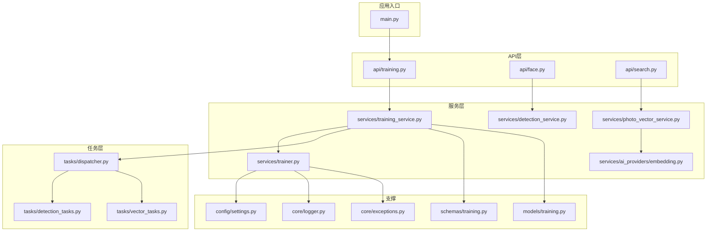
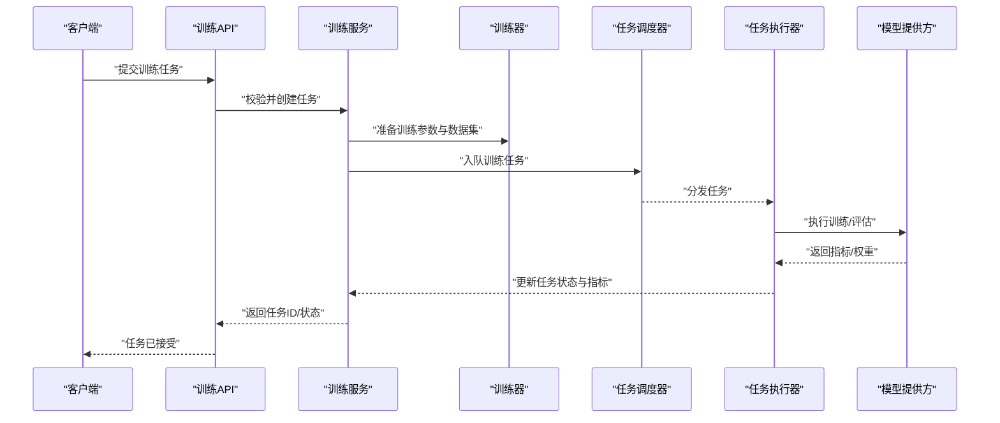
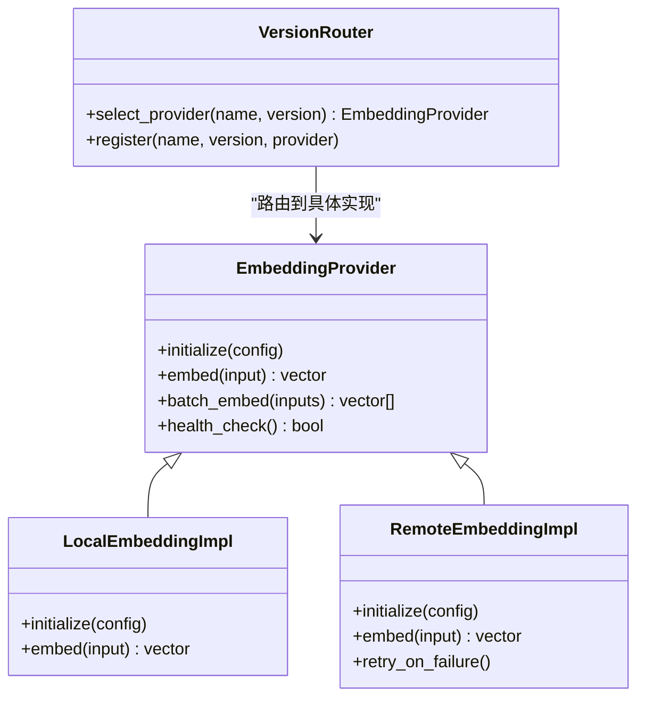
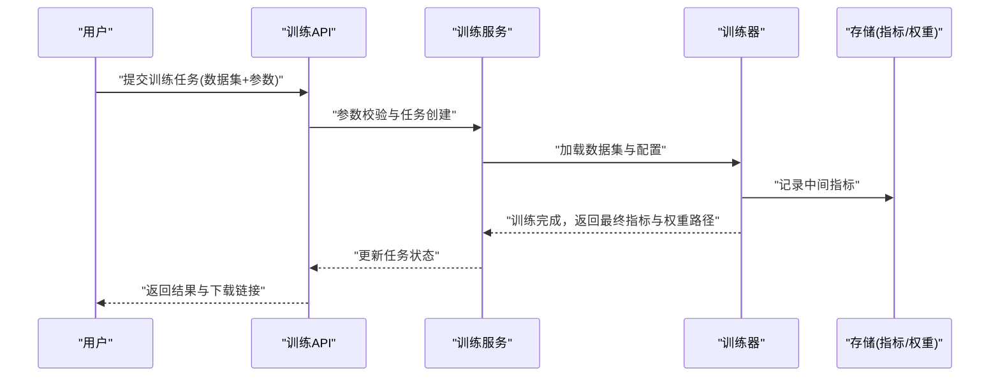
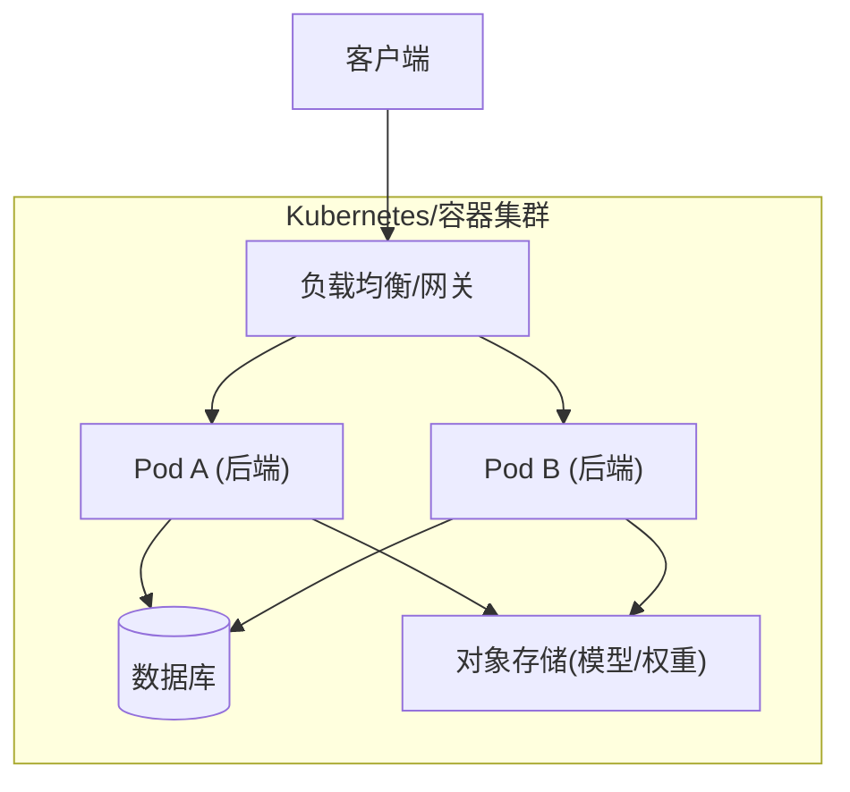
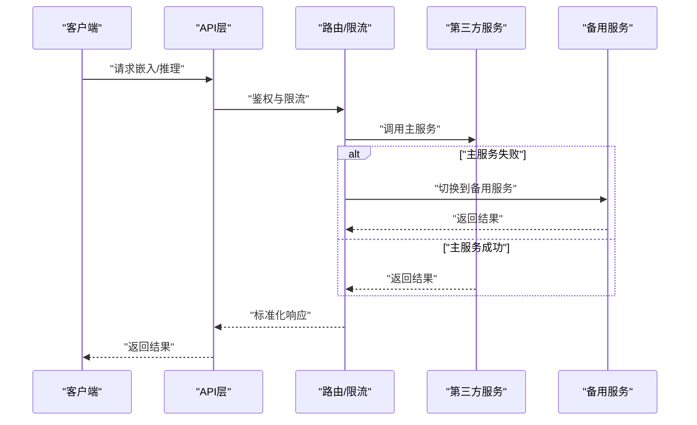
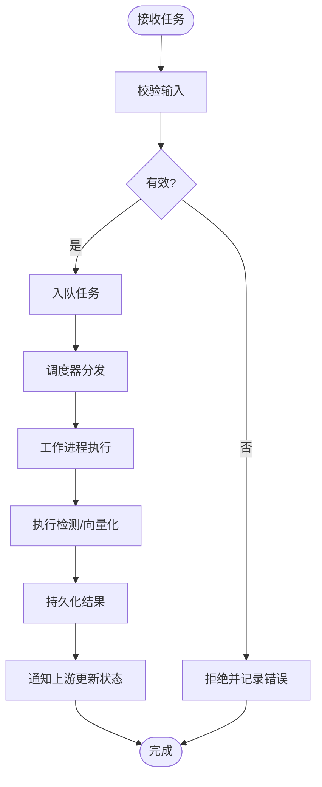
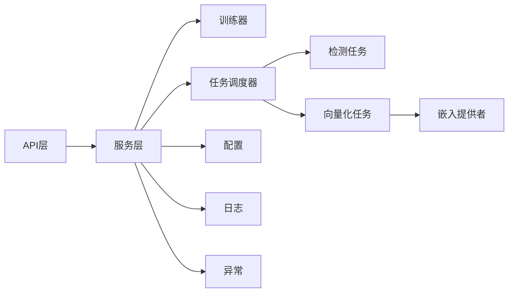

# AI模型集成

<cite>
**本文引用的文件**   
- [backend/app/services/ai_providers/embedding.py](file://backend/app/services/ai_providers/embedding.py)
- [backend/app/services/trainer.py](file://backend/app/services/trainer.py)
- [backend/app/services/training_service.py](file://backend/app/services/training_service.py)
- [backend/app/api/training.py](file://backend/app/api/training.py)
- [backend/app/schemas/training.py](file://backend/app/schemas/training.py)
- [backend/app/models/training.py](file://backend/app/models/training.py)
- [backend/app/tasks/detection_tasks.py](file://backend/app/tasks/detection_tasks.py)
- [backend/app/tasks/vector_tasks.py](file://backend/app/tasks/vector_tasks.py)
- [backend/app/tasks/dispatcher.py](file://backend/app/tasks/dispatcher.py)
- [backend/app/core/logger.py](file://backend/app/core/logger.py)
- [backend/app/core/exceptions.py](file://backend/app/core/exceptions.py)
- [backend/app/config/settings.py](file://backend/app/config/settings.py)
- [backend/main.py](file://backend/main.py)
- [backend/Dockerfile](file://backend/Dockerfile)
- [docker-compose.yml](file://docker-compose.yml)
</cite>

## 目录
1. [简介](#简介)
2. [项目结构](#项目结构)
3. [核心组件](#核心组件)
4. [架构总览](#架构总览)
5. [详细组件分析](#详细组件分析)
6. [依赖关系分析](#依赖关系分析)
7. [性能与成本优化](#性能与成本优化)
8. [故障排查指南](#故障排查指南)
9. [结论](#结论)
10. [附录](#附录)

## 简介
本技术文档围绕AI模型集成的多模型支持、插件化加载、版本管理、嵌入模型配置与调用封装、训练框架使用、本地部署容器化与资源治理、第三方服务认证与容错、以及监控日志与成本分析等主题展开。文档面向具备不同技术背景的读者，提供从高层架构到代码级实现的系统性说明，并辅以可视化图示帮助理解数据流与控制流。

## 项目结构
后端采用分层与按能力域组织相结合的结构：API层暴露REST接口，服务层实现业务逻辑，任务层处理异步与批处理，配置与异常处理贯穿全局。与AI模型集成相关的核心目录包括：
- ai_providers：嵌入模型提供者抽象与实现
- services：训练与服务编排（含检测、向量检索、相册智能等）
- tasks：异步任务调度与执行（检测、向量化等）
- schemas/models：请求响应模式与持久化模型定义
- core：日志、异常、安全等横切关注点
- config：系统与环境配置

图表来源
- [backend/main.py](file://backend/main.py)
- [backend/app/api/training.py](file://backend/app/api/training.py)
- [backend/app/services/training_service.py](file://backend/app/services/training_service.py)
- [backend/app/services/trainer.py](file://backend/app/services/trainer.py)
- [backend/app/services/ai_providers/embedding.py](file://backend/app/services/ai_providers/embedding.py)
- [backend/app/tasks/detection_tasks.py](file://backend/app/tasks/detection_tasks.py)
- [backend/app/tasks/vector_tasks.py](file://backend/app/tasks/vector_tasks.py)
- [backend/app/tasks/dispatcher.py](file://backend/app/tasks/dispatcher.py)
- [backend/app/config/settings.py](file://backend/app/config/settings.py)
- [backend/app/core/logger.py](file://backend/app/core/logger.py)
- [backend/app/core/exceptions.py](file://backend/app/core/exceptions.py)
- [backend/app/schemas/training.py](file://backend/app/schemas/training.py)
- [backend/app/models/training.py](file://backend/app/models/training.py)

章节来源
- [backend/main.py](file://backend/main.py)
- [backend/app/api/training.py](file://backend/app/api/training.py)
- [backend/app/services/training_service.py](file://backend/app/services/training_service.py)
- [backend/app/services/trainer.py](file://backend/app/services/trainer.py)
- [backend/app/services/ai_providers/embedding.py](file://backend/app/services/ai_providers/embedding.py)
- [backend/app/tasks/detection_tasks.py](file://backend/app/tasks/detection_tasks.py)
- [backend/app/tasks/vector_tasks.py](file://backend/app/tasks/vector_tasks.py)
- [backend/app/tasks/dispatcher.py](file://backend/app/tasks/dispatcher.py)
- [backend/app/config/settings.py](file://backend/app/config/settings.py)
- [backend/app/core/logger.py](file://backend/app/core/logger.py)
- [backend/app/core/exceptions.py](file://backend/app/core/exceptions.py)
- [backend/app/schemas/models/training.py](file://backend/app/models/training.py)
- [backend/app/schemas/training.py](file://backend/app/schemas/training.py)

## 核心组件
本节聚焦与AI模型集成直接相关的关键模块及其职责边界。

- 嵌入模型提供者（Embedding Provider）
  - 负责统一接入多种嵌入模型，屏蔽底层差异，对外提供一致的嵌入生成接口。
  - 典型职责：初始化连接、参数校验、调用外部或本地模型、返回标准化向量。
  - 参考路径：[embedding.py](file://backend/app/services/ai_providers/embedding.py)

- 训练服务（Training Service）
  - 协调训练任务的创建、状态跟踪、结果落库与通知。
  - 与训练器交互，将用户请求转换为可执行的训练作业。
  - 参考路径：[training_service.py](file://backend/app/services/training_service.py)、[trainer.py](file://backend/app/services/trainer.py)

- 训练API（Training API）
  - 暴露训练任务提交、查询、取消等HTTP接口，进行输入校验与权限控制。
  - 参考路径：[training.py](file://backend/app/api/training.py)

- 训练数据模型与模式（Schemas & Models）
  - Schemas：用于请求/响应结构与字段校验。
  - Models：持久化训练任务元数据、进度与指标。
  - 参考路径：[schemas/training.py](file://backend/app/schemas/training.py)、[models/training.py](file://backend/app/models/training.py)

- 任务调度与执行（Task Dispatcher & Workers）
  - 将耗时任务（如检测、向量化）异步化，解耦API与计算。
  - 参考路径：[dispatcher.py](file://backend/app/tasks/dispatcher.py)、[detection_tasks.py](file://backend/app/tasks/detection_tasks.py)、[vector_tasks.py](file://backend/app/tasks/vector_tasks.py)

- 配置与横切关注点（Config, Logger, Exceptions）
  - 配置集中管理，日志记录与异常类型统一。
  - 参考路径：[settings.py](file://backend/app/config/settings.py)、[logger.py](file://backend/app/core/logger.py)、[exceptions.py](file://backend/app/core/exceptions.py)

章节来源
- [backend/app/services/ai_providers/embedding.py](file://backend/app/services/ai_providers/embedding.py)
- [backend/app/services/training_service.py](file://backend/app/services/training_service.py)
- [backend/app/services/trainer.py](file://backend/app/services/trainer.py)
- [backend/app/api/training.py](file://backend/app/api/training.py)
- [backend/app/schemas/training.py](file://backend/app/schemas/training.py)
- [backend/app/models/training.py](file://backend/app/models/training.py)
- [backend/app/tasks/dispatcher.py](file://backend/app/tasks/dispatcher.py)
- [backend/app/tasks/detection_tasks.py](file://backend/app/tasks/detection_tasks.py)
- [backend/app/tasks/vector_tasks.py](file://backend/app/tasks/vector_tasks.py)
- [backend/app/config/settings.py](file://backend/app/config/settings.py)
- [backend/app/core/logger.py](file://backend/app/core/logger.py)
- [backend/app/core/exceptions.py](file://backend/app/core/exceptions.py)

## 架构总览
下图展示了从API到服务、再到任务与外部模型的端到端流程，体现“接口—服务—任务—模型”的分层与解耦。

图表来源
- [backend/app/api/training.py](file://backend/app/api/training.py)
- [backend/app/services/training_service.py](file://backend/app/services/training_service.py)
- [backend/app/services/trainer.py](file://backend/app/services/trainer.py)
- [backend/app/tasks/dispatcher.py](file://backend/app/tasks/dispatcher.py)
- [backend/app/tasks/detection_tasks.py](file://backend/app/tasks/detection_tasks.py)
- [backend/app/tasks/vector_tasks.py](file://backend/app/tasks/vector_tasks.py)

## 详细组件分析

### 嵌入模型提供者（插件化与版本管理）
- 设计要点
  - 通过统一的提供者接口屏蔽不同嵌入模型差异，便于新增模型时以“插件”方式扩展。
  - 支持按名称或版本选择具体实现，满足灰度与回滚需求。
  - 对超时、限流、重试、熔断等横切策略在提供者内部或上层统一封装。
- 关键职责
  - 初始化与配置注入（密钥、端点、维度、批量大小等）。
  - 文本/图像到向量的转换与标准化输出。
  - 错误分类与降级策略（例如切换备用模型或返回空向量）。
- 建议的类图（概念映射至实际文件）

图表来源
- [backend/app/services/ai_providers/embedding.py](file://backend/app/services/ai_providers/embedding.py)

章节来源
- [backend/app/services/ai_providers/embedding.py](file://backend/app/services/ai_providers/embedding.py)

### 训练框架使用指南（数据集、参数、评估）
- 数据集准备
  - 明确数据格式与标签规范，确保训练/验证/测试集划分合理。
  - 数据清洗与增强策略应在训练前完成，保证一致性。
- 训练参数配置
  - 学习率、批次大小、轮次、早停、权重衰减等超参集中管理。
  - 通过配置对象传入训练器，避免硬编码。
- 模型评估指标
  - 根据任务选择合适指标（准确率、F1、mAP等），并在训练过程中持续记录。
  - 将指标写入持久化存储，供后续分析与对比。
- 训练流程时序

图表来源
- [backend/app/api/training.py](file://backend/app/api/training.py)
- [backend/app/services/training_service.py](file://backend/app/services/training_service.py)
- [backend/app/services/trainer.py](file://backend/app/services/trainer.py)
- [backend/app/models/training.py](file://backend/app/models/training.py)
- [backend/app/schemas/training.py](file://backend/app/schemas/training.py)

章节来源
- [backend/app/api/training.py](file://backend/app/api/training.py)
- [backend/app/services/training_service.py](file://backend/app/services/training_service.py)
- [backend/app/services/trainer.py](file://backend/app/services/trainer.py)
- [backend/app/models/training.py](file://backend/app/models/training.py)
- [backend/app/schemas/training.py](file://backend/app/schemas/training.py)

### 本地模型部署（容器化、资源管理与负载均衡）
- 容器化方案
  - 使用Docker打包后端镜像，固定依赖与运行环境，提升可移植性。
  - 通过环境变量注入配置（如模型路径、并发数、日志级别）。
- 资源管理
  - 限制CPU/GPU内存占用，设置合理的进程/线程池规模。
  - 针对长耗时任务启用队列与背压，避免雪崩。
- 负载均衡
  - 在多实例部署场景下，结合反向代理或服务发现进行流量分发。
  - 健康检查与优雅启停保障滚动升级。
- 部署架构图

图表来源
- [backend/Dockerfile](file://backend/Dockerfile)
- [docker-compose.yml](file://docker-compose.yml)
- [backend/main.py](file://backend/main.py)

章节来源
- [backend/Dockerfile](file://backend/Dockerfile)
- [docker-compose.yml](file://docker-compose.yml)
- [backend/main.py](file://backend/main.py)

### 第三方AI服务（认证、限流与故障转移）
- 认证配置
  - 通过配置中心或环境变量注入密钥、令牌与端点信息。
  - 敏感信息不落盘，运行时动态读取。
- 限流与重试
  - 基于令牌桶或滑动窗口进行QPS限制。
  - 指数退避重试，区分可恢复与不可恢复错误。
- 故障转移
  - 主备或多提供商冗余，自动切换失败节点。
  - 熔断器防止级联故障。
- 调用序列图

图表来源
- [backend/app/services/ai_providers/embedding.py](file://backend/app/services/ai_providers/embedding.py)
- [backend/app/core/exceptions.py](file://backend/app/core/exceptions.py)
- [backend/app/core/logger.py](file://backend/app/core/logger.py)

章节来源
- [backend/app/services/ai_providers/embedding.py](file://backend/app/services/ai_providers/embedding.py)
- [backend/app/core/exceptions.py](file://backend/app/core/exceptions.py)
- [backend/app/core/logger.py](file://backend/app/core/logger.py)

### 任务与异步处理（检测与向量化）
- 检测任务
  - 将人脸/目标检测等耗时操作放入任务队列，由工作进程消费。
- 向量化任务
  - 图片/文本转向量后入库，供检索使用。
- 任务流程图

图表来源
- [backend/app/tasks/dispatcher.py](file://backend/app/tasks/dispatcher.py)
- [backend/app/tasks/detection_tasks.py](file://backend/app/tasks/detection_tasks.py)
- [backend/app/tasks/vector_tasks.py](file://backend/app/tasks/vector_tasks.py)

章节来源
- [backend/app/tasks/dispatcher.py](file://backend/app/tasks/dispatcher.py)
- [backend/app/tasks/detection_tasks.py](file://backend/app/tasks/detection_tasks.py)
- [backend/app/tasks/vector_tasks.py](file://backend/app/tasks/vector_tasks.py)

## 依赖关系分析
- 组件耦合
  - API层仅依赖服务层，服务层依赖训练器与任务调度器，任务层依赖具体执行器。
  - 嵌入提供者作为独立模块被向量服务引用，降低耦合度。
- 外部依赖
  - 数据库、对象存储、第三方AI服务。
- 潜在循环依赖
  - 通过接口与事件机制避免直接双向引用。
- 依赖图

图表来源
- [backend/app/api/training.py](file://backend/app/api/training.py)
- [backend/app/services/training_service.py](file://backend/app/services/training_service.py)
- [backend/app/services/trainer.py](file://backend/app/services/trainer.py)
- [backend/app/tasks/dispatcher.py](file://backend/app/tasks/dispatcher.py)
- [backend/app/tasks/detection_tasks.py](file://backend/app/tasks/detection_tasks.py)
- [backend/app/tasks/vector_tasks.py](file://backend/app/tasks/vector_tasks.py)
- [backend/app/services/ai_providers/embedding.py](file://backend/app/services/ai_providers/embedding.py)
- [backend/app/config/settings.py](file://backend/app/config/settings.py)
- [backend/app/core/logger.py](file://backend/app/core/logger.py)
- [backend/app/core/exceptions.py](file://backend/app/core/exceptions.py)

章节来源
- [backend/app/api/training.py](file://backend/app/api/training.py)
- [backend/app/services/training_service.py](file://backend/app/services/training_service.py)
- [backend/app/services/trainer.py](file://backend/app/services/trainer.py)
- [backend/app/tasks/dispatcher.py](file://backend/app/tasks/dispatcher.py)
- [backend/app/tasks/detection_tasks.py](file://backend/app/tasks/detection_tasks.py)
- [backend/app/tasks/vector_tasks.py](file://backend/app/tasks/vector_tasks.py)
- [backend/app/services/ai_providers/embedding.py](file://backend/app/services/ai_providers/embedding.py)
- [backend/app/config/settings.py](file://backend/app/config/settings.py)
- [backend/app/core/logger.py](file://backend/app/core/logger.py)
- [backend/app/core/exceptions.py](file://backend/app/core/exceptions.py)

## 性能与成本优化
- 模型侧
  - 选择合适的模型尺寸与精度（INT8/FP16），权衡延迟与质量。
  - 批量推理与缓存热点向量，减少重复计算。
- 服务侧
  - 合理设置并发与队列长度，避免过载。
  - 引入连接池与对象存储预取，降低I/O瓶颈。
- 成本侧
  - 第三方服务按用量计费，需统计token/调用次数与费用。
  - 本地模型优先，云端兜底；对高价值请求走高质量模型。
- 监控与告警
  - 追踪P95/P99延迟、错误率、吞吐与资源利用率。
  - 对异常突增与慢查询建立阈值告警。

## 故障排查指南
- 常见问题定位
  - 任务堆积：检查任务队列长度与工作进程数量。
  - 第三方服务超时：查看限流与重试策略是否生效。
  - 训练失败：核对数据集格式、参数合法性与日志堆栈。
- 日志与异常
  - 统一日志格式与分级，关键路径埋点。
  - 自定义异常类型，便于前端友好提示与自动化处理。
- 参考路径
  - 日志：[logger.py](file://backend/app/core/logger.py)
  - 异常：[exceptions.py](file://backend/app/core/exceptions.py)
  - 任务执行：[detection_tasks.py](file://backend/app/tasks/detection_tasks.py)、[vector_tasks.py](file://backend/app/tasks/vector_tasks.py)

章节来源
- [backend/app/core/logger.py](file://backend/app/core/logger.py)
- [backend/app/core/exceptions.py](file://backend/app/core/exceptions.py)
- [backend/app/tasks/detection_tasks.py](file://backend/app/tasks/detection_tasks.py)
- [backend/app/tasks/vector_tasks.py](file://backend/app/tasks/vector_tasks.py)

## 结论
本方案通过清晰的层次划分与插件化设计，实现了多模型支持与灵活扩展；借助任务队列与容器化部署，提升了系统的稳定性与可伸缩性；配合完善的监控、日志与成本分析实践，为生产环境的长期演进提供了坚实基础。

## 附录
- 术语
  - 嵌入模型：将文本或图像映射为固定维度的向量表示。
  - 训练器：封装训练流程与超参管理的组件。
  - 任务调度器：负责任务入队、分发与状态跟踪。
- 最佳实践清单
  - 所有外部调用增加超时与重试。
  - 关键路径添加结构化日志与指标上报。
  - 配置与密钥分离，遵循最小权限原则。
  - 灰度发布与快速回滚策略。