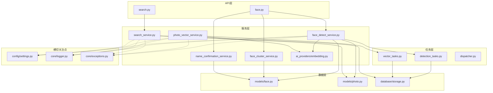
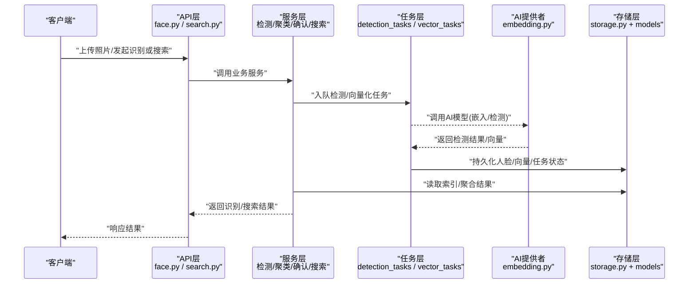
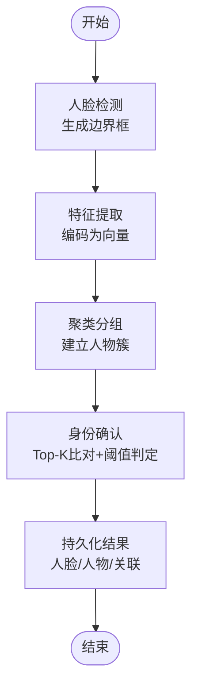
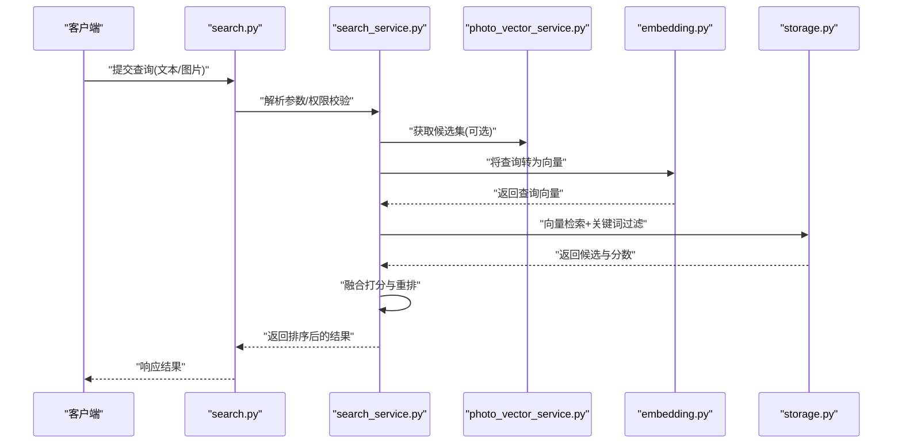
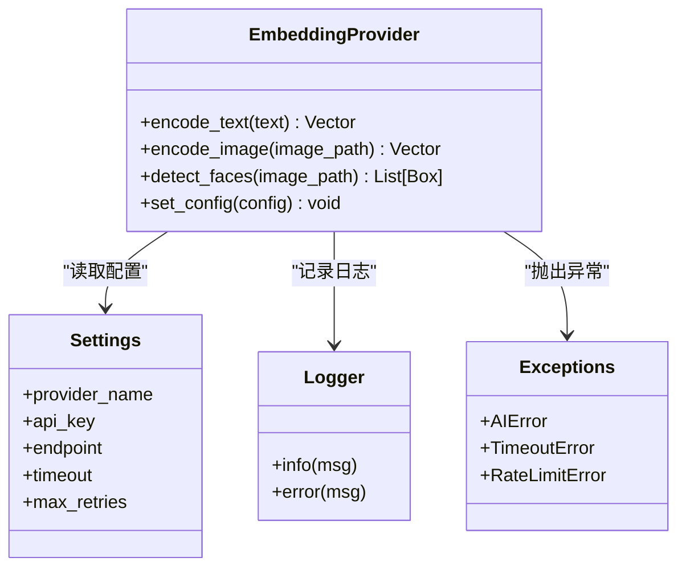
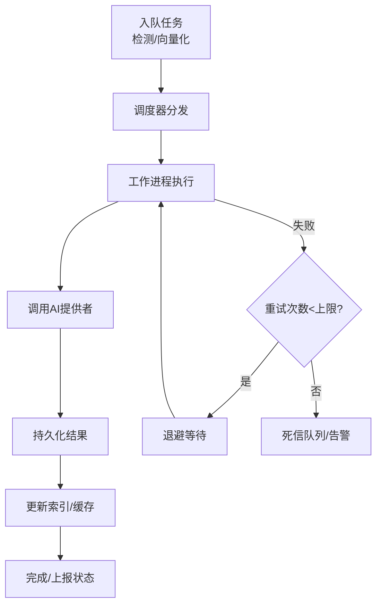
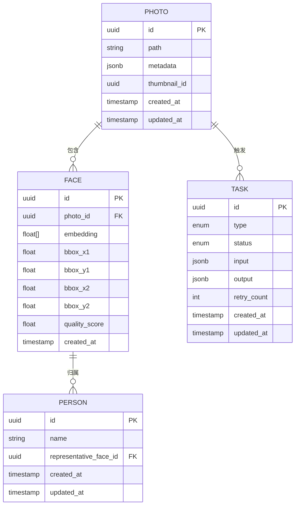
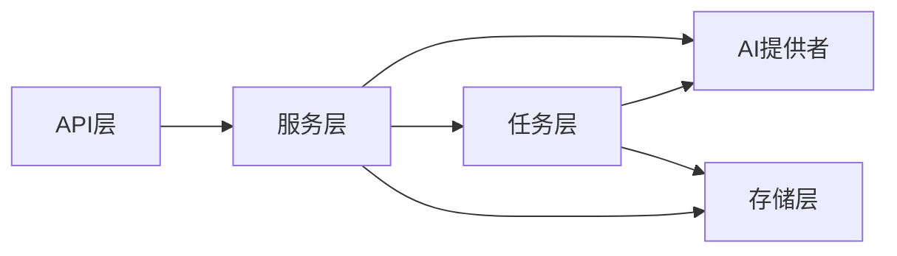

# AI集成服务

<cite>
**本文引用的文件**   
- [backend/app/api/face.py](file://backend/app/api/face.py)
- [backend/app/api/search.py](file://backend/app/api/search.py)
- [backend/app/services/face_detect_service.py](file://backend/app/services/face_detect_service.py)
- [backend/app/services/face_cluster_service.py](file://backend/app/services/face_cluster_service.py)
- [backend/app/services/name_confirmation_service.py](file://backend/app/services/name_confirmation_service.py)
- [backend/app/services/photo_vector_service.py](file://backend/app/services/photo_vector_service.py)
- [backend/app/services/search_service.py](file://backend/app/services/search_service.py)
- [backend/app/services/ai_providers/embedding.py](file://backend/app/services/ai_providers/embedding.py)
- [backend/app/tasks/detection_tasks.py](file://backend/app/tasks/detection_tasks.py)
- [backend/app/tasks/vector_tasks.py](file://backend/app/tasks/vector_tasks.py)
- [backend/app/tasks/dispatcher.py](file://backend/app/tasks/dispatcher.py)
- [backend/app/models/face.py](file://backend/app/models/face.py)
- [backend/app/models/photo.py](file://backend/app/models/photo.py)
- [backend/app/database/storage.py](file://backend/app/database/storage.py)
- [backend/app/config/settings.py](file://backend/app/config/settings.py)
- [backend/app/core/logger.py](file://backend/app/core/logger.py)
- [backend/app/core/exceptions.py](file://backend/app/core/exceptions.py)
</cite>

## 目录
1. [简介](#简介)
2. [项目结构](#项目结构)
3. [核心组件](#核心组件)
4. [架构总览](#架构总览)
5. [详细组件分析](#详细组件分析)
6. [依赖关系分析](#依赖关系分析)
7. [性能考量](#性能考量)
8. [故障排查指南](#故障排查指南)
9. [结论](#结论)
10. [附录](#附录)

## 简介
本文件面向AI集成服务的实现与使用，聚焦以下能力：
- 人脸识别：人脸检测、特征提取、聚类算法与身份确认流程
- 语义搜索：向量检索、混合搜索策略与结果排序
- AI模型调用封装：统一抽象、异步任务处理、缓存策略与错误恢复
- 第三方AI服务集成：配置方法与扩展模式
- 数据与索引：AI结果存储格式、索引构建与查询优化
- 运维与成本：性能监控、资源管理与成本控制最佳实践

## 项目结构
后端采用分层设计：API层暴露REST接口；服务层封装业务逻辑与AI调用；任务层负责异步处理；数据层提供持久化与存储；配置与日志贯穿全局。

图表来源
- [backend/app/api/face.py](file://backend/app/api/face.py)
- [backend/app/api/search.py](file://backend/app/api/search.py)
- [backend/app/services/face_detect_service.py](file://backend/app/services/face_detect_service.py)
- [backend/app/services/face_cluster_service.py](file://backend/app/services/face_cluster_service.py)
- [backend/app/services/name_confirmation_service.py](file://backend/app/services/name_confirmation_service.py)
- [backend/app/services/photo_vector_service.py](file://backend/app/services/photo_vector_service.py)
- [backend/app/services/search_service.py](file://backend/app/services/search_service.py)
- [backend/app/services/ai_providers/embedding.py](file://backend/app/services/ai_providers/embedding.py)
- [backend/app/tasks/detection_tasks.py](file://backend/app/tasks/detection_tasks.py)
- [backend/app/tasks/vector_tasks.py](file://backend/app/tasks/vector_tasks.py)
- [backend/app/tasks/dispatcher.py](file://backend/app/tasks/dispatcher.py)
- [backend/app/models/face.py](file://backend/app/models/face.py)
- [backend/app/models/photo.py](file://backend/app/models/photo.py)
- [backend/app/database/storage.py](file://backend/app/database/storage.py)
- [backend/app/config/settings.py](file://backend/app/config/settings.py)
- [backend/app/core/logger.py](file://backend/app/core/logger.py)
- [backend/app/core/exceptions.py](file://backend/app/core/exceptions.py)

章节来源
- [backend/app/api/face.py](file://backend/app/api/face.py)
- [backend/app/api/search.py](file://backend/app/api/search.py)
- [backend/app/services/face_detect_service.py](file://backend/app/services/face_detect_service.py)
- [backend/app/services/face_cluster_service.py](file://backend/app/services/face_cluster_service.py)
- [backend/app/services/name_confirmation_service.py](file://backend/app/services/name_confirmation_service.py)
- [backend/app/services/photo_vector_service.py](file://backend/app/services/photo_vector_service.py)
- [backend/app/services/search_service.py](file://backend/app/services/search_service.py)
- [backend/app/services/ai_providers/embedding.py](file://backend/app/services/ai_providers/embedding.py)
- [backend/app/tasks/detection_tasks.py](file://backend/app/tasks/detection_tasks.py)
- [backend/app/tasks/vector_tasks.py](file://backend/app/tasks/vector_tasks.py)
- [backend/app/tasks/dispatcher.py](file://backend/app/tasks/dispatcher.py)
- [backend/app/models/face.py](file://backend/app/models/face.py)
- [backend/app/models/photo.py](file://backend/app/models/photo.py)
- [backend/app/database/storage.py](file://backend/app/database/storage.py)
- [backend/app/config/settings.py](file://backend/app/config/settings.py)
- [backend/app/core/logger.py](file://backend/app/core/logger.py)
- [backend/app/core/exceptions.py](file://backend/app/core/exceptions.py)

## 核心组件
- 人脸识别服务
  - 人脸检测：从图片中定位人脸并生成边界框
  - 特征提取：将人脸区域编码为固定维度的特征向量
  - 聚类算法：对相似人脸进行分组，形成“人物”实体
  - 身份确认：基于候选集合进行比对与决策
- 语义搜索服务
  - 向量检索：将文本或图像转换为向量并在向量库中检索
  - 混合搜索：结合关键词与向量相似度进行融合排序
  - 结果排序：多目标加权与重排策略
- AI模型调用封装
  - 统一嵌入提供者：屏蔽不同后端差异
  - 异步任务：检测与向量化通过任务队列执行
  - 缓存策略：对重复请求与中间结果进行缓存
  - 错误恢复：重试、降级与熔断
- 数据与索引
  - 存储格式：人脸、照片、任务、向量等结构化数据
  - 索引构建：批量写入与增量更新
  - 查询优化：分页、过滤与预聚合

章节来源
- [backend/app/services/face_detect_service.py](file://backend/app/services/face_detect_service.py)
- [backend/app/services/face_cluster_service.py](file://backend/app/services/face_cluster_service.py)
- [backend/app/services/name_confirmation_service.py](file://backend/app/services/name_confirmation_service.py)
- [backend/app/services/photo_vector_service.py](file://backend/app/services/photo_vector_service.py)
- [backend/app/services/search_service.py](file://backend/app/services/search_service.py)
- [backend/app/services/ai_providers/embedding.py](file://backend/app/services/ai_providers/embedding.py)
- [backend/app/tasks/detection_tasks.py](file://backend/app/tasks/detection_tasks.py)
- [backend/app/tasks/vector_tasks.py](file://backend/app/tasks/vector_tasks.py)
- [backend/app/models/face.py](file://backend/app/models/face.py)
- [backend/app/models/photo.py](file://backend/app/models/photo.py)
- [backend/app/database/storage.py](file://backend/app/database/storage.py)

## 架构总览
系统以API为入口，服务层编排AI能力，任务层解耦耗时操作，数据层提供持久化与索引，配置与日志贯穿全链路。

图表来源
- [backend/app/api/face.py](file://backend/app/api/face.py)
- [backend/app/api/search.py](file://backend/app/api/search.py)
- [backend/app/services/face_detect_service.py](file://backend/app/services/face_detect_service.py)
- [backend/app/services/face_cluster_service.py](file://backend/app/services/face_cluster_service.py)
- [backend/app/services/name_confirmation_service.py](file://backend/app/services/name_confirmation_service.py)
- [backend/app/services/photo_vector_service.py](file://backend/app/services/photo_vector_service.py)
- [backend/app/services/search_service.py](file://backend/app/services/search_service.py)
- [backend/app/services/ai_providers/embedding.py](file://backend/app/services/ai_providers/embedding.py)
- [backend/app/tasks/detection_tasks.py](file://backend/app/tasks/detection_tasks.py)
- [backend/app/tasks/vector_tasks.py](file://backend/app/tasks/vector_tasks.py)
- [backend/app/database/storage.py](file://backend/app/database/storage.py)
- [backend/app/models/face.py](file://backend/app/models/face.py)
- [backend/app/models/photo.py](file://backend/app/models/photo.py)

## 详细组件分析

### 人脸识别服务（检测-特征-聚类-确认）
- 人脸检测
  - 输入：图片路径或二进制流
  - 输出：人脸边界框列表
  - 关键点：批处理、分辨率自适应、失败重试
- 特征提取
  - 输入：裁剪后的人脸图
  - 输出：固定维度特征向量
  - 关键点：归一化、精度阈值、缓存命中
- 聚类算法
  - 输入：同一相册或时间窗内的人脸特征
  - 输出：人物簇（含代表图与成员ID）
  - 关键点：距离度量、阈值调优、增量合并
- 身份确认
  - 输入：待确认人脸与候选人物集合
  - 输出：匹配结果与置信度
  - 关键点：Top-K候选、二次校验、人工复核通道

图表来源
- [backend/app/services/face_detect_service.py](file://backend/app/services/face_detect_service.py)
- [backend/app/services/face_cluster_service.py](file://backend/app/services/face_cluster_service.py)
- [backend/app/services/name_confirmation_service.py](file://backend/app/services/name_confirmation_service.py)
- [backend/app/models/face.py](file://backend/app/models/face.py)
- [backend/app/database/storage.py](file://backend/app/database/storage.py)

章节来源
- [backend/app/services/face_detect_service.py](file://backend/app/services/face_detect_service.py)
- [backend/app/services/face_cluster_service.py](file://backend/app/services/face_cluster_service.py)
- [backend/app/services/name_confirmation_service.py](file://backend/app/services/name_confirmation_service.py)
- [backend/app/models/face.py](file://backend/app/models/face.py)
- [backend/app/database/storage.py](file://backend/app/database/storage.py)

### 语义搜索服务（向量检索-混合搜索-排序）
- 向量检索
  - 文本/图像查询转为向量
  - 在向量索引中进行近似最近邻检索
- 混合搜索
  - 关键词倒排与向量相似度双路召回
  - 分数融合（线性加权或学习排序）
- 结果排序
  - 多因子评分：相关性、时效性、质量分
  - 去重与多样性打散

图表来源
- [backend/app/api/search.py](file://backend/app/api/search.py)
- [backend/app/services/search_service.py](file://backend/app/services/search_service.py)
- [backend/app/services/photo_vector_service.py](file://backend/app/services/photo_vector_service.py)
- [backend/app/services/ai_providers/embedding.py](file://backend/app/services/ai_providers/embedding.py)
- [backend/app/database/storage.py](file://backend/app/database/storage.py)

章节来源
- [backend/app/api/search.py](file://backend/app/api/search.py)
- [backend/app/services/search_service.py](file://backend/app/services/search_service.py)
- [backend/app/services/photo_vector_service.py](file://backend/app/services/photo_vector_service.py)
- [backend/app/services/ai_providers/embedding.py](file://backend/app/services/ai_providers/embedding.py)
- [backend/app/database/storage.py](file://backend/app/database/storage.py)

### AI模型调用封装（嵌入提供者）
- 统一接口：对外暴露统一的嵌入/检测调用方法
- 可插拔后端：支持多种第三方AI服务
- 配置驱动：通过配置文件选择后端与参数
- 容错与限流：超时、重试、退避、熔断

图表来源
- [backend/app/services/ai_providers/embedding.py](file://backend/app/services/ai_providers/embedding.py)
- [backend/app/config/settings.py](file://backend/app/config/settings.py)
- [backend/app/core/logger.py](file://backend/app/core/logger.py)
- [backend/app/core/exceptions.py](file://backend/app/core/exceptions.py)

章节来源
- [backend/app/services/ai_providers/embedding.py](file://backend/app/services/ai_providers/embedding.py)
- [backend/app/config/settings.py](file://backend/app/config/settings.py)
- [backend/app/core/logger.py](file://backend/app/core/logger.py)
- [backend/app/core/exceptions.py](file://backend/app/core/exceptions.py)

### 异步任务处理（检测与向量化）
- 任务类型
  - 检测任务：批量人脸检测与特征提取
  - 向量任务：图片/文本向量化与索引写入
- 调度器与工作进程
  - 任务分发：按优先级与资源可用性分配
  - 工作进程：并发执行、失败重试、进度上报
- 幂等与去重
  - 基于任务指纹避免重复执行
  - 断点续跑与状态回滚

图表来源
- [backend/app/tasks/detection_tasks.py](file://backend/app/tasks/detection_tasks.py)
- [backend/app/tasks/vector_tasks.py](file://backend/app/tasks/vector_tasks.py)
- [backend/app/tasks/dispatcher.py](file://backend/app/tasks/dispatcher.py)
- [backend/app/services/ai_providers/embedding.py](file://backend/app/services/ai_providers/embedding.py)
- [backend/app/database/storage.py](file://backend/app/database/storage.py)

章节来源
- [backend/app/tasks/detection_tasks.py](file://backend/app/tasks/detection_tasks.py)
- [backend/app/tasks/vector_tasks.py](file://backend/app/tasks/vector_tasks.py)
- [backend/app/tasks/dispatcher.py](file://backend/app/tasks/dispatcher.py)
- [backend/app/services/ai_providers/embedding.py](file://backend/app/services/ai_providers/embedding.py)
- [backend/app/database/storage.py](file://backend/app/database/storage.py)

### 数据模型与存储（人脸/照片/任务/向量）
- 人脸与人物
  - 人脸：边界框、特征向量、所属人物、质量分
  - 人物：代表图、成员列表、创建/更新时间
- 照片与任务
  - 照片：元数据、缩略图、向量引用、标签
  - 任务：类型、状态、输入输出、重试计数
- 存储与索引
  - 结构化数据：关系型表结构
  - 向量索引：近似最近邻检索
  - 缓存：热点人脸/向量短期缓存

图表来源
- [backend/app/models/face.py](file://backend/app/models/face.py)
- [backend/app/models/photo.py](file://backend/app/models/photo.py)
- [backend/app/database/storage.py](file://backend/app/database/storage.py)

章节来源
- [backend/app/models/face.py](file://backend/app/models/face.py)
- [backend/app/models/photo.py](file://backend/app/models/photo.py)
- [backend/app/database/storage.py](file://backend/app/database/storage.py)

## 依赖关系分析
- 模块耦合
  - API层仅依赖服务层，不直接访问存储
  - 服务层依赖AI提供者与任务层，保持低耦合
  - 任务层独立于API，具备可横向扩展性
- 外部依赖
  - 第三方AI服务：通过嵌入提供者统一接入
  - 数据库与向量索引：通过存储层抽象
- 潜在循环依赖
  - 当前分层清晰，未见循环导入迹象
  - 建议通过接口与事件进一步解耦

图表来源
- [backend/app/api/face.py](file://backend/app/api/face.py)
- [backend/app/api/search.py](file://backend/app/api/search.py)
- [backend/app/services/face_detect_service.py](file://backend/app/services/face_detect_service.py)
- [backend/app/services/search_service.py](file://backend/app/services/search_service.py)
- [backend/app/services/ai_providers/embedding.py](file://backend/app/services/ai_providers/embedding.py)
- [backend/app/tasks/detection_tasks.py](file://backend/app/tasks/detection_tasks.py)
- [backend/app/tasks/vector_tasks.py](file://backend/app/tasks/vector_tasks.py)
- [backend/app/database/storage.py](file://backend/app/database/storage.py)

章节来源
- [backend/app/api/face.py](file://backend/app/api/face.py)
- [backend/app/api/search.py](file://backend/app/api/search.py)
- [backend/app/services/face_detect_service.py](file://backend/app/services/face_detect_service.py)
- [backend/app/services/search_service.py](file://backend/app/services/search_service.py)
- [backend/app/services/ai_providers/embedding.py](file://backend/app/services/ai_providers/embedding.py)
- [backend/app/tasks/detection_tasks.py](file://backend/app/tasks/detection_tasks.py)
- [backend/app/tasks/vector_tasks.py](file://backend/app/tasks/vector_tasks.py)
- [backend/app/database/storage.py](file://backend/app/database/storage.py)

## 性能考量
- 并发与批处理
  - 检测与向量化任务批量提交，减少网络往返
  - 工作进程数根据CPU/GPU与I/O瓶颈动态调整
- 缓存策略
  - 人脸特征与向量短期缓存，降低重复计算
  - 热门查询结果缓存，缩短P95延迟
- 索引优化
  - 向量索引定期重建与增量更新
  - 查询时限制Top-K，减少后续排序开销
- 资源管理
  - 连接池与对象复用
  - 大对象分块读写，避免内存峰值
- 成本控制
  - 按需启用高精度模型
  - 失败快速返回与降级策略，减少无效调用

## 故障排查指南
- 常见问题
  - AI服务超时/限流：检查重试与退避配置，观察熔断状态
  - 任务堆积：检查工作进程数量与队列深度
  - 索引不一致：核对任务完成状态与索引写入顺序
- 诊断手段
  - 关键路径日志：检测、向量化、检索、排序阶段
  - 指标采集：QPS、延迟分布、错误率、重试次数
  - 追踪ID：跨层传递，便于问题定位
- 恢复策略
  - 自动重试与幂等写入
  - 死信队列与人工介入
  - 灰度发布与快速回滚

章节来源
- [backend/app/core/logger.py](file://backend/app/core/logger.py)
- [backend/app/core/exceptions.py](file://backend/app/core/exceptions.py)
- [backend/app/tasks/detection_tasks.py](file://backend/app/tasks/detection_tasks.py)
- [backend/app/tasks/vector_tasks.py](file://backend/app/tasks/vector_tasks.py)
- [backend/app/tasks/dispatcher.py](file://backend/app/tasks/dispatcher.py)

## 结论
本AI集成服务以分层架构与异步任务为核心，实现了从人脸检测到语义搜索的完整闭环。通过统一的AI提供者封装、完善的缓存与错误恢复机制，以及可扩展的任务调度，系统在稳定性、性能与成本之间取得平衡。建议在后续迭代中持续完善指标监控、A/B测试与自动化回归，进一步提升可靠性与可观测性。

## 附录
- 配置项建议
  - 提供商名称、密钥、端点、超时、最大重试次数
  - 任务并发度、批大小、缓存TTL、向量索引参数
- 扩展模式
  - 新增AI后端：实现统一接口并通过配置切换
  - 新增任务类型：注册到调度器并实现幂等处理
  - 自定义排序策略：在服务层注入新的打分函数