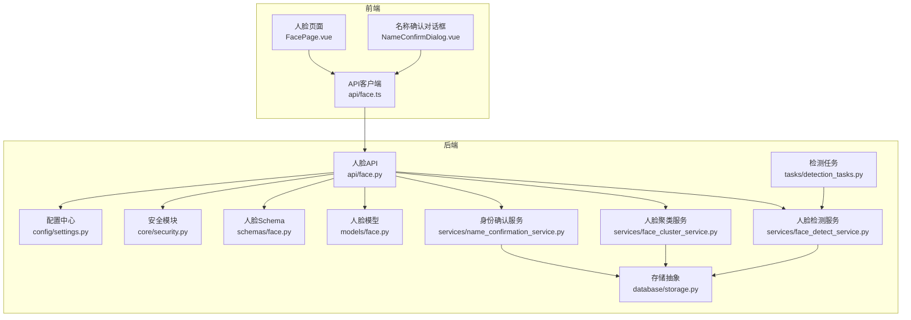
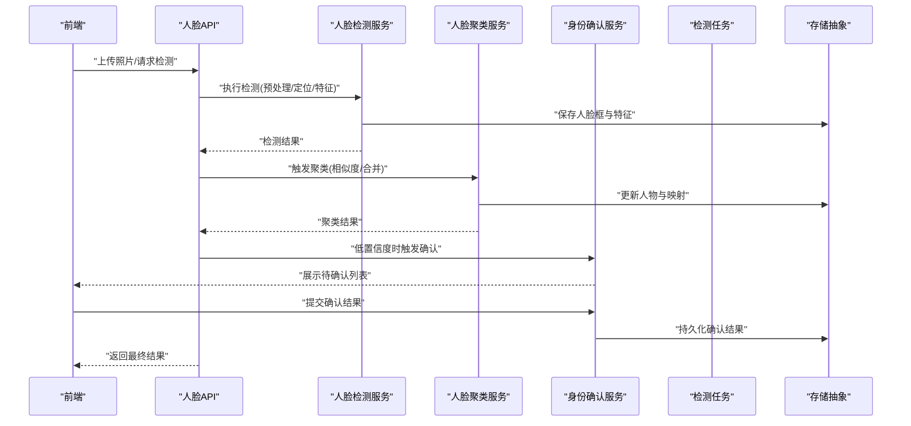
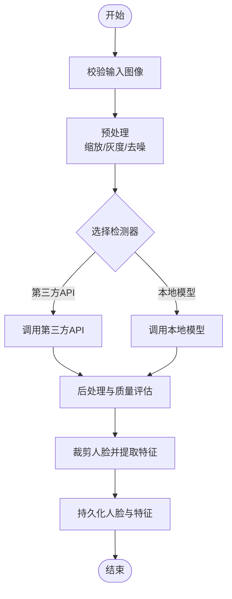
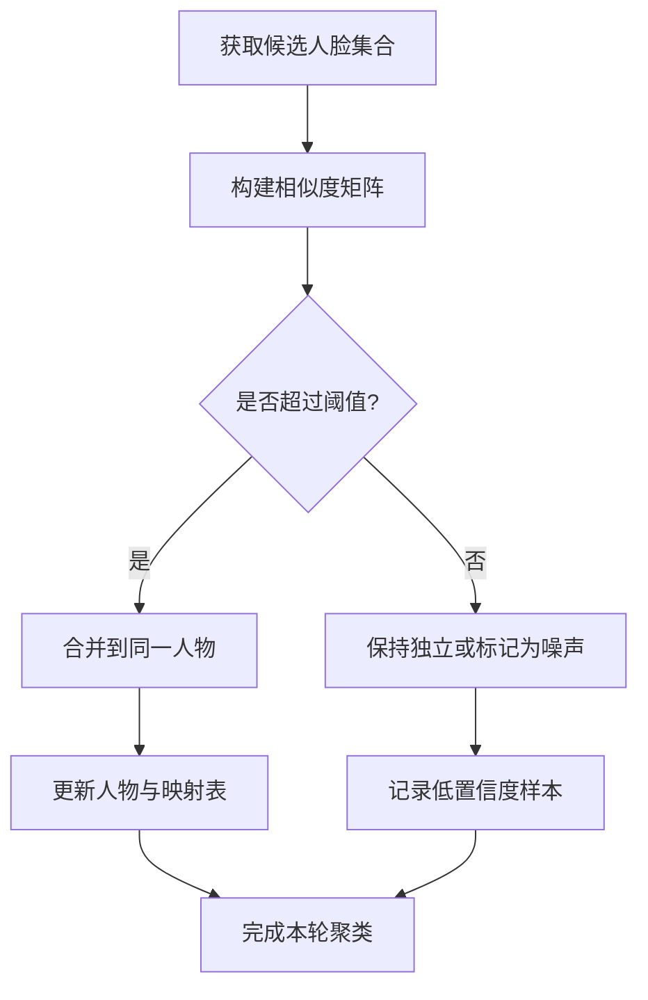
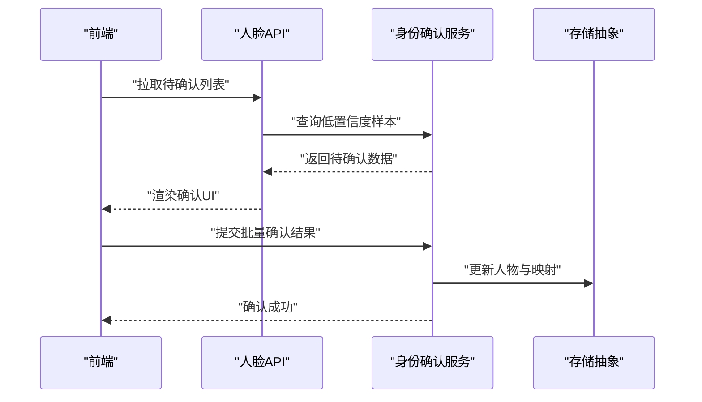
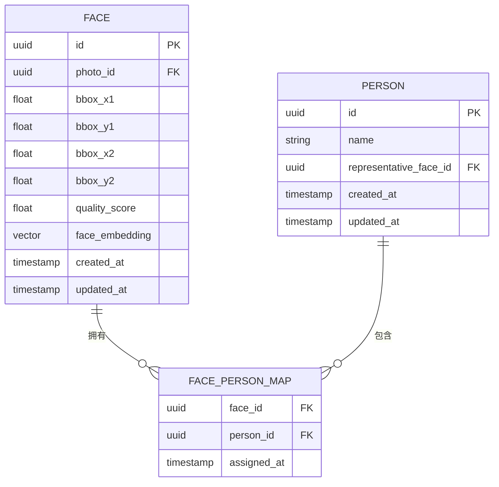
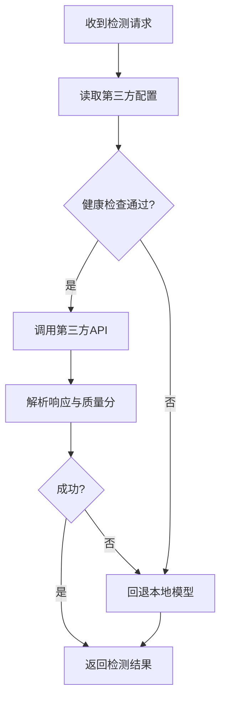
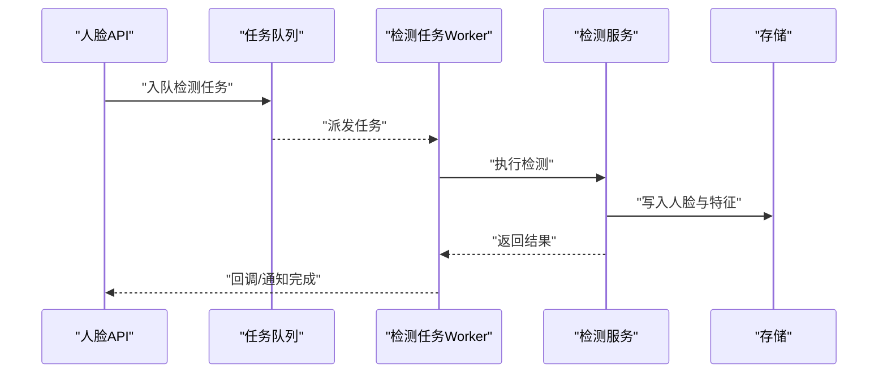
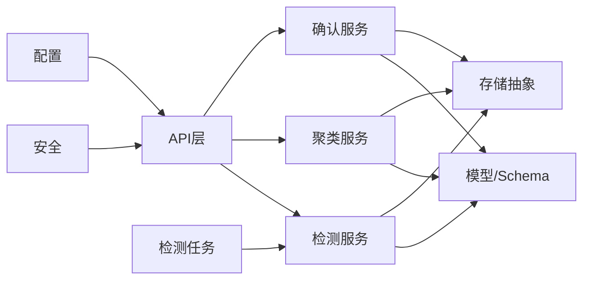

# 人脸识别服务

<cite>
**本文引用的文件**   
- [backend/app/api/face.py](file://backend/app/api/face.py)
- [backend/app/services/face_detect_service.py](file://backend/app/services/face_detect_service.py)
- [backend/app/services/face_cluster_service.py](file://backend/app/services/face_cluster_service.py)
- [backend/app/services/name_confirmation_service.py](file://backend/app/services/name_confirmation_service.py)
- [backend/app/models/face.py](file://backend/app/models/face.py)
- [backend/app/schemas/face.py](file://backend/app/schemas/face.py)
- [backend/app/database/storage.py](file://backend/app/database/storage.py)
- [backend/app/tasks/detection_tasks.py](file://backend/app/tasks/detection_tasks.py)
- [backend/app/core/security.py](file://backend/app/core/security.py)
- [backend/app/config/settings.py](file://backend/app/config/settings.py)
- [frontend/src/components/chat/NameConfirmDialog.vue](file://frontend/src/components/chat/NameConfirmDialog.vue)
- [frontend/src/types/face.ts](file://frontend/src/types/face.ts)
</cite>

## 目录
1. [简介](#简介)
2. [项目结构](#项目结构)
3. [核心组件](#核心组件)
4. [架构总览](#架构总览)
5. [详细组件分析](#详细组件分析)
6. [依赖关系分析](#依赖关系分析)
7. [性能考虑](#性能考虑)
8. [故障排查指南](#故障排查指南)
9. [结论](#结论)
10. [附录](#附录)

## 简介
本文件面向“AI相册”项目中的人脸识别服务，系统性说明以下方面：
- 人脸检测算法的实现原理：图像预处理、人脸定位与特征提取流程
- 人脸聚类算法：配置参数、相似度计算方法与聚类策略
- 身份确认流程：用户交互设计、置信度阈值设置与批量确认机制
- 人脸数据库：存储结构、索引优化与查询性能调优
- 第三方人脸检测API集成：配置项与错误处理方案
- 隐私保护与安全访问控制：数据脱敏、最小权限与审计建议

## 项目结构
本项目采用前后端分离架构。后端基于Python（FastAPI）提供REST API，包含模型定义、服务层、任务调度与数据库访问；前端使用Vue3+TypeScript实现用户界面与交互。

图表来源
- [backend/app/api/face.py](file://backend/app/api/face.py)
- [backend/app/services/face_detect_service.py](file://backend/app/services/face_detect_service.py)
- [backend/app/services/face_cluster_service.py](file://backend/app/services/face_cluster_service.py)
- [backend/app/services/name_confirmation_service.py](file://backend/app/services/name_confirmation_service.py)
- [backend/app/models/face.py](file://backend/app/models/face.py)
- [backend/app/schemas/face.py](file://backend/app/schemas/face.py)
- [backend/app/database/storage.py](file://backend/app/database/storage.py)
- [backend/app/tasks/detection_tasks.py](file://backend/app/tasks/detection_tasks.py)
- [backend/app/core/security.py](file://backend/app/core/security.py)
- [backend/app/config/settings.py](file://backend/app/config/settings.py)
- [frontend/src/components/chat/NameConfirmDialog.vue](file://frontend/src/components/chat/NameConfirmDialog.vue)

章节来源
- [backend/app/api/face.py](file://backend/app/api/face.py)
- [backend/app/services/face_detect_service.py](file://backend/app/services/face_detect_service.py)
- [backend/app/services/face_cluster_service.py](file://backend/app/services/face_cluster_service.py)
- [backend/app/services/name_confirmation_service.py](file://backend/app/services/name_confirmation_service.py)
- [backend/app/models/face.py](file://backend/app/models/face.py)
- [backend/app/schemas/face.py](file://backend/app/schemas/face.py)
- [backend/app/database/storage.py](file://backend/app/database/storage.py)
- [backend/app/tasks/detection_tasks.py](file://backend/app/tasks/detection_tasks.py)
- [backend/app/core/security.py](file://backend/app/core/security.py)
- [backend/app/config/settings.py](file://backend/app/config/settings.py)
- [frontend/src/components/chat/NameConfirmDialog.vue](file://frontend/src/components/chat/NameConfirmDialog.vue)

## 核心组件
- 人脸检测服务：负责图像预处理、人脸定位与特征向量提取，支持本地模型或第三方API回退。
- 人脸聚类服务：对已提取的人脸特征进行相似度计算与聚类，生成“人物”实体并维护映射关系。
- 身份确认服务：在低置信度场景下触发人工确认流程，支持批量确认与结果持久化。
- 人脸API：对外暴露REST接口，聚合上述服务，统一鉴权、限流与日志记录。
- 模型与Schema：定义人脸、人物、任务等数据结构与校验规则。
- 存储抽象：封装对象存储与元数据持久化，屏蔽底层差异。
- 任务系统：异步执行耗时的人脸检测与向量化任务，提升吞吐与稳定性。
- 安全与配置：集中管理密钥、阈值、并发与外部服务地址等配置，并提供鉴权能力。

章节来源
- [backend/app/services/face_detect_service.py](file://backend/app/services/face_detect_service.py)
- [backend/app/services/face_cluster_service.py](file://backend/app/services/face_cluster_service.py)
- [backend/app/services/name_confirmation_service.py](file://backend/app/services/name_confirmation_service.py)
- [backend/app/api/face.py](file://backend/app/api/face.py)
- [backend/app/models/face.py](file://backend/app/models/face.py)
- [backend/app/schemas/face.py](file://backend/app/schemas/face.py)
- [backend/app/database/storage.py](file://backend/app/database/storage.py)
- [backend/app/tasks/detection_tasks.py](file://backend/app/tasks/detection_tasks.py)
- [backend/app/core/security.py](file://backend/app/core/security.py)
- [backend/app/config/settings.py](file://backend/app/config/settings.py)

## 架构总览
整体调用链从前端发起，经API路由进入服务层，必要时通过任务队列异步执行检测与向量化，最终将结果写入存储并返回给前端。

图表来源
- [backend/app/api/face.py](file://backend/app/api/face.py)
- [backend/app/services/face_detect_service.py](file://backend/app/services/face_detect_service.py)
- [backend/app/services/face_cluster_service.py](file://backend/app/services/face_cluster_service.py)
- [backend/app/services/name_confirmation_service.py](file://backend/app/services/name_confirmation_service.py)
- [backend/app/database/storage.py](file://backend/app/database/storage.py)
- [backend/app/tasks/detection_tasks.py](file://backend/app/tasks/detection_tasks.py)

## 详细组件分析

### 人脸检测服务
职责与流程
- 图像预处理：格式校验、尺寸归一化、色彩空间转换、噪声抑制与增强。
- 人脸定位：调用本地检测模型或第三方API，输出人脸边界框与质量评分。
- 特征提取：根据定位结果裁剪人脸区域，提取固定维度的特征向量用于后续聚类与检索。
- 异常与回退：当第三方API不可用时自动回退到本地模型；对低质量输入给出降级策略。

关键要点
- 预处理流水线应保证输入一致性与可复现性，避免尺度与光照差异影响特征稳定性。
- 定位阶段需结合质量评分过滤遮挡严重、模糊或过小的人脸。
- 特征维度应与聚类与检索模块保持一致，便于跨模块复用。

图表来源
- [backend/app/services/face_detect_service.py](file://backend/app/services/face_detect_service.py)
- [backend/app/config/settings.py](file://backend/app/config/settings.py)
- [backend/app/database/storage.py](file://backend/app/database/storage.py)

章节来源
- [backend/app/services/face_detect_service.py](file://backend/app/services/face_detect_service.py)
- [backend/app/config/settings.py](file://backend/app/config/settings.py)
- [backend/app/database/storage.py](file://backend/app/database/storage.py)

### 人脸聚类服务
目标
- 将相似人脸聚合成同一“人物”，减少重复实体，支撑搜索与统计。

核心流程
- 相似度计算：基于特征向量计算余弦相似度或欧氏距离，按阈值判定是否属于同一人。
- 聚类策略：可采用层次聚类、DBSCAN或基于阈值的增量合并策略；对大规模数据建议使用近似最近邻加速。
- 冲突解决：当新人脸与多个现有簇接近时，依据最高相似度或业务规则决定归属；必要时触发人工确认。

配置参数（示例字段，具体以代码为准）
- 相似度阈值：控制“同一个人”的宽松程度。
- 最大簇大小：限制单个人物关联的最大人脸数，防止误合并。
- 最小簇大小：过滤孤立点，作为噪声处理。
- 批量窗口：一次聚类的样本规模，平衡内存与延迟。
- 回退策略：当相似度不确定时，转入确认流程。

图表来源
- [backend/app/services/face_cluster_service.py](file://backend/app/services/face_cluster_service.py)
- [backend/app/config/settings.py](file://backend/app/config/settings.py)
- [backend/app/database/storage.py](file://backend/app/database/storage.py)

章节来源
- [backend/app/services/face_cluster_service.py](file://backend/app/services/face_cluster_service.py)
- [backend/app/config/settings.py](file://backend/app/config/settings.py)
- [backend/app/database/storage.py](file://backend/app/database/storage.py)

### 身份确认服务与用户交互
目标
- 在低置信度或冲突场景下，引导用户进行姓名标注，形成高质量训练与检索数据。

交互流程
- 前端展示待确认的人脸卡片与候选姓名，支持单选/多选与批量操作。
- 用户确认后，服务层将结果持久化，并更新人物映射与相关统计。
- 支持批量确认：一次提交多张人脸的标签，降低交互成本。

图表来源
- [backend/app/services/name_confirmation_service.py](file://backend/app/services/name_confirmation_service.py)
- [backend/app/api/face.py](file://backend/app/api/face.py)
- [backend/app/database/storage.py](file://backend/app/database/storage.py)
- [frontend/src/components/chat/NameConfirmDialog.vue](file://frontend/src/components/chat/NameConfirmDialog.vue)

章节来源
- [backend/app/services/name_confirmation_service.py](file://backend/app/services/name_confirmation_service.py)
- [backend/app/api/face.py](file://backend/app/api/face.py)
- [backend/app/database/storage.py](file://backend/app/database/storage.py)
- [frontend/src/components/chat/NameConfirmDialog.vue](file://frontend/src/components/chat/NameConfirmDialog.vue)

### 人脸数据库与索引优化
存储结构
- 人脸记录：包含图片ID、人脸框坐标、质量分、特征向量、创建时间等。
- 人物实体：唯一标识、代表图、成员人脸集合、创建/更新时间。
- 映射关系：人脸ID到人物ID的多对一映射，支持历史版本与撤销。

索引与查询优化
- 主键与外键：为人脸ID、人物ID建立主键与外键约束，确保一致性。
- 复合索引：针对图片ID+人脸状态、人物ID+更新时间等高频查询建立复合索引。
- 向量索引：对特征向量使用近似最近邻索引（如HNSW/IVF-PQ），显著加速相似检索。
- 冷热分层：近期活跃数据保留热索引，历史数据归档至冷存储，降低查询延迟。
- 分页与投影：只返回必要字段，配合游标分页避免深分页开销。

图表来源
- [backend/app/models/face.py](file://backend/app/models/face.py)
- [backend/app/schemas/face.py](file://backend/app/schemas/face.py)
- [backend/app/database/storage.py](file://backend/app/database/storage.py)

章节来源
- [backend/app/models/face.py](file://backend/app/models/face.py)
- [backend/app/schemas/face.py](file://backend/app/schemas/face.py)
- [backend/app/database/storage.py](file://backend/app/database/storage.py)

### 第三方人脸检测API集成
集成要点
- 配置项：服务地址、认证令牌、超时、重试次数、并发上限、回退开关。
- 健康检查：周期性探测第三方可用性，失败时自动切换本地模型。
- 错误处理：网络异常、鉴权失败、配额超限、超时与解析错误的分类处理与告警。
- 幂等与重试：对检测请求增加幂等键，避免重复计费；指数退避重试。

图表来源
- [backend/app/services/face_detect_service.py](file://backend/app/services/face_detect_service.py)
- [backend/app/config/settings.py](file://backend/app/config/settings.py)

章节来源
- [backend/app/services/face_detect_service.py](file://backend/app/services/face_detect_service.py)
- [backend/app/config/settings.py](file://backend/app/config/settings.py)

### 任务系统与异步处理
职责
- 将耗时的人脸检测与向量化任务放入队列，由工作进程消费，提高吞吐与稳定性。
- 支持任务重试、死信队列与进度回调。

图表来源
- [backend/app/tasks/detection_tasks.py](file://backend/app/tasks/detection_tasks.py)
- [backend/app/services/face_detect_service.py](file://backend/app/services/face_detect_service.py)
- [backend/app/database/storage.py](file://backend/app/database/storage.py)

章节来源
- [backend/app/tasks/detection_tasks.py](file://backend/app/tasks/detection_tasks.py)
- [backend/app/services/face_detect_service.py](file://backend/app/services/face_detect_service.py)
- [backend/app/database/storage.py](file://backend/app/database/storage.py)

## 依赖关系分析
- API层依赖服务层，服务层依赖模型与Schema，并通过存储抽象访问数据。
- 任务系统与服务层解耦，通过消息队列通信，降低耦合度与峰值压力。
- 安全与配置被API层广泛引用，提供统一的鉴权与参数注入。

图表来源
- [backend/app/api/face.py](file://backend/app/api/face.py)
- [backend/app/services/face_detect_service.py](file://backend/app/services/face_detect_service.py)
- [backend/app/services/face_cluster_service.py](file://backend/app/services/face_cluster_service.py)
- [backend/app/services/name_confirmation_service.py](file://backend/app/services/name_confirmation_service.py)
- [backend/app/models/face.py](file://backend/app/models/face.py)
- [backend/app/schemas/face.py](file://backend/app/schemas/face.py)
- [backend/app/database/storage.py](file://backend/app/database/storage.py)
- [backend/app/tasks/detection_tasks.py](file://backend/app/tasks/detection_tasks.py)
- [backend/app/core/security.py](file://backend/app/core/security.py)
- [backend/app/config/settings.py](file://backend/app/config/settings.py)

章节来源
- [backend/app/api/face.py](file://backend/app/api/face.py)
- [backend/app/services/face_detect_service.py](file://backend/app/services/face_detect_service.py)
- [backend/app/services/face_cluster_service.py](file://backend/app/services/face_cluster_service.py)
- [backend/app/services/name_confirmation_service.py](file://backend/app/services/name_confirmation_service.py)
- [backend/app/models/face.py](file://backend/app/models/face.py)
- [backend/app/schemas/face.py](file://backend/app/schemas/face.py)
- [backend/app/database/storage.py](file://backend/app/database/storage.py)
- [backend/app/tasks/detection_tasks.py](file://backend/app/tasks/detection_tasks.py)
- [backend/app/core/security.py](file://backend/app/core/security.py)
- [backend/app/config/settings.py](file://backend/app/config/settings.py)

## 性能考虑
- 预处理并行化：对大图进行分块或缩略图先行检测，再在原图上精修。
- 特征缓存：相同人脸区域避免重复提取，利用哈希或指纹缓存命中。
- 聚类批处理：按时间窗口或数量阈值批量聚类，减少频繁IO。
- 向量检索加速：引入ANN索引，合理设置efSearch/M等参数平衡精度与速度。
- 连接池与并发：数据库与对象存储连接池化，限制并发避免资源耗尽。
- 监控与指标：记录检测耗时、召回率、误报率与队列积压，指导容量规划。

[本节为通用性能建议，不直接分析具体文件]

## 故障排查指南
常见问题与定位步骤
- 第三方API不可用：检查健康检查与回退开关，查看重试与熔断日志。
- 低置信度过高：调整相似度阈值与质量评分下限，观察确认队列变化。
- 聚类不稳定：增大批量窗口或引入更稳健的相似度度量，检查冲突解决策略。
- 查询缓慢：核对复合索引与向量索引命中率，评估分页深度与投影字段。
- 任务堆积：检查工作进程数量、队列长度与消费者CPU/内存占用。

章节来源
- [backend/app/services/face_detect_service.py](file://backend/app/services/face_detect_service.py)
- [backend/app/services/face_cluster_service.py](file://backend/app/services/face_cluster_service.py)
- [backend/app/services/name_confirmation_service.py](file://backend/app/services/name_confirmation_service.py)
- [backend/app/tasks/detection_tasks.py](file://backend/app/tasks/detection_tasks.py)
- [backend/app/config/settings.py](file://backend/app/config/settings.py)

## 结论
该人脸识别服务通过“检测—聚类—确认”的闭环流程，兼顾自动化与人工校正，既满足大规模照片库的高效组织，又保障标注质量。借助任务系统与索引优化，系统在吞吐与延迟之间取得良好平衡。未来可在特征表示学习、主动学习与在线增量聚类方面持续演进。

[本节为总结性内容，不直接分析具体文件]

## 附录

### 身份确认阈值与批量确认建议
- 初始阈值建议：相似度低于某值或质量分低于某值时进入确认队列。
- 批量确认：每次提交不超过一定数量，避免一次性变更过大导致回溯困难。
- 反馈闭环：将确认结果回流到训练与检索，持续提升准确率。

章节来源
- [backend/app/services/name_confirmation_service.py](file://backend/app/services/name_confirmation_service.py)
- [frontend/src/components/chat/NameConfirmDialog.vue](file://frontend/src/components/chat/NameConfirmDialog.vue)
- [frontend/src/types/face.ts](file://frontend/src/types/face.ts)

### 隐私保护与安全访问控制
- 数据最小化：仅采集必要的人脸特征与元数据，明确保留期限与删除策略。
- 传输加密：全链路HTTPS，敏感字段落盘加密。
- 访问控制：基于角色的细粒度权限，API鉴权与IP白名单。
- 审计与合规：记录关键操作日志，支持导出与审计追踪。

章节来源
- [backend/app/core/security.py](file://backend/app/core/security.py)
- [backend/app/config/settings.py](file://backend/app/config/settings.py)