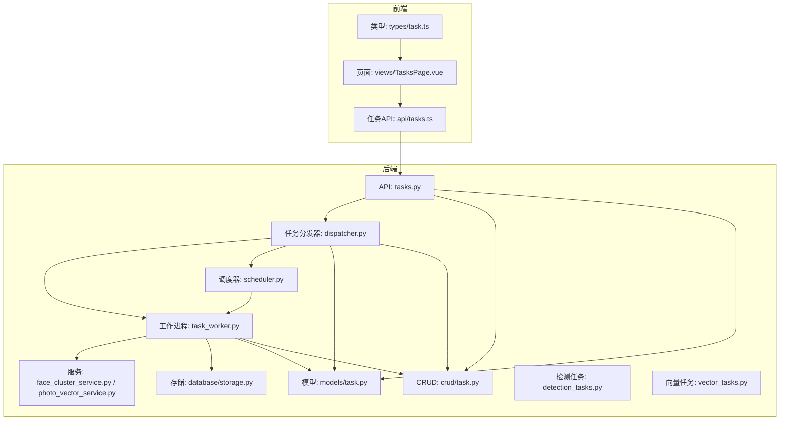
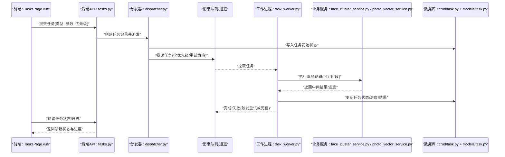
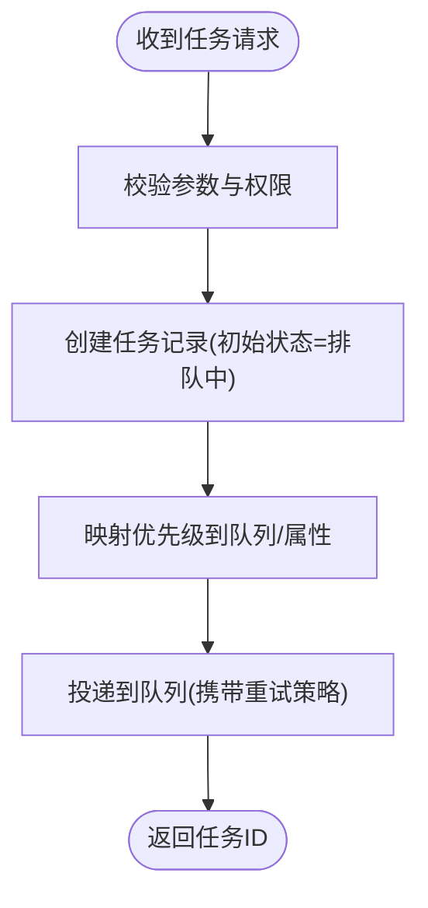
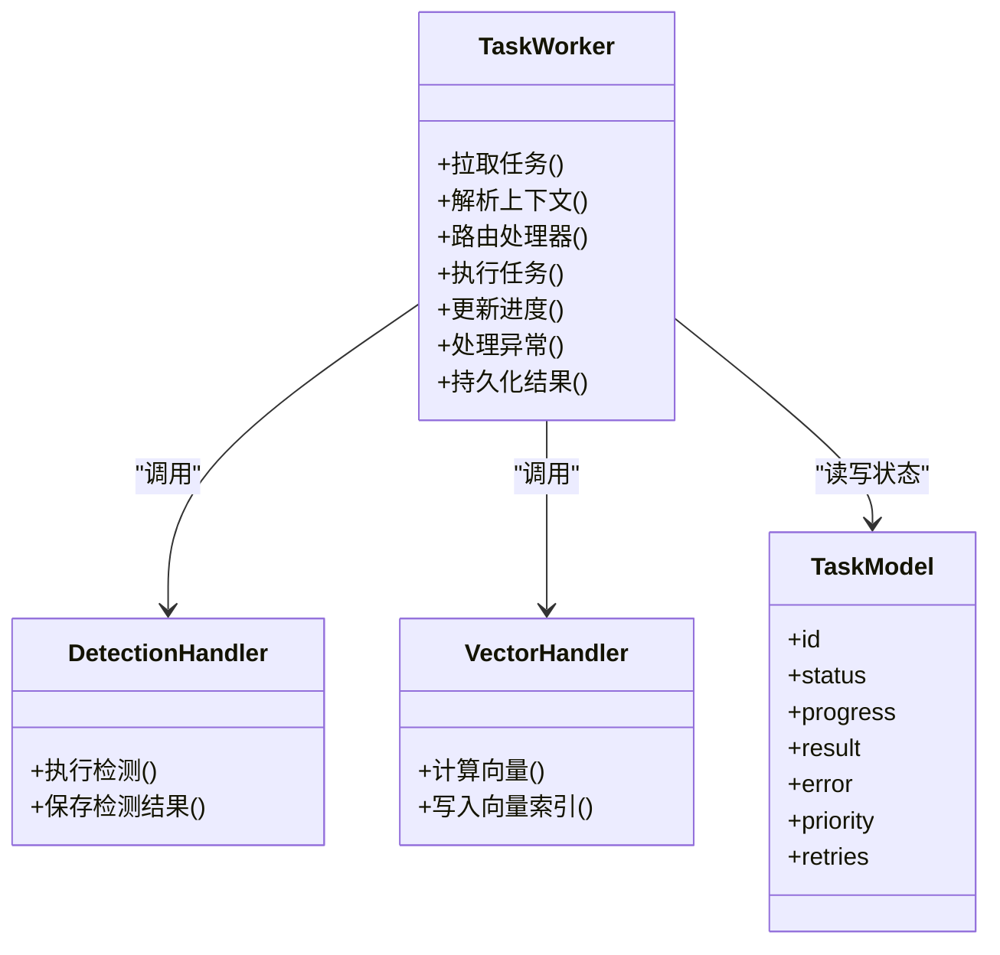
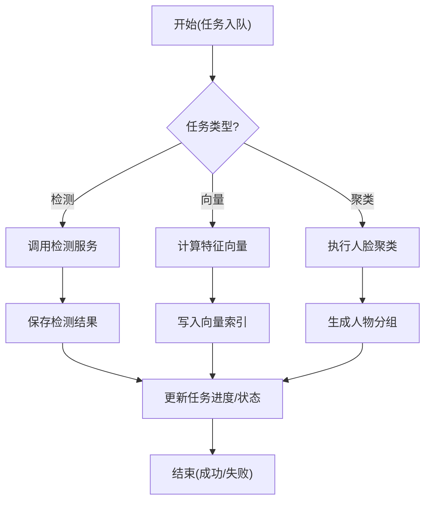
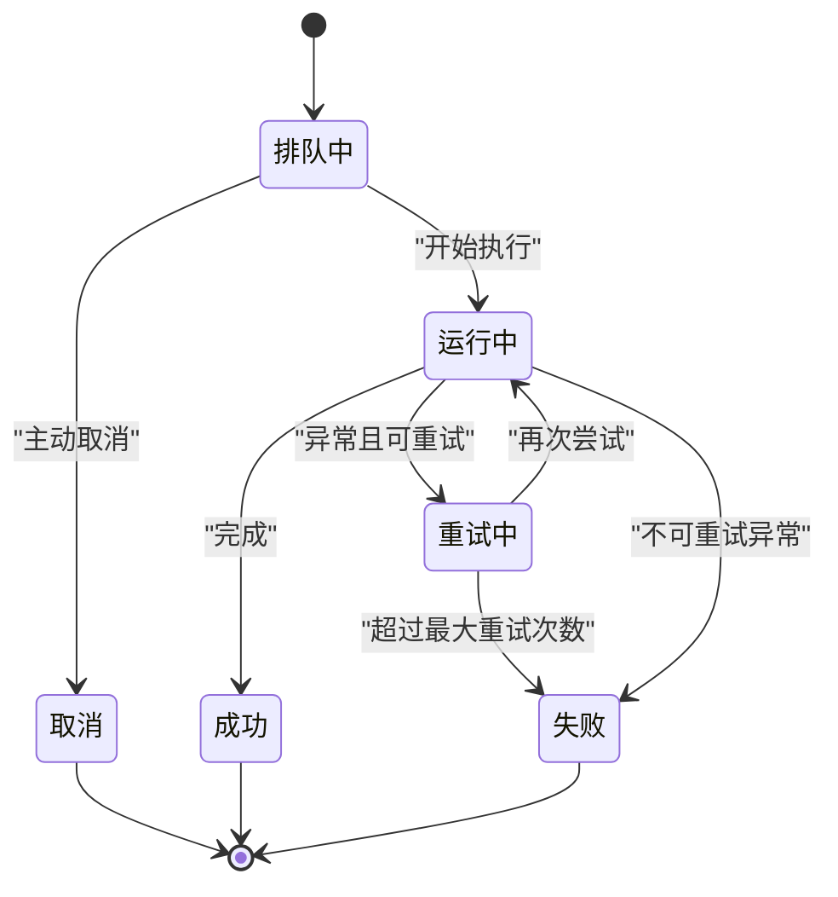
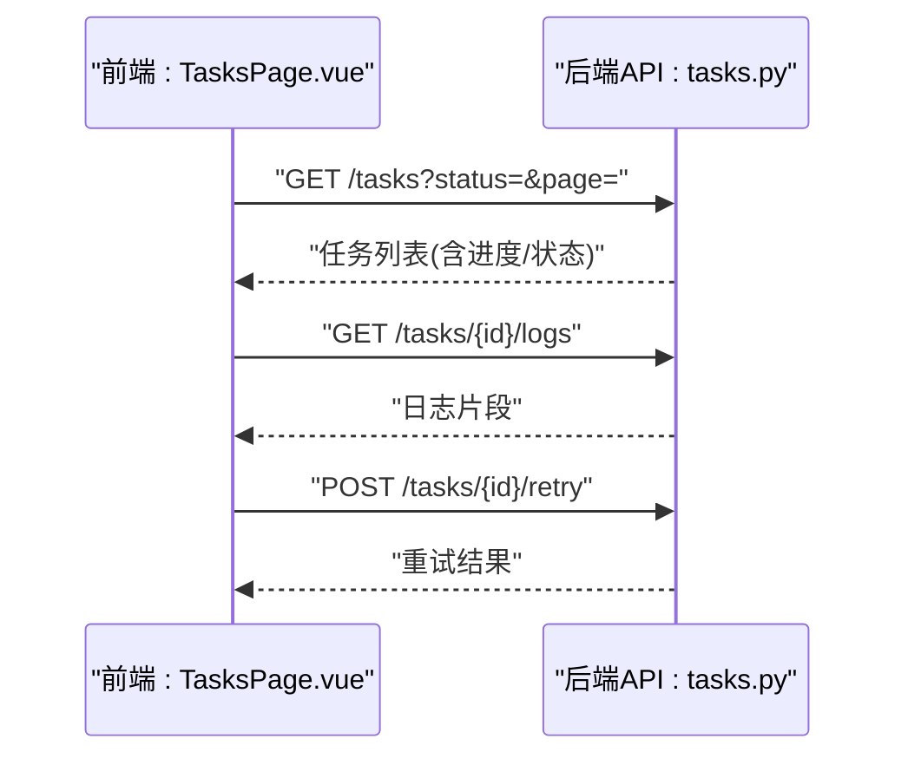
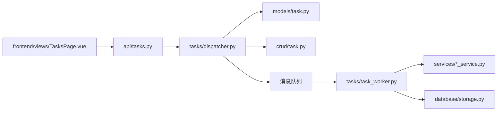

# 异步任务处理

<cite>
**本文引用的文件**   
- [backend/app/tasks/dispatcher.py](file://backend/app/tasks/dispatcher.py)
- [backend/app/tasks/task_worker.py](file://backend/app/tasks/task_worker.py)
- [backend/app/tasks/scheduler.py](file://backend/app/tasks/scheduler.py)
- [backend/app/tasks/detection_tasks.py](file://backend/app/tasks/detection_tasks.py)
- [backend/app/tasks/vector_tasks.py](file://backend/app/tasks/vector_tasks.py)
- [backend/app/api/tasks.py](file://backend/app/api/tasks.py)
- [backend/app/crud/task.py](file://backend/app/crud/task.py)
- [backend/app/models/task.py](file://backend/app/models/task.py)
- [backend/app/schemas/task.py](file://backend/app/schemas/task.py)
- [backend/app/services/face_cluster_service.py](file://backend/app/services/face_cluster_service.py)
- [backend/app/services/photo_vector_service.py](file://backend/app/services/photo_vector_service.py)
- [backend/app/database/storage.py](file://backend/app/database/storage.py)
- [frontend/src/types/task.ts](file://frontend/src/types/task.ts)
- [frontend/src/views/TasksPage.vue](file://frontend/src/views/TasksPage.vue)
- [frontend/src/api/tasks.ts](file://frontend/src/api/tasks.ts)
</cite>

## 目录
1. [简介](#简介)
2. [项目结构](#项目结构)
3. [核心组件](#核心组件)
4. [架构总览](#架构总览)
5. [详细组件分析](#详细组件分析)
6. [依赖关系分析](#依赖关系分析)
7. [性能考虑](#性能考虑)
8. [故障排查指南](#故障排查指南)
9. [结论](#结论)
10. [附录](#附录)

## 简介
本文件围绕项目的异步任务处理体系进行系统化说明，重点覆盖以下方面：
- Celery 任务队列的配置与管理（任务分发器、调度器与工作进程的协调）
- AI 分析任务的类型定义、执行流程与状态跟踪
- 任务优先级管理、重试机制与错误恢复策略
- 任务监控界面的实现（进度显示、日志查看、异常告警）
- 任务性能优化最佳实践（并发控制、内存管理与资源清理）
- 分布式部署的任务同步与数据一致性保证方案

## 项目结构
后端采用分层设计，异步任务相关代码集中在 backend/app/tasks 目录，API 层通过路由暴露任务提交与查询接口，CRUD 与模型负责持久化任务元数据，前端提供任务监控页面。

图表来源
- [backend/app/api/tasks.py](file://backend/app/api/tasks.py)
- [backend/app/tasks/dispatcher.py](file://backend/app/tasks/dispatcher.py)
- [backend/app/tasks/task_worker.py](file://backend/app/tasks/task_worker.py)
- [backend/app/tasks/scheduler.py](file://backend/app/tasks/scheduler.py)
- [backend/app/models/task.py](file://backend/app/models/task.py)
- [backend/app/crud/task.py](file://backend/app/crud/task.py)
- [backend/app/database/storage.py](file://backend/app/database/storage.py)
- [backend/app/services/face_cluster_service.py](file://backend/app/services/face_cluster_service.py)
- [backend/app/services/photo_vector_service.py](file://backend/app/services/photo_vector_service.py)
- [backend/app/tasks/detection_tasks.py](file://backend/app/tasks/detection_tasks.py)
- [backend/app/tasks/vector_tasks.py](file://backend/app/tasks/vector_tasks.py)
- [frontend/src/api/tasks.ts](file://frontend/src/api/tasks.ts)
- [frontend/src/types/task.ts](file://frontend/src/types/task.ts)
- [frontend/src/views/TasksPage.vue](file://frontend/src/views/TasksPage.vue)

章节来源
- [backend/app/tasks/dispatcher.py](file://backend/app/tasks/dispatcher.py)
- [backend/app/tasks/task_worker.py](file://backend/app/tasks/task_worker.py)
- [backend/app/tasks/scheduler.py](file://backend/app/tasks/scheduler.py)
- [backend/app/tasks/detection_tasks.py](file://backend/app/tasks/detection_tasks.py)
- [backend/app/tasks/vector_tasks.py](file://backend/app/tasks/vector_tasks.py)
- [backend/app/api/tasks.py](file://backend/app/api/tasks.py)
- [backend/app/crud/task.py](file://backend/app/crud/task.py)
- [backend/app/models/task.py](file://backend/app/models/task.py)
- [backend/app/schemas/task.py](file://backend/app/schemas/task.py)
- [backend/app/services/face_cluster_service.py](file://backend/app/services/face_cluster_service.py)
- [backend/app/services/photo_vector_service.py](file://backend/app/services/photo_vector_service.py)
- [backend/app/database/storage.py](file://backend/app/database/storage.py)
- [frontend/src/types/task.ts](file://frontend/src/types/task.ts)
- [frontend/src/views/TasksPage.vue](file://frontend/src/views/TasksPage.vue)
- [frontend/src/api/tasks.ts](file://frontend/src/api/tasks.ts)

## 核心组件
- 任务分发器：负责接收来自 API 的任务请求，校验参数、创建任务记录、设置优先级与重试策略，并将任务投递到消息队列或本地执行通道。
- 工作进程：从队列拉取任务，加载上下文，调用具体业务服务（人脸聚类、向量化等），更新任务状态与结果，并处理异常与重试。
- 调度器：定时触发周期性任务（如批量扫描、索引重建），按策略将任务入队。
- 任务模型与CRUD：统一任务生命周期状态机、扩展字段（优先级、重试次数、错误信息、进度等）的持久化。
- 业务服务：封装 AI 能力（人脸聚类、向量检索等），被工作进程按需调用。
- 前端监控：提供任务列表、详情、进度条、日志输出与异常告警展示。

章节来源
- [backend/app/tasks/dispatcher.py](file://backend/app/tasks/dispatcher.py)
- [backend/app/tasks/task_worker.py](file://backend/app/tasks/task_worker.py)
- [backend/app/tasks/scheduler.py](file://backend/app/tasks/scheduler.py)
- [backend/app/models/task.py](file://backend/app/models/task.py)
- [backend/app/crud/task.py](file://backend/app/crud/task.py)
- [backend/app/services/face_cluster_service.py](file://backend/app/services/face_cluster_service.py)
- [backend/app/services/photo_vector_service.py](file://backend/app/services/photo_vector_service.py)
- [frontend/src/views/TasksPage.vue](file://frontend/src/views/TasksPage.vue)

## 架构总览
下图展示了从前端发起任务到后端执行、状态回写与前端轮询更新的完整链路。

图表来源
- [backend/app/api/tasks.py](file://backend/app/api/tasks.py)
- [backend/app/tasks/dispatcher.py](file://backend/app/tasks/dispatcher.py)
- [backend/app/tasks/task_worker.py](file://backend/app/tasks/task_worker.py)
- [backend/app/services/face_cluster_service.py](file://backend/app/services/face_cluster_service.py)
- [backend/app/services/photo_vector_service.py](file://backend/app/services/photo_vector_service.py)
- [backend/app/crud/task.py](file://backend/app/crud/task.py)
- [backend/app/models/task.py](file://backend/app/models/task.py)
- [frontend/src/views/TasksPage.vue](file://frontend/src/views/TasksPage.vue)

## 详细组件分析

### 任务分发器（dispatcher.py）
职责
- 解析 API 传入的任务参数，生成唯一任务标识
- 根据任务类型选择目标队列与路由键
- 设置任务优先级、重试策略、超时与幂等键
- 在数据库中创建任务记录，初始状态为“排队中”
- 将任务投递至队列或本地执行通道

关键设计点
- 优先级映射：将高层优先级数值映射到队列级别或任务属性
- 幂等性：基于业务主键生成幂等键，避免重复提交导致重复执行
- 可扩展性：新增任务类型仅需注册路由与处理器

图表来源
- [backend/app/tasks/dispatcher.py](file://backend/app/tasks/dispatcher.py)
- [backend/app/models/task.py](file://backend/app/models/task.py)
- [backend/app/crud/task.py](file://backend/app/crud/task.py)

章节来源
- [backend/app/tasks/dispatcher.py](file://backend/app/tasks/dispatcher.py)
- [backend/app/models/task.py](file://backend/app/models/task.py)
- [backend/app/crud/task.py](file://backend/app/crud/task.py)

### 工作进程（task_worker.py）
职责
- 从队列拉取任务，反序列化上下文
- 根据任务类型路由到对应处理器（检测、向量等）
- 分阶段更新任务进度与中间结果
- 捕获异常，按策略重试或标记失败
- 完成后持久化最终结果与日志摘要

关键设计点
- 进度上报：支持阶段性进度更新，便于前端展示
- 重试与退避：指数退避、最大重试次数、失败后进入死信队列
- 资源管理：大对象临时文件清理、连接池释放、GPU/CPU 资源回收

图表来源
- [backend/app/tasks/task_worker.py](file://backend/app/tasks/task_worker.py)
- [backend/app/tasks/detection_tasks.py](file://backend/app/tasks/detection_tasks.py)
- [backend/app/tasks/vector_tasks.py](file://backend/app/tasks/vector_tasks.py)
- [backend/app/models/task.py](file://backend/app/models/task.py)

章节来源
- [backend/app/tasks/task_worker.py](file://backend/app/tasks/task_worker.py)
- [backend/app/tasks/detection_tasks.py](file://backend/app/tasks/detection_tasks.py)
- [backend/app/tasks/vector_tasks.py](file://backend/app/tasks/vector_tasks.py)
- [backend/app/models/task.py](file://backend/app/models/task.py)

### 调度器（scheduler.py）
职责
- 定时触发周期性任务（如全量扫描、索引重建、过期清理）
- 将周期任务转换为普通任务入队，复用统一的执行与监控体系

关键设计点
- 时间窗口与去重：避免同一周期内重复触发
- 任务拆分：将大批量任务拆分为子任务，提升并行度

章节来源
- [backend/app/tasks/scheduler.py](file://backend/app/tasks/scheduler.py)

### AI 分析任务类型与执行流程
- 检测类任务：对图片进行人脸/物体/场景检测，产出结构化结果并落库
- 向量类任务：计算图片特征向量，写入向量索引以支持语义检索
- 人脸聚类任务：基于人脸特征进行聚类，生成人物分组与标签

图表来源
- [backend/app/tasks/detection_tasks.py](file://backend/app/tasks/detection_tasks.py)
- [backend/app/tasks/vector_tasks.py](file://backend/app/tasks/vector_tasks.py)
- [backend/app/services/face_cluster_service.py](file://backend/app/services/face_cluster_service.py)
- [backend/app/services/photo_vector_service.py](file://backend/app/services/photo_vector_service.py)

章节来源
- [backend/app/tasks/detection_tasks.py](file://backend/app/tasks/detection_tasks.py)
- [backend/app/tasks/vector_tasks.py](file://backend/app/tasks/vector_tasks.py)
- [backend/app/services/face_cluster_service.py](file://backend/app/services/face_cluster_service.py)
- [backend/app/services/photo_vector_service.py](file://backend/app/services/photo_vector_service.py)

### 任务模型与状态机（models/task.py + crud/task.py）
- 状态枚举：排队中、运行中、成功、失败、重试中、取消
- 进度字段：百分比与阶段描述
- 重试字段：已重试次数、下次重试时间
- 结果与错误：结构化结果与错误堆栈摘要
- 幂等键：用于防止重复提交

图表来源
- [backend/app/models/task.py](file://backend/app/models/task.py)
- [backend/app/crud/task.py](file://backend/app/crud/task.py)

章节来源
- [backend/app/models/task.py](file://backend/app/models/task.py)
- [backend/app/crud/task.py](file://backend/app/crud/task.py)

### 任务优先级与重试机制
- 优先级：通过不同队列或任务属性控制执行顺序，高优先级优先出队
- 重试：指数退避、最大重试次数、失败分类（可重试/不可重试）
- 死信：多次失败后进入死信队列，便于人工介入与审计

章节来源
- [backend/app/tasks/dispatcher.py](file://backend/app/tasks/dispatcher.py)
- [backend/app/tasks/task_worker.py](file://backend/app/tasks/task_worker.py)
- [backend/app/models/task.py](file://backend/app/models/task.py)

### 任务监控界面（前端）
- 任务列表：按状态筛选、排序、分页
- 任务详情：进度条、阶段日志、错误信息
- 实时刷新：短轮询或长连接获取最新状态
- 告警提示：失败任务高亮、一键重试入口

图表来源
- [frontend/src/views/TasksPage.vue](file://frontend/src/views/TasksPage.vue)
- [frontend/src/api/tasks.ts](file://frontend/src/api/tasks.ts)
- [backend/app/api/tasks.py](file://backend/app/api/tasks.py)

章节来源
- [frontend/src/views/TasksPage.vue](file://frontend/src/views/TasksPage.vue)
- [frontend/src/api/tasks.ts](file://frontend/src/api/tasks.ts)
- [frontend/src/types/task.ts](file://frontend/src/types/task.ts)
- [backend/app/api/tasks.py](file://backend/app/api/tasks.py)

## 依赖关系分析
- API 层依赖分发器与 CRUD；分发器依赖模型与队列；工作进程依赖业务服务与存储；前端依赖 API 与类型定义。
- 潜在循环依赖：确保分发器不直接依赖工作进程，仅通过队列交互；服务层不反向依赖任务层。

图表来源
- [backend/app/api/tasks.py](file://backend/app/api/tasks.py)
- [backend/app/tasks/dispatcher.py](file://backend/app/tasks/dispatcher.py)
- [backend/app/tasks/task_worker.py](file://backend/app/tasks/task_worker.py)
- [backend/app/models/task.py](file://backend/app/models/task.py)
- [backend/app/crud/task.py](file://backend/app/crud/task.py)
- [backend/app/database/storage.py](file://backend/app/database/storage.py)
- [backend/app/services/face_cluster_service.py](file://backend/app/services/face_cluster_service.py)
- [backend/app/services/photo_vector_service.py](file://backend/app/services/photo_vector_service.py)
- [frontend/src/views/TasksPage.vue](file://frontend/src/views/TasksPage.vue)

章节来源
- [backend/app/api/tasks.py](file://backend/app/api/tasks.py)
- [backend/app/tasks/dispatcher.py](file://backend/app/tasks/dispatcher.py)
- [backend/app/tasks/task_worker.py](file://backend/app/tasks/task_worker.py)
- [backend/app/models/task.py](file://backend/app/models/task.py)
- [backend/app/crud/task.py](file://backend/app/crud/task.py)
- [backend/app/database/storage.py](file://backend/app/database/storage.py)
- [backend/app/services/face_cluster_service.py](file://backend/app/services/face_cluster_service.py)
- [backend/app/services/photo_vector_service.py](file://backend/app/services/photo_vector_service.py)
- [frontend/src/views/TasksPage.vue](file://frontend/src/views/TasksPage.vue)

## 性能考虑
- 并发控制
  - 合理配置工作进程数与每进程并发度，避免 CPU/GPU 争用
  - 使用队列分区与路由键隔离热点任务
- 内存管理
  - 大对象流式处理，避免一次性加载全部数据
  - 及时释放临时文件与连接，定期 GC
- 资源清理
  - 任务完成后显式关闭外部资源（模型句柄、索引连接）
  - 失败任务保留必要上下文以便复现
- 批处理与拆分
  - 将大批量任务拆分为子任务，提高吞吐与容错性
- 缓存与索引
  - 对频繁读取的元数据加缓存，减少数据库压力
  - 向量索引增量更新，避免全量重建

[本节为通用指导，无需特定文件引用]

## 故障排查指南
- 常见问题定位
  - 任务长时间处于“排队中”：检查队列消费者数量与优先级配置
  - 任务反复重试：查看错误分类与退避策略，确认是否可重试
  - 内存溢出：检查是否存在大对象未释放或批量过大
- 日志与追踪
  - 任务级日志聚合，包含输入摘要、阶段耗时与异常堆栈
  - 关键路径埋点，便于性能分析与瓶颈定位
- 恢复策略
  - 失败任务一键重试，支持选择性重试
  - 死信任务导出与离线分析

章节来源
- [backend/app/tasks/task_worker.py](file://backend/app/tasks/task_worker.py)
- [backend/app/models/task.py](file://backend/app/models/task.py)
- [backend/app/crud/task.py](file://backend/app/crud/task.py)

## 结论
本异步任务体系通过清晰的分层与职责划分，实现了高内聚、低耦合的任务编排与执行。借助统一的状态机、优先级与重试机制，以及完善的前端监控，系统具备良好的可观测性与可维护性。在生产环境中，建议结合业务负载特性调优并发与资源策略，并建立完善的告警与回滚预案。

[本节为总结性内容，无需特定文件引用]

## 附录
- 任务类型注册与扩展：新增任务类型时，需在分发器注册路由并在工作进程中实现处理器
- 幂等与去重：基于业务主键生成幂等键，避免重复提交
- 分布式一致性：跨节点共享任务状态与结果，确保最终一致

[本节为补充说明，无需特定文件引用]