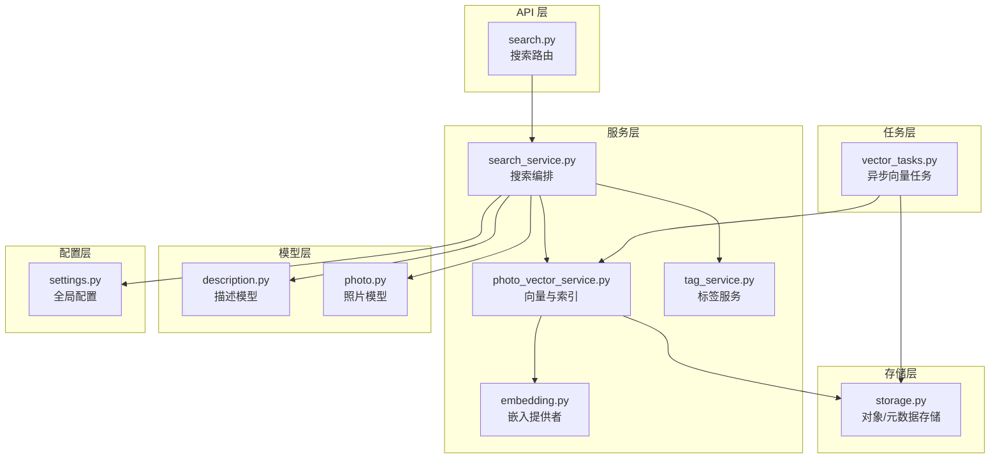
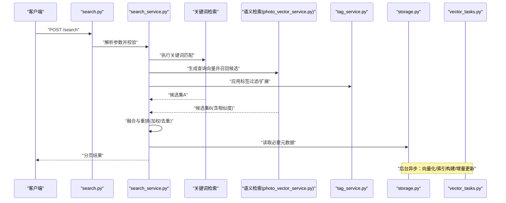
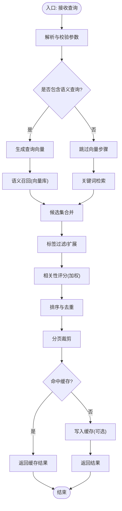
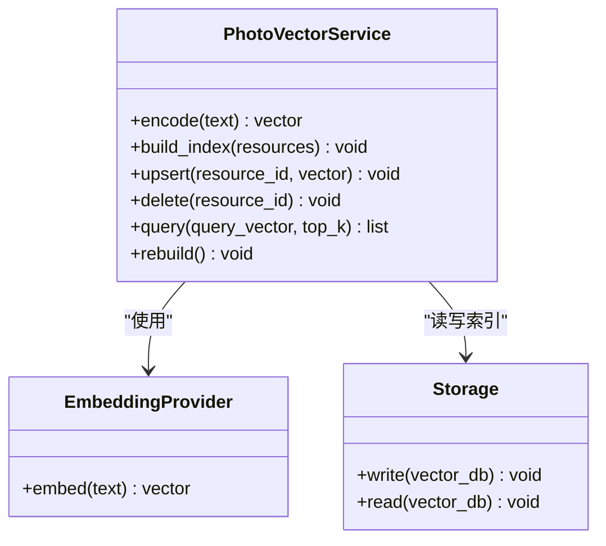
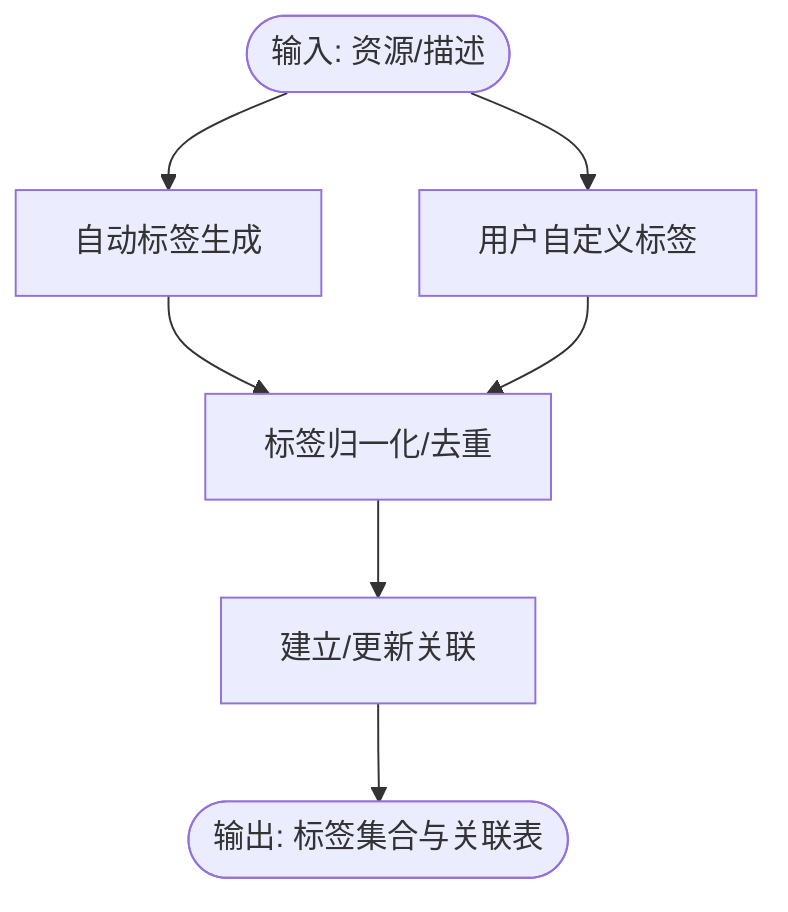
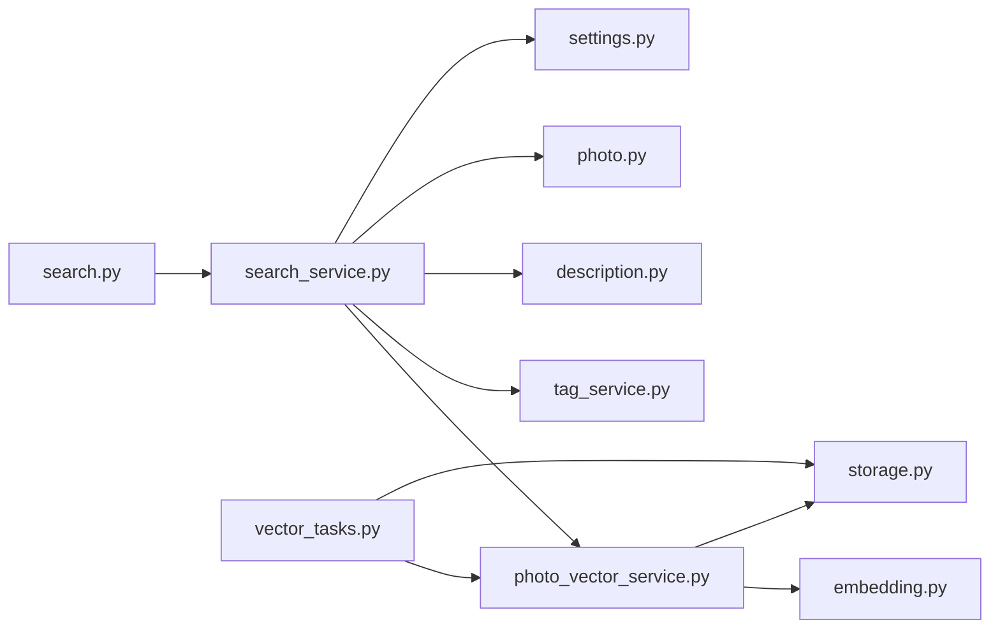

# 语义搜索服务

<cite>
**本文引用的文件**   
- [backend/app/api/search.py](file://backend/app/api/search.py)
- [backend/app/services/search_service.py](file://backend/app/services/search_service.py)
- [backend/app/services/photo_vector_service.py](file://backend/app/services/photo_vector_service.py)
- [backend/app/services/tag_service.py](file://backend/app/services/tag_service.py)
- [backend/app/services/ai_providers/embedding.py](file://backend/app/services/ai_providers/embedding.py)
- [backend/app/models/description.py](file://backend/app/models/description.py)
- [backend/app/models/photo.py](file://backend/app/models/photo.py)
- [backend/app/database/storage.py](file://backend/app/database/storage.py)
- [backend/app/tasks/vector_tasks.py](file://backend/app/tasks/vector_tasks.py)
- [backend/app/config/settings.py](file://backend/app/config/settings.py)
- [backend/app/schemas/response.py](file://backend/app/schemas/response.py)
</cite>

## 目录
1. [简介](#简介)
2. [项目结构](#项目结构)
3. [核心组件](#核心组件)
4. [架构总览](#架构总览)
5. [详细组件分析](#详细组件分析)
6. [依赖关系分析](#依赖关系分析)
7. [性能考量](#性能考量)
8. [故障排查指南](#故障排查指南)
9. [结论](#结论)
10. [附录](#附录)

## 简介
本文件面向“语义搜索服务”的完整设计与实现，覆盖向量检索系统的关键环节：文本向量化、图片描述生成与索引构建、混合搜索策略（关键词匹配+语义相似度）、排序与相关性评分、分页优化、标签系统设计（自动标签、用户自定义标签、关联关系）、向量数据库配置与索引参数调优、查询性能监控、缓存策略与增量更新机制。文档以代码级事实为依据，辅以架构图与时序图帮助理解。

## 项目结构
后端采用分层架构：API 层暴露接口，服务层封装业务逻辑，模型层定义数据实体，存储层对接持久化与对象存储，任务层负责异步处理（如向量计算与索引构建），配置层集中管理参数。

图表来源
- [backend/app/api/search.py](file://backend/app/api/search.py)
- [backend/app/services/search_service.py](file://backend/app/services/search_service.py)
- [backend/app/services/photo_vector_service.py](file://backend/app/services/photo_vector_service.py)
- [backend/app/services/tag_service.py](file://backend/app/services/tag_service.py)
- [backend/app/services/ai_providers/embedding.py](file://backend/app/services/ai_providers/embedding.py)
- [backend/app/models/description.py](file://backend/app/models/description.py)
- [backend/app/models/photo.py](file://backend/app/models/photo.py)
- [backend/app/database/storage.py](file://backend/app/database/storage.py)
- [backend/app/tasks/vector_tasks.py](file://backend/app/tasks/vector_tasks.py)
- [backend/app/config/settings.py](file://backend/app/config/settings.py)

章节来源
- [backend/app/api/search.py](file://backend/app/api/search.py)
- [backend/app/services/search_service.py](file://backend/app/services/search_service.py)
- [backend/app/services/photo_vector_service.py](file://backend/app/services/photo_vector_service.py)
- [backend/app/services/tag_service.py](file://backend/app/services/tag_service.py)
- [backend/app/services/ai_providers/embedding.py](file://backend/app/services/ai_providers/embedding.py)
- [backend/app/models/description.py](file://backend/app/models/description.py)
- [backend/app/models/photo.py](file://backend/app/models/photo.py)
- [backend/app/database/storage.py](file://backend/app/database/storage.py)
- [backend/app/tasks/vector_tasks.py](file://backend/app/tasks/vector_tasks.py)
- [backend/app/config/settings.py](file://backend/app/config/settings.py)

## 核心组件
- 搜索编排服务：统一接收查询请求，协调关键词检索、语义检索、标签过滤、结果合并与排序、分页返回。
- 向量与索引服务：负责文本/图片描述的向量化、向量索引的构建与维护、相似性检索。
- 标签服务：提供自动标签生成、用户自定义标签管理与标签-资源关联。
- 嵌入提供者：封装外部或本地嵌入模型调用，输出稳定维度的向量。
- 描述模型：承载图片描述文本，作为语义检索的重要信号源。
- 存储层：负责媒体与元数据的持久化，以及向量索引的底层存储。
- 任务层：异步执行耗时任务（如批量向量化、索引重建）。
- 配置层：集中管理向量库连接、索引参数、权重等可调项。

章节来源
- [backend/app/services/search_service.py](file://backend/app/services/search_service.py)
- [backend/app/services/photo_vector_service.py](file://backend/app/services/photo_vector_service.py)
- [backend/app/services/tag_service.py](file://backend/app/services/tag_service.py)
- [backend/app/services/ai_providers/embedding.py](file://backend/app/services/ai_providers/embedding.py)
- [backend/app/models/description.py](file://backend/app/models/description.py)
- [backend/app/database/storage.py](file://backend/app/database/storage.py)
- [backend/app/tasks/vector_tasks.py](file://backend/app/tasks/vector_tasks.py)
- [backend/app/config/settings.py](file://backend/app/config/settings.py)

## 架构总览
下图展示一次典型“语义搜索”请求的处理流程：从 API 进入，经搜索编排，并行触发关键词与语义检索，再结合标签过滤、排序与分页，最终返回结果。

图表来源
- [backend/app/api/search.py](file://backend/app/api/search.py)
- [backend/app/services/search_service.py](file://backend/app/services/search_service.py)
- [backend/app/services/photo_vector_service.py](file://backend/app/services/photo_vector_service.py)
- [backend/app/services/tag_service.py](file://backend/app/services/tag_service.py)
- [backend/app/database/storage.py](file://backend/app/database/storage.py)
- [backend/app/tasks/vector_tasks.py](file://backend/app/tasks/vector_tasks.py)

## 详细组件分析

### 搜索编排服务（search_service）
职责
- 解析查询参数（关键词、语义词、标签、时间范围、分页等）。
- 并行发起关键词检索与语义检索，收集候选集。
- 基于权重分配算法进行融合与重排，支持多信号组合（关键词命中、语义相似度、标签匹配度、时间衰减等）。
- 执行分页与字段裁剪，返回标准化响应。

关键流程
- 参数校验与规范化
- 并发检索与聚合
- 相关性评分与排序
- 分页与缓存键生成

图表来源
- [backend/app/services/search_service.py](file://backend/app/services/search_service.py)
- [backend/app/services/photo_vector_service.py](file://backend/app/services/photo_vector_service.py)
- [backend/app/services/tag_service.py](file://backend/app/services/tag_service.py)
- [backend/app/database/storage.py](file://backend/app/database/storage.py)

章节来源
- [backend/app/services/search_service.py](file://backend/app/services/search_service.py)

### 向量与索引服务（photo_vector_service）
职责
- 文本/图片描述向量化：调用嵌入提供者获取固定维度向量。
- 索引构建与维护：将向量与资源ID映射写入向量数据库；支持增量更新与全量重建。
- 相似性检索：根据查询向量召回Top-K候选，返回相似度分数。

关键能力
- 向量化流水线：清洗文本、分块（可选）、编码为向量。
- 索引参数：维度、度量方式、索引类型、HNSW/IVF 等参数。
- 增量更新：按资源变更事件触发单条/批量插入与删除。
- 查询优化：预取元数据、限制返回字段、控制K值。

图表来源
- [backend/app/services/photo_vector_service.py](file://backend/app/services/photo_vector_service.py)
- [backend/app/services/ai_providers/embedding.py](file://backend/app/services/ai_providers/embedding.py)
- [backend/app/database/storage.py](file://backend/app/database/storage.py)

章节来源
- [backend/app/services/photo_vector_service.py](file://backend/app/services/photo_vector_service.py)
- [backend/app/services/ai_providers/embedding.py](file://backend/app/services/ai_providers/embedding.py)
- [backend/app/database/storage.py](file://backend/app/database/storage.py)

### 标签服务（tag_service）
职责
- 自动标签生成：基于描述文本或检测模型输出，抽取/归一化标签。
- 用户自定义标签：允许用户创建、编辑、删除标签。
- 标签关联：维护标签与资源的关联关系，支持一对多与多对多。

设计要点
- 标签命名规范与同义词归一化。
- 冲突解决：自动标签与用户标签优先级策略。
- 批量操作与事务一致性。

图表来源
- [backend/app/services/tag_service.py](file://backend/app/services/tag_service.py)
- [backend/app/models/description.py](file://backend/app/models/description.py)

章节来源
- [backend/app/services/tag_service.py](file://backend/app/services/tag_service.py)
- [backend/app/models/description.py](file://backend/app/models/description.py)

### 嵌入提供者（embedding）
职责
- 对外部或本地嵌入模型的统一封装，提供稳定的向量输出接口。
- 支持批处理、重试与超时控制。
- 可插拔：通过配置切换不同提供商。

章节来源
- [backend/app/services/ai_providers/embedding.py](file://backend/app/services/ai_providers/embedding.py)

### 描述模型（description）
职责
- 存储图片描述文本，作为语义检索的核心文本信号。
- 与资源主键关联，支持版本化与历史回溯。

章节来源
- [backend/app/models/description.py](file://backend/app/models/description.py)

### 任务层（vector_tasks）
职责
- 异步执行耗时任务：批量向量化、索引重建、增量更新。
- 失败重试与幂等保证。
- 进度上报与状态追踪。

章节来源
- [backend/app/tasks/vector_tasks.py](file://backend/app/tasks/vector_tasks.py)

### 配置层（settings）
职责
- 集中管理向量库连接、索引参数、权重、分页大小、缓存策略等。
- 支持环境隔离与热重载。

章节来源
- [backend/app/config/settings.py](file://backend/app/config/settings.py)

### API 层（search）
职责
- 暴露搜索接口，参数校验、鉴权、限流。
- 调用搜索编排服务，返回统一响应格式。

章节来源
- [backend/app/api/search.py](file://backend/app/api/search.py)
- [backend/app/schemas/response.py](file://backend/app/schemas/response.py)

## 依赖关系分析
- 松耦合：API 仅依赖服务层；服务层通过接口与存储/任务/配置交互。
- 内聚性：向量与索引逻辑集中在向量服务；标签逻辑集中在标签服务。
- 外部依赖：嵌入提供者与向量数据库通过配置注入，便于替换与扩展。

图表来源
- [backend/app/api/search.py](file://backend/app/api/search.py)
- [backend/app/services/search_service.py](file://backend/app/services/search_service.py)
- [backend/app/services/photo_vector_service.py](file://backend/app/services/photo_vector_service.py)
- [backend/app/services/tag_service.py](file://backend/app/services/tag_service.py)
- [backend/app/services/ai_providers/embedding.py](file://backend/app/services/ai_providers/embedding.py)
- [backend/app/models/description.py](file://backend/app/models/description.py)
- [backend/app/models/photo.py](file://backend/app/models/photo.py)
- [backend/app/database/storage.py](file://backend/app/database/storage.py)
- [backend/app/tasks/vector_tasks.py](file://backend/app/tasks/vector_tasks.py)
- [backend/app/config/settings.py](file://backend/app/config/settings.py)

章节来源
- [backend/app/api/search.py](file://backend/app/api/search.py)
- [backend/app/services/search_service.py](file://backend/app/services/search_service.py)
- [backend/app/services/photo_vector_service.py](file://backend/app/services/photo_vector_service.py)
- [backend/app/services/tag_service.py](file://backend/app/services/tag_service.py)
- [backend/app/services/ai_providers/embedding.py](file://backend/app/services/ai_providers/embedding.py)
- [backend/app/models/description.py](file://backend/app/models/description.py)
- [backend/app/models/photo.py](file://backend/app/models/photo.py)
- [backend/app/database/storage.py](file://backend/app/database/storage.py)
- [backend/app/tasks/vector_tasks.py](file://backend/app/tasks/vector_tasks.py)
- [backend/app/config/settings.py](file://backend/app/config/settings.py)

## 性能考量
- 并发检索：关键词与语义检索并行执行，减少端到端延迟。
- 向量召回上限：合理设置 Top-K，避免下游排序压力过大。
- 字段裁剪：仅返回必要字段，降低序列化与网络开销。
- 缓存策略：对热点查询进行缓存，注意失效策略与一致性。
- 增量更新：优先单条 upsert/delete，避免频繁全量重建。
- 索引参数：根据数据规模与延迟要求调整 HNSW/IVF 等参数。
- 批处理：向量化与索引写入尽量批量化，提高吞吐。

[本节为通用指导，不直接分析具体文件]

## 故障排查指南
- 向量维度不一致：检查嵌入模型输出维度与索引配置是否一致。
- 索引缺失/损坏：触发重建任务并观察任务日志；确认存储层权限与路径。
- 查询超时：增大超时阈值或降低 Top-K；检查向量库负载与连接池。
- 标签冲突：核对自动标签与用户标签优先级规则；检查归一化逻辑。
- 缓存不一致：清理相关缓存键；确认缓存失效策略与版本号。

章节来源
- [backend/app/tasks/vector_tasks.py](file://backend/app/tasks/vector_tasks.py)
- [backend/app/database/storage.py](file://backend/app/database/storage.py)
- [backend/app/config/settings.py](file://backend/app/config/settings.py)

## 结论
该语义搜索服务通过“关键词+语义+标签”的混合检索策略，结合合理的排序与分页优化，实现了高可用、可扩展的图片语义检索能力。向量与索引服务、标签服务与任务层的解耦设计，使系统在性能与可维护性之间取得良好平衡。后续可在多模态特征融合、在线学习排序与更细粒度的缓存策略方面持续演进。

[本节为总结性内容，不直接分析具体文件]

## 附录

### 混合搜索权重与排序建议
- 权重分配：关键词命中权重、语义相似度权重、标签匹配权重、时间衰减权重。
- 归一化：对各信号分数做归一化后再加权求和。
- 去重与多样性：对重复资源去重，适当引入多样性惩罚。

[本节为概念性说明，不直接分析具体文件]

### 向量数据库配置与索引参数
- 连接信息：地址、端口、认证、数据库名。
- 索引类型：HNSW/IVF 等及其关键参数（M、efConstruction、efSearch 等）。
- 度量方式：余弦相似度、欧氏距离等。
- 维度：与嵌入模型输出维度保持一致。

章节来源
- [backend/app/config/settings.py](file://backend/app/config/settings.py)
- [backend/app/database/storage.py](file://backend/app/database/storage.py)

### 搜索结果缓存与增量更新
- 缓存键：由查询参数哈希生成，包含关键词、语义词、标签、分页等。
- 失效策略：基于资源变更事件或时间窗口。
- 增量更新：监听资源变更，触发向量 upsert/delete 与索引刷新。

章节来源
- [backend/app/tasks/vector_tasks.py](file://backend/app/tasks/vector_tasks.py)
- [backend/app/database/storage.py](file://backend/app/database/storage.py)