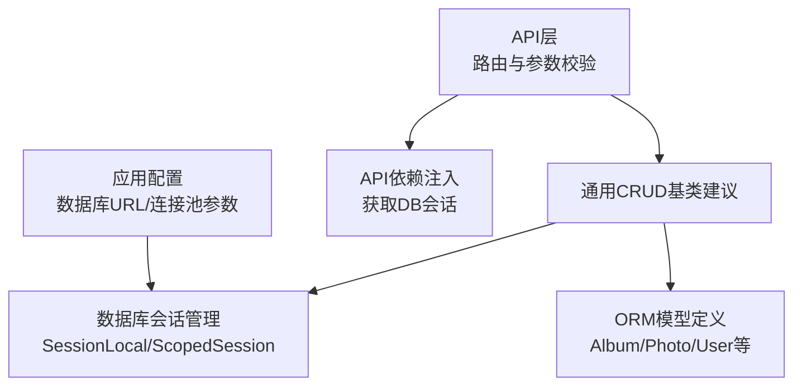
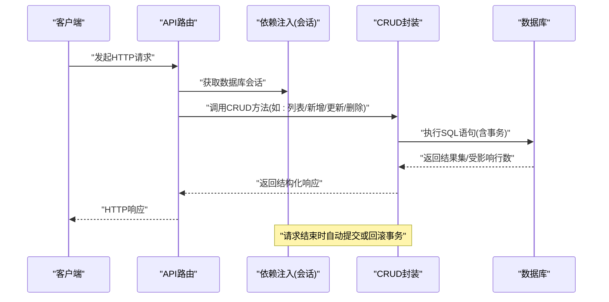
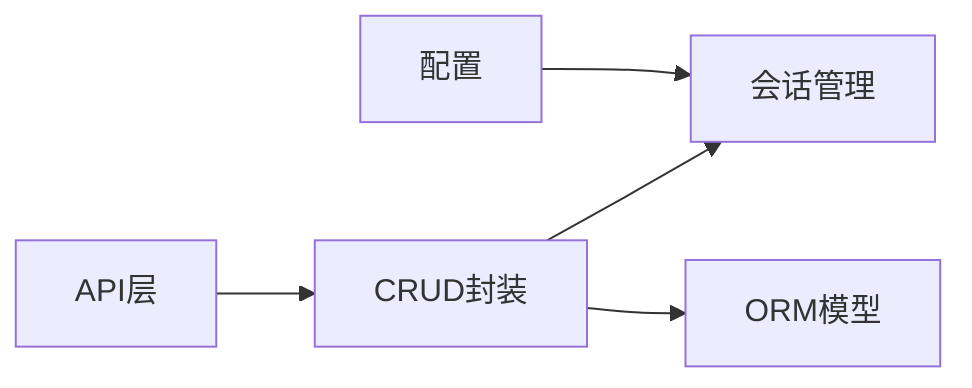

# CRUD操作封装

<cite>
**本文引用的文件**   
- [backend/app/database/session.py](file://backend/app/database/session.py)
- [backend/app/database/storage.py](file://backend/app/database/storage.py)
- [backend/app/models/__init__.py](file://backend/app/models/__init__.py)
- [backend/app/models/album.py](file://backend/app/models/album.py)
- [backend/app/models/photo.py](file://backend/app/models/photo.py)
- [backend/app/crud/album.py](file://backend/app/crud/album.py)
- [backend/app/crud/photo.py](file://backend/app/crud/photo.py)
- [backend/app/crud/user.py](file://backend/app/crud/user.py)
- [backend/app/crud/task.py](file://backend/app/crud/task.py)
- [backend/app/api/deps.py](file://backend/app/api/deps.py)
- [backend/app/config/settings.py](file://backend/app/config/settings.py)
</cite>

## 目录
1. [简介](#简介)
2. [项目结构](#项目结构)
3. [核心组件](#核心组件)
4. [架构总览](#架构总览)
5. [详细组件分析](#详细组件分析)
6. [依赖关系分析](#依赖关系分析)
7. [性能考虑](#性能考虑)
8. [故障排查指南](#故障排查指南)
9. [结论](#结论)
10. [附录](#附录)

## 简介
本文件围绕基于SQLAlchemy的数据访问层与通用CRUD封装展开，系统阐述以下主题：
- 数据访问层设计与通用CRUD基类实现思路
- 复杂查询构建模式、条件过滤与分页机制
- 事务管理最佳实践、并发控制与一致性保证
- 批量操作优化策略、连接池配置与性能监控
- 数据验证规则、业务约束与异常处理模式
- 数据库迁移管理、版本兼容性与备份恢复指南

说明：当前仓库未提供显式的“通用CRUD基类”源码文件。本文在保持与现有代码一致的前提下，给出面向该项目的通用CRUD设计建议与落地方案，并结合现有模型、会话与API依赖进行系统化说明。

## 项目结构
后端采用分层架构：API层调用服务或CRUD层，CRUD层通过SQLAlchemy会话访问数据库模型。数据库会话由集中式模块提供，并在API依赖中注入到路由处理器。

图示来源
- [backend/app/database/session.py](file://backend/app/database/session.py)
- [backend/app/models/album.py](file://backend/app/models/album.py)
- [backend/app/models/photo.py](file://backend/app/models/photo.py)
- [backend/app/api/deps.py](file://backend/app/api/deps.py)
- [backend/app/config/settings.py](file://backend/app/config/settings.py)

章节来源
- [backend/app/database/session.py](file://backend/app/database/session.py)
- [backend/app/models/__init__.py](file://backend/app/models/__init__.py)
- [backend/app/models/album.py](file://backend/app/models/album.py)
- [backend/app/models/photo.py](file://backend/app/models/photo.py)
- [backend/app/api/deps.py](file://backend/app/api/deps.py)
- [backend/app/config/settings.py](file://backend/app/config/settings.py)

## 核心组件
- 数据库会话管理：负责创建、复用与释放SQLAlchemy会话，支持作用域隔离与连接池参数配置。
- ORM模型：以声明式方式定义表结构与字段约束，作为CRUD操作的实体基础。
- CRUD封装：为常见增删改查提供统一接口；针对复杂查询提供组合式过滤与分页能力。
- API依赖注入：在请求生命周期内提供数据库会话，确保每个请求拥有独立的事务边界。

章节来源
- [backend/app/database/session.py](file://backend/app/database/session.py)
- [backend/app/models/album.py](file://backend/app/models/album.py)
- [backend/app/models/photo.py](file://backend/app/models/photo.py)
- [backend/app/api/deps.py](file://backend/app/api/deps.py)

## 架构总览
下图展示从API到数据库的完整调用链路，以及事务边界与错误传播路径。

图示来源
- [backend/app/api/deps.py](file://backend/app/api/deps.py)
- [backend/app/database/session.py](file://backend/app/database/session.py)

## 详细组件分析

### 数据库会话与连接池
- 会话工厂与作用域：使用会话工厂创建会话，并通过作用域会话确保线程安全与请求级隔离。
- 连接池参数：根据工作负载调整连接池大小、超时与回收策略，避免连接泄漏与资源耗尽。
- 事务边界：在请求开始时开启事务，成功时提交，异常时回滚，保证一致性。

章节来源
- [backend/app/database/session.py](file://backend/app/database/session.py)
- [backend/app/config/settings.py](file://backend/app/config/settings.py)

### ORM模型与约束
- 模型定义：通过声明式基类映射数据库表，定义主键、外键、唯一性、非空等约束。
- 关联关系：一对多、多对一等关系在模型层声明，便于查询与级联操作。
- 索引与排序：为高频查询字段建立索引，提升检索性能。

章节来源
- [backend/app/models/__init__.py](file://backend/app/models/__init__.py)
- [backend/app/models/album.py](file://backend/app/models/album.py)
- [backend/app/models/photo.py](file://backend/app/models/photo.py)

### 通用CRUD基类（建议实现）
说明：当前仓库未提供显式通用CRUD基类文件。以下为面向该项目的通用CRUD设计建议，结合现有模型与API依赖进行落地。

- 设计要点
  - 泛型类型：以模型类型为泛型参数，提供类型安全的CRUD接口。
  - 构造注入：在初始化时传入会话工厂或会话作用域，避免全局状态。
  - 方法抽象：create、get_by_id、update、delete、list_with_filters、count、bulk_create等。
  - 查询组合：将过滤条件、排序、分页参数抽象为可组合对象，支持链式调用。
  - 事务封装：所有写操作在事务中执行，失败自动回滚。

- 典型接口约定
  - 新增：接收Pydantic模型或字典，转换为ORM实例并持久化。
  - 读取：按ID获取单条记录；按条件列表查询，支持分页与排序。
  - 更新：按ID定位记录，合并变更字段后提交。
  - 删除：软删除或硬删除，遵循业务语义。
  - 批量：批量插入/更新，减少往返次数。

- 复杂查询构建模式
  - 条件过滤：将用户输入解析为SQL表达式集合，支持等于、包含、范围、模糊匹配等。
  - 动态拼接：基于可选参数决定是否添加WHERE子句，避免无效查询。
  - 聚合统计：在列表前计算总数，用于分页元信息。

- 分页处理机制
  - 偏移分页：适用于中小数据集，注意大偏移的性能退化。
  - 游标分页：基于有序字段（如时间戳、自增ID）的下一页游标，适合大数据量与高并发。
  - 分页参数：页码、每页大小、排序字段与方向。

- 并发控制与一致性
  - 乐观锁：在模型中添加版本号字段，更新时检查版本号，防止覆盖写入。
  - 悲观锁：在需要强一致性的场景使用行级锁，但需评估死锁风险。
  - 幂等性：对外暴露的写入接口应具备幂等保障，避免重复提交导致数据不一致。

- 批量操作优化
  - 批量插入：使用批量插入API减少网络往返。
  - 分批提交：大批量任务分批次提交，降低事务持有时间与内存占用。
  - 去重策略：基于唯一键或业务键进行UPSERT，避免重复数据。

- 连接池配置与监控
  - 连接池大小：根据CPU核数与I/O特性调优，避免过多连接造成上下文切换开销。
  - 空闲回收：合理设置空闲连接回收时间，释放闲置资源。
  - 指标采集：记录慢查询、连接池使用率、事务耗时等关键指标。

- 数据验证与业务约束
  - 输入校验：在API层使用Pydantic模型进行严格校验，拒绝非法输入。
  - 业务约束：在模型层定义唯一性、非空、范围等约束，确保数据完整性。
  - 异常处理：统一捕获数据库异常，转换为标准错误响应，避免泄露内部细节。

- 事务管理最佳实践
  - 短事务：尽量缩短事务持续时间，减少锁竞争。
  - 明确边界：在请求入口开启事务，出口处提交或回滚。
  - 嵌套事务：谨慎使用，优先拆分为多个独立事务。

- 数据库迁移与版本兼容
  - 迁移工具：使用Alembic管理DDL变更，生成与回滚迁移脚本。
  - 兼容性策略：向后兼容字段变更，逐步淘汰旧字段，避免破坏性升级。
  - 灰度发布：先部署只读变更，再执行数据迁移，最后启用新功能。

- 备份与恢复
  - 定期备份：全量+增量备份策略，保留足够历史副本。
  - 恢复演练：定期进行恢复演练，验证备份有效性。
  - 灾难恢复：制定RTO/RPO目标，明确恢复流程与责任人。

章节来源
- [backend/app/database/session.py](file://backend/app/database/session.py)
- [backend/app/models/album.py](file://backend/app/models/album.py)
- [backend/app/models/photo.py](file://backend/app/models/photo.py)
- [backend/app/api/deps.py](file://backend/app/api/deps.py)

### 领域CRUD示例：相册与照片
- 相册CRUD
  - 新增相册：校验名称唯一性，创建相册记录。
  - 查询相册：支持按名称模糊搜索、按创建时间排序。
  - 更新相册：仅允许更新允许字段，记录审计信息。
  - 删除相册：检查是否包含照片，必要时级联处理。

- 照片CRUD
  - 上传照片：校验文件类型与大小，生成缩略图与元数据。
  - 查询照片：支持按相册、标签、时间范围筛选，分页返回。
  - 更新照片：更新描述、标签等元数据。
  - 删除照片：软删除至回收站，支持批量恢复。

章节来源
- [backend/app/crud/album.py](file://backend/app/crud/album.py)
- [backend/app/crud/photo.py](file://backend/app/crud/photo.py)
- [backend/app/models/album.py](file://backend/app/models/album.py)
- [backend/app/models/photo.py](file://backend/app/models/photo.py)

### 领域CRUD示例：用户与任务
- 用户CRUD
  - 注册与登录：密码哈希存储，令牌签发与刷新。
  - 权限控制：基于角色的访问控制，限制敏感操作。

- 任务CRUD
  - 任务调度：异步任务队列，任务状态机管理。
  - 重试与补偿：失败重试与补偿逻辑，保证最终一致性。

章节来源
- [backend/app/crud/user.py](file://backend/app/crud/user.py)
- [backend/app/crud/task.py](file://backend/app/crud/task.py)

## 依赖关系分析
- 低耦合：API层仅依赖CRUD接口，不直接感知SQLAlchemy细节。
- 高内聚：CRUD封装集中处理查询构建、事务与异常转换。
- 外部依赖：数据库驱动、连接池、迁移工具。

图示来源
- [backend/app/api/deps.py](file://backend/app/api/deps.py)
- [backend/app/database/session.py](file://backend/app/database/session.py)
- [backend/app/models/__init__.py](file://backend/app/models/__init__.py)

章节来源
- [backend/app/api/deps.py](file://backend/app/api/deps.py)
- [backend/app/database/session.py](file://backend/app/database/session.py)
- [backend/app/models/__init__.py](file://backend/app/models/__init__.py)

## 性能考虑
- 索引优化：为常用过滤与排序字段建立合适索引，避免全表扫描。
- 查询计划：定期审查慢查询日志，优化SQL与索引。
- 连接池调优：根据并发与延迟目标调整连接池大小与超时。
- 分页策略：大数据量优先使用游标分页，避免深度偏移。
- 批量写入：合并小事务为大事务，减少提交次数。
- 缓存策略：热点数据引入缓存层，降低数据库压力。

[本节为通用指导，无需特定文件来源]

## 故障排查指南
- 常见问题
  - 连接池耗尽：检查连接泄漏与长事务，调整池大小与超时。
  - 死锁：识别冲突事务顺序，拆分或重组事务边界。
  - 慢查询：定位热点SQL，补充索引或改写查询。
  - 数据不一致：检查事务边界与异常处理路径，确保回滚正确。
- 诊断手段
  - 启用SQL日志与慢查询日志。
  - 采集连接池与事务指标。
  - 使用压测工具模拟高并发场景。

[本节为通用指导，无需特定文件来源]

## 结论
通过对会话管理、模型定义与CRUD封装的系统化设计，可在保证一致性与可维护性的前提下，高效支撑复杂查询与批量操作。结合连接池调优、索引优化与监控告警，可进一步提升系统稳定性与性能。建议在项目中引入通用CRUD基类，统一查询构建与分页模式，降低重复代码与维护成本。

[本节为总结性内容，无需特定文件来源]

## 附录
- 术语
  - 会话：与数据库的一次通信上下文，通常对应一个请求或一个事务。
  - 连接池：复用数据库连接的池化机制，减少连接创建开销。
  - 游标分页：基于有序字段的下一页指针，避免深度偏移带来的性能问题。
- 参考
  - SQLAlchemy官方文档：会话与连接池配置
  - Alembic官方文档：迁移脚本编写与执行
  - 数据库厂商文档：连接池与索引最佳实践

[本节为参考资料，无需特定文件来源]