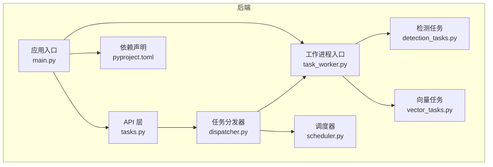
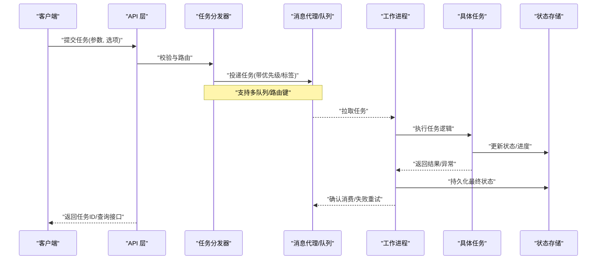
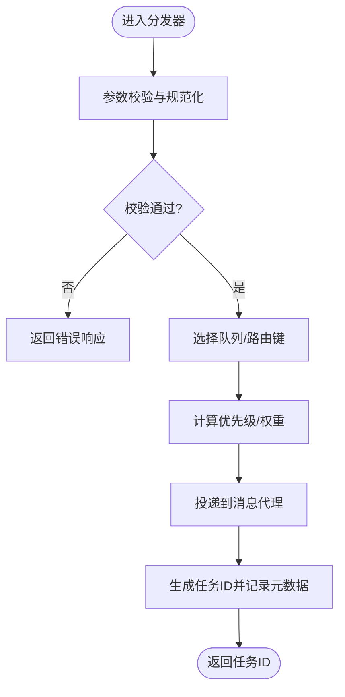
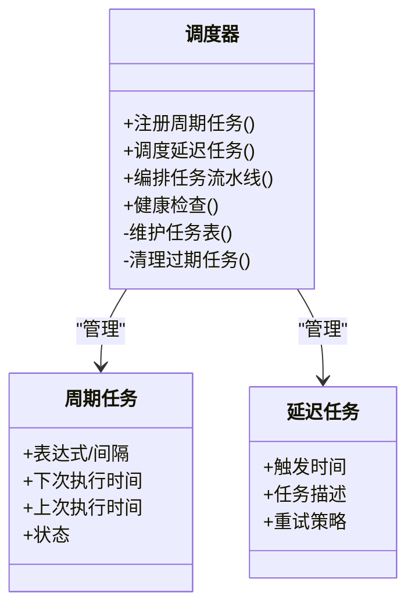
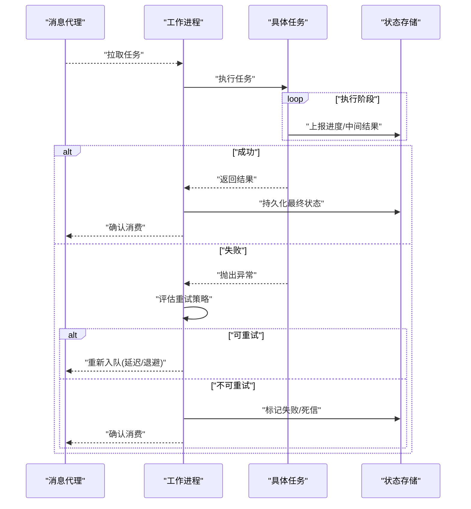
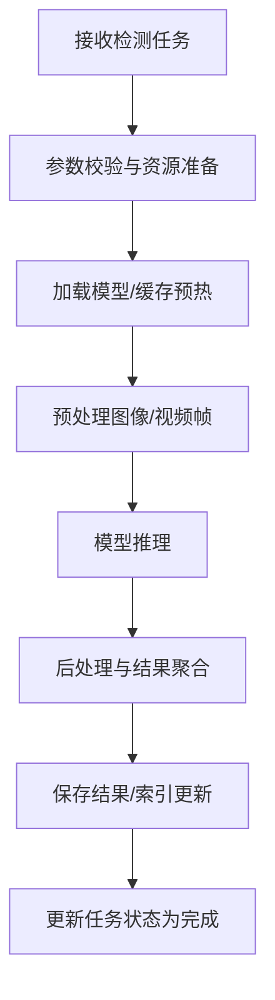
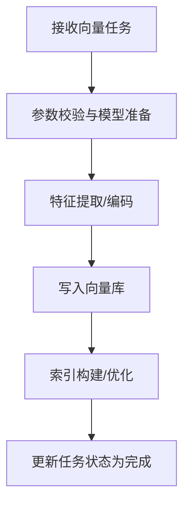
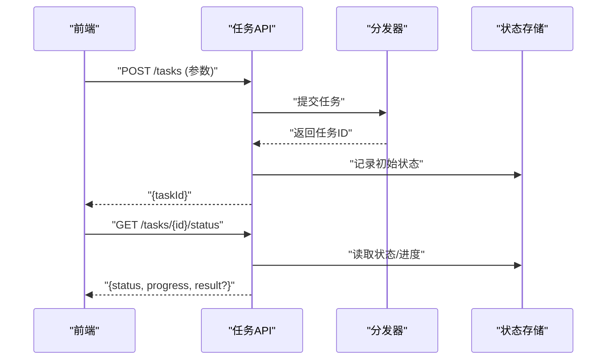
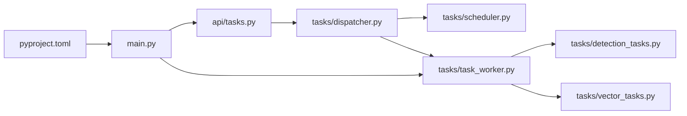

# 任务调度服务

<cite>
**本文引用的文件**   
- [backend/app/tasks/dispatcher.py](file://backend/app/tasks/dispatcher.py)
- [backend/app/tasks/scheduler.py](file://backend/app/tasks/scheduler.py)
- [backend/app/tasks/task_worker.py](file://backend/app/tasks/task_worker.py)
- [backend/app/tasks/detection_tasks.py](file://backend/app/tasks/detection_tasks.py)
- [backend/app/tasks/vector_tasks.py](file://backend/app/tasks/vector_tasks.py)
- [backend/app/api/tasks.py](file://backend/app/api/tasks.py)
- [backend/app/services/README.md](file://backend/app/services/README.md)
- [backend/main.py](file://backend/main.py)
- [backend/pyproject.toml](file://backend/pyproject.toml)
</cite>

## 目录
1. [简介](#简介)
2. [项目结构](#项目结构)
3. [核心组件](#核心组件)
4. [架构总览](#架构总览)
5. [详细组件分析](#详细组件分析)
6. [依赖关系分析](#依赖关系分析)
7. [性能与扩展性](#性能与扩展性)
8. [故障排查指南](#故障排查指南)
9. [结论](#结论)
10. [附录](#附录)

## 简介
本文件面向“AI相册”项目的任务调度子系统，聚焦异步任务队列的配置与管理机制、任务分发器的工作原理、任务路由策略与负载均衡实现、任务类型定义与参数传递、状态跟踪与进度报告、重试与超时处理、错误恢复、定时任务调度算法与周期性任务管理、监控告警、以及生产环境的部署与调优建议。文档以代码级分析为基础，辅以可视化图示，帮助读者快速理解并落地实践。

## 项目结构
任务调度相关代码集中在后端模块的 tasks 与 api 层：
- tasks：包含任务分发器、调度器、工作进程入口及具体任务实现（检测、向量等）。
- api：提供任务相关的 HTTP 接口，用于触发任务、查询状态与进度。
- main.py：应用启动入口，负责加载配置、注册中间件与路由，可能集成任务系统初始化。
- pyproject.toml：声明项目依赖，包含异步任务框架与消息代理驱动。

图表来源
- [backend/app/api/tasks.py](file://backend/app/api/tasks.py)
- [backend/app/tasks/dispatcher.py](file://backend/app/tasks/dispatcher.py)
- [backend/app/tasks/scheduler.py](file://backend/app/tasks/scheduler.py)
- [backend/app/tasks/task_worker.py](file://backend/app/tasks/task_worker.py)
- [backend/app/tasks/detection_tasks.py](file://backend/app/tasks/detection_tasks.py)
- [backend/app/tasks/vector_tasks.py](file://backend/app/tasks/vector_tasks.py)
- [backend/main.py](file://backend/main.py)
- [backend/pyproject.toml](file://backend/pyproject.toml)

章节来源
- [backend/app/tasks/dispatcher.py](file://backend/app/tasks/dispatcher.py)
- [backend/app/tasks/scheduler.py](file://backend/app/tasks/scheduler.py)
- [backend/app/tasks/task_worker.py](file://backend/app/tasks/task_worker.py)
- [backend/app/tasks/detection_tasks.py](file://backend/app/tasks/detection_tasks.py)
- [backend/app/tasks/vector_tasks.py](file://backend/app/tasks/vector_tasks.py)
- [backend/app/api/tasks.py](file://backend/app/api/tasks.py)
- [backend/main.py](file://backend/main.py)
- [backend/pyproject.toml](file://backend/pyproject.toml)

## 核心组件
- 任务分发器：统一接收来自 API 的任务请求，进行参数校验、路由选择、优先级与并发控制，并将任务投递到消息代理或本地队列。
- 调度器：负责任务生命周期管理、周期任务编排、延迟执行与重排；可与外部调度源对接。
- 工作进程：消费队列中的任务，执行业务逻辑（如检测、向量化），更新任务状态与进度，处理异常与重试。
- 任务实现：按领域划分的具体任务（检测、向量等），封装业务细节与资源访问。
- API 接口：暴露任务提交、状态查询、进度获取、取消与批量操作等能力。

章节来源
- [backend/app/tasks/dispatcher.py](file://backend/app/tasks/dispatcher.py)
- [backend/app/tasks/scheduler.py](file://backend/app/tasks/scheduler.py)
- [backend/app/tasks/task_worker.py](file://backend/app/tasks/task_worker.py)
- [backend/app/tasks/detection_tasks.py](file://backend/app/tasks/detection_tasks.py)
- [backend/app/tasks/vector_tasks.py](file://backend/app/tasks/vector_tasks.py)
- [backend/app/api/tasks.py](file://backend/app/api/tasks.py)

## 架构总览
下图展示了从 API 触发任务到工作进程执行的端到端流程，包括任务分发、路由、执行、状态回写与进度上报。

图表来源
- [backend/app/api/tasks.py](file://backend/app/api/tasks.py)
- [backend/app/tasks/dispatcher.py](file://backend/app/tasks/dispatcher.py)
- [backend/app/tasks/task_worker.py](file://backend/app/tasks/task_worker.py)
- [backend/app/tasks/detection_tasks.py](file://backend/app/tasks/detection_tasks.py)
- [backend/app/tasks/vector_tasks.py](file://backend/app/tasks/vector_tasks.py)

## 详细组件分析

### 任务分发器（Dispatcher）
职责与要点
- 参数校验与规范化：确保任务参数完整、类型正确、大小限制合理。
- 路由策略：基于任务类型、资源需求、标签或租户维度选择目标队列或路由键。
- 负载均衡：通过多队列、权重分配、动态扩缩容与消费者数量调节实现。
- 优先级与限流：为高优先级任务设置更高权重；对热点任务进行速率限制。
- 幂等与去重：基于任务标识避免重复执行。
- 可观测性：记录关键指标（入队耗时、队列长度、路由命中分布）。

图表来源
- [backend/app/tasks/dispatcher.py](file://backend/app/tasks/dispatcher.py)

章节来源
- [backend/app/tasks/dispatcher.py](file://backend/app/tasks/dispatcher.py)

### 调度器（Scheduler）
职责与要点
- 周期任务管理：定义与注册周期性任务，支持固定间隔、cron 表达式与相对时间。
- 延迟执行：支持一次性延迟任务，适用于冷却期、退避策略与批处理窗口。
- 任务编排：组合多个子任务形成流水线，支持顺序、并行与条件分支。
- 健康检查与自愈：监控调度器自身健康，异常时自动重启或迁移任务。
- 可观测性：统计调度命中率、过期任务清理、积压情况。

图表来源
- [backend/app/tasks/scheduler.py](file://backend/app/tasks/scheduler.py)

章节来源
- [backend/app/tasks/scheduler.py](file://backend/app/tasks/scheduler.py)

### 工作进程（Worker）
职责与要点
- 任务消费：从指定队列拉取任务，解析上下文与参数。
- 执行环境：隔离资源、加载模型、连接数据库与对象存储。
- 状态与进度：在任务执行过程中持续上报进度与中间结果。
- 异常与重试：捕获异常，根据策略进行指数退避重试或死信处理。
- 优雅退出：支持信号处理，完成当前任务后安全退出。

图表来源
- [backend/app/tasks/task_worker.py](file://backend/app/tasks/task_worker.py)

章节来源
- [backend/app/tasks/task_worker.py](file://backend/app/tasks/task_worker.py)

### 任务实现：检测任务（Detection Tasks）
职责与要点
- 输入：图片/视频路径、检测模型版本、阈值、输出格式。
- 处理：加载模型、预处理、推理、后处理与结果聚合。
- 资源：GPU/CPU 资源申请、显存管理、并发度控制。
- 状态：分阶段上报进度（预处理、推理、后处理）。
- 错误：模型加载失败、推理超时、IO 错误的重试与降级。

图表来源
- [backend/app/tasks/detection_tasks.py](file://backend/app/tasks/detection_tasks.py)

章节来源
- [backend/app/tasks/detection_tasks.py](file://backend/app/tasks/detection_tasks.py)

### 任务实现：向量任务（Vector Tasks）
职责与要点
- 输入：文本/图像特征提取参数、嵌入模型、向量库地址。
- 处理：特征编码、归一化、写入向量库、构建索引。
- 一致性：保证写入原子性与幂等性，支持增量更新。
- 监控：记录向量写入吞吐、索引构建耗时与错误率。

图表来源
- [backend/app/tasks/vector_tasks.py](file://backend/app/tasks/vector_tasks.py)

章节来源
- [backend/app/tasks/vector_tasks.py](file://backend/app/tasks/vector_tasks.py)

### API 接口（Tasks API）
职责与要点
- 提交任务：接收前端请求，调用分发器，返回任务 ID。
- 查询状态：根据任务 ID 获取任务状态、进度与结果。
- 取消任务：支持取消未开始或运行中的任务（取决于实现）。
- 批量操作：批量提交、批量查询与批量取消。
- 鉴权与限流：结合认证中间件与速率限制保护后端。

图表来源
- [backend/app/api/tasks.py](file://backend/app/api/tasks.py)
- [backend/app/tasks/dispatcher.py](file://backend/app/tasks/dispatcher.py)

章节来源
- [backend/app/api/tasks.py](file://backend/app/api/tasks.py)

## 依赖关系分析
- 外部依赖：异步任务框架与消息代理驱动在项目依赖中声明，确保运行时可用。
- 内部耦合：API 层依赖分发器；分发器依赖调度器与工作进程；工作进程依赖具体任务实现。
- 潜在循环：应避免任务实现反向导入分发器或调度器，保持单向依赖。

图表来源
- [backend/app/api/tasks.py](file://backend/app/api/tasks.py)
- [backend/app/tasks/dispatcher.py](file://backend/app/tasks/dispatcher.py)
- [backend/app/tasks/scheduler.py](file://backend/app/tasks/scheduler.py)
- [backend/app/tasks/task_worker.py](file://backend/app/tasks/task_worker.py)
- [backend/app/tasks/detection_tasks.py](file://backend/app/tasks/detection_tasks.py)
- [backend/app/tasks/vector_tasks.py](file://backend/app/tasks/vector_tasks.py)
- [backend/main.py](file://backend/main.py)
- [backend/pyproject.toml](file://backend/pyproject.toml)

章节来源
- [backend/pyproject.toml](file://backend/pyproject.toml)
- [backend/main.py](file://backend/main.py)

## 性能与扩展性
- 队列与路由
  - 多队列拆分：将 CPU 密集型与 IO 密集型任务分离，避免相互阻塞。
  - 路由键与标签：按任务类型、租户或优先级路由，便于独立扩缩容。
- 消费者与并发
  - 调整消费者数量与并发度，匹配硬件资源与任务特性。
  - 使用预取计数与批量拉取降低网络开销。
- 重试与退避
  - 指数退避与抖动，避免雪崩效应。
  - 最大重试次数与死信队列，防止无限重试。
- 超时与熔断
  - 任务级超时与资源级熔断，保障整体稳定性。
- 监控与告警
  - 采集队列深度、消费速率、任务耗时、错误率与重试次数。
  - 设定阈值告警，联动扩容与降级策略。
- 水平扩展
  - 无状态工作进程横向扩展，配合消息代理的高可用集群。
  - 任务幂等与去重，确保多副本安全。

[本节为通用指导，不直接分析具体文件]

## 故障排查指南
- 常见问题定位
  - 任务堆积：检查消费者数量、队列深度、任务耗时与资源瓶颈。
  - 频繁重试：查看错误日志、重试策略与上游依赖可用性。
  - 进度不更新：确认状态存储连通性与上报频率。
- 诊断步骤
  - 查看任务状态与进度接口，确认任务是否被消费。
  - 检查工作进程日志与指标，定位异常堆栈与资源占用。
  - 验证消息代理健康与网络连通性。
- 恢复策略
  - 重启消费者或扩容实例。
  - 清理死信队列并重放关键任务。
  - 降级非关键任务，优先保障核心链路。

章节来源
- [backend/app/tasks/task_worker.py](file://backend/app/tasks/task_worker.py)
- [backend/app/tasks/dispatcher.py](file://backend/app/tasks/dispatcher.py)
- [backend/app/api/tasks.py](file://backend/app/api/tasks.py)

## 结论
本任务调度服务通过清晰的分层设计与模块化实现，提供了可扩展、可观测且稳定的异步任务处理能力。分发器负责路由与负载均衡，调度器管理周期与延迟任务，工作进程专注执行与状态上报，API 层对外暴露一致接口。在生产环境中，应结合多队列、弹性扩缩容、重试退避与监控告警，确保高可用与高性能。

[本节为总结，不直接分析具体文件]

## 附录
- 参考说明
  - 服务层 README 提供总体设计思路与最佳实践，可作为任务子系统设计的补充参考。

章节来源
- [backend/app/services/README.md](file://backend/app/services/README.md)