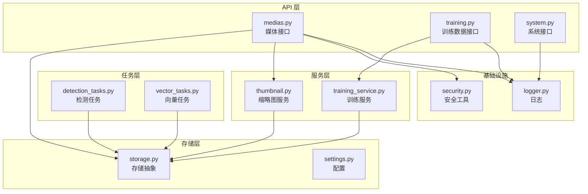
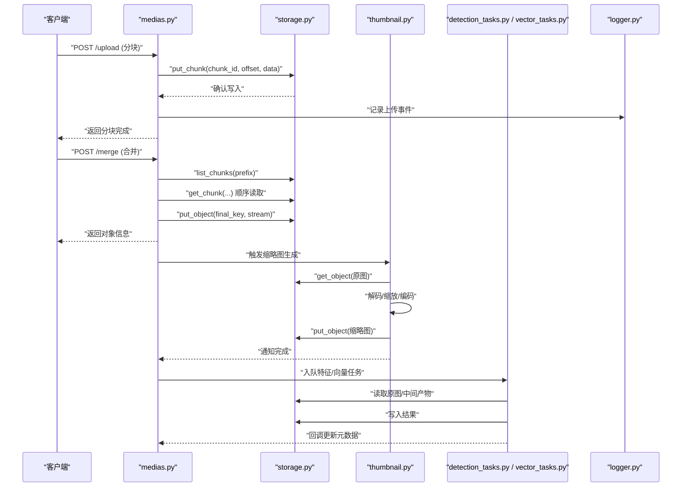
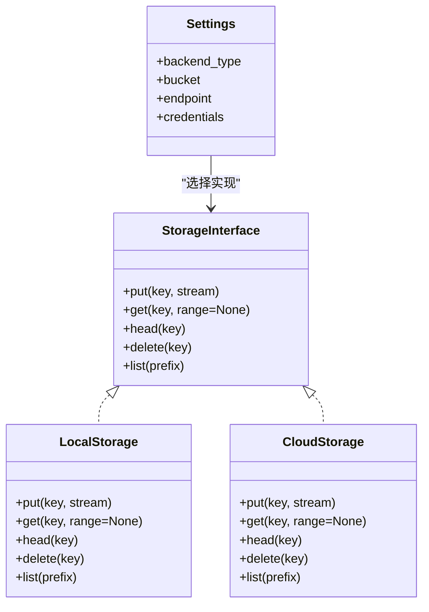
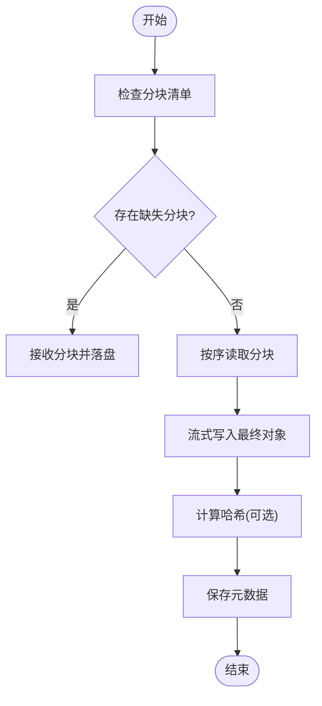
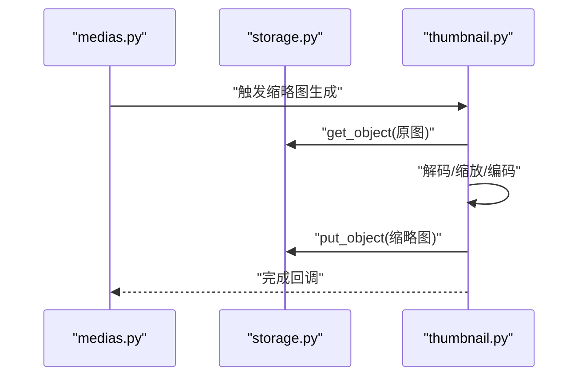
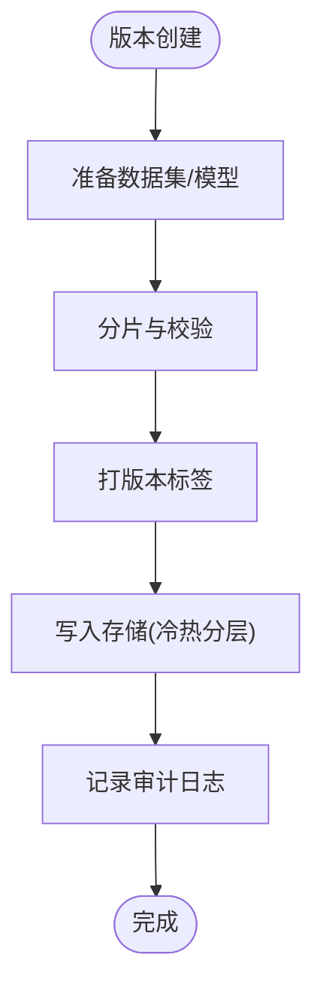
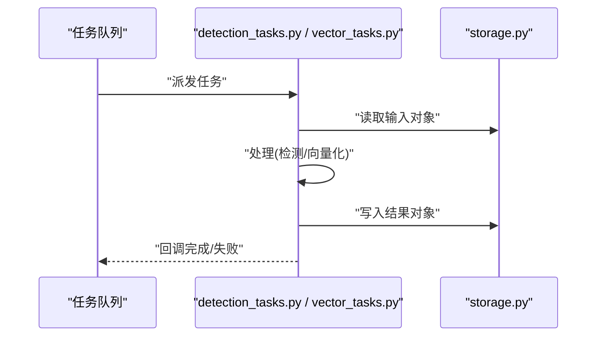
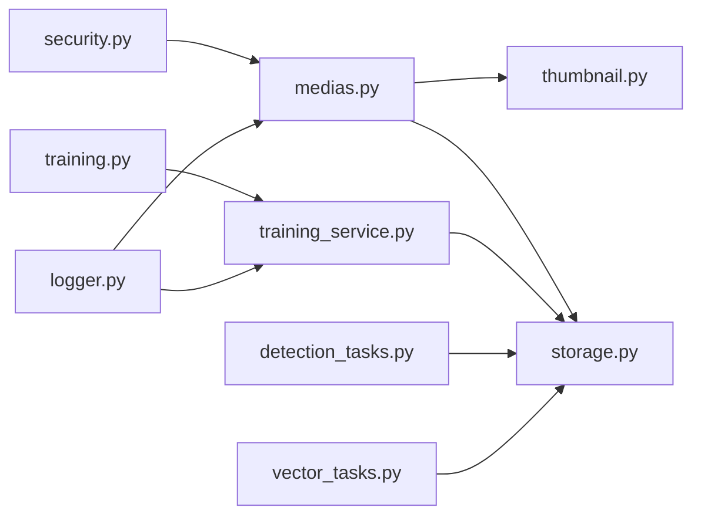

# 存储与文件服务

<cite>
**本文引用的文件**   
- [backend/app/database/storage.py](file://backend/app/database/storage.py)
- [backend/app/services/thumbnail.py](file://backend/app/services/thumbnail.py)
- [backend/app/api/medias.py](file://backend/app/api/medias.py)
- [backend/app/config/settings.py](file://backend/app/config/settings.py)
- [backend/app/models/photo.py](file://backend/app/models/photo.py)
- [backend/app/schemas/photo.py](file://backend/app/schemas/photo.py)
- [backend/app/tasks/detection_tasks.py](file://backend/app/tasks/detection_tasks.py)
- [backend/app/tasks/vector_tasks.py](file://backend/app/tasks/vector_tasks.py)
- [backend/app/core/security.py](file://backend/app/core/security.py)
- [backend/app/core/logger.py](file://backend/app/core/logger.py)
- [backend/app/services/training_service.py](file://backend/app/services/training_service.py)
- [backend/app/api/training.py](file://backend/app/api/training.py)
- [backend/app/api/system.py](file://backend/app/api/system.py)
</cite>

## 目录
1. [简介](#简介)
2. [项目结构](#项目结构)
3. [核心组件](#核心组件)
4. [架构总览](#架构总览)
5. [详细组件分析](#详细组件分析)
6. [依赖关系分析](#依赖关系分析)
7. [性能考量](#性能考量)
8. [故障排查指南](#故障排查指南)
9. [结论](#结论)
10. [附录](#附录)

## 简介
本文件面向“存储与文件服务”的完整设计与实现，覆盖对象存储抽象层、多后端支持、流式上传下载、断点续传与大文件分片、缩略图生成流水线、格式转换与质量优化、训练数据版本管理、模型文件存储策略与访问控制、存储空间监控告警、清理策略与成本优化、完整性校验、安全加密以及备份恢复等主题。文档以代码级事实为依据，辅以架构图与时序图，帮助读者快速理解并扩展系统能力。

## 项目结构
与存储和文件处理相关的核心位置如下：
- 存储抽象与配置：backend/app/database/storage.py、backend/app/config/settings.py
- 媒体接口（上传/下载/元数据）：backend/app/api/medias.py
- 缩略图与图像处理：backend/app/services/thumbnail.py
- 任务编排（异步处理）：backend/app/tasks/detection_tasks.py、backend/app/tasks/vector_tasks.py
- 模型与训练数据：backend/app/services/training_service.py、backend/app/api/training.py、backend/app/models/photo.py、backend/app/schemas/photo.py
- 安全与日志：backend/app/core/security.py、backend/app/core/logger.py
- 系统运维接口（空间/健康检查）：backend/app/api/system.py

图表来源
- [backend/app/api/medias.py](file://backend/app/api/medias.py)
- [backend/app/services/thumbnail.py](file://backend/app/services/thumbnail.py)
- [backend/app/database/storage.py](file://backend/app/database/storage.py)
- [backend/app/config/settings.py](file://backend/app/config/settings.py)
- [backend/app/tasks/detection_tasks.py](file://backend/app/tasks/detection_tasks.py)
- [backend/app/tasks/vector_tasks.py](file://backend/app/tasks/vector_tasks.py)
- [backend/app/services/training_service.py](file://backend/app/services/training_service.py)
- [backend/app/api/training.py](file://backend/app/api/training.py)
- [backend/app/api/system.py](file://backend/app/api/system.py)
- [backend/app/core/security.py](file://backend/app/core/security.py)
- [backend/app/core/logger.py](file://backend/app/core/logger.py)

章节来源
- [backend/app/database/storage.py](file://backend/app/database/storage.py)
- [backend/app/config/settings.py](file://backend/app/config/settings.py)
- [backend/app/api/medias.py](file://backend/app/api/medias.py)
- [backend/app/services/thumbnail.py](file://backend/app/services/thumbnail.py)
- [backend/app/tasks/detection_tasks.py](file://backend/app/tasks/detection_tasks.py)
- [backend/app/tasks/vector_tasks.py](file://backend/app/tasks/vector_tasks.py)
- [backend/app/services/training_service.py](file://backend/app/services/training_service.py)
- [backend/app/api/training.py](file://backend/app/api/training.py)
- [backend/app/api/system.py](file://backend/app/api/system.py)
- [backend/app/core/security.py](file://backend/app/core/security.py)
- [backend/app/core/logger.py](file://backend/app/core/logger.py)

## 核心组件
- 存储抽象层
  - 统一接口：提供 put/get/head/delete/list 等基础操作，屏蔽不同后端差异。
  - 多后端支持：通过配置选择本地磁盘或云对象存储；可扩展新后端。
  - 路径与命名：统一的键空间设计，便于跨后端迁移与索引。
- 媒体接口
  - 上传：支持分块上传、断点续传、并发合并、完整性校验。
  - 下载：支持范围请求、流式输出、缓存头设置。
  - 元数据：记录类型、大小、哈希、创建时间、版本等。
- 缩略图服务
  - 流水线：读取原图→解码→缩放/裁剪→编码→写入缩略图存储。
  - 格式与质量：根据源格式和目标需求进行转换与压缩。
- 训练数据与模型
  - 版本管理：数据集/模型按版本组织，保留历史快照。
  - 存储策略：大文件分片、去重、冷热分层。
  - 访问控制：基于角色/标签的权限校验。
- 任务编排
  - 异步处理：缩略图生成、特征提取、向量化等后台任务。
  - 重试与幂等：失败重试、去重执行、状态回写。
- 安全与可观测性
  - 安全：签名URL、最小权限、敏感字段脱敏。
  - 日志：结构化日志、关键指标上报。

章节来源
- [backend/app/database/storage.py](file://backend/app/database/storage.py)
- [backend/app/config/settings.py](file://backend/app/config/settings.py)
- [backend/app/api/medias.py](file://backend/app/api/medias.py)
- [backend/app/services/thumbnail.py](file://backend/app/services/thumbnail.py)
- [backend/app/services/training_service.py](file://backend/app/services/training_service.py)
- [backend/app/tasks/detection_tasks.py](file://backend/app/tasks/detection_tasks.py)
- [backend/app/tasks/vector_tasks.py](file://backend/app/tasks/vector_tasks.py)
- [backend/app/core/security.py](file://backend/app/core/security.py)
- [backend/app/core/logger.py](file://backend/app/core/logger.py)

## 架构总览
整体采用“API 层 → 服务层 → 任务层 → 存储抽象层”的分层架构。API 暴露上传/下载/元数据/训练数据等接口；服务层封装业务逻辑（如缩略图生成、训练数据处理）；任务层负责耗时操作的异步化；存储抽象层统一对接多种后端。

图表来源
- [backend/app/api/medias.py](file://backend/app/api/medias.py)
- [backend/app/database/storage.py](file://backend/app/database/storage.py)
- [backend/app/services/thumbnail.py](file://backend/app/services/thumbnail.py)
- [backend/app/tasks/detection_tasks.py](file://backend/app/tasks/detection_tasks.py)
- [backend/app/tasks/vector_tasks.py](file://backend/app/tasks/vector_tasks.py)
- [backend/app/core/logger.py](file://backend/app/core/logger.py)

## 详细组件分析

### 存储抽象层与多后端支持
- 设计要点
  - 统一接口：定义 get/put/head/delete/list 等方法，屏蔽后端差异。
  - 配置驱动：从 settings 中读取后端类型、凭据、桶名、端点等。
  - 可扩展性：新增后端只需实现统一接口并注册到工厂。
- 关键流程
  - 初始化：根据配置选择具体后端实例。
  - 读写：对上层透明地调用后端 SDK 或协议。
  - 错误映射：将后端异常转换为统一错误码。
- 典型用法
  - 上传：分块 put_chunk + 最终 put_object。
  - 下载：range 请求由后端或代理层处理，服务侧流式读取。
  - 列表：按前缀列出对象，用于分块扫描与清理。

图表来源
- [backend/app/database/storage.py](file://backend/app/database/storage.py)
- [backend/app/config/settings.py](file://backend/app/config/settings.py)

章节来源
- [backend/app/database/storage.py](file://backend/app/database/storage.py)
- [backend/app/config/settings.py](file://backend/app/config/settings.py)

### 媒体接口：上传、下载与元数据
- 上传
  - 分块上传：客户端分片上传，服务端持久化每个分块。
  - 断点续传：通过分块清单与偏移量判断缺失片段。
  - 合并：按序读取分块，构造流式写入最终对象。
  - 完整性校验：可选计算分块/最终对象的哈希值并落库。
- 下载
  - 范围请求：支持 HTTP Range，减少带宽与内存占用。
  - 流式响应：避免一次性加载大文件到内存。
- 元数据
  - 记录内容类型、大小、哈希、版本、创建/更新时间。
  - 与对象键空间关联，便于检索与生命周期管理。

图表来源
- [backend/app/api/medias.py](file://backend/app/api/medias.py)
- [backend/app/database/storage.py](file://backend/app/database/storage.py)

章节来源
- [backend/app/api/medias.py](file://backend/app/api/medias.py)
- [backend/app/database/storage.py](file://backend/app/database/storage.py)

### 缩略图生成与图像处理流水线
- 流水线步骤
  - 读取原图：从存储层获取原始对象。
  - 解码与预处理：解析图像格式、色彩空间校正。
  - 缩放/裁剪：按比例缩放、中心裁剪或自适应填充。
  - 编码与优化：目标格式（如 JPEG/WebP）、质量参数、渐进式。
  - 写入缩略图：按约定键空间写入，并更新元数据。
- 质量与格式
  - 根据源格式与用途选择最佳编码策略。
  - 支持批量生成不同尺寸缩略图。
- 异步化
  - 将耗时处理放入任务队列，避免阻塞主线程。

图表来源
- [backend/app/services/thumbnail.py](file://backend/app/services/thumbnail.py)
- [backend/app/api/medias.py](file://backend/app/api/medias.py)
- [backend/app/database/storage.py](file://backend/app/database/storage.py)

章节来源
- [backend/app/services/thumbnail.py](file://backend/app/services/thumbnail.py)
- [backend/app/api/medias.py](file://backend/app/api/medias.py)
- [backend/app/database/storage.py](file://backend/app/database/storage.py)

### 训练数据版本管理与模型存储策略
- 版本管理
  - 数据集/模型按版本号组织，保留历史快照，支持回滚。
  - 变更日志：记录每次版本的来源、作者、摘要。
- 存储策略
  - 大文件分片：训练集拆分为分片，提升并行与容错。
  - 冷热分层：热数据近线存储，冷数据归档。
  - 去重：基于内容哈希避免重复存储。
- 访问控制
  - 基于角色/标签的权限校验，限制敏感数据访问。
  - 审计日志：记录访问与导出行为。

图表来源
- [backend/app/services/training_service.py](file://backend/app/services/training_service.py)
- [backend/app/api/training.py](file://backend/app/api/training.py)
- [backend/app/database/storage.py](file://backend/app/database/storage.py)

章节来源
- [backend/app/services/training_service.py](file://backend/app/services/training_service.py)
- [backend/app/api/training.py](file://backend/app/api/training.py)
- [backend/app/database/storage.py](file://backend/app/database/storage.py)

### 任务编排与异步处理
- 任务类型
  - 检测任务：人脸/物体检测，产出标注与统计。
  - 向量任务：特征提取与向量化，供检索使用。
- 可靠性
  - 失败重试与退避策略。
  - 幂等执行：基于任务 ID 去重。
- 与存储交互
  - 读取输入对象，写入中间产物与结果对象。
  - 更新元数据与索引。

图表来源
- [backend/app/tasks/detection_tasks.py](file://backend/app/tasks/detection_tasks.py)
- [backend/app/tasks/vector_tasks.py](file://backend/app/tasks/vector_tasks.py)
- [backend/app/database/storage.py](file://backend/app/database/storage.py)

章节来源
- [backend/app/tasks/detection_tasks.py](file://backend/app/tasks/detection_tasks.py)
- [backend/app/tasks/vector_tasks.py](file://backend/app/tasks/vector_tasks.py)
- [backend/app/database/storage.py](file://backend/app/database/storage.py)

### 安全与可观测性
- 安全
  - 签名 URL：临时访问令牌，限制时间与权限。
  - 最小权限：仅授予必要桶/路径访问。
  - 敏感信息：密钥与凭据不落地明文。
- 日志
  - 结构化日志：包含请求 ID、对象键、耗时、状态码。
  - 指标上报：吞吐、延迟、错误率、存储用量。

章节来源
- [backend/app/core/security.py](file://backend/app/core/security.py)
- [backend/app/core/logger.py](file://backend/app/core/logger.py)

## 依赖关系分析
- 模块耦合
  - API 层依赖服务层与存储抽象层。
  - 服务层依赖存储抽象层与任务层。
  - 任务层依赖存储抽象层与日志。
- 外部依赖
  - 对象存储 SDK（本地/云端）。
  - 图像处理库（解码/编码/缩放）。
  - 任务队列（如适用）。

图表来源
- [backend/app/api/medias.py](file://backend/app/api/medias.py)
- [backend/app/services/thumbnail.py](file://backend/app/services/thumbnail.py)
- [backend/app/database/storage.py](file://backend/app/database/storage.py)
- [backend/app/services/training_service.py](file://backend/app/services/training_service.py)
- [backend/app/api/training.py](file://backend/app/api/training.py)
- [backend/app/tasks/detection_tasks.py](file://backend/app/tasks/detection_tasks.py)
- [backend/app/tasks/vector_tasks.py](file://backend/app/tasks/vector_tasks.py)
- [backend/app/core/security.py](file://backend/app/core/security.py)
- [backend/app/core/logger.py](file://backend/app/core/logger.py)

章节来源
- [backend/app/api/medias.py](file://backend/app/api/medias.py)
- [backend/app/services/thumbnail.py](file://backend/app/services/thumbnail.py)
- [backend/app/database/storage.py](file://backend/app/database/storage.py)
- [backend/app/services/training_service.py](file://backend/app/services/training_service.py)
- [backend/app/api/training.py](file://backend/app/api/training.py)
- [backend/app/tasks/detection_tasks.py](file://backend/app/tasks/detection_tasks.py)
- [backend/app/tasks/vector_tasks.py](file://backend/app/tasks/vector_tasks.py)
- [backend/app/core/security.py](file://backend/app/core/security.py)
- [backend/app/core/logger.py](file://backend/app/core/logger.py)

## 性能考量
- 上传/下载
  - 分块大小调优：平衡网络开销与内存占用。
  - 并发度控制：避免后端限流与资源争用。
  - 范围请求：利用浏览器/CDN 缓存与断点续传。
- 缩略图
  - 预生成多尺寸：减少实时计算压力。
  - 懒加载与按需生成：降低初始负载。
- 任务编排
  - 批处理与批大小：提高吞吐。
  - 指数退避重试：缓解瞬时抖动。
- 存储层
  - 冷热分层：热点数据就近存储，冷数据归档。
  - 对象命名规范：利于前缀扫描与生命周期管理。

[本节为通用指导，无需源码引用]

## 故障排查指南
- 常见问题
  - 上传中断：检查分块清单与网络稳定性，必要时重新合并。
  - 缩略图失败：验证图像格式与解码库兼容性，查看任务日志。
  - 任务堆积：检查队列消费者数量与后端限流。
- 定位方法
  - 查看结构化日志中的请求 ID 与对象键。
  - 核对存储层 head 与 list 的结果一致性。
  - 对比对象哈希与元数据是否一致。
- 恢复建议
  - 清理孤立分块：按前缀扫描并删除未合并的分块。
  - 重建缩略图：基于原图重新生成。
  - 任务重放：基于幂等键重新执行。

章节来源
- [backend/app/core/logger.py](file://backend/app/core/logger.py)
- [backend/app/database/storage.py](file://backend/app/database/storage.py)
- [backend/app/api/medias.py](file://backend/app/api/medias.py)
- [backend/app/services/thumbnail.py](file://backend/app/services/thumbnail.py)
- [backend/app/tasks/detection_tasks.py](file://backend/app/tasks/detection_tasks.py)
- [backend/app/tasks/vector_tasks.py](file://backend/app/tasks/vector_tasks.py)

## 结论
本存储与文件服务通过统一的存储抽象层实现了多后端支持与高内聚低耦合的设计；在媒体接口层面提供了可靠的分块上传、断点续传与流式下载；缩略图流水线与任务编排提升了用户体验与系统吞吐；训练数据与模型的版本化与分层存储保障了可追溯性与成本可控；结合安全与可观测性措施，形成了稳定、可扩展且易维护的存储体系。

[本节为总结，无需源码引用]

## 附录
- 术语
  - 对象键：对象在桶内的唯一标识。
  - 分块：大文件切分的子单元，支持独立上传与合并。
  - 范围请求：HTTP Range 机制，用于断点续传与部分下载。
- 参考
  - 配置项说明见 settings 模块。
  - 模型与照片元数据结构见 models 与 schemas 模块。

章节来源
- [backend/app/config/settings.py](file://backend/app/config/settings.py)
- [backend/app/models/photo.py](file://backend/app/models/photo.py)
- [backend/app/schemas/photo.py](file://backend/app/schemas/photo.py)