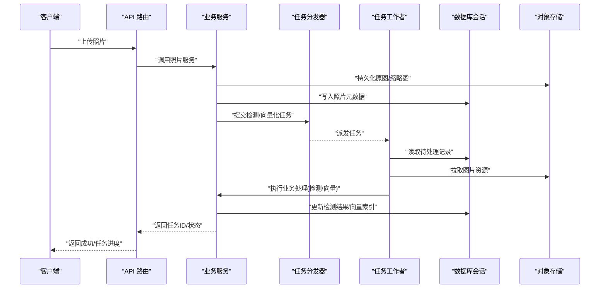
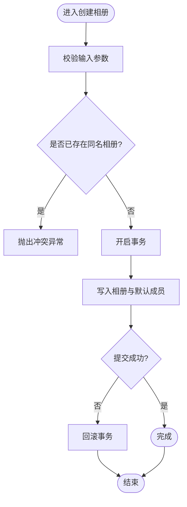
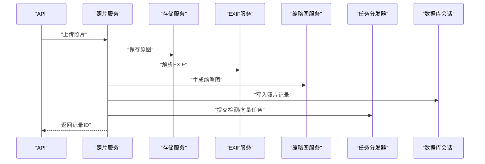
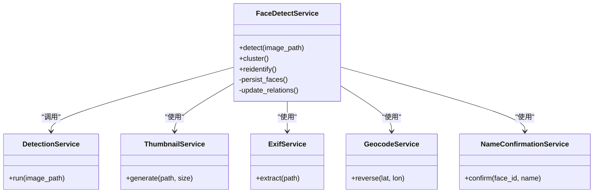
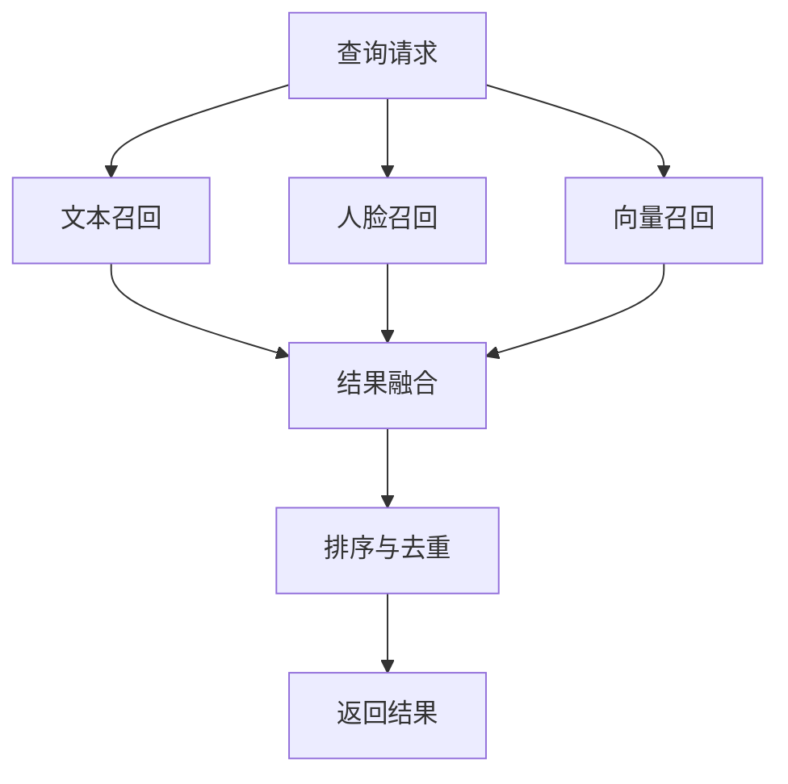
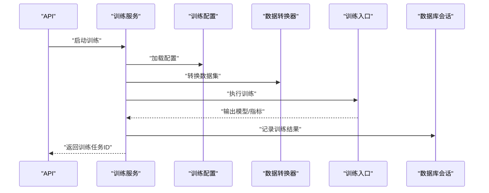
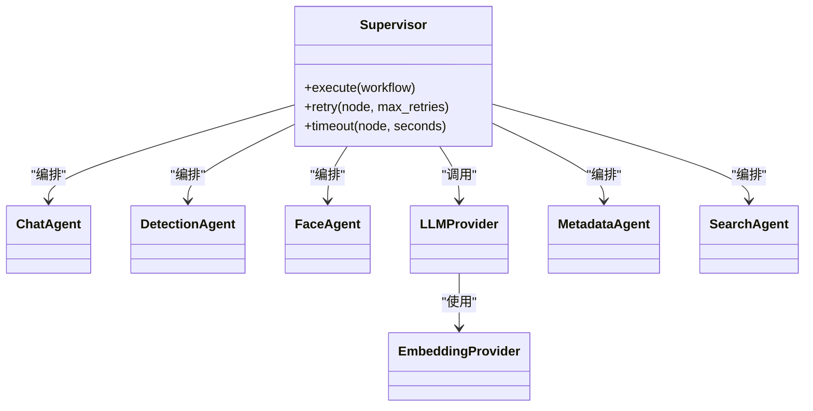
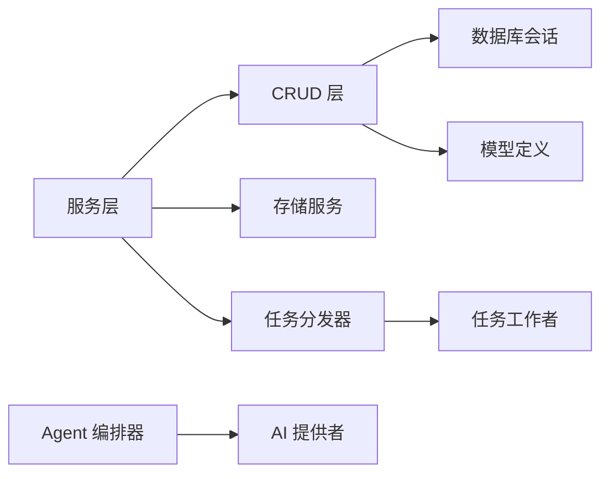
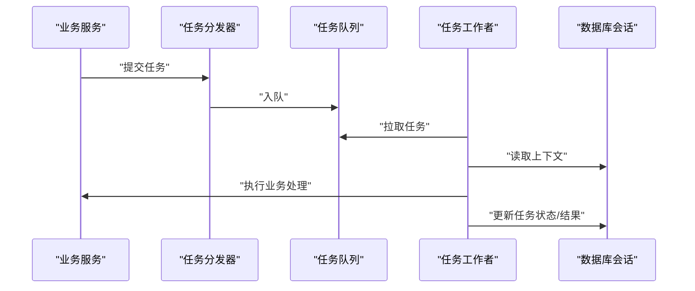

# 服务层开发

<cite>
**本文引用的文件**   
- [backend/app/services/album_service.py](file://backend/app/services/album_service.py)
- [backend/app/services/photo_service.py](file://backend/app/services/photo_service.py)
- [backend/app/services/search_service.py](file://backend/app/services/search_service.py)
- [backend/app/services/photo_vector_service.py](file://backend/app/services/photo_vector_service.py)
- [backend/app/services/face_detect_service.py](file://backend/app/services/face_detect_service.py)
- [backend/app/services/detection_service.py](file://backend/app/services/detection_service.py)
- [backend/app/services/thumbnail.py](file://backend/app/services/thumbnail.py)
- [backend/app/services/exif_service.py](file://backend/app/services/exif_service.py)
- [backend/app/services/geocode_service.py](file://backend/app/services/geocode_service.py)
- [backend/app/services/name_confirmation_service.py](file://backend/app/services/name_confirmation_service.py)
- [backend/app/services/training_service.py](file://backend/app/services/training_service.py)
- [backend/app/services/train/config.py](file://backend/app/services/train/config.py)
- [backend/app/services/train/data_converter.py](file://backend/app/services/train/data_converter.py)
- [backend/app/services/train/train_lvis.py](file://backend/app/services/train/train_lvis.py)
- [backend/app/services/agent/supervisor.py](file://backend/app/services/agent/supervisor.py)
- [backend/app/services/agent/chat_agent.py](file://backend/app/services/agent/chat_agent.py)
- [backend/app/services/agent/detection_agent.py](file://backend/app/services/agent/detection_agent.py)
- [backend/app/services/agent/face_agent.py](file://backend/app/services/agent/face_agent.py)
- [backend/app/services/agent/llm_agent.py](file://backend/app/services/agent/llm_agent.py)
- [backend/app/services/agent/metadata_agent.py](file://backend/app/services/agent/metadata_agent.py)
- [backend/app/services/agent/search_agent.py](file://backend/app/services/agent/search_agent.py)
- [backend/app/services/ai_providers/embedding.py](file://backend/app/services/ai_providers/embedding.py)
- [backend/app/crud/album.py](file://backend/app/crud/album.py)
- [backend/app/crud/photo.py](file://backend/app/crud/photo.py)
- [backend/app/crud/task.py](file://backend/app/crud/task.py)
- [backend/app/crud/user.py](file://backend/app/crud/user.py)
- [backend/app/database/session.py](file://backend/app/database/session.py)
- [backend/app/database/storage.py](file://backend/app/database/storage.py)
- [backend/app/models/album.py](file://backend/app/models/album.py)
- [backend/app/models/photo.py](file://backend/app/models/photo.py)
- [backend/app/models/task.py](file://backend/app/models/task.py)
- [backend/app/models/user.py](file://backend/app/models/user.py)
- [backend/app/api/deps.py](file://backend/app/api/deps.py)
- [backend/app/core/logger.py](file://backend/app/core/logger.py)
- [backend/app/core/exceptions.py](file://backend/app/core/exceptions.py)
- [backend/app/tasks/dispatcher.py](file://backend/app/tasks/dispatcher.py)
- [backend/app/tasks/detection_tasks.py](file://backend/app/tasks/detection_tasks.py)
- [backend/app/tasks/vector_tasks.py](file://backend/app/tasks/vector_tasks.py)
- [backend/app/tasks/task_worker.py](file://backend/app/tasks/task_worker.py)
- [backend/app/tasks/scheduler.py](file://backend/app/tasks/scheduler.py)
</cite>

## 目录
1. [简介](#简介)
2. [项目结构](#项目结构)
3. [核心组件](#核心组件)
4. [架构总览](#架构总览)
5. [详细组件分析](#详细组件分析)
6. [依赖关系分析](#依赖关系分析)
7. [性能与缓存策略](#性能与缓存策略)
8. [异步任务与工作流](#异步任务与工作流)
9. [错误处理与日志规范](#错误处理与日志规范)
10. [结论](#结论)
11. [附录：最佳实践清单](#附录最佳实践清单)

## 简介
本指南面向后端服务层开发者，聚焦业务逻辑层的架构设计与实现模式。内容涵盖：
- CRUD 封装与数据一致性
- 业务规则验证与异常模型
- 事务边界与回滚策略
- 文件存储、图像处理、AI 服务集成规范
- 异步任务、调度与重试机制
- 缓存策略与性能优化
- 服务间通信模式、错误处理与日志记录规范

目标是帮助团队在统一模式下扩展新功能，保持高内聚、低耦合、可观测、可测试的服务层质量。

## 项目结构
服务层位于 backend/app/services，按领域划分（相册、照片、人脸、搜索、训练、Agent 等），并通过 crud、database、models、api、tasks 等模块协作。

```mermaid
graph TB
subgraph "API 层"
API["API 路由<br/>backend/app/api/*"]
Deps["依赖注入<br/>backend/app/api/deps.py"]
end
subgraph "服务层"
SAlbum["相册服务<br/>album_service.py"]
SPhoto["照片服务<br/>photo_service.py"]
SSearch["搜索服务<br/>search_service.py"]
SFace["人脸检测服务<br/>face_detect_service.py"]
SDet["通用检测服务<br/>detection_service.py"]
SThumb["缩略图服务<br/>thumbnail.py"]
SEXIF["EXIF 服务<br/>exif_service.py"]
SGEO["地理编码服务<br/>geocode_service.py"]
SName["姓名确认服务<br/>name_confirmation_service.py"]
STrain["训练服务<br/>training_service.py"]
SVector["向量服务<br/>photo_vector_service.py"]
AgentSup["Agent 编排器<br/>agent/supervisor.py"]
AgentChat["聊天代理<br/>agent/chat_agent.py"]
AgentDet["检测代理<br/>agent/detection_agent.py"]
AgentFace["人脸代理<br/>agent/face_agent.py"]
AgentLLM["大模型代理<br/>agent/llm_agent.py"]
AgentMeta["元数据代理<br/>agent/metadata_agent.py"]
AgentSearch["搜索代理<br/>agent/search_agent.py"]
Embed["嵌入提供者<br/>ai_providers/embedding.py"]
end
subgraph "持久化与存储"
CRUDAlbum["相册CRUD<br/>crud/album.py"]
CRUDPhoto["照片CRUD<br/>crud/photo.py"]
CRUDTask["任务CRUD<br/>crud/task.py"]
CRUDUser["用户CRUD<br/>crud/user.py"]
DBSession["数据库会话<br/>database/session.py"]
Storage["对象存储<br/>database/storage.py"]
MAlbum["相册模型<br/>models/album.py"]
MPhoto["照片模型<br/>models/photo.py"]
MTask["任务模型<br/>models/task.py"]
MUser["用户模型<br/>models/user.py"]
end
subgraph "异步任务"
Disp["任务分发器<br/>tasks/dispatcher.py"]
DTasks["检测任务<br/>tasks/detection_tasks.py"]
VTasks["向量任务<br/>tasks/vector_tasks.py"]
Worker["任务工作者<br/>tasks/task_worker.py"]
Sched["调度器<br/>tasks/scheduler.py"]
end
API --> Deps
Deps --> SAlbum
Deps --> SPhoto
Deps --> SSearch
Deps --> SFace
Deps --> SDet
Deps --> SThumb
Deps --> SEXIF
Deps --> SGEO
Deps --> SName
Deps --> STrain
Deps --> SVector
Deps --> AgentSup
AgentSup --> AgentChat
AgentSup --> AgentDet
AgentSup --> AgentFace
AgentSup --> AgentLLM
AgentSup --> AgentMeta
AgentSup --> AgentSearch
AgentLLM --> Embed
SAlbum --> CRUDAlbum
SPhoto --> CRUDPhoto
SFace --> SDet
SFace --> SThumb
SFace --> SEXIF
SFace --> SGEO
SFace --> SName
SFace --> SVector
STrain --> SDet
STrain --> SVector
STrain --> Embed
CRUDAlbum --> DBSession
CRUDPhoto --> DBSession
CRUDTask --> DBSession
CRUDUser --> DBSession
CRUDAlbum --> MAlbum
CRUDPhoto --> MPhoto
CRUDTask --> MTask
CRUDUser --> MUser
Storage --> SPhoto
Storage --> SThumb
SPhoto --> Disp
SFace --> Disp
STrain --> Disp
Disp --> DTasks
Disp --> VTasks
Disp --> Worker
Worker --> Sched
```

图表来源
- [backend/app/api/deps.py](file://backend/app/api/deps.py)
- [backend/app/services/album_service.py](file://backend/app/services/album_service.py)
- [backend/app/services/photo_service.py](file://backend/app/services/photo_service.py)
- [backend/app/services/search_service.py](file://backend/app/services/search_service.py)
- [backend/app/services/face_detect_service.py](file://backend/app/services/face_detect_service.py)
- [backend/app/services/detection_service.py](file://backend/app/services/detection_service.py)
- [backend/app/services/thumbnail.py](file://backend/app/services/thumbnail.py)
- [backend/app/services/exif_service.py](file://backend/app/services/exif_service.py)
- [backend/app/services/geocode_service.py](file://backend/app/services/geocode_service.py)
- [backend/app/services/name_confirmation_service.py](file://backend/app/services/name_confirmation_service.py)
- [backend/app/services/training_service.py](file://backend/app/services/training_service.py)
- [backend/app/services/photo_vector_service.py](file://backend/app/services/photo_vector_service.py)
- [backend/app/services/agent/supervisor.py](file://backend/app/services/agent/supervisor.py)
- [backend/app/services/agent/chat_agent.py](file://backend/app/services/agent/chat_agent.py)
- [backend/app/services/agent/detection_agent.py](file://backend/app/services/agent/detection_agent.py)
- [backend/app/services/agent/face_agent.py](file://backend/app/services/agent/face_agent.py)
- [backend/app/services/agent/llm_agent.py](file://backend/app/services/agent/llm_agent.py)
- [backend/app/services/agent/metadata_agent.py](file://backend/app/services/agent/metadata_agent.py)
- [backend/app/services/agent/search_agent.py](file://backend/app/services/agent/search_agent.py)
- [backend/app/services/ai_providers/embedding.py](file://backend/app/services/ai_providers/embedding.py)
- [backend/app/crud/album.py](file://backend/app/crud/album.py)
- [backend/app/crud/photo.py](file://backend/app/crud/photo.py)
- [backend/app/crud/task.py](file://backend/app/crud/task.py)
- [backend/app/crud/user.py](file://backend/app/crud/user.py)
- [backend/app/database/session.py](file://backend/app/database/session.py)
- [backend/app/database/storage.py](file://backend/app/storage.py)
- [backend/app/models/album.py](file://backend/app/models/album.py)
- [backend/app/models/photo.py](file://backend/app/models/photo.py)
- [backend/app/models/task.py](file://backend/app/models/task.py)
- [backend/app/models/user.py](file://backend/app/models/user.py)
- [backend/app/tasks/dispatcher.py](file://backend/app/tasks/dispatcher.py)
- [backend/app/tasks/detection_tasks.py](file://backend/app/tasks/detection_tasks.py)
- [backend/app/tasks/vector_tasks.py](file://backend/app/tasks/vector_tasks.py)
- [backend/app/tasks/task_worker.py](file://backend/app/tasks/task_worker.py)
- [backend/app/tasks/scheduler.py](file://backend/app/tasks/scheduler.py)

章节来源
- [backend/app/api/deps.py](file://backend/app/api/deps.py)
- [backend/app/services/README.md](file://backend/app/services/README.md)

## 核心组件
本节概述服务层关键职责与交互方式，为后续深入分析奠定基础。

- 相册服务：负责相册的创建、更新、删除、成员管理与智能分组等业务流程编排。
- 照片服务：负责上传、转存、元数据抽取、缩略图生成、向量化入库、索引更新等。
- 人脸检测服务：协调检测、特征提取、聚类、重识别与结果落库。
- 搜索服务：聚合多路召回（文本、人脸、向量）并融合排序。
- 训练服务：组织数据集准备、标注转换、训练流程与模型注册。
- Agent 编排器：将聊天、检测、人脸、检索、元数据等代理组合成工作流。
- 任务分发器与工作者：将耗时操作（检测、向量化、训练）异步化，支持重试与调度。

章节来源
- [backend/app/services/album_service.py](file://backend/app/services/album_service.py)
- [backend/app/services/photo_service.py](file://backend/app/services/photo_service.py)
- [backend/app/services/face_detect_service.py](file://backend/app/services/face_detect_service.py)
- [backend/app/services/search_service.py](file://backend/app/services/search_service.py)
- [backend/app/services/training_service.py](file://backend/app/services/training_service.py)
- [backend/app/services/agent/supervisor.py](file://backend/app/services/agent/supervisor.py)
- [backend/app/tasks/dispatcher.py](file://backend/app/tasks/dispatcher.py)

## 架构总览
服务层采用“API -> 服务 -> CRUD -> 模型/存储”的分层模式，结合“任务分发器 + 工作者”的异步执行通道，保证主线程快速响应与后台稳定处理。

图表来源
- [backend/app/api/deps.py](file://backend/app/api/deps.py)
- [backend/app/services/photo_service.py](file://backend/app/services/photo_service.py)
- [backend/app/database/storage.py](file://backend/app/database/storage.py)
- [backend/app/database/session.py](file://backend/app/database/session.py)
- [backend/app/tasks/dispatcher.py](file://backend/app/tasks/dispatcher.py)
- [backend/app/tasks/task_worker.py](file://backend/app/tasks/task_worker.py)

## 详细组件分析

### 相册服务（AlbumService）
- 职责：相册生命周期管理、成员权限校验、智能分组策略编排。
- 典型流程：创建相册 -> 校验名称/唯一性 -> 写入数据库 -> 触发批量归档任务（可选）。
- 并发与一致性：使用数据库事务确保相册与成员关系的原子性；对重复名称进行冲突处理。
- 扩展点：智能分组策略可通过插件式接口接入。

图表来源
- [backend/app/services/album_service.py](file://backend/app/services/album_service.py)
- [backend/app/crud/album.py](file://backend/app/crud/album.py)
- [backend/app/database/session.py](file://backend/app/database/session.py)
- [backend/app/core/exceptions.py](file://backend/app/core/exceptions.py)

章节来源
- [backend/app/services/album_service.py](file://backend/app/services/album_service.py)
- [backend/app/crud/album.py](file://backend/app/crud/album.py)
- [backend/app/database/session.py](file://backend/app/database/session.py)
- [backend/app/core/exceptions.py](file://backend/app/core/exceptions.py)

### 照片服务（PhotoService）
- 职责：接收上传、校验格式/大小、落盘、抽取 EXIF、生成缩略图、提交检测与向量化任务、维护索引。
- 事务边界：元数据写入与任务提交在同一事务中，失败则整体回滚。
- 存储抽象：通过存储服务适配本地或云对象存储，屏蔽底层差异。
- 幂等性：基于文件名/哈希去重，避免重复处理。

图表来源
- [backend/app/services/photo_service.py](file://backend/app/services/photo_service.py)
- [backend/app/database/storage.py](file://backend/app/database/storage.py)
- [backend/app/services/exif_service.py](file://backend/app/services/exif_service.py)
- [backend/app/services/thumbnail.py](file://backend/app/services/thumbnail.py)
- [backend/app/tasks/dispatcher.py](file://backend/app/tasks/dispatcher.py)
- [backend/app/database/session.py](file://backend/app/database/session.py)

章节来源
- [backend/app/services/photo_service.py](file://backend/app/services/photo_service.py)
- [backend/app/database/storage.py](file://backend/app/database/storage.py)
- [backend/app/services/exif_service.py](file://backend/app/services/exif_service.py)
- [backend/app/services/thumbnail.py](file://backend/app/services/thumbnail.py)
- [backend/app/tasks/dispatcher.py](file://backend/app/tasks/dispatcher.py)
- [backend/app/database/session.py](file://backend/app/database/session.py)

### 人脸检测服务（FaceDetectService）
- 职责：调用检测服务获取人脸框与特征，执行聚类与重识别，更新人脸表与关联关系。
- 与检测服务解耦：通过 detection_service 抽象具体算法实现，便于替换。
- 结果一致性：检测与聚类在同一事务中提交，失败回滚。

图表来源
- [backend/app/services/face_detect_service.py](file://backend/app/services/face_detect_service.py)
- [backend/app/services/detection_service.py](file://backend/app/services/detection_service.py)
- [backend/app/services/thumbnail.py](file://backend/app/services/thumbnail.py)
- [backend/app/services/exif_service.py](file://backend/app/services/exif_service.py)
- [backend/app/services/geocode_service.py](file://backend/app/services/geocode_service.py)
- [backend/app/services/name_confirmation_service.py](file://backend/app/services/name_confirmation_service.py)

章节来源
- [backend/app/services/face_detect_service.py](file://backend/app/services/face_detect_service.py)
- [backend/app/services/detection_service.py](file://backend/app/services/detection_service.py)
- [backend/app/services/thumbnail.py](file://backend/app/services/thumbnail.py)
- [backend/app/services/exif_service.py](file://backend/app/services/exif_service.py)
- [backend/app/services/geocode_service.py](file://backend/app/services/geocode_service.py)
- [backend/app/services/name_confirmation_service.py](file://backend/app/services/name_confirmation_service.py)

### 搜索服务（SearchService）
- 职责：聚合文本检索、人脸检索、向量相似度检索，进行结果融合与排序。
- 可扩展性：各召回源以插件形式接入，支持权重配置与降级策略。
- 一致性：读路径不写库，避免锁竞争；必要时引入只读副本。

图表来源
- [backend/app/services/search_service.py](file://backend/app/services/search_service.py)

章节来源
- [backend/app/services/search_service.py](file://backend/app/services/search_service.py)

### 训练服务（TrainingService）与训练子模块
- 职责：组织训练数据、调用转换器、启动训练流程、记录训练指标与模型版本。
- 配置与数据：train/config.py 提供训练配置；data_converter.py 负责数据格式转换；train_lvis.py 驱动训练入口。
- 与检测/向量联动：训练完成后更新模型引用，触发增量索引重建。

图表来源
- [backend/app/services/training_service.py](file://backend/app/services/training_service.py)
- [backend/app/services/train/config.py](file://backend/app/services/train/config.py)
- [backend/app/services/train/data_converter.py](file://backend/app/services/train/data_converter.py)
- [backend/app/services/train/train_lvis.py](file://backend/app/services/train/train_lvis.py)
- [backend/app/database/session.py](file://backend/app/database/session.py)

章节来源
- [backend/app/services/training_service.py](file://backend/app/services/training_service.py)
- [backend/app/services/train/config.py](file://backend/app/services/train/config.py)
- [backend/app/services/train/data_converter.py](file://backend/app/services/train/data_converter.py)
- [backend/app/services/train/train_lvis.py](file://backend/app/services/train/train_lvis.py)
- [backend/app/database/session.py](file://backend/app/database/session.py)

### Agent 编排器与代理
- 编排器（supervisor）：定义工作流节点、依赖关系、错误恢复与超时控制。
- 代理族：chat_agent、detection_agent、face_agent、llm_agent、metadata_agent、search_agent 分别承担对话、检测、人脸、大模型、元数据、检索能力。
- 嵌入提供者（embedding）：统一外部嵌入服务的调用接口，供检索与向量计算复用。

图表来源
- [backend/app/services/agent/supervisor.py](file://backend/app/services/agent/supervisor.py)
- [backend/app/services/agent/chat_agent.py](file://backend/app/services/agent/chat_agent.py)
- [backend/app/services/agent/detection_agent.py](file://backend/app/services/agent/detection_agent.py)
- [backend/app/services/agent/face_agent.py](file://backend/app/services/agent/face_agent.py)
- [backend/app/services/agent/llm_agent.py](file://backend/app/services/agent/llm_agent.py)
- [backend/app/services/agent/metadata_agent.py](file://backend/app/services/agent/metadata_agent.py)
- [backend/app/services/agent/search_agent.py](file://backend/app/services/agent/search_agent.py)
- [backend/app/services/ai_providers/embedding.py](file://backend/app/services/ai_providers/embedding.py)

章节来源
- [backend/app/services/agent/supervisor.py](file://backend/app/services/agent/supervisor.py)
- [backend/app/services/agent/chat_agent.py](file://backend/app/services/agent/chat_agent.py)
- [backend/app/services/agent/detection_agent.py](file://backend/app/services/agent/detection_agent.py)
- [backend/app/services/agent/face_agent.py](file://backend/app/services/agent/face_agent.py)
- [backend/app/services/agent/llm_agent.py](file://backend/app/services/agent/llm_agent.py)
- [backend/app/services/agent/metadata_agent.py](file://backend/app/services/agent/metadata_agent.py)
- [backend/app/services/agent/search_agent.py](file://backend/app/services/agent/search_agent.py)
- [backend/app/services/ai_providers/embedding.py](file://backend/app/services/ai_providers/embedding.py)

## 依赖关系分析
- 服务层依赖 CRUD 层访问数据库，CRUD 层依赖数据库会话与模型定义。
- 存储服务作为 I/O 抽象被多个服务复用，降低耦合度。
- 任务分发器解耦同步 API 与异步处理，提升吞吐与稳定性。
- Agent 编排器集中管理复杂工作流，提高可维护性与可观测性。

图表来源
- [backend/app/services/album_service.py](file://backend/app/services/album_service.py)
- [backend/app/services/photo_service.py](file://backend/app/services/photo_service.py)
- [backend/app/crud/album.py](file://backend/app/crud/album.py)
- [backend/app/crud/photo.py](file://backend/app/crud/photo.py)
- [backend/app/database/session.py](file://backend/app/database/session.py)
- [backend/app/database/storage.py](file://backend/app/database/storage.py)
- [backend/app/tasks/dispatcher.py](file://backend/app/tasks/dispatcher.py)
- [backend/app/tasks/task_worker.py](file://backend/app/tasks/task_worker.py)
- [backend/app/services/agent/supervisor.py](file://backend/app/services/agent/supervisor.py)
- [backend/app/services/ai_providers/embedding.py](file://backend/app/services/ai_providers/embedding.py)

章节来源
- [backend/app/services/album_service.py](file://backend/app/services/album_service.py)
- [backend/app/services/photo_service.py](file://backend/app/services/photo_service.py)
- [backend/app/crud/album.py](file://backend/app/crud/album.py)
- [backend/app/crud/photo.py](file://backend/app/crud/photo.py)
- [backend/app/database/session.py](file://backend/app/database/session.py)
- [backend/app/database/storage.py](file://backend/app/database/storage.py)
- [backend/app/tasks/dispatcher.py](file://backend/app/tasks/dispatcher.py)
- [backend/app/tasks/task_worker.py](file://backend/app/tasks/task_worker.py)
- [backend/app/services/agent/supervisor.py](file://backend/app/services/agent/supervisor.py)
- [backend/app/services/ai_providers/embedding.py](file://backend/app/services/ai_providers/embedding.py)

## 性能与缓存策略
- 缩略图与 EXIF 结果可缓存，键包含文件哈希与尺寸，避免重复计算。
- 向量检索建议引入内存缓存（如 Redis）存储热点查询结果，设置合理 TTL。
- 批量写入时合并事务，减少 IO 次数；分片处理大数据集，避免长事务。
- 对外部 AI 服务调用增加超时与熔断，防止雪崩。
- 图片下载与上传使用流式处理，降低内存峰值。

[本节为通用指导，无需列出具体文件来源]

## 异步任务与工作流
- 任务类型：检测任务、向量任务、训练任务等，由任务分发器统一派发。
- 工作者：从队列拉取任务，执行业务逻辑，更新状态与结果。
- 调度器：定时任务与延迟任务，用于清理过期数据、重建索引等。
- 重试与退避：对网络抖动与临时故障自动重试，指数退避避免风暴。

图表来源
- [backend/app/tasks/dispatcher.py](file://backend/app/tasks/dispatcher.py)
- [backend/app/tasks/detection_tasks.py](file://backend/app/tasks/detection_tasks.py)
- [backend/app/tasks/vector_tasks.py](file://backend/app/tasks/vector_tasks.py)
- [backend/app/tasks/task_worker.py](file://backend/app/tasks/task_worker.py)
- [backend/app/tasks/scheduler.py](file://backend/app/tasks/scheduler.py)

章节来源
- [backend/app/tasks/dispatcher.py](file://backend/app/tasks/dispatcher.py)
- [backend/app/tasks/detection_tasks.py](file://backend/app/tasks/detection_tasks.py)
- [backend/app/tasks/vector_tasks.py](file://backend/app/tasks/vector_tasks.py)
- [backend/app/tasks/task_worker.py](file://backend/app/tasks/task_worker.py)
- [backend/app/tasks/scheduler.py](file://backend/app/tasks/scheduler.py)

## 错误处理与日志规范
- 异常模型：统一使用核心异常类，区分业务异常与系统异常，携带可读消息与错误码。
- 日志记录：结构化日志，包含请求 ID、用户 ID、实体 ID、耗时与关键步骤；敏感信息脱敏。
- 错误传播：API 层捕获服务层异常，转换为标准响应；对客户端可见的错误给出明确提示。
- 可观测性：关键路径埋点，统计成功率、P95/P99 延迟与错误率。

章节来源
- [backend/app/core/exceptions.py](file://backend/app/core/exceptions.py)
- [backend/app/core/logger.py](file://backend/app/core/logger.py)

## 结论
本指南梳理了服务层的分层架构、核心组件职责与交互模式，明确了事务边界、异步任务、缓存与性能优化策略，以及错误处理与日志规范。遵循这些模式有助于构建高可用、易扩展、可观测的后端服务层。

## 附录：最佳实践清单
- 服务方法单一职责，避免跨域逻辑堆积。
- 所有写操作使用事务包裹，失败即回滚。
- 对外部依赖调用设置超时、重试与熔断。
- 使用任务队列处理耗时操作，保持 API 响应时间可控。
- 对热路径结果进行缓存，注意缓存失效与一致性。
- 日志结构化且脱敏，关键路径埋点监控。
- 代码可测试：服务层尽量无状态，便于单元测试与集成测试。

[本节为通用指导，无需列出具体文件来源]