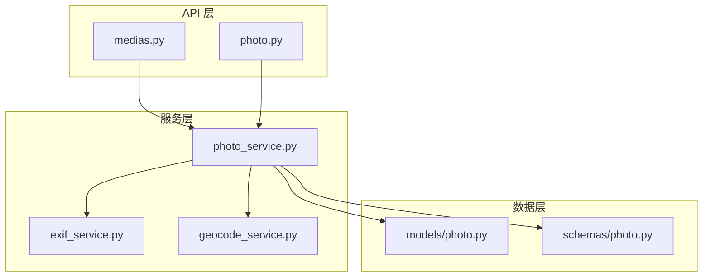
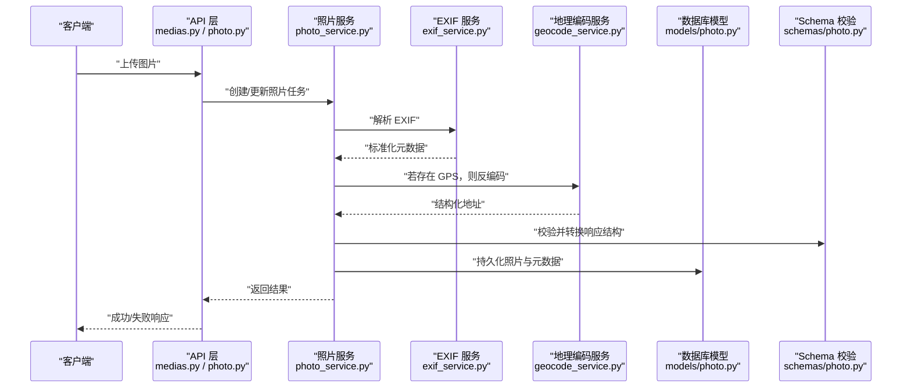
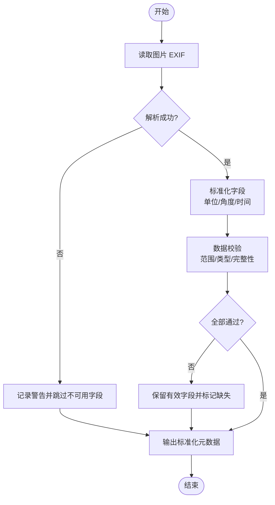
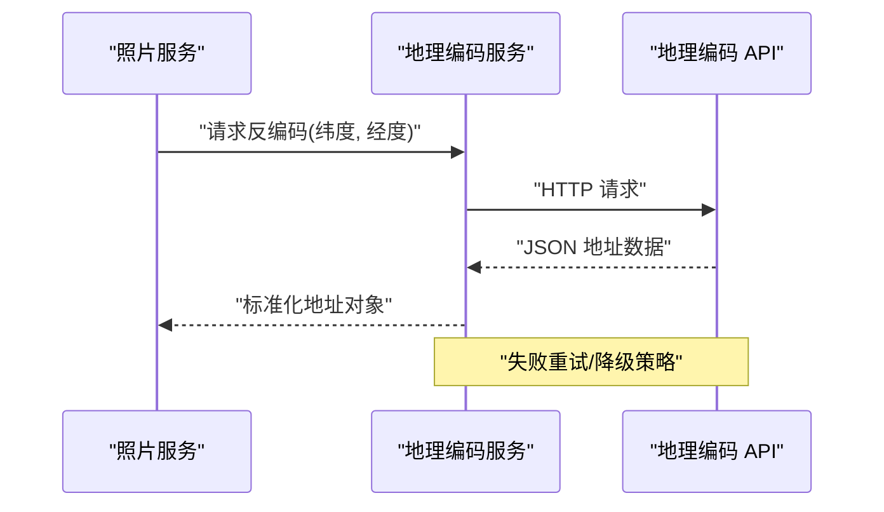
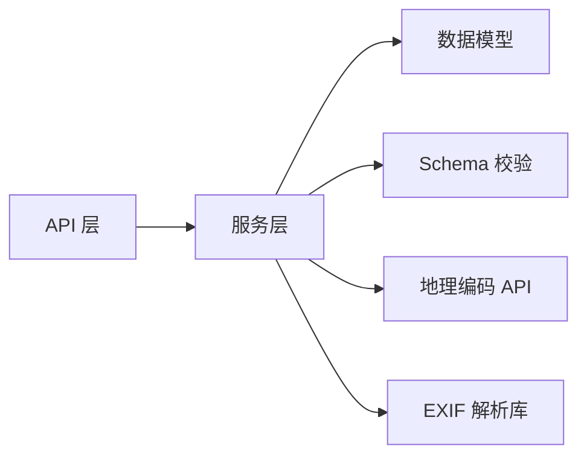

# 元数据服务

<cite>
**本文引用的文件**   
- [exif_service.py](file://backend/app/services/exif_service.py)
- [geocode_service.py](file://backend/app/services/geocode_service.py)
- [photo_service.py](file://backend/app/services/photo_service.py)
- [photo.py](file://backend/app/models/photo.py)
- [photo.py](file://backend/app/schemas/photo.py)
- [medias.py](file://backend/app/api/medias.py)
- [photo.py](file://backend/app/api/photo.py)
- [test_exif.py](file://backend/app/services/test/test_exif.py)
- [test_geocode.py](file://backend/app/services/test/test_geocode.py)
</cite>

## 目录
1. [简介](#简介)
2. [项目结构](#项目结构)
3. [核心组件](#核心组件)
4. [架构总览](#架构总览)
5. [详细组件分析](#详细组件分析)
6. [依赖关系分析](#依赖关系分析)
7. [性能考虑](#性能考虑)
8. [故障排查指南](#故障排查指南)
9. [结论](#结论)
10. [附录](#附录)

## 简介
本文件面向“元数据服务”，聚焦以下能力：
- EXIF 数据提取与字段映射
- GPS 坐标解析与时区处理
- 地理位置反编码（经纬度到地址）
- 支持的图片格式、数据验证规则
- 地理编码 API 集成与位置信息标准化
- 元数据缓存策略、批量处理优化、异常数据处理方案
- 与照片服务的集成方式、数据同步机制与性能优化技巧
- 隐私保护考虑、敏感信息过滤与数据安全处理

## 项目结构
围绕元数据服务的关键代码位于后端 services 层，并通过 API 层暴露给前端或上游系统。核心文件包括：
- EXIF 提取服务：负责读取图片 EXIF 并规范化为内部模型
- 地理编码服务：负责将 GPS 坐标转换为结构化地址
- 照片服务：协调上传、EXIF 解析、地理编码、持久化等流程
- 模型与 Schema：定义数据库模型与请求/响应结构
- API 路由：对外提供上传、查询、更新等接口

图表来源
- [medias.py](file://backend/app/api/medias.py)
- [photo.py](file://backend/app/api/photo.py)
- [exif_service.py](file://backend/app/services/exif_service.py)
- [geocode_service.py](file://backend/app/services/geocode_service.py)
- [photo_service.py](file://backend/app/services/photo_service.py)
- [photo.py](file://backend/app/models/photo.py)
- [photo.py](file://backend/app/schemas/photo.py)

章节来源
- [exif_service.py](file://backend/app/services/exif_service.py)
- [geocode_service.py](file://backend/app/services/geocode_service.py)
- [photo_service.py](file://backend/app/services/photo_service.py)
- [photo.py](file://backend/app/models/photo.py)
- [photo.py](file://backend/app/schemas/photo.py)
- [medias.py](file://backend/app/api/medias.py)
- [photo.py](file://backend/app/api/photo.py)

## 核心组件
- EXIF 提取器
  - 职责：从图片二进制中读取 EXIF，解析时间戳、相机参数、GPS 等，并进行单位/时区/坐标系标准化
  - 输入：图片字节流或路径
  - 输出：标准化的元数据对象（供后续写入数据库或返回给调用方）
- 地理编码服务
  - 职责：接收标准经纬度，调用外部地理编码 API，返回结构化地址；支持失败回退与重试
  - 输入：纬度、经度、可选语言/区域偏好
  - 输出：国家、省/州、城市、区县、街道等字段
- 照片服务（协调者）
  - 职责：编排上传、缩略图生成、EXIF 解析、地理编码、向量入库、索引更新等
  - 输入：上传的文件、用户上下文、任务队列消息
  - 输出：持久化的照片记录及关联的元数据

章节来源
- [exif_service.py](file://backend/app/services/exif_service.py)
- [geocode_service.py](file://backend/app/services/geocode_service.py)
- [photo_service.py](file://backend/app/services/photo_service.py)

## 架构总览
下图展示了从上传到元数据落库的主流程，以及关键的外部依赖与错误分支。

图表来源
- [medias.py](file://backend/app/api/medias.py)
- [photo.py](file://backend/app/api/photo.py)
- [photo_service.py](file://backend/app/services/photo_service.py)
- [exif_service.py](file://backend/app/services/exif_service.py)
- [geocode_service.py](file://backend/app/services/geocode_service.py)
- [photo.py](file://backend/app/models/photo.py)
- [photo.py](file://backend/app/schemas/photo.py)

## 详细组件分析

### EXIF 数据提取与字段映射
- 支持的图片格式
  - JPEG、PNG、WebP、HEIC/HEIF（取决于底层库能力）
- 关键字段映射
  - 拍摄时间：优先使用 DateTimeOriginal，其次 DateTimeDigitized，最后 DateTime
  - 相机信息：Make、Model、LensModel、Software
  - 图像参数：Width、Height、Orientation、ColorSpace、ExposureTime、FNumber、ISO、FocalLength
  - GPS：Latitude、Longitude、Altitude、Direction、GPSTimeStamp
- 数据验证规则
  - 数值范围校验（如 ISO、曝光时间、光圈值）
  - 方向角归一化（0-360°）
  - 经纬度范围校验（纬度 -90~90，经度 -180~180）
  - 缺失字段容错：未识别字段置空或默认值
- 时区处理逻辑
  - 若仅含 UTC 偏移或本地时间字符串，结合设备时区或服务器时区进行统一转换
  - 对无时区信息的 EXIF，采用配置项指定的默认时区或忽略该字段
- 异常数据处理
  - 损坏的 EXIF 头、不支持的标签、类型不匹配等情况均捕获并降级为可用子集
  - 记录警告日志以便审计与回溯

图表来源
- [exif_service.py](file://backend/app/services/exif_service.py)
- [test_exif.py](file://backend/app/services/test/test_exif.py)

章节来源
- [exif_service.py](file://backend/app/services/exif_service.py)
- [test_exif.py](file://backend/app/services/test/test_exif.py)

### GPS 坐标解析与时区处理
- 坐标解析
  - 支持 DMS（度分秒）、DD（十进制）两种表示
  - 自动根据方向标识（N/S/E/W）确定正负号
  - 海拔高度单位换算（米/英尺）
- 时区处理
  - 若 EXIF 包含 GPSTimeStamp，优先使用该时间作为定位基准
  - 若无 GPS 时间，使用拍摄时间或服务器当前时间
- 精度与有效性
  - 过滤无效坐标（如 0,0 或超出范围）
  - 对低精度 GPS 标记（如 HDOP/VDOP）可记录置信度

章节来源
- [exif_service.py](file://backend/app/services/exif_service.py)

### 地理位置反编码与 API 集成
- 集成点
  - 当检测到有效 GPS 时，调用地理编码服务获取结构化地址
  - 支持多提供商切换与失败回退（例如主服务不可用时切换到备用服务）
- 标准化输出
  - 国家、省/州、城市、区县、街道、门牌号、邮编
  - 语言/地区偏好控制
- 错误与重试
  - 网络超时、限流、配额耗尽等场景下指数退避重试
  - 失败时保留原始坐标，并在元数据中标记“地址解析失败”

图表来源
- [geocode_service.py](file://backend/app/services/geocode_service.py)
- [photo_service.py](file://backend/app/services/photo_service.py)
- [test_geocode.py](file://backend/app/services/test/test_geocode.py)

章节来源
- [geocode_service.py](file://backend/app/services/geocode_service.py)
- [test_geocode.py](file://backend/app/services/test/test_geocode.py)
- [photo_service.py](file://backend/app/services/photo_service.py)

### 数据模型与 Schema 映射
- 数据库模型（示例字段）
  - 基础信息：文件名、路径、大小、MIME 类型、上传时间
  - 拍摄信息：拍摄时间、相机型号、镜头、软件版本
  - 图像参数：宽高、方向、色彩空间、曝光、光圈、ISO、焦距
  - 位置信息：纬度、经度、海拔、解析后的地址 JSON
- Schema 校验
  - 入参校验：必填字段、类型约束、枚举值
  - 出参裁剪：按需隐藏敏感字段（如完整 EXIF 二进制片段）

章节来源
- [photo.py](file://backend/app/models/photo.py)
- [photo.py](file://backend/app/schemas/photo.py)

### 与照片服务的集成与数据同步
- 上传链路
  - API 接收文件 -> 照片服务调度 -> 写入存储 -> 触发 EXIF 解析 -> 可选地理编码 -> 写入数据库 -> 返回结果
- 异步任务
  - 大文件或高并发场景下，将 EXIF 解析与地理编码放入任务队列，避免阻塞请求
- 一致性保障
  - 事务边界：元数据与索引更新在同一事务内提交
  - 幂等性：重复上传同一文件指纹时去重或合并

章节来源
- [photo_service.py](file://backend/app/services/photo_service.py)
- [medias.py](file://backend/app/api/medias.py)
- [photo.py](file://backend/app/api/photo.py)

## 依赖关系分析
- 模块耦合
  - API 层仅依赖服务层，服务层依赖模型与 Schema，符合分层解耦原则
- 外部依赖
  - 地理编码 API（HTTP 客户端）
  - 图片 EXIF 解析库（如 Pillow、Piexif、exifread 等）
- 潜在循环依赖
  - 服务层之间通过接口/函数调用，避免直接相互导入造成循环

图表来源
- [medias.py](file://backend/app/api/medias.py)
- [photo.py](file://backend/app/api/photo.py)
- [photo_service.py](file://backend/app/services/photo_service.py)
- [exif_service.py](file://backend/app/services/exif_service.py)
- [geocode_service.py](file://backend/app/services/geocode_service.py)
- [photo.py](file://backend/app/models/photo.py)
- [photo.py](file://backend/app/schemas/photo.py)

章节来源
- [medias.py](file://backend/app/api/medias.py)
- [photo.py](file://backend/app/api/photo.py)
- [photo_service.py](file://backend/app/services/photo_service.py)
- [exif_service.py](file://backend/app/services/exif_service.py)
- [geocode_service.py](file://backend/app/services/geocode_service.py)
- [photo.py](file://backend/app/models/photo.py)
- [photo.py](file://backend/app/schemas/photo.py)

## 性能考虑
- 批处理优化
  - 批量上传时并行解析 EXIF，限制并发度以避免 I/O 抖动
  - 地理编码批量请求合并与去重（相同坐标只解析一次）
- 缓存策略
  - 内存缓存：最近 N 个文件的 EXIF 结果（按文件指纹键）
  - 磁盘/Redis 缓存：地理编码结果按经纬度+语言键缓存，设置合理 TTL
- 计算卸载
  - 将耗时操作（EXIF、地理编码、缩略图）放入后台任务队列
- 资源控制
  - 连接池复用 HTTP 客户端
  - 图片解析时限制最大尺寸与通道数，避免 OOM

[本节为通用指导，无需特定文件引用]

## 故障排查指南
- 常见问题
  - EXIF 解析失败：检查文件格式是否受支持、文件是否损坏、权限是否足够
  - 地理编码失败：检查网络连通性、API Key 配额、重试次数与退避策略
  - 坐标无效：确认 GPS 字段是否存在且范围合法
- 诊断建议
  - 开启调试日志，记录关键步骤的输入输出摘要（脱敏）
  - 对失败案例保留原始二进制片段与请求 ID，便于复现
  - 使用测试用例覆盖典型异常路径（见测试文件）

章节来源
- [test_exif.py](file://backend/app/services/test/test_exif.py)
- [test_geocode.py](file://backend/app/services/test/test_geocode.py)

## 结论
本元数据服务以清晰的分层架构实现了 EXIF 提取、GPS 解析与地理反编码，并通过 Schema 校验与模型映射确保数据一致性与可用性。在性能方面，借助缓存、批处理与异步任务提升吞吐与稳定性。在安全与隐私方面，建议对敏感字段进行过滤与最小化暴露，并对外部 API 调用进行鉴权与限流。

[本节为总结性内容，无需特定文件引用]

## 附录
- 术语
  - EXIF：可交换图像文件格式的元数据标准
  - GPS：全球定位系统，用于记录经纬度与海拔
  - 地理编码：将经纬度转换为可读地址的过程
- 参考实现路径
  - EXIF 解析与校验：参见 EXIF 服务与对应测试
  - 地理编码与重试：参见地理编码服务与对应测试
  - 上传与编排：参见照片服务与 API 路由

[本节为补充说明，无需特定文件引用]