# 标签管理服务

<cite>
**本文引用的文件**   
- [tag_service.py](file://backend/app/services/tag_service.py)
- [photo_service.py](file://backend/app/services/photo_service.py)
- [album_service.py](file://backend/app/services/album_service.py)
- [search_service.py](file://backend/app/services/search_service.py)
- [detection_service.py](file://backend/app/services/detection_service.py)
- [training_service.py](file://backend/app/services/training_service.py)
- [trainer.py](file://backend/app/services/trainer.py)
- [config.py](file://backend/app/services/train/config.py)
- [data_converter.py](file://backend/app/services/train/data_converter.py)
- [train_lvis.py](file://backend/app/services/train/train_lvis.py)
- [embedding.py](file://backend/app/services/ai_providers/embedding.py)
- [photo.py](file://backend/app/models/photo.py)
- [album.py](file://backend/app/models/album.py)
- [task.py](file://backend/app/models/task.py)
- [photo_api.py](file://backend/app/api/photo.py)
- [album_api.py](file://backend/app/api/album.py)
- [tasks_dispatcher.py](file://backend/app/tasks/dispatcher.py)
- [detection_tasks.py](file://backend/app/tasks/detection_tasks.py)
- [vector_tasks.py](file://backend/app/tasks/vector_tasks.py)
</cite>

## 目录
1. [简介](#简介)
2. [项目结构](#项目结构)
3. [核心组件](#核心组件)
4. [架构总览](#架构总览)
5. [详细组件分析](#详细组件分析)
6. [依赖关系分析](#依赖关系分析)
7. [性能考虑](#性能考虑)
8. [故障排查指南](#故障排查指南)
9. [结论](#结论)
10. [附录](#附录)

## 简介
本文件面向“标签管理服务”的完整实现与使用，覆盖自动标签生成、手动标注、标签关联管理、AI模型集成识别流程、权重计算与推荐算法、层次结构与合并去重、批量操作、搜索索引构建、统计分析、热门标签推荐、与照片/相册的关联与同步、训练数据收集与微调、准确率评估等主题。文档以代码级事实为依据，辅以架构图与时序图帮助理解。

## 项目结构
后端采用分层设计：API层暴露接口，服务层封装业务逻辑，任务层处理异步工作流（检测、向量化、索引更新），模型与训练模块提供AI能力与微调支持。标签相关能力主要分布在服务层与任务层，并通过数据库模型与API进行交互。

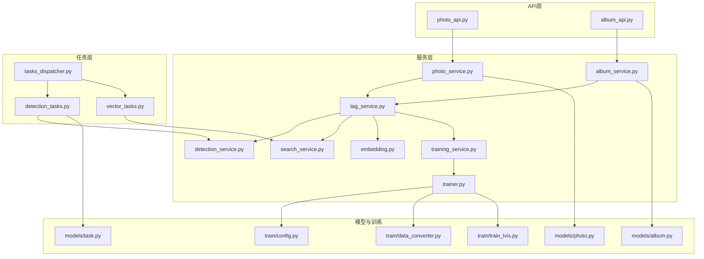

图表来源
- [photo_api.py](file://backend/app/api/photo.py)
- [album_api.py](file://backend/app/api/album.py)
- [tag_service.py](file://backend/app/services/tag_service.py)
- [photo_service.py](file://backend/app/services/photo_service.py)
- [album_service.py](file://backend/app/services/album_service.py)
- [search_service.py](file://backend/app/services/search_service.py)
- [detection_service.py](file://backend/app/services/detection_service.py)
- [training_service.py](file://backend/app/services/training_service.py)
- [trainer.py](file://backend/app/services/trainer.py)
- [embedding.py](file://backend/app/services/ai_providers/embedding.py)
- [dispatcher.py](file://backend/app/tasks/dispatcher.py)
- [detection_tasks.py](file://backend/app/tasks/detection_tasks.py)
- [vector_tasks.py](file://backend/app/tasks/vector_tasks.py)
- [photo.py](file://backend/app/models/photo.py)
- [album.py](file://backend/app/models/album.py)
- [task.py](file://backend/app/models/task.py)
- [config.py](file://backend/app/services/train/config.py)
- [data_converter.py](file://backend/app/services/train/data_converter.py)
- [train_lvis.py](file://backend/app/services/train/train_lvis.py)

章节来源
- [tag_service.py](file://backend/app/services/tag_service.py)
- [photo_service.py](file://backend/app/services/photo_service.py)
- [album_service.py](file://backend/app/services/album_service.py)
- [search_service.py](file://backend/app/services/search_service.py)
- [detection_service.py](file://backend/app/services/detection_service.py)
- [training_service.py](file://backend/app/services/training_service.py)
- [trainer.py](file://backend/app/services/trainer.py)
- [config.py](file://backend/app/services/train/config.py)
- [data_converter.py](file://backend/app/services/train/data_converter.py)
- [train_lvis.py](file://backend/app/services/train/train_lvis.py)
- [embedding.py](file://backend/app/services/ai_providers/embedding.py)
- [photo.py](file://backend/app/models/photo.py)
- [album.py](file://backend/app/models/album.py)
- [task.py](file://backend/app/models/task.py)
- [photo_api.py](file://backend/app/api/photo.py)
- [album_api.py](file://backend/app/api/album.py)
- [tasks_dispatcher.py](file://backend/app/tasks/dispatcher.py)
- [detection_tasks.py](file://backend/app/tasks/detection_tasks.py)
- [vector_tasks.py](file://backend/app/tasks/vector_tasks.py)

## 核心组件
- 标签服务(tag_service.py)：封装标签CRUD、层级管理、合并去重、权重计算、推荐、统计与热门标签；协调与照片/相册的关联与同步。
- 检测服务(detection_service.py)：调用AI模型进行目标/场景识别，产出候选标签及置信度。
- 向量服务(embedding.py)：提供文本/图像嵌入能力，用于相似度检索与推荐。
- 搜索服务(search_service.py)：维护标签搜索索引，支持按标签检索照片/相册。
- 训练服务(training_service.py)与训练器(trainer.py)：组织训练数据、执行微调、评估指标。
- 任务调度(dispatcher.py)与任务(detection_tasks.py, vector_tasks.py)：异步触发检测、向量化与索引更新。
- API(photo_api.py, album_api.py)：对外暴露标签相关接口。

章节来源
- [tag_service.py](file://backend/app/services/tag_service.py)
- [detection_service.py](file://backend/app/services/detection_service.py)
- [embedding.py](file://backend/app/services/ai_providers/embedding.py)
- [search_service.py](file://backend/app/services/search_service.py)
- [training_service.py](file://backend/app/services/training_service.py)
- [trainer.py](file://backend/app/services/trainer.py)
- [tasks_dispatcher.py](file://backend/app/tasks/dispatcher.py)
- [detection_tasks.py](file://backend/app/tasks/detection_tasks.py)
- [vector_tasks.py](file://backend/app/tasks/vector_tasks.py)
- [photo_api.py](file://backend/app/api/photo.py)
- [album_api.py](file://backend/app/api/album.py)

## 架构总览
标签管理贯穿“上传→检测→打标→索引→检索→推荐→训练→评估”的全链路。关键路径如下：
- 自动标签生成：图片入库后触发检测任务，模型输出候选标签与置信度，服务层进行阈值过滤、权重计算、去重合并，并持久化到照片/相册关联表。
- 手动标注：用户通过API对照片/相册增删改标签，服务层同步更新索引与统计。
- 标签推荐：基于向量相似度与历史共现统计，结合权重与热度，返回Top-N推荐。
- 搜索索引：为标签建立倒排或向量索引，支持快速检索。
- 训练与评估：从标注数据中抽取样本，执行微调，输出准确率、召回率等指标。

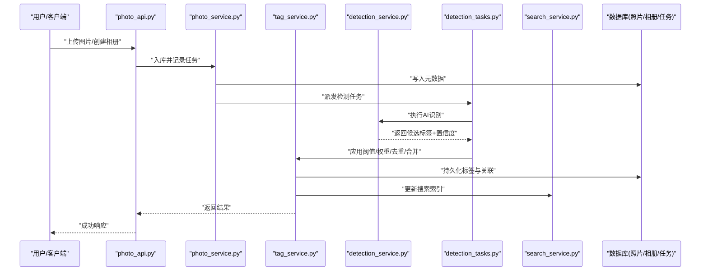

图表来源
- [photo_api.py](file://backend/app/api/photo.py)
- [photo_service.py](file://backend/app/services/photo_service.py)
- [tag_service.py](file://backend/app/services/tag_service.py)
- [detection_service.py](file://backend/app/services/detection_service.py)
- [detection_tasks.py](file://backend/app/tasks/detection_tasks.py)
- [search_service.py](file://backend/app/services/search_service.py)
- [task.py](file://backend/app/models/task.py)

## 详细组件分析

### 标签服务(tag_service.py)
职责与能力
- 标签CRUD：创建、查询、更新、删除标签实体。
- 层次结构：支持父/子标签树形结构，提供遍历、路径解析、祖先/后代查询。
- 合并去重：基于语义相似度与名称匹配策略，合并重复标签，迁移关联关系。
- 权重计算：综合置信度、人工修正、共现频率、时间衰减等因素计算最终权重。
- 推荐算法：基于向量相似度、共现矩阵与热度排序，返回Top-N推荐。
- 统计分析：标签频次、分布、趋势、覆盖率等。
- 关联管理：与照片/相册的多对多关联，支持批量添加/移除/替换。
- 同步机制：在关联变更时触发索引重建与统计更新。

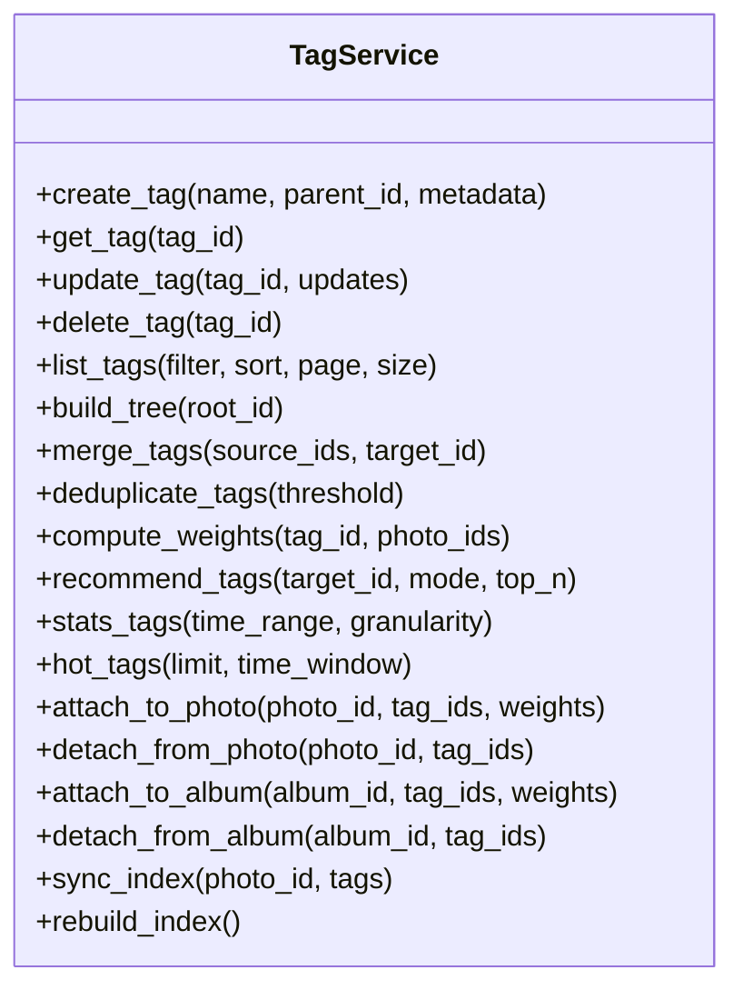

图表来源
- [tag_service.py](file://backend/app/services/tag_service.py)

章节来源
- [tag_service.py](file://backend/app/services/tag_service.py)

### 自动标签生成与AI模型集成
- 识别流程：检测任务由任务调度器分发至检测任务处理器，调用检测服务执行推理，得到候选标签与置信度。
- 阈值与权重：服务层根据配置阈值过滤低置信度结果，结合人工修正与历史共现计算最终权重。
- 去重合并：对相似标签进行合并，迁移关联并保留权重信息。
- 索引更新：将新标签写入搜索索引，保证检索一致性。

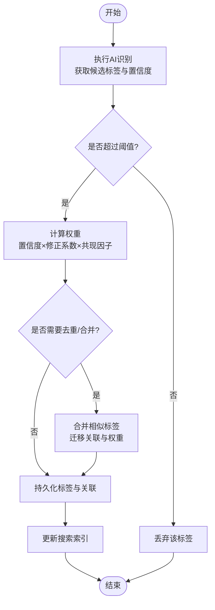

图表来源
- [detection_tasks.py](file://backend/app/tasks/detection_tasks.py)
- [detection_service.py](file://backend/app/services/detection_service.py)
- [tag_service.py](file://backend/app/services/tag_service.py)
- [search_service.py](file://backend/app/services/search_service.py)

章节来源
- [detection_tasks.py](file://backend/app/tasks/detection_tasks.py)
- [detection_service.py](file://backend/app/services/detection_service.py)
- [tag_service.py](file://backend/app/services/tag_service.py)
- [search_service.py](file://backend/app/services/search_service.py)

### 手动标签标注与批量操作
- 单条标注：对指定照片/相册添加/移除/更新标签，支持设置权重与备注。
- 批量操作：支持批量附加、批量分离、批量替换标签集合，内部事务保证一致性。
- 校验与幂等：重复添加会合并权重；删除不存在的关联会被忽略。

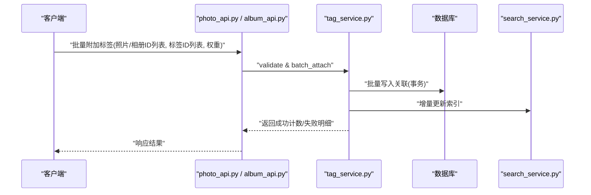

图表来源
- [photo_api.py](file://backend/app/api/photo.py)
- [album_api.py](file://backend/app/api/album.py)
- [tag_service.py](file://backend/app/services/tag_service.py)
- [search_service.py](file://backend/app/services/search_service.py)

章节来源
- [photo_api.py](file://backend/app/api/photo.py)
- [album_api.py](file://backend/app/api/album.py)
- [tag_service.py](file://backend/app/services/tag_service.py)

### 标签层次结构管理
- 树形结构：每个标签可拥有父标签，形成多级分类体系。
- 路径与继承：查询时可返回完整路径；子标签可继承父标签的部分属性（如默认权重）。
- 约束：禁止循环引用，限制最大深度，确保结构稳定。

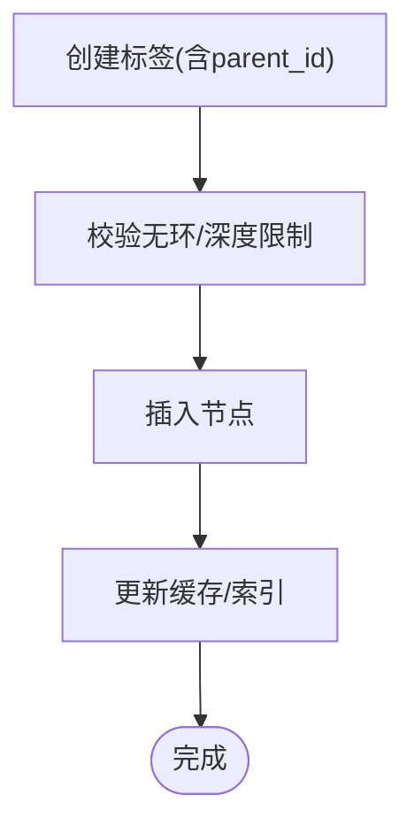

图表来源
- [tag_service.py](file://backend/app/services/tag_service.py)

章节来源
- [tag_service.py](file://backend/app/services/tag_service.py)

### 标签合并去重
- 相似度判定：基于名称编辑距离与向量相似度双通道判定。
- 合并策略：选择目标标签作为主键，迁移所有关联与权重，保留审计日志。
- 回滚与补偿：合并失败需回滚关联迁移，保证数据一致性。

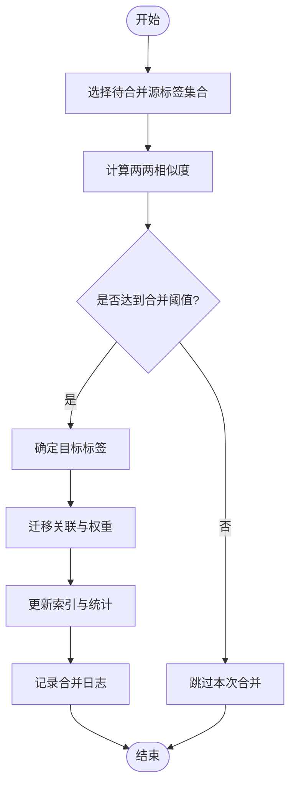

图表来源
- [tag_service.py](file://backend/app/services/tag_service.py)

章节来源
- [tag_service.py](file://backend/app/services/tag_service.py)

### 标签权重计算与推荐算法
- 权重组成：基础置信度、人工修正系数、共现频率、时间衰减、用户活跃度等。
- 推荐模式：
  - 相似内容推荐：基于向量相似度，返回与目标照片/相册最相似的标签。
  - 共现推荐：基于历史共现矩阵，返回高频搭配标签。
  - 热门推荐：基于时间窗口内的使用频次与热度评分。
- Top-N排序：加权融合得分，按降序返回。

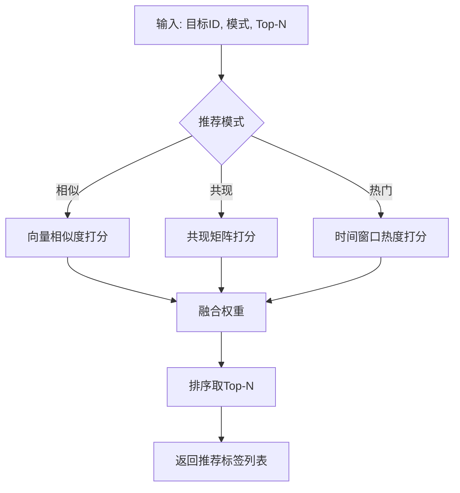

图表来源
- [tag_service.py](file://backend/app/services/tag_service.py)
- [embedding.py](file://backend/app/services/ai_providers/embedding.py)

章节来源
- [tag_service.py](file://backend/app/services/tag_service.py)
- [embedding.py](file://backend/app/services/ai_providers/embedding.py)

### 标签搜索索引构建与检索
- 索引类型：倒排索引（标签→资源ID）与向量索引（标签/描述→向量）。
- 构建策略：全量重建与增量更新并存，后台任务定期优化。
- 检索流程：关键词/标签→解析与扩展→检索→排序→分页返回。

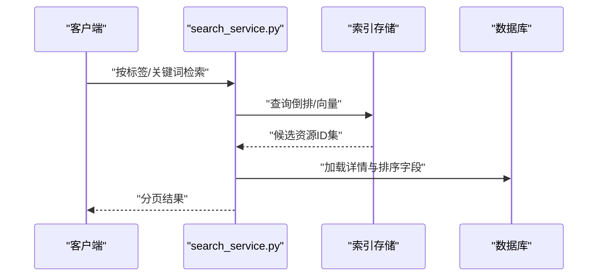

图表来源
- [search_service.py](file://backend/app/services/search_service.py)

章节来源
- [search_service.py](file://backend/app/services/search_service.py)

### 标签统计分析
- 指标：标签总数、活跃标签数、覆盖率、平均权重、长尾分布。
- 维度：按时间范围、粒度（日/周/月）、资源类型（照片/相册）聚合。
- 输出：报表数据与可视化所需的结构化JSON。

章节来源
- [tag_service.py](file://backend/app/services/tag_service.py)

### 热门标签推荐
- 定义：在给定时间窗口内使用频次高且稳定的标签。
- 算法：频次×稳定性惩罚（方差倒数）×衰减函数，归一化后排序。
- 用途：首页推荐、侧边栏导航、智能相册自动分类。

章节来源
- [tag_service.py](file://backend/app/services/tag_service.py)

### 标签与照片、相册的关联关系管理
- 关系模型：照片-标签、相册-标签均为多对多，附带权重与来源（自动/手动）。
- 同步机制：关联变更触发索引更新与统计刷新，保证读写一致。
- 事务性：批量操作使用事务，失败回滚。

章节来源
- [photo.py](file://backend/app/models/photo.py)
- [album.py](file://backend/app/models/album.py)
- [tag_service.py](file://backend/app/services/tag_service.py)

### 数据同步机制
- 事件驱动：新增/修改/删除标签或关联时发布事件，消费者更新索引与统计。
- 重试与补偿：失败任务进入死信队列，定时重试与人工干预。
- 幂等性：同一事件的多次投递不会导致重复数据。

章节来源
- [tasks_dispatcher.py](file://backend/app/tasks/dispatcher.py)
- [detection_tasks.py](file://backend/app/tasks/detection_tasks.py)
- [vector_tasks.py](file://backend/app/tasks/vector_tasks.py)

### 标签训练数据收集与模型微调
- 数据收集：从已标注照片/相册中提取正负样本，包含图像与标签映射。
- 数据转换：统一格式、增强、划分训练/验证/测试集。
- 微调流程：加载预训练模型，配置超参，启动训练，保存最佳权重。
- 评估方法：准确率、召回率、F1、mAP等，输出报告与混淆矩阵。

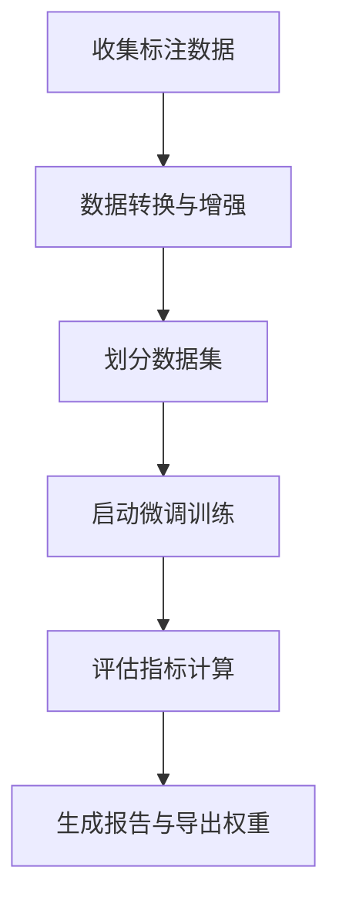

图表来源
- [training_service.py](file://backend/app/services/training_service.py)
- [trainer.py](file://backend/app/services/trainer.py)
- [config.py](file://backend/app/services/train/config.py)
- [data_converter.py](file://backend/app/services/train/data_converter.py)
- [train_lvis.py](file://backend/app/services/train/train_lvis.py)

章节来源
- [training_service.py](file://backend/app/services/training_service.py)
- [trainer.py](file://backend/app/services/trainer.py)
- [config.py](file://backend/app/services/train/config.py)
- [data_converter.py](file://backend/app/services/train/data_converter.py)
- [train_lvis.py](file://backend/app/services/train/train_lvis.py)

## 依赖关系分析
- 服务耦合：标签服务依赖检测服务、向量服务、搜索服务与训练服务；API层仅依赖服务层，保持松耦合。
- 任务解耦：检测与向量化任务通过调度器异步执行，降低主线程阻塞风险。
- 外部依赖：AI提供商嵌入能力、数据库与索引存储。

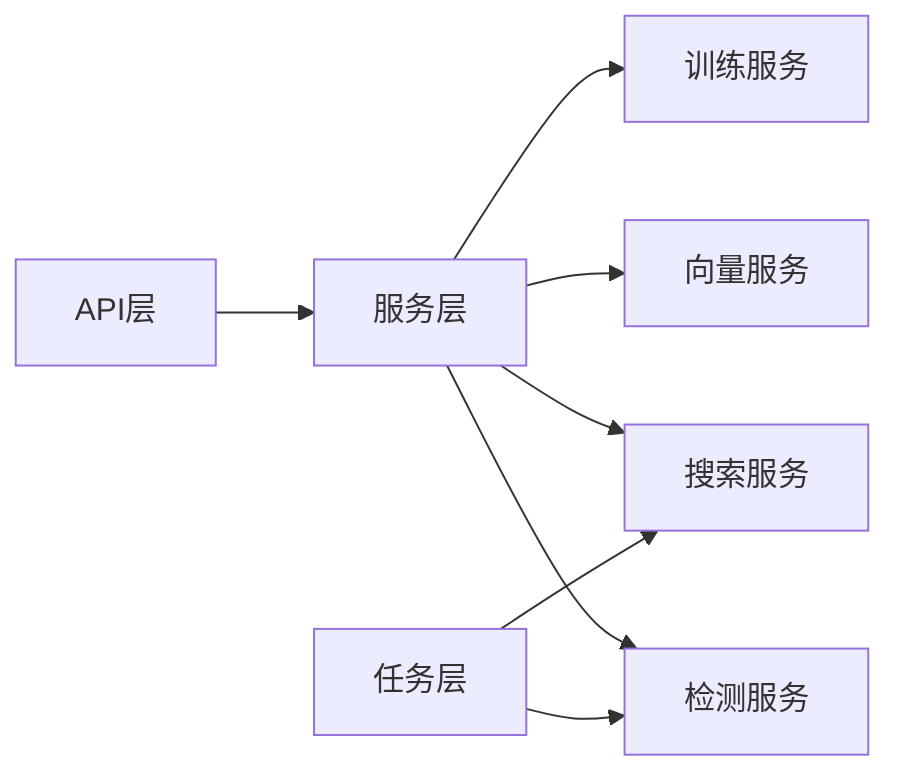

图表来源
- [photo_api.py](file://backend/app/api/photo.py)
- [album_api.py](file://backend/app/api/album.py)
- [tag_service.py](file://backend/app/services/tag_service.py)
- [detection_service.py](file://backend/app/services/detection_service.py)
- [embedding.py](file://backend/app/services/ai_providers/embedding.py)
- [search_service.py](file://backend/app/services/search_service.py)
- [training_service.py](file://backend/app/services/training_service.py)
- [tasks_dispatcher.py](file://backend/app/tasks/dispatcher.py)
- [detection_tasks.py](file://backend/app/tasks/detection_tasks.py)
- [vector_tasks.py](file://backend/app/tasks/vector_tasks.py)

章节来源
- [photo_api.py](file://backend/app/api/photo.py)
- [album_api.py](file://backend/app/api/album.py)
- [tag_service.py](file://backend/app/services/tag_service.py)
- [detection_service.py](file://backend/app/services/detection_service.py)
- [embedding.py](file://backend/app/services/ai_providers/embedding.py)
- [search_service.py](file://backend/app/services/search_service.py)
- [training_service.py](file://backend/app/services/training_service.py)
- [tasks_dispatcher.py](file://backend/app/tasks/dispatcher.py)
- [detection_tasks.py](file://backend/app/tasks/detection_tasks.py)
- [vector_tasks.py](file://backend/app/tasks/vector_tasks.py)

## 性能考虑
- 批量操作：尽量使用批量API减少往返次数，内部事务提升吞吐。
- 索引更新：增量更新优先，全量重建在低峰期执行。
- 权重计算：缓存热点标签的权重与统计，避免重复计算。
- 任务队列：检测与向量化任务异步化，避免阻塞请求。
- 内存与IO：大对象分块处理，合理设置批大小与并发度。

## 故障排查指南
- 常见问题
  - 标签未出现在搜索结果：检查索引更新任务是否成功，确认增量/全量重建是否完成。
  - 自动标签缺失：查看检测任务状态与日志，确认阈值配置与模型可用性。
  - 合并失败：核对相似度过载与事务回滚情况，检查审计日志定位问题。
  - 推荐不准确：调整权重参数与相似度阈值，补充高质量标注数据。
- 诊断步骤
  - 查看任务调度器与任务执行日志，确认任务生命周期。
  - 检查数据库关联表的一致性，必要时执行一致性校验脚本。
  - 对比训练前后指标变化，定位模型退化或过拟合。

章节来源
- [tasks_dispatcher.py](file://backend/app/tasks/dispatcher.py)
- [detection_tasks.py](file://backend/app/tasks/detection_tasks.py)
- [vector_tasks.py](file://backend/app/tasks/vector_tasks.py)
- [tag_service.py](file://backend/app/services/tag_service.py)

## 结论
标签管理服务围绕“自动识别+手动标注+智能推荐+高效检索+持续训练”的核心闭环构建。通过清晰的分层与任务解耦，系统在可扩展性与可维护性方面具备良好基础。后续可进一步优化相似度判定、权重融合策略与索引结构，以提升推荐质量与检索性能。

## 附录
- 术语
  - 标签：用于描述照片/相册内容的语义标记。
  - 权重：表示标签重要性的数值，影响排序与推荐。
  - 共现：两个标签在同一资源上同时出现的现象。
  - 倒排索引：从标签到资源ID的映射结构。
- 参考实现路径
  - 标签服务核心逻辑：[tag_service.py](file://backend/app/services/tag_service.py)
  - 检测与任务：[detection_service.py](file://backend/app/services/detection_service.py)、[detection_tasks.py](file://backend/app/tasks/detection_tasks.py)
  - 向量与搜索：[embedding.py](file://backend/app/services/ai_providers/embedding.py)、[search_service.py](file://backend/app/services/search_service.py)
  - 训练与评估：[training_service.py](file://backend/app/services/training_service.py)、[trainer.py](file://backend/app/services/trainer.py)、[config.py](file://backend/app/services/train/config.py)、[data_converter.py](file://backend/app/services/train/data_converter.py)、[train_lvis.py](file://backend/app/services/train/train_lvis.py)
  - 模型与API：[photo.py](file://backend/app/models/photo.py)、[album.py](file://backend/app/models/album.py)、[task.py](file://backend/app/models/task.py)、[photo_api.py](file://backend/app/api/photo.py)、[album_api.py](file://backend/app/api/album.py)