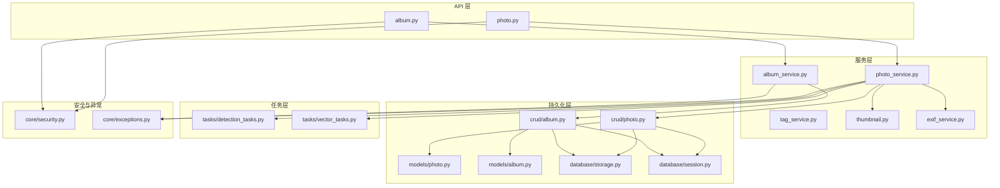
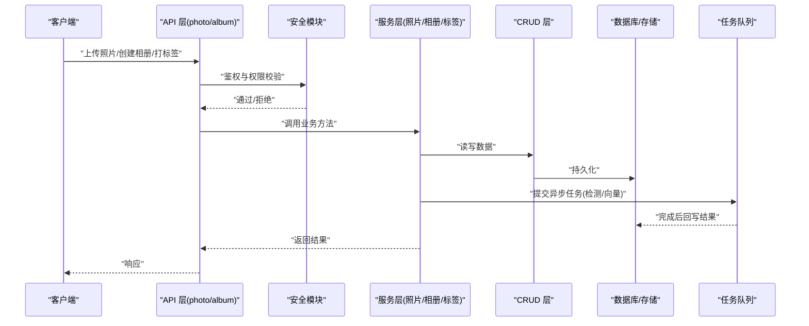
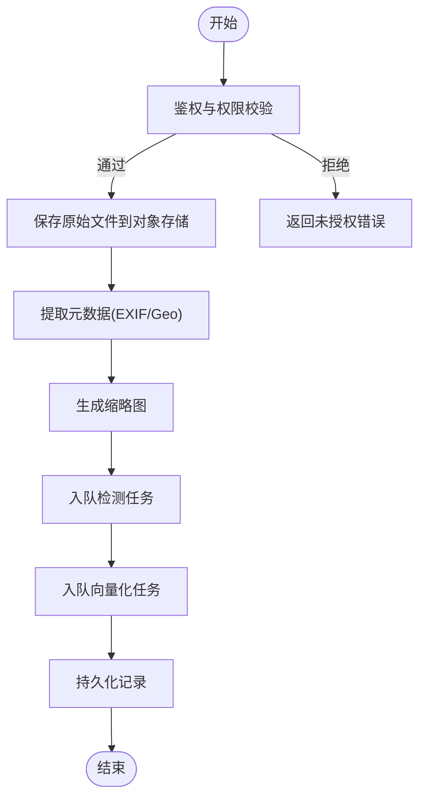
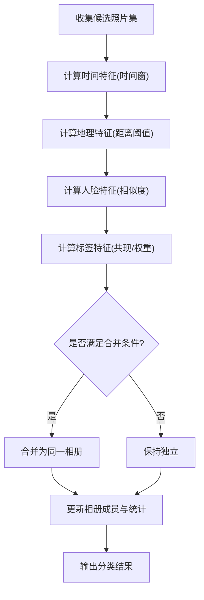
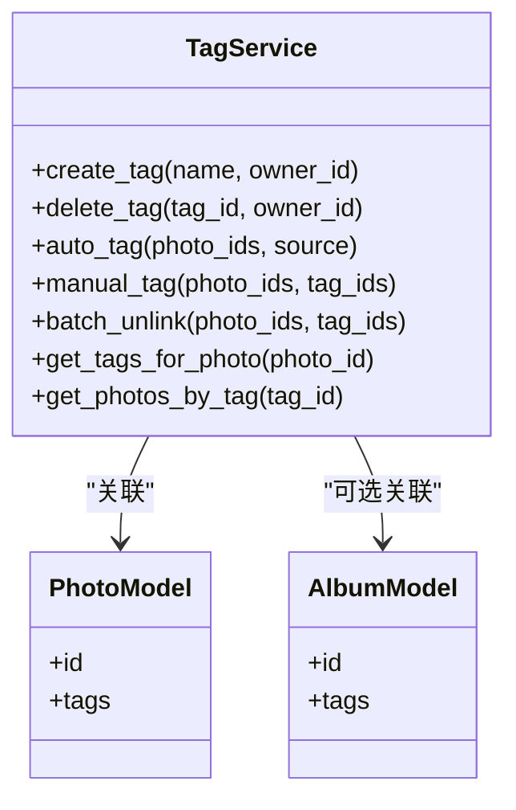
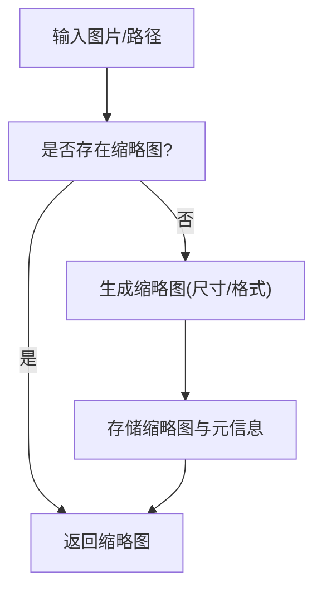
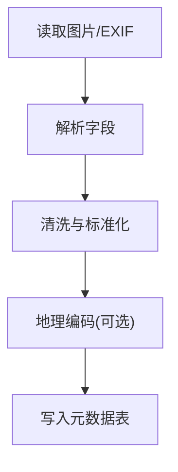
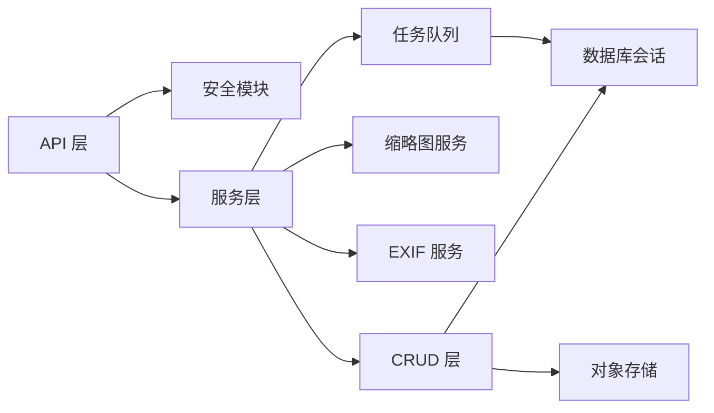

# 核心业务服务

<cite>
**本文引用的文件**   
- [backend/app/services/photo_service.py](file://backend/app/services/photo_service.py)
- [backend/app/services/album_service.py](file://backend/app/services/album_service.py)
- [backend/app/services/tag_service.py](file://backend/app/services/tag_service.py)
- [backend/app/services/thumbnail.py](file://backend/app/services/thumbnail.py)
- [backend/app/services/exif_service.py](file://backend/app/services/exif_service.py)
- [backend/app/api/photo.py](file://backend/app/api/photo.py)
- [backend/app/api/album.py](file://backend/app/api/album.py)
- [backend/app/crud/photo.py](file://backend/app/crud/photo.py)
- [backend/app/crud/album.py](file://backend/app/crud/album.py)
- [backend/app/models/photo.py](file://backend/app/models/photo.py)
- [backend/app/models/album.py](file://backend/app/models/album.py)
- [backend/app/database/storage.py](file://backend/app/database/storage.py)
- [backend/app/database/session.py](file://backend/app/database/session.py)
- [backend/app/core/security.py](file://backend/app/core/security.py)
- [backend/app/core/exceptions.py](file://backend/app/core/exceptions.py)
- [backend/app/tasks/detection_tasks.py](file://backend/app/tasks/detection_tasks.py)
- [backend/app/tasks/vector_tasks.py](file://backend/app/tasks/vector_tasks.py)
</cite>

## 目录
1. [简介](#简介)
2. [项目结构](#项目结构)
3. [核心组件](#核心组件)
4. [架构总览](#架构总览)
5. [详细组件分析](#详细组件分析)
6. [依赖关系分析](#依赖关系分析)
7. [性能考虑](#性能考虑)
8. [故障排查指南](#故障排查指南)
9. [结论](#结论)
10. [附录](#附录)

## 简介
本文件面向“照片管理服务、相册管理服务和标签服务”的核心业务实现，系统性阐述以下方面：
- 文件上传与下载流程
- 元数据提取处理（EXIF/地理信息）
- 缩略图生成机制
- 相册智能分类算法与批量操作
- 权限控制与事务一致性
- 标签系统的自动打标、手动标注与关联
- 服务间依赖关系、错误处理策略与性能优化建议

## 项目结构
后端采用分层架构：API 层负责路由与参数校验；Service 层封装业务逻辑；CRUD 层负责数据库访问；Models 定义数据模型；Tasks 提供异步任务；Database 提供存储与会话。

图表来源
- [backend/app/api/photo.py](file://backend/app/api/photo.py)
- [backend/app/api/album.py](file://backend/app/api/album.py)
- [backend/app/services/photo_service.py](file://backend/app/services/photo_service.py)
- [backend/app/services/album_service.py](file://backend/app/services/album_service.py)
- [backend/app/services/tag_service.py](file://backend/app/services/tag_service.py)
- [backend/app/services/thumbnail.py](file://backend/app/services/thumbnail.py)
- [backend/app/services/exif_service.py](file://backend/app/services/exif_service.py)
- [backend/app/crud/photo.py](file://backend/app/crud/photo.py)
- [backend/app/crud/album.py](file://backend/app/crud/album.py)
- [backend/app/models/photo.py](file://backend/app/models/photo.py)
- [backend/app/models/album.py](file://backend/app/models/album.py)
- [backend/app/database/storage.py](file://backend/app/database/storage.py)
- [backend/app/database/session.py](file://backend/app/database/session.py)
- [backend/app/core/security.py](file://backend/app/core/security.py)
- [backend/app/core/exceptions.py](file://backend/app/core/exceptions.py)
- [backend/app/tasks/detection_tasks.py](file://backend/app/tasks/detection_tasks.py)
- [backend/app/tasks/vector_tasks.py](file://backend/app/tasks/vector_tasks.py)

章节来源
- [backend/app/api/photo.py](file://backend/app/api/photo.py)
- [backend/app/api/album.py](file://backend/app/api/album.py)
- [backend/app/services/photo_service.py](file://backend/app/services/photo_service.py)
- [backend/app/services/album_service.py](file://backend/app/services/album_service.py)
- [backend/app/services/tag_service.py](file://backend/app/services/tag_service.py)
- [backend/app/services/thumbnail.py](file://backend/app/services/thumbnail.py)
- [backend/app/services/exif_service.py](file://backend/app/services/exif_service.py)
- [backend/app/crud/photo.py](file://backend/app/crud/photo.py)
- [backend/app/crud/album.py](file://backend/app/crud/album.py)
- [backend/app/models/photo.py](file://backend/app/models/photo.py)
- [backend/app/models/album.py](file://backend/app/models/album.py)
- [backend/app/database/storage.py](file://backend/app/database/storage.py)
- [backend/app/database/session.py](file://backend/app/database/session.py)
- [backend/app/core/security.py](file://backend/app/core/security.py)
- [backend/app/core/exceptions.py](file://backend/app/core/exceptions.py)
- [backend/app/tasks/detection_tasks.py](file://backend/app/tasks/detection_tasks.py)
- [backend/app/tasks/vector_tasks.py](file://backend/app/tasks/vector_tasks.py)

## 核心组件
- 照片管理服务：负责文件上传、下载、元数据提取、缩略图生成、向量入库、检测任务调度等。
- 相册管理服务：负责相册的创建、更新、删除、成员管理、智能分类、批量操作等。
- 标签服务：负责标签的增删改查、自动打标、手动标注、与照片/相册的关联。

章节来源
- [backend/app/services/photo_service.py](file://backend/app/services/photo_service.py)
- [backend/app/services/album_service.py](file://backend/app/services/album_service.py)
- [backend/app/services/tag_service.py](file://backend/app/services/tag_service.py)

## 架构总览
系统以“API -> Service -> CRUD -> Database/Storage”为主干，辅以“任务队列”进行耗时操作（如人脸检测、向量化）。安全模块在 API 层进行鉴权，异常模块统一抛出与捕获。

图表来源
- [backend/app/api/photo.py](file://backend/app/api/photo.py)
- [backend/app/api/album.py](file://backend/app/api/album.py)
- [backend/app/core/security.py](file://backend/app/core/security.py)
- [backend/app/services/photo_service.py](file://backend/app/services/photo_service.py)
- [backend/app/services/album_service.py](file://backend/app/services/album_service.py)
- [backend/app/crud/photo.py](file://backend/app/crud/photo.py)
- [backend/app/crud/album.py](file://backend/app/crud/album.py)
- [backend/app/database/storage.py](file://backend/app/database/storage.py)
- [backend/app/database/session.py](file://backend/app/database/session.py)
- [backend/app/tasks/detection_tasks.py](file://backend/app/tasks/detection_tasks.py)
- [backend/app/tasks/vector_tasks.py](file://backend/app/tasks/vector_tasks.py)

## 详细组件分析

### 照片管理服务
职责边界
- 接收上传文件，落盘并记录元数据
- 生成缩略图
- 提取 EXIF/地理位置等元数据
- 触发检测与向量化任务
- 提供查询、批量操作接口

关键流程
- 上传流程：校验权限 -> 写入对象存储 -> 记录数据库 -> 生成缩略图 -> 入队检测/向量任务
- 下载流程：鉴权 -> 校验资源归属 -> 从对象存储读取流式返回
- 元数据处理：解析 EXIF、时间/地点/设备信息，必要时调用地理编码
- 缩略图：按配置尺寸生成，缓存命中优先

图表来源
- [backend/app/api/photo.py](file://backend/app/api/photo.py)
- [backend/app/services/photo_service.py](file://backend/app/services/photo_service.py)
- [backend/app/services/thumbnail.py](file://backend/app/services/thumbnail.py)
- [backend/app/services/exif_service.py](file://backend/app/services/exif_service.py)
- [backend/app/tasks/detection_tasks.py](file://backend/app/tasks/detection_tasks.py)
- [backend/app/tasks/vector_tasks.py](file://backend/app/tasks/vector_tasks.py)
- [backend/app/database/storage.py](file://backend/app/database/storage.py)
- [backend/app/core/security.py](file://backend/app/core/security.py)

章节来源
- [backend/app/api/photo.py](file://backend/app/api/photo.py)
- [backend/app/services/photo_service.py](file://backend/app/services/photo_service.py)
- [backend/app/services/thumbnail.py](file://backend/app/services/thumbnail.py)
- [backend/app/services/exif_service.py](file://backend/app/services/exif_service.py)
- [backend/app/tasks/detection_tasks.py](file://backend/app/tasks/detection_tasks.py)
- [backend/app/tasks/vector_tasks.py](file://backend/app/tasks/vector_tasks.py)
- [backend/app/database/storage.py](file://backend/app/database/storage.py)
- [backend/app/core/security.py](file://backend/app/core/security.py)

### 相册管理服务
职责边界
- 相册的增删改查与成员管理
- 智能分类（基于时间、地点、人物、标签等特征）
- 批量操作（批量添加/移除照片、批量移动、批量归档）
- 权限控制（所有者、协作者、只读）

智能分类算法要点
- 特征聚合：时间窗口（年/月/日）、地理聚类（经纬度阈值）、人脸聚类（相似度阈值）、标签共现（TF-IDF/频次）
- 规则+学习：先按强规则（同一天同一地点）合并，再对弱信号（相似人脸/标签）做启发式合并
- 可配置：阈值、窗口大小、权重可调

图表来源
- [backend/app/services/album_service.py](file://backend/app/services/album_service.py)
- [backend/app/crud/album.py](file://backend/app/crud/album.py)
- [backend/app/models/album.py](file://backend/app/models/album.py)
- [backend/app/models/photo.py](file://backend/app/models/photo.py)

章节来源
- [backend/app/services/album_service.py](file://backend/app/services/album_service.py)
- [backend/app/crud/album.py](file://backend/app/crud/album.py)
- [backend/app/models/album.py](file://backend/app/models/album.py)
- [backend/app/models/photo.py](file://backend/app/models/photo.py)

### 标签服务
职责边界
- 标签实体管理（创建、重命名、删除）
- 自动打标（基于检测结果/描述/人脸/场景）
- 手动标注（用户选择后批量打标签）
- 关联管理（照片-标签、相册-标签）

图表来源
- [backend/app/services/tag_service.py](file://backend/app/services/tag_service.py)
- [backend/app/models/photo.py](file://backend/app/models/photo.py)
- [backend/app/models/album.py](file://backend/app/models/album.py)

章节来源
- [backend/app/services/tag_service.py](file://backend/app/services/tag_service.py)
- [backend/app/models/photo.py](file://backend/app/models/photo.py)
- [backend/app/models/album.py](file://backend/app/models/album.py)

### 缩略图生成机制
- 输入：原图路径或字节流
- 处理：根据配置裁剪/缩放，支持格式转换
- 输出：缩略图文件与元信息（宽高、大小、格式）
- 缓存：命中已有缩略图则直接返回，避免重复计算

图表来源
- [backend/app/services/thumbnail.py](file://backend/app/services/thumbnail.py)
- [backend/app/database/storage.py](file://backend/app/database/storage.py)

章节来源
- [backend/app/services/thumbnail.py](file://backend/app/services/thumbnail.py)
- [backend/app/database/storage.py](file://backend/app/database/storage.py)

### 元数据提取处理
- EXIF 解析：拍摄时间、相机型号、曝光参数、GPS 坐标等
- 地理编码：将 GPS 转换为可读地址（可选）
- 清洗与标准化：时区归一、空值填充、单位换算

图表来源
- [backend/app/services/exif_service.py](file://backend/app/services/exif_service.py)
- [backend/app/crud/photo.py](file://backend/app/crud/photo.py)

章节来源
- [backend/app/services/exif_service.py](file://backend/app/services/exif_service.py)
- [backend/app/crud/photo.py](file://backend/app/crud/photo.py)

## 依赖关系分析
- API 层依赖：安全模块、服务层
- 服务层依赖：CRUD 层、对象存储、任务队列、工具服务（缩略图、EXIF）
- CRUD 层依赖：数据库会话、数据模型、对象存储
- 任务层依赖：数据库会话、外部 AI 能力（检测/向量）

图表来源
- [backend/app/api/photo.py](file://backend/app/api/photo.py)
- [backend/app/api/album.py](file://backend/app/api/album.py)
- [backend/app/core/security.py](file://backend/app/core/security.py)
- [backend/app/services/photo_service.py](file://backend/app/services/photo_service.py)
- [backend/app/services/album_service.py](file://backend/app/services/album_service.py)
- [backend/app/services/tag_service.py](file://backend/app/services/tag_service.py)
- [backend/app/services/thumbnail.py](file://backend/app/services/thumbnail.py)
- [backend/app/services/exif_service.py](file://backend/app/services/exif_service.py)
- [backend/app/crud/photo.py](file://backend/app/crud/photo.py)
- [backend/app/crud/album.py](file://backend/app/crud/album.py)
- [backend/app/database/storage.py](file://backend/app/database/storage.py)
- [backend/app/database/session.py](file://backend/app/database/session.py)
- [backend/app/tasks/detection_tasks.py](file://backend/app/tasks/detection_tasks.py)
- [backend/app/tasks/vector_tasks.py](file://backend/app/tasks/vector_tasks.py)

章节来源
- [backend/app/api/photo.py](file://backend/app/api/photo.py)
- [backend/app/api/album.py](file://backend/app/api/album.py)
- [backend/app/core/security.py](file://backend/app/core/security.py)
- [backend/app/services/photo_service.py](file://backend/app/services/photo_service.py)
- [backend/app/services/album_service.py](file://backend/app/services/album_service.py)
- [backend/app/services/tag_service.py](file://backend/app/services/tag_service.py)
- [backend/app/services/thumbnail.py](file://backend/app/services/thumbnail.py)
- [backend/app/services/exif_service.py](file://backend/app/services/exif_service.py)
- [backend/app/crud/photo.py](file://backend/app/crud/photo.py)
- [backend/app/crud/album.py](file://backend/app/crud/album.py)
- [backend/app/database/storage.py](file://backend/app/database/storage.py)
- [backend/app/database/session.py](file://backend/app/database/session.py)
- [backend/app/tasks/detection_tasks.py](file://backend/app/tasks/detection_tasks.py)
- [backend/app/tasks/vector_tasks.py](file://backend/app/tasks/vector_tasks.py)

## 性能考虑
- 上传与下载
  - 使用分块上传与断点续传（大文件）
  - 下载启用范围请求与压缩传输
- 缩略图
  - 多级缓存（内存/本地/对象存储）
  - 按需生成与懒加载
- 元数据提取
  - 并行解析 EXIF，失败降级
  - 地理编码限频与缓存
- 任务队列
  - 检测与向量化异步执行，避免阻塞主线程
  - 任务幂等与重试策略
- 数据库
  - 批量插入/更新减少往返
  - 索引优化（时间、地点、标签、人脸 ID）
- 并发与锁
  - 相册智能分类加分布式锁，避免重复计算
  - 资源级互斥（同一文件同时修改）

[本节为通用指导，不直接分析具体文件]

## 故障排查指南
- 常见错误
  - 未授权/越权访问：检查鉴权中间件与资源归属校验
  - 文件不存在/损坏：核对对象存储路径与完整性校验
  - 缩略图生成失败：检查图片格式与尺寸限制
  - 元数据缺失：EXIF 字段为空时的降级策略
  - 任务失败：查看任务日志与重试次数
- 定位步骤
  - 从 API 日志追踪到 Service 与 CRUD 调用链
  - 核对数据库事务状态与回滚点
  - 检查对象存储访问凭证与网络连通性
  - 确认任务队列消费者状态与消费位点

章节来源
- [backend/app/core/exceptions.py](file://backend/app/core/exceptions.py)
- [backend/app/core/security.py](file://backend/app/core/security.py)
- [backend/app/database/storage.py](file://backend/app/database/storage.py)
- [backend/app/database/session.py](file://backend/app/database/session.py)
- [backend/app/tasks/detection_tasks.py](file://backend/app/tasks/detection_tasks.py)
- [backend/app/tasks/vector_tasks.py](file://backend/app/tasks/vector_tasks.py)

## 结论
本系统围绕照片、相册与标签三大核心服务构建，采用清晰的分层与异步任务解耦设计，兼顾功能完备性与可扩展性。通过统一的鉴权与异常处理、完善的缓存与索引策略，以及合理的任务编排，能够在高并发与大数据量场景下保持稳定与高效。后续可在智能分类的可解释性、标签体系的结构化治理、以及多租户权限模型上持续演进。

## 附录
- 开发指南（标签系统）
  - 自动打标：对接检测结果/描述/人脸，按置信度阈值入库
  - 手动标注：前端多选照片，后端批量关联标签
  - 标签关联：维护多对多关系，支持去重与冲突解决
- 最佳实践
  - 幂等设计：所有写操作具备幂等键
  - 可观测性：关键路径埋点与指标上报
  - 灰度发布：新功能逐步放量，快速回滚

[本节为通用指导，不直接分析具体文件]