# 照片管理服务

<cite>
**本文引用的文件**   
- [main.py](file://backend/main.py)
- [settings.py](file://backend/app/config/settings.py)
- [session.py](file://backend/app/database/session.py)
- [storage.py](file://backend/app/database/storage.py)
- [photo.py](file://backend/app/models/photo.py)
- [album.py](file://backend/app/models/album.py)
- [face.py](file://backend/app/models/face.py)
- [description.py](file://backend/app/models/description.py)
- [task.py](file://backend/app/models/task.py)
- [user.py](file://backend/app/models/user.py)
- [agent.py](file://backend/app/models/agent.py)
- [training.py](file://backend/app/models/training.py)
- [photo_service.py](file://backend/app/services/photo_service.py)
- [thumbnail.py](file://backend/app/services/thumbnail.py)
- [exif_service.py](file://backend/app/services/exif_service.py)
- [tag_service.py](file://backend/app/services/tag_service.py)
- [face_detect_service.py](file://backend/app/services/face_detect_service.py)
- [face_cluster_service.py](file://backend/app/services/face_cluster_service.py)
- [search_service.py](file://backend/app/services/search_service.py)
- [photo_vector_service.py](file://backend/app/services/photo_vector_service.py)
- [detection_service.py](file://backend/app/services/detection_service.py)
- [geocode_service.py](file://backend/app/services/geocode_service.py)
- [name_confirmation_service.py](file://backend/app/services/name_confirmation_service.py)
- [album_service.py](file://backend/app/services/album_service.py)
- [captcha_service.py](file://backend/app/services/captcha_service.py)
- [trainer.py](file://backend/app/services/trainer.py)
- [training_service.py](file://backend/app/services/training_service.py)
- [embedding.py](file://backend/app/services/ai_providers/embedding.py)
- [chat_agent.py](file://backend/app/services/agent/chat_agent.py)
- [detection_agent.py](file://backend/app/services/agent/detection_agent.py)
- [face_agent.py](file://backend/app/services/agent/face_agent.py)
- [llm_agent.py](file://backend/app/services/agent/llm_agent.py)
- [metadata_agent.py](file://backend/app/services/agent/metadata_agent.py)
- [search_agent.py](file://backend/app/services/agent/search_agent.py)
- [supervisor.py](file://backend/app/services/agent/supervisor.py)
- [photo_api.py](file://backend/app/api/photo.py)
- [medias_api.py](file://backend/app/api/medias.py)
- [album_api.py](file://backend/app/api/album.py)
- [face_api.py](file://backend/app/api/face.py)
- [search_api.py](file://backend/app/api/search.py)
- [tasks_api.py](file://backend/app/api/tasks.py)
- [system_api.py](file://backend/app/api/system.py)
- [recycle_bin_api.py](file://backend/app/api/recycle_bin.py)
- [auth_api.py](file://backend/app/api/auth.py)
- [agent_api.py](file://backend/app/api/agent.py)
- [datasets_api.py](file://backend/app/api/datasets.py)
- [models_api.py](file://backend/app/api/models.py)
- [training_api.py](file://backend/app/api/training.py)
- [deps.py](file://backend/app/api/deps.py)
- [exceptions.py](file://backend/app/core/exceptions.py)
- [logger.py](file://backend/app/core/logger.py)
- [security.py](file://backend/app/core/security.py)
- [photo_crud.py](file://backend/app/crud/photo.py)
- [album_crud.py](file://backend/app/crud/album.py)
- [task_crud.py](file://backend/app/crud/task.py)
- [user_crud.py](file://backend/app/crud/user.py)
- [dispatcher.py](file://backend/app/tasks/dispatcher.py)
- [scheduler.py](file://backend/app/tasks/scheduler.py)
- [task_worker.py](file://backend/app/tasks/task_worker.py)
- [detection_tasks.py](file://backend/app/tasks/detection_tasks.py)
- [vector_tasks.py](file://backend/app/tasks/vector_tasks.py)
</cite>

## 目录
1. [简介](#简介)
2. [项目结构](#项目结构)
3. [核心组件](#核心组件)
4. [架构总览](#架构总览)
5. [详细组件分析](#详细组件分析)
6. [依赖关系分析](#依赖关系分析)
7. [性能考虑](#性能考虑)
8. [故障排查指南](#故障排查指南)
9. [结论](#结论)
10. [附录](#附录)

## 简介
本文件为“照片管理服务”的技术文档，聚焦于后端实现。内容覆盖：
- 照片上传、下载、删除与批量操作的核心流程
- 文件存储策略、缩略图生成机制、EXIF元数据提取处理
- 照片分类算法、智能标签生成、人脸识别集成等AI能力
- 文件完整性校验、并发上传与大文件分片上传方案
- 对象存储交互模式、缓存策略与性能优化技巧
- 错误处理机制、日志记录与监控指标收集的最佳实践

## 项目结构
后端采用分层架构：API层（FastAPI路由）→ 服务层（业务逻辑）→ 数据访问层（CRUD + ORM模型）→ 任务调度与异步处理。配置与基础设施位于config与database模块；核心工具在core模块；AI能力通过services/agent与services/ai_providers组织。

```mermaid
graph TB
subgraph "API层"
A_photo["photo.py"]
A_medias["medias.py"]
A_album["album.py"]
A_face["face.py"]
A_search["search.py"]
A_tasks["tasks.py"]
A_system["system.py"]
A_recycle["recycle_bin.py"]
A_auth["auth.py"]
A_agent["agent.py"]
A_datasets["datasets.py"]
A_models["models.py"]
A_training["training.py"]
end
subgraph "服务层"
S_photo["photo_service.py"]
S_thumb["thumbnail.py"]
S_exif["exif_service.py"]
S_tag["tag_service.py"]
S_face_det["face_detect_service.py"]
S_face_clu["face_cluster_service.py"]
S_search["search_service.py"]
S_vec["photo_vector_service.py"]
S_det["detection_service.py"]
S_geo["geocode_service.py"]
S_name["name_confirmation_service.py"]
S_album["album_service.py"]
S_captcha["captcha_service.py"]
S_trainer["trainer.py"]
S_train_svc["training_service.py"]
S_emb["ai_providers/embedding.py"]
subgraph "Agent"
A_chat["agent/chat_agent.py"]
A_det["agent/detection_agent.py"]
A_face["agent/face_agent.py"]
A_llm["agent/llm_agent.py"]
A_meta["agent/metadata_agent.py"]
A_search_a["agent/search_agent.py"]
A_sup["agent/supervisor.py"]
end
end
subgraph "数据层"
M_photo["models/photo.py"]
M_album["models/album.py"]
M_face["models/face.py"]
M_desc["models/description.py"]
M_task["models/task.py"]
M_user["models/user.py"]
M_agent["models/agent.py"]
M_train["models/training.py"]
C_photo["crud/photo.py"]
C_album["crud/album.py"]
C_task["crud/task.py"]
C_user["crud/user.py"]
DB_sess["database/session.py"]
DB_store["database/storage.py"]
end
subgraph "任务系统"
T_disp["tasks/dispatcher.py"]
T_sched["tasks/scheduler.py"]
T_worker["tasks/task_worker.py"]
T_det["tasks/detection_tasks.py"]
T_vec["tasks/vector_tasks.py"]
end
subgraph "核心"
CFG["config/settings.py"]
EXC["core/exceptions.py"]
LOG["core/logger.py"]
SEC["core/security.py"]
DEP["api/deps.py"]
end
A_photo --> S_photo
A_medias --> S_photo
A_album --> S_album
A_face --> S_face_det
A_face --> S_face_clu
A_search --> S_search
A_tasks --> T_disp
A_system --> S_captcha
A_agent --> A_sup
A_agent --> A_chat
A_agent --> A_llm
A_agent --> A_meta
A_agent --> A_search_a
A_agent --> A_det
A_agent --> A_face
S_photo --> M_photo
S_photo --> C_photo
S_photo --> DB_sess
S_photo --> DB_store
S_thumb --> S_photo
S_exif --> S_photo
S_tag --> S_photo
S_face_det --> M_face
S_face_clu --> M_face
S_search --> S_vec
S_vec --> S_emb
S_det --> S_tag
S_geo --> S_photo
S_name --> S_face_clu
S_train_svc --> S_trainer
S_train_svc --> M_train
T_disp --> T_worker
T_worker --> T_det
T_worker --> T_vec
T_det --> S_face_det
T_det --> S_det
T_vec --> S_vec
```

图表来源
- [main.py:1-200](file://backend/main.py#L1-L200)
- [settings.py:1-200](file://backend/app/config/settings.py#L1-L200)
- [session.py:1-200](file://backend/app/database/session.py#L1-L200)
- [storage.py:1-200](file://backend/app/database/storage.py#L1-L200)
- [photo_api.py:1-200](file://backend/app/api/photo.py#L1-L200)
- [photo_service.py:1-200](file://backend/app/services/photo_service.py#L1-L200)
- [thumbnail.py:1-200](file://backend/app/services/thumbnail.py#L1-L200)
- [exif_service.py:1-200](file://backend/app/services/exif_service.py#L1-L200)
- [tag_service.py:1-200](file://backend/app/services/tag_service.py#L1-L200)
- [face_detect_service.py:1-200](file://backend/app/services/face_detect_service.py#L1-L200)
- [face_cluster_service.py:1-200](file://backend/app/services/face_cluster_service.py#L1-L200)
- [search_service.py:1-200](file://backend/app/services/search_service.py#L1-L200)
- [photo_vector_service.py:1-200](file://backend/app/services/photo_vector_service.py#L1-L200)
- [detection_service.py:1-200](file://backend/app/services/detection_service.py#L1-L200)
- [geocode_service.py:1-200](file://backend/app/services/geocode_service.py#L1-L200)
- [name_confirmation_service.py:1-200](file://backend/app/services/name_confirmation_service.py#L1-L200)
- [album_service.py:1-200](file://backend/app/services/album_service.py#L1-L200)
- [captcha_service.py:1-200](file://backend/app/services/captcha_service.py#L1-L200)
- [trainer.py:1-200](file://backend/app/services/trainer.py#L1-L200)
- [training_service.py:1-200](file://backend/app/services/training_service.py#L1-L200)
- [embedding.py:1-200](file://backend/app/services/ai_providers/embedding.py#L1-L200)
- [chat_agent.py:1-200](file://backend/app/services/agent/chat_agent.py#L1-L200)
- [detection_agent.py:1-200](file://backend/app/services/agent/detection_agent.py#L1-L200)
- [face_agent.py:1-200](file://backend/app/services/agent/face_agent.py#L1-L200)
- [llm_agent.py:1-200](file://backend/app/services/agent/llm_agent.py#L1-L200)
- [metadata_agent.py:1-200](file://backend/app/services/agent/metadata_agent.py#L1-L200)
- [search_agent.py:1-200](file://backend/app/services/agent/search_agent.py#L1-L200)
- [supervisor.py:1-200](file://backend/app/services/agent/supervisor.py#L1-L200)
- [photo_crud.py:1-200](file://backend/app/crud/photo.py#L1-L200)
- [album_crud.py:1-200](file://backend/app/crud/album.py#L1-L200)
- [task_crud.py:1-200](file://backend/app/crud/task.py#L1-L200)
- [user_crud.py:1-200](file://backend/app/crud/user.py#L1-L200)
- [dispatcher.py:1-200](file://backend/app/tasks/dispatcher.py#L1-L200)
- [scheduler.py:1-200](file://backend/app/tasks/scheduler.py#L1-L200)
- [task_worker.py:1-200](file://backend/app/tasks/task_worker.py#L1-L200)
- [detection_tasks.py:1-200](file://backend/app/tasks/detection_tasks.py#L1-L200)
- [vector_tasks.py:1-200](file://backend/app/tasks/vector_tasks.py#L1-L200)

章节来源
- [main.py:1-200](file://backend/main.py#L1-L200)
- [settings.py:1-200](file://backend/app/config/settings.py#L1-L200)

## 核心组件
- API路由层：提供REST接口，负责参数校验、鉴权、调用服务层并返回统一响应格式。
- 服务层：封装业务逻辑，协调CRUD、对象存储、AI服务与任务队列。
- 数据层：ORM模型定义与CRUD操作，数据库会话管理。
- 任务系统：异步任务分发、调度与工作进程，用于耗时AI处理与向量索引构建。
- 核心工具：异常体系、日志、安全与依赖注入。

章节来源
- [photo_api.py:1-200](file://backend/app/api/photo.py#L1-L200)
- [photo_service.py:1-200](file://backend/app/services/photo_service.py#L1-L200)
- [photo_crud.py:1-200](file://backend/app/crud/photo.py#L1-L200)
- [session.py:1-200](file://backend/app/database/session.py#L1-L200)
- [storage.py:1-200](file://backend/app/database/storage.py#L1-L200)
- [dispatcher.py:1-200](file://backend/app/tasks/dispatcher.py#L1-L200)
- [scheduler.py:1-200](file://backend/app/tasks/scheduler.py#L1-L200)
- [task_worker.py:1-200](file://backend/app/tasks/task_worker.py#L1-L200)
- [exceptions.py:1-200](file://backend/app/core/exceptions.py#L1-L200)
- [logger.py:1-200](file://backend/app/core/logger.py#L1-L200)
- [security.py:1-200](file://backend/app/core/security.py#L1-L200)

## 架构总览
系统以FastAPI作为HTTP入口，服务层编排业务，数据层持久化，任务系统异步执行AI与索引任务。配置集中管理，异常与日志贯穿全链路。

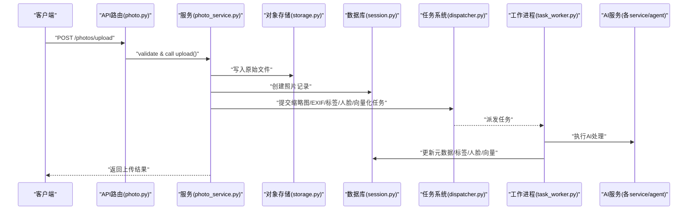

图表来源
- [photo_api.py:1-200](file://backend/app/api/photo.py#L1-L200)
- [photo_service.py:1-200](file://backend/app/services/photo_service.py#L1-L200)
- [storage.py:1-200](file://backend/app/database/storage.py#L1-L200)
- [session.py:1-200](file://backend/app/database/session.py#L1-L200)
- [dispatcher.py:1-200](file://backend/app/tasks/dispatcher.py#L1-L200)
- [task_worker.py:1-200](file://backend/app/tasks/task_worker.py#L1-L200)

## 详细组件分析

### 照片上传与下载
- 上传流程
  - 接收文件流，进行类型与大小校验，计算哈希用于完整性校验与去重。
  - 将原始文件写入对象存储，生成唯一路径与URL。
  - 在数据库中创建照片记录，状态标记为待处理。
  - 异步触发缩略图生成、EXIF解析、标签生成、人脸检测、向量索引等任务。
- 下载流程
  - 根据ID定位对象存储中的文件，支持范围请求与缓存头设置。
  - 对敏感资源进行鉴权与访问控制。
- 删除与批量操作
  - 软删除：标记回收站状态，保留物理文件以便恢复。
  - 硬删除：清理对象存储与数据库记录，级联清理关联的缩略图、人脸、描述等。
  - 批量删除：基于事务保证一致性，失败回滚。

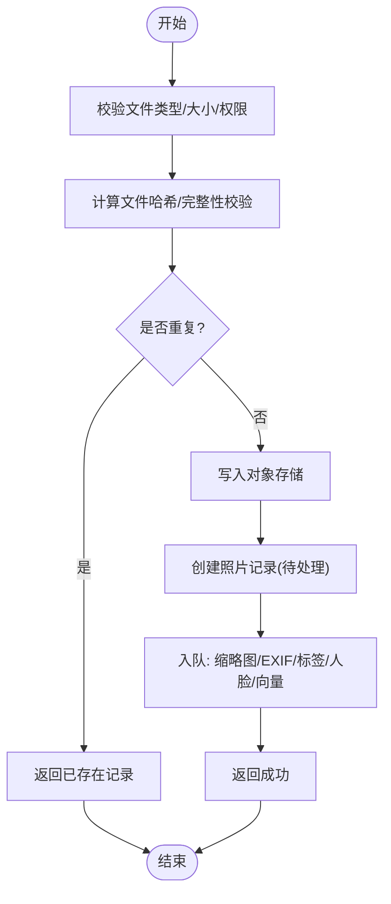

图表来源
- [photo_api.py:1-200](file://backend/app/api/photo.py#L1-L200)
- [photo_service.py:1-200](file://backend/app/services/photo_service.py#L1-L200)
- [storage.py:1-200](file://backend/app/database/storage.py#L1-L200)
- [session.py:1-200](file://backend/app/database/session.py#L1-L200)

章节来源
- [photo_api.py:1-200](file://backend/app/api/photo.py#L1-L200)
- [photo_service.py:1-200](file://backend/app/services/photo_service.py#L1-L200)
- [storage.py:1-200](file://backend/app/database/storage.py#L1-L200)
- [session.py:1-200](file://backend/app/database/session.py#L1-L200)

### 缩略图生成机制
- 触发时机：上传完成后异步任务中执行。
- 处理流程：读取原图，按配置尺寸裁剪/缩放，保存为JPEG/WebP，同时生成多分辨率版本。
- 缓存策略：缩略图命中则跳过生成；未命中时先写临时文件再原子替换。
- 失败重试：指数退避重试，失败记录日志并告警。

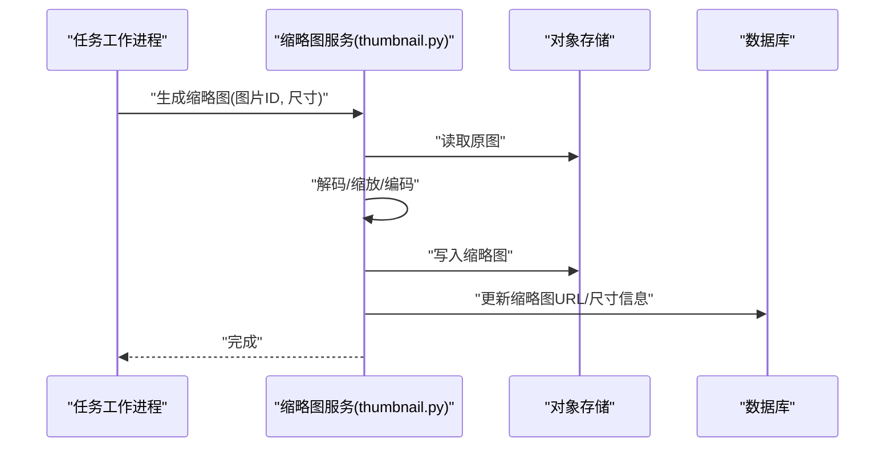

图表来源
- [thumbnail.py:1-200](file://backend/app/services/thumbnail.py#L1-L200)
- [storage.py:1-200](file://backend/app/database/storage.py#L1-L200)
- [session.py:1-200](file://backend/app/database/session.py#L1-L200)

章节来源
- [thumbnail.py:1-200](file://backend/app/services/thumbnail.py#L1-L200)

### EXIF元数据提取处理流程
- 解析步骤：从原图中提取拍摄时间、设备、GPS、相机参数等。
- 地理编码：若包含经纬度，调用地理编码服务转换为地址信息。
- 数据落库：更新照片记录的EXIF字段与地理位置。
- 容错处理：解析失败不影响主流程，仅记录警告日志。

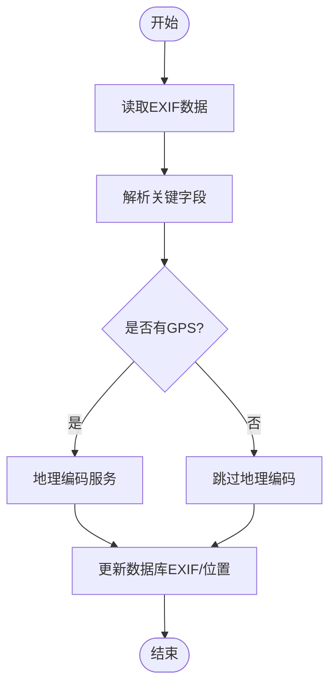

图表来源
- [exif_service.py:1-200](file://backend/app/services/exif_service.py#L1-L200)
- [geocode_service.py:1-200](file://backend/app/services/geocode_service.py#L1-L200)
- [session.py:1-200](file://backend/app/database/session.py#L1-L200)

章节来源
- [exif_service.py:1-200](file://backend/app/services/exif_service.py#L1-L200)
- [geocode_service.py:1-200](file://backend/app/services/geocode_service.py#L1-L200)

### 照片分类算法与智能标签生成
- 目标检测：使用检测服务识别图像中的物体类别与置信度。
- 标签聚合：合并检测结果，过滤低置信度项，结合场景规则生成最终标签集合。
- 去重与排序：按置信度与出现频率排序，限制数量避免过长标签串。
- 异步处理：作为上传后任务之一，避免阻塞上传接口。

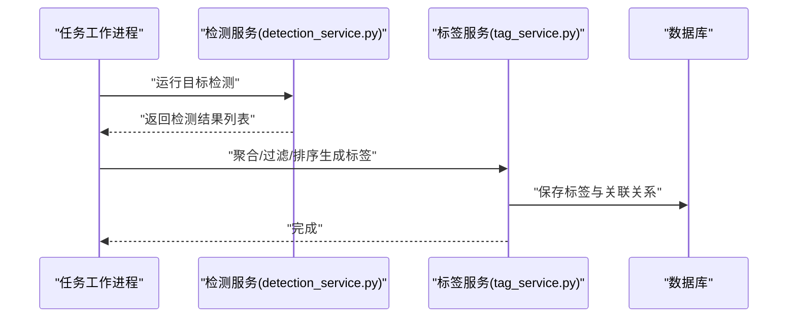

图表来源
- [detection_service.py:1-200](file://backend/app/services/detection_service.py#L1-L200)
- [tag_service.py:1-200](file://backend/app/services/tag_service.py#L1-L200)
- [session.py:1-200](file://backend/app/database/session.py#L1-L200)

章节来源
- [detection_service.py:1-200](file://backend/app/services/detection_service.py#L1-L200)
- [tag_service.py:1-200](file://backend/app/services/tag_service.py#L1-L200)

### 人脸识别集成
- 人脸检测：从照片中检测人脸框与特征点。
- 人脸聚类：将相似人脸归并为同一人，支持人工确认与命名。
- 名称确认：用户可指定某人的姓名，系统自动标注历史照片。
- 查询能力：按人脸或人名检索相关照片。

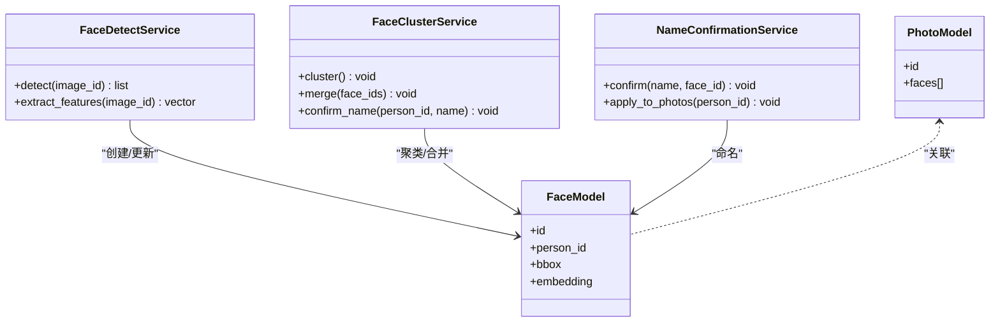

图表来源
- [face_detect_service.py:1-200](file://backend/app/services/face_detect_service.py#L1-L200)
- [face_cluster_service.py:1-200](file://backend/app/services/face_cluster_service.py#L1-L200)
- [name_confirmation_service.py:1-200](file://backend/app/services/name_confirmation_service.py#L1-L200)
- [face.py:1-200](file://backend/app/models/face.py#L1-L200)
- [photo.py:1-200](file://backend/app/models/photo.py#L1-L200)

章节来源
- [face_detect_service.py:1-200](file://backend/app/services/face_detect_service.py#L1-L200)
- [face_cluster_service.py:1-200](file://backend/app/services/face_cluster_service.py#L1-L200)
- [name_confirmation_service.py:1-200](file://backend/app/services/name_confirmation_service.py#L1-L200)
- [face.py:1-200](file://backend/app/models/face.py#L1-L200)
- [photo.py:1-200](file://backend/app/models/photo.py#L1-L200)

### 向量检索与语义搜索
- 向量生成：对照片生成嵌入向量，支持文本到图片与图片到图片检索。
- 索引维护：增量更新向量索引，支持分页与过滤条件。
- 搜索服务：组合关键词、标签、人脸、时间、地点等多维条件。

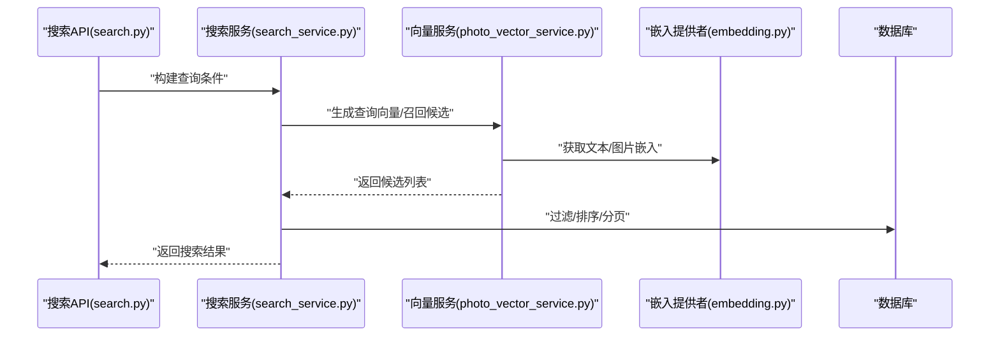

图表来源
- [search_api.py:1-200](file://backend/app/api/search.py#L1-L200)
- [search_service.py:1-200](file://backend/app/services/search_service.py#L1-L200)
- [photo_vector_service.py:1-200](file://backend/app/services/photo_vector_service.py#L1-L200)
- [embedding.py:1-200](file://backend/app/services/ai_providers/embedding.py#L1-L200)
- [session.py:1-200](file://backend/app/database/session.py#L1-L200)

章节来源
- [search_api.py:1-200](file://backend/app/api/search.py#L1-L200)
- [search_service.py:1-200](file://backend/app/services/search_service.py#L1-L200)
- [photo_vector_service.py:1-200](file://backend/app/services/photo_vector_service.py#L1-L200)
- [embedding.py:1-200](file://backend/app/services/ai_providers/embedding.py#L1-L200)

### 相册与批量操作
- 相册管理：创建、编辑、移动照片至相册，支持智能相册（基于规则）。
- 批量操作：批量移动、删除、打标签，使用事务确保一致性。
- 权限控制：相册可见性与成员权限校验。

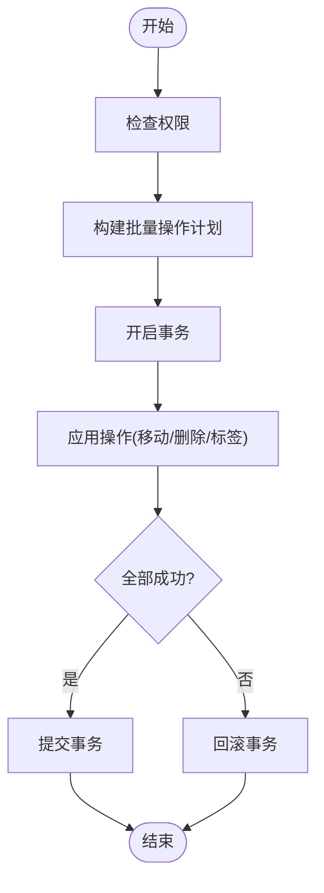

图表来源
- [album_api.py:1-200](file://backend/app/api/album.py#L1-L200)
- [album_service.py:1-200](file://backend/app/services/album_service.py#L1-L200)
- [session.py:1-200](file://backend/app/database/session.py#L1-L200)

章节来源
- [album_api.py:1-200](file://backend/app/api/album.py#L1-L200)
- [album_service.py:1-200](file://backend/app/services/album_service.py#L1-L200)

### 大文件分片上传与并发处理
- 分片策略：前端将大文件切分为固定大小分片，逐个上传并携带分片序号与总片数。
- 服务端处理：每个分片独立校验与落盘，完成后合并为完整文件，计算整体哈希。
- 并发控制：限制并发分片数量，避免I/O风暴；断点续传支持缺失分片补传。
- 幂等性：相同分片多次上传不产生副作用。

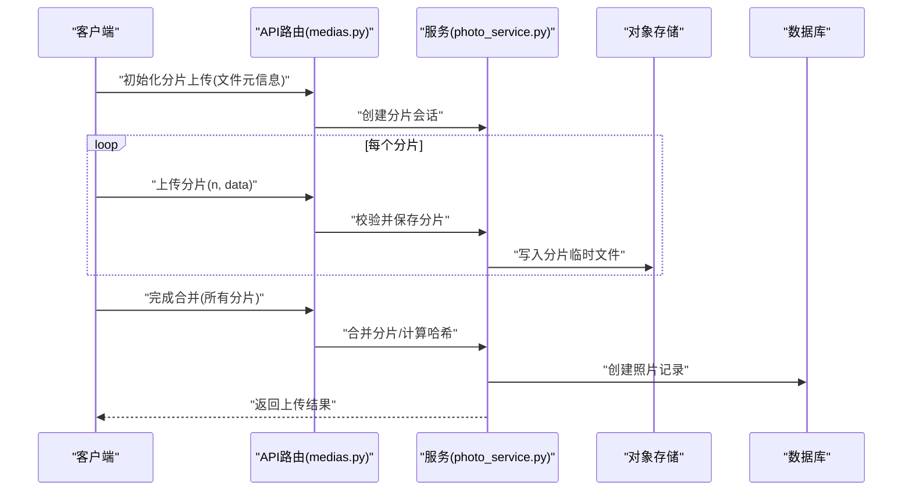

图表来源
- [medias_api.py:1-200](file://backend/app/api/medias.py#L1-L200)
- [photo_service.py:1-200](file://backend/app/services/photo_service.py#L1-L200)
- [storage.py:1-200](file://backend/app/database/storage.py#L1-L200)
- [session.py:1-200](file://backend/app/database/session.py#L1-L200)

章节来源
- [medias_api.py:1-200](file://backend/app/api/medias.py#L1-L200)
- [photo_service.py:1-200](file://backend/app/services/photo_service.py#L1-L200)
- [storage.py:1-200](file://backend/app/database/storage.py#L1-L200)
- [session.py:1-200](file://backend/app/database/session.py#L1-L200)

### 文件完整性校验
- 哈希计算：上传阶段计算SHA-256/MD5，合并后再次校验整体哈希。
- 去重策略：相同哈希直接复用已有记录，减少存储与处理开销。
- 校验失败：拒绝写入并记录错误日志，提示客户端重试。

章节来源
- [photo_service.py:1-200](file://backend/app/services/photo_service.py#L1-L200)
- [storage.py:1-200](file://backend/app/database/storage.py#L1-L200)

### 对象存储交互模式与缓存策略
- 交互模式：统一抽象存储接口，支持本地磁盘与云对象存储；读写路径与URL生成由配置驱动。
- 缓存策略：缩略图与热门原图启用缓存；CDN加速静态资源；数据库连接池与对象存储连接复用。
- 性能优化：并行读取/写入、零拷贝传输、合理分片大小、压缩与格式转换。

章节来源
- [storage.py:1-200](file://backend/app/database/storage.py#L1-L200)
- [thumbnail.py:1-200](file://backend/app/services/thumbnail.py#L1-L200)
- [settings.py:1-200](file://backend/app/config/settings.py#L1-L200)

### 任务系统与异步处理
- 分发器：负责任务路由与负载均衡。
- 调度器：定时任务与延迟任务。
- 工作进程：执行具体AI任务，如检测、人脸、向量索引。
- 任务模型：持久化任务状态，支持重试与失败回调。

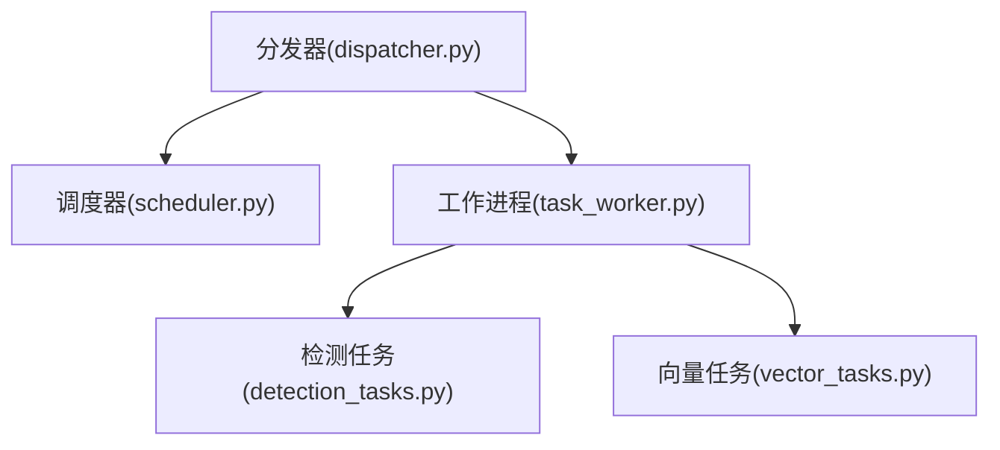

图表来源
- [dispatcher.py:1-200](file://backend/app/tasks/dispatcher.py#L1-L200)
- [scheduler.py:1-200](file://backend/app/tasks/scheduler.py#L1-L200)
- [task_worker.py:1-200](file://backend/app/tasks/task_worker.py#L1-L200)
- [detection_tasks.py:1-200](file://backend/app/tasks/detection_tasks.py#L1-L200)
- [vector_tasks.py:1-200](file://backend/app/tasks/vector_tasks.py#L1-L200)

章节来源
- [dispatcher.py:1-200](file://backend/app/tasks/dispatcher.py#L1-L200)
- [scheduler.py:1-200](file://backend/app/tasks/scheduler.py#L1-L200)
- [task_worker.py:1-200](file://backend/app/tasks/task_worker.py#L1-L200)
- [detection_tasks.py:1-200](file://backend/app/tasks/detection_tasks.py#L1-L200)
- [vector_tasks.py:1-200](file://backend/app/tasks/vector_tasks.py#L1-L200)

### Agent与AI编排
- 监督者：协调多个Agent协作完成复杂任务（如对话+检索+检测）。
- 专用Agent：聊天、检测、人脸、LLM、元数据、搜索等。
- 训练服务：模型训练与评估，支持自定义数据集与导出。

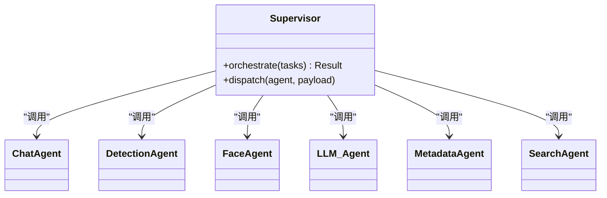

图表来源
- [supervisor.py:1-200](file://backend/app/services/agent/supervisor.py#L1-L200)
- [chat_agent.py:1-200](file://backend/app/services/agent/chat_agent.py#L1-L200)
- [detection_agent.py:1-200](file://backend/app/services/agent/detection_agent.py#L1-L200)
- [face_agent.py:1-200](file://backend/app/services/agent/face_agent.py#L1-L200)
- [llm_agent.py:1-200](file://backend/app/services/agent/llm_agent.py#L1-L200)
- [metadata_agent.py:1-200](file://backend/app/services/agent/metadata_agent.py#L1-L200)
- [search_agent.py:1-200](file://backend/app/services/agent/search_agent.py#L1-L200)

章节来源
- [supervisor.py:1-200](file://backend/app/services/agent/supervisor.py#L1-L200)
- [chat_agent.py:1-200](file://backend/app/services/agent/chat_agent.py#L1-L200)
- [detection_agent.py:1-200](file://backend/app/services/agent/detection_agent.py#L1-L200)
- [face_agent.py:1-200](file://backend/app/services/agent/face_agent.py#L1-L200)
- [llm_agent.py:1-200](file://backend/app/services/agent/llm_agent.py#L1-L200)
- [metadata_agent.py:1-200](file://backend/app/services/agent/metadata_agent.py#L1-L200)
- [search_agent.py:1-200](file://backend/app/services/agent/search_agent.py#L1-L200)

## 依赖关系分析
- 内聚与耦合
  - API层与服务层解耦清晰，服务层依赖CRUD与存储抽象，降低外部耦合。
  - 任务系统与业务服务通过消息/任务模型松耦合。
- 外部依赖
  - 对象存储、AI推理服务、地理编码、嵌入模型等通过配置与适配器接入。
- 循环依赖
  - 通过分层与接口抽象避免循环导入；必要时使用延迟导入或事件总线。

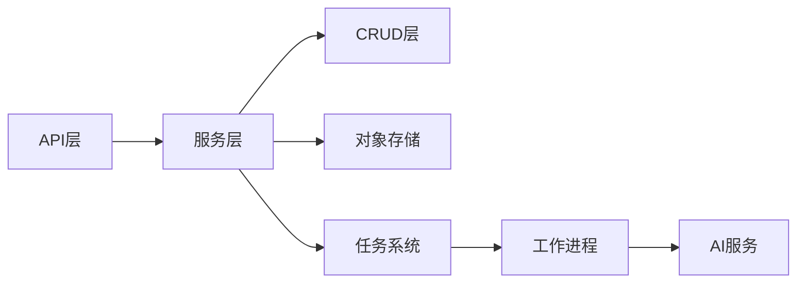

图表来源
- [photo_api.py:1-200](file://backend/app/api/photo.py#L1-L200)
- [photo_service.py:1-200](file://backend/app/services/photo_service.py#L1-L200)
- [photo_crud.py:1-200](file://backend/app/crud/photo.py#L1-L200)
- [storage.py:1-200](file://backend/app/database/storage.py#L1-L200)
- [dispatcher.py:1-200](file://backend/app/tasks/dispatcher.py#L1-L200)
- [task_worker.py:1-200](file://backend/app/tasks/task_worker.py#L1-L200)

章节来源
- [photo_api.py:1-200](file://backend/app/api/photo.py#L1-L200)
- [photo_service.py:1-200](file://backend/app/services/photo_service.py#L1-L200)
- [photo_crud.py:1-200](file://backend/app/crud/photo.py#L1-L200)
- [storage.py:1-200](file://backend/app/database/storage.py#L1-L200)
- [dispatcher.py:1-200](file://backend/app/tasks/dispatcher.py#L1-L200)
- [task_worker.py:1-200](file://backend/app/tasks/task_worker.py#L1-L200)

## 性能考虑
- I/O优化：对象存储直传、分片并发、压缩与格式转换按需启用。
- 计算优化：GPU/CPU资源隔离，批处理AI推理，向量索引增量更新。
- 缓存策略：缩略图与热门原图缓存，数据库连接池，对象存储预取。
- 限流与背压：上传速率限制、任务队列长度上限、失败快速失败与重试。
- 监控指标：QPS、延迟分布、错误率、任务积压、存储用量、AI推理耗时。

[本节为通用指导，无需特定文件引用]

## 故障排查指南
- 常见错误
  - 上传失败：检查文件大小、类型、网络超时与对象存储连通性。
  - 缩略图生成失败：查看图像处理库版本与内存占用，确认输入图像可读。
  - 人脸检测失败：确认模型加载与GPU可用性，检查输入分辨率。
  - 向量检索异常：检查嵌入模型可用性与索引一致性。
- 日志与追踪
  - 结构化日志：记录请求ID、用户ID、文件ID、耗时与关键参数。
  - 错误堆栈：捕获并上报异常上下文，便于定位问题。
- 监控与告警
  - 指标采集：Prometheus/Grafana集成，关键指标阈值告警。
  - 健康检查：对象存储、数据库、AI服务的健康探针。

章节来源
- [exceptions.py:1-200](file://backend/app/core/exceptions.py#L1-L200)
- [logger.py:1-200](file://backend/app/core/logger.py#L1-L200)
- [security.py:1-200](file://backend/app/core/security.py#L1-L200)

## 结论
该照片管理服务通过分层架构与任务系统实现了高扩展的照片处理能力，涵盖上传下载、缩略图、EXIF、标签、人脸、向量检索与相册管理等核心功能。配合完善的错误处理、日志与监控机制，可在生产环境中稳定运行。建议在生产部署中关注对象存储与AI服务的可用性、容量规划与性能调优。

[本节为总结，无需特定文件引用]

## 附录
- 配置项建议
  - 对象存储：端点、桶名、访问密钥、分片大小、并发数。
  - 数据库：连接池大小、超时、重试策略。
  - AI服务：模型路径、GPU显存、批大小、超时与重试。
- 最佳实践
  - 幂等设计：上传与任务处理具备幂等性。
  - 灰度发布：新模型与算法灰度上线，逐步放量。
  - 数据备份：定期备份对象存储与数据库，制定恢复演练计划。

[本节为补充说明，无需特定文件引用]