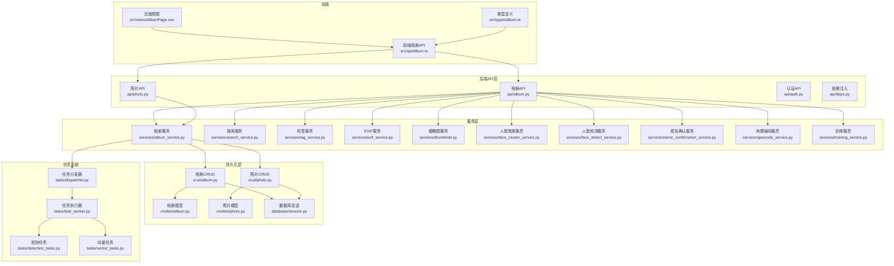
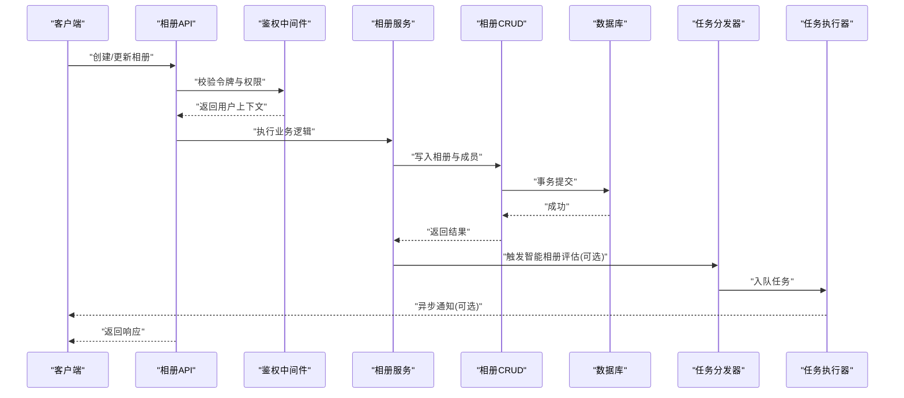
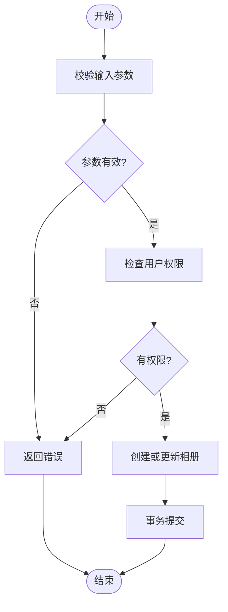
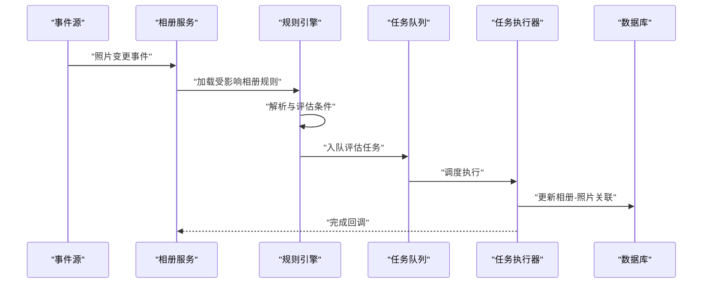
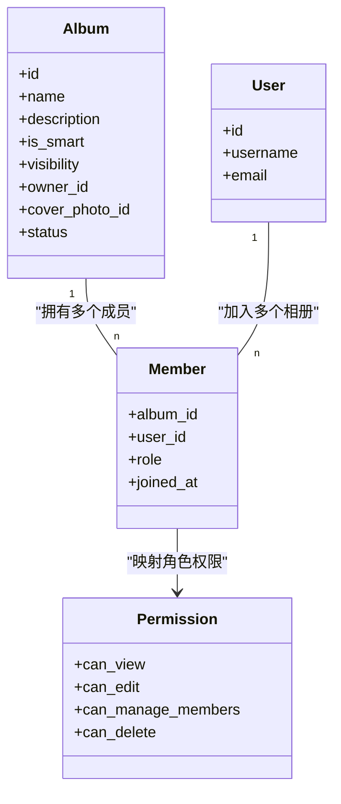
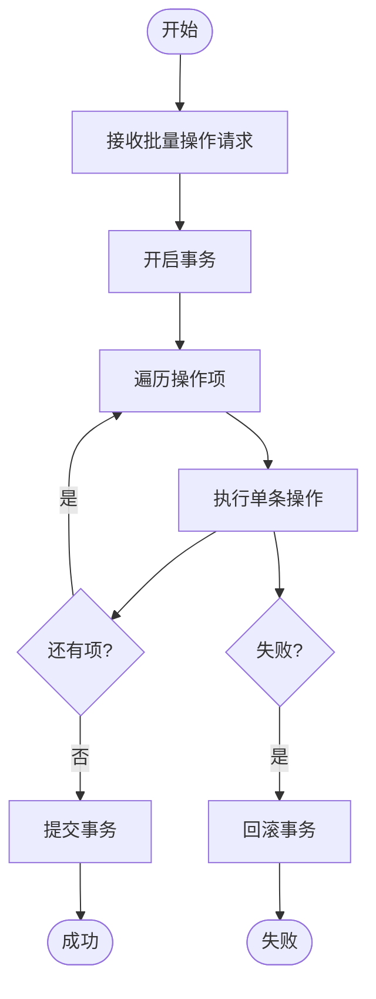
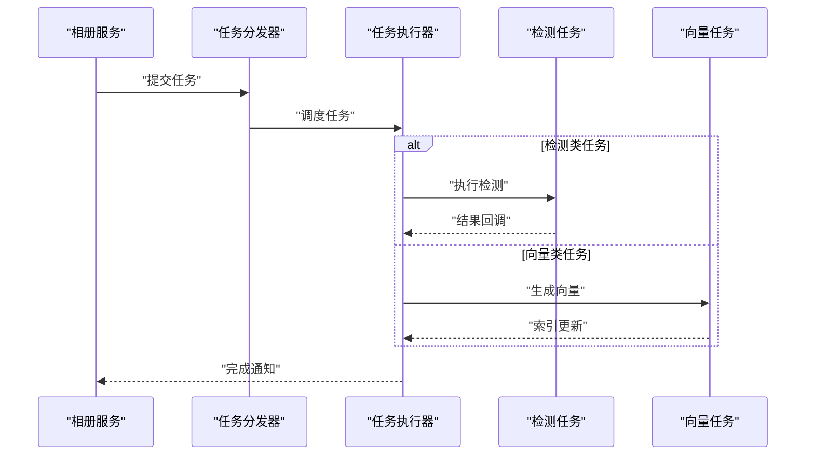
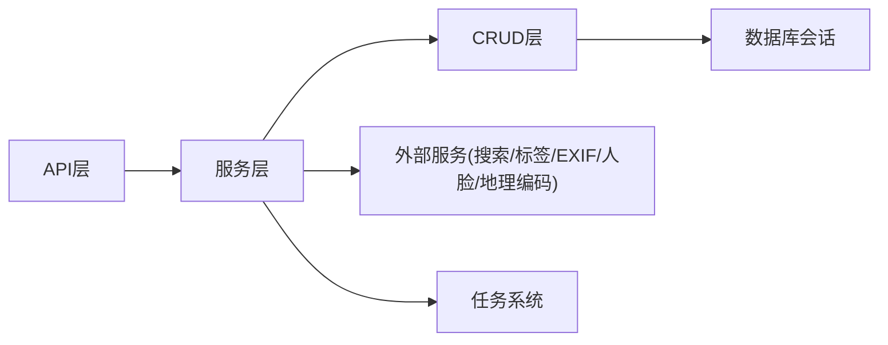

# 相册管理服务

<cite>
**本文引用的文件**   
- [backend/app/api/album.py](file://backend/app/api/album.py)
- [backend/app/crud/album.py](file://backend/app/crud/album.py)
- [backend/app/models/album.py](file://backend/app/models/album.py)
- [backend/app/schemas/album.py](file://backend/app/schemas/album.py)
- [backend/app/services/album_service.py](file://backend/app/services/album_service.py)
- [backend/app/database/session.py](file://backend/app/database/session.py)
- [backend/app/core/security.py](file://backend/app/core/security.py)
- [backend/app/api/deps.py](file://backend/app/api/deps.py)
- [backend/app/api/auth.py](file://backend/app/api/auth.py)
- [backend/app/api/photo.py](file://backend/app/api/photo.py)
- [backend/app/crud/photo.py](file://backend/app/crud/photo.py)
- [backend/app/models/photo.py](file://backend/app/models/photo.py)
- [backend/app/schemas/photo.py](file://backend/app/schemas/photo.py)
- [backend/app/tasks/dispatcher.py](file://backend/app/tasks/dispatcher.py)
- [backend/app/tasks/task_worker.py](file://backend/app/tasks/task_worker.py)
- [backend/app/tasks/detection_tasks.py](file://backend/app/tasks/detection_tasks.py)
- [backend/app/tasks/vector_tasks.py](file://backend/app/tasks/vector_tasks.py)
- [backend/app/services/search_service.py](file://backend/app/services/search_service.py)
- [backend/app/services/tag_service.py](file://backend/app/services/tag_service.py)
- [backend/app/services/exif_service.py](file://backend/app/services/exif_service.py)
- [backend/app/services/thumbnail.py](file://backend/app/services/thumbnail.py)
- [backend/app/services/face_cluster_service.py](file://backend/app/services/face_cluster_service.py)
- [backend/app/services/face_detect_service.py](file://backend/app/services/face_detect_service.py)
- [backend/app/services/name_confirmation_service.py](file://backend/app/services/name_confirmation_service.py)
- [backend/app/services/geocode_service.py](file://backend/app/services/geocode_service.py)
- [backend/app/services/training_service.py](file://backend/app/services/training_service.py)
- [backend/app/services/train/config.py](file://backend/app/services/train/config.py)
- [backend/app/services/test/test_album_smart.py](file://backend/app/services/test/test_album_smart.py)
- [frontend/src/types/album.ts](file://frontend/src/types/album.ts)
- [frontend/src/api/album.ts](file://frontend/src/api/album.ts)
- [frontend/src/views/AlbumPage.vue](file://frontend/src/views/AlbumPage.vue)
</cite>

## 目录
1. [简介](#简介)
2. [项目结构](#项目结构)
3. [核心组件](#核心组件)
4. [架构总览](#架构总览)
5. [详细组件分析](#详细组件分析)
6. [依赖关系分析](#依赖关系分析)
7. [性能考虑](#性能考虑)
8. [故障排查指南](#故障排查指南)
9. [结论](#结论)
10. [附录](#附录)

## 简介
本文件面向“相册管理服务”的后端实现，围绕以下目标展开：
- 手动相册的创建与编辑、智能相册的自动分类、相册成员管理
- 权限控制模型与共享机制
- 批量操作处理逻辑
- 智能相册规则引擎、条件匹配算法与动态更新机制
- 相册统计信息计算、照片排序策略与时间线视图生成方案
- 相册与照片的多对多关系管理、事务处理与性能优化
- 数据一致性保证、缓存策略与扩展性设计

## 项目结构
后端采用分层架构：API 层负责路由与参数校验，服务层封装业务逻辑，CRUD 层负责数据库访问，模型层定义 ORM 实体，任务系统用于异步处理（如人脸检测、向量检索等）。前端通过 API 调用完成相册管理与展示。

图表来源
- [backend/app/api/album.py](file://backend/app/api/album.py)
- [backend/app/api/photo.py](file://backend/app/api/photo.py)
- [backend/app/services/album_service.py](file://backend/app/services/album_service.py)
- [backend/app/crud/album.py](file://backend/app/crud/album.py)
- [backend/app/crud/photo.py](file://backend/app/crud/photo.py)
- [backend/app/models/album.py](file://backend/app/models/album.py)
- [backend/app/models/photo.py](file://backend/app/models/photo.py)
- [backend/app/database/session.py](file://backend/app/database/session.py)
- [backend/app/tasks/dispatcher.py](file://backend/app/tasks/dispatcher.py)
- [backend/app/tasks/task_worker.py](file://backend/app/tasks/task_worker.py)
- [backend/app/tasks/detection_tasks.py](file://backend/app/tasks/detection_tasks.py)
- [backend/app/tasks/vector_tasks.py](file://backend/app/tasks/vector_tasks.py)

章节来源
- [backend/app/api/album.py](file://backend/app/api/album.py)
- [backend/app/services/album_service.py](file://backend/app/services/album_service.py)
- [backend/app/crud/album.py](file://backend/app/crud/album.py)
- [backend/app/models/album.py](file://backend/app/models/album.py)
- [backend/app/database/session.py](file://backend/app/database/session.py)
- [backend/app/tasks/dispatcher.py](file://backend/app/tasks/dispatcher.py)
- [backend/app/tasks/task_worker.py](file://backend/app/tasks/task_worker.py)
- [backend/app/tasks/detection_tasks.py](file://backend/app/tasks/detection_tasks.py)
- [backend/app/tasks/vector_tasks.py](file://backend/app/tasks/vector_tasks.py)

## 核心组件
- 相册模型与模式
  - 相册实体包含名称、描述、是否智能相册、可见范围、成员列表、封面、状态等字段；支持公开、私有、协作等可见性；成员角色包括所有者、管理员、编辑者、查看者等。
  - 相册模式用于请求/响应校验与文档生成。
- 相册服务
  - 提供手动相册的增删改查、成员管理、批量添加/移除照片、智能相册规则评估与触发、统计信息计算、排序与分页查询、时间线视图生成等能力。
- 相册CRUD
  - 封装相册与照片关联表的读写，确保多对多关系的原子性与一致性。
- 任务系统
  - 将耗时操作（如人脸检测、向量索引、缩略图生成）异步化，提高接口响应速度。
- 安全与鉴权
  - 基于令牌的身份验证与权限校验，结合依赖注入在API层进行成员角色检查。

章节来源
- [backend/app/models/album.py](file://backend/app/models/album.py)
- [backend/app/schemas/album.py](file://backend/app/schemas/album.py)
- [backend/app/services/album_service.py](file://backend/app/services/album_service.py)
- [backend/app/crud/album.py](file://backend/app/crud/album.py)
- [backend/app/core/security.py](file://backend/app/core/security.py)
- [backend/app/api/deps.py](file://backend/app/api/deps.py)

## 架构总览
系统以“API 层 -> 服务层 -> CRUD 层 -> 数据库”为主链路，辅以“任务系统”处理异步工作流。智能相册的规则引擎在服务层实现，可订阅事件或定时触发，通过任务系统更新结果集。

图表来源
- [backend/app/api/album.py](file://backend/app/api/album.py)
- [backend/app/core/security.py](file://backend/app/core/security.py)
- [backend/app/api/deps.py](file://backend/app/api/deps.py)
- [backend/app/services/album_service.py](file://backend/app/services/album_service.py)
- [backend/app/crud/album.py](file://backend/app/crud/album.py)
- [backend/app/database/session.py](file://backend/app/database/session.py)
- [backend/app/tasks/dispatcher.py](file://backend/app/tasks/dispatcher.py)
- [backend/app/tasks/task_worker.py](file://backend/app/tasks/task_worker.py)

## 详细组件分析

### 手动相册创建与编辑
- 功能要点
  - 创建相册：校验名称唯一性、可见性、初始成员与角色。
  - 更新相册：支持修改名称、描述、封面、可见性、成员变更。
  - 删除相册：级联清理成员与关联关系。
- 关键流程
  - API 接收请求并校验输入，服务层进行业务校验与事务操作，CRUD 层执行数据库写入。
- 错误处理
  - 重复名称、非法可见性、无权限操作等异常统一抛出并由API层捕获返回。

图表来源
- [backend/app/api/album.py](file://backend/app/api/album.py)
- [backend/app/services/album_service.py](file://backend/app/services/album_service.py)
- [backend/app/crud/album.py](file://backend/app/crud/album.py)
- [backend/app/core/security.py](file://backend/app/core/security.py)

章节来源
- [backend/app/api/album.py](file://backend/app/api/album.py)
- [backend/app/services/album_service.py](file://backend/app/services/album_service.py)
- [backend/app/crud/album.py](file://backend/app/crud/album.py)
- [backend/app/core/security.py](file://backend/app/core/security.py)

### 智能相册自动分类
- 规则引擎
  - 支持按标签、人脸、地理位置、拍摄时间、文件大小、分辨率、AI识别结果等多维度条件组合。
  - 规则表达式由服务层解析与评估，支持AND/OR/NOT逻辑与优先级。
- 条件匹配算法
  - 预过滤：利用索引字段快速缩小候选集合（如时间范围、标签存在性）。
  - 精确匹配：对剩余照片逐一评估规则表达式。
  - 增量更新：仅对新增/变更的照片重新评估，减少全量扫描。
- 动态更新机制
  - 事件驱动：当照片元数据、标签、人脸检测结果变化时，触发对应相册的规则重评估。
  - 定时任务：周期性扫描未覆盖的相册，保障最终一致性。
  - 任务队列：通过任务分发器与执行器异步执行，避免阻塞主线程。

图表来源
- [backend/app/services/album_service.py](file://backend/app/services/album_service.py)
- [backend/app/tasks/dispatcher.py](file://backend/app/tasks/dispatcher.py)
- [backend/app/tasks/task_worker.py](file://backend/app/tasks/task_worker.py)
- [backend/app/crud/album.py](file://backend/app/crud/album.py)

章节来源
- [backend/app/services/album_service.py](file://backend/app/services/album_service.py)
- [backend/app/tasks/dispatcher.py](file://backend/app/tasks/dispatcher.py)
- [backend/app/tasks/task_worker.py](file://backend/app/tasks/task_worker.py)
- [backend/app/services/test/test_album_smart.py](file://backend/app/services/test/test_album_smart.py)

### 相册成员管理
- 成员角色
  - 所有者：完全控制，不可移除自身。
  - 管理员：可管理成员与内容，不可删除相册。
  - 编辑者：可添加/移除照片，不可管理成员。
  - 查看者：只读访问。
- 权限控制模型
  - 基于角色的访问控制（RBAC），在API层通过依赖注入获取当前用户与相册成员关系，进行细粒度授权判断。
- 共享机制
  - 支持公开链接（可选）、邀请链接、直接成员添加；成员变更需记录审计日志。

图表来源
- [backend/app/models/album.py](file://backend/app/models/album.py)
- [backend/app/models/user.py](file://backend/app/models/user.py)
- [backend/app/core/security.py](file://backend/app/core/security.py)
- [backend/app/api/deps.py](file://backend/app/api/deps.py)

章节来源
- [backend/app/models/album.py](file://backend/app/models/album.py)
- [backend/app/core/security.py](file://backend/app/core/security.py)
- [backend/app/api/deps.py](file://backend/app/api/deps.py)

### 批量操作处理逻辑
- 批量添加/移除照片
  - 使用事务包裹多次插入/删除，确保要么全部成功，要么全部回滚。
  - 分批提交，避免单次事务过大导致锁竞争与超时。
- 批量成员变更
  - 支持一次性添加/移除多个成员，记录变更明细以便审计。
- 失败重试与幂等
  - 任务级别支持重试策略；对外暴露幂等键以避免重复提交。

图表来源
- [backend/app/crud/album.py](file://backend/app/crud/album.py)
- [backend/app/database/session.py](file://backend/app/database/session.py)

章节来源
- [backend/app/crud/album.py](file://backend/app/crud/album.py)
- [backend/app/database/session.py](file://backend/app/database/session.py)

### 相册统计信息计算
- 统计指标
  - 照片数量、总大小、平均分辨率、时间跨度、标签分布、人脸数量、地理位置分布等。
- 计算策略
  - 实时计算：针对小相册或热点相册，直接聚合查询。
  - 增量维护：在照片增删改时更新计数与摘要表，降低查询成本。
  - 异步刷新：后台任务定期刷新统计，保障一致性。

章节来源
- [backend/app/services/album_service.py](file://backend/app/services/album_service.py)
- [backend/app/crud/album.py](file://backend/app/crud/album.py)

### 照片排序策略与时间线视图
- 排序策略
  - 默认按拍摄时间倒序；支持按文件名、上传时间、大小、评分等自定义排序。
  - 对于智能相册，可在规则评估后附加相关性分数参与排序。
- 时间线视图
  - 按天/周/月分组，聚合每日首图与数量，提供分页与懒加载。
  - 结合地理位置与标签筛选，生成可交互的时间轴。

章节来源
- [backend/app/services/album_service.py](file://backend/app/services/album_service.py)
- [backend/app/api/album.py](file://backend/app/api/album.py)

### 相册与照片的多对多关系管理
- 关系建模
  - 相册与照片通过中间表建立多对多关系，支持额外属性（如备注、顺序、加入时间）。
- 事务与一致性
  - 所有关系变更在事务中执行，确保引用完整性。
  - 删除照片时级联清理相册-照片关联；删除相册时清理成员与关联。

章节来源
- [backend/app/models/album.py](file://backend/app/models/album.py)
- [backend/app/models/photo.py](file://backend/app/models/photo.py)
- [backend/app/crud/album.py](file://backend/app/crud/album.py)
- [backend/app/crud/photo.py](file://backend/app/crud/photo.py)

### 任务系统与异步处理
- 任务分发与执行
  - 分发器负责将任务入队，执行器从队列拉取并执行，支持并发与重试。
- 典型任务
  - 检测任务：人脸检测、场景识别、OCR等。
  - 向量任务：为照片生成嵌入向量，构建检索索引。
- 与相册服务的集成
  - 智能相册评估、统计刷新、缩略图生成等均可作为任务执行。

图表来源
- [backend/app/tasks/dispatcher.py](file://backend/app/tasks/dispatcher.py)
- [backend/app/tasks/task_worker.py](file://backend/app/tasks/task_worker.py)
- [backend/app/tasks/detection_tasks.py](file://backend/app/tasks/detection_tasks.py)
- [backend/app/tasks/vector_tasks.py](file://backend/app/tasks/vector_tasks.py)

章节来源
- [backend/app/tasks/dispatcher.py](file://backend/app/tasks/dispatcher.py)
- [backend/app/tasks/task_worker.py](file://backend/app/tasks/task_worker.py)
- [backend/app/tasks/detection_tasks.py](file://backend/app/tasks/detection_tasks.py)
- [backend/app/tasks/vector_tasks.py](file://backend/app/tasks/vector_tasks.py)

### 辅助服务集成
- 搜索服务：提供全文检索与语义检索能力，支撑智能相册的条件匹配与结果预览。
- 标签服务：统一管理标签体系，支持批量打标与去重。
- EXIF服务：读取与标准化照片元数据，提升规则匹配的准确性。
- 缩略图服务：生成不同尺寸的缩略图，加速时间线与网格展示。
- 人脸相关服务：人脸检测、聚类、姓名确认，增强智能相册的分类能力。
- 地理编码服务：将坐标转换为地名，支持按地点筛选。
- 训练服务：模型训练与版本管理，服务于AI识别与向量检索。

章节来源
- [backend/app/services/search_service.py](file://backend/app/services/search_service.py)
- [backend/app/services/tag_service.py](file://backend/app/services/tag_service.py)
- [backend/app/services/exif_service.py](file://backend/app/services/exif_service.py)
- [backend/app/services/thumbnail.py](file://backend/app/services/thumbnail.py)
- [backend/app/services/face_cluster_service.py](file://backend/app/services/face_cluster_service.py)
- [backend/app/services/face_detect_service.py](file://backend/app/services/face_detect_service.py)
- [backend/app/services/name_confirmation_service.py](file://backend/app/services/name_confirmation_service.py)
- [backend/app/services/geocode_service.py](file://backend/app/services/geocode_service.py)
- [backend/app/services/training_service.py](file://backend/app/services/training_service.py)
- [backend/app/services/train/config.py](file://backend/app/services/train/config.py)

## 依赖关系分析
- 组件耦合
  - API层依赖服务层与鉴权模块；服务层依赖CRUD层与外部服务（搜索、标签、EXIF、人脸、地理编码等）；CRUD层依赖数据库会话与ORM模型。
- 外部依赖
  - 任务系统依赖消息队列与执行器；AI服务依赖训练配置与模型版本。
- 潜在循环依赖
  - 服务层不应反向依赖API层；CRUD层不依赖服务层；通过接口与依赖注入解耦。

图表来源
- [backend/app/api/album.py](file://backend/app/api/album.py)
- [backend/app/services/album_service.py](file://backend/app/services/album_service.py)
- [backend/app/crud/album.py](file://backend/app/crud/album.py)
- [backend/app/database/session.py](file://backend/app/database/session.py)
- [backend/app/tasks/dispatcher.py](file://backend/app/tasks/dispatcher.py)

章节来源
- [backend/app/api/album.py](file://backend/app/api/album.py)
- [backend/app/services/album_service.py](file://backend/app/services/album_service.py)
- [backend/app/crud/album.py](file://backend/app/crud/album.py)
- [backend/app/database/session.py](file://backend/app/database/session.py)
- [backend/app/tasks/dispatcher.py](file://backend/app/tasks/dispatcher.py)

## 性能考虑
- 数据库层面
  - 为常用查询字段建立索引（时间、标签、人脸ID、地理位置等）。
  - 使用分页与投影减少数据传输量。
- 服务层优化
  - 预过滤+精确匹配的组合策略降低规则评估成本。
  - 增量更新与异步刷新避免全量扫描。
- 任务系统
  - 合理设置并发度与重试次数，避免资源争用。
  - 大任务分片处理，降低内存峰值。
- 缓存策略
  - 对热点相册的统计信息与时间线数据进行缓存，设置合理的过期策略。
  - 缩略图与向量索引缓存，提升读取性能。

[本节为通用指导，无需特定文件来源]

## 故障排查指南
- 常见问题
  - 权限不足：检查用户角色与成员关系，确认API层鉴权逻辑。
  - 智能相册未更新：检查任务队列是否堆积，任务执行器是否正常。
  - 批量操作失败：查看事务日志与错误码，确认是否存在约束冲突。
- 调试建议
  - 启用详细日志，记录规则评估过程与任务执行轨迹。
  - 使用测试用例复现问题，聚焦最小可复现场景。

章节来源
- [backend/app/core/security.py](file://backend/app/core/security.py)
- [backend/app/tasks/dispatcher.py](file://backend/app/tasks/dispatcher.py)
- [backend/app/tasks/task_worker.py](file://backend/app/tasks/task_worker.py)
- [backend/app/services/test/test_album_smart.py](file://backend/app/services/test/test_album_smart.py)

## 结论
相册管理服务通过清晰的分层架构与任务系统，实现了手动相册管理、智能相册自动分类、成员权限控制与批量操作的完整闭环。规则引擎与条件匹配算法在保证准确性的同时兼顾性能，事务与异步机制确保了数据一致性与用户体验。未来可扩展更多AI能力与检索维度，进一步提升智能相册的智能化水平。

[本节为总结，无需特定文件来源]

## 附录
- 前端集成
  - 类型定义与API调用封装在前端模块中，便于页面组件复用与维护。
  - 相册页面提供创建、编辑、成员管理、时间线展示等功能。

章节来源
- [frontend/src/types/album.ts](file://frontend/src/types/album.ts)
- [frontend/src/api/album.ts](file://frontend/src/api/album.ts)
- [frontend/src/views/AlbumPage.vue](file://frontend/src/views/AlbumPage.vue)