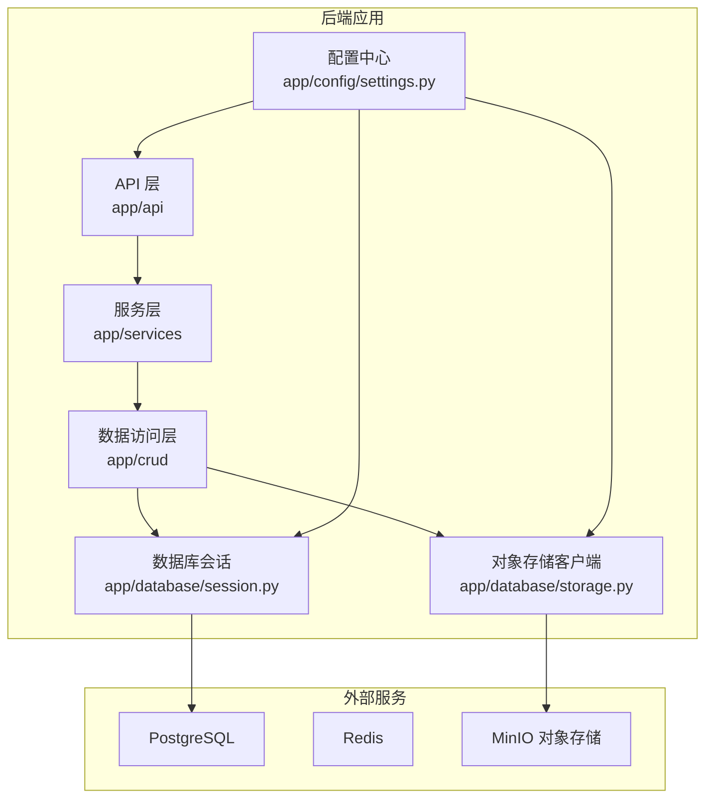
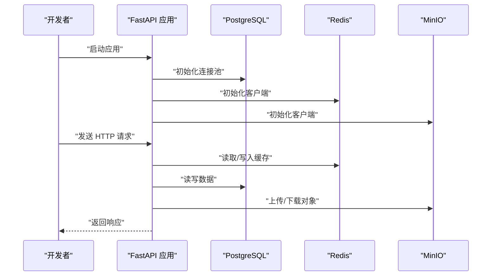
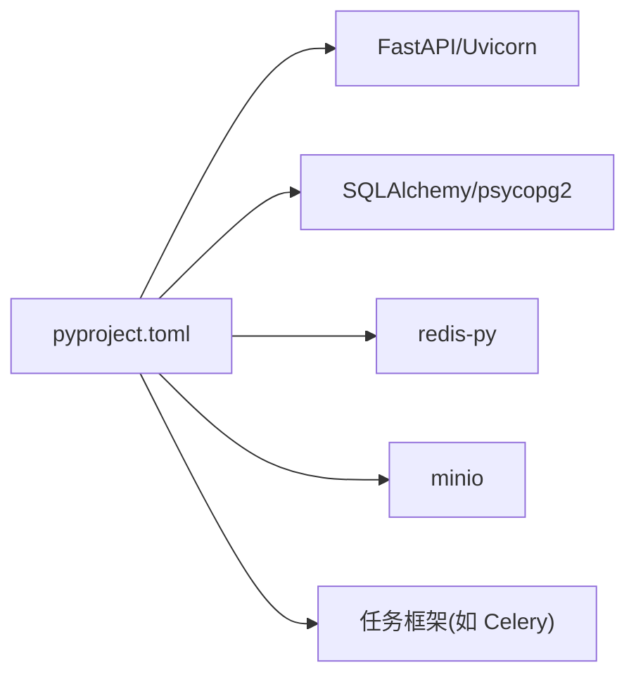

# 环境搭建与配置

<cite>
**本文引用的文件**   
- [backend/main.py](file://backend/main.py)
- [backend/pyproject.toml](file://backend/pyproject.toml)
- [backend/app/config/settings.py](file://backend/app/config/settings.py)
- [backend/app/database/session.py](file://backend/app/database/session.py)
- [backend/app/database/storage.py](file://backend/app/database/storage.py)
- [backend/Dockerfile](file://backend/Dockerfile)
- [docker-compose.yml](file://docker-compose.yml)
- [README.md](file://README.md)
</cite>

## 目录
1. [简介](#简介)
2. [项目结构](#项目结构)
3. [核心组件](#核心组件)
4. [架构总览](#架构总览)
5. [详细组件分析](#详细组件分析)
6. [依赖关系分析](#依赖关系分析)
7. [性能考虑](#性能考虑)
8. [故障排查指南](#故障排查指南)
9. [结论](#结论)
10. [附录](#附录)

## 简介
本指南面向新开发者，提供从零开始的后端开发环境搭建完整流程。内容涵盖：
- Python 环境与依赖包安装
- 数据库（PostgreSQL）初始化与连接配置
- Redis 缓存配置
- MinIO 对象存储设置
- Docker 容器化部署与环境变量管理
- 配置文件管理与开发/生产模式差异
- 完整的启动步骤与常见问题排查

## 项目结构
后端采用分层架构，关键目录与职责如下：
- backend/app/api：HTTP API 路由与请求处理
- backend/app/config：应用配置加载与环境变量解析
- backend/app/database：数据库会话与对象存储客户端
- backend/app/models：数据模型定义
- backend/app/schemas：请求/响应数据结构
- backend/app/services：业务逻辑与服务编排
- backend/app/tasks：异步任务调度与执行
- backend/Dockerfile：后端镜像构建
- docker-compose.yml：多服务编排（含 PostgreSQL、Redis、MinIO 等）

图表来源
- [backend/app/config/settings.py](file://backend/app/config/settings.py)
- [backend/app/database/session.py](file://backend/app/database/session.py)
- [backend/app/database/storage.py](file://backend/app/database/storage.py)

章节来源
- [backend/main.py](file://backend/main.py)
- [backend/app/config/settings.py](file://backend/app/config/settings.py)
- [backend/app/database/session.py](file://backend/app/database/session.py)
- [backend/app/database/storage.py](file://backend/app/database/storage.py)

## 核心组件
- 应用入口与生命周期管理：负责注册中间件、挂载路由、启动事件与关闭事件。
- 配置中心：集中读取环境变量与配置文件，提供运行时配置项。
- 数据库会话：基于 SQLAlchemy 的异步会话管理，支持连接池与事务。
- 对象存储客户端：封装 MinIO 客户端，提供桶与对象的上传/下载/删除等操作。
- 任务调度：后台任务队列与 Worker 进程，用于耗时任务（如检测、向量化）。

章节来源
- [backend/main.py](file://backend/main.py)
- [backend/app/config/settings.py](file://backend/app/config/settings.py)
- [backend/app/database/session.py](file://backend/app/database/session.py)
- [backend/app/database/storage.py](file://backend/app/database/storage.py)

## 架构总览
后端通过 FastAPI 暴露 RESTful API，使用 SQLAlchemy 异步驱动访问 PostgreSQL，使用 Redis 作为缓存与会话存储，使用 MinIO 作为图片与媒体对象存储。Docker Compose 统一编排所有依赖服务，便于本地开发与测试。

图表来源
- [backend/main.py](file://backend/main.py)
- [backend/app/database/session.py](file://backend/app/database/session.py)
- [backend/app/database/storage.py](file://backend/app/database/storage.py)

## 详细组件分析

### 配置中心与环境变量
- 功能要点
  - 从环境变量加载数据库、缓存、对象存储、安全与日志相关参数
  - 提供默认值与校验，确保在缺失时给出合理回退或明确错误
  - 区分开发/生产模式的差异化配置（例如调试开关、日志级别、线程数）
- 关键配置项建议
  - 数据库：主机、端口、用户名、密码、库名、连接池大小、是否启用 SSL
  - Redis：主机、端口、密码、数据库索引、连接超时
  - MinIO：端点、访问密钥、秘密密钥、默认桶名、是否启用 HTTPS
  - 应用：运行模式（开发/生产）、CORS 白名单、JWT 密钥、日志级别
- 最佳实践
  - 使用 .env 文件进行本地开发，避免将敏感信息提交到版本控制
  - 在生产环境中通过容器编排注入环境变量
  - 对敏感字段进行加密或借助密钥管理服务

章节来源
- [backend/app/config/settings.py](file://backend/app/config/settings.py)

### 数据库会话（PostgreSQL）
- 功能要点
  - 使用异步驱动建立连接池，支持并发请求
  - 提供会话上下文管理器，自动提交/回滚事务
  - 支持迁移脚本执行（建议在启动前完成）
- 初始化流程
  - 读取数据库 URL 与连接池参数
  - 创建引擎与会话工厂
  - 在应用启动事件中执行必要的表结构初始化或迁移
- 注意事项
  - 确保数据库用户具备必要权限
  - 调整连接池大小以匹配并发量
  - 为慢查询添加索引并监控连接泄漏

章节来源
- [backend/app/database/session.py](file://backend/app/database/session.py)

### 对象存储客户端（MinIO）
- 功能要点
  - 封装 MinIO 客户端，提供桶存在性检查、上传、下载、删除、列表等能力
  - 支持按模块划分桶（如相册、人脸、训练数据）
  - 可配置路径前缀与访问策略
- 初始化流程
  - 读取端点、凭据与默认桶
  - 验证连通性与桶存在性，不存在则创建
- 注意事项
  - 网络可达性与证书配置（HTTPS）
  - 大文件分片上传与断点续传
  - 对象命名规范与去重策略

章节来源
- [backend/app/database/storage.py](file://backend/app/database/storage.py)

### 应用入口与生命周期
- 功能要点
  - 注册中间件（CORS、认证、日志、限流等）
  - 挂载 API 路由
  - 启动事件：初始化数据库、缓存、对象存储、任务调度器
  - 关闭事件：释放资源、停止任务 Worker
- 启动流程
  - 加载配置
  - 初始化各子系统
  - 启动 Uvicorn/Gunicorn 服务器

章节来源
- [backend/main.py](file://backend/main.py)

### 任务调度与 Worker
- 功能要点
  - 使用消息队列（Redis）作为任务通道
  - 后台 Worker 消费任务并执行（如人脸检测、向量检索）
  - 支持任务重试、失败回调与进度上报
- 注意事项
  - Worker 数量与 CPU/内存资源匹配
  - 任务幂等设计与去重键
  - 监控任务积压与失败率

章节来源
- [backend/app/tasks/dispatcher.py](file://backend/app/tasks/dispatcher.py)
- [backend/app/tasks/task_worker.py](file://backend/app/tasks/task_worker.py)

## 依赖关系分析
- 语言与工具链
  - Python 版本：建议使用 3.11+（参考 pyproject 指定）
  - 包管理：uv 或 pip
- 主要依赖
  - Web 框架：FastAPI + Uvicorn/Gunicorn
  - 数据库：SQLAlchemy 异步驱动 + psycopg2 async
  - 缓存：redis-py
  - 对象存储：minio
  - 任务：celery 或类似框架（结合 Redis）
- 依赖声明位置
  - 后端依赖清单位于 pyproject.toml

图表来源
- [backend/pyproject.toml](file://backend/pyproject.toml)

章节来源
- [backend/pyproject.toml](file://backend/pyproject.toml)

## 性能考虑
- 数据库
  - 合理设置连接池大小与超时
  - 针对高频查询建立索引
  - 使用只读副本分担查询压力
- 缓存
  - 热点数据优先走缓存
  - 设置合理的过期时间与更新策略
- 对象存储
  - 使用 CDN 加速静态资源
  - 大文件分片与并行上传
- 应用
  - 生产环境使用 Gunicorn + 多 Worker
  - 开启压缩与缓存头
  - 监控与告警（QPS、延迟、错误率）

## 故障排查指南
- 无法连接数据库
  - 检查数据库地址、端口、用户名、密码与库名
  - 确认防火墙与安全组放行
  - 查看连接池耗尽与慢查询日志
- 缓存不可用
  - 检查 Redis 地址、端口、密码与数据库索引
  - 确认网络连通与 ACL 规则
- 对象存储异常
  - 校验 MinIO 端点、AK/SK 与桶名
  - 检查 HTTPS 证书与域名解析
  - 查看对象权限与跨域策略
- 任务未执行
  - 确认 Worker 进程已启动且订阅正确队列
  - 检查任务重试次数与死信队列
  - 查看任务日志与失败原因
- 启动失败
  - 核对环境变量与配置文件
  - 查看应用日志与上游服务健康状态

章节来源
- [backend/app/config/settings.py](file://backend/app/config/settings.py)
- [backend/app/database/session.py](file://backend/app/database/session.py)
- [backend/app/database/storage.py](file://backend/app/database/storage.py)

## 结论
通过统一的配置中心、健壮的数据库与对象存储客户端、以及完善的任务调度体系，本项目提供了可扩展的后端基础能力。配合 Docker Compose 的环境编排，新开发者可以快速完成本地搭建与联调；在生产环境只需替换环境变量与资源配额即可平滑上线。

## 附录

### 环境要求与依赖安装
- Python 版本
  - 建议使用 3.11 或以上版本
- 虚拟环境
  - 推荐使用 venv 或 uv 管理依赖
- 依赖安装
  - 进入 backend 目录后，根据 pyproject.toml 安装依赖
  - 若使用 uv：执行 uv sync
  - 若使用 pip：执行 pip install -e ".[dev]"（如有可选依赖）

章节来源
- [backend/pyproject.toml](file://backend/pyproject.toml)

### 环境变量与配置文件管理
- 推荐方式
  - 本地开发：在项目根目录创建 .env 文件，包含数据库、Redis、MinIO 与应用配置
  - 生产环境：通过容器编排注入环境变量，避免明文配置
- 关键变量示例（名称说明）
  - 数据库：DB_HOST、DB_PORT、DB_USER、DB_PASSWORD、DB_NAME、DB_POOL_SIZE
  - Redis：REDIS_HOST、REDIS_PORT、REDIS_PASSWORD、REDIS_DB
  - MinIO：MINIO_ENDPOINT、MINIO_ACCESS_KEY、MINIO_SECRET_KEY、MINIO_BUCKET
  - 应用：APP_ENV、APP_DEBUG、LOG_LEVEL、CORS_ORIGINS、JWT_SECRET
- 配置加载顺序
  - 系统环境变量 > .env 文件 > 代码默认值

章节来源
- [backend/app/config/settings.py](file://backend/app/config/settings.py)

### 数据库初始化（PostgreSQL）
- 本地快速启动
  - 使用 docker-compose 启动 PostgreSQL 服务
  - 等待服务就绪后执行数据库迁移或初始化脚本
- 手动初始化
  - 创建数据库与用户，授予必要权限
  - 执行迁移脚本生成表结构与初始数据
- 连接参数
  - 确保与 settings 中配置一致（主机、端口、用户名、密码、库名）

章节来源
- [docker-compose.yml](file://docker-compose.yml)
- [backend/app/database/session.py](file://backend/app/database/session.py)

### Redis 缓存配置
- 本地快速启动
  - 使用 docker-compose 启动 Redis 服务
- 连接参数
  - 主机、端口、密码、数据库索引需与 settings 一致
- 常用操作
  - 缓存命中统计、热点 Key 识别、过期策略优化

章节来源
- [docker-compose.yml](file://docker-compose.yml)
- [backend/app/config/settings.py](file://backend/app/config/settings.py)

### MinIO 对象存储设置
- 本地快速启动
  - 使用 docker-compose 启动 MinIO 服务
- 初始化桶
  - 应用启动时自动创建默认桶（若不存在）
- 访问策略
  - 建议为不同模块划分独立桶，限制访问范围
  - 生产环境启用 HTTPS 与鉴权

章节来源
- [docker-compose.yml](file://docker-compose.yml)
- [backend/app/database/storage.py](file://backend/app/database/storage.py)

### Docker 容器化部署
- 镜像构建
  - 使用 backend/Dockerfile 构建后端镜像
  - 多阶段构建以减少镜像体积
- 服务编排
  - 使用 docker-compose.yml 编排后端、数据库、缓存、对象存储与任务 Worker
- 环境变量注入
  - 在 compose 文件中通过 environment 或 env_file 注入配置
- 健康检查
  - 为关键服务添加健康检查，提升可用性

章节来源
- [backend/Dockerfile](file://backend/Dockerfile)
- [docker-compose.yml](file://docker-compose.yml)

### 开发模式与生产模式差异
- 开发模式
  - 开启调试与详细日志
  - 热重载与宽松 CORS
  - 单 Worker 与较小连接池
- 生产模式
  - 关闭调试与冗余日志
  - 严格 CORS 与最小权限原则
  - 多 Worker 与较大连接池
  - 启用反向代理与 HTTPS

章节来源
- [backend/app/config/settings.py](file://backend/app/config/settings.py)
- [backend/main.py](file://backend/main.py)

### 完整启动步骤（从零开始）
- 前置准备
  - 安装 Python 3.11+ 与 Git
  - 安装 Docker 与 Docker Compose（可选）
- 克隆与初始化
  - 克隆仓库至本地
  - 进入 backend 目录，安装依赖
- 配置环境变量
  - 复制 .env 模板并填写数据库、Redis、MinIO 与应用配置
- 启动依赖服务
  - 使用 docker-compose 启动 PostgreSQL、Redis、MinIO
- 初始化数据库
  - 执行迁移或初始化脚本
- 启动后端服务
  - 开发模式：直接运行应用入口
  - 生产模式：使用容器编排启动
- 验证服务
  - 访问健康检查接口或登录页面
  - 上传一张照片，验证对象存储与数据库写入

章节来源
- [README.md](file://README.md)
- [docker-compose.yml](file://docker-compose.yml)
- [backend/main.py](file://backend/main.py)
- [backend/app/config/settings.py](file://backend/app/config/settings.py)
- [backend/app/database/session.py](file://backend/app/database/session.py)
- [backend/app/database/storage.py](file://backend/app/database/storage.py)