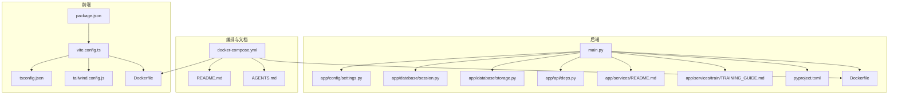
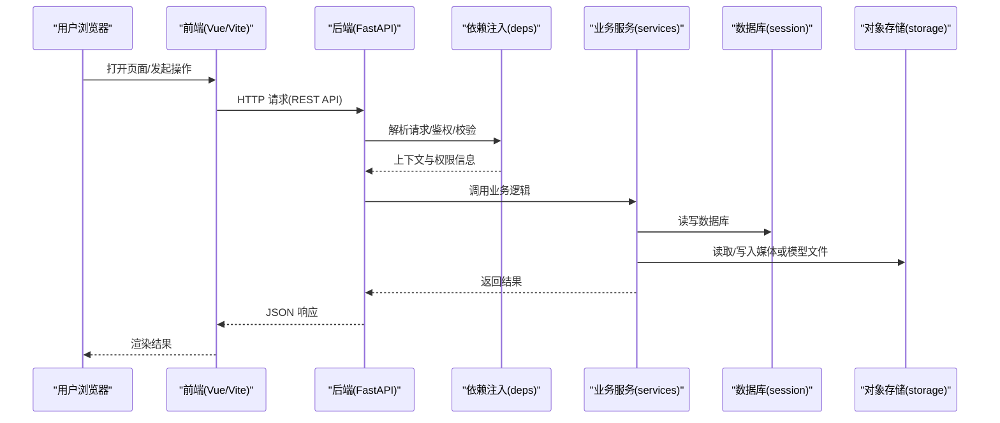
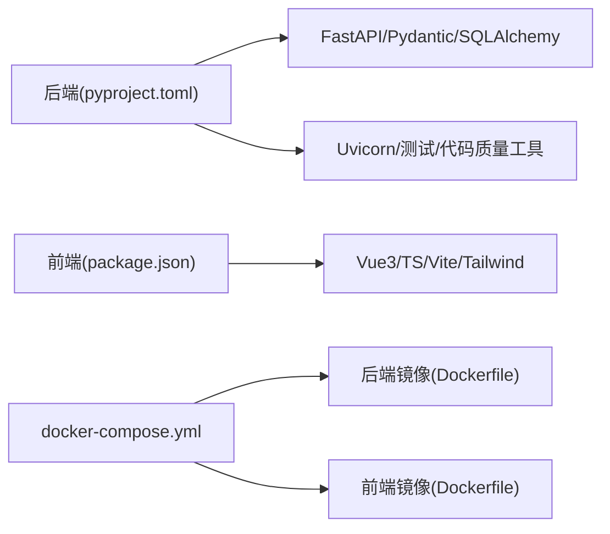

# 开发与贡献

<cite>
**本文引用的文件**   
- [README.md](file://README.md)
- [AGENTS.md](file://AGENTS.md)
- [docker-compose.yml](file://docker-compose.yml)
- [backend/pyproject.toml](file://backend/pyproject.toml)
- [backend/main.py](file://backend/main.py)
- [backend/app/config/settings.py](file://backend/app/config/settings.py)
- [backend/app/core/logger.py](file://backend/app/core/logger.py)
- [backend/app/database/session.py](file://backend/app/database/session.py)
- [backend/app/database/storage.py](file://backend/app/database/storage.py)
- [backend/app/api/deps.py](file://backend/app/api/deps.py)
- [backend/app/services/README.md](file://backend/app/services/README.md)
- [backend/app/services/train/TRAINING_GUIDE.md](file://backend/app/services/train/TRAINING_GUIDE.md)
- [frontend/package.json](file://frontend/package.json)
- [frontend/vite.config.ts](file://frontend/vite.config.ts)
- [frontend/tsconfig.json](file://frontend/tsconfig.json)
- [frontend/tailwind.config.js](file://frontend/tailwind.config.js)
- [frontend/Dockerfile](file://frontend/Dockerfile)
- [backend/Dockerfile](file://backend/Dockerfile)
</cite>

## 目录
1. [简介](#简介)
2. [项目结构](#项目结构)
3. [核心组件](#核心组件)
4. [架构总览](#架构总览)
5. [详细组件分析](#详细组件分析)
6. [依赖分析](#依赖分析)
7. [性能考虑](#性能考虑)
8. [故障排查指南](#故障排查指南)
9. [结论](#结论)
10. [附录](#附录)

## 简介
本指南面向希望参与 AI-PhotoAlbum 项目的开发者与贡献者，涵盖开发环境搭建、代码风格与命名约定、提交信息与分支管理、Issue 与 Pull Request 流程、新功能与 Bug 修复流程、版本发布管理以及社区交流与支持资源。目标是帮助你在最短的时间内完成本地开发并高质量地参与协作。

## 项目结构
本项目采用前后端分离的架构：
- 后端：基于 Python（FastAPI），提供 REST API、任务调度、AI 服务编排、数据库与对象存储访问等能力。
- 前端：基于 Vue 3 + TypeScript + Vite + TailwindCSS，提供相册浏览、搜索、人脸聚类、智能对话等交互界面。
- 容器化：通过 docker-compose 统一编排前后端与外部依赖，便于本地与 CI 环境一致运行。

图表来源
- [docker-compose.yml](file://docker-compose.yml)
- [backend/main.py](file://backend/main.py)
- [backend/app/config/settings.py](file://backend/app/config/settings.py)
- [backend/app/database/session.py](file://backend/app/database/session.py)
- [backend/app/database/storage.py](file://backend/app/database/storage.py)
- [backend/app/api/deps.py](file://backend/app/api/deps.py)
- [backend/app/services/README.md](file://backend/app/services/README.md)
- [backend/app/services/train/TRAINING_GUIDE.md](file://backend/app/services/train/TRAINING_GUIDE.md)
- [backend/pyproject.toml](file://backend/pyproject.toml)
- [backend/Dockerfile](file://backend/Dockerfile)
- [frontend/package.json](file://frontend/package.json)
- [frontend/vite.config.ts](file://frontend/vite.config.ts)
- [frontend/tsconfig.json](file://frontend/tsconfig.json)
- [frontend/tailwind.config.js](file://frontend/tailwind.config.js)
- [frontend/Dockerfile](file://frontend/Dockerfile)
- [README.md](file://README.md)
- [AGENTS.md](file://AGENTS.md)

章节来源
- [README.md](file://README.md)
- [AGENTS.md](file://AGENTS.md)
- [docker-compose.yml](file://docker-compose.yml)
- [backend/pyproject.toml](file://backend/pyproject.toml)
- [backend/main.py](file://backend/main.py)
- [backend/app/config/settings.py](file://backend/app/config/settings.py)
- [backend/app/database/session.py](file://backend/app/database/session.py)
- [backend/app/database/storage.py](file://backend/app/database/storage.py)
- [backend/app/api/deps.py](file://backend/app/api/deps.py)
- [backend/app/services/README.md](file://backend/app/services/README.md)
- [backend/app/services/train/TRAINING_GUIDE.md](file://backend/app/services/train/TRAINING_GUIDE.md)
- [frontend/package.json](file://frontend/package.json)
- [frontend/vite.config.ts](file://frontend/vite.config.ts)
- [frontend/tsconfig.json](file://frontend/tsconfig.json)
- [frontend/tailwind.config.js](file://frontend/tailwind.config.js)
- [frontend/Dockerfile](file://frontend/Dockerfile)
- [backend/Dockerfile](file://backend/Dockerfile)

## 核心组件
- 后端入口与配置
  - 应用启动入口负责挂载路由、中间件、生命周期钩子与全局异常处理。
  - 配置中心集中管理环境变量、路径、模型与第三方服务参数。
- 数据层
  - 数据库会话管理与连接池初始化。
  - 对象存储抽象，用于图片、缩略图与训练数据的持久化。
- API 层
  - 按领域划分的路由模块（相册、照片、人脸、搜索、任务、训练等）。
  - 通用依赖注入（鉴权、分页、限流、日志上下文等）。
- 服务层
  - 业务编排与算法封装（检测、聚类、向量检索、地理编码、验证码、缩略图等）。
  - 训练相关脚本与说明文档。
- 任务系统
  - 异步任务分发与执行器，支撑耗时操作（如批量检测、向量化）。
- 前端工程
  - 基于 Vite 的开发服务器与构建管线，TypeScript 类型约束，Tailwind 样式体系。
  - 模块化 API 客户端、状态管理与页面视图。

章节来源
- [backend/main.py](file://backend/main.py)
- [backend/app/config/settings.py](file://backend/app/config/settings.py)
- [backend/app/database/session.py](file://backend/app/database/session.py)
- [backend/app/database/storage.py](file://backend/app/database/storage.py)
- [backend/app/api/deps.py](file://backend/app/api/deps.py)
- [backend/app/services/README.md](file://backend/app/services/README.md)
- [backend/app/services/train/TRAINING_GUIDE.md](file://backend/app/services/train/TRAINING_GUIDE.md)
- [frontend/package.json](file://frontend/package.json)
- [frontend/vite.config.ts](file://frontend/vite.config.ts)
- [frontend/tsconfig.json](file://frontend/tsconfig.json)
- [frontend/tailwind.config.js](file://frontend/tailwind.config.js)

## 架构总览
下图展示了从浏览器到后端服务的典型请求链路，包括认证、路由、依赖注入、服务调用与数据持久化。

图表来源
- [backend/main.py](file://backend/main.py)
- [backend/app/api/deps.py](file://backend/app/api/deps.py)
- [backend/app/database/session.py](file://backend/app/database/session.py)
- [backend/app/database/storage.py](file://backend/app/database/storage.py)

## 详细组件分析

### 后端启动与配置
- 启动流程
  - 加载配置与环境变量。
  - 初始化数据库连接与对象存储客户端。
  - 注册路由、中间件与全局异常处理器。
  - 启动事件循环与热重载（开发模式）。
- 配置项
  - 数据库连接串、存储根路径、第三方服务密钥、日志级别等。
- 建议
  - 使用 .env 或容器环境变量管理敏感配置。
  - 在本地开发时开启详细日志以便定位问题。

章节来源
- [backend/main.py](file://backend/main.py)
- [backend/app/config/settings.py](file://backend/app/config/settings.py)

### 数据层：数据库与会话
- 会话管理
  - 连接池初始化、事务边界与连接释放。
- 最佳实践
  - 每个请求创建独立会话，避免跨请求共享连接。
  - 显式关闭会话并在异常路径确保清理。

章节来源
- [backend/app/database/session.py](file://backend/app/database/session.py)

### 数据层：对象存储
- 功能范围
  - 上传、下载、删除与元数据管理。
- 扩展点
  - 可替换为不同云厂商 SDK，保持接口稳定。
- 注意事项
  - 大文件分块上传与断点续传需结合任务系统。

章节来源
- [backend/app/database/storage.py](file://backend/app/database/storage.py)

### API 层：依赖注入与通用能力
- 职责
  - 鉴权、权限校验、分页、限流、请求追踪、错误格式化。
- 使用方式
  - 在路由函数中通过依赖注入获取当前用户、租户、分页参数等。
- 规范
  - 所有对外接口必须包含输入校验与错误码定义。

章节来源
- [backend/app/api/deps.py](file://backend/app/api/deps.py)

### 服务层：业务编排与算法封装
- 组织方式
  - 按领域拆分服务模块，保持单一职责。
- 关键服务
  - 相册、照片、人脸检测与聚类、搜索、地理编码、验证码、缩略图、训练等。
- 测试
  - 针对关键服务编写单元测试与集成测试，覆盖异常路径。

章节来源
- [backend/app/services/README.md](file://backend/app/services/README.md)

### 训练子系统
- 目标
  - 提供自定义模型训练的数据准备、训练脚本与评估流程。
- 文档
  - 训练指南包含数据格式、超参、复现实验步骤。
- 建议
  - 将训练产物与推理模型分离，避免污染生产环境。

章节来源
- [backend/app/services/train/TRAINING_GUIDE.md](file://backend/app/services/train/TRAINING_GUIDE.md)

### 任务系统：异步与可扩展
- 设计要点
  - 任务生产者与消费者解耦，支持重试与幂等。
  - 任务类型注册与动态派发。
- 适用场景
  - 批量人脸检测、向量化、缩略图生成、训练任务等。

章节来源
- [backend/app/tasks/dispatcher.py](file://backend/app/tasks/dispatcher.py)
- [backend/app/tasks/task_worker.py](file://backend/app/tasks/task_worker.py)
- [backend/app/tasks/scheduler.py](file://backend/app/tasks/scheduler.py)

### 前端工程：构建与类型
- 构建与开发
  - Vite 提供快速 HMR 与优化打包。
  - TypeScript 严格模式提升可维护性。
- 样式与主题
  - Tailwind 原子类加速 UI 开发，主题可通过配置文件扩展。
- 环境变量
  - 通过构建期变量注入后端地址与功能开关。

章节来源
- [frontend/package.json](file://frontend/package.json)
- [frontend/vite.config.ts](file://frontend/vite.config.ts)
- [frontend/tsconfig.json](file://frontend/tsconfig.json)
- [frontend/tailwind.config.js](file://frontend/tailwind.config.js)

## 依赖分析
- 后端依赖
  - 框架与工具：FastAPI、Pydantic、SQLAlchemy、Uvicorn、Ruff/Black（若启用）、pytest。
  - 运行时：Python 指定版本、可选 GPU 驱动与 CUDA 库（如需）。
- 前端依赖
  - Vue 3、TypeScript、Vite、TailwindCSS、Axios/Fetch 封装。
- 容器化
  - Docker 镜像分层优化，多阶段构建减少体积。
  - docker-compose 编排前后端与外部依赖（数据库、对象存储、缓存等）。

图表来源
- [backend/pyproject.toml](file://backend/pyproject.toml)
- [frontend/package.json](file://frontend/package.json)
- [docker-compose.yml](file://docker-compose.yml)
- [backend/Dockerfile](file://backend/Dockerfile)
- [frontend/Dockerfile](file://frontend/Dockerfile)

章节来源
- [backend/pyproject.toml](file://backend/pyproject.toml)
- [frontend/package.json](file://frontend/package.json)
- [docker-compose.yml](file://docker-compose.yml)
- [backend/Dockerfile](file://backend/Dockerfile)
- [frontend/Dockerfile](file://frontend/Dockerfile)

## 性能考虑
- 后端
  - 合理使用连接池与缓存，避免 N+1 查询。
  - 对大文件与批量任务采用异步队列与分片处理。
  - 开启压缩与静态资源缓存。
- 前端
  - 按需加载与懒路由，减少首屏体积。
  - 图片使用 WebP/AVIF 与 CDN 缓存。
  - 列表虚拟化与增量更新。
- 容器与部署
  - 合理设置 CPU/内存限制与副本数。
  - 使用健康检查与优雅停机。

[本节为通用指导，不直接分析具体文件]

## 故障排查指南
- 日志与监控
  - 统一日志格式与分级，关键路径输出结构化日志。
  - 建议接入集中式日志与指标采集。
- 常见问题
  - 数据库连接失败：检查连接串、网络策略与权限。
  - 对象存储不可用：核对密钥、桶名与区域。
  - 任务堆积：检查消费者数量与任务幂等性。
  - 前端无法访问后端：确认代理、CORS 与端口映射。
- 调试技巧
  - 后端：使用调试器附加进程、打印请求 ID 与上下文。
  - 前端：Network 面板抓包、Source Map 定位源码。

章节来源
- [backend/app/core/logger.py](file://backend/app/core/logger.py)

## 结论
遵循本指南可以显著提升团队协作效率与代码质量。建议在本地完整跑通一次端到端流程后再开始贡献；在提交 PR 前完成自测与代码审查清单；在发布前完善变更日志与回滚预案。

[本节为总结性内容，不直接分析具体文件]

## 附录

### 开发环境搭建
- 前置条件
  - 安装 Docker 与 docker-compose。
  - 安装 Node.js 与 Python 对应版本（参考仓库配置）。
- 克隆与初始化
  - 拉取仓库后进入项目根目录。
  - 复制示例配置并填写必要的环境变量。
- 启动服务
  - 使用 docker-compose 一键拉起前后端与依赖。
  - 首次启动可能需要下载基础模型与构建前端资源。
- 本地开发
  - 后端：使用 uvicorn 或 IDE 运行入口，开启热重载。
  - 前端：使用 Vite 开发服务器，自动刷新。

章节来源
- [docker-compose.yml](file://docker-compose.yml)
- [backend/main.py](file://backend/main.py)
- [frontend/vite.config.ts](file://frontend/vite.config.ts)
- [backend/pyproject.toml](file://backend/pyproject.toml)
- [frontend/package.json](file://frontend/package.json)

### 代码风格与命名约定
- 后端（Python）
  - 使用一致的缩进与行宽，遵循 PEP8。
  - 模块与包使用小写下划线，类名使用帕斯卡命名。
  - 常量全大写，变量与函数小写。
  - 类型注解与 Pydantic 模型用于输入校验。
- 前端（TypeScript/Vue）
  - 组件使用 PascalCase 文件名与标签名。
  - 变量与函数使用 camelCase，常量使用 UPPER_SNAKE_CASE。
  - 路由与页面按功能域组织，类型定义集中管理。
- 样式
  - 优先使用 Tailwind 原子类，必要时抽取可复用样式。

章节来源
- [backend/pyproject.toml](file://backend/pyproject.toml)
- [frontend/tsconfig.json](file://frontend/tsconfig.json)
- [frontend/tailwind.config.js](file://frontend/tailwind.config.js)

### 提交信息与分支管理
- 提交信息
  - 使用约定式提交：type(scope): subject
  - type 示例：feat、fix、docs、style、refactor、test、chore
  - 描述应简洁明确，必要时补充动机与影响面。
- 分支策略
  - main/master：受保护的生产分支。
  - develop：集成分支，定期合并特性分支。
  - feature/*：新功能开发。
  - fix/*：Bug 修复。
  - release/*：预发布与版本打标签。
  - hotfix/*：紧急修复。
- 合并要求
  - 至少一名审查者批准。
  - 自动化检查通过（构建、测试、Lint）。
  - 变更日志与迁移脚本齐全。

[本节为通用规范，不直接分析具体文件]

### Issue 报告与 Pull Request 流程
- 提交 Issue
  - 提供复现步骤、期望与实际行为、环境与版本信息。
  - 附上截图、日志片段或最小可复现仓库链接。
- 提交 PR
  - 关联 Issue 编号，清晰描述变更内容与影响。
  - 新增或更新测试用例，保证覆盖率。
  - 遵循代码风格与命名约定。
- 代码审查标准
  - 可读性与可维护性优先。
  - 无未处理的异常与潜在泄漏。
  - 安全与性能风险已评估。

[本节为通用流程，不直接分析具体文件]

### 新功能开发与 Bug 修复流程
- 新功能
  - 需求澄清与技术方案评审。
  - 拆分任务与里程碑，逐步交付可验证增量。
  - 同步更新文档与示例。
- Bug 修复
  - 复现与根因分析，回归测试覆盖。
  - 评估影响面与回滚方案。
  - 修复后在 staging 环境验证。

[本节为通用流程，不直接分析具体文件]

### 版本发布管理
- 版本号
  - 遵循语义化版本：主版本.次版本.修订号。
- 发布清单
  - 变更日志、兼容性说明、升级指引与回滚步骤。
- 流水线
  - 自动化构建、扫描、测试与制品归档。
  - 灰度发布与金丝雀策略。

[本节为通用流程，不直接分析具体文件]

### 社区交流与技术支持
- 讨论与反馈
  - 使用 Issue 与 Discussion 进行问题反馈与需求收集。
- 文档与知识库
  - 阅读 README 与 AGENTS 文档了解整体设计与使用方式。
- 贡献渠道
  - 提交 PR、参与代码审查与文档改进。

章节来源
- [README.md](file://README.md)
- [AGENTS.md](file://AGENTS.md)